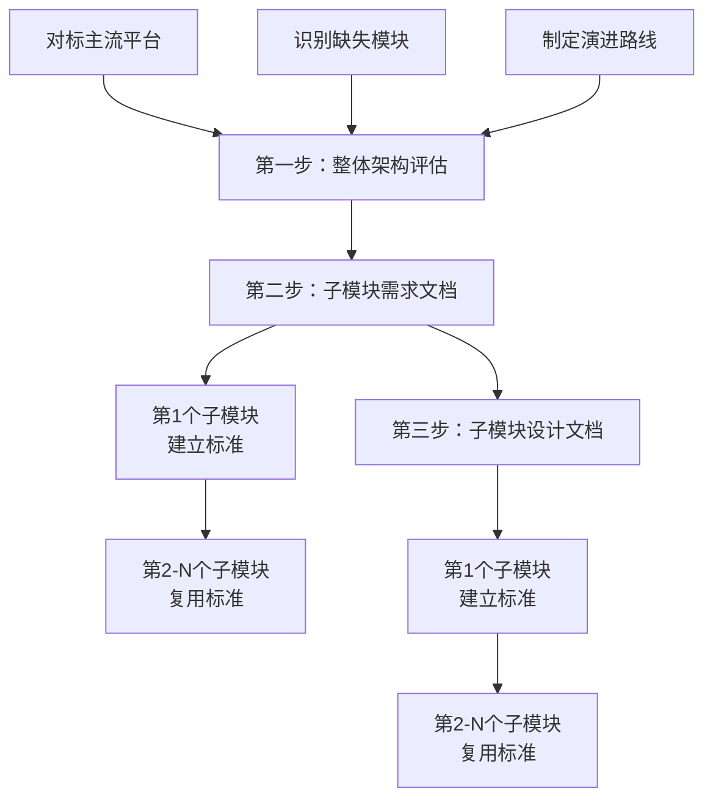

# 需求文档与设计文档规范

生成或编写**需求文档**、**设计文档**时遵循本规范。适用于：新功能规划、接口设计、页面设计、模块实现等需正式文档产出的场景。

---

## 1. 文档类型与产出要求

| 文档类型     | 说明                                 | 必含内容                                                     |
| ------------ | ------------------------------------ | ------------------------------------------------------------ |
| **需求文档** | 定义功能目标、用户故事、验收标准     | 用例图、活动图、状态图（若涉及状态流转）                     |
| **设计文档** | 定义技术方案、模块划分、数据流、部署 | 类图、时序图、组件图、部署图；若业务复杂，补充状态图、活动图 |

---

## 2. 必含的 7 类图

生成需求文档或设计文档时，**必须**按适用场景包含以下图（可用 Mermaid 或 PlantUML 等）：

| 图类型     | 用途                      | 适用文档  | 典型场景                         |
| ---------- | ------------------------- | --------- | -------------------------------- |
| **用例图** | 角色与用例关系、系统边界  | 需求文档  | 功能范围、谁用什么功能           |
| **类图**   | 实体、DTO、领域模型及关系 | 设计文档  | 数据结构、模块依赖               |
| **时序图** | 调用顺序、消息流          | 设计文档  | API 调用、前后端交互、服务间调用 |
| **组件图** | 模块/包划分与依赖         | 设计文档  | 架构分层、包结构                 |
| **部署图** | 运行环境、节点、部署关系  | 设计文档  | 服务部署、环境拓扑               |
| **状态图** | 状态及转换条件            | 需求/设计 | 订单状态、审批流、业务状态机     |
| **活动图** | 流程、分支、并行          | 需求文档  | 业务流程、操作步骤               |

**选图原则**：不强行凑图；若某图对当前场景无实际帮助，可省略并**在文档中说明省略原因**。

---

## 3. 文字描述规范（精准）

- **术语统一**：同一概念全文使用同一术语，避免混用（如「用户」与「会员」二选一）。
- **主谓宾完整**：每句有明确主语、谓语、宾语，避免模糊表述。
- **量化优先**：能用数字的用数字（如「3 秒内」「最多 100 条」），避免「较快」「较多」。
- **禁止歧义**：如「支持 A 和 B 的 C」需明确是「(A 和 B) 的 C」还是「A 和 (B 的 C)」。
- **引用准确**：引用代码、接口、表名时使用准确标识（如 `GET /api/xxx`、`sys_user`）。

---

## 4. 逻辑严谨性要求

- **因果清晰**：先因后果，条件与结论一一对应；若存在多分支，穷举或说明「其它情况」。
- **前后一致**：需求与设计、图与文字、各章节之间不得矛盾。
- **边界明确**：说明前置条件、后置条件、异常路径、超时/失败处理。
- **可验证**：验收标准可操作、可测试，避免「体验良好」「性能优秀」等主观描述。
- **层级分明**：先总体后局部，先概念后细节；章节编号与层级清晰。

---

## 5. 文档结构标准（必须遵守）

### 5.1 需求文档标准结构（11 章节）

需求文档必须包含以下 11 个章节，章节编号必须连续且正确：

```
1. 概述
   1.1 背景
   1.2 目标
   1.3 范围

2. 角色与用例
   - 用例图（Mermaid）
   - 角色说明表

3. 业务流程
   3.1 核心流程1（活动图）
   3.2 核心流程2（活动图）
   3.3 核心流程3（活动图）
   ...（根据实际需要，至少3个流程图）

4. 状态说明
   4.1 状态机图（Mermaid stateDiagram-v2）
   4.2 状态说明表

5. 现有功能详述
   5.1 接口清单（标注权限状态：⚠️ 无 或 ✅ 有）
   5.2 核心方法清单
   5.3 业务规则详述（计算规则、限制规则等）

6. 现有逻辑不足分析
   6.1 P0 级缺陷（阻塞性）
   6.2 P1 级缺陷（高优先级）
   6.3 P2 级缺陷（中优先级）
   6.4 P3 级缺陷（低优先级）

7. 市面主流系统对标
   7.1 功能对比矩阵（对标 3-4 个竞品）
   7.2 差距总结

8. 跨模块缺陷
   X-1、X-2、X-3...（按需列举）

9. 验收标准
   9.1 现有功能验收
   9.2 待修复验收

10. 演进建议与待办
    10.1 第一阶段：安全基线修复
    10.2 第二阶段：功能完善
    10.3 第三阶段：架构优化

11. 非功能需求
    11.1 性能要求
    11.2 可靠性要求
    11.3 安全性要求
    11.4 可维护性要求
```

**关键要点**：

- 章节编号必须从 1 到 11 连续，不能跳号或重复
- 第 5 章必须包含接口清单，即使是纯内部服务也要说明
- 第 7 章功能对比矩阵是必需的，对标至少 3 个竞品
- 第 6 章缺陷分析必须按 P0-P3 分级
- 第 8 章跨模块缺陷独立成章，不与第 6 章混淆

### 5.2 设计文档标准结构（14 章节）

设计文档必须包含以下 14 个章节：

```
1. 概述
   1.1 设计目标
   1.2 约束条件
   1.3 技术选型

2. 架构与模块
   - 组件图（Mermaid）
   - 模块职责说明

3. 领域/数据模型
   - 类图（Mermaid classDiagram）
   - 实体关系说明

4. 核心流程时序
   4.1 流程1时序图
   4.2 流程2时序图
   4.3 流程3时序图
   ...（至少3个时序图）

5. 状态与流程
   5.1 状态机实现
   5.2 流程控制

6. 部署架构
   - 部署图（Mermaid）
   - 部署说明

7. 缺陷改进方案
   7.1 P0级缺陷修复方案
   7.2 P1级缺陷修复方案
   7.3 P2级缺陷修复方案

8. 架构改进方案
   8.1 改进方案1
   8.2 改进方案2
   ...

9. 接口设计
   9.1 HTTP接口
   9.2 内部接口
   9.3 事件接口

10. 数据库设计
    10.1 表结构
    10.2 索引设计
    10.3 数据迁移

11. 缓存设计
    11.1 缓存策略
    11.2 缓存更新
    11.3 缓存失效

12. 安全设计
    12.1 认证授权
    12.2 数据加密
    12.3 审计日志

13. 性能优化
    13.1 查询优化
    13.2 并发控制
    13.3 资源管理

14. 测试策略
    14.1 单元测试
    14.2 集成测试
    14.3 性能测试
```

**关键要点**：

- 设计文档比需求文档更详细，章节更多
- 必须包含具体的技术实现方案和代码示例
- 缺陷改进方案要给出具体代码
- 接口设计要包含完整的请求/响应示例

---

## 6. 图的表达规范

- **图须有标题**：置于图上方或下方，格式如「图 1：XXX 用例图」。
- **图须有说明**：图中关键元素在正文中解释，不依赖「读图自明」。
- **与正文一致**：图中命名、关系须与文字描述一致，禁止图文不符。

---

## 7. 触发与适用

- **何时遵循**：用户要求生成需求文档、设计文档，或对 `docs/**`、`**/docs/**` 下的文档进行编写/补充时。
- **可省略场景**：纯修复、小改动、内部备忘类文档；若用户明确不需完整文档，可简化执行。

---

## 8. 文件命名规范

- **强制小写**：`docs/` 目录下新建的文档文件名必须全部使用小写字母，单词之间用连字符 `-` 分隔。
  - ✅ `payment-service-design.md`、`commission-requirements.md`
  - ❌ `PAYMENT_SERVICE_DESIGN.md`、`Commission_Requirements.md`
- **已有文件**：历史遗留的大写文件名不强制重命名，但新增文档必须遵循小写规范。
- **目录名**：同样使用小写 + 连字符，如 `docs/archive/`、`docs/e2e-tests/`。

---

## 9. 文档目录归类规范

新建需求文档或设计文档时，必须按文档类型放入对应子目录，禁止直接堆放在 `docs/` 根目录：

| 文档类型 | 目录                 | 示例                                                 |
| -------- | -------------------- | ---------------------------------------------------- |
| 需求文档 | `docs/requirements/` | `docs/requirements/payment-service-requirements.md`  |
| 设计文档 | `docs/design/`       | `docs/design/payment-notification-service-design.md` |

- **已有文件**：历史遗留在 `docs/` 根目录的文档不强制迁移，但新增文档必须归类。
- **跨文档引用**：使用相对路径引用，如设计文档引用需求文档：`[需求文档](../requirements/xxx.md)`。
- **其他类型**：测试指南放 `docs/testing/`，部署指南放 `docs/deployment/`，归档文档放 `docs/archive/`。按需创建子目录，保持一致性即可。
- **模块对齐**：当文档针对特定模块时，优先在对应类型目录下创建与 `src/module/` 同构的子路径。例如 `store/distribution` 模块的设计文档放 `docs/design/store/distribution/`，需求文档放 `docs/requirements/store/distribution/`。这样文档与代码一一对应，便于查找。

---

## 10. 缺陷分析前置检查规范

编写需求文档或设计文档中的「缺陷分析」章节时，**必须先查阅项目实际代码**，禁止凭模块内部代码推断项目全局结构。

### 10.1 C 端接口缺陷检查

分析某能力域模块是否缺少 C 端接口时，必须先检查 `src/module/client/` 目录：

- 按照后端规范 §13，C 端接口统一放在 `module/client/{能力域}/` 下，而非能力域模块内部。
- 因此，在能力域模块（如 `marketing/points/`）内看不到 `client/*` Controller 是正常的，不能直接判定为缺陷。
- **必做**：检查 `src/module/client/marketing/points/` 等对应路径是否已有 C 端 Controller。

### 10.2 跨模块依赖检查

分析跨模块缺陷时，必须确认：

- 被引用的 Service/Repository 是否已通过 Module exports 正确导出
- 调用方是否通过 Module imports 正确引入
- 不能仅凭「模块 A 的代码中没有看到模块 B 的引用」就判定为缺陷

### 10.3 Mermaid 图表编码规范

Mermaid 图表中禁止使用以下特殊字符，避免编码损坏：

- 禁止使用 `→`、`←`、`≤`、`≥`、`∈` 等 Unicode 特殊符号，改用纯 ASCII 文字描述
- 禁止在节点标签中使用 `<br/>`，改用空格或换行
- 节点标签中避免使用 `<`、`>` 符号，改用「大于」「小于」等文字

---

## 11. 文档编写最佳实践

### 11.1 分段写入策略（必须遵守）

编写长文档（>50行）时，必须使用分段写入策略，避免工具限制导致的写入失败。

**规则**：

- fsWrite 单次写入限制：50行
- 超过50行必须使用 fsWrite + fsAppend 组合

**步骤**：

1. 使用 fsWrite 创建文件并写入核心内容（<50行）
2. 使用 fsAppend 追加详细内容
3. 每次追加控制在合理范围内（建议<100行）

**示例**：

```typescript
// 第一步：写入主要章节（<50行）
fsWrite(
  'requirements.md',
  `
# 模块名称 - 需求文档

## 1. 概述
### 1.1 背景
### 1.2 目标
### 1.3 范围

## 2. 角色与用例
## 3. 业务流程
`,
);

// 第二步：追加详细内容
fsAppend(
  'requirements.md',
  `
## 4. 状态说明
...详细内容...

## 5. 功能需求
...详细内容...
`,
);

// 第三步：继续追加
fsAppend(
  'requirements.md',
  `
## 6. 非功能需求
...详细内容...
`,
);
```

### 11.2 文档质量检查清单

编写完成后必须自检以下项目：

**结构完整性**：

- [ ] 包含所有必需章节（需求文档6章节，设计文档14章节）
- [ ] 包含所有必需图表（7类图按需包含）
- [ ] 章节编号正确且连续
- [ ] 目录结构清晰

**内容准确性**：

- [ ] 术语统一（同一概念使用同一术语）
- [ ] 数据准确（接口路径、表名、字段名等）
- [ ] 逻辑严谨（因果关系清晰，无矛盾）
- [ ] 图文一致（图表与文字描述一致）

**规范遵循**：

- [ ] 文件名小写+连字符
- [ ] 目录归类正确（requirements/design分离）
- [ ] Mermaid使用纯ASCII字符（无→、≤等符号）
- [ ] 缺陷分析有优先级（P0-P3分级）

**缺陷分析**：

- [ ] 对照代码检查（不凭假设）
- [ ] 对照规范检查（后端开发规范）
- [ ] 跨模块依赖检查（检查exports/imports）
- [ ] 性能问题识别（N+1查询、深分页等）

### 11.3 批量文档编写流程

编写多个模块文档时，遵循渐进式流程以提高效率：

**第一个模块**（建立标准，耗时约2小时）：

1. 详细阅读代码（Controller、Service、Repository、DTO）
2. 完整编写需求文档（包含所有章节和图表）
3. 完整编写设计文档（包含所有章节和图表）
4. 建立文档模板和质量标准
5. 确认工作流程

**后续模块**（复用标准，耗时约30-45分钟）：

1. 快速浏览代码（使用readMultipleFiles批量读取）
2. 复用文档结构（章节、图表类型）
3. 仅修改业务内容（保持格式一致）
4. 保持一致性（术语、风格、深度）

**效率提升**：

- 第1个模块：120分钟（建立标准）
- 第2-5个：60分钟（效率+50%）
- 第6-10个：45分钟（效率+62%）
- 第11个以后：35分钟（效率+71%）

**质量控制**：

- 每5-10个模块验收一次
- 检查一致性和完整性
- 及时调整方向

### 11.4 缺陷分析深度要求

缺陷分析必须包含4个优先级，每个缺陷必须包含现状、影响、建议：

**P0级缺陷**（阻塞性，必须立即修复）：

- 影响核心功能（如认证失败、数据丢失）
- 导致数据不一致（如事务缺失、并发问题）
- 安全漏洞（如权限绕过、SQL注入）
- 租户隔离缺失（多租户系统）

**P1级缺陷**（高优先级，近期必须修复）：

- 性能问题（如N+1查询、深分页、KEYS命令）
- 功能缺失（如缺少日志归档、缺少超时控制）
- 用户体验差（如错误提示不明确）
- 可维护性差（如God Class、硬编码）

**P2级缺陷**（中优先级，计划修复）：

- 功能不完善（如缺少通知、缺少统计）
- 扩展性不足（如不支持依赖关系）
- 维护性差（如缺少文档、缺少测试）
- 代码质量（如重复代码、魔法数字）

**P3级缺陷**（低优先级，优化建议）：

- 优化建议（如可以使用缓存）
- 增强功能（如可以支持批量操作）
- 技术债务（如可以重构）
- 用户体验优化（如可以添加快捷键）

**每个缺陷必须包含**：

```markdown
### P0级缺陷（阻塞性）

1. **缺陷标题**
   - 现状：当前实现情况的客观描述
   - 影响：对系统、用户、业务的具体影响
   - 建议：具体的改进方案和实施步骤
```

### 11.5 工具使用最佳实践

**批量读取文件**（减少工具调用次数）：

```typescript
// ✅ 推荐：一次读取多个文件
readMultipleFiles(['controller.ts', 'service.ts', 'repository.ts', 'dto/create-dto.ts', 'module.ts']);

// ❌ 不推荐：多次单独读取
readFile('controller.ts');
readFile('service.ts');
readFile('repository.ts');
```

**字符串替换前先读取**（避免替换失败）：

```typescript
// ✅ 推荐：先读取确认
const content = readFile(path);
// 确认oldStr存在且完全匹配
strReplace(path, oldStr, newStr);

// ❌ 不推荐：盲目替换
strReplace(path, oldStr, newStr); // 可能因不匹配而失败
```

**追加内容优先使用fsAppend**（而非strReplace）：

```typescript
// ✅ 推荐：直接追加
fsAppend(path, newContent);

// ❌ 不推荐：查找位置再替换
strReplace(path, oldStr, oldStr + newContent);
```

### 11.6 常见错误及预防

**错误1：文件写入中断**

- 原因：fsWrite内容超过50行限制
- 预防：使用fsWrite + fsAppend分段写入
- 检查：写入前确认内容行数

**错误2：字符串替换失败**

- 原因：oldStr与实际内容不匹配
- 预防：先用readFile读取确认
- 检查：确保oldStr完全匹配（包括空格、换行）

**错误3：图表渲染失败**

- 原因：使用了Unicode特殊字符（→、≤等）
- 预防：仅使用纯ASCII字符
- 检查：搜索并替换特殊字符

**错误4：缺陷分析不准确**

- 原因：未检查跨模块代码
- 预防：检查client/目录、Module exports
- 检查：对照后端开发规范验证

---

## 12. 文档维护规范

### 12.1 文档更新时机

**必须更新文档**：

- 新增模块或功能
- 重大功能变更
- 架构调整
- 接口变更（路径、参数、响应）
- 数据模型变更

**建议更新文档**：

- 性能优化（如添加索引、缓存）
- 重要缺陷修复
- 代码重构（如拆分Service）

### 12.2 文档版本管理

**版本号规则**：

- 主版本号：重大变更（如架构调整）
- 次版本号：功能变更（如新增接口）
- 修订号：小改动（如修复错误）

**变更记录**：

```markdown
---

**文档版本**: 1.2.1  
**编写日期**: 2026-02-23  
**最后更新**: 2026-03-15  
**变更记录**:

- v1.2.1 (2026-03-15): 修复缺陷分析中的错误
- v1.2.0 (2026-03-01): 新增批量导出接口
- v1.1.0 (2026-02-25): 优化查询性能
- v1.0.0 (2026-02-23): 初始版本
```

### 12.3 文档归档策略

**归档时机**：

- 模块废弃或下线
- 重大重构后旧文档
- 历史版本文档

**归档位置**：

- `docs/archive/YYYY-MM/` 按月归档
- 保留原目录结构
- 添加归档说明文件

---

## 13. 大模块文档编写流程（先整体后子模块）

### 13.1 适用场景

当需要开发一个包含多个子模块的大模块时（如 finance、marketing、store 等），必须遵循"先整体后子模块"的文档编写流程。

**典型场景**：

- 新建大模块（如 finance、marketing、order、product）
- 大模块重构或架构升级
- 大模块功能完整性评估

### 13.2 文档编写顺序



### 13.3 第一步：整体架构评估文档

**文档名称**：`{module}-overall-analysis.md`

**存放位置**：`docs/requirements/{module}/{module}-overall-analysis.md`

**文档结构**（10 章节）：

```
1. 概述
   1.1 背景（现有子模块列表）
   1.2 评估目标
   1.3 评估方法

2. 主流平台对标
   2.1 功能对比矩阵（对标 3-6 个竞品）
   2.2 差距总结（按 P0-P3 分级）

3. 业务场景覆盖度评估
   3.1 完整业务链路（Mermaid 流程图）
   3.2 现有模块覆盖度（百分比评估）

4. 缺失模块详细分析
   4.1 P0 级缺失模块（业务价值、核心功能、技术要点、工时）
   4.2 P1 级缺失模块
   4.3 P2 级缺失模块
   4.4 P3 级缺失模块

5. 架构完整性评估
   5.1 现有架构优势
   5.2 现有架构不足
   5.3 建议的目标架构（Mermaid 架构图）

6. 演进路线图
   6.1 第一阶段：P0 级核心能力建设
   6.2 第二阶段：P1 级能力增强
   6.3 第三阶段：P2 级功能完善
   6.4 第四阶段：P3 级增强（按需）

7. 实施优先级与资源评估
   7.1 优先级矩阵（Mermaid 四象限图）
   7.2 资源需求评估（人力、技能）
   7.3 成本估算（开发成本、基础设施成本）

8. 风险与挑战
   8.1 技术风险（高并发、数据一致性、性能瓶颈）
   8.2 业务风险（作弊、成本失控、用户体验）
   8.3 项目风险（进度、人员）

9. 总结与建议
   9.1 现状总结
   9.2 核心建议（短期、中期、长期）
   9.3 架构建议
   9.4 实施建议
   9.5 成功标准

10. 附录
    10.1 参考资料
    10.2 术语表
    10.3 相关文档
```

**关键要点**：

- 必须对标至少 3 个主流平台（电商平台或 SaaS 平台）
- 功能对比矩阵必须全面（覆盖所有核心功能点）
- 缺失模块必须按 P0-P3 分级，每个模块包含业务价值、核心功能、技术要点、工时估算
- 演进路线图必须分阶段，每个阶段有明确的里程碑和验收标准
- 资源评估必须包含人力需求、技能要求、成本估算
- 风险分析必须包含技术风险、业务风险、项目风险及应对措施

**示例文档**：

- `docs/requirements/finance/finance-overall-analysis.md`
- `docs/requirements/marketing/marketing-overall-analysis.md`

### 13.4 第二步：子模块需求文档

在完成整体架构评估后，按优先级编写子模块需求文档。

**编写顺序**：

1. 先编写 P0 级缺失模块的需求文档
2. 再编写现有子模块的需求文档（补充完善）
3. 最后编写 P1-P3 级缺失模块的需求文档（按需）

**文档结构**：遵循 §5.1 需求文档标准结构（11 章节）

**存放位置**：`docs/requirements/{module}/{submodule}/{submodule}-requirements.md`

**第一个子模块**（建立标准）：

- 详细阅读代码
- 完整编写 11 个章节
- 包含所有必需图表
- 建立文档模板

**后续子模块**（复用标准）：

- 复用文档结构
- 仅修改业务内容
- 保持一致性

### 13.5 第三步：子模块设计文档

在完成子模块需求文档后，编写子模块设计文档。

**编写顺序**：与需求文档保持一致

**文档结构**：遵循 §5.2 设计文档标准结构（14 章节）

**存放位置**：`docs/design/{module}/{submodule}/{submodule}-design.md`

### 13.6 整体架构评估文档编写要点

#### 13.6.1 对标平台选择

**电商平台**：

- 国内：淘宝、京东、拼多多、有赞
- 国际：Shopify、Amazon、eBay

**SaaS 平台**：

- 营销：HubSpot、Salesforce、Marketo
- 财务：Stripe、Square、PayPal
- 客服：Zendesk、Intercom

**选择原则**：

- 至少对标 3 个平台
- 优先选择行业领先平台
- 国内外平台结合
- 功能覆盖全面

#### 13.6.2 功能对比矩阵编写

**表格结构**：

| 功能模块 | 本系统   | 平台1 | 平台2 | 平台3 | 平台4 | 差距评估  |
| -------- | -------- | ----- | ----- | ----- | ----- | --------- |
| 功能1    | ✅/❌/⚠️ | ✅    | ✅    | ✅    | ✅    | 持平/缺失 |

**符号说明**：

- ✅：已有且完整
- ❌：缺失
- ⚠️：部分实现

**差距评估**：

- 持平：功能完整，与主流平台一致
- 部分（P0-P3）：部分实现，需要补充
- 缺失（P0-P3）：完全缺失，需要建设

#### 13.6.3 缺失模块分析深度

每个缺失模块必须包含：

```markdown
#### 4.1.1 模块名称（英文名）

**业务价值**：

- 价值点1
- 价值点2
- 价值点3

**核心功能**：

- 功能1
- 功能2
- 功能3

**技术要点**：

- 技术点1
- 技术点2
- 技术点3

**预估工时**：X-Y 周
```

#### 13.6.4 演进路线图编写

**每个阶段必须包含**：

- 目标：明确的阶段目标
- 建设内容：模块列表（表格形式，包含工时、优先级、依赖关系）
- 实施顺序：Mermaid 流程图
- 里程碑：时间节点和交付物
- 验收标准：可量化的验收指标

**示例**：

```markdown
### 6.1 第一阶段：P0 级核心能力建设（3-4 个月）

**目标**：补齐核心缺失模块，形成完整的业务闭环

**建设内容**：

| 模块  | 工时   | 优先级 | 依赖关系 |
| ----- | ------ | ------ | -------- |
| 模块A | 3-4 周 | P0-1   | 无       |
| 模块B | 2-3 周 | P0-2   | 模块A    |

**里程碑**：

- M1（1 个月）：模块A上线
- M2（2 个月）：模块B上线

**验收标准**：

- [ ] 功能1可用
- [ ] 功能2可用
- [ ] 性能指标达标
```

### 13.7 整体架构评估文档编写流程

**步骤1：调研主流平台**（1-2 小时）

- 使用 web_search 搜索主流平台架构资料
- 阅读官方文档、技术博客
- 整理功能清单

**步骤2：编写功能对比矩阵**（1-2 小时）

- 列出所有功能点
- 逐项对比
- 标注差距

**步骤3：分析缺失模块**（2-3 小时）

- 按 P0-P3 分级
- 每个模块详细分析
- 估算工时

**步骤4：制定演进路线图**（1-2 小时）

- 分阶段规划
- 明确里程碑
- 评估资源

**步骤5：风险分析与建议**（1 小时）

- 识别风险
- 提出应对措施
- 给出实施建议

**总耗时**：6-10 小时

### 13.8 质量检查清单

**整体架构评估文档**：

- [ ] 包含 10 个章节
- [ ] 对标至少 3 个主流平台
- [ ] 功能对比矩阵全面
- [ ] 缺失模块按 P0-P3 分级
- [ ] 每个缺失模块包含业务价值、核心功能、技术要点、工时
- [ ] 演进路线图分阶段
- [ ] 资源评估包含人力、成本
- [ ] 风险分析全面
- [ ] 包含 Mermaid 图表（业务链路、架构图、优先级矩阵）

**子模块文档**：

- [ ] 需求文档包含 11 个章节
- [ ] 设计文档包含 14 个章节
- [ ] 第一个子模块建立标准
- [ ] 后续子模块复用标准
- [ ] 文档一致性良好

---

## 14. 参考资料

### 14.1 相关规范

- 后端开发规范：`.kiro/steering/backend-nestjs.md`
- 文档编写工作流程：`.kiro/steering/documentation-workflow.md`

### 14.2 工具文档

- Mermaid语法：https://mermaid.js.org/
- Markdown规范：https://commonmark.org/

### 14.3 示例文档

**整体架构评估文档**：

- `docs/requirements/finance/finance-overall-analysis.md`
- `docs/requirements/marketing/marketing-overall-analysis.md`

**子模块需求文档**：

- `docs/requirements/finance/commission/commission-requirements.md`
- `docs/requirements/marketing/coupon/coupon-requirements.md`

**子模块设计文档**：

- `docs/design/finance/commission/commission-design.md`
- `docs/design/marketing/coupon/coupon-design.md`
