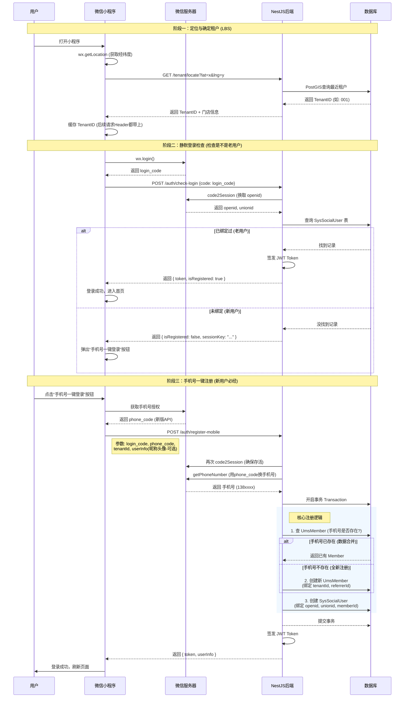

这是一个非常标准的 **“LBS定位 + 手机号一键登录”** 流程。

在微信现在的生态下，获取用户信息（头像昵称）和获取手机号是两个分开的步骤，且**获取手机号（注册）是核心**。

以下是为你定制的完整业务流程，包含 **定位定租户** -> **静默登录** -> **一键手机号注册** 的全过程。

---

### 🗺️ 核心流程图 (Mermaid Sequence Diagram)



---

### 📝 详细步骤解析

#### 1. 前置动作：定位与租户锁定

用户还没登录时，系统必须先知道他在哪，归谁管。

* **前端**：调用 `wx.getLocation` 拿到经纬度。
* **后端**：提供 `/client/tenant/locate` 接口。
  * 逻辑：`SELECT * FROM sys_tenant WHERE ST_Distance(...) < 5000 ORDER BY distance LIMIT 1`。
  * 返回：`{ tenantId: "CS001", name: "天心区直营店" }`。
* **前端**：将 `tenantId` 存入 Pinia 或 LocalStorage。**这一步不涉及账号，只涉及“场景”。**

#### 2. 静默登录 (Silent Login)

为了体验好，用户打开小程序时，后端先偷偷检查一下他是不是老熟人。

* **动作**：小程序启动时自动调用 `wx.login` 拿到 `code` 发给后端。
* **后端判断**：
  * 拿着 `code` 去微信换 `openid`。
  * 查 `SysSocialUser` 表。
  * **有** -> 直接发 Token，用户无感知直接登录。
  * **无** -> 告诉前端：“这人没注册，显示登录按钮”。

#### 3. 手机号一键注册 (One-Click Register)

这是核心转化步骤。微信目前推荐使用 **手机号快速验证组件**。

* **前端组件**：
  
  ```html
  <!-- Uniapp 写法 -->
  <button open-type="getPhoneNumber" @getphonenumber="onGetPhoneNumber">
    手机号一键登录
  </button>
  ```
* **后端处理 (`/register-mobile`)**：
  1. **解析手机号**：利用前端传来的 `code` (新版) 或 `encryptedData` (旧版) 解密出用户手机号。
  2. **防重机制 (关键)**：
     * **情况 A**：用户之前在 App 用手机号注册过，现在第一次用小程序。
       * *处理*：通过手机号查到了 `UmsMember`，**不要创建新用户**，直接在 `SysSocialUser` 插一条记录绑定 OpenID 即可。（账号合并）
     * **情况 B**：纯新用户。
       * *处理*：创建 `UmsMember` **AND** 创建 `SysSocialUser`。
  3. **写入租户与分销**：
     * 注册这一刻，把第一步获取的 `tenantId` 写入 `UmsMember` 的 `tenantId` 字段（锁定归属）。
     * 如果有推荐人 ID，也在此刻写入 `referrerId`。

---

### 💡 几个技术实现的坑与注意点

1. **微信 API 换代**：
   
   * 以前获取手机号需要 `session_key` 解密 `encryptedData`。
   * **现在 (2024)**：微信推出了新接口，按钮回调直接给你一个 `code`，后端拿这个 `code` 调微信接口直接换回手机号。**建议用新版，简单很多**。

2. **用户信息 (头像昵称)**：
   
   * **注意**：现在微信小程序**不能**通过 API 自动获取用户真实的昵称和头像了（`getUserProfile` 接口已被回收）。
   * **解决方案**：
     1. 注册时，先给用户生成一个默认昵称（如：“微信用户_89757”）和默认头像。
     2. 登录成功后，在“个人中心”提供一个按钮，让用户**手动选择**微信头像和昵称进行同步（或者用户自己上传）。

3. **UnionID 的重要性**：
   
   * 在注册环节，后端调用微信接口时，一定要确保能拿到 `UnionID`（前提是你把小程序绑定到了微信开放平台）。
   * 如果没有 `UnionID`，以后做 App 登录时，就没法识别出这是同一个用户了。

4. **事务 (Transaction)**：
   
   * 注册由两步组成（创建 Member + 创建 SocialUser）。
   * **必须使用 Prisma 的 `$transaction`**。否则如果 Member 创建成功了，但绑定微信失败了，就会产生脏数据，导致用户下次无法注册（提示手机号已存在）。

### 后端 DTO 示例 (数据传输对象)

```typescript
// register-mobile.dto.ts
export class RegisterMobileDto {
  @IsString()
  loginCode: string; // 用于换 openid

  @IsString()
  phoneCode: string; // 用于换手机号 (新版微信API)

  @IsString()
  tenantId: string; // 当前定位到的租户ID

  @IsString()
  @IsOptional()
  referrerId?: string; // 推荐人ID (如果有)

  @IsObject()
  @IsOptional()
  userInfo?: { // 前端传来的头像昵称(如果有)
     nickName: string;
     avatarUrl: string;
  }
}
```
