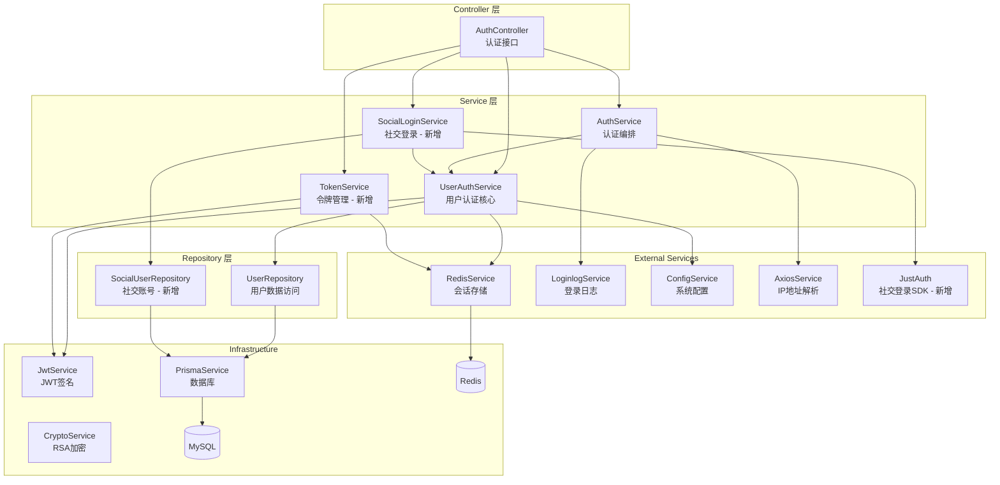
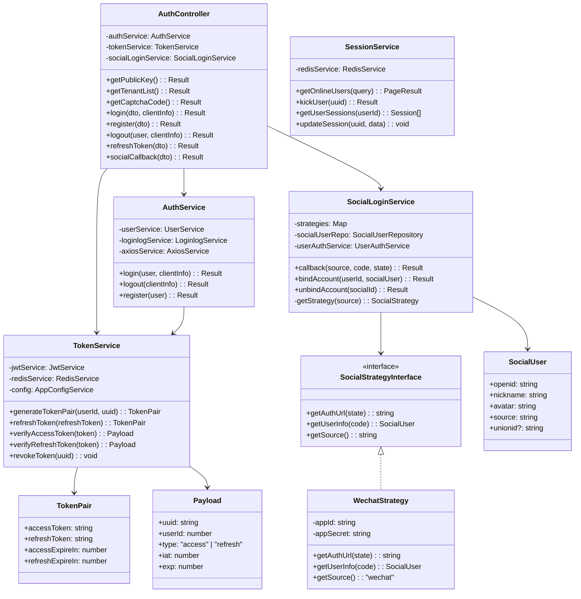
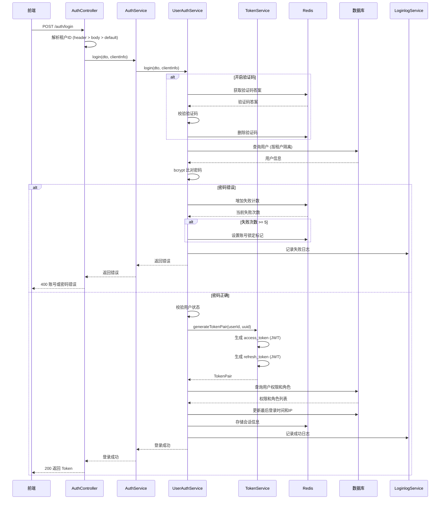
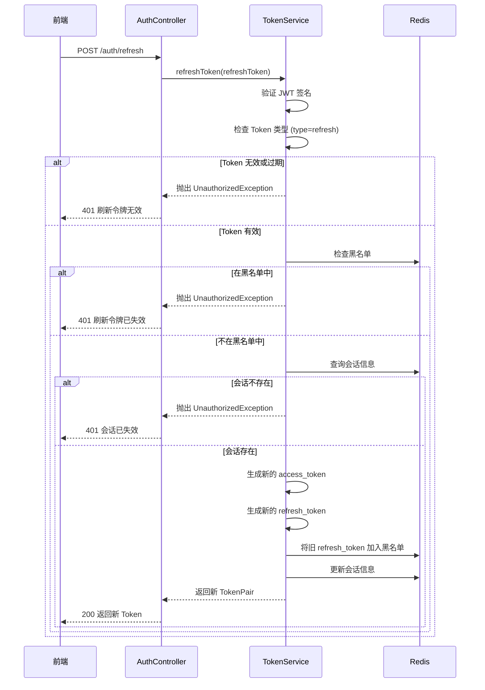
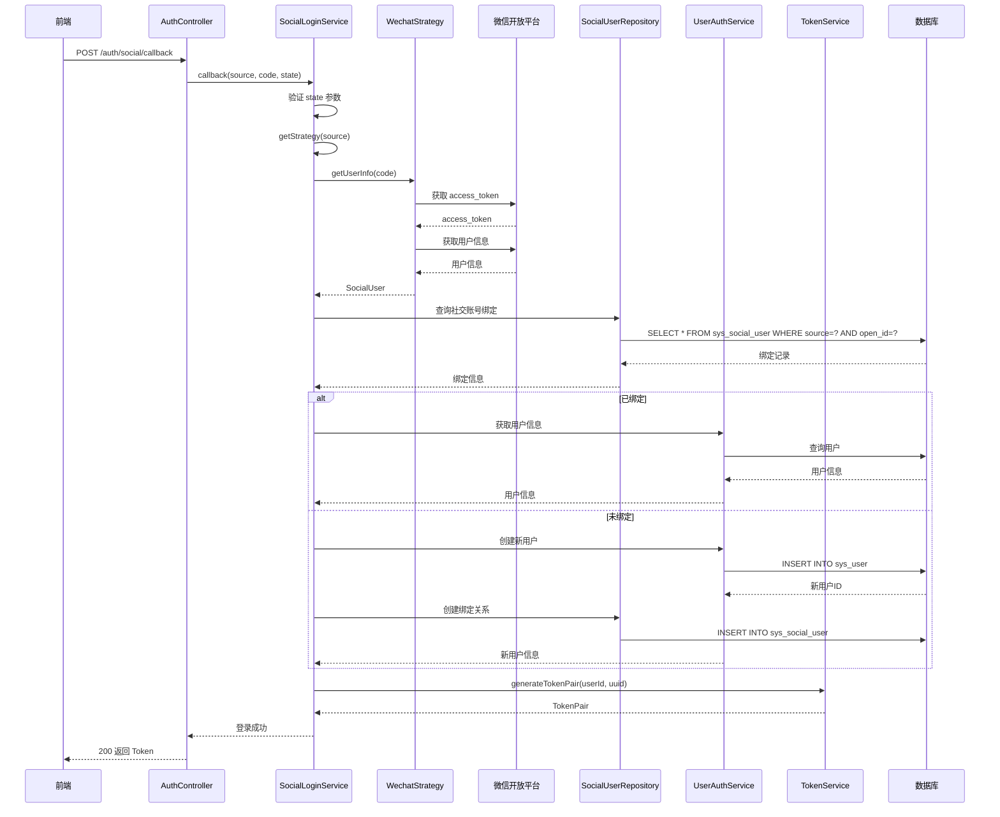
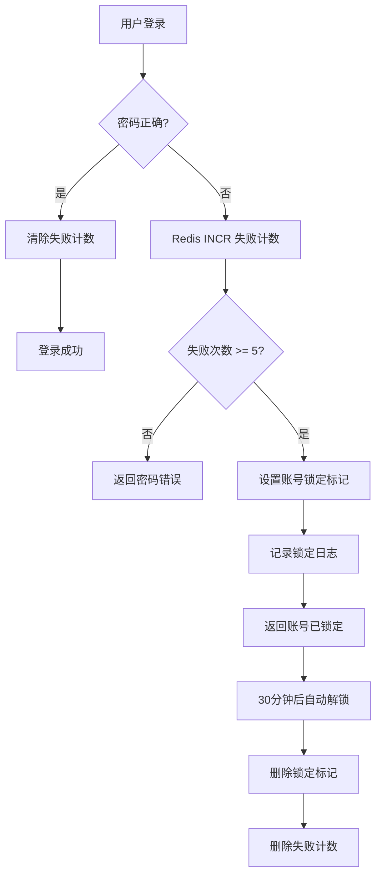

# 认证模块 (Admin Auth) — 设计文档

> 版本：1.0  
> 日期：2026-02-22  
> 状态：草案  
> 关联需求：[auth-requirements.md](../../../requirements/admin/auth/auth-requirements.md)

---

## 1. 概述

### 1.1 设计目标

认证模块是后台管理系统的安全入口，本设计文档旨在：

1. 梳理现有认证流程的技术实现细节
2. 设计刷新令牌机制，提升用户体验
3. 设计社交登录架构，支持多平台接入
4. 设计会话管理机制，增强安全性和可运维性
5. 为后续企业级认证（SSO、OAuth2.0）预留扩展点

### 1.2 设计约束

- 基于现有的 NestJS + Prisma + Redis 技术栈
- 兼容现有的 JWT Token 机制
- 不引入新的中间件或存储系统
- 保持与前端（Soybean Admin）的 API 契约一致
- 支持多租户隔离

### 1.3 设计原则

- 安全优先：所有认证操作必须记录日志，敏感信息加密存储
- 无状态优先：Token 自包含用户信息，减少数据库查询
- 幂等性：退出登录、刷新令牌等操作必须幂等
- 可扩展：使用策略模式支持多种认证方式
- 可观测：关键操作记录 traceId，便于问题排查

---

## 2. 架构与模块

### 2.1 模块划分

> 图 1：认证模块组件图



### 2.2 目录结构

```
src/module/admin/auth/
├── dto/
│   ├── auth.dto.ts                 # Soybean 前端格式的 DTO
│   ├── login.dto.ts                # 内部使用的登录 DTO
│   ├── register.dto.ts             # 内部使用的注册 DTO
│   ├── refresh-token.dto.ts        # 刷新令牌 DTO (新增)
│   └── index.ts
├── vo/
│   ├── auth.vo.ts                  # 认证响应 VO
│   ├── online-user.vo.ts           # 在线用户 VO (新增)
│   └── index.ts
├── services/
│   ├── token.service.ts            # 令牌管理服务 (新增)
│   ├── social-login.service.ts     # 社交登录服务 (新增)
│   └── session.service.ts          # 会话管理服务 (新增)
├── strategies/
│   ├── social-strategy.interface.ts # 社交登录策略接口 (新增)
│   ├── wechat.strategy.ts          # 微信登录策略 (新增)
│   ├── dingtalk.strategy.ts        # 钉钉登录策略 (新增)
│   └── index.ts
├── guards/
│   ├── account-lock.guard.ts       # 账号锁定守卫 (新增)
│   └── index.ts
├── auth.constant.ts                # 常量定义
├── auth.controller.ts              # 认证控制器
├── auth.service.ts                 # 认证服务
├── auth.module.ts                  # 模块配置
└── README.md                       # 模块文档
```

### 2.3 依赖关系

```
AuthModule
├── imports
│   ├── SystemModule (UserService, ConfigService)
│   ├── MonitorModule (LoginlogService)
│   ├── CommonModule (RedisService, AxiosService, CryptoService)
│   └── JwtModule (JwtService)
├── controllers
│   └── AuthController
├── providers
│   ├── AuthService
│   ├── TokenService (新增)
│   ├── SocialLoginService (新增)
│   ├── SessionService (新增)
│   └── AccountLockGuard (新增)
└── exports
    ├── AuthService
    └── TokenService (新增)
```

---

## 3. 领域/数据模型

### 3.1 核心实体类图

> 图 2：认证模块类图



### 3.2 数据库表结构

#### 3.2.1 现有表

```sql
-- 用户表 (已存在)
CREATE TABLE sys_user (
  user_id       BIGINT PRIMARY KEY AUTO_INCREMENT,
  tenant_id     VARCHAR(20) NOT NULL DEFAULT '000000',
  user_name     VARCHAR(30) NOT NULL,
  nick_name     VARCHAR(30) NOT NULL,
  password      VARCHAR(100) NOT NULL COMMENT 'bcrypt 加密',
  status        CHAR(1) DEFAULT '0' COMMENT '0=正常 1=停用',
  del_flag      CHAR(1) DEFAULT '0' COMMENT '0=正常 2=删除',
  login_ip      VARCHAR(128),
  login_date    DATETIME,
  create_time   DATETIME DEFAULT CURRENT_TIMESTAMP,
  update_time   DATETIME DEFAULT CURRENT_TIMESTAMP ON UPDATE CURRENT_TIMESTAMP,
  UNIQUE KEY uk_tenant_username (tenant_id, user_name),
  INDEX idx_tenant_status (tenant_id, status, del_flag)
);

-- 社交用户表 (已存在)
CREATE TABLE sys_social_user (
  id            BIGINT PRIMARY KEY AUTO_INCREMENT,
  user_id       BIGINT COMMENT '关联的系统用户ID',
  member_id     BIGINT COMMENT '关联的会员ID',
  uuid          VARCHAR(64) NOT NULL,
  source        VARCHAR(20) NOT NULL COMMENT '平台来源',
  access_token  VARCHAR(255),
  expire_in     INT,
  refresh_token VARCHAR(255),
  open_id       VARCHAR(64),
  uid           VARCHAR(64),
  access_code   VARCHAR(255),
  union_id      VARCHAR(64),
  scope         VARCHAR(255),
  token_type    VARCHAR(20),
  id_token      VARCHAR(255),
  mac_algorithm VARCHAR(20),
  mac_key       VARCHAR(255),
  code          VARCHAR(255),
  oauth_token   VARCHAR(255),
  oauth_token_secret VARCHAR(255),
  create_time   DATETIME DEFAULT CURRENT_TIMESTAMP,
  update_time   DATETIME DEFAULT CURRENT_TIMESTAMP ON UPDATE CURRENT_TIMESTAMP,
  UNIQUE KEY uk_source_openid (source, open_id),
  INDEX idx_user_id (user_id),
  INDEX idx_member_id (member_id)
);

-- 登录日志表 (已存在)
CREATE TABLE sys_loginlog (
  info_id       BIGINT PRIMARY KEY AUTO_INCREMENT,
  tenant_id     VARCHAR(20),
  user_name     VARCHAR(50),
  ipaddr        VARCHAR(128),
  login_location VARCHAR(255),
  browser       VARCHAR(50),
  os            VARCHAR(50),
  device_type   VARCHAR(20),
  status        CHAR(1) COMMENT '0=成功 1=失败',
  msg           VARCHAR(255),
  login_time    DATETIME,
  INDEX idx_tenant_time (tenant_id, login_time),
  INDEX idx_username (user_name)
);
```

#### 3.2.2 新增表（建议）

```sql
-- 密码历史表 (新增，用于防止重复使用旧密码)
CREATE TABLE sys_password_history (
  id            BIGINT PRIMARY KEY AUTO_INCREMENT,
  user_id       BIGINT NOT NULL,
  password      VARCHAR(100) NOT NULL COMMENT 'bcrypt 加密',
  create_time   DATETIME DEFAULT CURRENT_TIMESTAMP,
  INDEX idx_user_id (user_id),
  INDEX idx_create_time (create_time)
);

-- 账号锁定记录表 (新增，用于记录锁定历史)
CREATE TABLE sys_account_lock (
  id            BIGINT PRIMARY KEY AUTO_INCREMENT,
  user_id       BIGINT NOT NULL,
  lock_reason   VARCHAR(255) COMMENT '锁定原因',
  lock_time     DATETIME NOT NULL,
  unlock_time   DATETIME COMMENT '解锁时间',
  unlock_type   VARCHAR(20) COMMENT 'AUTO=自动 MANUAL=手动',
  unlock_by     VARCHAR(50) COMMENT '解锁人',
  INDEX idx_user_id (user_id),
  INDEX idx_lock_time (lock_time)
);
```

### 3.3 Redis 数据结构

#### 3.3.1 会话存储

```typescript
// Key: login_tokens:{uuid}
// TTL: access_token 有效期
// Value:
{
  userId: number;
  userName: string;
  tenantId: string;
  deptId: number;
  token: string;  // uuid
  permissions: string[];
  roles: string[];
  user: {
    userId: number;
    userName: string;
    nickName: string;
    email: string;
    phonenumber: string;
    sex: string;
    avatar: string;
    status: string;
    tenantId: string;
    dept: { deptId: number; deptName: string };
    roles: Array<{ roleId: number; roleName: string; roleKey: string }>;
    posts: Array<{ postId: number; postName: string }>;
  };
  loginTime: Date;
  loginIp: string;
  loginLocation: string;
  browser: string;
  os: string;
  deviceType: string;
}
```

#### 3.3.2 验证码存储

```typescript
// Key: captcha_codes:{uuid}
// TTL: 5 分钟
// Value: string (验证码答案，小写)
```

#### 3.3.3 登录失败计数

```typescript
// Key: login_fail:{tenantId}:{username}
// TTL: 30 分钟
// Value: number (失败次数)
```

#### 3.3.4 账号锁定标记

```typescript
// Key: account_lock:{tenantId}:{username}
// TTL: 30 分钟
// Value: {
  lockTime: Date;
  failCount: number;
  reason: string;
}
```

#### 3.3.5 刷新令牌黑名单

```typescript
// Key: refresh_token_blacklist:{jti}
// TTL: refresh_token 剩余有效期
// Value: "revoked"
```

---

## 4. 核心流程时序

### 4.1 登录流程时序图

> 图 3：用户登录时序图



### 4.2 刷新令牌流程时序图

> 图 4：刷新令牌时序图



### 4.3 社交登录流程时序图

> 图 5：社交登录时序图



### 4.4 账号锁定流程时序图

> 图 6：账号锁定时序图



---

## 5. 状态与流程

### 5.1 用户账号状态机

已在需求文档图 5 中定义，此处补充技术实现要点：

**状态转换规则**：

- `NORMAL → LOCKED`：登录失败计数达到阈值（默认 5 次）时自动触发
- `LOCKED → NORMAL`：Redis TTL 自动过期（默认 30 分钟）或管理员手动解锁
- `NORMAL → DISABLED`：管理员在用户管理界面停用账号
- `DISABLED → NORMAL`：管理员在用户管理界面启用账号
- `NORMAL/DISABLED → DELETED`：管理员删除账号（软删除，设置 `del_flag=2`）

**技术实现**：

- 状态存储：`sys_user.status` 字段（`0`=正常，`1`=停用）
- 锁定标记：Redis key `account_lock:{tenantId}:{username}`，TTL 30 分钟
- 失败计数：Redis key `login_fail:{tenantId}:{username}`，TTL 30 分钟
- 锁定历史：`sys_account_lock` 表记录锁定和解锁事件

**并发控制**：

- 使用 Redis Lua 脚本保证失败计数和锁定标记的原子性
- 避免多个登录请求同时触发锁定

### 5.2 会话状态机

已在需求文档图 6 中定义，技术实现要点：

**状态转换规则**：

- `ACTIVE → REFRESHING`：前端检测到 Token 即将过期（剩余时间 < 5 分钟）
- `REFRESHING → ACTIVE`：刷新成功，更新 Redis 会话 TTL
- `REFRESHING → EXPIRED`：refresh_token 无效或已过期
- `ACTIVE → EXPIRED`：Token 自然过期，Redis key 自动删除
- `ACTIVE → LOGOUT`：用户主动调用退出登录接口
- `ACTIVE → KICKED`：管理员调用强制下线接口

**技术实现**：

- 会话存储：Redis key `login_tokens:{uuid}`，TTL = access_token 有效期
- 状态标识：通过 Redis key 是否存在判断会话是否有效
- 黑名单：Redis key `refresh_token_blacklist:{jti}`，存储已撤销的 refresh_token
- 强制下线：删除 Redis 会话 key，下次请求时 Token 验证失败

**会话续期**：

- 刷新令牌成功后，更新 Redis 会话的 TTL
- 不更新 access_token 的过期时间（JWT 不可变）

### 5.3 登录流程状态转换

**正常登录流程**：

```
用户输入 → 验证码校验 → 用户名密码校验 → 生成 Token → 存储会话 → 登录成功
```

**失败处理流程**：

```
密码错误 → Redis INCR 失败计数 → 判断次数 →
  - 次数 < 5：返回错误，允许重试
  - 次数 >= 5：设置锁定标记 → 返回账号已锁定
```

**锁定解除流程**：

```
自动解除：Redis TTL 过期 → 删除锁定标记和失败计数
手动解除：管理员操作 → 删除 Redis 标记 → 记录解锁日志
```

### 5.4 刷新令牌流程状态转换

**正常刷新流程**：

```
前端检测过期 → 调用刷新接口 → 验证 refresh_token →
检查黑名单 → 查询会话 → 生成新 Token 对 →
旧 refresh_token 加入黑名单 → 更新会话 → 返回新 Token
```

**失败处理流程**：

```
refresh_token 无效 → 返回 401 → 前端跳转登录页
会话不存在 → 返回 401 → 前端跳转登录页
在黑名单中 → 返回 401 → 前端跳转登录页
```

**安全机制**：

- 每个 refresh_token 只能使用一次
- 使用后立即加入黑名单，防止重放攻击
- 黑名单 TTL = refresh_token 剩余有效期

---

## 6. 接口/数据约定

### 6.1 TokenService 接口

```typescript
interface TokenService {
  /**
   * 生成 Token 对
   * @param userId 用户ID
   * @param uuid 会话标识
   * @returns Token 对
   */
  generateTokenPair(userId: number, uuid: string): Promise<TokenPair>;

  /**
   * 刷新 Token
   * @param refreshToken 刷新令牌
   * @returns 新的 Token 对
   */
  refreshToken(refreshToken: string): Promise<TokenPair>;

  /**
   * 验证访问令牌
   * @param token 访问令牌
   * @returns Payload
   */
  verifyAccessToken(token: string): Promise<Payload>;

  /**
   * 验证刷新令牌
   * @param token 刷新令牌
   * @returns Payload
   */
  verifyRefreshToken(token: string): Promise<Payload>;

  /**
   * 撤销 Token (加入黑名单)
   * @param uuid 会话标识
   */
  revokeToken(uuid: string): Promise<void>;

  /**
   * 检查 Token 是否在黑名单中
   * @param jti JWT ID
   */
  isTokenBlacklisted(jti: string): Promise<boolean>;
}

interface TokenPair {
  accessToken: string;
  refreshToken: string;
  accessExpireIn: number; // 秒
  refreshExpireIn: number; // 秒
}

interface Payload {
  uuid: string;
  userId: number;
  type: 'access' | 'refresh';
  jti: string; // JWT ID，用于黑名单
  iat: number; // 签发时间
  exp: number; // 过期时间
}
```

### 6.2 SocialLoginService 接口

```typescript
interface SocialLoginService {
  /**
   * 处理社交登录回调
   * @param source 平台来源
   * @param code 授权码
   * @param state 状态码
   * @returns 登录结果
   */
  callback(source: string, code: string, state: string): Promise<Result>;

  /**
   * 绑定社交账号
   * @param userId 用户ID
   * @param socialUser 社交用户信息
   */
  bindAccount(userId: number, socialUser: SocialUser): Promise<Result>;

  /**
   * 解绑社交账号
   * @param socialId 社交账号ID
   */
  unbindAccount(socialId: number): Promise<Result>;

  /**
   * 获取授权 URL
   * @param source 平台来源
   * @param state 状态码
   */
  getAuthUrl(source: string, state: string): Promise<string>;
}

interface SocialUser {
  openid: string;
  nickname: string;
  avatar: string;
  source: string;
  unionid?: string;
  accessToken?: string;
  refreshToken?: string;
  expireIn?: number;
}
```

### 6.3 SessionService 接口

```typescript
interface SessionService {
  /**
   * 获取在线用户列表
   * @param query 查询条件
   * @returns 在线用户列表
   */
  getOnlineUsers(query: ListOnlineUserDto): Promise<PageResult<OnlineUserVo>>;

  /**
   * 强制下线
   * @param uuid 会话标识
   */
  kickUser(uuid: string): Promise<Result>;

  /**
   * 获取用户的所有会话
   * @param userId 用户ID
   */
  getUserSessions(userId: number): Promise<Session[]>;

  /**
   * 更新会话信息
   * @param uuid 会话标识
   * @param data 更新数据
   */
  updateSession(uuid: string, data: Partial<Session>): Promise<void>;

  /**
   * 清理过期会话
   */
  cleanExpiredSessions(): Promise<number>;
}

interface OnlineUserVo {
  uuid: string;
  userId: number;
  userName: string;
  nickName: string;
  deptName: string;
  loginIp: string;
  loginLocation: string;
  browser: string;
  os: string;
  deviceType: string;
  loginTime: Date;
  expireTime: Date;
}

interface Session {
  uuid: string;
  userId: number;
  userName: string;
  tenantId: string;
  loginTime: Date;
  loginIp: string;
  loginLocation: string;
  browser: string;
  os: string;
  deviceType: string;
  lastAccessTime: Date;
}
```

### 6.4 SocialStrategy 接口

```typescript
interface SocialStrategy {
  /**
   * 获取授权 URL
   * @param state 状态码
   */
  getAuthUrl(state: string): string;

  /**
   * 获取用户信息
   * @param code 授权码
   */
  getUserInfo(code: string): Promise<SocialUser>;

  /**
   * 获取平台来源标识
   */
  getSource(): string;
}
```

---

## 7. 安全设计

### 7.1 密码安全

| 机制             | 实现方式                                   |
| ---------------- | ------------------------------------------ |
| 密码加密         | bcrypt (cost=10)                           |
| 密码传输         | RSA 加密（前端使用公钥加密，后端私钥解密） |
| 密码强度校验     | 最少 5 字符，包含字母和数字（可配置）      |
| 密码历史         | 记录最近 3 次密码，禁止重复使用            |
| 密码过期         | 90 天强制修改（可配置）                    |
| 首次登录强制修改 | 管理员重置密码后，用户首次登录强制修改     |

### 7.2 Token 安全

| 机制         | 实现方式                               |
| ------------ | -------------------------------------- |
| Token 签名   | JWT HS256 算法                         |
| Token 有效期 | access_token: 24h, refresh_token: 7d   |
| Token 存储   | Redis (不存储在数据库)                 |
| Token 撤销   | 黑名单机制（Redis）                    |
| Token 刷新   | refresh_token 单次使用，刷新后立即失效 |
| Token 防重放 | jti (JWT ID) 唯一标识                  |

### 7.3 账号安全

| 机制         | 实现方式                               |
| ------------ | -------------------------------------- |
| 登录失败限制 | 连续失败 5 次锁定 30 分钟              |
| 账号锁定     | Redis 标记 + 数据库记录                |
| 异地登录检测 | 记录常用 IP，异地登录发送通知          |
| 会话管理     | 支持查询在线用户、强制下线             |
| 多设备限制   | 可配置同一账号最大登录设备数（待实现） |

### 7.4 验证码安全

| 机制           | 实现方式                 |
| -------------- | ------------------------ |
| 验证码类型     | 数学运算验证码           |
| 验证码有效期   | 5 分钟                   |
| 验证码使用次数 | 单次使用，验证后立即删除 |
| 验证码大小写   | 不区分大小写             |

---

## 8. 性能优化

### 8.1 缓存策略

| 数据类型     | 缓存位置 | TTL     | 说明                           |
| ------------ | -------- | ------- | ------------------------------ |
| 用户会话     | Redis    | 24 小时 | 登录后存储，退出或过期后删除   |
| 用户权限     | Redis    | 24 小时 | 随会话一起存储，角色变更时清除 |
| 验证码       | Redis    | 5 分钟  | 使用后立即删除                 |
| 登录失败计数 | Redis    | 30 分钟 | 登录成功后清除                 |
| 账号锁定标记 | Redis    | 30 分钟 | 自动过期或手动解锁             |
| 系统配置     | Redis    | 永久    | 配置变更时清除                 |

### 8.2 数据库优化

| 优化项   | 实现方式                               |
| -------- | -------------------------------------- |
| 索引优化 | 用户名、租户ID、状态等字段建立联合索引 |
| 查询优化 | 避免 SELECT \*，只查询需要的字段       |
| 批量操作 | 查询权限和角色时使用 IN 查询，避免 N+1 |
| 连接池   | 使用 Prisma 连接池，复用数据库连接     |

### 8.3 性能指标

| 接口         | P95 延迟 | QPS | 说明                     |
| ------------ | -------- | --- | ------------------------ |
| 获取验证码   | 200ms    | 100 | 包含图片生成时间         |
| 获取租户列表 | 100ms    | 50  | 数据量小，可缓存         |
| 用户登录     | 500ms    | 50  | 不含 IP 地址解析（异步） |
| 刷新令牌     | 100ms    | 100 | 仅操作 Redis             |
| 退出登录     | 50ms     | 100 | 仅删除 Redis key         |

---

## 9. 实施计划

### 9.1 阶段一：刷新令牌机制（3 天）

| 任务                   | 工作量 | 说明                                |
| ---------------------- | ------ | ----------------------------------- |
| 创建 TokenService      | 0.5 天 | 封装 Token 生成和验证逻辑           |
| 实现 generateTokenPair | 0.5 天 | 生成 access_token 和 refresh_token  |
| 实现 refreshToken 接口 | 1 天   | 验证 refresh_token，生成新 Token 对 |
| 实现黑名单机制         | 0.5 天 | Redis 存储已撤销的 refresh_token    |
| 修改登录接口返回值     | 0.5 天 | 返回独立的 refresh_token            |
| 单元测试               | 1 天   | 覆盖主要场景和边界情况              |

### 9.2 阶段二：账号锁定机制（2 天）

| 任务             | 工作量 | 说明                    |
| ---------------- | ------ | ----------------------- |
| 实现登录失败计数 | 0.5 天 | Redis INCR 操作         |
| 实现账号锁定逻辑 | 0.5 天 | 失败 5 次后设置锁定标记 |
| 实现自动解锁     | 0.5 天 | Redis TTL 自动过期      |
| 创建锁定记录表   | 0.5 天 | 记录锁定历史            |
| 单元测试         | 1 天   | 测试锁定和解锁逻辑      |

### 9.3 阶段三：会话管理（2 天）

| 任务                | 工作量 | 说明                     |
| ------------------- | ------ | ------------------------ |
| 创建 SessionService | 0.5 天 | 封装会话管理逻辑         |
| 实现在线用户查询    | 0.5 天 | 扫描 Redis，返回活跃会话 |
| 实现强制下线        | 0.5 天 | 删除 Redis 会话          |
| 创建会话管理接口    | 0.5 天 | Controller 层接口        |
| 单元测试            | 1 天   | 测试查询和下线逻辑       |

### 9.4 阶段四：社交登录（5 天）

| 任务                    | 工作量 | 说明                   |
| ----------------------- | ------ | ---------------------- |
| 接入 JustAuth SDK       | 1 天   | 配置微信、钉钉等平台   |
| 创建 SocialLoginService | 1 天   | 封装社交登录逻辑       |
| 实现策略模式            | 1 天   | 支持多平台扩展         |
| 实现账号绑定和解绑      | 1 天   | 关联社交账号和系统账号 |
| 单元测试和集成测试      | 2 天   | 测试各平台登录流程     |

---

## 10. 测试策略

### 10.1 单元测试

| 测试对象           | 测试场景                         |
| ------------------ | -------------------------------- |
| TokenService       | Token 生成、验证、刷新、撤销     |
| SocialLoginService | 社交登录回调、账号绑定、解绑     |
| SessionService     | 在线用户查询、强制下线、会话更新 |
| UserAuthService    | 登录、注册、密码校验、权限查询   |

### 10.2 集成测试

| 测试场景     | 测试步骤                                     |
| ------------ | -------------------------------------------- |
| 完整登录流程 | 获取验证码 → 登录 → 访问受保护接口           |
| 刷新令牌流程 | 登录 → 等待 Token 即将过期 → 刷新 → 访问接口 |
| 账号锁定流程 | 连续 5 次登录失败 → 验证锁定 → 等待解锁      |
| 社交登录流程 | 获取授权 URL → 回调 → 登录成功               |
| 强制下线流程 | 登录 → 管理员强制下线 → 验证 Token 失效      |

### 10.3 性能测试

| 测试场景     | 并发数 | 目标 P95 | 说明                        |
| ------------ | ------ | -------- | --------------------------- |
| 登录接口     | 50     | 500ms    | 包含数据库查询和 Redis 操作 |
| 刷新令牌接口 | 100    | 100ms    | 仅操作 Redis                |
| 在线用户查询 | 20     | 200ms    | 扫描 Redis keys             |

### 10.4 安全测试

| 测试场景   | 测试方法                                 |
| ---------- | ---------------------------------------- |
| 暴力破解   | 连续 100 次登录失败，验证账号锁定        |
| Token 篡改 | 修改 Token payload，验证签名校验失败     |
| Token 重放 | 使用已撤销的 refresh_token，验证拒绝访问 |
| CSRF 攻击  | 社交登录不携带 state 参数，验证拒绝访问  |
| SQL 注入   | 用户名输入特殊字符，验证参数化查询       |

---

## 11. 监控与告警

### 11.1 监控指标

| 指标             | 说明                      |
| ---------------- | ------------------------- |
| 登录成功率       | 成功登录次数 / 总登录次数 |
| 登录失败率       | 失败登录次数 / 总登录次数 |
| 账号锁定次数     | 每小时锁定的账号数量      |
| Token 刷新成功率 | 成功刷新次数 / 总刷新次数 |
| 在线用户数       | 当前活跃会话数量          |
| 平均登录耗时     | 登录接口的平均响应时间    |
| P95 登录耗时     | 登录接口的 P95 响应时间   |

### 11.2 告警规则

| 告警项            | 阈值         | 级别 | 说明                         |
| ----------------- | ------------ | ---- | ---------------------------- |
| 登录失败率        | 大于 20%     | 警告 | 可能存在暴力破解攻击         |
| 登录失败率        | 大于 50%     | 严重 | 系统可能存在问题或正在被攻击 |
| 账号锁定次数      | 大于 10/小时 | 警告 | 异常锁定，需人工介入         |
| Token 刷新失败率  | 大于 10%     | 警告 | Token 机制可能存在问题       |
| 登录接口 P95 耗时 | 大于 1s      | 警告 | 性能下降，需优化             |
| Redis 连接失败    | 任意次数     | 严重 | 会话管理失效，影响所有用户   |

### 11.3 日志记录

| 日志类型   | 记录内容                                   |
| ---------- | ------------------------------------------ |
| 登录成功   | userId, userName, tenantId, IP, 位置, 设备 |
| 登录失败   | userName, tenantId, IP, 失败原因           |
| 账号锁定   | userId, userName, 锁定原因, 锁定时间       |
| 账号解锁   | userId, userName, 解锁类型, 解锁人         |
| Token 刷新 | userId, 旧 Token, 新 Token                 |
| 强制下线   | userId, 操作人, 原因                       |
| 社交登录   | userId, 平台来源, openid                   |

---

## 12. 扩展性设计

### 12.1 认证方式扩展

当前支持的认证方式：

- 用户名密码登录
- 社交登录（待实现）

未来可扩展的认证方式：

- 短信验证码登录
- 邮箱验证码登录
- 扫码登录
- 生物识别登录
- 硬件令牌登录

扩展方式：

1. 定义 `AuthStrategy` 接口
2. 实现具体的认证策略（如 `SmsAuthStrategy`）
3. 在 `AuthService` 中注册策略
4. 前端调用对应的认证接口

### 12.2 社交平台扩展

当前支持的社交平台：

- 微信开放平台（待实现）
- 钉钉（待实现）

未来可扩展的社交平台：

- 企业微信
- 飞书
- GitHub
- GitLab
- Google
- Microsoft

扩展方式：

1. 实现 `SocialStrategy` 接口
2. 配置平台的 appId 和 appSecret
3. 在 `SocialLoginService` 中注册策略
4. 前端添加对应的登录按钮

### 12.3 企业级认证扩展

未来可接入的企业级认证协议：

- OAuth 2.0
- OpenID Connect (OIDC)
- SAML 2.0
- CAS
- LDAP / Active Directory

扩展方式：

1. 创建独立的认证模块（如 `OAuthModule`）
2. 实现协议规范的接口
3. 与现有的 Token 机制集成
4. 提供配置界面供管理员配置

---

## 13. 风险与应对

### 13.1 技术风险

| 风险                   | 影响 | 概率 | 应对措施                             |
| ---------------------- | ---- | ---- | ------------------------------------ |
| Redis 故障             | 严重 | 低   | 实现降级方案，短期内允许无状态验证   |
| JWT 密钥泄露           | 严重 | 低   | 定期轮换密钥，使用环境变量存储       |
| 社交平台 API 变更      | 中等 | 中   | 使用成熟的 SDK（JustAuth），及时更新 |
| 并发登录导致数据不一致 | 中等 | 中   | 使用 Redis 事务或 Lua 脚本保证原子性 |

### 13.2 安全风险

| 风险       | 影响 | 概率 | 应对措施                            |
| ---------- | ---- | ---- | ----------------------------------- |
| 暴力破解   | 高   | 高   | 实现账号锁定机制，限制登录频率      |
| Token 泄露 | 高   | 中   | 缩短 Token 有效期，实现刷新令牌机制 |
| CSRF 攻击  | 中等 | 中   | 社交登录验证 state 参数             |
| 会话劫持   | 高   | 低   | 使用 HTTPS，记录设备指纹            |
| 密码泄露   | 高   | 中   | 使用 bcrypt 加密，实现密码过期策略  |

### 13.3 业务风险

| 风险           | 影响 | 概率 | 应对措施                             |
| -------------- | ---- | ---- | ------------------------------------ |
| 用户体验下降   | 中等 | 中   | 优化登录流程，减少不必要的验证步骤   |
| 账号被盗       | 高   | 中   | 实现异地登录检测，及时通知用户       |
| 多设备登录冲突 | 低   | 低   | 实现设备管理，允许用户查看和管理设备 |

---

## 14. 附录

### 14.1 相关文档

- [认证模块需求文档](../../../requirements/admin/auth/auth-requirements.md)
- [用户管理模块设计文档](../system/user-design.md)
- [权限管理模块设计文档](../system/permission-design.md)
- [后端开发规范](../../../../CODING_RULES.md)
- [NestJS 后端开发规范](../../../../.kiro/steering/backend-nestjs.md)

### 14.2 技术选型

| 技术     | 版本 | 用途                   |
| -------- | ---- | ---------------------- |
| NestJS   | 10.x | 后端框架               |
| Prisma   | 5.x  | ORM 框架               |
| JWT      | 9.x  | Token 生成和验证       |
| bcryptjs | 2.x  | 密码加密               |
| Redis    | 7.x  | 会话存储和缓存         |
| JustAuth | 待定 | 社交登录 SDK（待接入） |

### 14.3 配置项

| 配置项                     | 默认值 | 说明                     |
| -------------------------- | ------ | ------------------------ |
| jwt.secretkey              | -      | JWT 签名密钥（必须配置） |
| jwt.expiresin              | 24h    | access_token 有效期      |
| jwt.refreshExpiresIn       | 7d     | refresh_token 有效期     |
| sys.account.captchaEnabled | true   | 是否开启验证码           |
| sys.account.lockThreshold  | 5      | 登录失败锁定阈值         |
| sys.account.lockDuration   | 30m    | 账号锁定时长             |
| tenant.enabled             | true   | 是否开启多租户           |

### 14.4 术语表

| 术语          | 说明                                 |
| ------------- | ------------------------------------ |
| JWT           | JSON Web Token，一种无状态的令牌标准 |
| access_token  | 访问令牌，用于访问受保护的资源       |
| refresh_token | 刷新令牌，用于获取新的访问令牌       |
| jti           | JWT ID，令牌的唯一标识               |
| bcrypt        | 一种密码哈希算法                     |
| 会话          | Session，用户登录后的状态信息        |
| 租户          | Tenant，多租户系统中的独立组织单元   |
| 策略模式      | Strategy Pattern，一种设计模式       |
| 黑名单        | Blacklist，已撤销的 Token 列表       |

### 14.5 代码示例

#### TokenService 实现示例

```typescript
@Injectable()
export class TokenService {
  constructor(
    private readonly jwtService: JwtService,
    private readonly redisService: RedisService,
    private readonly config: AppConfigService,
  ) {}

  async generateTokenPair(userId: number, uuid: string): Promise<TokenPair> {
    const accessPayload: Payload = {
      uuid,
      userId,
      type: 'access',
      jti: GenerateUUID(),
    };

    const refreshPayload: Payload = {
      uuid,
      userId,
      type: 'refresh',
      jti: GenerateUUID(),
    };

    const accessToken = this.jwtService.sign(accessPayload, {
      expiresIn: this.config.jwt.expiresin,
    });

    const refreshToken = this.jwtService.sign(refreshPayload, {
      expiresIn: this.config.jwt.refreshExpiresIn,
    });

    return {
      accessToken,
      refreshToken,
      accessExpireIn: this.parseExpiresIn(this.config.jwt.expiresin),
      refreshExpireIn: this.parseExpiresIn(this.config.jwt.refreshExpiresIn),
    };
  }

  async refreshToken(refreshToken: string): Promise<TokenPair> {
    // 验证 refresh_token
    const payload = await this.verifyRefreshToken(refreshToken);

    // 检查黑名单
    const isBlacklisted = await this.isTokenBlacklisted(payload.jti);
    if (isBlacklisted) {
      throw new UnauthorizedException('刷新令牌已失效');
    }

    // 查询会话
    const session = await this.redisService.get(`${CacheEnum.LOGIN_TOKEN_KEY}${payload.uuid}`);
    if (!session) {
      throw new UnauthorizedException('会话已失效，请重新登录');
    }

    // 生成新 Token 对
    const newTokenPair = await this.generateTokenPair(payload.userId, payload.uuid);

    // 将旧 refresh_token 加入黑名单
    await this.revokeToken(payload.jti);

    return newTokenPair;
  }

  async verifyRefreshToken(token: string): Promise<Payload> {
    try {
      const payload = this.jwtService.verify<Payload>(token);
      if (payload.type !== 'refresh') {
        throw new UnauthorizedException('无效的刷新令牌');
      }
      return payload;
    } catch (error) {
      throw new UnauthorizedException('刷新令牌无效或已过期');
    }
  }

  async revokeToken(jti: string): Promise<void> {
    // 计算剩余有效期
    const ttl = this.parseExpiresIn(this.config.jwt.refreshExpiresIn);
    await this.redisService.set(`refresh_token_blacklist:${jti}`, 'revoked', ttl);
  }

  async isTokenBlacklisted(jti: string): Promise<boolean> {
    const result = await this.redisService.get(`refresh_token_blacklist:${jti}`);
    return result !== null;
  }

  private parseExpiresIn(expires: string): number {
    const match = expires.match(/^(\d+)(h|m|s|d)?$/);
    if (!match) return 3600;

    const value = parseInt(match[1], 10);
    const unit = match[2] || 's';

    switch (unit) {
      case 'd':
        return value * 86400;
      case 'h':
        return value * 3600;
      case 'm':
        return value * 60;
      case 's':
        return value;
      default:
        return value;
    }
  }
}
```

---

## 14. 总结

本设计文档详细描述了认证模块的技术实现方案，包括：

1. 现有功能的技术实现细节
2. 刷新令牌机制的设计
3. 社交登录的架构设计
4. 会话管理的实现方案
5. 安全机制的设计
6. 性能优化策略
7. 扩展性设计

通过本设计文档，开发团队可以：

- 理解认证模块的整体架构
- 按照设计方案实施功能开发
- 确保代码质量和安全性
- 为后续扩展预留空间

下一步工作：

1. 按照实施计划逐步开发功能
2. 编写单元测试和集成测试
3. 进行性能测试和安全测试
4. 完善监控和告警机制
5. 编写用户文档和运维文档
