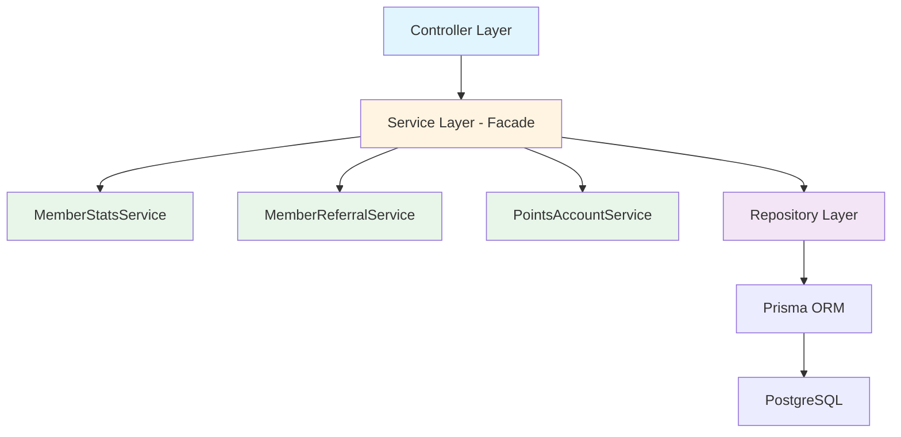
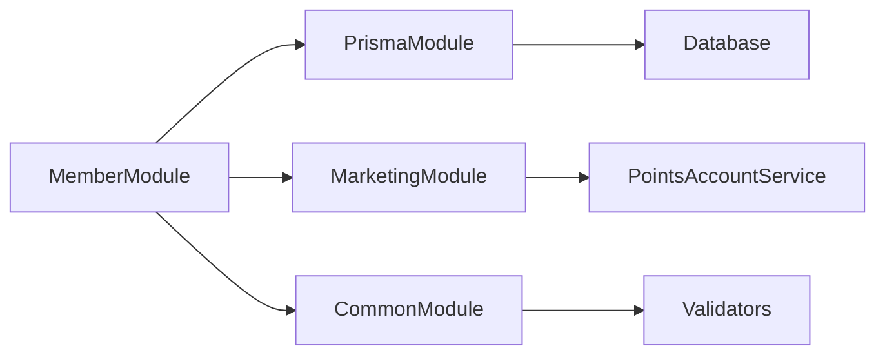
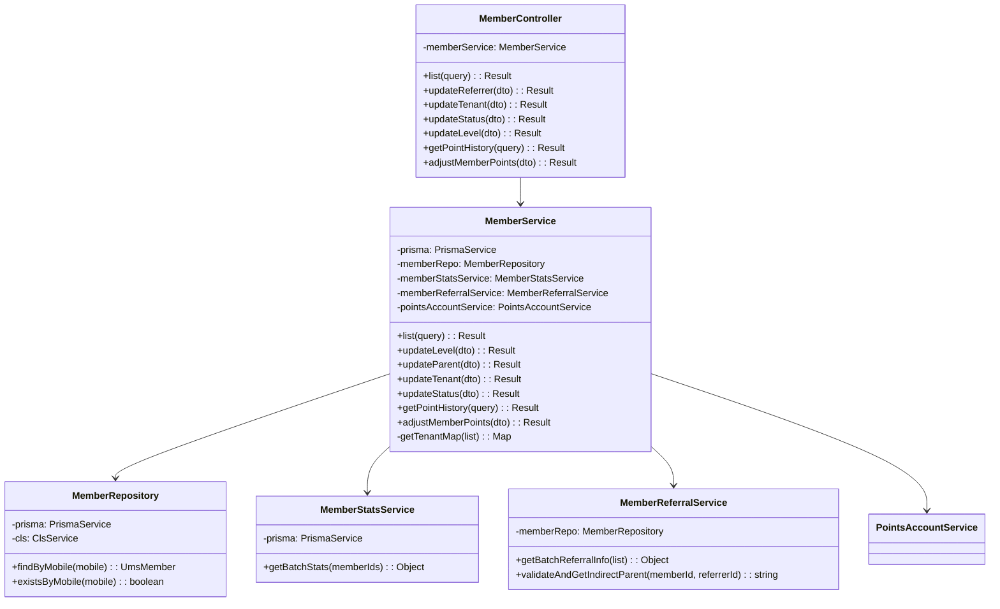
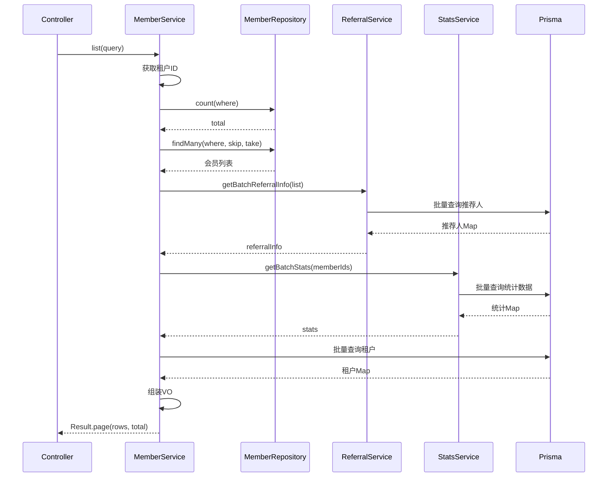
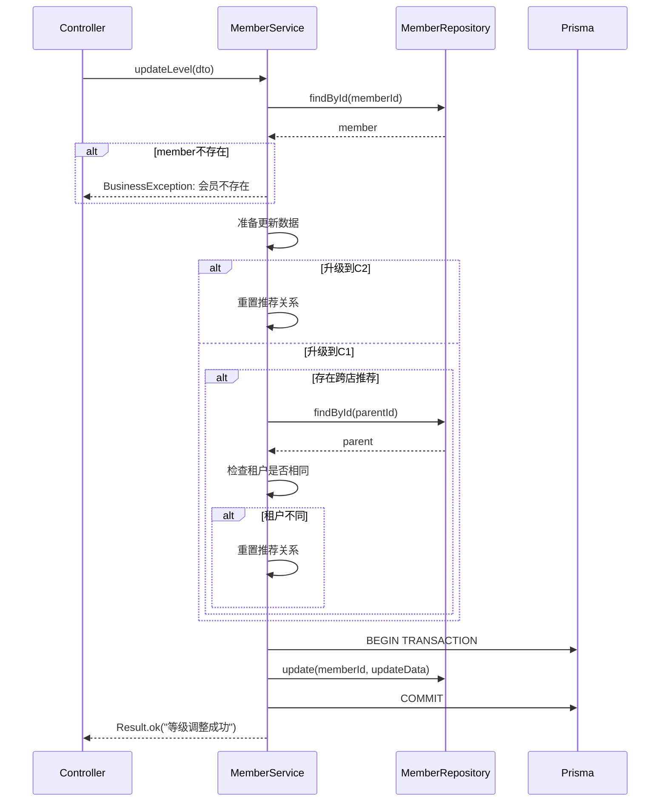
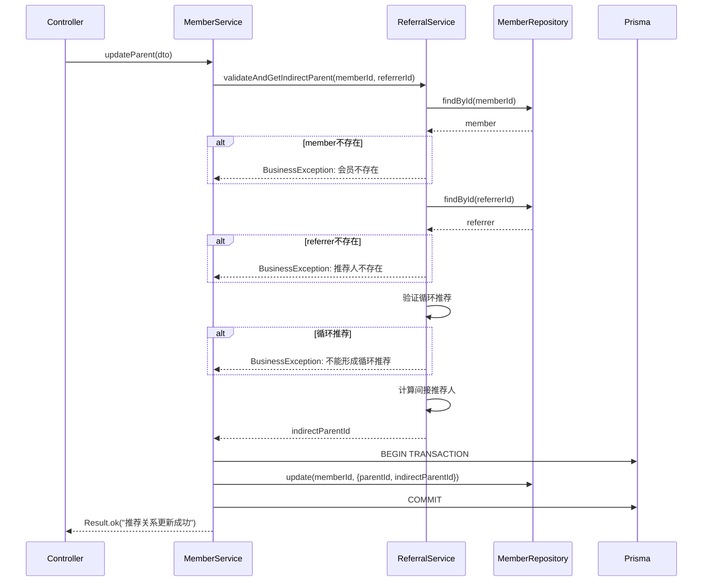
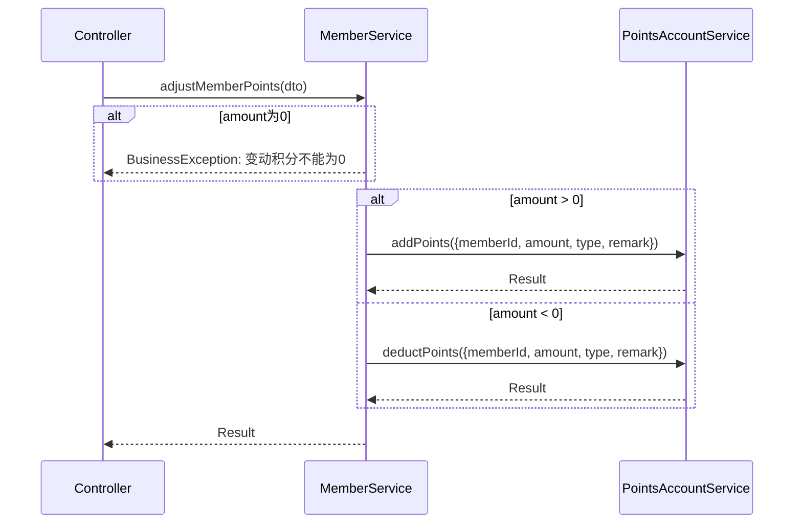
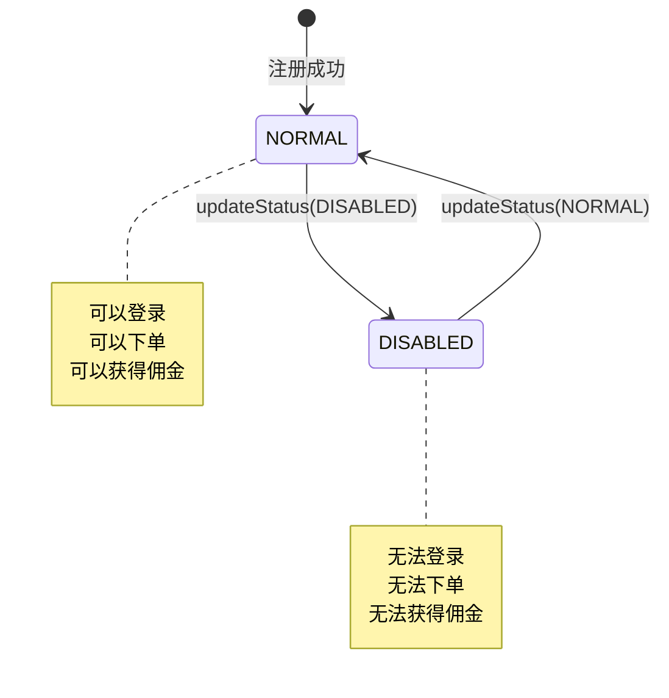
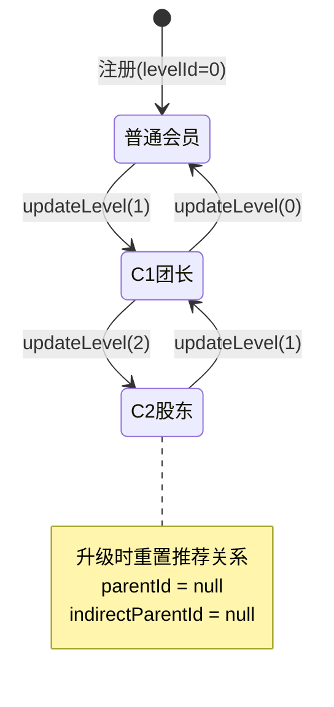
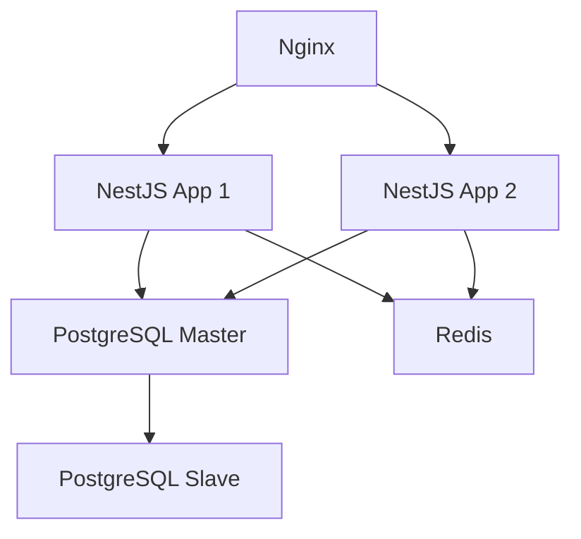

# 会员管理模块设计文档

## 1. 概述

### 1.1 模块简介

会员管理模块采用门面模式（Facade Pattern）和服务分层设计，将会员管理的复杂业务逻辑分解为多个子服务，包括会员基础服务、推荐关系服务、统计服务等。该模块使用Repository模式、事务管理、批量查询优化等设计模式，确保数据一致性和高性能。

### 1.2 设计目标

- 实现会员的统一管理和灵活配置
- 支持多级推荐分销体系（C1/C2）
- 提供高效的批量查询和统计功能
- 确保推荐关系的数据一致性
- 支持租户数据隔离
- 保证积分调整的准确性和可追溯性

### 1.3 技术栈

- NestJS框架
- Prisma ORM
- PostgreSQL数据库
- class-validator数据验证
- nestjs-cls上下文管理

## 2. 架构设计

### 2.1 分层架构



### 2.2 模块依赖关系



### 2.3 核心组件

| 组件                   | 职责         | 说明                             |
| ---------------------- | ------------ | -------------------------------- |
| MemberController       | 接口层       | 处理HTTP请求，权限验证，参数验证 |
| MemberService          | 门面层       | 协调子服务，实现业务逻辑         |
| MemberStatsService     | 统计服务     | 会员消费和佣金统计               |
| MemberReferralService  | 推荐服务     | 推荐关系验证和管理               |
| MemberRepository       | 数据层       | 封装数据访问，提供查询方法       |
| ReferralCodeRepository | 推荐码数据层 | 管理推荐码数据                   |

## 3. 类设计

### 3.1 类图



### 3.2 核心类说明

#### 3.2.1 MemberController

职责：处理会员管理相关的HTTP请求

关键方法：

- list: 查询会员列表
- updateLevel: 更新会员等级，使用@Operlog记录操作
- updateReferrer: 更新推荐关系
- updateTenant: 变更会员租户
- updateStatus: 更新会员状态
- getPointHistory: 查询积分记录
- adjustMemberPoints: 调整会员积分

装饰器：

- @ApiTags: API文档分组
- @Controller: 路由前缀
- @RequirePermission: 权限验证
- @Operlog: 操作日志

#### 3.2.2 MemberService

职责：门面层，协调子服务实现业务逻辑

关键方法：

- list: 分页查询会员列表，聚合推荐人、统计数据、租户信息
- updateLevel: 更新会员等级，处理推荐关系重置
- updateParent: 更新推荐关系，验证合法性
- updateTenant: 变更会员租户
- updateStatus: 更新会员状态
- getPointHistory: 查询积分记录
- adjustMemberPoints: 调整会员积分
- getTenantMap: 批量查询租户信息

特点：

- 使用门面模式协调子服务
- 使用@Transactional确保事务
- 批量查询优化避免N+1问题

#### 3.2.3 MemberStatsService

职责：会员统计服务

关键方法：

- getBatchStats: 批量查询会员消费和佣金统计

特点：

- 独立的统计服务
- 支持批量查询
- 返回Map结构便于查找

#### 3.2.4 MemberReferralService

职责：推荐关系服务

关键方法：

- getBatchReferralInfo: 批量查询推荐人信息
- validateAndGetIndirectParent: 验证推荐关系并计算间接推荐人

特点：

- 独立的推荐关系服务
- 验证推荐关系合法性
- 自动计算间接推荐人

#### 3.2.5 MemberRepository

职责：封装会员数据访问逻辑

特点：

- 继承BaseRepository
- 提供按手机号查询方法
- 支持事务上下文

## 4. 核心流程序列图

### 4.1 查询会员列表流程



### 4.2 更新会员等级流程



### 4.3 更新推荐关系流程



### 4.4 调整会员积分流程



## 5. 状态和流转

### 5.1 会员状态机



### 5.2 会员等级流转



## 6. 接口/数据契约

### 6.1 DTO定义

#### 6.1.1 ListMemberDto

```typescript
class ListMemberDto extends PageQueryDto {
  nickname?: string; // 会员昵称（模糊查询）
  mobile?: string; // 手机号（模糊查询）
}
```

#### 6.1.2 UpdateMemberLevelDto

```typescript
class UpdateMemberLevelDto {
  memberId: string; // 会员ID（必填）
  levelId: number; // 目标等级（0/1/2）
}
```

#### 6.1.3 UpdateReferrerDto

```typescript
class UpdateReferrerDto {
  memberId: string; // 会员ID（必填）
  referrerId: string; // 推荐人ID（必填）
}
```

#### 6.1.4 UpdateMemberTenantDto

```typescript
class UpdateMemberTenantDto {
  memberId: string; // 会员ID（必填）
  tenantId: string; // 租户ID（必填）
}
```

#### 6.1.5 UpdateMemberStatusDto

```typescript
class UpdateMemberStatusDto {
  memberId: string; // 会员ID（必填）
  status: string; // 状态（"0"正常 "1"禁用）
}
```

#### 6.1.6 AdjustMemberPointsDto

```typescript
class AdjustMemberPointsDto {
  memberId: string; // 会员ID（必填）
  amount: number; // 变动积分（正数增加，负数扣减）
  remark?: string; // 备注
}
```

### 6.2 VO定义

#### 6.2.1 MemberVo

```typescript
interface MemberVo {
  memberId: string; // 会员ID
  nickname: string; // 昵称
  avatar: string; // 头像
  mobile: string; // 手机号
  status: string; // 状态（"0"正常 "1"禁用）
  createTime: Date; // 创建时间
  tenantId: string; // 租户ID
  tenantName: string; // 租户名称
  referrerId?: string; // 推荐人ID
  referrerName?: string; // 推荐人昵称
  referrerMobile?: string; // 推荐人手机号
  indirectReferrerId?: string; // 间接推荐人ID
  indirectReferrerName?: string; // 间接推荐人昵称
  indirectReferrerMobile?: string; // 间接推荐人手机号
  balance: number; // 余额
  commission: number; // 佣金
  totalConsumption: number; // 消费总额
  orderCount: number; // 订单数
  levelId: number; // 等级ID
  levelName: string; // 等级名称
}
```

### 6.3 数据库模型

#### 6.3.1 UmsMember

```prisma
model UmsMember {
  memberId          String        @id
  nickname          String
  avatar            String?
  mobile            String        @unique
  password          String?
  status            MemberStatus  @default(NORMAL)
  tenantId          String
  parentId          String?
  indirectParentId  String?
  levelId           Int           @default(0)
  balance           Decimal       @default(0)
  createTime        DateTime      @default(now())
  updateTime        DateTime      @updatedAt
}
```

## 7. 数据库设计

### 7.1 表结构

#### 7.1.1 ums_member（会员表）

| 字段               | 类型          | 约束                       | 说明         |
| ------------------ | ------------- | -------------------------- | ------------ |
| member_id          | VARCHAR(50)   | PK                         | 会员ID       |
| nickname           | VARCHAR(50)   | NOT NULL                   | 昵称         |
| avatar             | VARCHAR(500)  | NULL                       | 头像URL      |
| mobile             | VARCHAR(20)   | UNIQUE, NOT NULL           | 手机号       |
| password           | VARCHAR(255)  | NULL                       | 密码（加密） |
| status             | ENUM          | NOT NULL, DEFAULT 'NORMAL' | 状态         |
| tenant_id          | VARCHAR(20)   | NOT NULL                   | 所属租户ID   |
| parent_id          | VARCHAR(50)   | NULL                       | 直接推荐人ID |
| indirect_parent_id | VARCHAR(50)   | NULL                       | 间接推荐人ID |
| level_id           | INT           | NOT NULL, DEFAULT 0        | 会员等级     |
| balance            | DECIMAL(10,2) | NOT NULL, DEFAULT 0        | 余额         |
| create_time        | TIMESTAMP     | NOT NULL                   | 创建时间     |
| update_time        | TIMESTAMP     | NOT NULL                   | 更新时间     |

索引：

- PRIMARY KEY (member_id)
- UNIQUE KEY (mobile)
- INDEX (tenant_id)
- INDEX (parent_id)
- INDEX (status)
- INDEX (level_id)

### 7.2 索引设计

| 表         | 索引名        | 字段      | 类型 | 说明             |
| ---------- | ------------- | --------- | ---- | ---------------- |
| ums_member | PRIMARY       | member_id | 主键 | 主键索引         |
| ums_member | UK_mobile     | mobile    | 唯一 | 手机号唯一索引   |
| ums_member | IDX_tenant_id | tenant_id | 普通 | 租户查询优化     |
| ums_member | IDX_parent_id | parent_id | 普通 | 推荐关系查询优化 |
| ums_member | IDX_status    | status    | 普通 | 状态查询优化     |
| ums_member | IDX_level_id  | level_id  | 普通 | 等级查询优化     |

### 7.3 数据库优化策略

1. 查询优化
   - 使用批量查询避免N+1问题
   - 在常用查询字段上建立索引
   - 分页查询限制offset ≤ 5000

2. 写入优化
   - 使用事务确保数据一致性
   - 批量更新使用updateMany

3. 推荐关系优化
   - 冗余存储间接推荐人ID
   - 避免递归查询
   - 使用索引加速推荐关系查询

## 8. 安全设计

### 8.1 权限控制

| 接口         | 权限                  | 说明       |
| ------------ | --------------------- | ---------- |
| 查询会员列表 | admin:member:list     | 管理员权限 |
| 更新会员等级 | admin:member:level    | 管理员权限 |
| 更新推荐关系 | admin:member:referrer | 管理员权限 |
| 变更会员租户 | admin:member:tenant   | 管理员权限 |
| 更新会员状态 | admin:member:status   | 管理员权限 |
| 查询积分记录 | admin:member:list     | 管理员权限 |
| 调整会员积分 | admin:member:list     | 管理员权限 |

### 8.2 数据隔离

- 租户数据隔离（非超管仅查询本租户数据）
- 使用TenantContext.getTenantId()获取租户ID
- 查询时自动添加租户过滤条件

### 8.3 数据验证

- 使用class-validator验证输入参数
- 验证会员和推荐人存在性
- 验证推荐关系合法性（防止循环推荐）
- 验证积分变动金额

### 8.4 业务安全

- 推荐关系验证（防止循环推荐）
- 等级变更规则验证
- 积分调整权限控制
- 事务确保数据一致性

## 9. 性能优化

### 9.1 查询优化

1. 批量查询推荐人

```typescript
// 批量查询直接推荐人和间接推荐人
const parentIds = [...new Set(list.map((m) => m.parentId).filter(Boolean))];
const parents = await this.memberRepo.findMany({
  where: { memberId: { in: parentIds } },
});
```

2. 批量查询统计数据

```typescript
// 批量查询消费和佣金统计
const stats = await this.memberStatsService.getBatchStats(memberIds);
```

3. 批量查询租户

```typescript
// 批量查询租户信息
const tenantIds = [...new Set(list.map((m) => m.tenantId))];
const tenants = await this.prisma.sysTenant.findMany({
  where: { tenantId: { in: tenantIds } },
});
```

### 9.2 索引优化

- 在tenant_id、parent_id、status、level_id字段上建立索引
- 使用复合索引优化多条件查询

### 9.3 性能指标

| 指标         | 目标          | 说明               |
| ------------ | ------------- | ------------------ |
| 接口响应时间 | P99 < 1000ms  | 列表查询级别       |
| 并发支持     | 100 QPS       | 会员管理为中频操作 |
| 批量查询     | 避免N+1问题   | 使用批量查询       |
| 分页深度     | offset ≤ 5000 | 超限抛错           |

## 10. 监控与日志

### 10.1 日志记录

1. 关键操作日志

```typescript
this.logger.log(`更新会员等级: ${memberId} -> ${levelId}`);
this.logger.log(`更新推荐关系: ${memberId} -> ${referrerId}`);
this.logger.log(`调整会员积分: ${memberId}, amount: ${amount}`);
```

2. 日志级别

- INFO: 正常操作
- WARN: 警告信息
- ERROR: 错误信息

3. 日志内容

- 操作类型
- 会员ID
- 操作参数
- 操作结果
- 错误堆栈

### 10.2 操作日志

使用@Operlog装饰器记录操作日志：

```typescript
@Operlog({ businessType: BusinessType.UPDATE })
@Put('level')
async updateLevel(@Body() dto: UpdateMemberLevelDto) {
  return this.memberService.updateLevel(dto);
}
```

### 10.3 监控指标

| 指标         | 说明         | 告警阈值 |
| ------------ | ------------ | -------- |
| 接口响应时间 | P99延迟      | > 2000ms |
| 接口错误率   | 错误请求比例 | > 1%     |
| 会员增长率   | 每日新增会员 | < 预期值 |
| 推荐转化率   | 推荐成功比例 | < 预期值 |

## 11. 扩展性设计

### 11.1 会员等级扩展

1. 支持自定义等级

- 配置化等级定义
- 支持多级等级体系
- 支持等级权益配置

2. 等级自动升级

- 基于消费金额自动升级
- 基于推荐人数自动升级
- 基于佣金金额自动升级

### 11.2 推荐关系扩展

1. 多级推荐

- 支持三级及以上推荐
- 支持推荐树可视化
- 支持推荐效果分析

2. 推荐奖励

- 支持推荐奖励配置
- 支持推荐佣金计算
- 支持推荐排行榜

### 11.3 会员标签扩展

1. 标签管理

- 支持自定义标签
- 支持批量打标签
- 支持按标签筛选

2. 会员分组

- 支持自定义分组
- 支持动态分组规则
- 支持分组营销

## 12. 部署架构

### 12.1 部署拓扑



### 12.2 高可用设计

1. 应用层

- 多实例部署
- 负载均衡
- 健康检查

2. 数据库层

- 主从复制
- 读写分离
- 自动故障转移

3. 缓存层

- Redis集群
- 缓存预热
- 缓存失效策略

## 13. 测试策略

### 13.1 单元测试

测试范围：

- MemberService所有方法
- MemberReferralService推荐关系验证
- MemberStatsService统计逻辑
- MemberRepository数据访问

### 13.2 集成测试

测试范围：

- 查询会员列表完整流程
- 更新会员等级完整流程
- 更新推荐关系完整流程
- 调整会员积分完整流程

### 13.3 性能测试

测试场景：

- 批量查询1000个会员
- 批量查询统计数据
- 并发更新会员信息
- 并发调整积分

## 14. 技术债与改进

### 14.1 已识别技术债

| 优先级 | 技术债               | 影响                 | 计划         |
| ------ | -------------------- | -------------------- | ------------ |
| P1     | 缺少会员详情查询接口 | 无法查看单个会员详情 | Sprint 2实现 |
| P2     | 缺少会员导出功能     | 无法导出会员数据     | Sprint 3实现 |
| P2     | 缺少会员标签功能     | 无法对会员分类管理   | Sprint 3实现 |
| P3     | 缺少会员行为分析     | 无法分析会员行为     | Sprint 4实现 |

### 14.2 改进建议

1. 会员详情增强

- 添加会员详情查询接口
- 显示推荐树结构
- 显示消费和佣金明细

2. 会员导出

- 支持按条件导出
- 支持导出推荐关系
- 支持导出统计数据

3. 会员分析

- 会员增长趋势
- 会员活跃度分析
- 推荐效果分析

4. 性能优化

- 添加缓存机制
- 优化批量查询
- 添加异步处理

## 15. 版本历史

| 版本 | 日期       | 作者   | 变更说明                   |
| ---- | ---------- | ------ | -------------------------- |
| 1.0  | 2026-02-22 | System | 初始版本，包含完整设计文档 |
