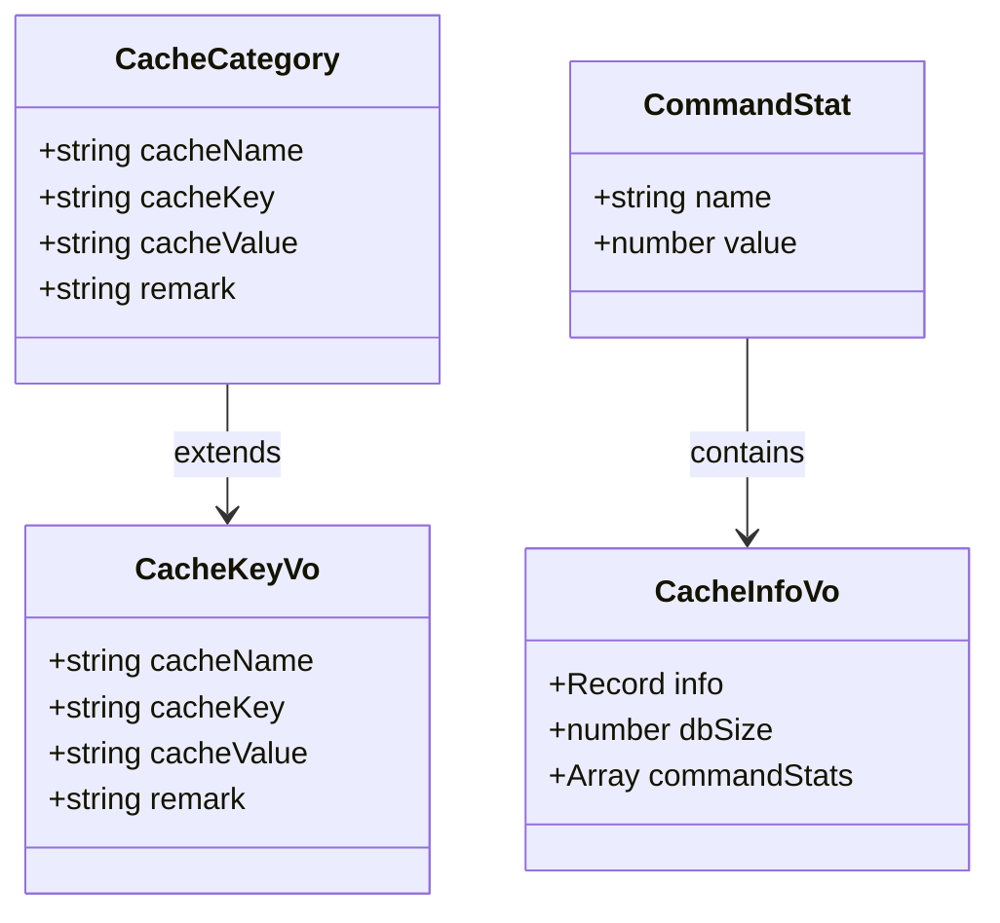
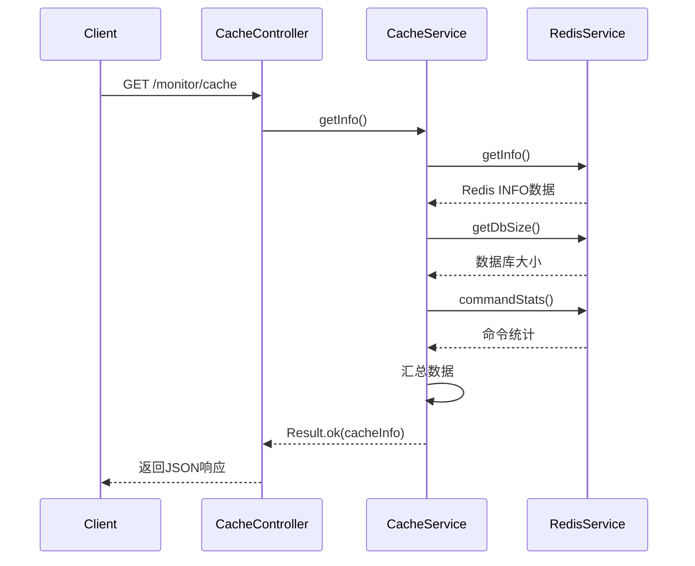
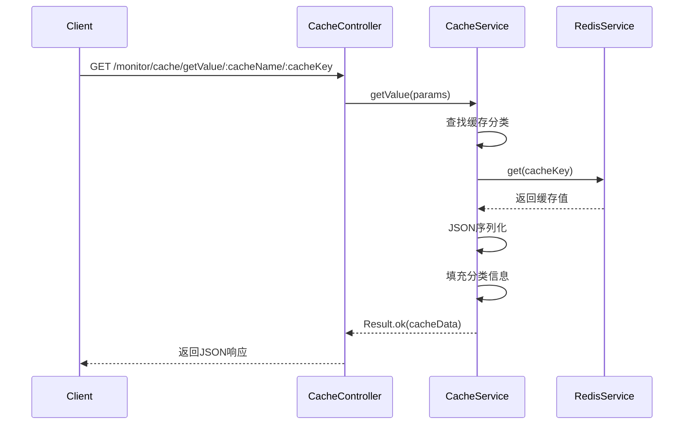
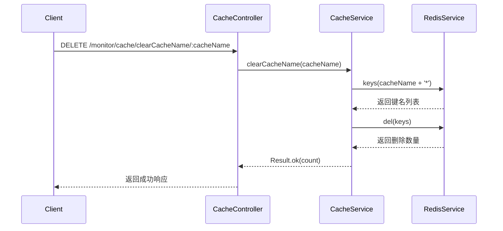
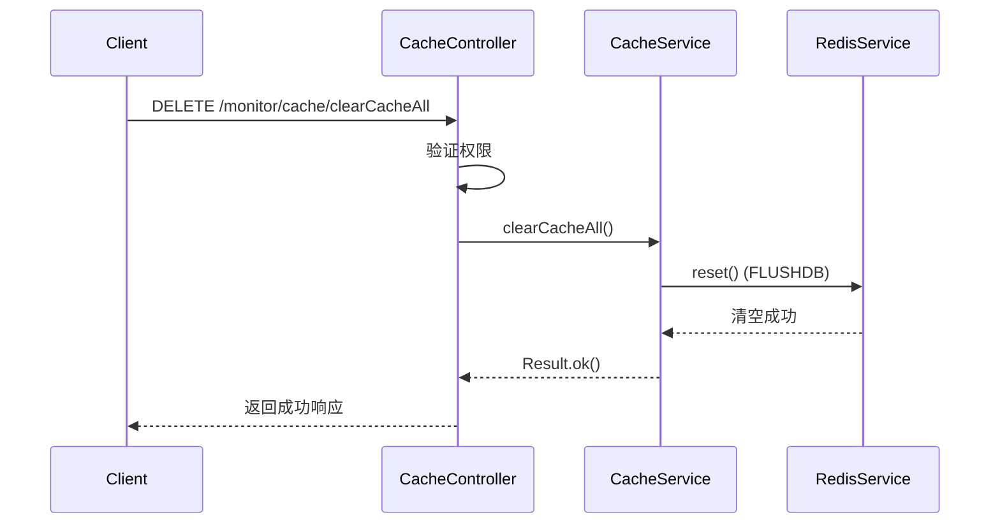
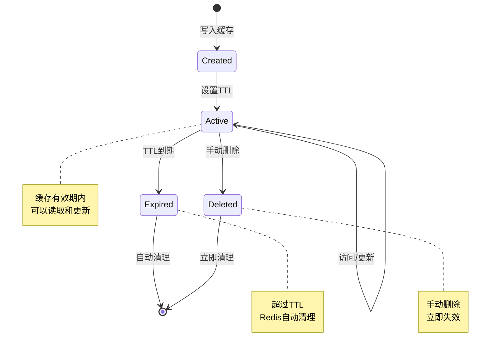
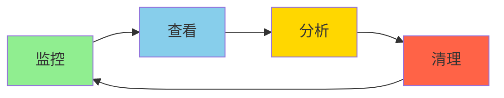
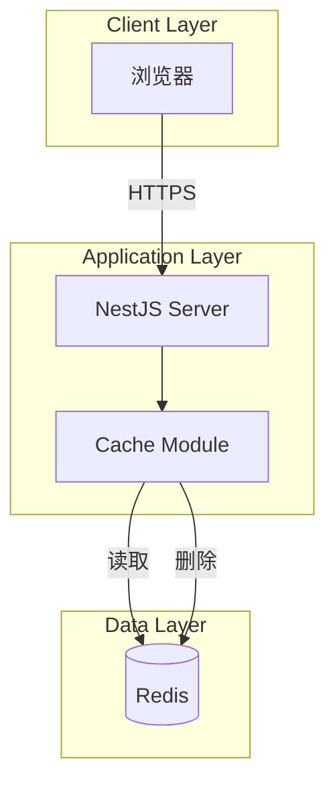

# 缓存管理模块设计文档

## 1. 概述

### 1.1 设计目标

缓存管理模块基于Redis实现缓存监控和管理功能。通过封装Redis命令，提供可视化的缓存查看和清理界面。设计重点关注易用性、安全性和性能。

### 1.2 设计原则

- 简单易用：提供直观的缓存管理界面
- 安全可控：权限控制，操作审计
- 性能优先：避免阻塞Redis
- 可扩展性：支持添加新的缓存分类

### 1.3 技术栈

- NestJS：Web框架
- Redis：缓存存储
- RedisService：Redis操作封装

## 2. 架构与模块

### 2.1 模块结构

```
cache/
├── cache.controller.ts         # 控制器
├── cache.service.ts            # 业务逻辑
└── cache.module.ts             # 模块定义
```

### 2.2 组件图

```mermaid
graph TB
    subgraph "Controller Layer"
        CC[CacheController]
    end

    subgraph "Service Layer"
        CS[CacheService]
    end

    subgraph "Data Layer"
        RS[RedisService]
        Redis[(Redis)]
    end

    subgraph "Decorators"
        OL[@Operlog]
    end

    CC --> CS
    CS --> RS
    RS --> Redis
    CC -.uses.-> OL
```

### 2.3 依赖关系

| 模块            | 依赖         | 说明         |
| --------------- | ------------ | ------------ |
| CacheController | CacheService | 调用业务逻辑 |
| CacheService    | RedisService | Redis操作    |

## 3. 领域/数据模型

### 3.1 类图



### 3.2 缓存分类定义

```typescript
const caches = [
  { cacheName: 'login_tokens:', remark: '用户信息' },
  { cacheName: 'sys_config:', remark: '配置信息' },
  { cacheName: 'sys_dict:', remark: '数据字典' },
  { cacheName: 'captcha_codes:', remark: '验证码' },
  { cacheName: 'repeat_submit:', remark: '防重提交' },
  { cacheName: 'rate_limit:', remark: '限流处理' },
  { cacheName: 'pwd_err_cnt:', remark: '密码错误次数' },
];
```

## 4. 核心流程时序

### 4.1 获取缓存监控信息



### 4.2 查看缓存内容



### 4.3 清理缓存分类



### 4.4 清空全部缓存



## 5. 状态与流程

### 5.1 缓存生命周期



### 5.2 缓存管理流程



## 6. 接口/数据约定

### 6.1 REST API接口

#### 6.1.1 获取缓存监控信息

```typescript
GET /monitor/cache

Response:
{
  code: 200,
  msg: "success",
  data: {
    info: Record<string, string>,    // Redis INFO信息
    dbSize: number,                  // 数据库大小
    commandStats: Array<{            // 命令统计
      name: string,
      value: number
    }>
  }
}

Permission: 无（公开接口）
```

#### 6.1.2 获取缓存名称列表

```typescript
GET /monitor/cache/getNames

Response:
{
  code: 200,
  msg: "success",
  data: Array<{
    cacheName: string,    // 缓存名称前缀
    cacheKey: string,     // 空字符串
    cacheValue: string,   // 空字符串
    remark: string        // 分类说明
  }>
}

Permission: 无（公开接口）
```

#### 6.1.3 获取缓存键名列表

```typescript
GET /monitor/cache/getKeys/:id

Path Parameters:
- id: string              // 缓存名称前缀

Response:
{
  code: 200,
  msg: "success",
  data: string[]          // 键名列表
}

Permission: 无（公开接口）
```

#### 6.1.4 获取缓存内容

```typescript
GET /monitor/cache/getValue/:cacheName/:cacheKey

Path Parameters:
- cacheName: string       // 缓存名称前缀
- cacheKey: string        // 完整键名

Response:
{
  code: 200,
  msg: "success",
  data: {
    cacheName: string,    // 缓存名称前缀
    cacheKey: string,     // 完整键名
    cacheValue: string,   // JSON序列化的缓存值
    remark: string        // 分类说明
  }
}

Permission: 无（公开接口）
```

#### 6.1.5 清理缓存分类

```typescript
DELETE /monitor/cache/clearCacheName/:cacheName

Path Parameters:
- cacheName: string       // 缓存名称前缀

Response:
{
  code: 200,
  msg: "success",
  data: number            // 删除的键数量
}

Permission: 需要权限控制（建议添加）
Business Type: CLEAN
```

#### 6.1.6 清理缓存键名

```typescript
DELETE /monitor/cache/clearCacheKey/:cacheKey

Path Parameters:
- cacheKey: string        // 完整键名

Response:
{
  code: 200,
  msg: "success",
  data: number            // 删除的键数量（0或1）
}

Permission: 需要权限控制（建议添加）
Business Type: CLEAN
```

#### 6.1.7 清空全部缓存

```typescript
DELETE /monitor/cache/clearCacheAll

Response:
{
  code: 200,
  msg: "success",
  data: string            // "OK"
}

Permission: 需要权限控制（建议添加）
Business Type: CLEAN
```

## 7. 部署架构

### 7.1 部署图



### 7.2 运行环境

| 组件    | 版本要求 | 说明       |
| ------- | -------- | ---------- |
| Node.js | >= 18    | 运行时环境 |
| NestJS  | >= 10    | Web框架    |
| Redis   | >= 6     | 缓存存储   |

## 8. 安全设计

### 8.1 权限控制

| 操作         | 权限标识                | 说明          |
| ------------ | ----------------------- | ------------- |
| 查看监控信息 | 无（建议添加）          | 查看Redis信息 |
| 查看缓存列表 | 无（建议添加）          | 查看缓存分类  |
| 查看缓存内容 | 无（建议添加）          | 查看缓存值    |
| 清理缓存分类 | monitor:cache:remove    | 清理分类缓存  |
| 清理缓存键名 | monitor:cache:remove    | 清理单个缓存  |
| 清空全部缓存 | monitor:cache:removeAll | 清空所有缓存  |

### 8.2 操作审计

- 所有清理操作记录到操作日志
- 记录操作人、操作类型、操作对象
- 清空全部缓存需要特别标记

### 8.3 数据安全

- 缓存内容可能包含敏感信息
- 建议对敏感缓存内容脱敏展示
- 限制缓存内容的访问权限

## 9. 性能优化

### 9.1 避免KEYS命令阻塞

```typescript
// 当前实现（可能阻塞）
const keys = await this.redisService.keys(id + '*');

// 优化方案：使用SCAN命令
async getKeysByScan(pattern: string): Promise<string[]> {
  const keys: string[] = [];
  let cursor = '0';
  do {
    const [newCursor, batch] = await this.redis.scan(
      cursor,
      'MATCH',
      pattern,
      'COUNT',
      100
    );
    cursor = newCursor;
    keys.push(...batch);
  } while (cursor !== '0');
  return keys;
}
```

### 9.2 批量删除优化

```typescript
// 使用pipeline批量删除
async clearCacheName(id: string) {
  const keys = await this.getKeysByScan(id + '*');
  if (keys.length === 0) return Result.ok(0);

  const pipeline = this.redis.pipeline();
  keys.forEach(key => pipeline.del(key));
  await pipeline.exec();

  return Result.ok(keys.length);
}
```

### 9.3 缓存内容大小限制

```typescript
// 限制返回的缓存内容大小
async getValue(params: any) {
  const cacheValue = await this.redisService.get(params.cacheKey);
  const valueStr = JSON.stringify(cacheValue);

  // 限制最大1MB
  if (valueStr.length > 1024 * 1024) {
    data.cacheValue = valueStr.substring(0, 1024 * 1024) + '... (truncated)';
  } else {
    data.cacheValue = valueStr;
  }

  return Result.ok(data);
}
```

## 10. 监控与日志

### 10.1 监控指标

| 指标              | 阈值      | 说明            |
| ----------------- | --------- | --------------- |
| 缓存查询P95延迟   | <= 500ms  | 95%请求 < 500ms |
| 缓存清理P95延迟   | <= 2000ms | 95%请求 < 2s    |
| Redis连接池使用率 | <= 80%    | 避免连接耗尽    |
| Redis内存使用率   | <= 80%    | 避免内存不足    |

### 10.2 日志记录

```typescript
// Service层日志
this.logger.log(`获取缓存监控信息`);
this.logger.warn(`清理缓存分类: ${cacheName}`);
this.logger.error(`清空全部缓存: 操作人=${operName}`);
```

### 10.3 告警规则

- Redis连接失败：P0告警
- Redis内存使用率 > 90%：P1告警
- 清空全部缓存操作：P1告警（高危操作）
- 缓存查询P95延迟 > 1s：P2告警

## 11. 可扩展性设计

### 11.1 动态缓存分类

```typescript
// 支持从配置文件加载缓存分类
interface CacheConfig {
  categories: CacheCategory[];
}

// 从配置加载
async loadCacheCategories(): Promise<CacheCategory[]> {
  const config = await this.configService.get<CacheConfig>('cache');
  return config.categories;
}
```

### 11.2 缓存统计分析

```typescript
// 统计各分类的缓存数量和大小
interface CacheStatistics {
  cacheName: string;
  keyCount: number;
  totalSize: number;
  avgSize: number;
}

async getCacheStatistics(): Promise<CacheStatistics[]> {
  const stats: CacheStatistics[] = [];
  for (const cache of this.caches) {
    const keys = await this.getKeysByScan(cache.cacheName + '*');
    const sizes = await Promise.all(
      keys.map(key => this.redis.strlen(key))
    );
    stats.push({
      cacheName: cache.cacheName,
      keyCount: keys.length,
      totalSize: sizes.reduce((a, b) => a + b, 0),
      avgSize: sizes.length > 0 ? sizes.reduce((a, b) => a + b, 0) / sizes.length : 0,
    });
  }
  return stats;
}
```

### 11.3 缓存内容编辑

```typescript
// 支持编辑缓存内容
async updateValue(params: {
  cacheKey: string;
  cacheValue: any;
  ttl?: number;
}): Promise<Result> {
  await this.redis.set(params.cacheKey, params.cacheValue);
  if (params.ttl) {
    await this.redis.expire(params.cacheKey, params.ttl);
  }
  return Result.ok();
}
```

## 12. 测试策略

### 12.1 单元测试

```typescript
describe('CacheService', () => {
  it('应该正确获取缓存监控信息', async () => {
    const result = await service.getInfo();
    expect(result.data).toHaveProperty('info');
    expect(result.data).toHaveProperty('dbSize');
    expect(result.data).toHaveProperty('commandStats');
  });

  it('应该正确获取缓存名称列表', async () => {
    const result = await service.getNames();
    expect(result.data).toBeInstanceOf(Array);
    expect(result.data.length).toBeGreaterThan(0);
  });

  it('应该正确清理缓存分类', async () => {
    const result = await service.clearCacheName('test:');
    expect(result.code).toBe(200);
  });
});
```

### 12.2 集成测试

```typescript
describe('Cache E2E', () => {
  it('GET /monitor/cache 应该返回监控信息', () => {
    return request(app.getHttpServer())
      .get('/monitor/cache')
      .expect(200)
      .expect((res) => {
        expect(res.body.data).toHaveProperty('info');
      });
  });

  it('DELETE /monitor/cache/clearCacheKey/:key 应该删除缓存', () => {
    return request(app.getHttpServer())
      .delete('/monitor/cache/clearCacheKey/test:key')
      .set('Authorization', `Bearer ${token}`)
      .expect(200);
  });
});
```

### 12.3 性能测试

- 监控信息查询响应时间 < 500ms
- 1000个键名查询响应时间 < 1s
- 批量删除1000个键响应时间 < 2s

## 13. 实施计划

### 13.1 第一阶段：核心功能（3天）

- [ ] 实现缓存监控信息查询
- [ ] 实现缓存名称和键名列表
- [ ] 实现缓存内容查看
- [ ] 单元测试覆盖率 >= 80%

### 13.2 第二阶段：清理功能（2天）

- [ ] 实现缓存清理功能
- [ ] 完善权限控制
- [ ] 集成测试

### 13.3 第三阶段：优化与监控（2天）

- [ ] 优化KEYS命令为SCAN
- [ ] 添加监控指标
- [ ] 性能测试
- [ ] 文档完善

## 14. 缺陷分析

### 14.1 已识别缺陷

#### P0 - 缺少权限控制

- **现状**：所有接口都没有权限控制
- **影响**：任何人都可以查看和清理缓存
- **建议**：添加 `@RequirePermission` 装饰器

```typescript
@RequirePermission('monitor:cache:list')
@Get()
getInfo() { }

@RequirePermission('monitor:cache:remove')
@Delete('/clearCacheName/:cacheName')
clearCacheName() { }
```

#### P1 - 使用KEYS命令性能问题

- **现状**：使用 `keys(pattern)` 可能阻塞Redis
- **影响**：大量键时影响Redis性能
- **建议**：改用SCAN命令

#### P1 - 缺少缓存内容大小限制

- **现状**：直接返回完整缓存内容
- **影响**：大缓存可能导致内存溢出
- **建议**：限制返回内容大小，超过则截断

#### P2 - 缓存分类硬编码

- **现状**：缓存分类在代码中硬编码
- **影响**：添加新分类需要修改代码
- **建议**：从配置文件加载缓存分类

#### P2 - 缺少缓存统计功能

- **现状**：仅能查看单个缓存内容
- **影响**：无法了解缓存整体使用情况
- **建议**：添加缓存统计接口

#### P3 - 缺少错误处理

- **现状**：Redis操作失败时未处理异常
- **影响**：Redis故障时接口报错
- **建议**：添加try-catch和降级方案

#### P3 - getValue方法参数类型错误

- **现状**：params参数类型为 `any`，实际应为对象
- **影响**：类型不安全
- **建议**：定义正确的DTO类型

```typescript
interface GetValueDto {
  cacheName: string;
  cacheKey: string;
}

async getValue(params: GetValueDto) { }
```

### 14.2 技术债务

- 缺少缓存内容编辑功能
- 缺少缓存TTL查看和设置
- 缺少缓存导出功能
- 缺少缓存预热功能

## 15. 参考资料

- [NestJS官方文档](https://docs.nestjs.com/)
- [Redis官方文档](https://redis.io/docs/)
- [Redis SCAN命令](https://redis.io/commands/scan/)
- [Redis性能优化](https://redis.io/docs/manual/optimization/)
