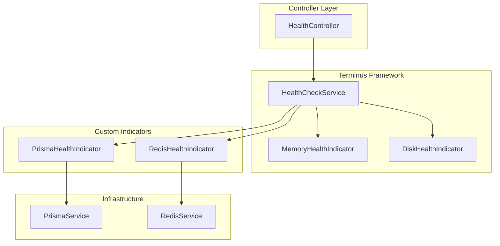
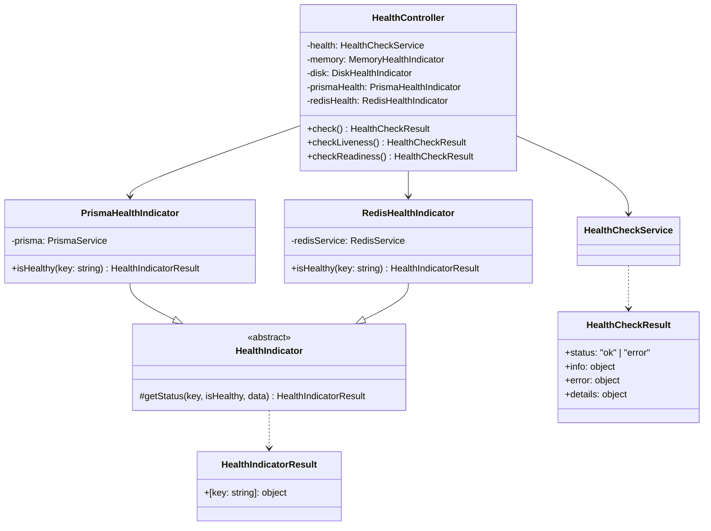
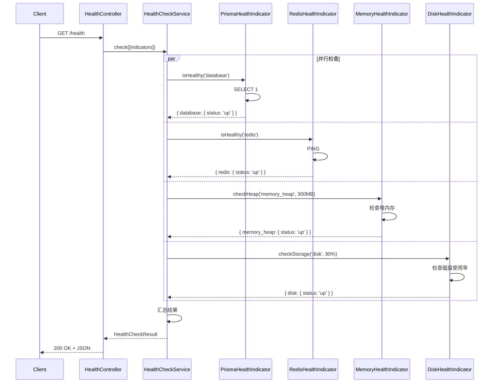
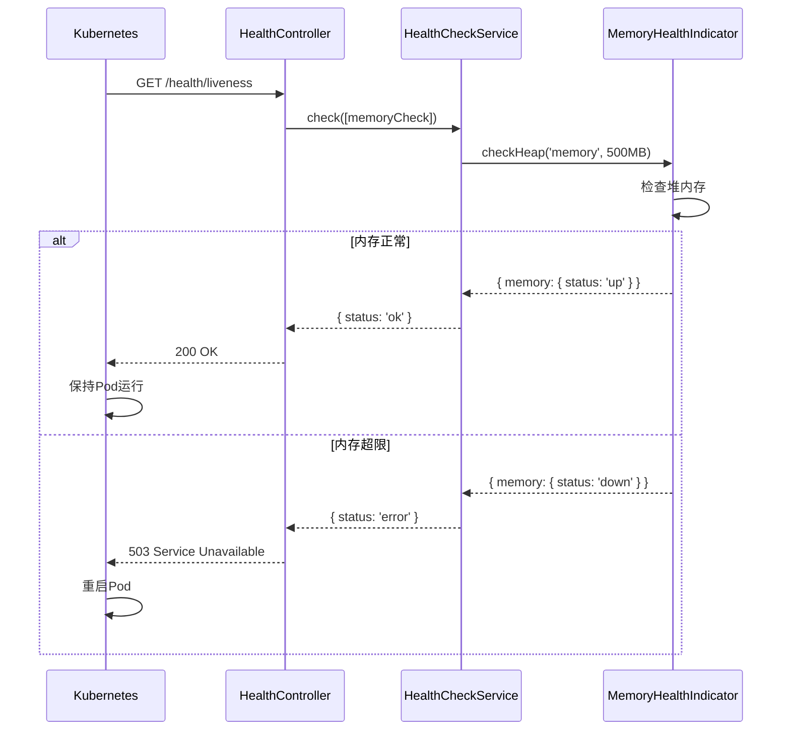
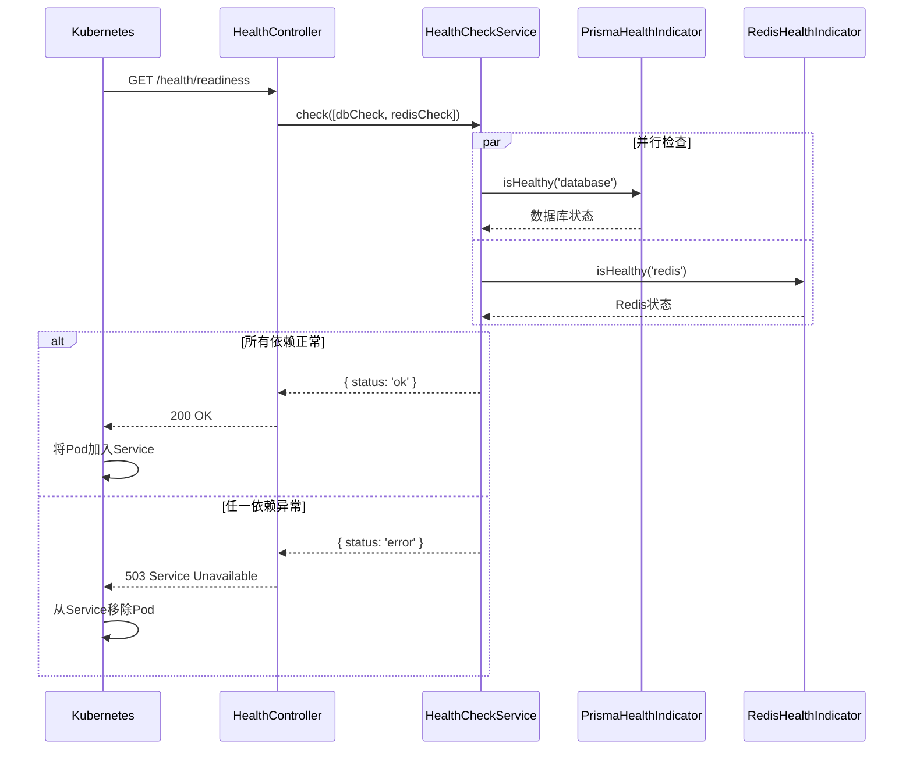
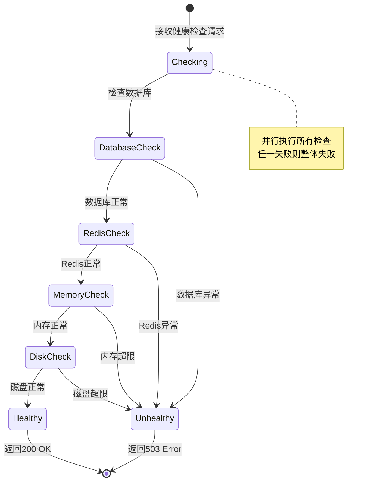
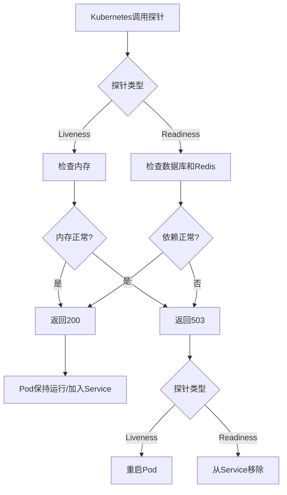
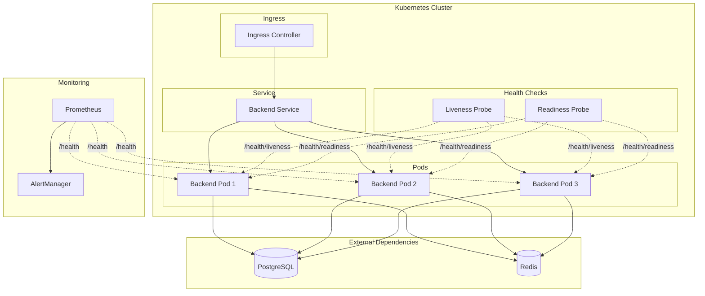
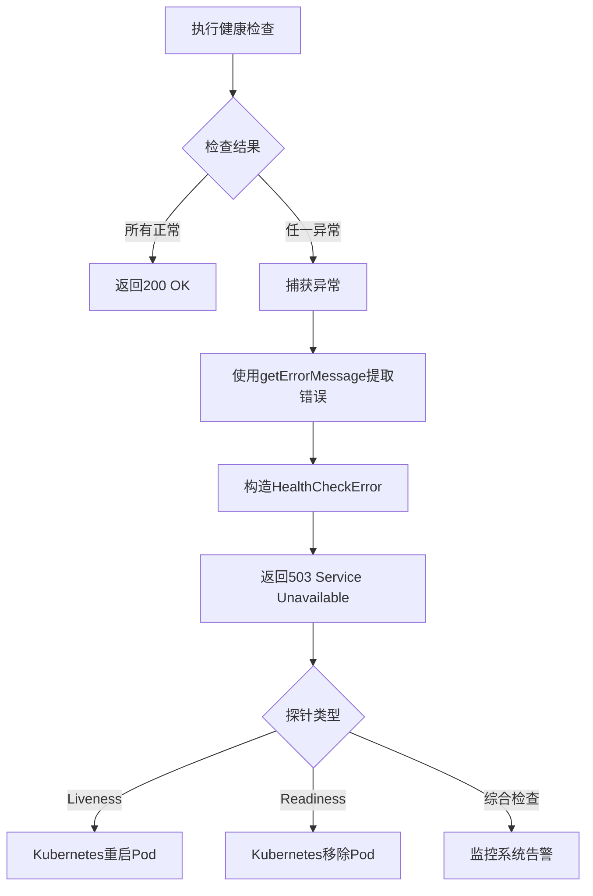

# 健康检查模块 - 设计文档

## 1. 概述

### 1.1 设计目标

健康检查模块基于NestJS Terminus库实现标准化的健康检查功能，支持多种健康指标和Kubernetes探针。通过自定义Health Indicator实现数据库和Redis的健康检查，结合内置的内存和磁盘检查，提供全面的应用健康监控能力。

### 1.2 设计原则

- 标准化：遵循Kubernetes健康检查规范
- 可扩展：支持自定义Health Indicator
- 高可用：通过探针支持容器编排平台的自动恢复
- 轻量级：健康检查不影响应用性能
- 安全性：健康检查接口无需认证，但不暴露敏感信息

### 1.3 技术栈

- NestJS Terminus：健康检查框架
- 自定义Health Indicator：PrismaHealthIndicator、RedisHealthIndicator
- 内置Health Indicator：MemoryHealthIndicator、DiskHealthIndicator

## 2. 架构设计

### 2.1 组件图



### 2.2 模块职责

| 模块                  | 职责             | 依赖                                   |
| --------------------- | ---------------- | -------------------------------------- |
| HealthController      | 提供健康检查接口 | HealthCheckService, 各Health Indicator |
| HealthCheckService    | 协调多个健康检查 | Terminus框架提供                       |
| PrismaHealthIndicator | 数据库健康检查   | PrismaService                          |
| RedisHealthIndicator  | Redis健康检查    | RedisService                           |
| MemoryHealthIndicator | 内存健康检查     | Terminus框架提供                       |
| DiskHealthIndicator   | 磁盘健康检查     | Terminus框架提供                       |

## 3. 数据模型

### 3.1 类图



### 3.2 健康检查响应格式

```typescript
interface HealthCheckResult {
  status: 'ok' | 'error';
  info?: {
    [key: string]: {
      status: 'up';
      [details: string]: any;
    };
  };
  error?: {
    [key: string]: {
      status: 'down';
      [details: string]: any;
    };
  };
  details: {
    [key: string]: {
      status: 'up' | 'down';
      [details: string]: any;
    };
  };
}
```

## 4. 核心流程设计

### 4.1 综合健康检查流程



### 4.2 存活探针检查流程



### 4.3 就绪探针检查流程



## 5. 状态与流程

### 5.1 健康检查状态图



### 5.2 Kubernetes探针决策流程



## 6. 接口设计

### 6.1 REST API接口

#### 6.1.1 综合健康检查

**接口**: GET /health

**权限**: 无需认证（@NotRequireAuth）

**请求参数**: 无

**响应**:

```typescript
{
  status: "ok" | "error",
  info: {
    database: {
      status: "up",
      message: "PostgreSQL is healthy"
    },
    redis: {
      status: "up",
      message: "Redis is healthy"
    },
    memory_heap: {
      status: "up",
      heapUsed: 150000000,
      heapTotal: 200000000
    },
    disk: {
      status: "up",
      free: 50000000000,
      total: 100000000000
    }
  },
  details: { ... }
}
```

#### 6.1.2 存活探针

**接口**: GET /health/liveness

**权限**: 无需认证（@NotRequireAuth）

**用途**: Kubernetes判断应用是否存活，失败时重启Pod

**检查项**: 内存检查（堆内存不超过500MB）

**响应**: 同综合健康检查

#### 6.1.3 就绪探针

**接口**: GET /health/readiness

**权限**: 无需认证（@NotRequireAuth）

**用途**: Kubernetes判断应用是否就绪，失败时从Service移除

**检查项**: 数据库连接检查、Redis连接检查

**响应**: 同综合健康检查

### 6.2 内部接口

#### 6.2.1 PrismaHealthIndicator.isHealthy

```typescript
async isHealthy(key: string): Promise<HealthIndicatorResult>
```

**功能**: 检查数据库连接状态

**实现**: 执行 `SELECT 1` 查询测试连接

**返回**:

- 成功: `{ [key]: { status: 'up', message: 'PostgreSQL is healthy' } }`
- 失败: 抛出 HealthCheckError

#### 6.2.2 RedisHealthIndicator.isHealthy

```typescript
async isHealthy(key: string): Promise<HealthIndicatorResult>
```

**功能**: 检查Redis连接状态

**实现**: 执行 `PING` 命令测试连接

**返回**:

- 成功: `{ [key]: { status: 'up', message: 'Redis is healthy' } }`
- 失败: 抛出 HealthCheckError

## 7. 部署架构

### 7.1 部署图



### 7.2 Kubernetes配置

#### 7.2.1 Deployment配置

```yaml
apiVersion: apps/v1
kind: Deployment
metadata:
  name: backend
spec:
  replicas: 3
  template:
    spec:
      containers:
        - name: backend
          image: backend:latest
          ports:
            - containerPort: 3000
          livenessProbe:
            httpGet:
              path: /health/liveness
              port: 3000
            initialDelaySeconds: 30
            periodSeconds: 10
            timeoutSeconds: 5
            failureThreshold: 3
          readinessProbe:
            httpGet:
              path: /health/readiness
              port: 3000
            initialDelaySeconds: 10
            periodSeconds: 5
            timeoutSeconds: 3
            failureThreshold: 3
```

### 7.3 探针配置说明

| 探针类型  | 路径              | 初始延迟 | 检查间隔 | 超时时间 | 失败阈值 | 失败后果      |
| --------- | ----------------- | -------- | -------- | -------- | -------- | ------------- |
| Liveness  | /health/liveness  | 30秒     | 10秒     | 5秒      | 3次      | 重启Pod       |
| Readiness | /health/readiness | 10秒     | 5秒      | 3秒      | 3次      | 从Service移除 |

## 8. 安全设计

### 8.1 访问控制

**无需认证**：

- 健康检查接口使用 `@NotRequireAuth()` 装饰器
- 允许Kubernetes和监控系统无认证访问
- 不暴露敏感信息（如数据库连接字符串、密码）

**信息脱敏**：

- 错误信息仅包含通用描述
- 不返回详细的堆栈信息
- 不暴露内部IP、端口等敏感配置

### 8.2 安全措施

**防止信息泄露**：

- 健康检查响应不包含版本号、框架信息
- 错误信息统一格式，不暴露内部实现
- 使用 `getErrorMessage` 安全提取错误信息

**防止滥用**：

- 健康检查接口轻量级，不消耗大量资源
- 可在Nginx层面限制健康检查接口的访问频率
- 建议仅允许内网访问健康检查接口

## 9. 性能优化

### 9.1 检查性能

**目标**：

- 综合健康检查：P99 < 100ms
- 存活探针：P99 < 50ms
- 就绪探针：P99 < 100ms

**优化措施**：

- 并行执行所有健康检查
- 数据库检查使用简单查询（SELECT 1）
- Redis检查使用PING命令
- 内存和磁盘检查为本地操作，无网络开销

### 9.2 资源消耗

**内存占用**：

- 健康检查模块常驻内存 < 1MB
- 单次检查临时内存 < 100KB

**CPU占用**：

- 单次检查CPU时间 < 10ms
- 并行检查不阻塞主线程

### 9.3 性能指标

| 指标             | 目标值      | 监控方式   |
| ---------------- | ----------- | ---------- |
| 综合健康检查延迟 | P99 < 100ms | APM监控    |
| 存活探针延迟     | P99 < 50ms  | APM监控    |
| 就绪探针延迟     | P99 < 100ms | APM监控    |
| 检查成功率       | > 99.9%     | Prometheus |
| 并发检查数       | 100+        | 系统监控   |

## 10. 异常处理

### 10.1 异常分类

| 异常类型       | 处理方式 | 示例                 |
| -------------- | -------- | -------------------- |
| 数据库连接失败 | 返回503  | 数据库宕机、网络中断 |
| Redis连接失败  | 返回503  | Redis宕机、网络中断  |
| 内存超限       | 返回503  | 堆内存超过阈值       |
| 磁盘超限       | 返回503  | 磁盘使用率超过90%    |
| 检查超时       | 返回503  | 依赖服务响应慢       |

### 10.2 异常处理流程



### 10.3 错误响应格式

```typescript
{
  status: "error",
  error: {
    database: {
      status: "down",
      message: "Connection refused"
    }
  },
  details: {
    database: {
      status: "down",
      message: "Connection refused"
    },
    redis: {
      status: "up",
      message: "Redis is healthy"
    }
  }
}
```

## 11. 监控与日志

### 11.1 日志记录

**应用日志**：

- 健康检查失败时记录错误日志
- 使用 `getErrorMessage` 安全提取错误信息
- 日志包含检查类型、失败原因、时间戳

**示例日志**：

```
[ERROR] Health check failed: database check failed - Connection refused
[ERROR] Health check failed: redis check failed - ECONNREFUSED
[WARN] Memory usage high: 450MB / 500MB (90%)
```

### 11.2 监控指标

**健康检查指标**：

- 检查成功率（按类型分组）
- 检查延迟（P50、P95、P99）
- 检查失败次数
- 依赖服务可用性

**Prometheus指标**：

```
# 健康检查成功率
health_check_success_rate{type="database"} 0.999
health_check_success_rate{type="redis"} 0.998

# 健康检查延迟
health_check_duration_ms{type="database",quantile="0.99"} 45
health_check_duration_ms{type="redis",quantile="0.99"} 30

# 健康检查失败次数
health_check_failures_total{type="database"} 5
```

### 11.3 告警规则

| 告警项         | 阈值    | 级别 | 处理方式 |
| -------------- | ------- | ---- | -------- |
| 健康检查失败率 | > 1%    | P1   | 立即处理 |
| 数据库检查失败 | 连续3次 | P0   | 紧急处理 |
| Redis检查失败  | 连续3次 | P1   | 立即处理 |
| 内存使用率     | > 90%   | P2   | 计划处理 |
| 磁盘使用率     | > 90%   | P2   | 计划处理 |

## 12. 扩展设计

### 12.1 自定义Health Indicator

**扩展步骤**：

1. 创建类继承 `HealthIndicator`
2. 实现 `isHealthy` 方法
3. 在 `HealthModule` 中注册
4. 在 `HealthController` 中使用

**示例**：

```typescript
@Injectable()
export class CustomHealthIndicator extends HealthIndicator {
  async isHealthy(key: string): Promise<HealthIndicatorResult> {
    const isHealthy = await this.checkCustomService();

    if (isHealthy) {
      return this.getStatus(key, true, { message: 'Custom service is healthy' });
    }

    throw new HealthCheckError('Custom service check failed', this.getStatus(key, false));
  }
}
```

### 12.2 扩展点

**新增检查项**：

- HTTP健康检查（检查外部API）
- 消息队列健康检查（RabbitMQ、Kafka）
- 缓存健康检查（Memcached）
- 文件系统健康检查（NFS、S3）

**增强功能**：

- 健康检查历史记录
- 健康检查趋势分析
- 自定义阈值配置
- 健康检查仪表板

### 12.3 配置化

**预留配置项**：

```typescript
interface HealthCheckConfig {
  memory: {
    heapThreshold: number; // 内存阈值
  };
  disk: {
    thresholdPercent: number; // 磁盘阈值
    path: string; // 检查路径
  };
  timeout: number; // 检查超时时间
  retries: number; // 重试次数
}
```

## 13. 缺陷分析

### 13.1 P0级缺陷（阻塞性）

无

### 13.2 P1级缺陷（高优先级）

1. **缺少超时配置**
   - 现状：健康检查没有超时配置，依赖服务响应慢时可能长时间阻塞
   - 影响：Kubernetes探针超时导致误判，可能不必要地重启Pod
   - 建议：为每个健康检查添加超时配置（建议3-5秒），超时后返回失败

2. **缺少重试机制**
   - 现状：健康检查失败后不重试，可能因网络抖动导致误判
   - 影响：偶发性网络问题导致Pod被重启或从Service移除
   - 建议：添加重试机制（建议重试1-2次），减少误判

### 13.3 P2级缺陷（中优先级）

1. **内存阈值硬编码**
   - 现状：内存阈值硬编码在代码中（300MB、500MB）
   - 影响：不同环境需要不同阈值时需要修改代码
   - 建议：从配置文件读取阈值，支持环境变量覆盖

2. **缺少健康检查历史记录**
   - 现状：仅返回当前健康状态，无历史记录
   - 影响：无法分析健康检查趋势，难以定位间歇性问题
   - 建议：记录健康检查历史（最近100次），提供趋势分析接口

3. **缺少详细的错误信息**
   - 现状：错误信息较简单，仅包含通用描述
   - 影响：排查问题时缺少上下文信息
   - 建议：增加详细错误信息（如连接地址、错误码），但注意脱敏

### 13.4 P3级缺陷（低优先级）

1. **缺少健康检查仪表板**
   - 现状：仅提供API接口，无可视化界面
   - 影响：需要手动调用接口或查看日志
   - 建议：提供简单的健康检查仪表板，展示各项指标

2. **缺少自定义检查项配置**
   - 现状：检查项硬编码在Controller中
   - 影响：新增检查项需要修改代码
   - 建议：支持通过配置文件动态添加检查项

## 14. 技术债务

### 14.1 代码质量

- HealthController职责单一，代码简洁（约50行）
- 自定义Health Indicator遵循单一职责原则
- 使用了 `getErrorMessage` 安全处理异常
- 代码可读性好，注释清晰

### 14.2 性能优化

- 健康检查并行执行，性能良好
- 数据库和Redis检查使用轻量级命令
- 建议添加超时控制，避免长时间阻塞

### 14.3 测试覆盖

- 缺少单元测试
- 缺少集成测试
- 建议补充核心逻辑的测试用例

### 14.4 文档完善

- 缺少Kubernetes配置示例
- 缺少监控配置示例
- 建议补充部署和监控文档

## 15. 参考资料

### 15.1 相关文档

- NestJS Terminus文档：https://docs.nestjs.com/recipes/terminus
- Kubernetes健康检查：https://kubernetes.io/docs/tasks/configure-pod-container/configure-liveness-readiness-startup-probes/
- Prometheus监控：https://prometheus.io/docs/introduction/overview/

### 15.2 相关模块

- PrismaService：数据库连接服务
- RedisService：Redis连接服务
- 监控模块：系统监控和告警

---

**文档版本**: 1.0  
**编写日期**: 2026-02-23  
**编写人**: AI Assistant
