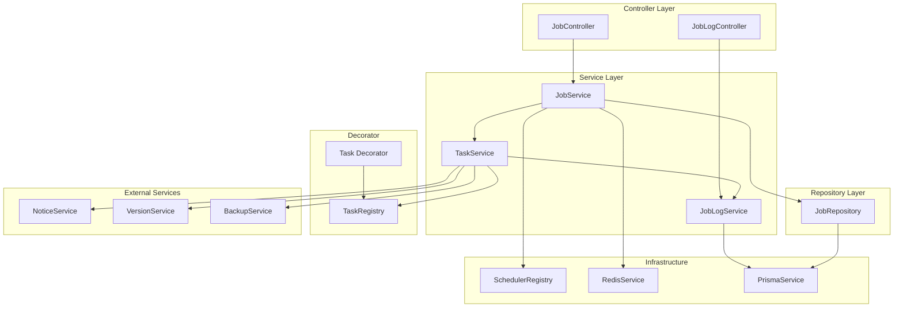
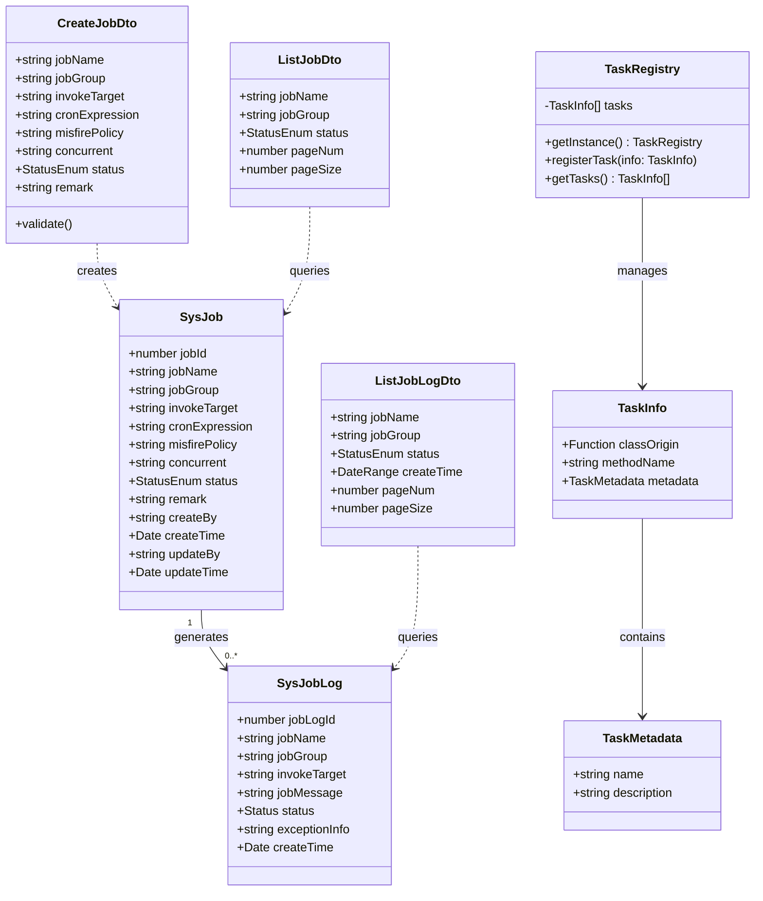
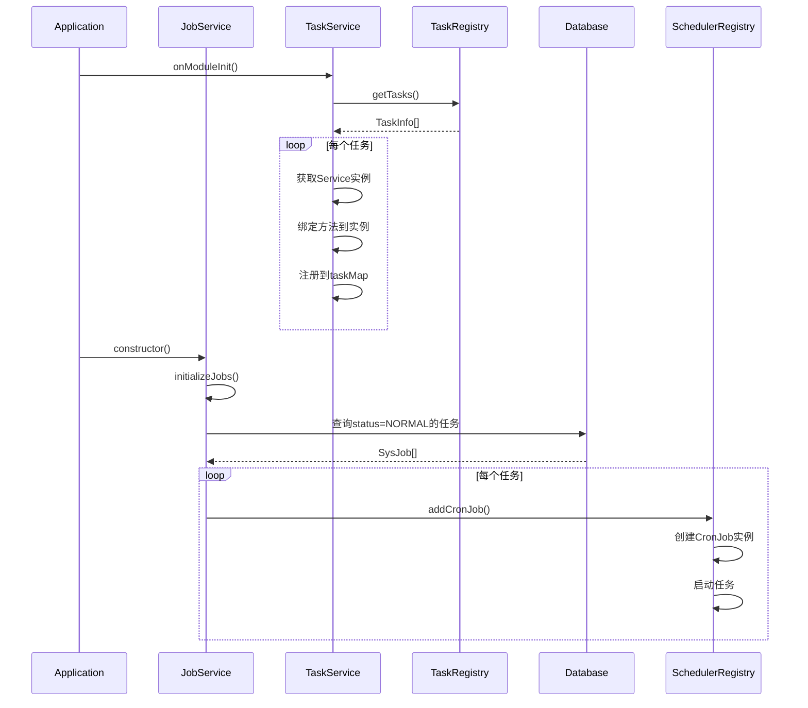
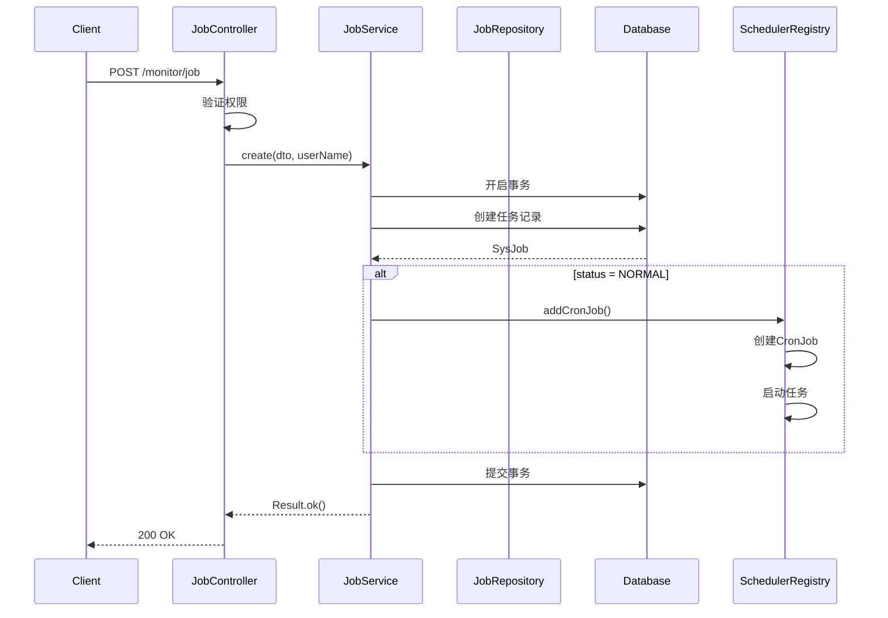
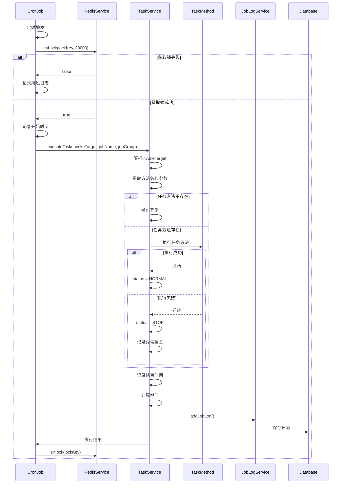
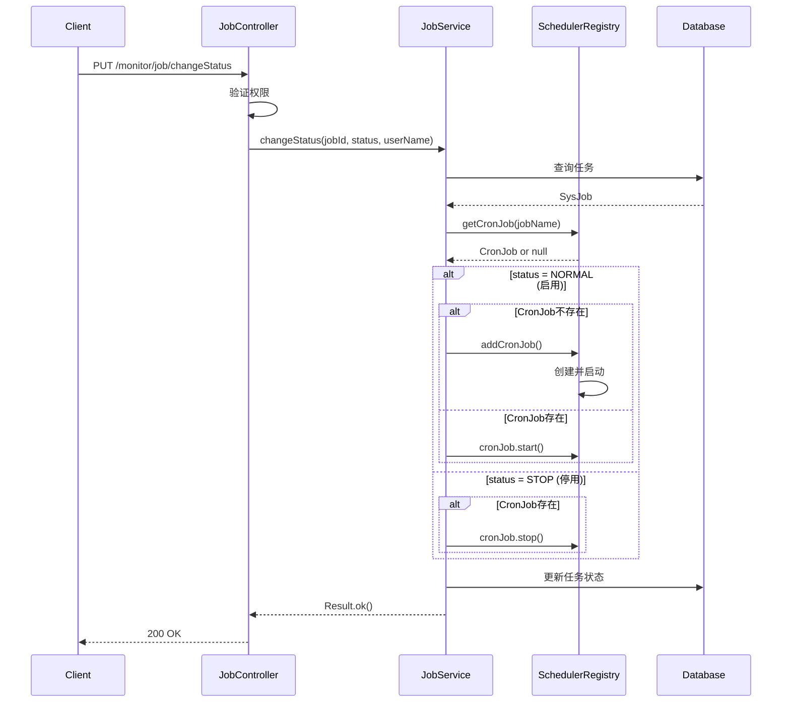
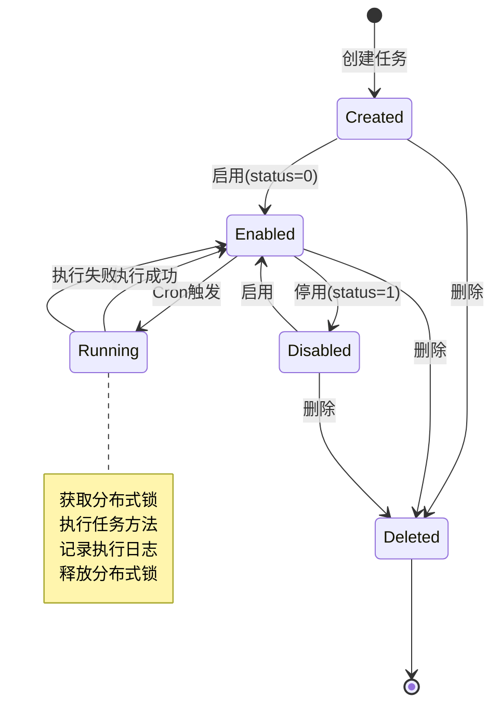
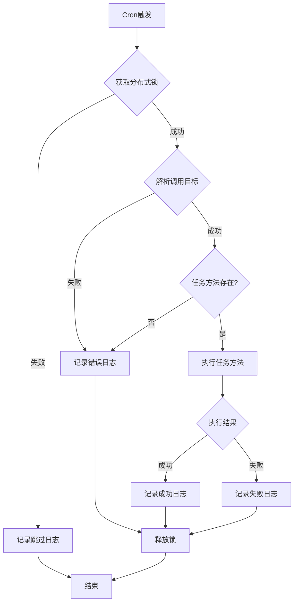
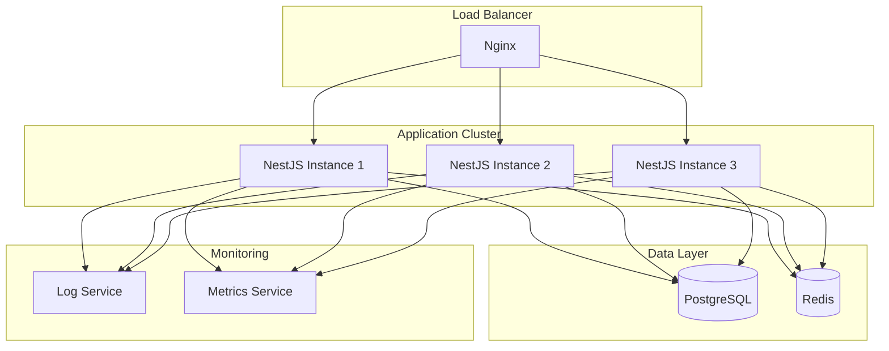
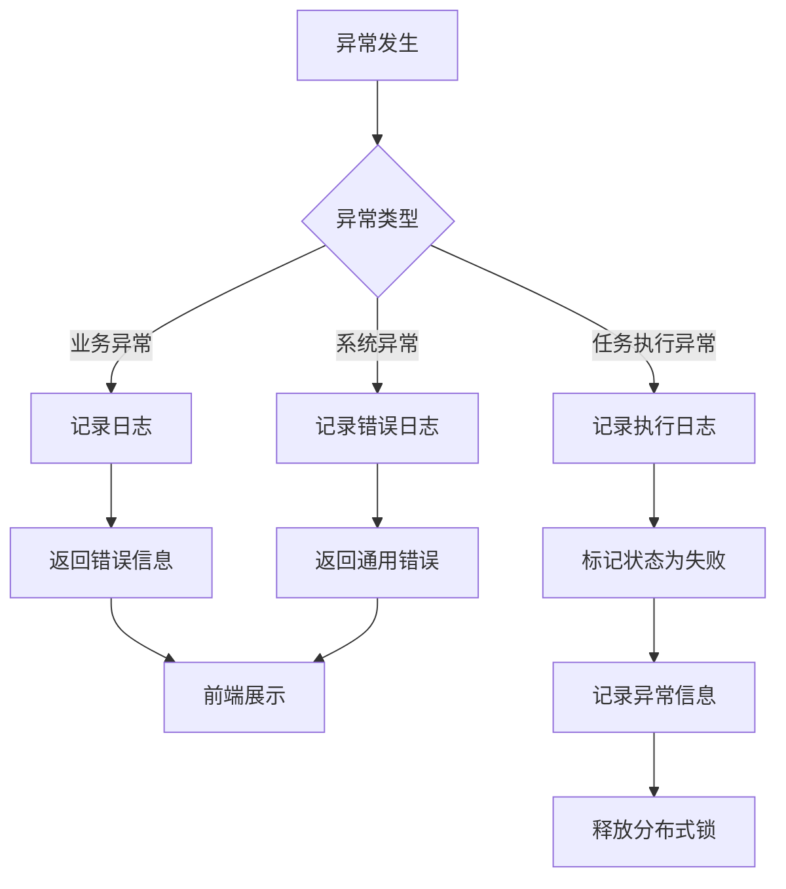

# 定时任务管理模块 - 设计文档

## 1. 概述

### 1.1 设计目标

定时任务管理模块基于NestJS Schedule模块实现，提供可视化的任务配置和管理能力。通过装饰器注册机制实现任务方法的动态发现，通过Redis分布式锁保证分布式环境下的任务执行唯一性。

### 1.2 设计原则

- 动态注册：通过@Task装饰器实现任务方法的自动注册
- 分布式安全：通过Redis分布式锁防止任务重复执行
- 可观测性：完整记录任务执行日志，包含耗时、状态、异常信息
- 高可用：支持服务重启后自动恢复任务调度
- 解耦设计：任务配置与任务实现分离

### 1.3 技术栈

- NestJS Schedule：任务调度框架
- cron库：Cron表达式解析和执行
- Redis：分布式锁实现
- Prisma：数据持久化
- TypeScript装饰器：任务注册机制

## 2. 架构设计

### 2.1 组件图



### 2.2 模块职责

| 模块             | 职责               | 依赖                                                        |
| ---------------- | ------------------ | ----------------------------------------------------------- |
| JobController    | 定时任务管理接口   | JobService                                                  |
| JobLogController | 执行日志管理接口   | JobLogService                                               |
| JobService       | 任务CRUD、调度管理 | JobRepository, SchedulerRegistry, TaskService, RedisService |
| JobLogService    | 日志CRUD           | PrismaService                                               |
| TaskService      | 任务执行、方法注册 | TaskRegistry, JobLogService, 业务Service                    |
| JobRepository    | 任务数据访问       | PrismaService                                               |
| TaskRegistry     | 任务方法注册表     | -                                                           |
| Task Decorator   | 任务方法装饰器     | TaskRegistry                                                |

## 3. 数据模型

### 3.1 类图



### 3.2 数据表设计

#### 3.2.1 sys_job (定时任务表)

| 字段            | 类型         | 说明             | 约束                        |
| --------------- | ------------ | ---------------- | --------------------------- |
| job_id          | INT          | 任务ID           | PK, AUTO_INCREMENT          |
| job_name        | VARCHAR(64)  | 任务名称         | NOT NULL                    |
| job_group       | VARCHAR(64)  | 任务组名         | NOT NULL, DEFAULT 'DEFAULT' |
| invoke_target   | VARCHAR(500) | 调用目标字符串   | NOT NULL                    |
| cron_expression | VARCHAR(255) | Cron表达式       | NOT NULL                    |
| misfire_policy  | VARCHAR(20)  | 计划执行错误策略 | DEFAULT '3'                 |
| concurrent      | VARCHAR(1)   | 是否并发执行     | DEFAULT '1'                 |
| status          | CHAR(1)      | 状态             | NOT NULL, DEFAULT '0'       |
| remark          | VARCHAR(500) | 备注             | NULL                        |
| create_by       | VARCHAR(64)  | 创建者           | NULL                        |
| create_time     | DATETIME     | 创建时间         | DEFAULT CURRENT_TIMESTAMP   |
| update_by       | VARCHAR(64)  | 更新者           | NULL                        |
| update_time     | DATETIME     | 更新时间         | DEFAULT CURRENT_TIMESTAMP   |

**索引**：

- PRIMARY KEY (job_id)
- INDEX idx_job_name (job_name)
- INDEX idx_job_group (job_group)
- INDEX idx_status (status)

#### 3.2.2 sys_job_log (任务执行日志表)

| 字段           | 类型         | 说明           | 约束                      |
| -------------- | ------------ | -------------- | ------------------------- |
| job_log_id     | BIGINT       | 日志ID         | PK, AUTO_INCREMENT        |
| job_name       | VARCHAR(64)  | 任务名称       | NOT NULL                  |
| job_group      | VARCHAR(64)  | 任务组名       | NOT NULL                  |
| invoke_target  | VARCHAR(500) | 调用目标字符串 | NOT NULL                  |
| job_message    | VARCHAR(500) | 日志信息       | NULL                      |
| status         | CHAR(1)      | 执行状态       | NOT NULL, DEFAULT '0'     |
| exception_info | TEXT         | 异常信息       | NULL                      |
| create_time    | DATETIME     | 创建时间       | DEFAULT CURRENT_TIMESTAMP |

**索引**：

- PRIMARY KEY (job_log_id)
- INDEX idx_job_name (job_name)
- INDEX idx_job_group (job_group)
- INDEX idx_status (status)
- INDEX idx_create_time (create_time)

## 4. 核心流程设计

### 4.1 任务初始化流程



### 4.2 创建任务流程



### 4.3 任务执行流程



### 4.4 修改任务状态流程



## 5. 状态与流程

### 5.1 任务生命周期状态图



### 5.2 任务执行决策流程



## 6. 接口设计

### 6.1 REST API接口

#### 6.1.1 查询任务列表

**接口**: GET /monitor/job/list

**请求参数**:

```typescript
{
  jobName?: string;      // 任务名称（模糊查询）
  jobGroup?: string;     // 任务组名
  status?: StatusEnum;   // 状态
  pageNum: number;       // 页码
  pageSize: number;      // 每页数量
}
```

**响应**:

```typescript
{
  code: 200,
  msg: "操作成功",
  data: {
    rows: SysJob[],
    total: number
  }
}
```

#### 6.1.2 创建任务

**接口**: POST /monitor/job

**请求体**:

```typescript
{
  jobName: string;           // 任务名称
  jobGroup: string;          // 任务组名
  invokeTarget: string;      // 调用目标
  cronExpression: string;    // Cron表达式
  misfirePolicy?: string;    // 执行错误策略
  concurrent?: string;       // 并发策略
  status: StatusEnum;        // 状态
  remark?: string;           // 备注
}
```

**响应**:

```typescript
{
  code: 200,
  msg: "操作成功"
}
```

#### 6.1.3 修改任务状态

**接口**: PUT /monitor/job/changeStatus

**请求体**:

```typescript
{
  jobId: number; // 任务ID
  status: string; // 目标状态
}
```

**响应**:

```typescript
{
  code: 200,
  msg: "操作成功"
}
```

#### 6.1.4 立即执行任务

**接口**: PUT /monitor/job/run

**请求体**:

```typescript
{
  jobId: number; // 任务ID
}
```

**响应**:

```typescript
{
  code: 200,
  msg: "操作成功"
}
```

### 6.2 内部接口

#### 6.2.1 TaskService.executeTask

```typescript
async executeTask(
  invokeTarget: string,    // 调用目标字符串
  jobName?: string,        // 任务名称
  jobGroup?: string        // 任务组名
): Promise<boolean>
```

**功能**: 执行任务并记录日志

**返回**: 执行是否成功

#### 6.2.2 TaskRegistry.registerTask

```typescript
registerTask(taskInfo: TaskInfo): void
```

**功能**: 注册任务方法到注册表

**参数**:

- classOrigin: 任务方法所在的类
- methodName: 任务方法名
- metadata: 任务元数据（名称、描述）

## 7. 部署架构

### 7.1 部署图



### 7.2 分布式部署说明

**多实例部署**：

- 支持多个NestJS实例同时运行
- 每个实例都会初始化任务调度器
- 通过Redis分布式锁保证任务只执行一次

**分布式锁机制**：

- 锁Key格式：`sys:job:{jobName}`
- 锁TTL：30秒（可根据任务执行时间调整）
- 获取锁失败时跳过本次执行

**高可用保障**：

- 任务配置持久化到数据库
- 服务重启后自动恢复任务调度
- Redis故障时任务仍可执行（但可能重复）

## 8. 安全设计

### 8.1 权限控制

| 操作         | 权限码                   | 说明           |
| ------------ | ------------------------ | -------------- |
| 查询任务列表 | monitor:job:list         | 查看任务配置   |
| 查询任务详情 | monitor:job:query        | 查看单个任务   |
| 创建任务     | monitor:job:add          | 新增任务       |
| 修改任务     | monitor:job:edit         | 更新任务配置   |
| 删除任务     | monitor:job:remove       | 删除任务       |
| 修改状态     | monitor:job:changeStatus | 启用/停用/执行 |
| 导出任务     | monitor:job:export       | 导出配置       |

### 8.2 安全措施

**调用目标验证**：

- 调用目标必须是已注册的任务方法
- 防止注入攻击
- 参数必须是JSON可序列化类型

**操作审计**：

- 所有操作记录操作日志（通过@Operlog装饰器）
- 记录操作人、操作时间、操作内容

**分布式锁**：

- 防止任务重复执行
- 锁超时自动释放
- 异常时确保锁释放

**错误信息脱敏**：

- 执行日志中的异常信息不包含敏感数据
- 仅记录错误消息，不记录完整堆栈

## 9. 性能优化

### 9.1 数据库优化

**索引设计**：

- sys_job表：job_name, job_group, status
- sys_job_log表：job_name, job_group, status, create_time

**查询优化**：

- 任务列表查询限制offset <= 5000
- 日志查询必须带时间范围（建议最多查询3个月）
- 使用分页查询，避免一次性加载大量数据

**日志归档**：

- 定期归档3个月前的执行日志
- 归档后的日志可移至历史表或文件存储
- 提供日志清空功能

### 9.2 任务执行优化

**分布式锁优化**：

- 使用Redis SetNX实现分布式锁
- 锁TTL根据任务执行时间动态调整
- 获取锁失败立即返回，不阻塞

**任务隔离**：

- 每个任务独立执行，互不影响
- 任务执行失败不影响其他任务
- 长时间运行的任务建议异步执行

**资源控制**：

- 限制并发任务数量
- 任务执行超时控制
- 内存占用监控

### 9.3 性能指标

| 指标         | 目标值       | 监控方式 |
| ------------ | ------------ | -------- |
| 任务调度延迟 | < 1秒        | 日志记录 |
| 任务列表查询 | P99 < 1000ms | APM监控  |
| 任务创建     | P99 < 1000ms | APM监控  |
| 日志查询     | P99 < 1500ms | APM监控  |
| 并发任务数   | 100+         | 系统监控 |

## 10. 异常处理

### 10.1 异常分类

| 异常类型       | 处理方式     | 示例                  |
| -------------- | ------------ | --------------------- |
| Cron表达式无效 | 返回错误提示 | "Cron表达式格式错误"  |
| 任务方法不存在 | 返回错误提示 | "任务方法不存在"      |
| 任务执行失败   | 记录异常日志 | 记录异常信息到job_log |
| 获取锁失败     | 跳过本次执行 | 记录跳过日志          |
| 数据库异常     | 抛出业务异常 | "数据库操作失败"      |

### 10.2 异常处理流程



### 10.3 错误码定义

| 错误码 | 说明       | HTTP状态码 |
| ------ | ---------- | ---------- |
| 200    | 操作成功   | 200        |
| 500    | 业务错误   | 200        |
| 404    | 任务不存在 | 200        |
| 400    | 参数错误   | 200        |

## 11. 监控与日志

### 11.1 日志记录

**应用日志**：

- 任务初始化日志
- 任务注册日志
- 任务执行日志（开始、结束、耗时）
- 分布式锁获取失败日志
- 异常日志

**执行日志**：

- 任务名称、任务组名
- 调用目标字符串
- 执行状态（成功/失败）
- 执行耗时
- 异常信息（如果失败）
- 执行时间

### 11.2 监控指标

**任务指标**：

- 任务总数
- 启用任务数
- 停用任务数
- 执行中任务数

**执行指标**：

- 执行成功率
- 执行失败率
- 平均执行耗时
- 最长执行耗时

**系统指标**：

- 调度器状态
- Redis连接状态
- 数据库连接状态

### 11.3 告警规则

| 告警项             | 阈值     | 级别 |
| ------------------ | -------- | ---- |
| 任务执行失败率     | > 10%    | P1   |
| 任务执行超时       | > 5分钟  | P2   |
| 分布式锁获取失败率 | > 20%    | P2   |
| 日志表数据量       | > 1000万 | P3   |

## 12. 扩展设计

### 12.1 任务装饰器机制

**@Task装饰器**：

```typescript
@Task({
  name: 'task.example',
  description: '示例任务'
})
async exampleTask(param1: string, param2: number) {
  // 任务逻辑
}
```

**注册流程**：

1. 装饰器收集任务元数据
2. 注册到TaskRegistry单例
3. TaskService初始化时加载所有任务
4. 动态绑定任务方法到Service实例

### 12.2 内置任务

**存储配额预警任务**：

- 任务名：storageQuotaAlert
- 功能：检查租户存储使用率，超过80%发送预警
- 执行频率：每天凌晨2点

**清理旧文件版本任务**：

- 任务名：cleanOldFileVersions
- 功能：清理超过maxVersions限制的旧版本文件
- 执行频率：每天凌晨3点

**示例任务**：

- task.noParams：无参示例
- task.params：有参示例
- task.clearTemp：清理临时文件
- task.monitorSystem：系统监控
- task.backupDatabase：数据库备份

### 12.3 扩展点

**任务依赖关系**：

- 预留任务依赖配置字段
- 支持任务执行顺序控制
- 支持任务执行条件判断

**任务执行通知**：

- 预留通知配置字段
- 支持邮件、短信、钉钉等通知方式
- 支持执行成功/失败通知

**任务执行统计**：

- 预留统计分析接口
- 支持任务执行趋势分析
- 支持任务性能分析

## 13. 缺陷分析

### 13.1 P0级缺陷（阻塞性）

无

### 13.2 P1级缺陷（高优先级）

1. **缺少日志归档机制**
   - 现状：执行日志无限增长，仅提供清空功能
   - 影响：日志表数据量过大影响查询性能
   - 建议：实现定期归档策略，保留3个月数据

2. **缺少任务执行超时控制**
   - 现状：分布式锁TTL固定30秒，无法根据任务调整
   - 影响：长时间运行的任务可能被中断
   - 建议：支持任务级别的超时配置

3. **缺少任务执行统计**
   - 现状：仅记录执行日志，无统计分析
   - 影响：无法直观了解任务执行情况
   - 建议：增加任务执行统计报表

### 13.3 P2级缺陷（中优先级）

1. **缺少任务依赖关系管理**
   - 现状：任务独立执行，无依赖关系
   - 影响：无法实现复杂的任务编排
   - 建议：增加任务依赖配置

2. **缺少任务执行通知**
   - 现状：任务执行失败无主动通知
   - 影响：需要人工查看日志才能发现问题
   - 建议：增加邮件、短信、钉钉等通知方式

3. **缺少任务执行可视化**
   - 现状：仅提供列表和日志查询
   - 影响：无法直观监控任务执行状态
   - 建议：增加任务执行监控大屏

### 13.4 P3级缺陷（低优先级）

1. **缺少任务版本管理**
   - 现状：任务配置修改无历史记录
   - 影响：无法回溯任务配置变更
   - 建议：增加任务配置版本管理

2. **缺少任务执行重试机制**
   - 现状：任务执行失败后不自动重试
   - 影响：需要手动触发重试
   - 建议：增加自动重试配置

## 14. 技术债务

### 14.1 代码质量

- JobService行数适中（约200行），职责清晰
- TaskService行数适中（约250行），包含多个内置任务
- 使用了getErrorMessage/getErrorStack安全处理异常
- 使用了@Transactional装饰器处理事务

### 14.2 性能优化

- 日志表缺少归档策略，需要定期清理
- 日志查询建议限制时间范围
- 分布式锁TTL可以优化为动态配置

### 14.3 测试覆盖

- 缺少单元测试
- 缺少集成测试
- 建议补充核心逻辑的测试用例

## 15. 参考资料

### 15.1 相关文档

- NestJS Schedule文档：https://docs.nestjs.com/techniques/task-scheduling
- Cron表达式文档：https://github.com/kelektiv/node-cron
- Redis分布式锁：https://redis.io/topics/distlock

### 15.2 相关模块

- 操作日志模块：记录任务操作
- 通知模块：存储配额预警
- 文件版本模块：清理旧版本
- 备份模块：数据库备份

---

**文档版本**: 1.0  
**编写日期**: 2026-02-23  
**编写人**: AI Assistant
