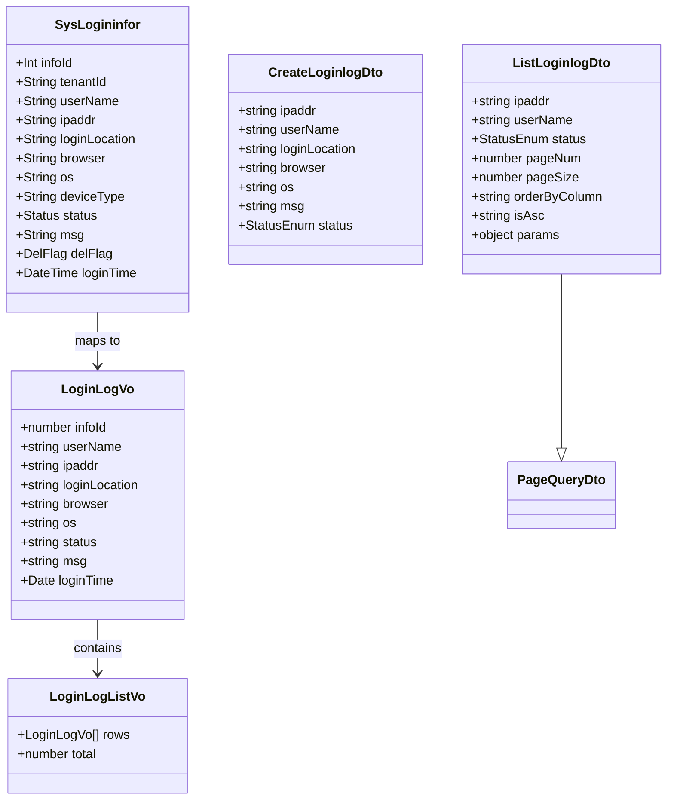
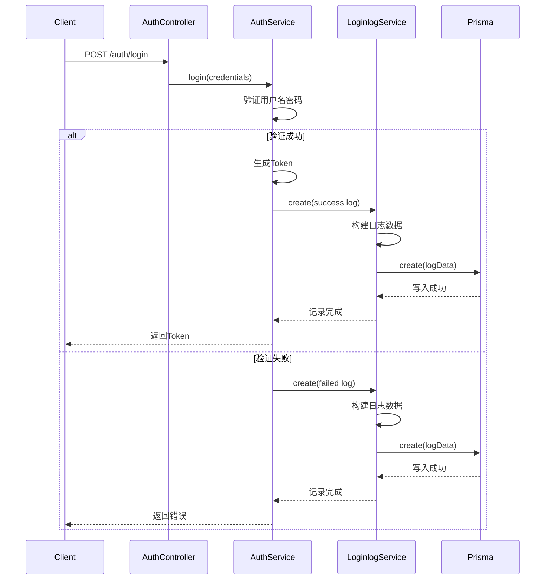
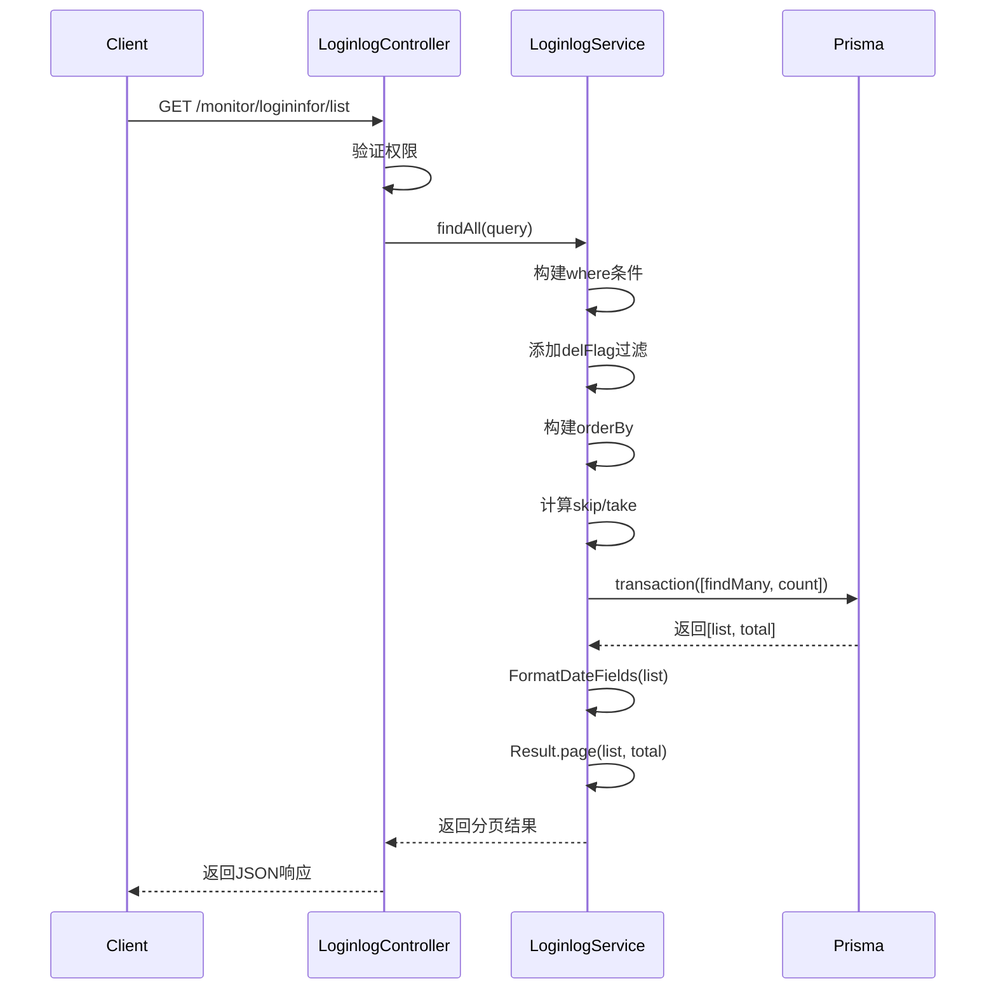
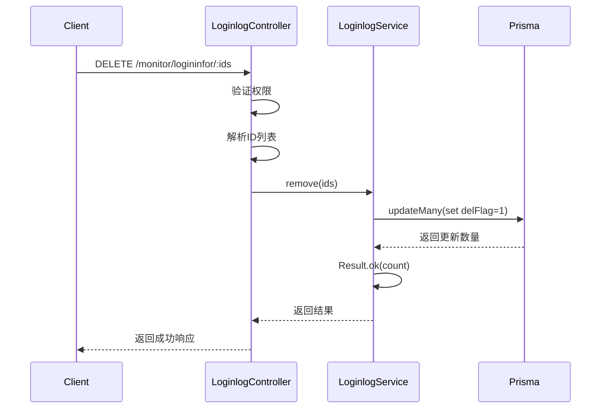
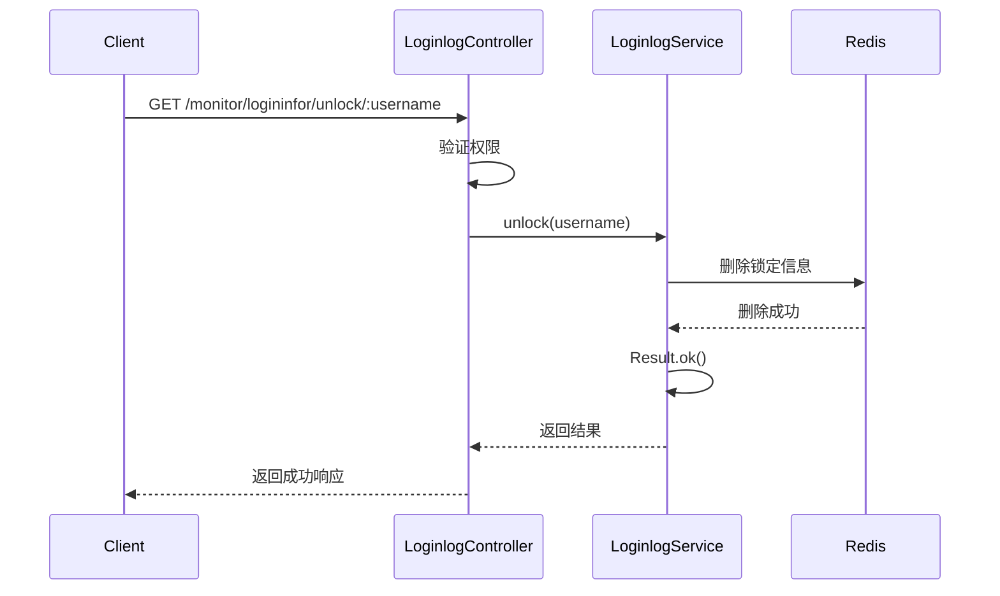
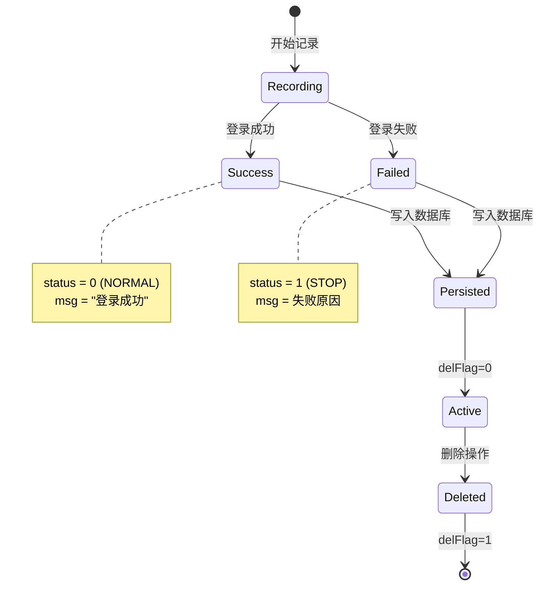
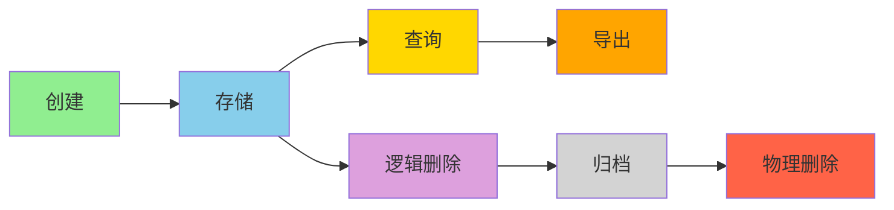
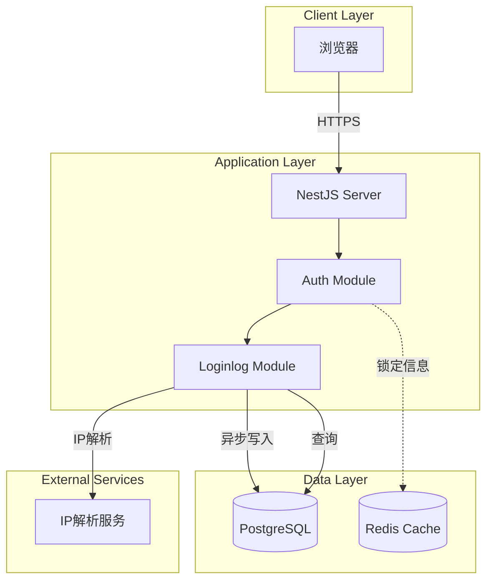

# 登录日志模块设计文档

## 1. 概述

### 1.1 设计目标

登录日志模块采用自动化记录机制，在用户登录时捕获登录信息并异步写入数据库。设计重点关注登录安全监控、异常行为识别、性能优化和数据安全。

### 1.2 设计原则

- 非侵入性：登录日志记录不影响登录流程
- 异步处理：日志记录不阻塞登录请求
- 安全优先：记录完整信息用于安全审计
- 性能优先：合理索引，支持大数据量查询
- 数据安全：租户隔离，逻辑删除

### 1.3 技术栈

- NestJS：Web框架
- Prisma：ORM
- User-Agent解析：浏览器和操作系统识别
- IP解析服务：地理位置识别
- ExportTable：Excel导出

## 2. 架构与模块

### 2.1 模块结构

```
loginlog/
├── dto/
│   ├── create-loginlog.dto.ts    # 创建DTO
│   ├── list-loginlog.dto.ts      # 查询DTO
│   ├── update-loginlog.dto.ts    # 更新DTO
│   └── index.ts                   # 导出
├── loginlog.controller.ts         # 控制器
├── loginlog.service.ts            # 业务逻辑
├── loginlog.repository.ts         # 数据访问
└── loginlog.module.ts             # 模块定义
```

### 2.2 组件图

```mermaid
graph TB
    subgraph "Controller Layer"
        LC[LoginlogController]
    end

    subgraph "Service Layer"
        LS[LoginlogService]
    end

    subgraph "Repository Layer"
        LR[LoginlogRepository]
    end

    subgraph "External Dependencies"
        PS[PrismaService]
        ET[ExportTable]
    end

    subgraph "Auth Module"
        AM[AuthModule]
    end

    subgraph "Decorators"
        RP[@RequirePermission]
        OL[@Operlog]
    end

    LC --> LS
    LS --> LR
    LS --> ET
    LR --> PS
    AM -.calls.-> LS
    LC -.uses.-> RP
    LC -.uses.-> OL
```

### 2.3 依赖关系

| 模块               | 依赖                            | 说明           |
| ------------------ | ------------------------------- | -------------- |
| LoginlogController | LoginlogService                 | 调用业务逻辑   |
| LoginlogService    | LoginlogRepository, ExportTable | 日志记录和查询 |
| LoginlogRepository | PrismaService                   | 数据库访问     |
| AuthModule         | LoginlogService                 | 登录时记录日志 |

## 3. 领域/数据模型

### 3.1 类图



### 3.2 实体关系

登录日志是独立实体，不与其他实体建立外键关系，仅通过字段值关联：

- `tenantId`：关联租户
- `userName`：关联用户名

## 4. 核心流程时序

### 4.1 自动记录登录日志



### 4.2 查询登录日志列表



### 4.3 批量删除登录日志



### 4.4 解锁用户



## 5. 状态与流程

### 5.1 登录日志状态机



### 5.2 日志生命周期



## 6. 接口/数据约定

### 6.1 REST API接口

#### 6.1.1 查询登录日志列表

```typescript
GET /monitor/logininfor/list

Query Parameters:
- ipaddr?: string          // IP地址（模糊匹配）
- userName?: string        // 用户名（模糊匹配）
- status?: StatusEnum      // 登录状态
- params?: {
    beginTime?: string     // 开始时间
    endTime?: string       // 结束时间
  }
- pageNum?: number         // 页码
- pageSize?: number        // 每页数量
- orderByColumn?: string   // 排序字段
- isAsc?: 'asc' | 'desc'   // 排序方向

Response:
{
  code: 200,
  msg: "success",
  data: {
    rows: LoginLogVo[],
    total: number,
    pageNum: number,
    pageSize: number
  }
}

Permission: monitor:logininfor:list
Tenant Scope: TenantScoped (通过BaseRepository自动过滤)
```

#### 6.1.2 批量删除登录日志

```typescript
DELETE /monitor/logininfor/:ids

Path Parameters:
- ids: string              // 日志ID，多个用逗号分隔

Response:
{
  code: 200,
  msg: "success",
  data: number             // 删除数量
}

Permission: monitor:logininfor:remove
Tenant Scope: TenantScoped
Business Type: DELETE
```

#### 6.1.3 清空全部日志

```typescript
DELETE /monitor/logininfor/clean

Response:
{
  code: 200,
  msg: "success",
  data: null
}

Permission: monitor:logininfor:remove
Tenant Scope: TenantScoped
Business Type: CLEAN
```

#### 6.1.4 解锁用户

```typescript
GET /monitor/logininfor/unlock/:username

Path Parameters:
- username: string         // 用户名

Response:
{
  code: 200,
  msg: "success",
  data: null
}

Permission: monitor:logininfor:unlock
Tenant Scope: TenantAgnostic
Business Type: UPDATE
```

#### 6.1.5 导出登录日志

```typescript
POST /monitor/logininfor/export

Body: ListLoginlogDto (同列表查询参数，不含分页)

Response: Excel文件流
Content-Type: application/vnd.openxmlformats-officedocument.spreadsheetml.sheet

Permission: system:config:export
Tenant Scope: TenantScoped
Business Type: EXPORT
```

### 6.2 内部接口

#### 6.2.1 创建登录日志

```typescript
async create(dto: CreateLoginlogDto): Promise<SysLogininfor>

Parameters:
- dto.userName?: string        // 用户名
- dto.ipaddr?: string          // IP地址
- dto.loginLocation?: string   // 登录地点
- dto.browser?: string         // 浏览器
- dto.os?: string              // 操作系统
- dto.msg?: string             // 提示消息
- dto.status?: StatusEnum      // 登录状态

Returns: SysLogininfor实体
```

### 6.3 数据库Schema

```prisma
model SysLogininfor {
  infoId        Int      @id @default(autoincrement())
  tenantId      String   @default("000000") @db.VarChar(20)
  userName      String   @db.VarChar(50)
  ipaddr        String   @db.VarChar(128)
  loginLocation String   @default("") @db.VarChar(255)
  browser       String   @db.VarChar(50)
  os            String   @db.VarChar(50)
  deviceType    String   @default("0") @db.Char(1)
  status        Status
  msg           String   @db.VarChar(255)
  delFlag       DelFlag  @default(NORMAL)
  loginTime     DateTime @default(now())

  @@index([tenantId, loginTime])
  @@index([userName])
  @@index([status])
  @@index([loginTime])
  @@index([tenantId, userName, loginTime])
  @@index([tenantId, status, loginTime])
  @@index([delFlag])
}
```

## 7. 部署架构

### 7.1 部署图



### 7.2 运行环境

| 组件       | 版本要求 | 说明           |
| ---------- | -------- | -------------- |
| Node.js    | >= 18    | 运行时环境     |
| NestJS     | >= 10    | Web框架        |
| PostgreSQL | >= 14    | 主数据库       |
| Redis      | >= 6     | 缓存和锁定信息 |

## 8. 安全设计

### 8.1 权限控制

| 操作     | 权限标识                  | 说明         |
| -------- | ------------------------- | ------------ |
| 查询列表 | monitor:logininfor:list   | 查看日志列表 |
| 删除日志 | monitor:logininfor:remove | 删除日志     |
| 清空日志 | monitor:logininfor:remove | 清空所有日志 |
| 解锁用户 | monitor:logininfor:unlock | 解锁用户     |
| 导出日志 | system:config:export      | 导出Excel    |

### 8.2 租户隔离

- 使用 `BaseRepository` 自动过滤租户数据
- 日志记录时自动从上下文获取 `tenantId`
- 查询时自动添加 `tenantId` 条件
- 禁止跨租户访问日志

### 8.3 敏感信息保护

```typescript
// 不记录的敏感信息
const sensitiveFields = ['password', 'token', 'secret'];

// 创建日志时确保不包含敏感信息
async create(dto: CreateLoginlogDto) {
  // 不记录密码等敏感信息
  return await this.prisma.sysLogininfor.create({
    data: {
      userName: dto.userName ?? '',
      // 不包含password字段
    }
  });
}
```

### 8.4 数据完整性

- 登录日志不可修改（无update接口）
- 使用逻辑删除，保留原始数据
- 删除操作需要权限验证
- 清空操作需要二次确认

## 9. 性能优化

### 9.1 索引优化

```sql
-- 租户+时间复合索引（最常用）
CREATE INDEX idx_tenant_time ON sys_logininfor(tenant_id, login_time);

-- 租户+用户+时间复合索引
CREATE INDEX idx_tenant_user_time ON sys_logininfor(tenant_id, user_name, login_time);

-- 租户+状态+时间复合索引
CREATE INDEX idx_tenant_status_time ON sys_logininfor(tenant_id, status, login_time);

-- 单字段索引
CREATE INDEX idx_user_name ON sys_logininfor(user_name);
CREATE INDEX idx_status ON sys_logininfor(status);
CREATE INDEX idx_login_time ON sys_logininfor(login_time);
CREATE INDEX idx_del_flag ON sys_logininfor(del_flag);
```

### 9.2 查询优化

```typescript
// 1. 使用PageQueryDto的便捷方法
const dateRange = query.getDateRange?.('loginTime');
const orderBy = query.getOrderBy?.('loginTime') || { loginTime: 'desc' };

// 2. 强制过滤已删除数据
where.delFlag = DelFlagEnum.NORMAL;

// 3. 使用事务批量查询
const [list, total] = await this.prisma.$transaction([
  this.prisma.sysLogininfor.findMany({ where, skip, take, orderBy }),
  this.prisma.sysLogininfor.count({ where }),
]);

// 4. 使用Result.page便捷方法
return Result.page(FormatDateFields(list), total, query.pageNum, query.pageSize);
```

### 9.3 异步记录

```typescript
// 登录日志记录不阻塞登录流程
async create(dto: CreateLoginlogDto) {
  // 不使用 await，异步执行
  this.prisma.sysLogininfor.create({ data })
    .catch(error => {
      // 记录失败不影响登录
      this.logger.error('登录日志记录失败', error);
    });
}
```

### 9.4 数据归档

```typescript
// Repository提供按天数删除方法
async deleteByDays(days: number): Promise<number> {
  const beforeDate = new Date();
  beforeDate.setDate(beforeDate.getDate() - days);

  const result = await this.prisma.sysLogininfor.deleteMany({
    where: {
      loginTime: { lt: beforeDate }
    }
  });

  return result.count;
}
```

## 10. 监控与日志

### 10.1 监控指标

| 指标               | 阈值      | 说明              |
| ------------------ | --------- | ----------------- |
| 登录日志记录成功率 | >= 99.9%  | 记录失败率 < 0.1% |
| 日志查询P95延迟    | <= 1000ms | 95%请求 < 1s      |
| 日志导出P95延迟    | <= 5000ms | 95%请求 < 5s      |
| 失败登录次数       | 监控      | 异常登录检测      |
| 数据库连接池使用率 | <= 80%    | 避免连接耗尽      |
| 登录日志表大小     | 监控      | 及时归档          |

### 10.2 日志记录

```typescript
// Service层日志
this.logger.log(`登录日志查询: ${JSON.stringify(query)}`);
this.logger.error(`登录日志记录失败: ${error.message}`, error.stack);

// 关键操作日志
this.logger.warn(`清空登录日志: 操作人=${operName}`);
this.logger.warn(`解锁用户: 用户名=${username}, 操作人=${operName}`);
```

### 10.3 告警规则

- 登录日志记录失败率 > 1%：P1告警
- 单用户失败登录次数 > 5次/5分钟：P1告警（可能是暴力破解）
- 单IP失败登录次数 > 10次/5分钟：P1告警（可能是攻击）
- 日志查询P95延迟 > 2s：P2告警
- 登录日志表大小 > 500万：P2告警
- 清空日志操作：P1告警（高危操作）

## 11. 可扩展性设计

### 11.1 异常登录检测

```typescript
// 支持注册异常登录检测器
interface LoginAnomalyDetector {
  detect(log: SysLogininfor): Promise<boolean>;
}

class BruteForceDetector implements LoginAnomalyDetector {
  async detect(log: SysLogininfor): Promise<boolean> {
    // 检测暴力破解
    const recentFailures = await this.countRecentFailures(log.userName);
    return recentFailures > 5;
  }
}

class GeoAnomalyDetector implements LoginAnomalyDetector {
  async detect(log: SysLogininfor): Promise<boolean> {
    // 检测异地登录
    const lastLocation = await this.getLastLoginLocation(log.userName);
    return this.isAnomalousLocation(lastLocation, log.loginLocation);
  }
}
```

### 11.2 日志分级存储

```typescript
// 根据登录状态分级存储
enum LogLevel {
  HOT = 'hot', // 热数据：最近30天
  WARM = 'warm', // 温数据：30-90天
  COLD = 'cold', // 冷数据：90-180天
  ARCHIVE = 'archive', // 归档：>180天
}
```

### 11.3 统计分析

```typescript
// 支持多维度统计
interface LoginStatistics {
  totalLogins: number;
  successLogins: number;
  failedLogins: number;
  uniqueUsers: number;
  uniqueIPs: number;
  topUsers: Array<{ userName: string; count: number }>;
  topIPs: Array<{ ipaddr: string; count: number }>;
}
```

## 12. 测试策略

### 12.1 单元测试

```typescript
describe('LoginlogService', () => {
  it('应该正确创建登录日志', async () => {
    const result = await service.create({
      userName: 'testuser',
      ipaddr: '127.0.0.1',
      status: StatusEnum.NORMAL,
      msg: '登录成功',
    });
    expect(result).toBeDefined();
    expect(result.userName).toBe('testuser');
  });

  it('应该正确查询登录日志列表', async () => {
    const result = await service.findAll({
      pageNum: 1,
      pageSize: 10,
    });
    expect(result.data.rows).toBeInstanceOf(Array);
  });

  it('应该正确批量删除日志', async () => {
    const result = await service.remove(['1', '2', '3']);
    expect(result.data).toBeGreaterThan(0);
  });
});
```

### 12.2 集成测试

```typescript
describe('Loginlog E2E', () => {
  it('GET /monitor/logininfor/list 应该返回日志列表', () => {
    return request(app.getHttpServer())
      .get('/monitor/logininfor/list')
      .set('Authorization', `Bearer ${token}`)
      .expect(200)
      .expect((res) => {
        expect(res.body.data.rows).toBeInstanceOf(Array);
      });
  });

  it('DELETE /monitor/logininfor/:ids 应该删除日志', () => {
    return request(app.getHttpServer())
      .delete('/monitor/logininfor/1,2,3')
      .set('Authorization', `Bearer ${token}`)
      .expect(200);
  });
});
```

### 12.3 性能测试

- 并发100用户查询日志，响应时间 < 1s
- 并发50用户导出日志，响应时间 < 5s
- 百万级数据查询，响应时间 < 1s
- 登录日志记录不阻塞登录流程

## 13. 实施计划

### 13.1 第一阶段：核心功能（1周）

- [ ] 实现登录日志自动记录
- [ ] 实现日志查询和列表
- [ ] 实现逻辑删除功能
- [ ] 单元测试覆盖率 >= 80%

### 13.2 第二阶段：完善功能（1周）

- [ ] 实现用户解锁功能
- [ ] 实现日志导出
- [ ] 优化查询性能
- [ ] 集成测试

### 13.3 第三阶段：优化与监控（1周）

- [ ] 实现日志归档
- [ ] 添加监控指标
- [ ] 实现异常登录检测
- [ ] 性能测试
- [ ] 文档完善

## 14. 缺陷分析

### 14.1 已识别缺陷

#### P0 - 解锁功能未实现

- **现状**：`unlock` 方法仅返回成功，未实际清除锁定信息
- **影响**：用户被锁定后无法解锁
- **建议**：实现Redis锁定信息清除逻辑

```typescript
async unlock(username: string) {
  // 当前实现
  return Result.ok();

  // 应该实现
  await this.redis.del(`login:lock:${username}`);
  return Result.ok();
}
```

#### P1 - 缺少日志归档功能

- **现状**：仅提供逻辑删除，未实现自动归档
- **影响**：长期运行后数据量过大，影响查询性能
- **建议**：实现定时任务，自动归档180天前的日志

#### P1 - 缺少异常登录检测

- **现状**：仅记录登录日志，未分析异常行为
- **影响**：无法及时发现暴力破解、异地登录等异常
- **建议**：实现异常登录检测和告警机制

#### P2 - 缺少登录统计分析

- **现状**：仅提供基础查询功能
- **影响**：无法快速了解登录情况
- **建议**：添加统计接口，如登录成功率、活跃用户TOP10等

#### P2 - 导出权限不一致

- **现状**：导出使用 `system:config:export` 权限
- **影响**：权限标识不统一，容易混淆
- **建议**：改为 `monitor:logininfor:export`

#### P3 - Repository方法未被使用

- **现状**：Repository定义了多个方法，但Service中未使用
- **影响**：代码冗余，维护成本高
- **建议**：删除未使用的方法，或在Service中使用Repository方法

#### P3 - 缺少IP和User-Agent解析

- **现状**：`loginLocation`、`browser`、`os` 需要外部传入
- **影响**：调用方需要自行解析，增加复杂度
- **建议**：在Service中自动解析IP和User-Agent

### 14.2 技术债务

- Service直接使用PrismaService，未使用Repository
- 缺少日志记录失败的重试机制
- 缺少日志记录的降级策略
- 逻辑删除后数据仍占用存储空间

## 15. 参考资料

- [NestJS官方文档](https://docs.nestjs.com/)
- [Prisma文档](https://www.prisma.io/docs)
- [登录安全最佳实践](https://owasp.org/www-project-top-ten/)
- [User-Agent解析库](https://github.com/faisalman/ua-parser-js)
