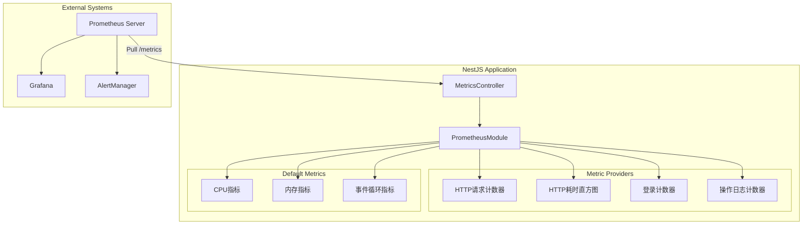
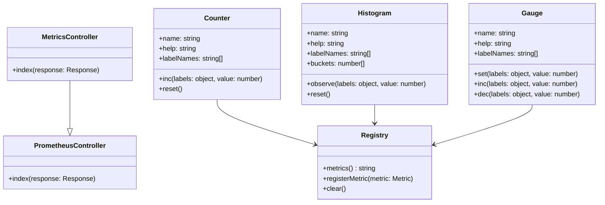
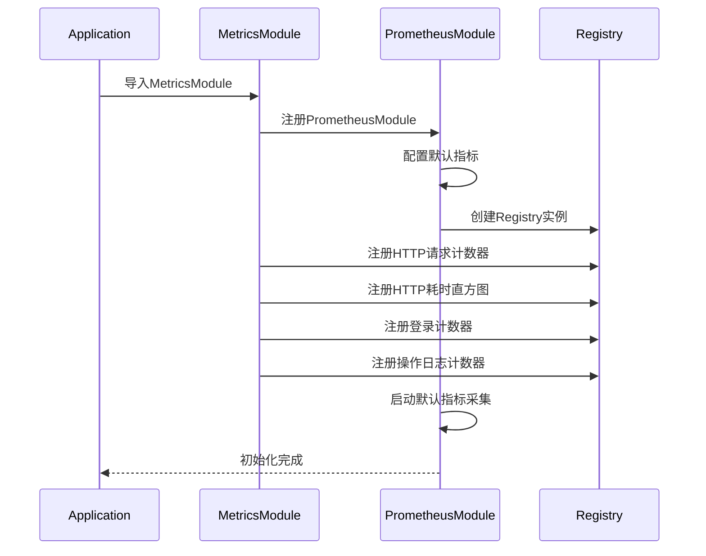
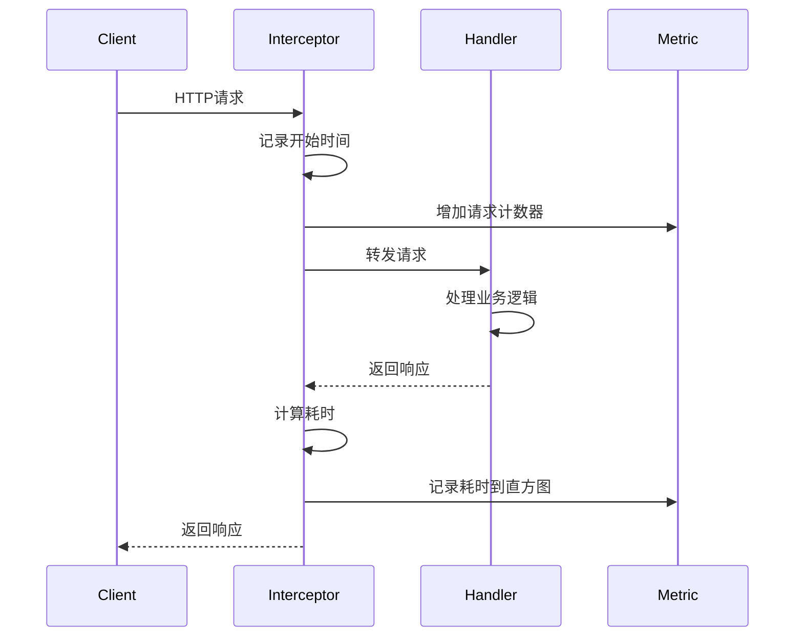
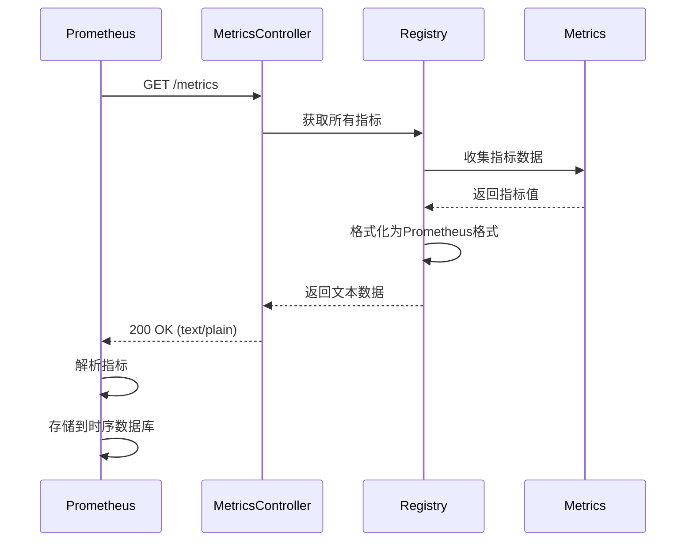
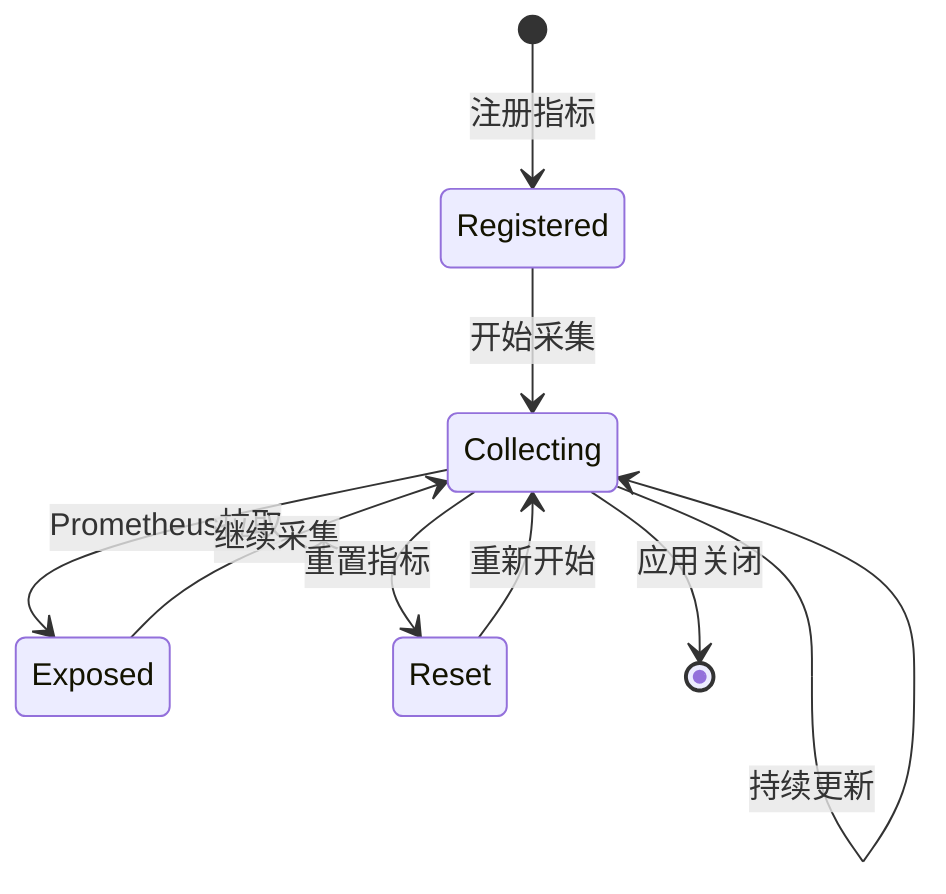
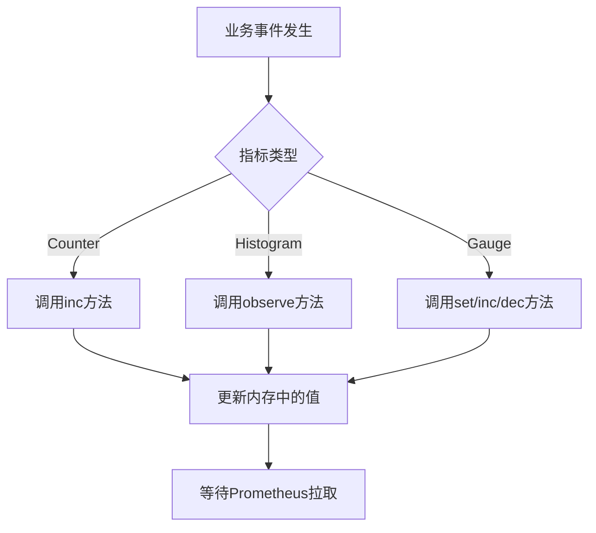
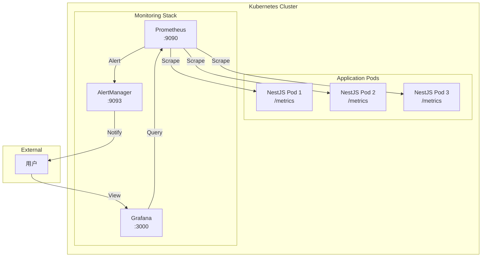
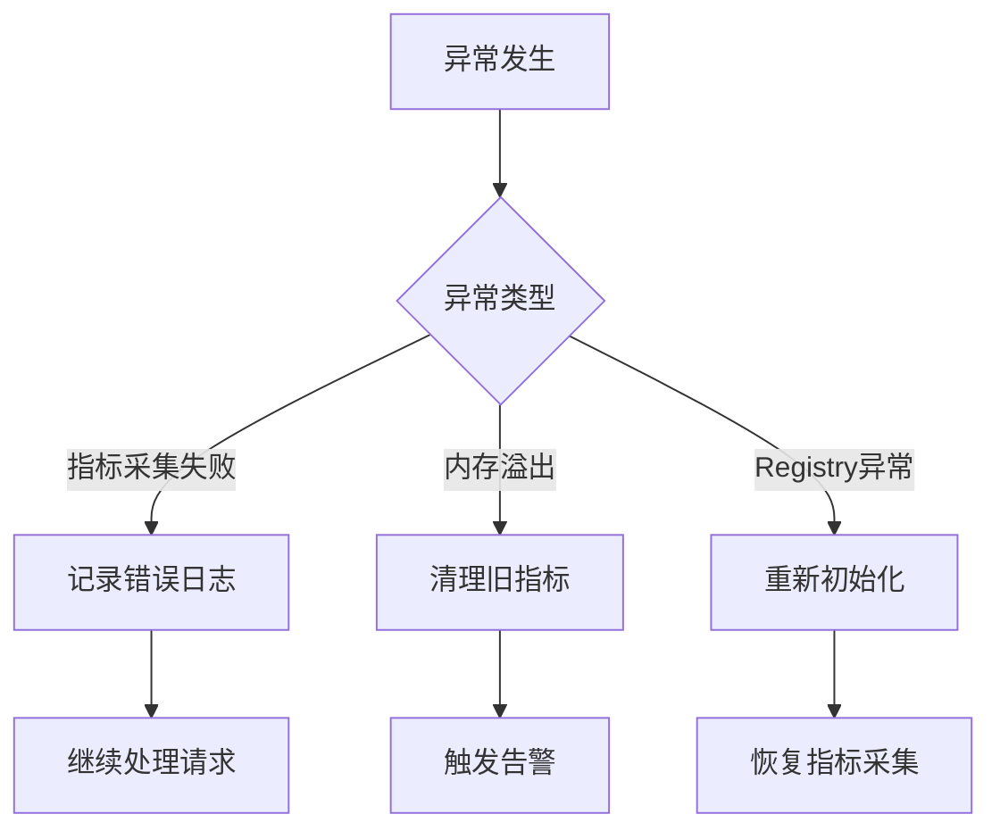

# 系统指标监控模块 - 设计文档

## 1. 概述

### 1.1 设计目标

系统指标监控模块基于@willsoto/nestjs-prometheus库实现，提供标准的Prometheus指标暴露能力。通过声明式配置和装饰器模式，实现指标的自动采集和暴露，为系统可观测性提供基础数据支撑。

### 1.2 设计原则

- 标准化：遵循Prometheus指标规范
- 低侵入：指标采集不影响业务逻辑
- 高性能：指标采集开销最小化
- 可扩展：支持动态注册自定义指标
- 易集成：与Prometheus、Grafana无缝集成

### 1.3 技术栈

- @willsoto/nestjs-prometheus：NestJS的Prometheus集成库
- prom-client：Prometheus客户端库
- Prometheus：指标采集和存储
- Grafana：指标可视化

## 2. 架构设计

### 2.1 组件图



### 2.2 模块职责

| 模块              | 职责             | 依赖                 |
| ----------------- | ---------------- | -------------------- |
| MetricsController | 暴露/metrics接口 | PrometheusController |
| PrometheusModule  | Prometheus集成   | prom-client          |
| Metric Providers  | 指标提供者       | PrometheusModule     |
| Default Metrics   | 默认系统指标     | prom-client          |

## 3. 数据模型

### 3.1 类图



### 3.2 指标定义

#### 3.2.1 HTTP请求计数器

```typescript
{
  name: 'http_requests_total',
  help: 'Total number of HTTP requests',
  labelNames: ['method', 'path', 'status'],
  type: 'counter'
}
```

#### 3.2.2 HTTP请求耗时直方图

```typescript
{
  name: 'http_request_duration_seconds',
  help: 'HTTP request duration in seconds',
  labelNames: ['method', 'path', 'status'],
  buckets: [0.001, 0.01, 0.1, 0.5, 1, 2, 5, 10],
  type: 'histogram'
}
```

#### 3.2.3 用户登录计数器

```typescript
{
  name: 'user_login_total',
  help: 'Total number of user logins',
  labelNames: ['tenant_id', 'status'],
  type: 'counter'
}
```

#### 3.2.4 操作日志计数器

```typescript
{
  name: 'operation_log_total',
  help: 'Total number of operations logged',
  labelNames: ['tenant_id', 'business_type'],
  type: 'counter'
}
```

## 4. 核心流程设计

### 4.1 模块初始化流程



### 4.2 指标采集流程



### 4.3 指标暴露流程



## 5. 状态与流程

### 5.1 指标生命周期



### 5.2 指标更新流程



## 6. 接口设计

### 6.1 REST API接口

#### 6.1.1 获取Prometheus指标

**接口**: GET /metrics

**请求头**:

```
Accept: text/plain
```

**响应头**:

```
Content-Type: text/plain; version=0.0.4
```

**响应体示例**:

```
# HELP nest_admin_http_requests_total Total number of HTTP requests
# TYPE nest_admin_http_requests_total counter
nest_admin_http_requests_total{method="GET",path="/api/users",status="200"} 1234
nest_admin_http_requests_total{method="POST",path="/api/users",status="201"} 56

# HELP nest_admin_http_request_duration_seconds HTTP request duration in seconds
# TYPE nest_admin_http_request_duration_seconds histogram
nest_admin_http_request_duration_seconds_bucket{method="GET",path="/api/users",status="200",le="0.001"} 100
nest_admin_http_request_duration_seconds_bucket{method="GET",path="/api/users",status="200",le="0.01"} 500
nest_admin_http_request_duration_seconds_bucket{method="GET",path="/api/users",status="200",le="0.1"} 1000
nest_admin_http_request_duration_seconds_bucket{method="GET",path="/api/users",status="200",le="+Inf"} 1234
nest_admin_http_request_duration_seconds_sum{method="GET",path="/api/users",status="200"} 12.34
nest_admin_http_request_duration_seconds_count{method="GET",path="/api/users",status="200"} 1234

# HELP nest_admin_user_login_total Total number of user logins
# TYPE nest_admin_user_login_total counter
nest_admin_user_login_total{tenant_id="1",status="success"} 789
nest_admin_user_login_total{tenant_id="1",status="failed"} 12

# HELP nest_admin_operation_log_total Total number of operations logged
# TYPE nest_admin_operation_log_total counter
nest_admin_operation_log_total{tenant_id="1",business_type="INSERT"} 345
nest_admin_operation_log_total{tenant_id="1",business_type="UPDATE"} 234
nest_admin_operation_log_total{tenant_id="1",business_type="DELETE"} 123
```

### 6.2 内部接口

#### 6.2.1 Counter.inc

```typescript
inc(labels?: Record<string, string>, value?: number): void
```

**功能**: 增加计数器的值

**参数**:

- labels: 标签对象
- value: 增加的值（默认1）

**示例**:

```typescript
httpRequestsCounter.inc({ method: 'GET', path: '/api/users', status: '200' });
```

#### 6.2.2 Histogram.observe

```typescript
observe(labels: Record<string, string>, value: number): void
```

**功能**: 记录观测值到直方图

**参数**:

- labels: 标签对象
- value: 观测值（秒）

**示例**:

```typescript
httpDurationHistogram.observe({ method: 'GET', path: '/api/users', status: '200' }, 0.123);
```

## 7. 部署架构

### 7.1 部署图



### 7.2 服务发现配置

**Kubernetes服务发现**:

```yaml
scrape_configs:
  - job_name: 'nest-admin'
    kubernetes_sd_configs:
      - role: pod
        namespaces:
          names:
            - default
    relabel_configs:
      - source_labels: [__meta_kubernetes_pod_label_app]
        action: keep
        regex: nest-admin
      - source_labels: [__meta_kubernetes_pod_ip]
        target_label: __address__
        replacement: $1:3000
```

### 7.3 高可用部署

**Prometheus高可用**:

- 部署多个Prometheus实例
- 使用Thanos实现长期存储和全局查询
- 配置AlertManager集群

**应用高可用**:

- 多实例部署
- 每个实例独立暴露指标
- Prometheus自动发现所有实例

## 8. 安全设计

### 8.1 访问控制

**网络策略**:

```yaml
apiVersion: networking.k8s.io/v1
kind: NetworkPolicy
metadata:
  name: allow-prometheus
spec:
  podSelector:
    matchLabels:
      app: nest-admin
  ingress:
    - from:
        - podSelector:
            matchLabels:
              app: prometheus
      ports:
        - protocol: TCP
          port: 3000
```

### 8.2 安全措施

**接口安全**:

- /metrics接口不需要认证（内网访问）
- 通过NetworkPolicy限制访问来源
- 仅允许Prometheus Pod访问

**数据安全**:

- 指标数据不包含敏感信息
- 标签不包含用户隐私（如用户ID、手机号）
- 仅使用租户ID等非敏感标识

**传输安全**:

- 内网通信，不需要HTTPS
- 如需外网访问，建议配置TLS

## 9. 性能优化

### 9.1 指标优化

**标签基数控制**:

- 避免使用高基数标签（如用户ID、订单ID）
- 标签值数量建议不超过100
- 使用租户ID而非用户ID

**指标数量控制**:

- 总指标数量建议不超过1000个
- 单个指标的时间序列建议不超过10000条
- 定期清理不再使用的指标

**采集频率优化**:

- Prometheus拉取间隔：15秒
- 默认指标采集间隔：10秒
- 根据实际需求调整

### 9.2 性能指标

| 指标             | 目标值      | 监控方式       |
| ---------------- | ----------- | -------------- |
| /metrics响应时间 | P99 < 100ms | Prometheus监控 |
| 指标采集CPU开销  | < 1%        | 系统监控       |
| 指标数据内存占用 | < 50MB      | 系统监控       |
| 指标数量         | < 1000      | Prometheus监控 |

### 9.3 优化建议

**减少标签数量**:

```typescript
// 不推荐：标签过多
counter.inc({
  method,
  path,
  status,
  tenant_id,
  user_id,
  ip,
  user_agent,
});

// 推荐：精简标签
counter.inc({
  method,
  path,
  status,
});
```

**合并相似指标**:

```typescript
// 不推荐：为每个业务创建独立指标
makeCounterProvider({ name: 'user_create_total' });
makeCounterProvider({ name: 'user_update_total' });
makeCounterProvider({ name: 'user_delete_total' });

// 推荐：使用标签区分
makeCounterProvider({
  name: 'user_operation_total',
  labelNames: ['operation'], // create, update, delete
});
```

## 10. 异常处理

### 10.1 异常分类

| 异常类型         | 处理方式               | 影响               |
| ---------------- | ---------------------- | ------------------ |
| 指标采集失败     | 记录日志，继续处理请求 | 不影响业务         |
| /metrics接口异常 | 返回500错误            | Prometheus拉取失败 |
| 内存溢出         | 清理旧指标，记录告警   | 可能影响性能       |
| Registry异常     | 重新初始化             | 指标数据丢失       |

### 10.2 异常处理流程



## 11. 监控与告警

### 11.1 自监控指标

**Prometheus自身指标**:

- prometheus_target_scrape_duration_seconds：拉取耗时
- prometheus_target_scrapes_total：拉取次数
- prometheus_target_up：目标状态

### 11.2 告警规则

**指标采集失败**:

```yaml
- alert: MetricsScrapeFailure
  expr: up{job="nest-admin"} == 0
  for: 5m
  labels:
    severity: critical
  annotations:
    summary: 'Metrics scrape failure'
    description: 'Cannot scrape metrics from {{ $labels.instance }}'
```

**高内存占用**:

```yaml
- alert: HighMemoryUsage
  expr: process_resident_memory_bytes > 500000000
  for: 5m
  labels:
    severity: warning
  annotations:
    summary: 'High memory usage'
    description: 'Memory usage is {{ $value }} bytes'
```

## 12. 扩展设计

### 12.1 自定义指标

**添加新指标**:

```typescript
// 在MetricsModule中添加
makeCounterProvider({
  name: 'custom_metric_total',
  help: 'Custom metric description',
  labelNames: ['label1', 'label2'],
});
```

**使用自定义指标**:

```typescript
import { InjectMetric } from '@willsoto/nestjs-prometheus';
import { Counter } from 'prom-client';

@Injectable()
export class MyService {
  constructor(
    @InjectMetric('custom_metric_total')
    private counter: Counter<string>,
  ) {}

  doSomething() {
    this.counter.inc({ label1: 'value1', label2: 'value2' });
  }
}
```

### 12.2 扩展点

**业务指标扩展**:

- 订单相关指标
- 支付相关指标
- 库存相关指标
- 营销活动指标

**系统指标扩展**:

- 数据库连接池指标
- Redis连接指标
- 消息队列指标
- 外部API调用指标

## 13. 缺陷分析

### 13.1 P0级缺陷（阻塞性）

无

### 13.2 P1级缺陷（高优先级）

1. **缺少HTTP指标自动采集**
   - 现状：仅定义了指标，未实现自动采集
   - 影响：需要手动在每个接口中更新指标
   - 建议：实现全局拦截器自动采集HTTP指标

2. **缺少业务指标自动采集**
   - 现状：登录和操作日志指标未自动更新
   - 影响：需要在业务代码中手动更新
   - 建议：在登录和操作日志模块中集成指标更新

### 13.3 P2级缺陷（中优先级）

1. **缺少指标管理界面**
   - 现状：仅提供/metrics接口，无管理界面
   - 影响：无法直观查看当前指标状态
   - 建议：增加指标管理页面

2. **缺少指标文档**
   - 现状：指标定义分散在代码中
   - 影响：不便于理解和使用
   - 建议：生成指标文档

3. **缺少指标测试**
   - 现状：无单元测试和集成测试
   - 影响：指标准确性无法保证
   - 建议：补充测试用例

### 13.4 P3级缺陷（低优先级）

1. **缺少指标版本管理**
   - 现状：指标定义变更无版本控制
   - 影响：难以追溯指标变更历史
   - 建议：增加指标版本管理

2. **缺少指标导出功能**
   - 现状：仅支持Prometheus拉取
   - 影响：无法导出指标数据
   - 建议：增加指标导出功能

## 14. 技术债务

### 14.1 代码质量

- MetricsController代码简洁，仅继承PrometheusController
- MetricsModule配置清晰，指标定义规范
- 使用@NotRequireAuth装饰器正确处理认证

### 14.2 功能完整性

- 缺少HTTP指标自动采集实现
- 缺少业务指标自动更新逻辑
- 缺少指标管理和监控界面

### 14.3 测试覆盖

- 缺少单元测试
- 缺少集成测试
- 建议补充测试用例

## 15. 参考资料

### 15.1 相关文档

- Prometheus文档：https://prometheus.io/docs/
- Grafana文档：https://grafana.com/docs/
- @willsoto/nestjs-prometheus：https://github.com/willsoto/nestjs-prometheus
- prom-client：https://github.com/siimon/prom-client

### 15.2 相关模块

- 无（独立模块）

---

**文档版本**: 1.0  
**编写日期**: 2026-02-23  
**编写人**: AI Assistant
