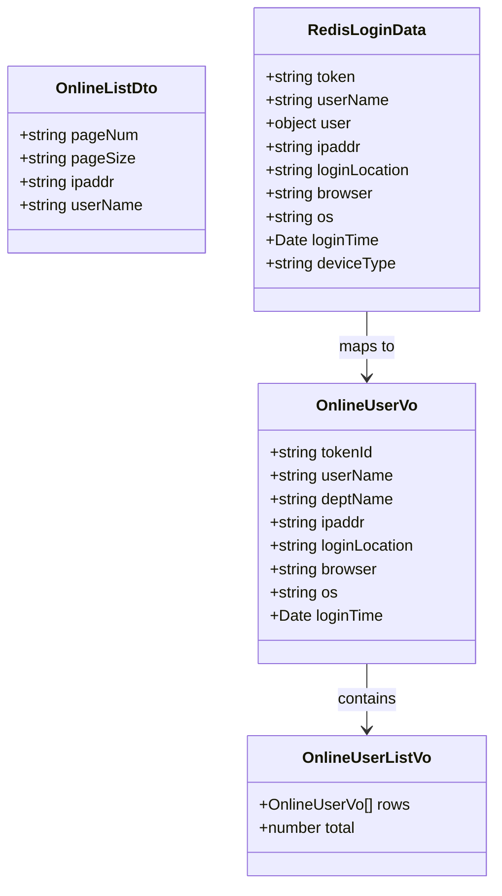
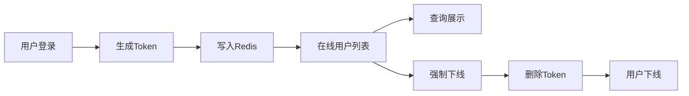
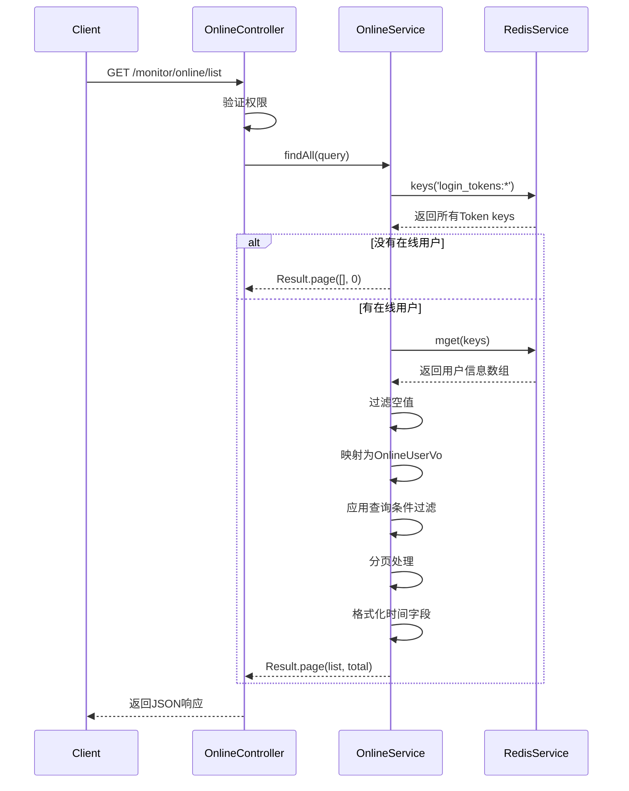
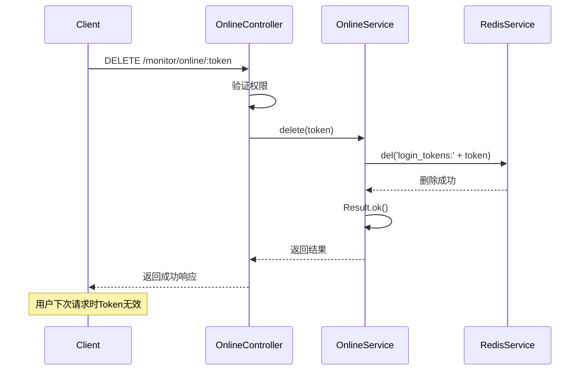
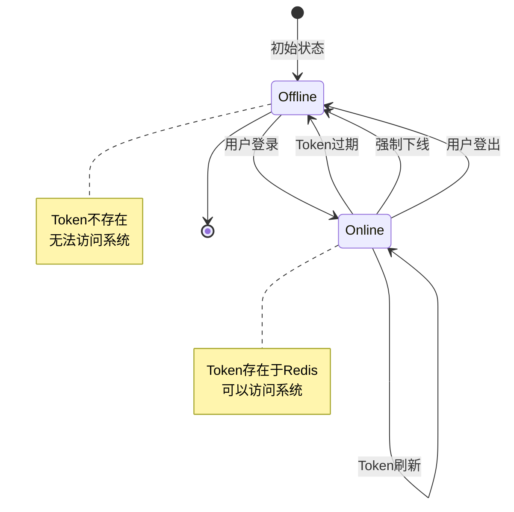
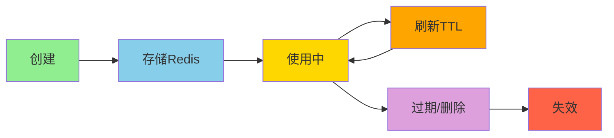
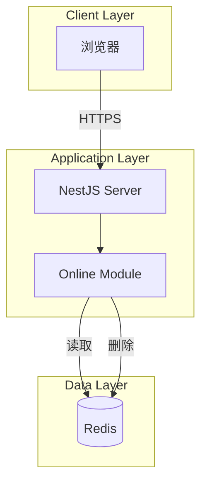

# 在线用户监控模块设计文档

## 1. 概述

### 1.1 设计目标

在线用户监控模块基于Redis实现实时在线用户查询和管理。通过读取Redis中的登录Token信息，实时展示当前在线用户列表，并提供强制下线功能。设计重点关注实时性、性能和安全性。

### 1.2 设计原则

- 实时性：数据来自Redis，实时反映在线状态
- 高性能：使用Redis批量操作，减少网络开销
- 简单性：无需数据库，直接读取Redis
- 安全性：权限控制，操作审计

### 1.3 技术栈

- NestJS：Web框架
- Redis：在线用户数据存储
- RedisService：Redis操作封装

## 2. 架构与模块

### 2.1 模块结构

```
online/
├── dto/
│   └── index.ts                # DTO定义
├── online.controller.ts        # 控制器
├── online.service.ts           # 业务逻辑
└── online.module.ts            # 模块定义
```

### 2.2 组件图

```mermaid
graph TB
    subgraph "Controller Layer"
        OC[OnlineController]
    end

    subgraph "Service Layer"
        OS[OnlineService]
    end

    subgraph "Data Layer"
        RS[RedisService]
        Redis[(Redis)]
    end

    subgraph "Decorators"
        RP[@RequirePermission]
        OL[@Operlog]
    end

    OC --> OS
    OS --> RS
    RS --> Redis
    OC -.uses.-> RP
    OC -.uses.-> OL
```

### 2.3 依赖关系

| 模块             | 依赖          | 说明         |
| ---------------- | ------------- | ------------ |
| OnlineController | OnlineService | 调用业务逻辑 |
| OnlineService    | RedisService  | Redis操作    |

## 3. 领域/数据模型

### 3.1 类图



### 3.2 数据流



## 4. 核心流程时序

### 4.1 查询在线用户列表



### 4.2 强制用户下线



## 5. 状态与流程

### 5.1 在线用户状态机



### 5.2 Token生命周期



## 6. 接口/数据约定

### 6.1 REST API接口

#### 6.1.1 查询在线用户列表

```typescript
GET /monitor/online/list

Query Parameters:
- ipaddr?: string          // IP地址（模糊匹配）
- userName?: string        // 用户名（模糊匹配）
- pageNum: string          // 页码
- pageSize: string         // 每页数量

Response:
{
  code: 200,
  msg: "success",
  data: {
    rows: OnlineUserVo[],
    total: number
  }
}

Permission: monitor:online:list
Tenant Scope: TenantScoped (需要在Service中实现过滤)
```

#### 6.1.2 强制用户下线

```typescript
DELETE /monitor/online/:token

Path Parameters:
- token: string            // 用户会话Token

Response:
{
  code: 200,
  msg: "success",
  data: null
}

Permission: monitor:online:forceLogout
Tenant Scope: TenantAgnostic (Token全局唯一)
Business Type: FORCE
```

### 6.2 Redis数据结构

#### 6.2.1 登录Token存储

```typescript
Key: login_tokens:{token}
Value: {
  token: string,           // Token值
  userName: string,        // 用户名
  user: {                  // 用户对象
    deptName: string,      // 部门名称
    ...                    // 其他用户信息
  },
  ipaddr: string,          // 登录IP
  loginLocation: string,   // 登录地点
  browser: string,         // 浏览器
  os: string,              // 操作系统
  loginTime: Date,         // 登录时间
  deviceType: string       // 设备类型
}
TTL: 604800 (7天)
```

### 6.3 VO定义

```typescript
interface OnlineUserVo {
  tokenId: string; // Token值
  userName: string; // 用户名
  deptName: string; // 部门名称
  ipaddr: string; // 登录IP
  loginLocation: string; // 登录地点
  browser: string; // 浏览器
  os: string; // 操作系统
  loginTime: Date; // 登录时间
}
```

## 7. 部署架构

### 7.1 部署图



### 7.2 运行环境

| 组件    | 版本要求 | 说明         |
| ------- | -------- | ------------ |
| Node.js | >= 18    | 运行时环境   |
| NestJS  | >= 10    | Web框架      |
| Redis   | >= 6     | 在线用户存储 |

## 8. 安全设计

### 8.1 权限控制

| 操作         | 权限标识                   | 说明         |
| ------------ | -------------------------- | ------------ |
| 查询在线用户 | monitor:online:list        | 查看在线用户 |
| 强制下线     | monitor:online:forceLogout | 强制用户下线 |

### 8.2 租户隔离

- 查询在线用户时需要过滤租户
- 从Redis数据中提取租户ID进行过滤
- 强制下线时验证Token所属租户

### 8.3 操作审计

- 强制下线操作记录到操作日志
- 记录操作人、被下线用户、操作时间

## 9. 性能优化

### 9.1 Redis批量操作

```typescript
// 使用mget批量获取，减少网络往返
const keys = await this.redisService.keys('login_tokens:*');
const data = await this.redisService.mget(keys);
```

### 9.2 内存分页

```typescript
// 在内存中进行分页，避免多次Redis查询
const list = Paginate(
  {
    list: allUsers,
    pageSize: query.pageSize,
    pageNum: query.pageNum,
  },
  query,
);
```

### 9.3 过滤优化

```typescript
// 先过滤空值，再映射对象
const allUsers = data
  .filter((item: any) => item && item.token)
  .map((item: any) => ({
    tokenId: item.token,
    userName: item.userName,
    // ...
  }));
```

### 9.4 缓存优化

- Redis本身就是缓存，无需额外缓存
- Token设置合理的TTL，自动过期清理
- 避免频繁的keys操作，考虑使用scan

## 10. 监控与日志

### 10.1 监控指标

| 指标                | 阈值     | 说明             |
| ------------------- | -------- | ---------------- |
| 在线用户查询P95延迟 | <= 500ms | 95%请求 < 500ms  |
| 强制下线P95延迟     | <= 100ms | 95%请求 < 100ms  |
| Redis连接池使用率   | <= 80%   | 避免连接耗尽     |
| 在线用户数量        | 监控     | 了解系统使用情况 |

### 10.2 日志记录

```typescript
// Service层日志
this.logger.log(`在线用户查询: 共${allUsers.length}个用户`);
this.logger.warn(`强制下线: token=${token}`);
this.logger.error(`Redis操作失败: ${error.message}`, error.stack);
```

### 10.3 告警规则

- Redis连接失败：P0告警
- 在线用户查询P95延迟 > 1s：P2告警
- 在线用户数量异常增长：P2告警
- 强制下线操作：P2告警（记录审计）

## 11. 可扩展性设计

### 11.1 支持多种存储

```typescript
// 定义在线用户存储接口
interface OnlineUserStorage {
  getAll(): Promise<OnlineUser[]>;
  delete(token: string): Promise<void>;
}

// Redis实现
class RedisOnlineUserStorage implements OnlineUserStorage {
  async getAll() {
    // Redis实现
  }
}

// 数据库实现（备选）
class DatabaseOnlineUserStorage implements OnlineUserStorage {
  async getAll() {
    // 数据库实现
  }
}
```

### 11.2 支持更多过滤条件

```typescript
// 扩展过滤条件
interface OnlineListDto {
  ipaddr?: string;
  userName?: string;
  deptName?: string; // 部门过滤
  loginTimeFrom?: Date; // 登录时间范围
  loginTimeTo?: Date;
  deviceType?: string; // 设备类型过滤
}
```

### 11.3 支持批量操作

```typescript
// 批量强制下线
async batchDelete(tokens: string[]): Promise<void> {
  const pipeline = this.redis.pipeline();
  tokens.forEach(token => {
    pipeline.del(`${CacheEnum.LOGIN_TOKEN_KEY}${token}`);
  });
  await pipeline.exec();
}
```

## 12. 测试策略

### 12.1 单元测试

```typescript
describe('OnlineService', () => {
  it('应该正确查询在线用户列表', async () => {
    const result = await service.findAll({
      pageNum: '1',
      pageSize: '10',
    });
    expect(result.data.rows).toBeInstanceOf(Array);
  });

  it('应该正确强制用户下线', async () => {
    const result = await service.delete('test-token');
    expect(result.code).toBe(200);
  });

  it('没有在线用户时应返回空列表', async () => {
    jest.spyOn(redisService, 'keys').mockResolvedValue([]);
    const result = await service.findAll({
      pageNum: '1',
      pageSize: '10',
    });
    expect(result.data.rows).toEqual([]);
    expect(result.data.total).toBe(0);
  });
});
```

### 12.2 集成测试

```typescript
describe('Online E2E', () => {
  it('GET /monitor/online/list 应该返回在线用户列表', () => {
    return request(app.getHttpServer())
      .get('/monitor/online/list?pageNum=1&pageSize=10')
      .set('Authorization', `Bearer ${token}`)
      .expect(200)
      .expect((res) => {
        expect(res.body.data.rows).toBeInstanceOf(Array);
      });
  });

  it('DELETE /monitor/online/:token 应该强制用户下线', () => {
    return request(app.getHttpServer())
      .delete('/monitor/online/test-token')
      .set('Authorization', `Bearer ${token}`)
      .expect(200);
  });
});
```

### 12.3 性能测试

- 1000个在线用户查询，响应时间 < 500ms
- 并发100用户查询，响应时间 < 500ms
- 强制下线响应时间 < 100ms

## 13. 实施计划

### 13.1 第一阶段：核心功能（3天）

- [ ] 实现在线用户查询
- [ ] 实现强制下线功能
- [ ] 单元测试覆盖率 >= 80%

### 13.2 第二阶段：完善功能（2天）

- [ ] 完善权限控制
- [ ] 优化查询性能
- [ ] 集成测试

### 13.3 第三阶段：优化与监控（2天）

- [ ] 添加监控指标
- [ ] 性能测试
- [ ] 文档完善

## 14. 缺陷分析

### 14.1 已识别缺陷

#### P0 - 缺少租户隔离

- **现状**：查询所有在线用户，未按租户过滤
- **影响**：租户管理员可以看到其他租户的在线用户
- **建议**：在Service中添加租户过滤逻辑

```typescript
// 应该实现
const allUsers = data
  .filter((item: any) => item && item.token)
  .filter((item: any) => {
    // 如果是租户管理员，只显示本租户用户
    if (isTenantAdmin) {
      return item.user?.tenantId === currentTenantId;
    }
    return true;
  })
  .map((item: any) => ({ ... }));
```

#### P1 - 使用keys命令性能问题

- **现状**：使用 `keys('login_tokens:*')` 获取所有Token
- **影响**：在线用户数量多时，keys命令会阻塞Redis
- **建议**：改用scan命令，分批获取

```typescript
// 应该使用scan
async getAllTokenKeys(): Promise<string[]> {
  const keys: string[] = [];
  let cursor = '0';
  do {
    const [newCursor, batch] = await this.redis.scan(
      cursor,
      'MATCH',
      'login_tokens:*',
      'COUNT',
      100
    );
    cursor = newCursor;
    keys.push(...batch);
  } while (cursor !== '0');
  return keys;
}
```

#### P2 - 缺少查询条件过滤

- **现状**：DTO定义了ipaddr和userName过滤条件，但Service未实现
- **影响**：过滤条件不生效
- **建议**：在Service中实现过滤逻辑

```typescript
// 应该实现
let filteredUsers = allUsers;
if (query.userName) {
  filteredUsers = filteredUsers.filter((u) => u.userName.includes(query.userName));
}
if (query.ipaddr) {
  filteredUsers = filteredUsers.filter((u) => u.ipaddr.includes(query.ipaddr));
}
```

#### P2 - 缺少错误处理

- **现状**：Redis操作失败时未处理异常
- **影响**：Redis故障时接口报错
- **建议**：添加try-catch和降级方案

```typescript
async findAll(query: any) {
  try {
    const keys = await this.redisService.keys(...);
    // ...
  } catch (error) {
    this.logger.error('查询在线用户失败', error);
    return Result.page([], 0); // 降级返回空列表
  }
}
```

#### P3 - 缺少分页参数验证

- **现状**：pageNum和pageSize为string类型，未转换和验证
- **影响**：可能导致分页错误
- **建议**：使用PageQueryDto基类或添加类型转换

### 14.2 技术债务

- Service未使用Repository模式
- 缺少Redis连接池监控
- 缺少在线用户统计功能
- 缺少批量强制下线功能

## 15. 参考资料

- [NestJS官方文档](https://docs.nestjs.com/)
- [Redis官方文档](https://redis.io/docs/)
- [Redis SCAN命令](https://redis.io/commands/scan/)
