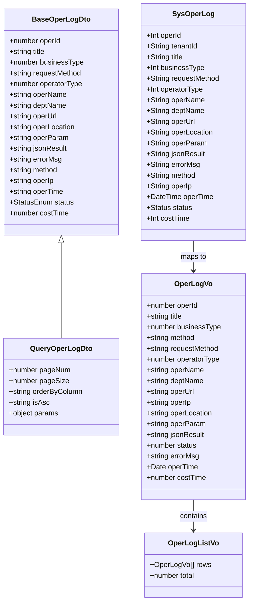
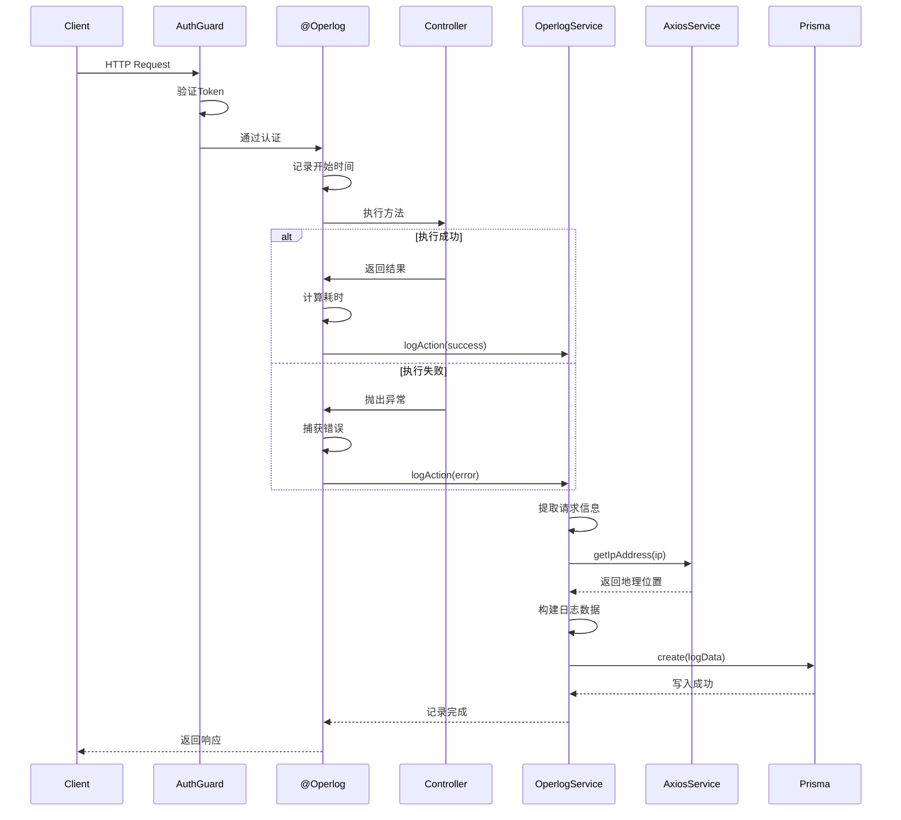
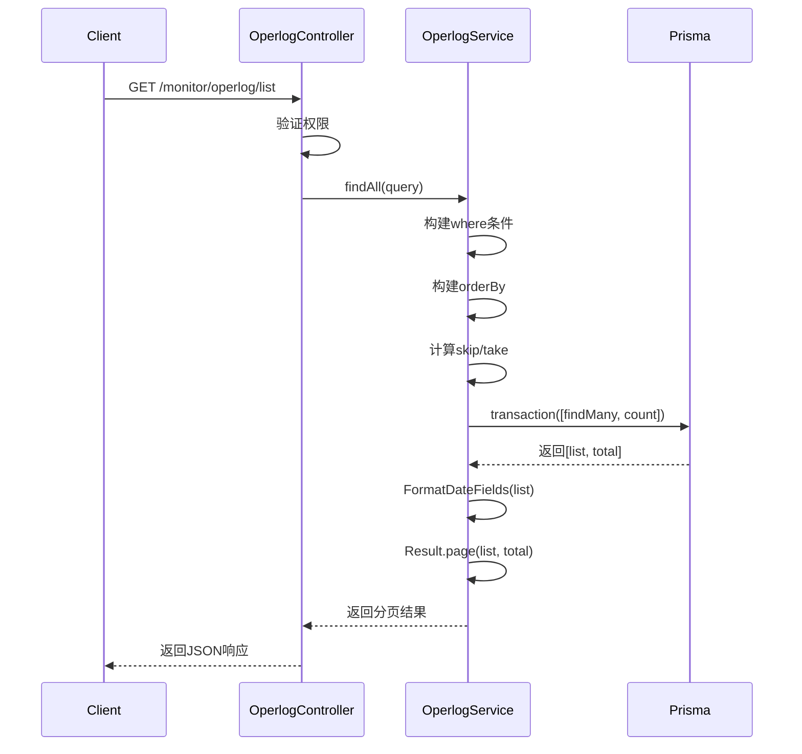
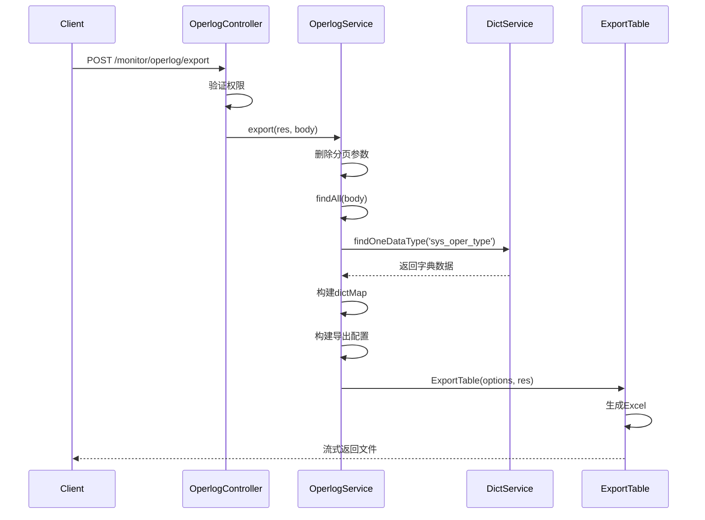
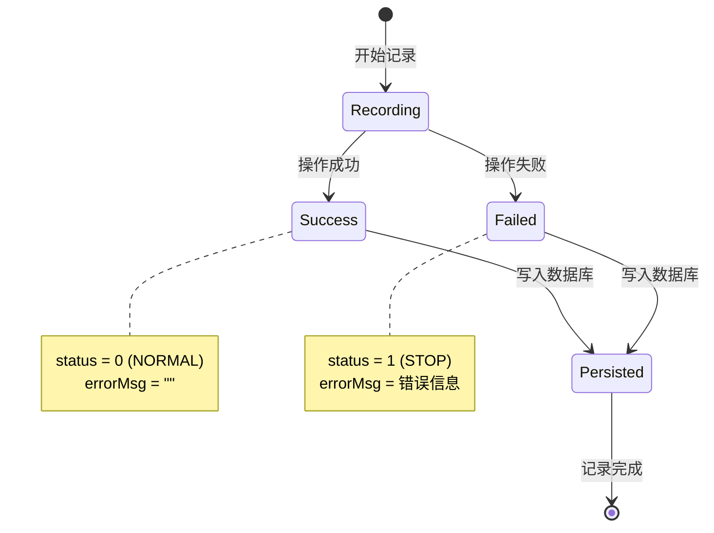
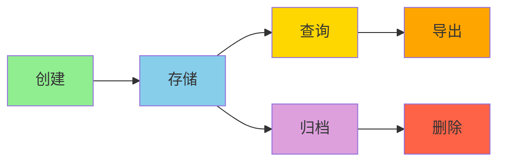
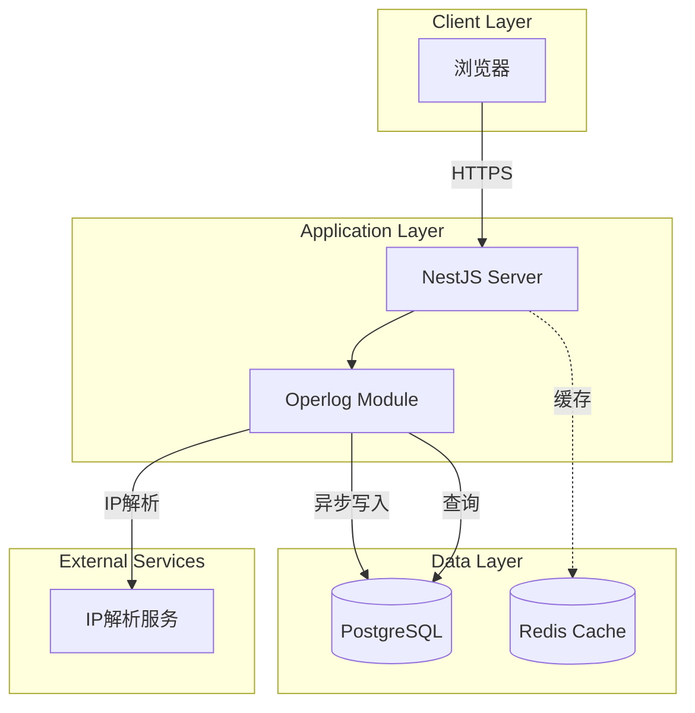

# 操作日志模块设计文档

## 1. 概述

### 1.1 设计目标

操作日志模块采用装饰器模式实现自动化日志记录，通过AOP切面拦截Controller方法执行，捕获请求和响应信息，异步写入数据库。设计重点关注性能优化、数据安全和可扩展性。

### 1.2 设计原则

- 非侵入性：通过装饰器实现，不影响业务代码
- 异步处理：日志记录不阻塞业务请求
- 性能优先：合理索引，限制深分页
- 数据安全：租户隔离，敏感信息脱敏
- 可扩展性：支持自定义日志处理器

### 1.3 技术栈

- NestJS：Web框架
- Prisma：ORM
- Request-scoped Service：获取请求上下文
- AxiosService：IP地址解析
- ExportTable：Excel导出

## 2. 架构与模块

### 2.1 模块结构

```
operlog/
├── dto/
│   └── operLog.dto.ts          # DTO定义
├── operlog.controller.ts       # 控制器
├── operlog.service.ts          # 业务逻辑
├── operlog.repository.ts       # 数据访问
└── operlog.module.ts           # 模块定义
```

### 2.2 组件图

```mermaid
graph TB
    subgraph "Controller Layer"
        OC[OperlogController]
    end

    subgraph "Service Layer"
        OS[OperlogService]
    end

    subgraph "Repository Layer"
        OR[OperlogRepository]
    end

    subgraph "External Dependencies"
        AS[AxiosService]
        DS[DictService]
        PS[PrismaService]
        ET[ExportTable]
    end

    subgraph "Decorators"
        OD[@Operlog]
        RP[@RequirePermission]
    end

    OC --> OS
    OS --> OR
    OS --> AS
    OS --> DS
    OS --> ET
    OR --> PS
    OC -.uses.-> OD
    OC -.uses.-> RP
```

### 2.3 依赖关系

| 模块              | 依赖                                         | 说明             |
| ----------------- | -------------------------------------------- | ---------------- |
| OperlogController | OperlogService                               | 调用业务逻辑     |
| OperlogService    | OperlogRepository, AxiosService, DictService | 日志记录和查询   |
| OperlogRepository | PrismaService                                | 数据库访问       |
| @Operlog装饰器    | OperlogService                               | 自动记录操作日志 |

## 3. 领域/数据模型

### 3.1 类图



### 3.2 实体关系

操作日志是独立实体，不与其他实体建立外键关系，仅通过字段值关联：

- `tenantId`：关联租户
- `operName`：关联用户名
- `deptName`：关联部门名

## 4. 核心流程时序

### 4.1 自动记录操作日志



### 4.2 查询操作日志列表



### 4.3 导出操作日志



## 5. 状态与流程

### 5.1 操作日志状态机



### 5.2 日志生命周期



## 6. 接口/数据约定

### 6.1 REST API接口

#### 6.1.1 查询操作日志列表

```typescript
GET /monitor/operlog/list

Query Parameters:
- operId?: number          // 日志主键
- title?: string           // 模块标题
- businessType?: number    // 业务类型
- requestMethod?: string   // 请求方式
- operatorType?: number    // 操作类别
- operName?: string        // 操作人员
- deptName?: string        // 部门名称
- operUrl?: string         // 请求URL
- operLocation?: string    // 操作地点
- operIp?: string          // 主机地址
- status?: StatusEnum      // 操作状态
- params?: {
    beginTime?: string     // 开始时间
    endTime?: string       // 结束时间
  }
- pageNum?: number         // 页码
- pageSize?: number        // 每页数量
- orderByColumn?: string   // 排序字段
- isAsc?: 'asc' | 'desc'   // 排序方向

Response:
{
  code: 200,
  msg: "success",
  data: {
    rows: OperLogVo[],
    total: number
  }
}

Permission: monitor:operlog:list
Tenant Scope: TenantScoped (通过BaseRepository自动过滤)
```

#### 6.1.2 查询操作日志详情

```typescript
GET /monitor/operlog/:operId

Path Parameters:
- operId: number           // 日志主键

Response:
{
  code: 200,
  msg: "success",
  data: OperLogVo
}

Permission: monitor:operlog:query
Tenant Scope: TenantScoped
```

#### 6.1.3 删除操作日志

```typescript
DELETE /monitor/operlog/:operId

Path Parameters:
- operId: number           // 日志主键

Response:
{
  code: 200,
  msg: "success",
  data: null
}

Permission: monitor:operlog:remove
Tenant Scope: TenantScoped
Business Type: DELETE
```

#### 6.1.4 清空全部日志

```typescript
DELETE /monitor/operlog/clean

Response:
{
  code: 200,
  msg: "success",
  data: null
}

Permission: monitor:operlog:remove
Tenant Scope: TenantScoped
Business Type: CLEAN
```

#### 6.1.5 导出操作日志

```typescript
POST /monitor/operlog/export

Body: QueryOperLogDto (同列表查询参数，不含分页)

Response: Excel文件流
Content-Type: application/vnd.openxmlformats-officedocument.spreadsheetml.sheet

Permission: monitor:operlog:export
Tenant Scope: TenantScoped
Business Type: EXPORT
```

### 6.2 内部接口

#### 6.2.1 记录操作日志

```typescript
async logAction(params: {
  resultData?: any;        // 返回结果
  costTime: number;        // 耗时（毫秒）
  title: string;           // 模块标题
  handlerName: string;     // 方法名称
  errorMsg?: string;       // 错误消息
  businessType?: number;   // 业务类型
}): Promise<void>
```

### 6.3 数据库Schema

```prisma
model SysOperLog {
  operId        Int      @id @default(autoincrement())
  tenantId      String   @default("000000") @db.VarChar(20)
  title         String   @db.VarChar(50)
  businessType  Int
  requestMethod String   @db.VarChar(10)
  operatorType  Int
  operName      String   @db.VarChar(50)
  deptName      String   @db.VarChar(50)
  operUrl       String   @db.VarChar(255)
  operLocation  String   @db.VarChar(255)
  operParam     String   @db.VarChar(2000)
  jsonResult    String   @db.VarChar(2000)
  errorMsg      String   @db.VarChar(2000)
  method        String   @db.VarChar(100)
  operIp        String   @db.VarChar(255)
  operTime      DateTime @default(now())
  status        Status
  costTime      Int

  @@index([tenantId, operTime])
  @@index([operName])
  @@index([status])
  @@index([operTime])
  @@index([businessType])
  @@index([tenantId, status, operTime])
  @@index([tenantId, operName, operTime])
}
```

## 7. 部署架构

### 7.1 部署图



### 7.2 运行环境

| 组件       | 版本要求 | 说明         |
| ---------- | -------- | ------------ |
| Node.js    | >= 18    | 运行时环境   |
| NestJS     | >= 10    | Web框架      |
| PostgreSQL | >= 14    | 主数据库     |
| Redis      | >= 6     | 缓存（可选） |

## 8. 安全设计

### 8.1 权限控制

| 操作     | 权限标识               | 说明         |
| -------- | ---------------------- | ------------ |
| 查询列表 | monitor:operlog:list   | 查看日志列表 |
| 查看详情 | monitor:operlog:query  | 查看日志详情 |
| 删除日志 | monitor:operlog:remove | 删除日志     |
| 清空日志 | monitor:operlog:remove | 清空所有日志 |
| 导出日志 | monitor:operlog:export | 导出Excel    |

### 8.2 租户隔离

- 使用 `BaseRepository` 自动过滤租户数据
- 日志记录时自动从 `ClsService` 获取 `tenantId`
- 查询时自动添加 `tenantId` 条件
- 禁止跨租户访问日志

### 8.3 敏感信息脱敏

```typescript
// 需要脱敏的字段
const sensitiveFields = ['password', 'token', 'secret', 'key'];

// 脱敏处理
function maskSensitiveData(data: any): any {
  // 递归遍历对象，替换敏感字段值为 "***"
}
```

### 8.4 数据完整性

- 操作日志不可修改（无update接口）
- 删除操作需要权限验证
- 清空操作需要二次确认
- 所有操作都会被记录

## 9. 性能优化

### 9.1 索引优化

```sql
-- 租户+时间复合索引（最常用）
CREATE INDEX idx_tenant_time ON sys_oper_log(tenant_id, oper_time);

-- 租户+状态+时间复合索引
CREATE INDEX idx_tenant_status_time ON sys_oper_log(tenant_id, status, oper_time);

-- 租户+操作人+时间复合索引
CREATE INDEX idx_tenant_oper_name_time ON sys_oper_log(tenant_id, oper_name, oper_time);

-- 单字段索引
CREATE INDEX idx_oper_name ON sys_oper_log(oper_name);
CREATE INDEX idx_status ON sys_oper_log(status);
CREATE INDEX idx_oper_time ON sys_oper_log(oper_time);
CREATE INDEX idx_business_type ON sys_oper_log(business_type);
```

### 9.2 查询优化

```typescript
// 1. 限制深分页
if (query.pageNum * query.pageSize > 5000) {
  throw new BusinessException('分页深度超限，请使用时间范围查询');
}

// 2. 强制时间范围
if (!query.params?.beginTime || !query.params?.endTime) {
  // 默认查询最近7天
  query.params = {
    beginTime: dayjs().subtract(7, 'day').format('YYYY-MM-DD'),
    endTime: dayjs().format('YYYY-MM-DD'),
  };
}

// 3. 使用事务批量查询
const [list, total] = await this.prisma.$transaction([
  this.prisma.sysOperLog.findMany(findManyArgs),
  this.prisma.sysOperLog.count({ where }),
]);
```

### 9.3 异步记录

```typescript
// 日志记录不阻塞业务请求
async logAction(params) {
  // 不使用 await，异步执行
  this.prisma.sysOperLog.create({ data: params })
    .catch(error => {
      // 记录失败不影响业务
      this.logger.error('操作日志记录失败', error);
    });
}
```

### 9.4 数据归档

```typescript
// Repository提供按天数删除方法
async deleteByDays(days: number): Promise<number> {
  const beforeDate = new Date();
  beforeDate.setDate(beforeDate.getDate() - days);

  const result = await this.prisma.sysOperLog.deleteMany({
    where: {
      operTime: { lt: beforeDate }
    }
  });

  return result.count;
}
```

## 10. 监控与日志

### 10.1 监控指标

| 指标               | 阈值      | 说明              |
| ------------------ | --------- | ----------------- |
| 日志记录成功率     | >= 99.9%  | 记录失败率 < 0.1% |
| 日志查询P95延迟    | <= 1000ms | 95%请求 < 1s      |
| 日志导出P95延迟    | <= 5000ms | 95%请求 < 5s      |
| 数据库连接池使用率 | <= 80%    | 避免连接耗尽      |
| 操作日志表大小     | 监控      | 及时归档          |

### 10.2 日志记录

```typescript
// Service层日志
this.logger.log(`操作日志查询: ${JSON.stringify(query)}`);
this.logger.error(`操作日志记录失败: ${error.message}`, error.stack);

// 关键操作日志
this.logger.warn(`清空操作日志: 操作人=${operName}`);
```

### 10.3 告警规则

- 日志记录失败率 > 1%：P1告警
- 日志查询P95延迟 > 2s：P2告警
- 操作日志表大小 > 500万：P2告警
- 清空日志操作：P1告警（高危操作）

## 11. 可扩展性设计

### 11.1 自定义日志处理器

```typescript
// 支持注册自定义日志处理器
interface LogHandler {
  handle(logData: OperLogData): Promise<void>;
}

class ElasticsearchLogHandler implements LogHandler {
  async handle(logData: OperLogData) {
    // 写入ES
  }
}

// 在Service中注册
this.logHandlers.push(new ElasticsearchLogHandler());
```

### 11.2 日志分级存储

```typescript
// 根据业务类型分级存储
enum LogLevel {
  HOT = 'hot', // 热数据：最近7天
  WARM = 'warm', // 温数据：7-30天
  COLD = 'cold', // 冷数据：30-90天
  ARCHIVE = 'archive', // 归档：>90天
}
```

### 11.3 插件化导出

```typescript
// 支持多种导出格式
interface ExportStrategy {
  export(data: any[], options: ExportOptions): Promise<Buffer>;
}

class ExcelExportStrategy implements ExportStrategy {}
class CsvExportStrategy implements ExportStrategy {}
class JsonExportStrategy implements ExportStrategy {}
```

## 12. 测试策略

### 12.1 单元测试

```typescript
describe('OperlogService', () => {
  it('应该正确记录操作日志', async () => {
    const result = await service.logAction({
      title: '测试模块',
      handlerName: 'TestController.test',
      costTime: 100,
    });
    expect(result).toBeDefined();
  });

  it('应该正确查询操作日志列表', async () => {
    const result = await service.findAll({
      pageNum: 1,
      pageSize: 10,
    });
    expect(result.data.rows).toBeInstanceOf(Array);
  });
});
```

### 12.2 集成测试

```typescript
describe('Operlog E2E', () => {
  it('GET /monitor/operlog/list 应该返回日志列表', () => {
    return request(app.getHttpServer())
      .get('/monitor/operlog/list')
      .set('Authorization', `Bearer ${token}`)
      .expect(200)
      .expect((res) => {
        expect(res.body.data.rows).toBeInstanceOf(Array);
      });
  });
});
```

### 12.3 性能测试

- 并发100用户查询日志，响应时间 < 1s
- 并发50用户导出日志，响应时间 < 5s
- 百万级数据查询，响应时间 < 1s

## 13. 实施计划

### 13.1 第一阶段：核心功能（1周）

- [ ] 实现 `@Operlog` 装饰器
- [ ] 实现日志自动记录
- [ ] 实现日志查询和详情
- [ ] 单元测试覆盖率 >= 80%

### 13.2 第二阶段：完善功能（1周）

- [ ] 实现日志删除和清空
- [ ] 实现日志导出
- [ ] 优化查询性能
- [ ] 集成测试

### 13.3 第三阶段：优化与监控（1周）

- [ ] 实现日志归档
- [ ] 添加监控指标
- [ ] 性能测试
- [ ] 文档完善

## 14. 缺陷分析

### 14.1 已识别缺陷

#### P1 - 缺少日志归档功能

- **现状**：仅提供手动删除和清空功能
- **影响**：长期运行后数据量过大，影响查询性能
- **建议**：实现定时任务，自动归档90天前的日志

#### P2 - 缺少敏感信息脱敏

- **现状**：`operParam` 和 `jsonResult` 直接记录原始数据
- **影响**：可能泄露密码、token等敏感信息
- **建议**：在 `logAction` 方法中添加脱敏逻辑

#### P2 - 缺少日志统计分析

- **现状**：仅提供基础查询功能
- **影响**：无法快速了解系统使用情况
- **建议**：添加统计接口，如操作类型分布、操作人TOP10等

#### P3 - 缺少导出数据量限制

- **现状**：导出时删除分页参数，可能导出全部数据
- **影响**：大数据量导出可能导致内存溢出
- **建议**：限制单次导出最多1000条，超过需分批导出

#### P3 - Repository方法未被使用

- **现状**：Repository定义了多个方法，但Service中未使用
- **影响**：代码冗余，维护成本高
- **建议**：删除未使用的方法，或在Service中使用Repository方法

### 14.2 技术债务

- Service使用 `@Inject(REQUEST)` 获取请求上下文，耦合度较高
- `logAction` 方法中IP解析是同步调用，可能影响性能
- 缺少日志记录失败的重试机制
- 缺少日志记录的降级策略

## 15. 参考资料

- [NestJS官方文档](https://docs.nestjs.com/)
- [Prisma文档](https://www.prisma.io/docs)
- [操作日志最佳实践](https://www.alibabacloud.com/blog/best-practices-for-operation-logs_595486)
