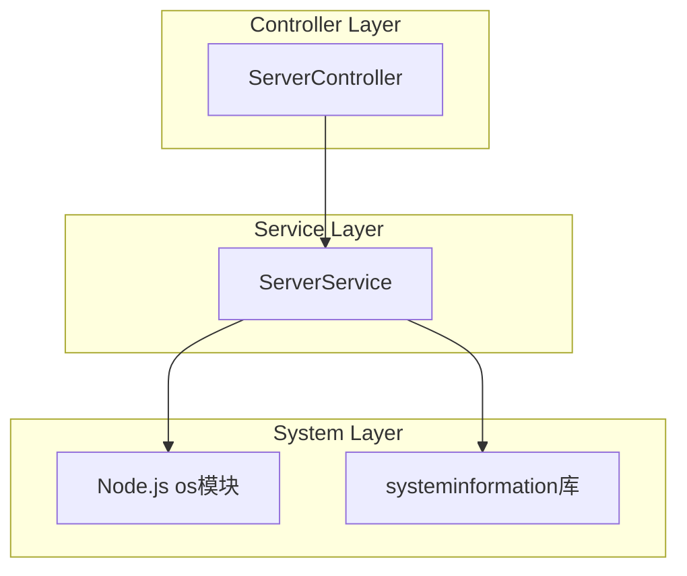
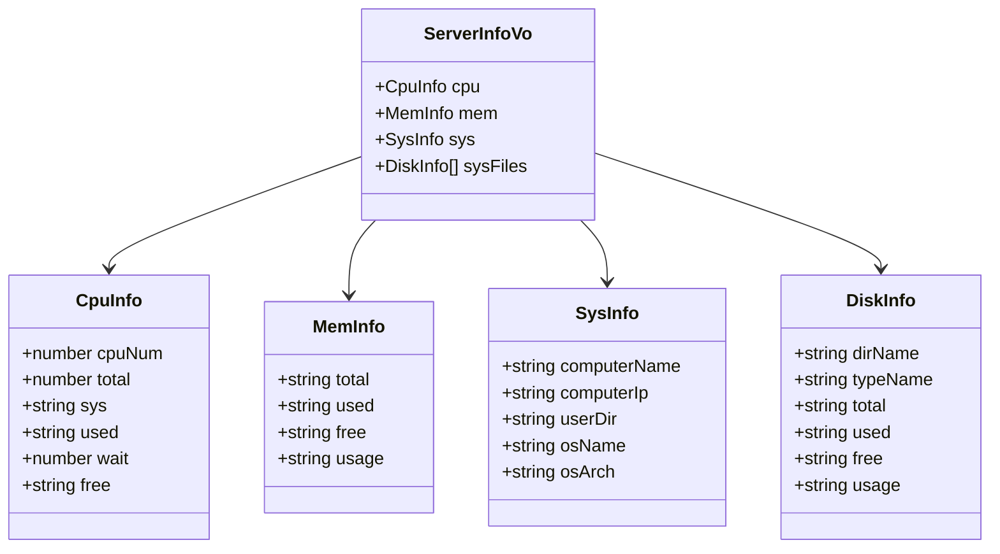
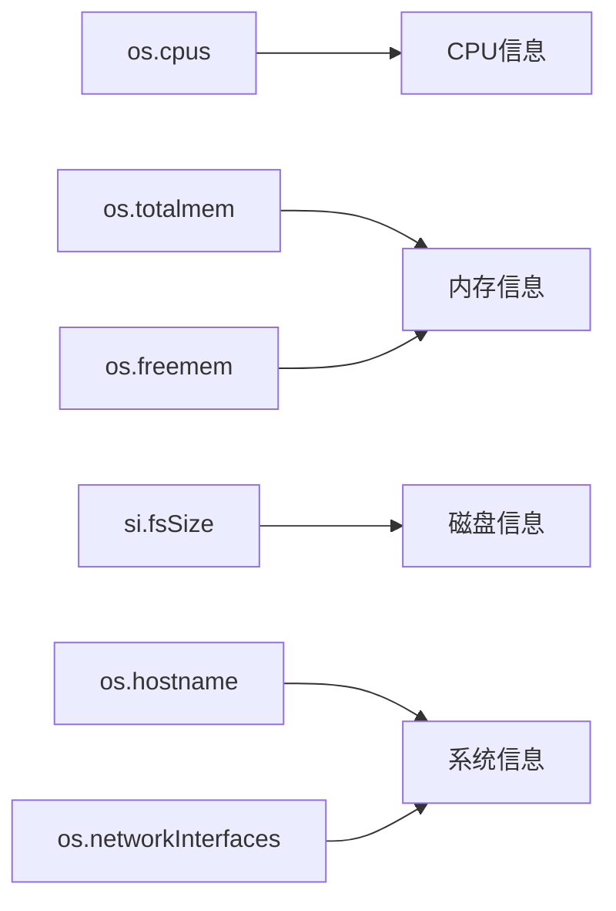
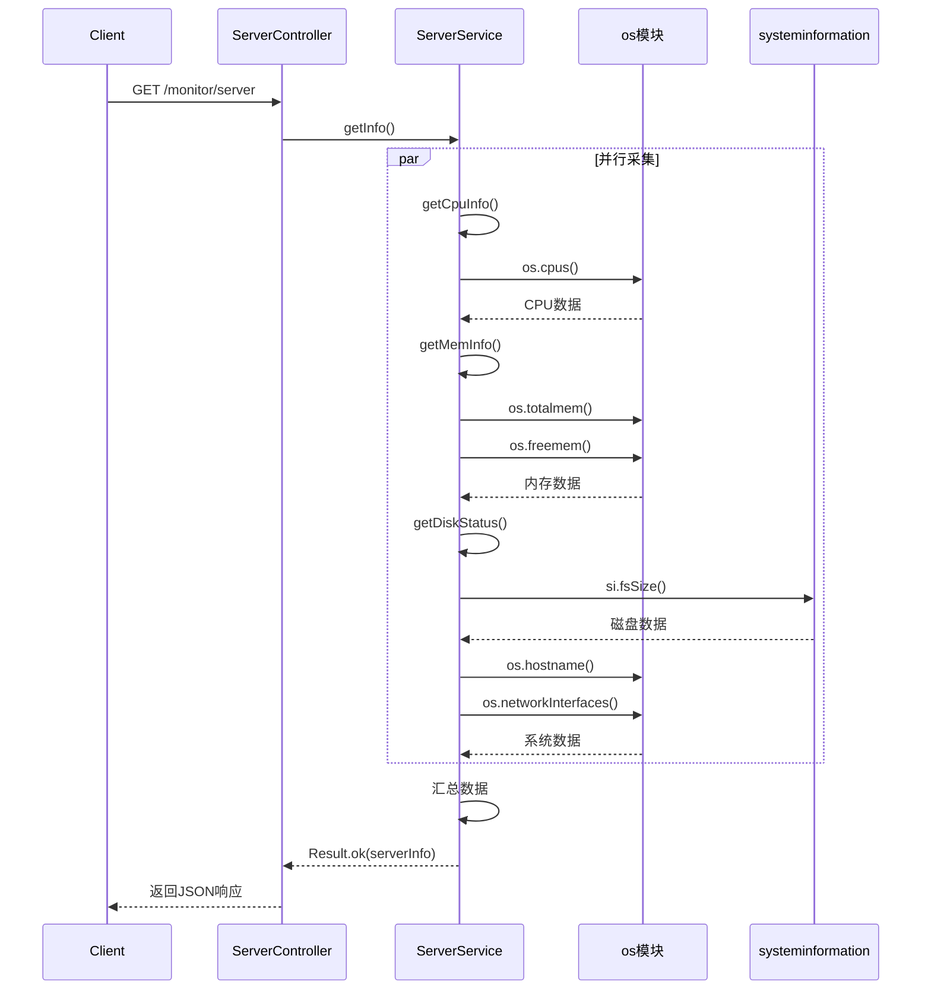
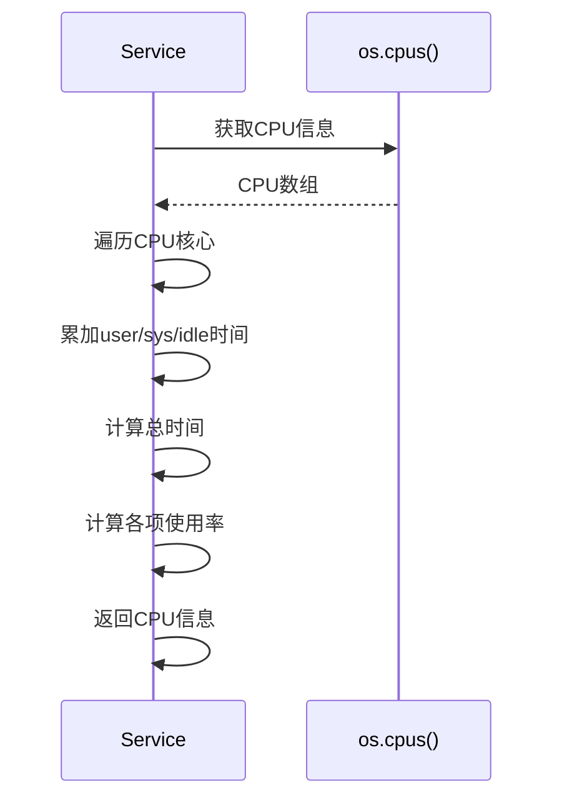
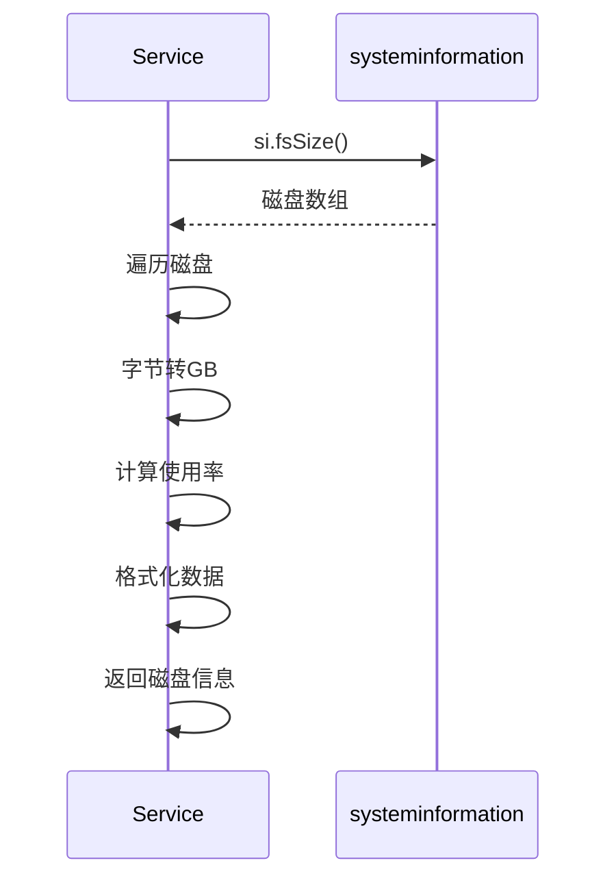
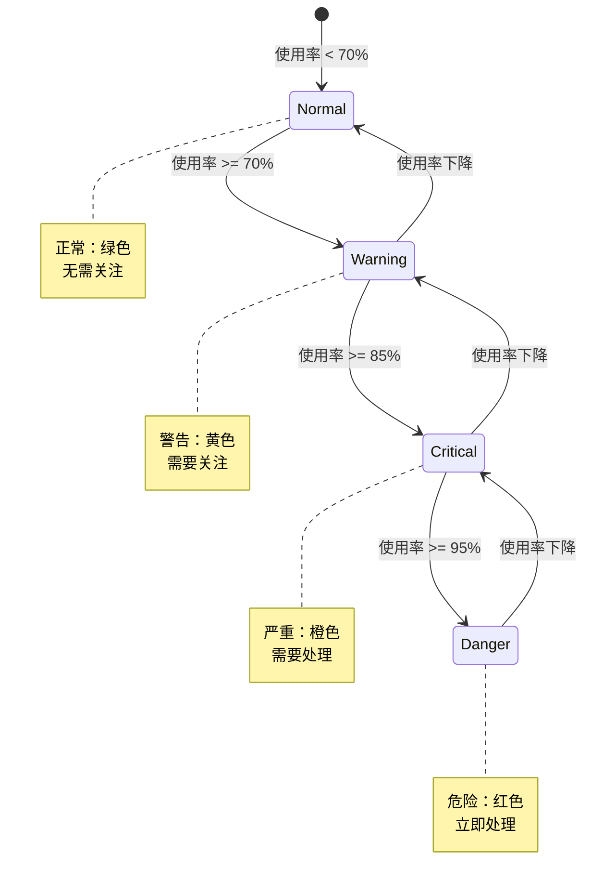
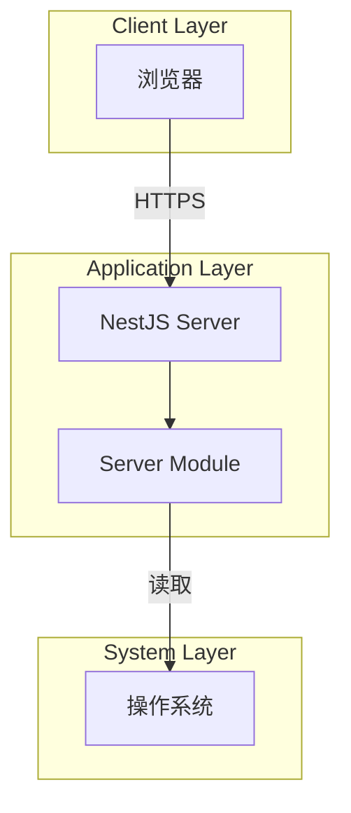

# 服务器监控模块设计文档

## 1. 概述

### 1.1 设计目标

服务器监控模块基于Node.js原生os模块和systeminformation库实现跨平台的服务器资源监控。通过实时采集CPU、内存、磁盘、系统信息，为管理员提供服务器运行状态的可视化展示。

### 1.2 设计原则

- 实时性：每次请求实时采集数据
- 跨平台：支持Windows、Linux、macOS
- 轻量级：采集逻辑简单高效
- 准确性：使用标准计算方法

### 1.3 技术栈

- NestJS：Web框架
- Node.js os模块：系统信息获取
- systeminformation：磁盘信息获取

## 2. 架构与模块

### 2.1 模块结构

```
server/
├── server.controller.ts        # 控制器
├── server.service.ts           # 业务逻辑
└── server.module.ts            # 模块定义
```

### 2.2 组件图



### 2.3 依赖关系

| 模块             | 依赖                  | 说明         |
| ---------------- | --------------------- | ------------ |
| ServerController | ServerService         | 调用业务逻辑 |
| ServerService    | os, systeminformation | 系统信息采集 |

## 3. 领域/数据模型

### 3.1 类图



### 3.2 数据采集流程



## 4. 核心流程时序

### 4.1 获取服务器监控信息



### 4.2 CPU信息采集



### 4.3 磁盘信息采集



## 5. 状态与流程

### 5.1 资源使用状态



### 5.2 监控数据流


## 6. 接口/数据约定

### 6.1 REST API接口

#### 6.1.1 获取服务器监控信息

```typescript
GET /monitor/server

Response:
{
  code: 200,
  msg: "success",
  data: {
    cpu: {
      cpuNum: number,        // CPU核心数
      total: number,         // 总时间
      sys: string,           // 系统使用率（%）
      used: string,          // 用户使用率（%）
      wait: number,          // 等待率（%）
      free: string           // 空闲率（%）
    },
    mem: {
      total: string,         // 总内存（GB）
      used: string,          // 已用内存（GB）
      free: string,          // 空闲内存（GB）
      usage: string          // 使用率（%）
    },
    sys: {
      computerName: string,  // 计算机名称
      computerIp: string,    // 计算机IP
      userDir: string,       // 用户目录
      osName: string,        // 操作系统
      osArch: string         // 系统架构
    },
    sysFiles: Array<{
      dirName: string,       // 挂载点
      typeName: string,      // 文件系统类型
      total: string,         // 总空间（GB）
      used: string,          // 已用空间（GB）
      free: string,          // 可用空间（GB）
      usage: string          // 使用率（%）
    }>
  }
}

Permission: 无（建议添加）
```

### 6.2 核心方法

#### 6.2.1 获取CPU信息

```typescript
getCpuInfo(): CpuInfo {
  const cpus = os.cpus();
  const cpuInfo = cpus.reduce((info, cpu) => {
    info.cpuNum += 1;
    info.user += cpu.times.user;
    info.sys += cpu.times.sys;
    info.idle += cpu.times.idle;
    info.total += cpu.times.user + cpu.times.sys + cpu.times.idle;
    return info;
  }, { user: 0, sys: 0, idle: 0, total: 0, cpuNum: 0 });

  return {
    cpuNum: cpuInfo.cpuNum,
    total: cpuInfo.total,
    sys: ((cpuInfo.sys / cpuInfo.total) * 100).toFixed(2),
    used: ((cpuInfo.user / cpuInfo.total) * 100).toFixed(2),
    wait: 0.0,
    free: ((cpuInfo.idle / cpuInfo.total) * 100).toFixed(2),
  };
}
```

#### 6.2.2 获取内存信息

```typescript
getMemInfo(): MemInfo {
  const totalMemory = os.totalmem();
  const freeMemory = os.freemem();
  const usedMemory = totalMemory - freeMemory;
  const usage = (((totalMemory - freeMemory) / totalMemory) * 100).toFixed(2);

  return {
    total: this.bytesToGB(totalMemory),
    used: this.bytesToGB(usedMemory),
    free: this.bytesToGB(freeMemory),
    usage: usage,
  };
}
```

#### 6.2.3 获取磁盘信息

```typescript
async getDiskStatus(): Promise<DiskInfo[]> {
  try {
    const disks = await si.fsSize();
    return disks.map((disk) => ({
      dirName: disk.mount,
      typeName: disk.type,
      total: this.bytesToGB(disk.size) + 'GB',
      used: this.bytesToGB(disk.used) + 'GB',
      free: this.bytesToGB(disk.available) + 'GB',
      usage: (disk.use ?? (disk.size > 0 ? (disk.used / disk.size) * 100 : 0)).toFixed(2),
    }));
  } catch (err) {
    return [];
  }
}
```

## 7. 部署架构

### 7.1 部署图



### 7.2 运行环境

| 组件    | 版本要求 | 说明       |
| ------- | -------- | ---------- |
| Node.js | >= 18    | 运行时环境 |
| NestJS  | >= 10    | Web框架    |

## 8. 安全设计

### 8.1 权限控制

| 操作           | 权限标识            | 说明         |
| -------------- | ------------------- | ------------ |
| 查看服务器信息 | monitor:server:list | 查看监控信息 |

### 8.2 数据安全

- 不暴露敏感系统信息
- 仅显示必要的监控数据
- 限制访问频率

## 9. 性能优化

### 9.1 并行采集

```typescript
async getInfo() {
  // 并行采集各项数据
  const [cpu, mem, sysFiles] = await Promise.all([
    Promise.resolve(this.getCpuInfo()),
    Promise.resolve(this.getMemInfo()),
    this.getDiskStatus(),
  ]);

  const sys = this.getSysInfo();

  return Result.ok({ cpu, mem, sys, sysFiles });
}
```

### 9.2 错误处理

```typescript
async getDiskStatus() {
  try {
    const disks = await si.fsSize();
    return disks.map(/* ... */);
  } catch (err) {
    this.logger.error('获取磁盘信息失败', err);
    return []; // 降级返回空数组
  }
}
```

### 9.3 数据缓存（可选）

```typescript
// 缓存5秒，减少频繁采集
private cache: { data: any; timestamp: number } = null;

async getInfo() {
  const now = Date.now();
  if (this.cache && now - this.cache.timestamp < 5000) {
    return Result.ok(this.cache.data);
  }

  const data = await this.collectData();
  this.cache = { data, timestamp: now };
  return Result.ok(data);
}
```

## 10. 监控与日志

### 10.1 监控指标

| 指标            | 阈值      | 说明           |
| --------------- | --------- | -------------- |
| 查询响应时间P95 | <= 1000ms | 95%请求 < 1s   |
| CPU采集耗时     | <= 100ms  | 采集不影响性能 |
| 内存采集耗时    | <= 50ms   | 采集不影响性能 |
| 磁盘采集耗时    | <= 500ms  | 采集不影响性能 |

### 10.2 日志记录

```typescript
// Service层日志
this.logger.log('获取服务器监控信息');
this.logger.error('获取磁盘信息失败', error);
```

### 10.3 告警规则

- CPU使用率 > 90%：P2告警
- 内存使用率 > 90%：P2告警
- 磁盘使用率 > 90%：P2告警
- 采集失败：P3告警

## 11. 可扩展性设计

### 11.1 支持更多监控指标

```typescript
// 扩展网络监控
async getNetworkInfo() {
  const networkStats = await si.networkStats();
  return networkStats.map(net => ({
    interface: net.iface,
    rx: this.bytesToMB(net.rx_bytes),
    tx: this.bytesToMB(net.tx_bytes),
  }));
}

// 扩展进程监控
async getProcessInfo() {
  const processes = await si.processes();
  return processes.list.slice(0, 10); // Top 10进程
}
```

### 11.2 支持历史数据

```typescript
// 定时采集并存储
@Cron('*/5 * * * *') // 每5分钟
async collectHistory() {
  const data = await this.getInfo();
  await this.historyRepository.save({
    timestamp: new Date(),
    ...data.data,
  });
}
```

### 11.3 支持告警配置

```typescript
interface AlertConfig {
  metric: 'cpu' | 'mem' | 'disk';
  threshold: number;
  action: 'email' | 'sms' | 'webhook';
}

async checkAlerts(data: ServerInfo) {
  const alerts = await this.getAlertConfigs();
  for (const alert of alerts) {
    if (this.shouldAlert(data, alert)) {
      await this.sendAlert(alert);
    }
  }
}
```

## 12. 测试策略

### 12.1 单元测试

```typescript
describe('ServerService', () => {
  it('应该正确获取CPU信息', () => {
    const cpuInfo = service.getCpuInfo();
    expect(cpuInfo).toHaveProperty('cpuNum');
    expect(cpuInfo).toHaveProperty('total');
    expect(cpuInfo.cpuNum).toBeGreaterThan(0);
  });

  it('应该正确获取内存信息', () => {
    const memInfo = service.getMemInfo();
    expect(memInfo).toHaveProperty('total');
    expect(memInfo).toHaveProperty('usage');
    expect(parseFloat(memInfo.usage)).toBeGreaterThanOrEqual(0);
    expect(parseFloat(memInfo.usage)).toBeLessThanOrEqual(100);
  });

  it('应该正确获取磁盘信息', async () => {
    const diskInfo = await service.getDiskStatus();
    expect(diskInfo).toBeInstanceOf(Array);
  });
});
```

### 12.2 集成测试

```typescript
describe('Server E2E', () => {
  it('GET /monitor/server 应该返回服务器信息', () => {
    return request(app.getHttpServer())
      .get('/monitor/server')
      .expect(200)
      .expect((res) => {
        expect(res.body.data).toHaveProperty('cpu');
        expect(res.body.data).toHaveProperty('mem');
        expect(res.body.data).toHaveProperty('sys');
        expect(res.body.data).toHaveProperty('sysFiles');
      });
  });
});
```

### 12.3 跨平台测试

- Windows 10/11测试
- Ubuntu 20.04/22.04测试
- macOS测试

## 13. 实施计划

### 13.1 第一阶段：核心功能（2天）

- [ ] 实现CPU监控
- [ ] 实现内存监控
- [ ] 实现磁盘监控
- [ ] 实现系统信息获取
- [ ] 单元测试覆盖率 >= 80%

### 13.2 第二阶段：优化（1天）

- [ ] 优化数据采集性能
- [ ] 添加错误处理
- [ ] 跨平台测试

### 13.3 第三阶段：扩展（2天）

- [ ] 添加权限控制
- [ ] 添加监控指标
- [ ] 文档完善

## 14. 缺陷分析

### 14.1 已识别缺陷

#### P0 - 缺少权限控制

- **现状**：接口没有权限控制
- **影响**：任何人都可以查看服务器信息
- **建议**：添加 `@RequirePermission` 装饰器

```typescript
@RequirePermission('monitor:server:list')
@Get()
getInfo() { }
```

#### P1 - CPU使用率计算不准确

- **现状**：使用累加时间计算，可能不准确
- **影响**：显示的CPU使用率与实际有偏差
- **建议**：使用systeminformation库的currentLoad方法

```typescript
async getCpuInfo() {
  const load = await si.currentLoad();
  return {
    cpuNum: os.cpus().length,
    total: 100,
    sys: load.currentLoadSystem.toFixed(2),
    used: load.currentLoadUser.toFixed(2),
    wait: load.currentLoadIdle.toFixed(2),
    free: (100 - load.currentLoad).toFixed(2),
  };
}
```

#### P2 - 缺少数据缓存

- **现状**：每次请求都实时采集
- **影响**：高频查询可能影响性能
- **建议**：添加短时缓存（5秒）

#### P2 - 磁盘采集失败时返回空数组

- **现状**：异常时返回空数组，前端无法区分是否有磁盘
- **影响**：用户体验不好
- **建议**：返回错误信息或使用降级方案

#### P3 - wait字段固定为0

- **现状**：wait字段硬编码为0.0
- **影响**：无法显示IO等待情况
- **建议**：使用systeminformation库获取真实数据

#### P3 - 缺少JVM信息

- **现状**：ServerInfoVo定义了jvm字段，但未实现
- **影响**：前端可能期望JVM信息
- **建议**：删除VO中的jvm字段或实现JVM监控

### 14.2 技术债务

- 缺少历史数据存储
- 缺少告警功能
- 缺少网络监控
- 缺少进程监控

## 15. 参考资料

- [NestJS官方文档](https://docs.nestjs.com/)
- [Node.js os模块](https://nodejs.org/api/os.html)
- [systeminformation文档](https://systeminformation.io/)
