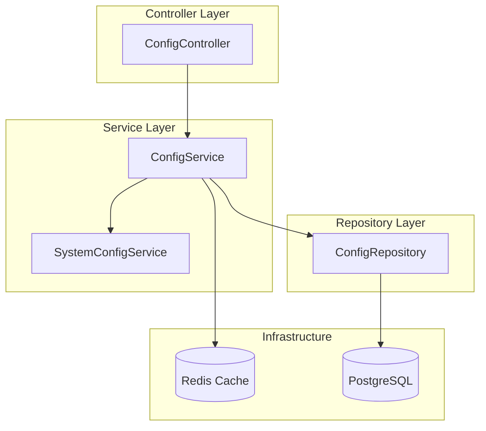
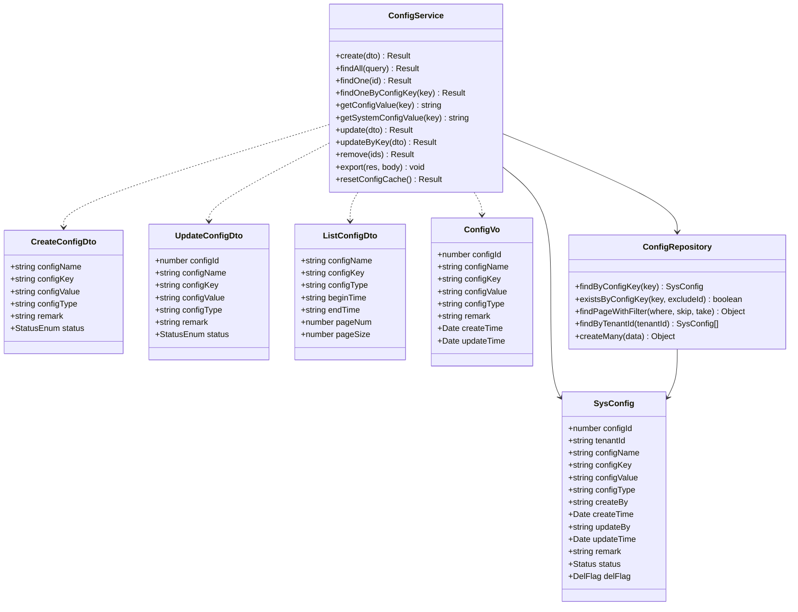
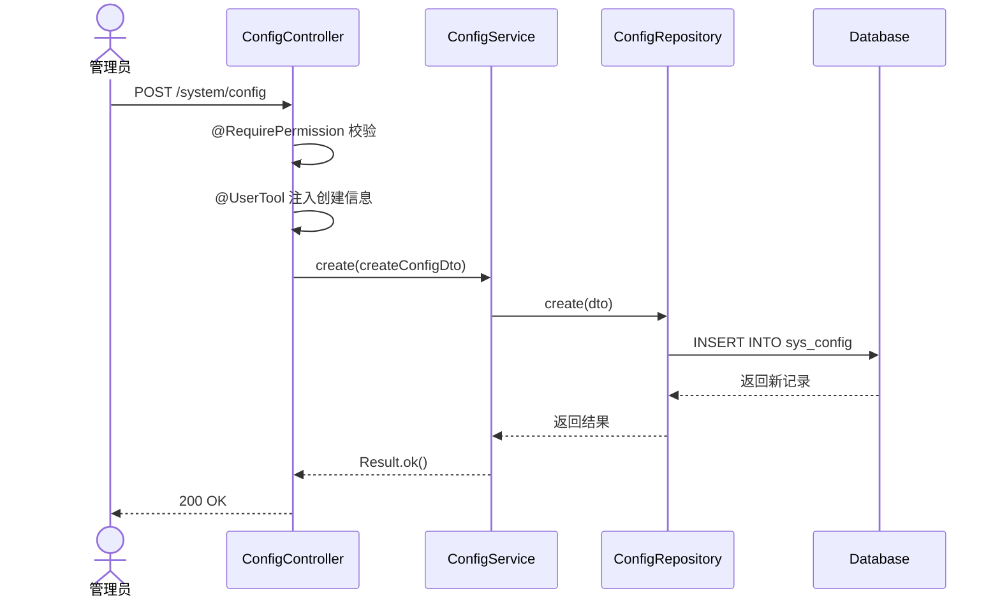
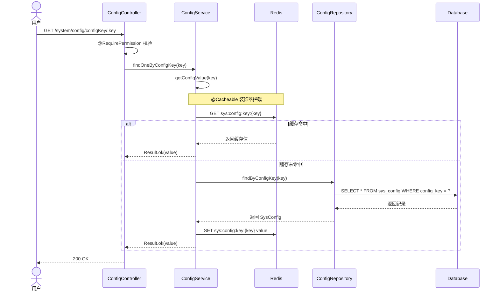
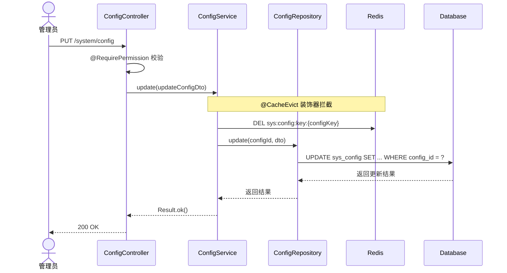
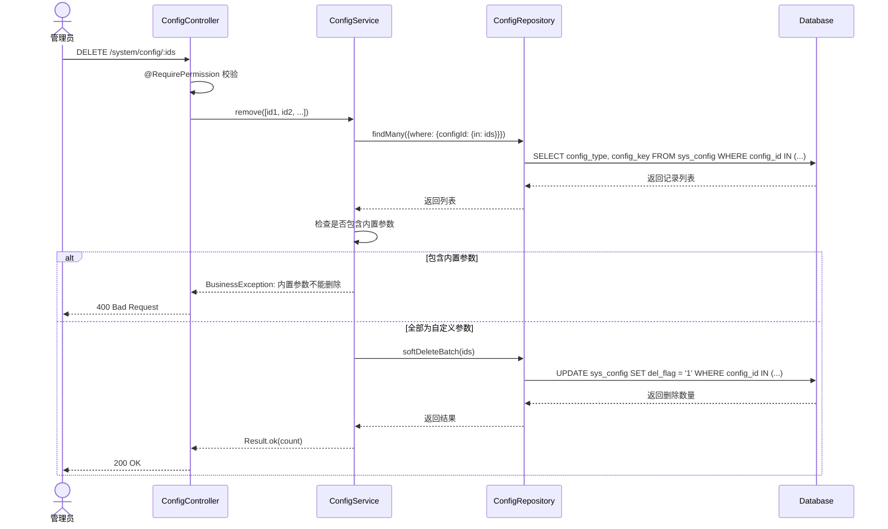
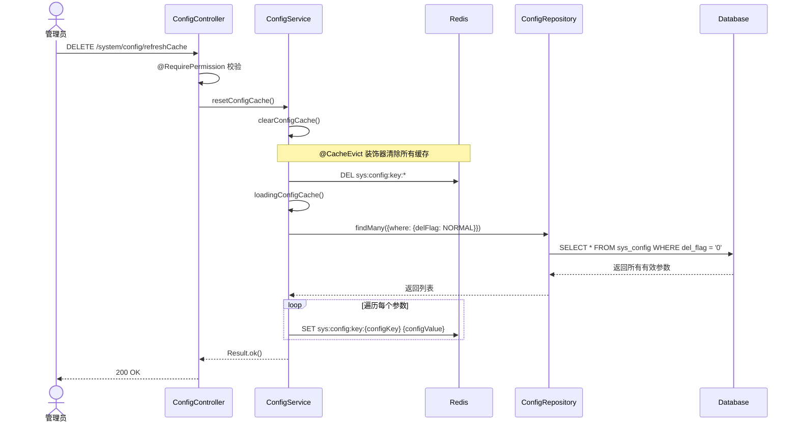
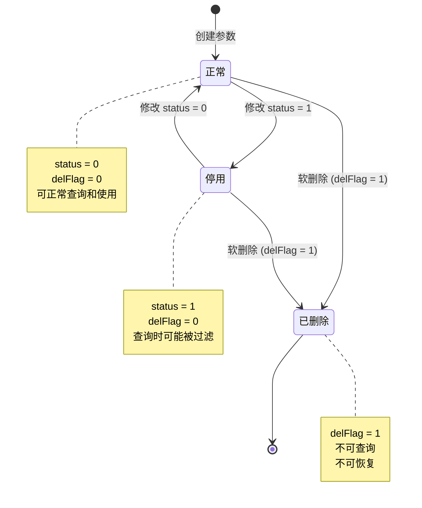
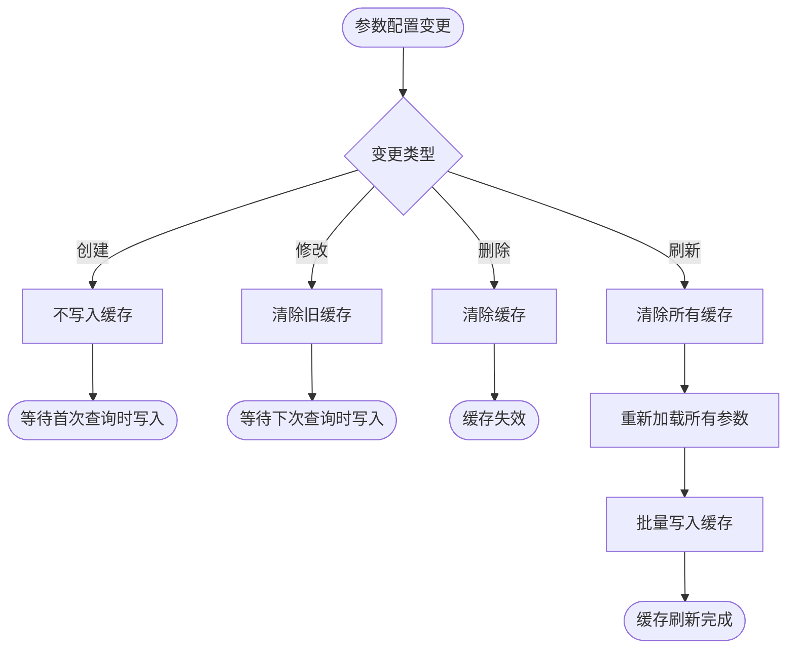

# 参数配置管理模块 — 设计文档

> 版本：1.0  
> 日期：2026-02-22  
> 状态：草案  
> 关联需求：[config-requirements.md](../../../requirements/admin/system/config-requirements.md)

---

## 1. 概述

### 1.1 设计目标

设计租户级参数配置管理模块，实现：

- 参数配置的 CRUD 操作，支持租户隔离
- 基于 Redis 的缓存机制，提升查询性能
- 区分系统内置参数与自定义参数，保护内置参数
- 支持参数配置的导出与缓存管理

### 1.2 设计原则

- 租户隔离：通过 SoftDeleteRepository 自动过滤 tenantId
- 缓存优先：高频查询优先使用 Redis 缓存
- 保护内置参数：禁止删除 configType = 'Y' 的参数
- 统一响应：使用 Result.ok() / Result.fail()
- 异常处理：使用 BusinessException 和 getErrorMessage()

### 1.3 约束

- 参数值最长 500 字符，超长需拆分或使用文件存储
- 缓存 TTL 由系统配置决定，默认永久有效
- 修改参数后需手动或自动清除缓存

---

## 2. 架构与模块

### 2.1 模块组件图



### 2.2 目录结构

```
src/module/admin/system/config/
├── dto/
│   ├── create-config.dto.ts       # 创建参数 DTO
│   ├── update-config.dto.ts       # 更新参数 DTO
│   ├── list-config.dto.ts         # 查询参数 DTO
│   └── index.ts
├── vo/
│   └── config.vo.ts               # 参数配置 VO
├── config.controller.ts           # 控制器
├── config.service.ts              # 核心服务
├── config.repository.ts           # 数据访问层
└── config.module.ts               # 模块配置
```

### 2.3 租户隔离说明

**租户范围**：TenantScoped

- 所有接口按当前租户隔离数据
- 租户 ID 来自请求头 `tenant-id` 或登录态
- Repository 继承 SoftDeleteRepository，自动过滤 tenantId
- 特殊场景：getSystemConfigValue() 通过原生 SQL 查询超级租户配置

---

## 3. 领域模型

### 3.1 类图



### 3.2 实体说明

**SysConfig**：参数配置实体

- configId：主键，自增
- tenantId：租户 ID，默认 '000000'（超级租户）
- configKey：参数键名，租户内唯一
- configValue：参数键值，最长 500 字符
- configType：系统内置标识（Y=内置，N=自定义）
- status：状态（0=正常，1=停用）
- delFlag：删除标识（0=正常，1=删除）

---

## 4. 核心流程时序

### 4.1 创建参数配置



### 4.2 按键查询参数（缓存优先）



### 4.3 修改参数配置



### 4.4 删除参数配置



### 4.5 刷新参数缓存



---

## 5. 状态与流程

### 5.1 参数配置状态机



### 5.2 缓存更新流程



---

## 6. 接口与数据约定

### 6.1 REST API 接口

| 方法   | 路径                          | 说明         | 权限                 |
| ------ | ----------------------------- | ------------ | -------------------- |
| POST   | /system/config                | 创建参数配置 | system:config:add    |
| GET    | /system/config/list           | 查询参数列表 | system:config:list   |
| GET    | /system/config/:id            | 查看参数详情 | system:config:query  |
| GET    | /system/config/configKey/:key | 按键查询参数 | system:config:query  |
| PUT    | /system/config                | 修改参数配置 | system:config:edit   |
| PUT    | /system/config/updateByKey    | 按键修改参数 | system:config:edit   |
| DELETE | /system/config/:ids           | 删除参数配置 | system:config:remove |
| POST   | /system/config/export         | 导出参数配置 | system:config:export |
| DELETE | /system/config/refreshCache   | 刷新参数缓存 | system:config:remove |

### 6.2 数据库表结构

**sys_config 表**：

```sql
CREATE TABLE sys_config (
  config_id INT PRIMARY KEY AUTO_INCREMENT,
  tenant_id VARCHAR(20) DEFAULT '000000',
  config_name VARCHAR(100) NOT NULL,
  config_key VARCHAR(100) NOT NULL,
  config_value VARCHAR(500) NOT NULL,
  config_type CHAR(1) NOT NULL,
  create_by VARCHAR(64) DEFAULT '',
  create_time TIMESTAMP DEFAULT CURRENT_TIMESTAMP,
  update_by VARCHAR(64) DEFAULT '',
  update_time TIMESTAMP DEFAULT CURRENT_TIMESTAMP,
  remark VARCHAR(500),
  status CHAR(1) DEFAULT '0',
  del_flag CHAR(1) DEFAULT '0',

  UNIQUE KEY unique_tenant_config_key (tenant_id, config_key),
  INDEX idx_tenant_status (tenant_id, status),
  INDEX idx_tenant_type (tenant_id, config_type),
  INDEX idx_tenant_del_status (tenant_id, del_flag, status),
  INDEX idx_config_key (config_key),
  INDEX idx_create_time (create_time),
  INDEX idx_del_flag (del_flag)
);
```

### 6.3 缓存键设计

| 缓存键格式                   | 说明       | TTL  | 示例                                        |
| ---------------------------- | ---------- | ---- | ------------------------------------------- |
| `sys:config:key:{configKey}` | 参数值缓存 | 永久 | `sys:config:key:sys.account.captchaEnabled` |

**缓存策略**：

- 读取：优先从缓存读取，未命中时查询数据库并写入缓存
- 更新：修改参数后清除对应缓存
- 删除：删除参数后清除对应缓存
- 刷新：清除所有缓存并重新加载

---

## 7. 安全设计

### 7.1 权限控制

| 操作     | 权限代码             | 说明             |
| -------- | -------------------- | ---------------- |
| 创建参数 | system:config:add    | 创建新参数配置   |
| 查询列表 | system:config:list   | 查看参数列表     |
| 查看详情 | system:config:query  | 查看单个参数详情 |
| 修改参数 | system:config:edit   | 修改参数配置     |
| 删除参数 | system:config:remove | 删除参数配置     |
| 导出参数 | system:config:export | 导出参数为 Excel |
| 刷新缓存 | system:config:remove | 刷新参数缓存     |

### 7.2 租户隔离

- 所有查询自动过滤 tenantId
- 创建时自动注入当前租户 ID
- 修改和删除时验证记录属于当前租户
- 跨租户访问返回 404

### 7.3 内置参数保护

- 删除时检查 configType，禁止删除内置参数
- 建议：修改时禁止修改内置参数的 configKey
- 建议：禁止修改内置参数的 configType

### 7.4 敏感数据保护

- 敏感参数值（如密钥、密码）在日志中脱敏
- 导出时考虑脱敏敏感参数
- 建议：增加参数敏感级别字段，控制访问权限

---

## 8. 性能优化

### 8.1 缓存策略

**缓存场景**：

- 高频查询的参数配置（如系统开关、限流阈值）
- 使用 @Cacheable 装饰器自动管理缓存
- 使用 @CacheEvict 装饰器自动清除缓存

**缓存失效**：

- 修改参数：清除对应缓存
- 删除参数：清除对应缓存
- 手动刷新：清除所有缓存并重新加载

**缓存降级**：

- Redis 故障时自动降级到数据库查询
- 不影响业务正常运行

### 8.2 查询优化

**索引使用**：

- 主键查询：使用 config_id 主键索引
- 按键查询：使用 (tenant_id, config_key) 唯一索引
- 列表查询：使用 (tenant_id, del_flag, status) 复合索引

**分页优化**：

- 使用 skip/take 分页
- 限制单页最大记录数
- 深分页时建议使用游标分页

### 8.3 批量操作

**当前缺失**：

- 批量创建参数
- 批量修改参数

**建议实现**：

```typescript
async batchCreate(dtos: CreateConfigDto[]): Promise<Result> {
  // 使用事务保证原子性
  // 批量检查唯一性
  // 批量插入
}

async batchUpdate(updates: Array<{configKey: string, configValue: string}>): Promise<Result> {
  // 使用事务保证原子性
  // 批量更新
  // 批量清除缓存
}
```

---

## 9. 实现计划

### 9.1 第一阶段：核心功能（已完成）

- [x] 参数配置 CRUD 接口
- [x] 基于 Redis 的缓存机制
- [x] 内置参数保护（删除时）
- [x] 参数配置导出
- [x] 缓存刷新功能

### 9.2 第二阶段：缺陷修复（建议）

- [ ] 创建时校验参数键名唯一性
- [ ] 修改时校验参数键名唯一性
- [ ] 禁止修改内置参数的键名
- [ ] 修改键名时清除旧缓存
- [ ] 批量创建和批量修改接口

### 9.3 第三阶段：功能增强（可选）

- [ ] 参数分组管理
- [ ] 参数版本控制
- [ ] 参数变更审计
- [ ] 参数敏感级别控制
- [ ] 参数值类型校验（数字、布尔、JSON 等）

---

## 10. 测试策略

### 10.1 单元测试

**ConfigService 测试**：

- create：正常创建、键名重复
- findAll：分页查询、条件筛选、租户隔离
- findOne：正常查询、记录不存在、跨租户访问
- getConfigValue：缓存命中、缓存未命中、记录不存在
- update：正常修改、记录不存在、跨租户修改
- updateByKey：正常修改、记录不存在
- remove：正常删除、删除内置参数、批量删除
- resetConfigCache：缓存清除和重新加载

**ConfigRepository 测试**：

- findByConfigKey：正常查询、记录不存在、租户隔离
- existsByConfigKey：存在、不存在、排除指定 ID
- findPageWithFilter：分页、筛选、排序

### 10.2 集成测试

**端到端流程**：

1. 创建参数配置
2. 查询参数列表，验证新参数存在
3. 按键查询参数，验证缓存写入
4. 修改参数配置，验证缓存清除
5. 再次按键查询，验证新值
6. 删除参数配置，验证软删除
7. 查询列表，验证参数不存在

**租户隔离测试**：

1. 租户 A 创建参数
2. 租户 B 查询，验证查询不到
3. 租户 B 创建同键名参数，验证成功
4. 租户 A 修改参数，验证不影响租户 B

**内置参数保护测试**：

1. 创建内置参数（configType = 'Y'）
2. 尝试删除，验证失败
3. 尝试修改键名，验证失败（需实现）

### 10.3 性能测试

**缓存性能**：

- 首次查询：P99 < 100ms
- 缓存命中：P99 < 10ms
- 并发查询：1000 QPS 无压力

**列表查询性能**：

- 单页 20 条：P99 < 500ms
- 单页 100 条：P99 < 1000ms

---

## 11. 监控与运维

### 11.1 关键指标

| 指标              | 阈值    | 说明              |
| ----------------- | ------- | ----------------- |
| 按键查询 P99 延迟 | < 50ms  | 缓存命中时 < 10ms |
| 列表查询 P99 延迟 | < 500ms | 单页 20 条        |
| 缓存命中率        | > 95%   | 低于阈值需排查    |
| 参数配置总数      | < 10000 | 超过需考虑分表    |
| 单租户参数配置数  | < 1000  | 超过需优化        |

### 11.2 日志记录

**操作日志**：

- 创建参数：记录 configKey、configValue、操作人
- 修改参数：记录 configKey、旧值、新值、操作人
- 删除参数：记录 configKey、操作人
- 刷新缓存：记录操作人、刷新时间

**错误日志**：

- 缓存异常：记录异常信息、降级到数据库查询
- 数据库异常：记录 SQL、参数、异常信息
- 权限异常：记录用户、操作、权限代码

### 11.3 告警规则

| 告警项         | 条件           | 级别 | 处理建议           |
| -------------- | -------------- | ---- | ------------------ |
| 缓存命中率低   | < 80%          | P2   | 检查缓存配置和 TTL |
| 查询延迟高     | P99 > 1000ms   | P1   | 检查索引和慢查询   |
| 参数配置数过多 | 单租户 > 1000  | P2   | 建议清理无用参数   |
| 缓存异常       | Redis 连接失败 | P0   | 检查 Redis 服务    |

---

## 12. 可扩展性设计

### 12.1 参数分组

**需求**：将参数按功能模块分组，便于管理。

**设计**：

- 增加 configGroup 字段（如 'system'、'payment'、'notification'）
- 列表查询支持按分组筛选
- 缓存键包含分组信息

### 12.2 参数版本控制

**需求**：记录参数配置的历史版本，支持回滚。

**设计**：

- 新增 sys_config_history 表
- 修改参数时自动记录历史版本
- 提供版本对比和回滚接口

### 12.3 参数值类型校验

**需求**：支持参数值类型定义和校验（数字、布尔、JSON 等）。

**设计**：

- 增加 configValueType 字段（'string'、'number'、'boolean'、'json'）
- 创建和修改时根据类型校验参数值
- 查询时自动转换类型

### 12.4 参数敏感级别

**需求**：区分敏感参数和普通参数，控制访问权限。

**设计**：

- 增加 sensitiveLevel 字段（0=普通，1=敏感，2=机密）
- 敏感参数需要额外权限才能查看
- 日志和导出时自动脱敏

---

## 13. 风险评估

### 13.1 技术风险

| 风险               | 概率 | 影响 | 缓解措施             |
| ------------------ | ---- | ---- | -------------------- |
| Redis 缓存故障     | 低   | 中   | 自动降级到数据库查询 |
| 参数键名冲突       | 中   | 高   | 增加唯一性校验       |
| 内置参数被误删     | 低   | 高   | 已实现删除保护       |
| 缓存与数据库不一致 | 中   | 中   | 修改时自动清除缓存   |
| 参数值超长         | 低   | 低   | 限制最长 500 字符    |

### 13.2 业务风险

| 风险           | 概率 | 影响 | 缓解措施                |
| -------------- | ---- | ---- | ----------------------- |
| 参数配置错误   | 中   | 高   | 增加参数值校验和审计    |
| 参数配置过多   | 中   | 中   | 定期清理无用参数        |
| 跨租户数据泄露 | 低   | 高   | Repository 自动过滤租户 |
| 敏感参数泄露   | 低   | 高   | 增加敏感级别控制        |

---

## 14. 附录

### 14.1 相关文档

- [需求文档](../../../requirements/admin/system/config-requirements.md)
- [后端开发规范](../../../../../../.kiro/steering/backend-nestjs.md)
- [文档规范](../../../../../../.kiro/steering/documentation.md)

### 14.2 参考资料

- [NestJS 官方文档](https://docs.nestjs.com/)
- [Prisma 官方文档](https://www.prisma.io/docs)
- [Redis 缓存最佳实践](https://redis.io/docs/manual/patterns/)

### 14.3 术语表

| 术语       | 说明                                        |
| ---------- | ------------------------------------------- |
| 参数配置   | 系统运行时可动态调整的键值对配置            |
| 租户级配置 | 按租户隔离的配置，存储在 sys_config 表      |
| 系统级配置 | 全局共享的配置，存储在 sys_system_config 表 |
| 内置参数   | configType = 'Y'，系统预置的参数，不可删除  |
| 自定义参数 | configType = 'N'，用户自行创建的参数        |
| 缓存命中   | 从 Redis 缓存中成功读取数据                 |
| 缓存穿透   | 缓存和数据库都不存在数据                    |
| 软删除     | 设置 delFlag = '1'，不物理删除记录          |

### 14.4 变更记录

| 版本 | 日期       | 变更内容 | 作者 |
| ---- | ---------- | -------- | ---- |
| 1.0  | 2026-02-22 | 初始版本 | Kiro |
