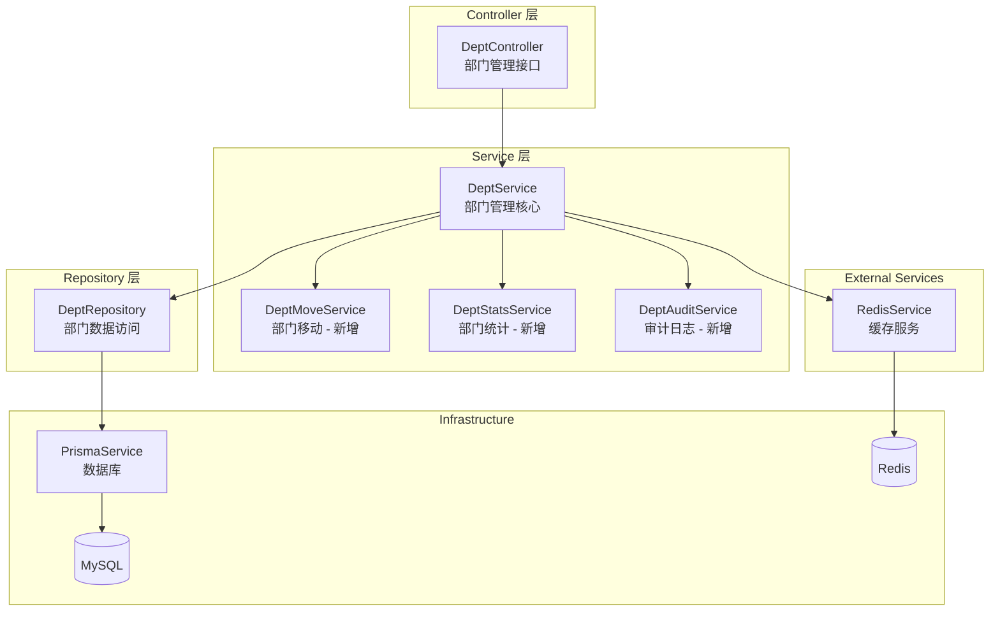
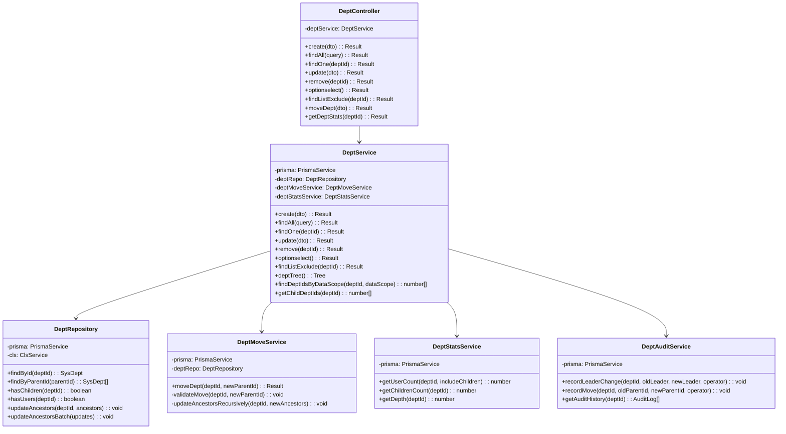
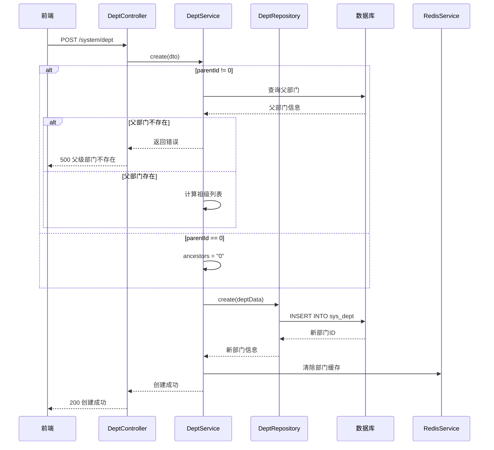
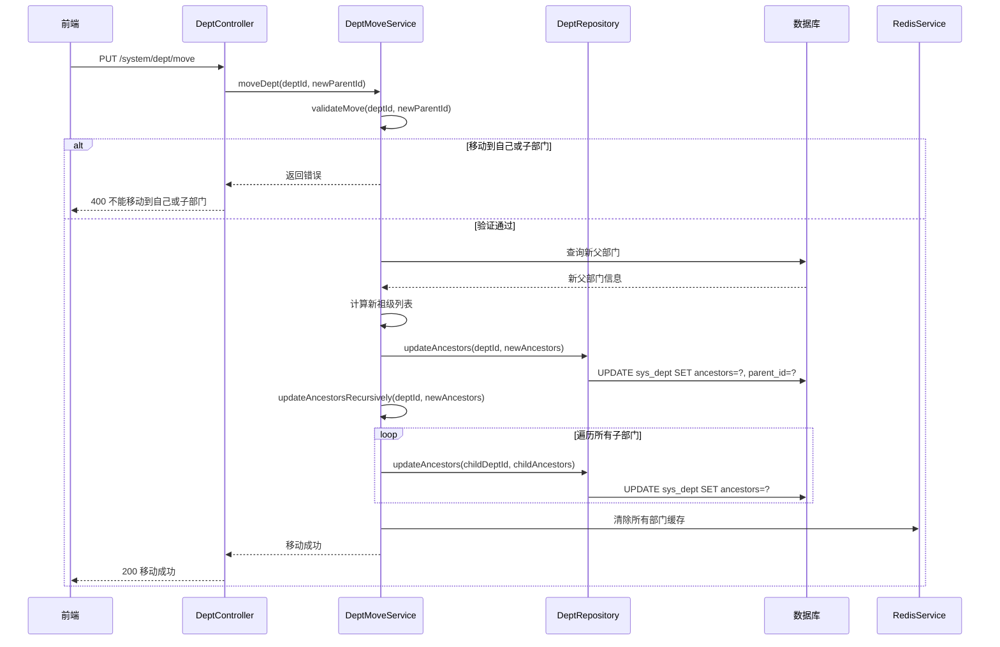

# 部门管理模块 (System Dept) — 设计文档

> 版本：1.0  
> 日期：2026-02-22  
> 状态：草案  
> 关联需求：[dept-requirements.md](../../../requirements/admin/system/dept-requirements.md)

---

## 1. 概述

### 1.1 设计目标

部门管理模块是后台管理系统组织架构管理的核心模块，本设计文档旨在：

1. 梳理现有部门管理功能的技术实现细节
2. 设计部门移动功能，提升组织架构调整效率
3. 设计祖级列表更新机制，确保数据一致性
4. 设计部门人员统计功能，提供数据分析支持
5. 为后续扩展（部门标签、部门类型）预留接口

### 1.2 设计约束

- 基于现有的 NestJS + Prisma + Redis 技术栈
- 兼容现有的组织架构模型
- 不引入新的中间件或存储系统
- 保持与前端（Soybean Admin）的 API 契约一致
- 支持多租户隔离

### 1.3 设计原则

- 单一职责：每个 Service 只负责一个领域的功能
- 开闭原则：对扩展开放，对修改关闭
- 依赖倒置：依赖抽象而非具体实现
- 性能优先：优化数据库查询，使用缓存减少重复查询
- 数据一致性：使用事务保证祖级列表的一致性

---

## 2. 架构与模块

### 2.1 模块划分

> 图 1：部门管理模块组件图



### 2.2 目录结构

```
src/module/admin/system/dept/
├── dto/
│   ├── create-dept.dto.ts          # 创建部门 DTO
│   ├── update-dept.dto.ts          # 更新部门 DTO
│   ├── list-dept.dto.ts            # 查询部门列表 DTO
│   ├── move-dept.dto.ts            # 移动部门 DTO (新增)
│   └── index.ts
├── vo/
│   ├── dept.vo.ts                  # 部门响应 VO
│   ├── dept-stats.vo.ts            # 部门统计 VO (新增)
│   └── index.ts
├── services/
│   ├── dept-move.service.ts        # 部门移动服务 (新增)
│   ├── dept-stats.service.ts       # 部门统计服务 (新增)
│   ├── dept-audit.service.ts       # 审计日志服务 (新增)
│   └── index.ts
├── dept.controller.ts              # 部门控制器
├── dept.service.ts                 # 部门服务
├── dept.repository.ts              # 部门仓储
├── dept.module.ts                  # 模块配置
└── README.md                       # 模块文档
```

### 2.3 依赖关系

```
DeptModule
├── imports
│   ├── CommonModule (RedisService)
│   └── PrismaModule (PrismaService)
├── controllers
│   └── DeptController
├── providers
│   ├── DeptService
│   ├── DeptMoveService (新增)
│   ├── DeptStatsService (新增)
│   ├── DeptAuditService (新增)
│   └── DeptRepository
└── exports
    ├── DeptService
    └── DeptRepository
```

---

## 3. 领域/数据模型

### 3.1 核心实体类图

> 图 2：部门管理模块类图



### 3.2 数据库表结构

#### 3.2.1 现有表

```sql
-- 部门表
CREATE TABLE sys_dept (
  dept_id       BIGINT PRIMARY KEY AUTO_INCREMENT,
  tenant_id     VARCHAR(20) NOT NULL DEFAULT '000000',
  parent_id     BIGINT DEFAULT 0 COMMENT '父部门ID',
  ancestors     VARCHAR(500) DEFAULT '' COMMENT '祖级列表',
  dept_name     VARCHAR(30) NOT NULL COMMENT '部门名称',
  order_num     INT DEFAULT 0 COMMENT '显示顺序',
  leader        VARCHAR(20) COMMENT '负责人',
  phone         VARCHAR(11) COMMENT '联系电话',
  email         VARCHAR(50) COMMENT '邮箱',
  status        CHAR(1) DEFAULT '0' COMMENT '状态（0正常 1停用）',
  del_flag      CHAR(1) DEFAULT '0' COMMENT '删除标志（0正常 2删除）',
  create_by     VARCHAR(64) COMMENT '创建者',
  create_time   DATETIME DEFAULT CURRENT_TIMESTAMP,
  update_by     VARCHAR(64) COMMENT '更新者',
  update_time   DATETIME DEFAULT CURRENT_TIMESTAMP ON UPDATE CURRENT_TIMESTAMP,
  UNIQUE KEY uk_tenant_dept_name (tenant_id, dept_name),
  INDEX idx_tenant_status (tenant_id, status, del_flag),
  INDEX idx_parent_id (parent_id),
  INDEX idx_ancestors (ancestors(100))
);
```

#### 3.2.2 新增表（建议）

```sql
-- 部门负责人变更历史表 (新增)
CREATE TABLE sys_dept_leader_history (
  id            BIGINT PRIMARY KEY AUTO_INCREMENT,
  dept_id       BIGINT NOT NULL COMMENT '部门ID',
  old_leader    VARCHAR(20) COMMENT '旧负责人',
  new_leader    VARCHAR(20) NOT NULL COMMENT '新负责人',
  change_by     VARCHAR(64) COMMENT '操作人',
  change_time   DATETIME DEFAULT CURRENT_TIMESTAMP,
  INDEX idx_dept_id (dept_id),
  INDEX idx_change_time (change_time)
);

-- 部门移动历史表 (新增)
CREATE TABLE sys_dept_move_history (
  id            BIGINT PRIMARY KEY AUTO_INCREMENT,
  dept_id       BIGINT NOT NULL COMMENT '部门ID',
  old_parent_id BIGINT COMMENT '旧父部门ID',
  new_parent_id BIGINT NOT NULL COMMENT '新父部门ID',
  old_ancestors VARCHAR(500) COMMENT '旧祖级列表',
  new_ancestors VARCHAR(500) NOT NULL COMMENT '新祖级列表',
  change_by     VARCHAR(64) COMMENT '操作人',
  change_time   DATETIME DEFAULT CURRENT_TIMESTAMP,
  INDEX idx_dept_id (dept_id),
  INDEX idx_change_time (change_time)
);
```

### 3.3 Redis 数据结构

#### 3.3.1 部门信息缓存

```typescript
// Key: sys_dept:findOne:{deptId}
// TTL: 24 小时
// Value: 部门基本信息
```

#### 3.3.2 部门树缓存

```typescript
// Key: sys_dept:deptTree
// TTL: 24 小时
// Value: 部门树形结构
```

#### 3.3.3 部门ID列表缓存

```typescript
// Key: sys_dept:findDeptIdsByDataScope:{deptId}-{dataScope}
// TTL: 24 小时
// Value: number[] (部门ID列表)
```

---

## 4. 核心流程时序

### 4.1 创建部门流程时序图

> 图 3：创建部门时序图



### 4.2 移动部门流程时序图

> 图 4：移动部门时序图



---

## 5. 状态与流程

### 5.1 部门状态机

已在需求文档图 5 中定义，此处补充技术实现要点：

**状态转换规则**：

- `NORMAL → STOP`：管理员调用接口，设置 `status=1`
- `STOP → NORMAL`：管理员调用接口，设置 `status=0`
- `NORMAL/STOP → DELETED`：管理员调用 `remove` 接口，设置 `del_flag=2`

**技术实现**：

- 状态存储：`sys_dept.status` 字段（`0`=正常，`1`=停用）
- 删除标记：`sys_dept.del_flag` 字段（`0`=正常，`2`=删除）
- 删除部门时，清除部门缓存
- 删除前检查是否存在子部门和关联用户

### 5.2 祖级列表更新流程

**祖级列表（ancestors）** 是从根部门到当前部门的所有父部门ID列表，用逗号分隔。

**更新时机**：

1. 创建部门：计算并设置祖级列表
2. 修改父部门：重新计算祖级列表，递归更新所有子部门
3. 移动部门：重新计算祖级列表，递归更新所有子部门

**递归更新算法**：

```typescript
async updateAncestorsRecursively(deptId: number, newAncestors: string): Promise<void> {
  // 1. 查询所有直接子部门
  const children = await this.deptRepo.findByParentId(deptId);

  // 2. 遍历每个子部门
  for (const child of children) {
    // 3. 计算子部门的新祖级列表
    const childAncestors = `${newAncestors},${deptId}`;

    // 4. 更新子部门的祖级列表
    await this.deptRepo.updateAncestors(child.deptId, childAncestors);

    // 5. 递归更新子部门的子部门
    await this.updateAncestorsRecursively(child.deptId, childAncestors);
  }
}
```

---

## 6. 接口/数据约定

### 6.1 DeptService 接口

```typescript
interface DeptService {
  /**
   * 创建部门
   * @param dto 创建部门 DTO
   * @returns 创建结果
   */
  create(dto: CreateDeptDto): Promise<Result>;

  /**
   * 查询部门列表
   * @param query 查询条件
   * @returns 部门列表
   */
  findAll(query: ListDeptDto): Promise<Result>;

  /**
   * 查询部门详情
   * @param deptId 部门ID
   * @returns 部门详情
   */
  findOne(deptId: number): Promise<Result>;

  /**
   * 更新部门信息
   * @param dto 更新部门 DTO
   * @returns 更新结果
   */
  update(dto: UpdateDeptDto): Promise<Result>;

  /**
   * 删除部门
   * @param deptId 部门ID
   * @returns 删除结果
   */
  remove(deptId: number): Promise<Result>;

  /**
   * 获取部门选择框列表
   * @returns 部门列表
   */
  optionselect(): Promise<Result>;

  /**
   * 排除节点查询
   * @param deptId 需要排除的部门ID
   * @returns 部门列表
   */
  findListExclude(deptId: number): Promise<Result>;

  /**
   * 获取部门树
   * @returns 部门树形结构
   */
  deptTree(): Promise<Tree>;

  /**
   * 根据数据权限查询部门ID列表
   * @param deptId 部门ID
   * @param dataScope 数据权限范围
   * @returns 部门ID列表
   */
  findDeptIdsByDataScope(deptId: number, dataScope: DataScopeEnum): Promise<number[]>;

  /**
   * 获取子部门ID列表
   * @param deptId 部门ID
   * @returns 部门ID列表（包含指定部门）
   */
  getChildDeptIds(deptId: number): Promise<number[]>;
}
```

### 6.2 DeptMoveService 接口（新增）

```typescript
interface DeptMoveService {
  /**
   * 移动部门
   * @param deptId 部门ID
   * @param newParentId 新父部门ID
   * @returns 移动结果
   */
  moveDept(deptId: number, newParentId: number): Promise<Result>;
}
```

### 6.3 DeptStatsService 接口（新增）

```typescript
interface DeptStatsService {
  /**
   * 获取部门用户数量
   * @param deptId 部门ID
   * @param includeChildren 是否包含子部门
   * @returns 用户数量
   */
  getUserCount(deptId: number, includeChildren: boolean): Promise<number>;

  /**
   * 获取子部门数量
   * @param deptId 部门ID
   * @returns 子部门数量
   */
  getChildrenCount(deptId: number): Promise<number>;

  /**
   * 获取部门层级深度
   * @param deptId 部门ID
   * @returns 层级深度
   */
  getDepth(deptId: number): Promise<number>;
}
```

---

## 7. 安全设计

### 7.1 权限控制

| 机制         | 实现方式                     |
| ------------ | ---------------------------- |
| 部门管理权限 | 需要 `system:dept:*` 权限    |
| 删除前检查   | 检查是否存在子部门和关联用户 |
| 移动前检查   | 不能移动到自己或子部门       |

### 7.2 数据安全

| 机制           | 实现方式                          |
| -------------- | --------------------------------- |
| 部门名称唯一性 | 数据库唯一约束                    |
| 软删除         | 设置 `del_flag=2`，数据不物理删除 |
| 多租户隔离     | 所有查询自动添加 `tenant_id` 条件 |

### 7.3 数据一致性

| 机制           | 实现方式                     |
| -------------- | ---------------------------- |
| 祖级列表一致性 | 使用事务保证祖级列表的一致性 |
| 缓存一致性     | 修改部门后清除所有部门缓存   |

---

## 8. 性能优化

### 8.1 缓存策略

| 缓存项     | Key 格式                                               | TTL     | 更新时机                     |
| ---------- | ------------------------------------------------------ | ------- | ---------------------------- |
| 部门详情   | `sys_dept:findOne:{deptId}`                            | 24 小时 | 修改部门、删除部门           |
| 部门树     | `sys_dept:deptTree`                                    | 24 小时 | 创建部门、修改部门、删除部门 |
| 部门ID列表 | `sys_dept:findDeptIdsByDataScope:{deptId}-{dataScope}` | 24 小时 | 修改部门、删除部门           |

### 8.2 数据库优化

```sql
-- 建议新增索引
CREATE INDEX idx_order_num ON sys_dept (order_num);
CREATE INDEX idx_status ON sys_dept (status);
```

### 8.3 性能指标

| 接口         | P50  | P95   | P99   | 目标 QPS |
| ------------ | ---- | ----- | ----- | -------- |
| 查询部门列表 | 50ms | 200ms | 300ms | 2000     |
| 查询部门详情 | 30ms | 80ms  | 100ms | 3000     |
| 创建部门     | 80ms | 150ms | 200ms | 200      |
| 修改部门信息 | 80ms | 150ms | 200ms | 200      |

---

## 9. 实施计划

### 9.1 阶段一：修复现有问题（1 周）

| 任务               | 工作量 | 状态   |
| ------------------ | ------ | ------ |
| 删除前检查关联用户 | 1 天   | 待开发 |
| 修复祖级列表更新   | 2 天   | 待开发 |
| 补充单元测试       | 2 天   | 待开发 |

### 9.2 阶段二：新增部门移动功能（1 周）

| 任务                 | 工作量 | 状态   |
| -------------------- | ------ | ------ |
| 实现 DeptMoveService | 3 天   | 待开发 |
| 前端部门移动界面     | 2 天   | 待开发 |
| 集成测试             | 1 天   | 待开发 |

### 9.3 阶段三：新增部门统计功能（1 周）

| 任务                  | 工作量 | 状态   |
| --------------------- | ------ | ------ |
| 实现 DeptStatsService | 2 天   | 待开发 |
| 前端部门统计展示      | 2 天   | 待开发 |
| 集成测试              | 1 天   | 待开发 |

---

## 10. 测试策略

### 10.1 单元测试

```typescript
describe('DeptService', () => {
  describe('create', () => {
    it('应该成功创建顶级部门', async () => {
      // 测试 parentId=0 的情况
    });

    it('应该正确计算祖级列表', async () => {
      // 测试祖级列表计算
    });

    it('父部门不存在时应该抛出异常', async () => {
      // 测试父部门校验
    });
  });

  describe('update', () => {
    it('修改父部门时应该重新计算祖级列表', async () => {
      // 测试祖级列表更新
    });

    it('修改后应该清除缓存', async () => {
      // 测试缓存清除
    });
  });

  describe('remove', () => {
    it('存在子部门时应该抛出异常', async () => {
      // 测试子部门检查
    });

    it('应该软删除部门', async () => {
      // 测试软删除
    });
  });
});
```

---

## 11. 附录

### 11.1 相关文档

- [部门管理模块需求文档](../../../requirements/admin/system/dept-requirements.md)
- [用户管理模块设计文档](./user-design.md)
- [角色管理模块设计文档](./role-design.md)
- [后端开发规范](../../../../../.kiro/steering/backend-nestjs.md)

### 11.2 技术栈

| 技术   | 版本 | 用途         |
| ------ | ---- | ------------ |
| NestJS | 10.x | 后端框架     |
| Prisma | 5.x  | ORM 框架     |
| MySQL  | 8.0  | 关系型数据库 |
| Redis  | 7.x  | 缓存         |

### 11.3 术语表

| 术语     | 说明                                 |
| -------- | ------------------------------------ |
| 部门     | 组织架构的基本单位                   |
| 父部门   | 上级部门                             |
| 子部门   | 下级部门                             |
| 祖级列表 | 从根部门到当前部门的所有父部门ID列表 |
| 顶级部门 | 没有父部门的部门，parentId=0         |
| 部门树   | 部门的树形结构                       |
| 软删除   | 标记为删除但不物理删除数据           |
| 部门移动 | 将部门移动到新的父部门下             |

---

**文档结束**
