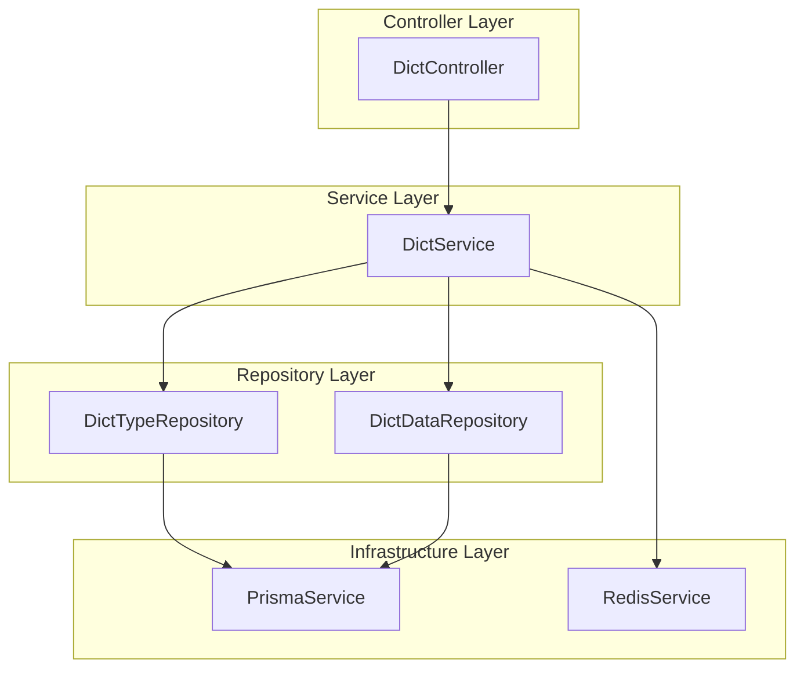
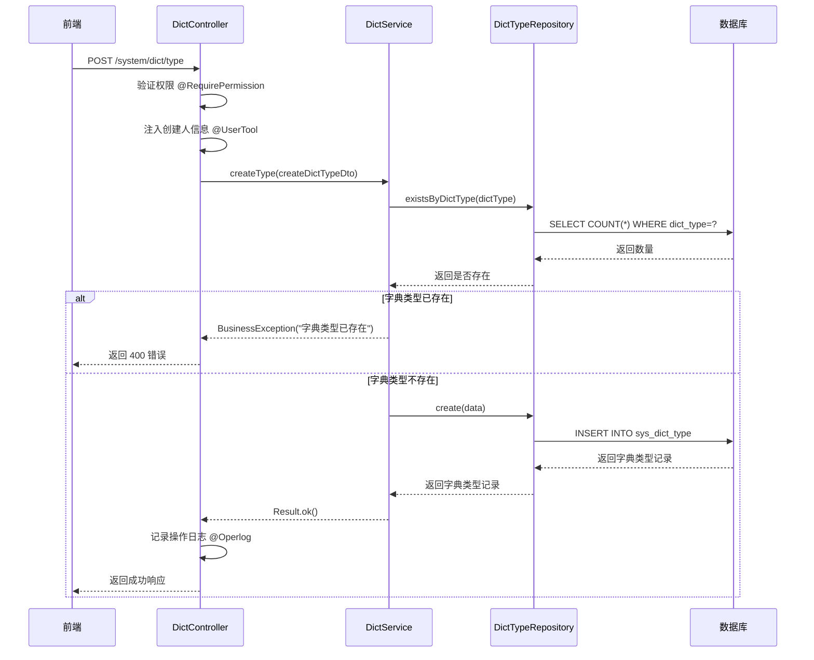
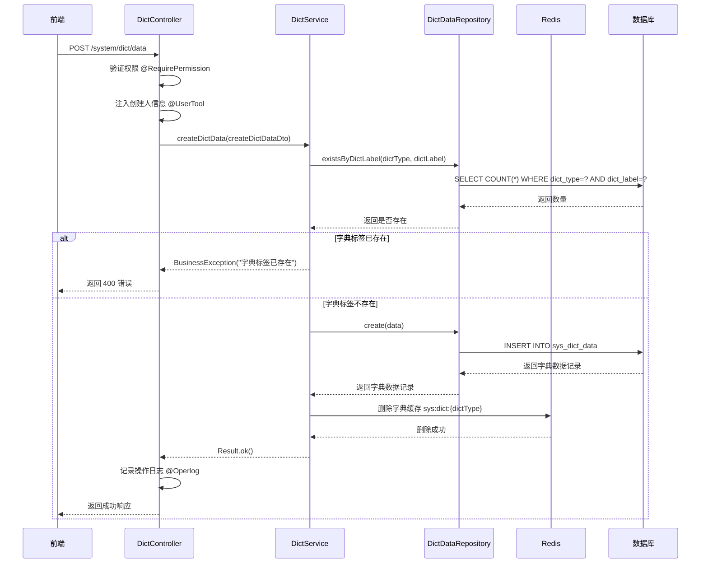
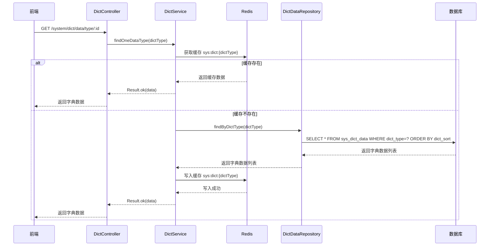
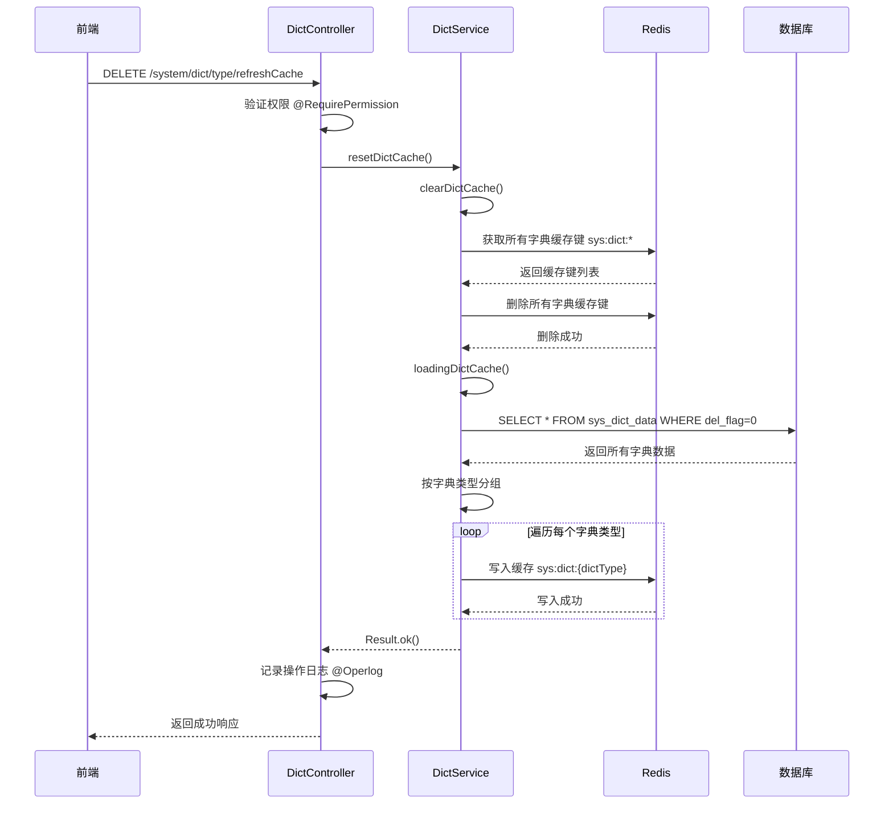
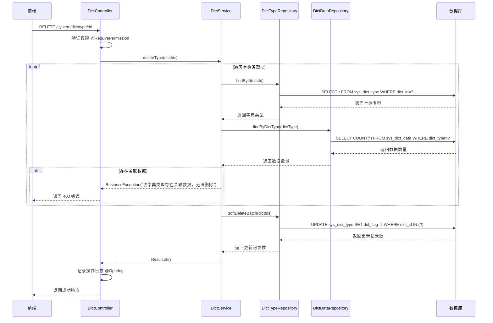
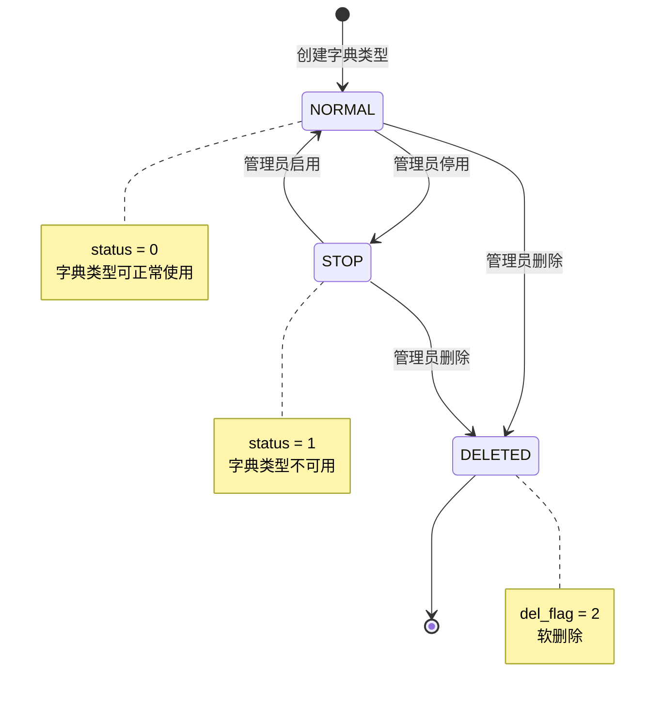
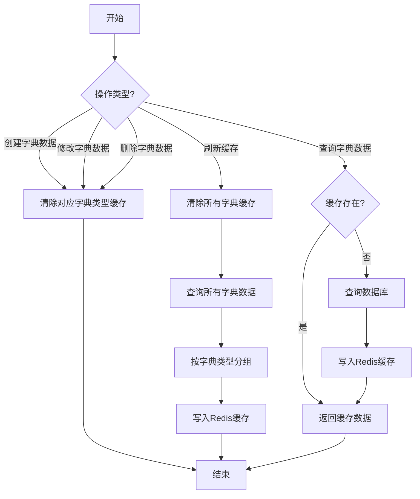

# 字典管理模块 (System Dict) — 设计文档

> 版本：1.0  
> 日期：2026-02-22  
> 状态：草案  
> 关联需求：[dict-requirements.md](../../../requirements/admin/system/dict-requirements.md)

---

## 1. 概述

### 1.1 设计目标

字典管理模块是后台管理系统的基础数据管理模块，负责系统字典的全生命周期管理和缓存优化。本设计文档旨在：

- 定义字典管理的技术架构和模块划分
- 规范字典类型和字典数据的数据模型和接口约定
- 明确字典缓存的管理策略和更新机制
- 优化字典数据的查询性能
- 为后续扩展（如字典国际化、字典版本管理）预留接口

### 1.2 设计约束

- 使用 NestJS 框架，遵循项目后端开发规范
- 使用 Prisma ORM 进行数据库操作
- 使用 Redis 缓存字典数据，提高查询性能
- 字典操作使用软删除，不物理删除数据
- 所有字典操作记录操作日志
- 字典类型和字典标签在同一租户下必须唯一

### 1.3 技术栈

| 技术            | 版本   | 用途     |
| --------------- | ------ | -------- |
| NestJS          | 10.x   | 后端框架 |
| Prisma          | 5.x    | ORM 框架 |
| Redis           | 7.x    | 缓存     |
| TypeScript      | 5.x    | 编程语言 |
| class-validator | 0.14.x | DTO 验证 |

---

## 2. 架构与模块

### 2.1 模块划分

> 图 1：字典管理模块组件图



### 2.2 目录结构

```
src/module/admin/system/dict/
├── dto/
│   ├── create-dict-type.dto.ts     # 创建字典类型 DTO
│   ├── update-dict-type.dto.ts     # 更新字典类型 DTO
│   ├── list-dict-type.dto.ts       # 查询字典类型列表 DTO
│   ├── create-dict-data.dto.ts     # 创建字典数据 DTO
│   ├── update-dict-data.dto.ts     # 更新字典数据 DTO
│   ├── list-dict-data.dto.ts       # 查询字典数据列表 DTO
│   └── index.ts                    # DTO 导出
├── vo/
│   └── dict.vo.ts                  # 字典 VO
├── dict.controller.ts              # 字典控制器
├── dict.service.ts                 # 字典服务
├── dict.repository.ts              # 字典仓储（包含类型和数据）
└── dict.module.ts                  # 字典模块
```

---

## 3. 领域/数据模型

### 3.1 字典实体类图

> 图 2：字典实体类图

```mermaid
classDiagram
    class SysDictType {
        +dictId: number
        +dictName: string
        +dictType: string
        +status: StatusEnum
        +remark: string
        +delFlag: DelFlagEnum
        +createBy: string
        +createTime: Date
        +updateBy: string
        +updateTime: Date
        +tenantId: string
    }

    class SysDictData {
        +dictCode: number
        +dictSort: number
        +dictLabel: string
        +dictValue: string
        +dictType: string
        +cssClass: string
        +listClass: string
        +isDefault: string
        +status: StatusEnum
        +remark: string
        +delFlag: DelFlagEnum
        +createBy: string
        +createTime: Date
        +updateBy: string
        +updateTime: Date
        +tenantId: string
    }

    class DictTypeRepository {
        +create(data): SysDictType
        +findById(id): SysDictType
        +update(id, data): SysDictType
        +softDelete(id): number
        +softDeleteBatch(ids): number
        +findPageWithFilter(where, skip, take): {list, total}
        +findAllForSelect(): SysDictType[]
        +existsByDictType(type, excludeId): boolean
    }

    class DictDataRepository {
        +create(data): SysDictData
        +findById(id): SysDictData
        +update(id, data): SysDictData
        +softDelete(id): number
        +softDeleteBatch(ids): number
        +findPageWithFilter(where, skip, take): {list, total}
        +findByDictType(type): SysDictData[]
        +existsByDictLabel(type, label, excludeId): boolean
        +deleteByDictType(type): number
    }

    class DictService {
        +createType(dto): Result
        +findAllType(query): Result
        +findOneType(id): Result
        +updateType(dto): Result
        +deleteType(ids): Result
        +findOptionselect(): Result
        +createDictData(dto): Result
        +findAllData(query): Result
        +findOneDictData(id): Result
        +updateDictData(dto): Result
        +deleteDictData(ids): Result
        +findOneDataType(type): Result
        +resetDictCache(): Result
        -clearDictCache(): void
        -loadingDictCache(): void
    }

    DictService --> DictTypeRepository
    DictService --> DictDataRepository
    DictTypeRepository --> SysDictType
    DictDataRepository --> SysDictData
    SysDictType "1" --> "*" SysDictData : dictType
```

### 3.2 数据库表结构

```sql
-- 字典类型表
CREATE TABLE sys_dict_type (
  dict_id     BIGINT AUTO_INCREMENT PRIMARY KEY COMMENT '字典主键',
  dict_name   VARCHAR(100) DEFAULT '' COMMENT '字典名称',
  dict_type   VARCHAR(100) DEFAULT '' COMMENT '字典类型',
  status      CHAR(1) DEFAULT '0' COMMENT '状态（0正常 1停用）',
  remark      VARCHAR(500) DEFAULT NULL COMMENT '备注',
  del_flag    CHAR(1) DEFAULT '0' COMMENT '删除标志（0正常 2删除）',
  create_by   VARCHAR(64) DEFAULT '' COMMENT '创建者',
  create_time DATETIME DEFAULT CURRENT_TIMESTAMP COMMENT '创建时间',
  update_by   VARCHAR(64) DEFAULT '' COMMENT '更新者',
  update_time DATETIME DEFAULT CURRENT_TIMESTAMP ON UPDATE CURRENT_TIMESTAMP COMMENT '更新时间',
  tenant_id   VARCHAR(20) DEFAULT '000000' COMMENT '租户ID',
  INDEX idx_dict_type (dict_type),
  INDEX idx_status (status),
  INDEX idx_del_flag (del_flag),
  INDEX idx_tenant_id (tenant_id),
  UNIQUE KEY uk_tenant_type (tenant_id, dict_type)
) COMMENT='字典类型表';

-- 字典数据表
CREATE TABLE sys_dict_data (
  dict_code   BIGINT AUTO_INCREMENT PRIMARY KEY COMMENT '字典编码',
  dict_sort   INT DEFAULT 0 COMMENT '字典排序',
  dict_label  VARCHAR(100) DEFAULT '' COMMENT '字典标签',
  dict_value  VARCHAR(100) DEFAULT '' COMMENT '字典键值',
  dict_type   VARCHAR(100) DEFAULT '' COMMENT '字典类型',
  css_class   VARCHAR(100) DEFAULT NULL COMMENT '样式属性（其他样式扩展）',
  list_class  VARCHAR(100) DEFAULT NULL COMMENT '表格回显样式',
  is_default  CHAR(1) DEFAULT 'N' COMMENT '是否默认（Y是 N否）',
  status      CHAR(1) DEFAULT '0' COMMENT '状态（0正常 1停用）',
  remark      VARCHAR(500) DEFAULT NULL COMMENT '备注',
  del_flag    CHAR(1) DEFAULT '0' COMMENT '删除标志（0正常 2删除）',
  create_by   VARCHAR(64) DEFAULT '' COMMENT '创建者',
  create_time DATETIME DEFAULT CURRENT_TIMESTAMP COMMENT '创建时间',
  update_by   VARCHAR(64) DEFAULT '' COMMENT '更新者',
  update_time DATETIME DEFAULT CURRENT_TIMESTAMP ON UPDATE CURRENT_TIMESTAMP COMMENT '更新时间',
  tenant_id   VARCHAR(20) DEFAULT '000000' COMMENT '租户ID',
  INDEX idx_dict_type (dict_type),
  INDEX idx_status (status),
  INDEX idx_del_flag (del_flag),
  INDEX idx_tenant_id (tenant_id),
  INDEX idx_dict_sort (dict_sort),
  UNIQUE KEY uk_tenant_type_label (tenant_id, dict_type, dict_label)
) COMMENT='字典数据表';
```

---

## 4. 核心流程时序

### 4.1 创建字典类型时序

> 图 3：创建字典类型时序图



### 4.2 创建字典数据时序

> 图 4：创建字典数据时序图



### 4.3 按类型查询字典数据时序（缓存）

> 图 5：按类型查询字典数据时序图



### 4.4 刷新字典缓存时序

> 图 6：刷新字典缓存时序图



### 4.5 删除字典类型时序

> 图 7：删除字典类型时序图



---

## 5. 状态与流程

### 5.1 字典类型状态机

> 图 8：字典类型状态机



### 5.2 字典数据状态机

> 图 9：字典数据状态机


### 5.3 字典缓存管理流程

> 图 10：字典缓存管理活动图



---

## 6. 接口/数据约定

### 6.1 DictService 接口

```typescript
interface DictService {
  // 字典类型
  createType(createDictTypeDto: CreateDictTypeDto): Promise<Result>;
  findAllType(query: ListDictType): Promise<Result>;
  findOneType(dictId: number): Promise<Result>;
  updateType(updateDictTypeDto: UpdateDictTypeDto): Promise<Result>;
  deleteType(dictIds: number[]): Promise<Result>;
  findOptionselect(): Promise<Result>;
  export(res: Response, body: ListDictType): Promise<void>;

  // 字典数据
  createDictData(createDictDataDto: CreateDictDataDto): Promise<Result>;
  findAllData(query: ListDictData): Promise<Result>;
  findOneDictData(dictCode: number): Promise<Result>;
  updateDictData(updateDictDataDto: UpdateDictDataDto): Promise<Result>;
  deleteDictData(dictIds: number[]): Promise<Result>;
  findOneDataType(dictType: string): Promise<Result>;
  exportData(res: Response, body: ListDictType): Promise<void>;

  // 缓存管理
  resetDictCache(): Promise<Result>;
  clearDictCache(): Promise<void>;
  loadingDictCache(): Promise<void>;
}
```

### 6.2 DictTypeRepository 接口

```typescript
interface DictTypeRepository {
  create(data: Prisma.SysDictTypeCreateInput): Promise<SysDictType>;
  findById(dictId: number): Promise<SysDictType | null>;
  update(dictId: number, data: Prisma.SysDictTypeUpdateInput): Promise<SysDictType>;
  softDelete(dictId: number): Promise<number>;
  softDeleteBatch(dictIds: number[]): Promise<number>;
  findPageWithFilter(
    where: Prisma.SysDictTypeWhereInput,
    skip: number,
    take: number,
  ): Promise<{ list: SysDictType[]; total: number }>;
  findAllForSelect(): Promise<SysDictType[]>;
  findByDictType(dictType: string): Promise<SysDictType | null>;
  existsByDictType(dictType: string, excludeDictId?: number): Promise<boolean>;
  createMany(data: Prisma.SysDictTypeCreateManyInput[]): Promise<{ count: number }>;
}
```

### 6.3 DictDataRepository 接口

```typescript
interface DictDataRepository {
  create(data: Prisma.SysDictDataCreateInput): Promise<SysDictData>;
  findById(dictCode: number): Promise<SysDictData | null>;
  update(dictCode: number, data: Prisma.SysDictDataUpdateInput): Promise<SysDictData>;
  softDelete(dictCode: number): Promise<number>;
  softDeleteBatch(dictCodes: number[]): Promise<number>;
  findPageWithFilter(
    where: Prisma.SysDictDataWhereInput,
    skip: number,
    take: number,
  ): Promise<{ list: SysDictData[]; total: number }>;
  findByDictType(dictType: string): Promise<SysDictData[]>;
  existsByDictLabel(dictType: string, dictLabel: string, excludeDictCode?: number): Promise<boolean>;
  deleteByDictType(dictType: string): Promise<number>;
  createMany(data: Prisma.SysDictDataCreateManyInput[]): Promise<{ count: number }>;
}
```

### 6.4 DTO 定义

```typescript
// 创建字典类型 DTO
class CreateDictTypeDto {
  dictName: string; // 字典名称（必填，0-100 字符）
  dictType: string; // 字典类型（必填，0-100 字符）
  status?: StatusEnum; // 字典状态（可选，0=正常 1=停用）
  remark?: string; // 备注（可选，0-500 字符）
}

// 更新字典类型 DTO
class UpdateDictTypeDto extends CreateDictTypeDto {
  dictId: number; // 字典类型ID（必填）
}

// 查询字典类型列表 DTO
class ListDictType extends PageQueryDto {
  dictName?: string; // 字典名称（可选，模糊查询）
  dictType?: string; // 字典类型（可选，模糊查询）
  status?: StatusEnum; // 字典状态（可选）
}

// 创建字典数据 DTO
class CreateDictDataDto {
  dictType: string; // 字典类型（必填，0-100 字符）
  dictLabel: string; // 字典标签（必填，0-100 字符）
  dictValue: string; // 字典键值（必填，0-100 字符）
  listClass: string; // 样式属性（必填，0-100 字符）
  cssClass?: string; // CSS样式（可选，0-100 字符）
  dictSort?: number; // 字典排序（可选）
  status?: StatusEnum; // 字典状态（可选，0=正常 1=停用）
  remark?: string; // 备注（可选，0-500 字符）
}

// 更新字典数据 DTO
class UpdateDictDataDto extends CreateDictDataDto {
  dictCode: number; // 字典数据ID（必填）
}

// 查询字典数据列表 DTO
class ListDictData extends PageQueryDto {
  dictType?: string; // 字典类型（可选）
  dictLabel?: string; // 字典标签（可选，模糊查询）
  status?: StatusEnum; // 字典状态（可选）
}
```

### 6.5 VO 定义

```typescript
// 字典类型 VO
class DictTypeVo {
  dictId: number;
  dictName: string;
  dictType: string;
  status: string;
  remark: string;
  createTime: Date;
  updateTime: Date;
}

// 字典数据 VO
class DictDataVo {
  dictCode: number;
  dictSort: number;
  dictLabel: string;
  dictValue: string;
  dictType: string;
  cssClass: string;
  listClass: string;
  isDefault: string;
  status: string;
  remark: string;
  createTime: Date;
  updateTime: Date;
}
```

---

## 7. 安全设计

### 7.1 权限控制

| 操作             | 权限标识           | 说明                     |
| ---------------- | ------------------ | ------------------------ |
| 创建字典类型     | system:dict:add    | 创建新字典类型           |
| 查询字典类型列表 | system:dict:list   | 查询字典类型列表         |
| 查看字典类型详情 | system:dict:query  | 查看字典类型详细信息     |
| 修改字典类型     | system:dict:edit   | 修改字典类型信息         |
| 删除字典类型     | system:dict:remove | 删除字典类型             |
| 导出字典类型     | system:dict:export | 导出字典类型数据为 Excel |
| 创建字典数据     | system:dict:add    | 创建新字典数据           |
| 查询字典数据列表 | system:dict:list   | 查询字典数据列表         |
| 修改字典数据     | system:dict:edit   | 修改字典数据信息         |
| 删除字典数据     | system:dict:remove | 删除字典数据             |
| 导出字典数据     | system:dict:export | 导出字典数据为 Excel     |
| 刷新字典缓存     | system:dict:remove | 刷新字典缓存             |

### 7.2 数据验证

| 字段      | 验证规则            |
| --------- | ------------------- |
| dictName  | 必填，0-100 字符    |
| dictType  | 必填，0-100 字符    |
| dictLabel | 必填，0-100 字符    |
| dictValue | 必填，0-100 字符    |
| listClass | 必填，0-100 字符    |
| cssClass  | 可选，0-100 字符    |
| dictSort  | 可选，数字          |
| status    | 可选，枚举值（0/1） |
| remark    | 可选，0-500 字符    |

### 7.3 业务规则校验

| 规则           | 校验时机     | 说明                           |
| -------------- | ------------ | ------------------------------ |
| 字典类型唯一性 | 创建、修改   | 同一租户下字典类型必须唯一     |
| 字典标签唯一性 | 创建、修改   | 同一字典类型下字典标签必须唯一 |
| 数据关联检查   | 删除字典类型 | 删除前检查是否有字典数据关联   |

### 7.4 操作日志

所有字典操作（创建、修改、删除、导出、刷新缓存）均使用 `@Operlog` 装饰器记录操作日志，包含：

- 操作人
- 操作时间
- 操作类型（INSERT/UPDATE/DELETE/EXPORT/CLEAN）
- 操作内容（字典ID、字典类型）
- 操作结果（成功/失败）

---

## 8. 性能优化

### 8.1 缓存策略

| 缓存项   | 缓存键              | TTL  | 说明                   |
| -------- | ------------------- | ---- | ---------------------- |
| 字典数据 | sys:dict:{dictType} | 永久 | 按字典类型缓存字典数据 |

**缓存更新策略**：

- 创建字典数据：清除对应字典类型的缓存
- 修改字典数据：清除对应字典类型的缓存
- 删除字典数据：清除对应字典类型的缓存
- 刷新缓存：清除所有字典缓存，重新加载

**缓存优化建议**：

- 修改或删除字典数据时，仅清除对应字典类型的缓存，而非清除所有缓存
- 提供按字典类型清除缓存的接口

### 8.2 查询优化

| 优化项             | 优化方式                                                      |
| ------------------ | ------------------------------------------------------------- |
| 字典类型列表查询   | 使用索引（dict_type, status, del_flag, tenant_id）            |
| 字典数据列表查询   | 使用索引（dict_type, status, del_flag, tenant_id, dict_sort） |
| 字典类型唯一性查询 | 使用唯一索引（tenant_id, dict_type）                          |
| 字典标签唯一性查询 | 使用唯一索引（tenant_id, dict_type, dict_label）              |
| 按类型查询字典数据 | 优先使用 Redis 缓存                                           |

### 8.3 性能指标

| 接口               | P95 延迟目标    | 说明                     |
| ------------------ | --------------- | ------------------------ |
| 创建字典类型       | 小于等于 200ms  | 包含数据库写入和校验     |
| 查询字典类型列表   | 小于等于 200ms  | 包含数据库查询           |
| 创建字典数据       | 小于等于 200ms  | 包含数据库写入和缓存清除 |
| 查询字典数据列表   | 小于等于 200ms  | 包含数据库查询           |
| 按类型查询字典数据 | 小于等于 50ms   | 优先使用缓存             |
| 刷新字典缓存       | 小于等于 1000ms | 包含清除和重新加载       |

---

## 9. 实施计划

### 9.1 阶段一：核心功能完善（当前）

| 任务                       | 状态      | 说明                         |
| -------------------------- | --------- | ---------------------------- |
| 字典类型 CRUD 操作         | ✅ 已完成 | 创建、查询、修改、删除       |
| 字典数据 CRUD 操作         | ✅ 已完成 | 创建、查询、修改、删除       |
| 字典缓存管理               | ✅ 已完成 | 刷新缓存、清除缓存、加载缓存 |
| 按类型查询字典数据（缓存） | ✅ 已完成 | 优先使用 Redis 缓存          |
| 字典数据导出               | ✅ 已完成 | 导出为 Excel                 |
| 操作日志记录               | ✅ 已完成 | 使用 @Operlog 装饰器         |

### 9.2 阶段二：功能优化（1-2 个迭代）

| 任务               | 优先级 | 工作量 | 说明                                     |
| ------------------ | ------ | ------ | ---------------------------------------- |
| 实现唯一性校验     | P0     | 1 天   | 创建和修改时校验字典类型和字典标签唯一性 |
| 删除前检查数据关联 | P0     | 1 天   | 删除字典类型前检查是否有字典数据关联     |
| 优化缓存更新策略   | P1     | 2 天   | 按字典类型清除缓存，而非清除所有缓存     |
| 实现字典批量导入   | P1     | 3 天   | 支持 Excel 批量导入字典                  |

### 9.3 阶段三：扩展功能（3-6 个月）

| 任务                 | 优先级 | 工作量 | 说明                     |
| -------------------- | ------ | ------ | ------------------------ |
| 实现字典数据拖拽排序 | P2     | 3 天   | 支持拖拽调整字典数据顺序 |
| 实现字典使用统计     | P2     | 3 天   | 统计字典被哪些模块使用   |
| 实现字典国际化       | P2     | 5 天   | 支持多语言字典标签       |

---

## 10. 测试策略

### 10.1 单元测试

| 测试项             | 测试内容                                     |
| ------------------ | -------------------------------------------- |
| DictService        | 创建、查询、修改、删除字典类型和字典数据     |
| DictTypeRepository | 数据库操作（CRUD、唯一性校验等）             |
| DictDataRepository | 数据库操作（CRUD、唯一性校验、按类型查询等） |
| 唯一性校验         | 字典类型和字典标签唯一性校验                 |
| 关联检查           | 删除字典类型前检查字典数据关联               |
| 缓存管理           | 刷新缓存、清除缓存、加载缓存                 |

### 10.2 集成测试

| 测试项             | 测试内容                           |
| ------------------ | ---------------------------------- |
| 创建字典类型       | 创建字典类型并验证数据库记录       |
| 创建字典数据       | 创建字典数据并验证缓存清除         |
| 修改字典数据       | 修改字典数据并验证缓存清除         |
| 删除字典数据       | 删除字典数据并验证软删除和缓存清除 |
| 按类型查询字典数据 | 验证缓存命中和缓存未命中的情况     |
| 刷新字典缓存       | 验证缓存清除和重新加载             |

### 10.3 性能测试

| 测试项             | 测试内容                           |
| ------------------ | ---------------------------------- |
| 字典类型列表查询   | 验证 P95 延迟小于等于 200ms        |
| 字典数据列表查询   | 验证 P95 延迟小于等于 200ms        |
| 按类型查询字典数据 | 验证 P95 延迟小于等于 50ms（缓存） |
| 缓存命中率         | 验证字典数据缓存命中率大于等于 90% |

---

## 11. 监控与告警

### 11.1 监控指标

| 指标          | 说明                   | 告警阈值   |
| ------------- | ---------------------- | ---------- |
| 接口 QPS      | 每秒请求数             | 大于 100   |
| 接口 P95 延迟 | 95% 请求的响应时间     | 大于 300ms |
| 接口错误率    | 请求失败比例           | 大于 1%    |
| 缓存命中率    | Redis 缓存命中比例     | 小于 80%   |
| 数据库慢查询  | 查询时间大于 1s 的 SQL | 出现慢查询 |

### 11.2 日志记录

| 日志级别 | 记录内容                                 |
| -------- | ---------------------------------------- |
| INFO     | 字典类型和字典数据的创建、修改、删除操作 |
| INFO     | 字典缓存的刷新、清除、加载操作           |
| WARN     | 唯一性校验失败、关联检查失败             |
| ERROR    | 数据库操作失败、缓存操作失败             |

---

## 12. 扩展性设计

### 12.1 字典国际化

**设计思路**：

- 新增 `sys_dict_data_i18n` 表，存储字典数据的多语言标签
- 字典查询时根据用户语言偏好返回对应语言的字典标签
- 兼容现有字典数据，默认使用 `dict_label` 字段

**表结构**：

```sql
CREATE TABLE sys_dict_data_i18n (
  id          BIGINT AUTO_INCREMENT PRIMARY KEY,
  dict_code   BIGINT NOT NULL COMMENT '字典数据ID',
  lang        VARCHAR(10) NOT NULL COMMENT '语言代码（zh-CN, en-US）',
  dict_label  VARCHAR(100) NOT NULL COMMENT '字典标签',
  create_time DATETIME DEFAULT CURRENT_TIMESTAMP,
  update_time DATETIME DEFAULT CURRENT_TIMESTAMP ON UPDATE CURRENT_TIMESTAMP,
  UNIQUE KEY uk_dict_lang (dict_code, lang),
  INDEX idx_dict_code (dict_code)
) COMMENT='字典数据国际化表';
```

### 12.2 字典版本管理

**设计思路**：

- 新增 `sys_dict_version` 表，记录字典的变更历史
- 每次修改字典数据时，记录变更前的数据
- 支持字典数据的版本回滚

**表结构**：

```sql
CREATE TABLE sys_dict_version (
  id          BIGINT AUTO_INCREMENT PRIMARY KEY,
  dict_code   BIGINT NOT NULL COMMENT '字典数据ID',
  dict_type   VARCHAR(100) NOT NULL COMMENT '字典类型',
  version     INT NOT NULL COMMENT '版本号',
  old_value   JSON NOT NULL COMMENT '变更前的数据',
  new_value   JSON NOT NULL COMMENT '变更后的数据',
  change_type VARCHAR(20) NOT NULL COMMENT '变更类型（CREATE/UPDATE/DELETE）',
  change_by   VARCHAR(64) NOT NULL COMMENT '变更人',
  change_time DATETIME DEFAULT CURRENT_TIMESTAMP COMMENT '变更时间',
  INDEX idx_dict_code (dict_code),
  INDEX idx_dict_type (dict_type),
  INDEX idx_change_time (change_time)
) COMMENT='字典版本历史表';
```

### 12.3 字典使用统计

**设计思路**：

- 新增 `sys_dict_usage` 表，记录字典的使用情况
- 统计字典被哪些模块使用
- 统计字典的访问次数和频率

**表结构**：

```sql
CREATE TABLE sys_dict_usage (
  id          BIGINT AUTO_INCREMENT PRIMARY KEY,
  dict_type   VARCHAR(100) NOT NULL COMMENT '字典类型',
  module_name VARCHAR(100) NOT NULL COMMENT '使用模块',
  access_count BIGINT DEFAULT 0 COMMENT '访问次数',
  last_access_time DATETIME COMMENT '最后访问时间',
  create_time DATETIME DEFAULT CURRENT_TIMESTAMP,
  update_time DATETIME DEFAULT CURRENT_TIMESTAMP ON UPDATE CURRENT_TIMESTAMP,
  UNIQUE KEY uk_dict_module (dict_type, module_name),
  INDEX idx_dict_type (dict_type),
  INDEX idx_access_count (access_count)
) COMMENT='字典使用统计表';
```

---

## 13. 风险评估

### 13.1 技术风险

| 风险           | 影响     | 概率 | 应对措施                    |
| -------------- | -------- | ---- | --------------------------- |
| 缓存失效       | 性能下降 | 低   | 使用 Redis 持久化，定期备份 |
| 数据库慢查询   | 性能下降 | 中   | 优化索引，使用缓存          |
| 唯一性校验失败 | 数据质量 | 低   | 完善校验逻辑，提供友好提示  |

### 13.2 业务风险

| 风险           | 影响       | 概率 | 应对措施                         |
| -------------- | ---------- | ---- | -------------------------------- |
| 字典误删       | 数据丢失   | 中   | 使用软删除，提供恢复功能         |
| 字典类型重复   | 数据质量   | 中   | 实现唯一性校验，定期检查         |
| 关联数据未清理 | 数据一致性 | 中   | 删除前检查关联，提供批量清理功能 |

---

## 14. 附录

### 14.1 相关文档

- [字典管理模块需求文档](../../../requirements/admin/system/dict-requirements.md)
- [后端开发规范](../../../../../.kiro/steering/backend-nestjs.md)

### 14.2 参考资料

- [NestJS 官方文档](https://docs.nestjs.com/)
- [Prisma 官方文档](https://www.prisma.io/docs/)
- [Redis 缓存最佳实践](https://redis.io/docs/manual/patterns/)

### 14.3 术语表

| 术语     | 说明                                  |
| -------- | ------------------------------------- |
| 字典类型 | 字典的分类，如性别、状态、类型等      |
| 字典数据 | 字典类型下的具体数据项                |
| 字典标签 | 字典数据的显示名称                    |
| 字典键值 | 字典数据的实际值                      |
| 字典排序 | 字典数据的显示顺序                    |
| 样式属性 | 字典数据的样式类名                    |
| 软删除   | 标记为删除但不物理删除数据            |
| 字典缓存 | 使用 Redis 缓存字典数据，提高查询性能 |
