# 文件管理模块 — 设计文档

> 版本：1.0  
> 日期：2026-02-22  
> 状态：草案  
> 关联需求：[file-manager-requirements.md](../../../requirements/admin/system/file-manager-requirements.md)

---

## 1. 概述

### 1.1 设计目标

设计完整的文件管理系统，实现：

- 文件夹树形结构管理
- 文件的组织、移动、重命名、删除
- 文件版本控制和历史回溯
- 文件分享链接生成和访问控制
- 回收站机制防止误删
- 批量下载和存储统计

### 1.2 设计原则

- 租户隔离：所有数据按租户隔离
- 软删除优先：文件删除先移入回收站
- 版本控制：文件修改创建新版本，保留历史
- 访问控制：文件下载需要令牌验证
- 存储管理：实时更新租户存储使用量

### 1.3 约束

- 文件上传由 upload 模块负责
- 批量下载仅支持本地存储文件
- 版本清理策略由配置决定
- 分享链接访问无需登录

---

## 2. 架构与模块

### 2.1 模块组件图

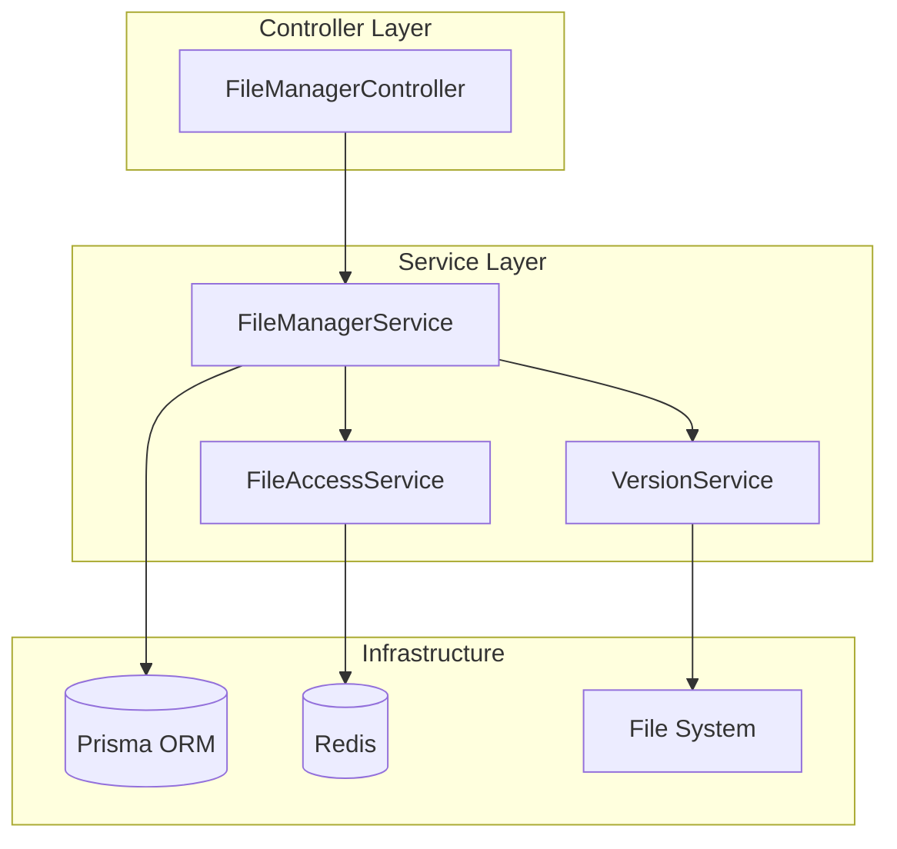

### 2.2 目录结构

```
src/module/admin/system/file-manager/
├── dto/
│   ├── file.dto.ts                # 文件相关 DTO
│   ├── folder.dto.ts              # 文件夹相关 DTO
│   └── index.ts
├── services/
│   └── file-access.service.ts     # 文件访问令牌服务
├── file-manager.controller.ts     # 控制器
├── file-manager.service.ts        # 核心服务
└── file-manager.module.ts         # 模块配置
```

### 2.3 租户隔离说明

**租户范围**：TenantScoped

- 所有接口按当前租户隔离数据（除分享相关公开接口）
- 租户 ID 来自请求头 `tenant-id` 或登录态
- 文件夹和文件通过 tenantId 字段隔离
- 分享链接访问时验证文件所属租户

---

## 3. 领域模型

### 3.1 类图

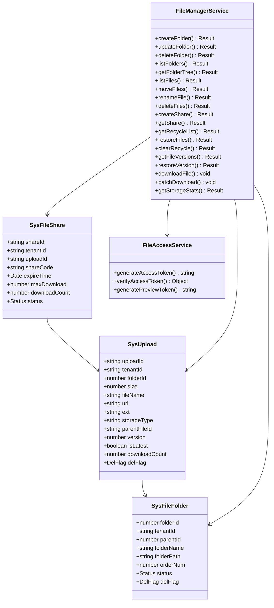

### 3.2 实体说明

**SysFileFolder**：文件夹实体

- folderId：主键，自增
- parentId：父文件夹 ID，0 表示根目录
- folderPath：文件夹路径，如 /parent/child/
- orderNum：排序号，用于控制显示顺序

**SysUpload**：文件实体

- uploadId：主键，UUID
- folderId：所属文件夹 ID，0 表示根目录
- parentFileId：父文件 ID，用于版本控制
- version：版本号，从 1 开始递增
- isLatest：是否最新版本
- storageType：存储类型（local/cos）

**SysFileShare**：文件分享实体

- shareId：主键，UUID
- shareCode：分享码，6 位，可选
- expireTime：过期时间，null 表示永久有效
- maxDownload：最大下载次数，-1 表示不限

---

## 4. 核心流程时序

### 4.1 创建文件夹

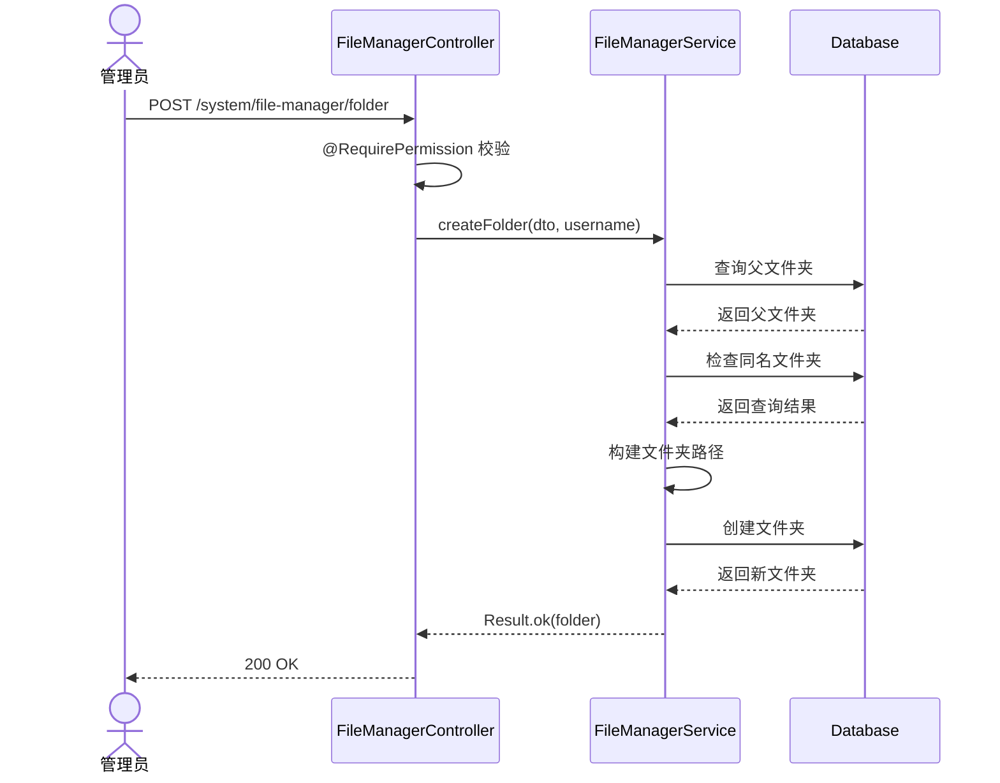

### 4.2 文件分享流程

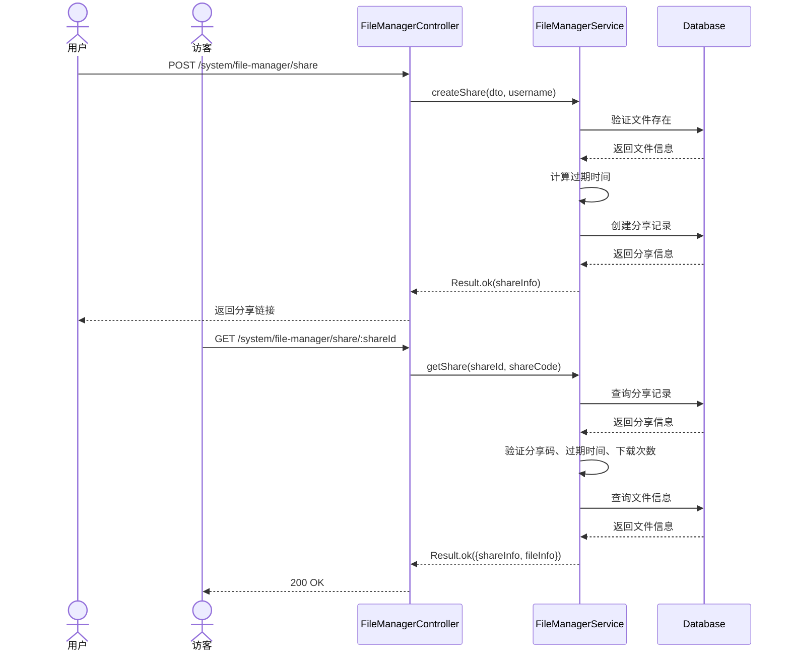

### 4.3 文件版本恢复

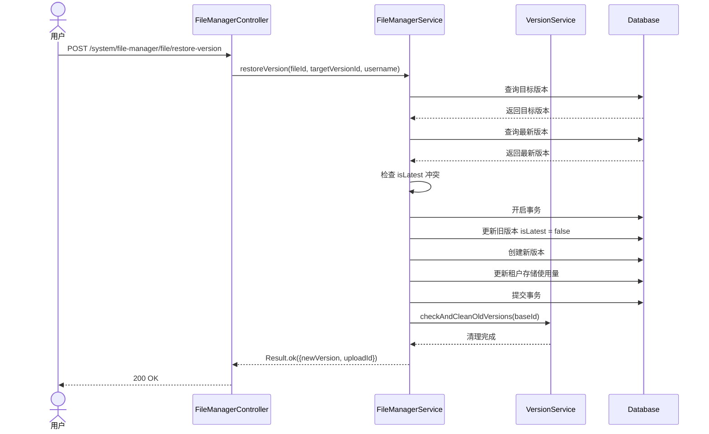

### 4.4 文件下载流程

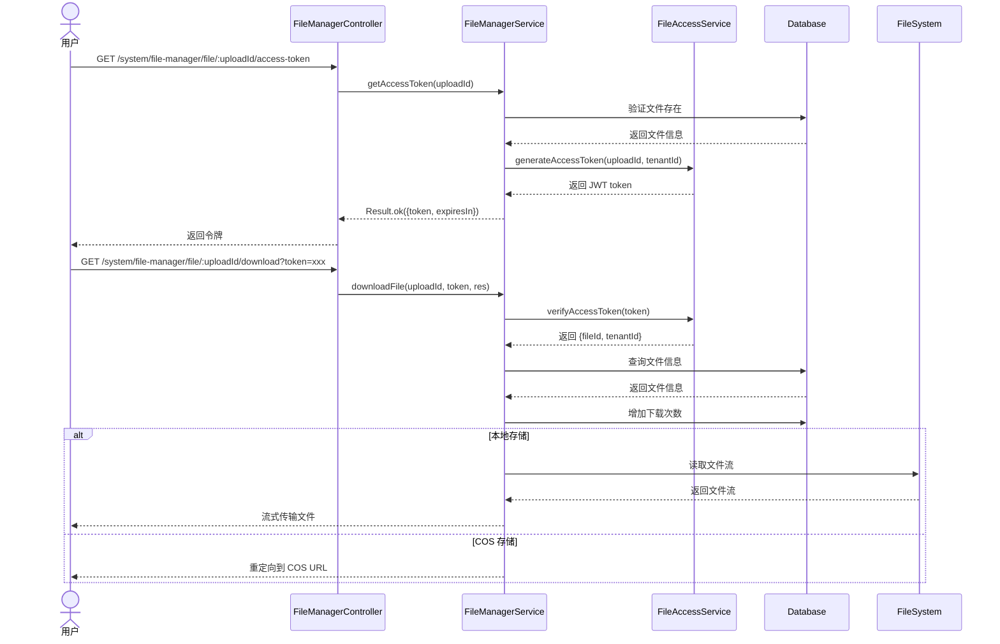

### 4.5 回收站恢复流程

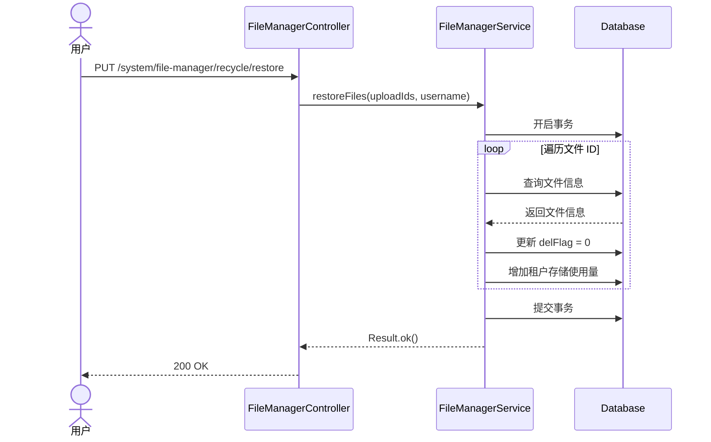

---

## 5. 状态与流程

### 5.1 文件夹状态机

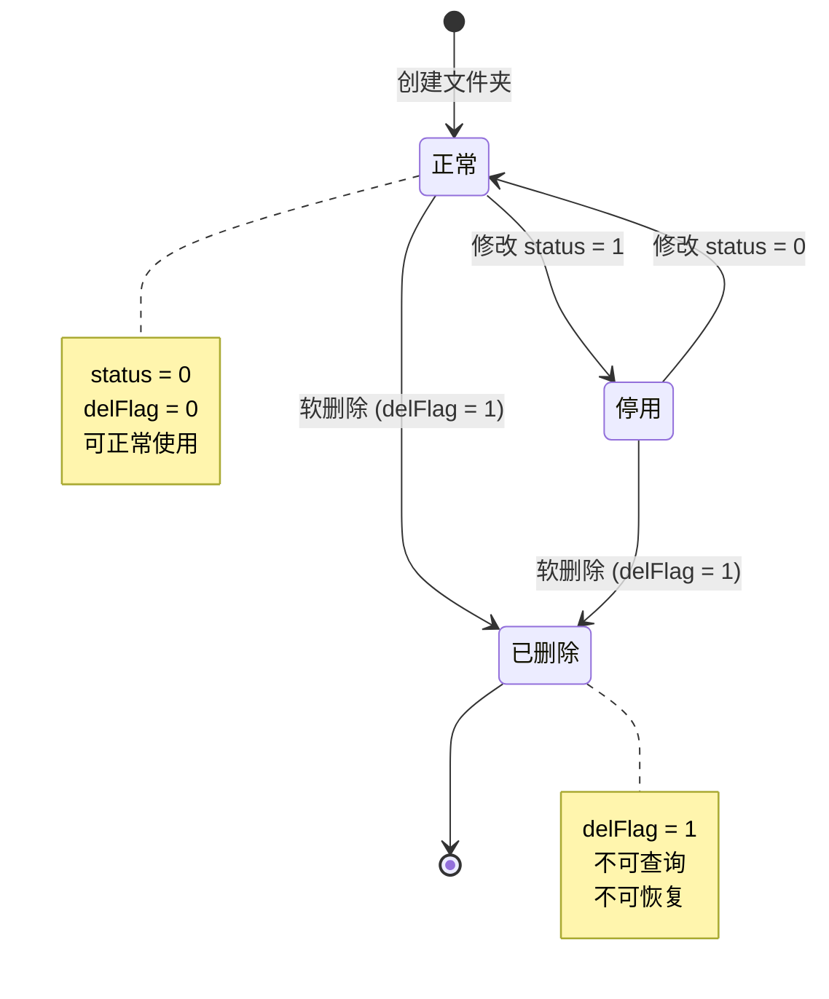

### 5.2 文件生命周期

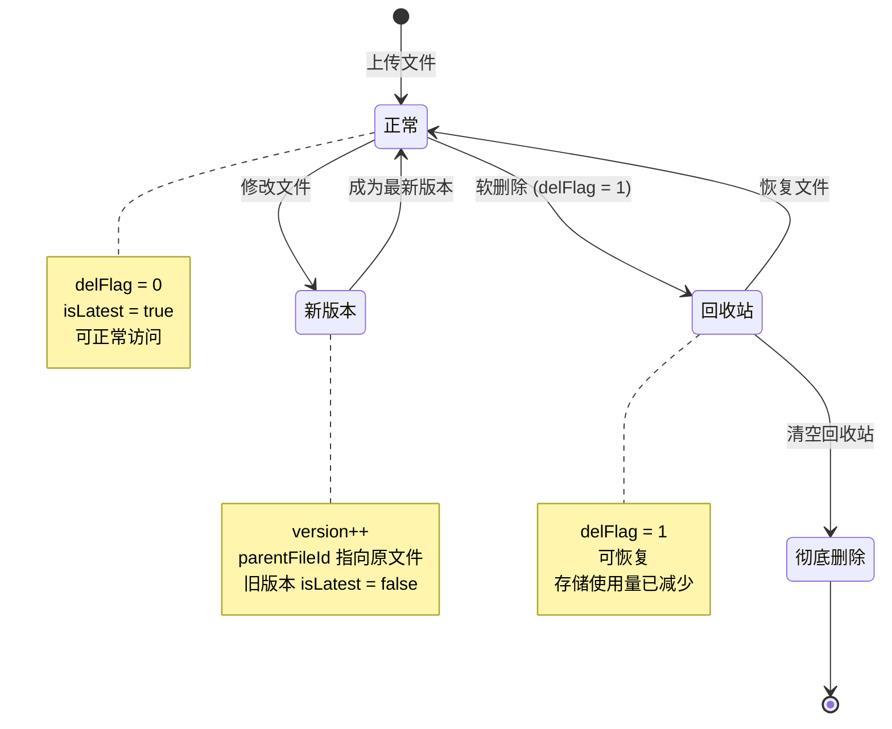

### 5.3 分享链接状态机

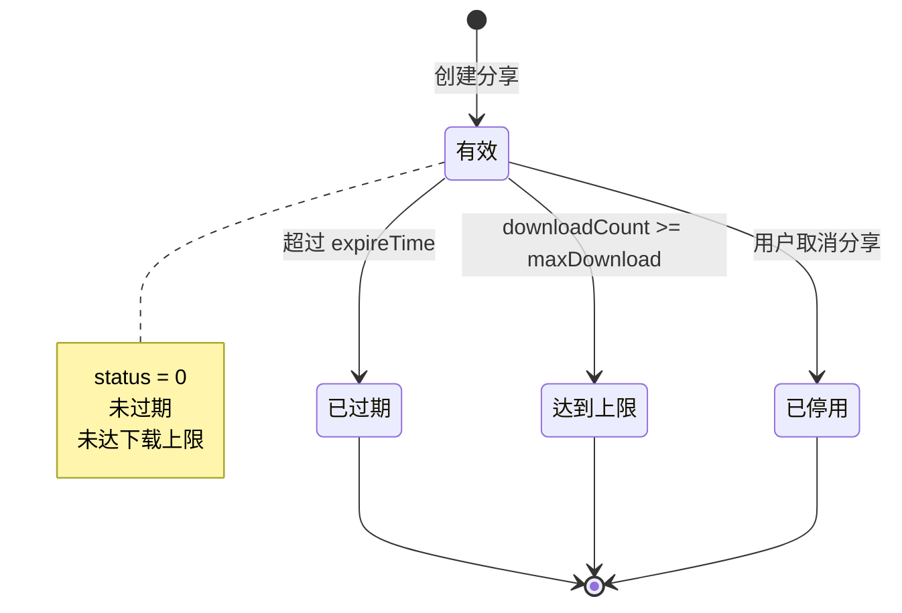

### 5.4 文件版本控制流程

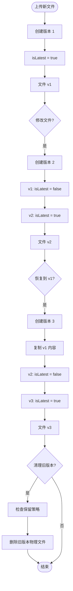

---

## 6. 接口与数据约定

### 6.1 REST API 接口

| 方法   | 路径                                             | 说明               | 权限                        |
| ------ | ------------------------------------------------ | ------------------ | --------------------------- |
| POST   | /system/file-manager/folder                      | 创建文件夹         | system:file:add             |
| PUT    | /system/file-manager/folder                      | 更新文件夹         | system:file:edit            |
| DELETE | /system/file-manager/folder/:folderId            | 删除文件夹         | system:file:remove          |
| GET    | /system/file-manager/folder/list                 | 获取文件夹列表     | system:file:list            |
| GET    | /system/file-manager/folder/tree                 | 获取文件夹树       | system:file:list            |
| GET    | /system/file-manager/file/list                   | 获取文件列表       | system:file:list            |
| POST   | /system/file-manager/file/move                   | 移动文件           | system:file:edit            |
| POST   | /system/file-manager/file/rename                 | 重命名文件         | system:file:edit            |
| DELETE | /system/file-manager/file                        | 删除文件           | system:file:remove          |
| GET    | /system/file-manager/file/:uploadId              | 获取文件详情       | system:file:query           |
| POST   | /system/file-manager/share                       | 创建分享链接       | system:file:share           |
| GET    | /system/file-manager/share/:shareId              | 获取分享信息       | 无需登录                    |
| POST   | /system/file-manager/share/:shareId/download     | 下载分享文件       | 无需登录                    |
| DELETE | /system/file-manager/share/:shareId              | 取消分享           | system:file:share           |
| GET    | /system/file-manager/share/my/list               | 我的分享列表       | system:file:share           |
| GET    | /system/file-manager/recycle/list                | 获取回收站文件列表 | system:file:recycle:list    |
| PUT    | /system/file-manager/recycle/restore             | 恢复回收站文件     | system:file:recycle:restore |
| DELETE | /system/file-manager/recycle/clear               | 彻底删除回收站文件 | system:file:recycle:remove  |
| GET    | /system/file-manager/file/:uploadId/versions     | 获取文件版本历史   | system:file:query           |
| POST   | /system/file-manager/file/restore-version        | 恢复到指定版本     | system:file:edit            |
| GET    | /system/file-manager/file/:uploadId/access-token | 获取文件访问令牌   | system:file:query           |
| GET    | /system/file-manager/file/:uploadId/download     | 下载文件           | 无需登录（需令牌）          |
| POST   | /system/file-manager/file/batch-download         | 批量下载文件       | system:file:query           |
| GET    | /system/file-manager/storage/stats               | 获取存储使用统计   | 无需特殊权限                |

### 6.2 数据库表结构

**sys_file_folder 表**：

```sql
CREATE TABLE sys_file_folder (
  folder_id INT PRIMARY KEY AUTO_INCREMENT,
  tenant_id VARCHAR(20) DEFAULT '000000',
  parent_id INT DEFAULT 0,
  folder_name VARCHAR(100) NOT NULL,
  folder_path VARCHAR(500) NOT NULL,
  order_num INT DEFAULT 0,
  status CHAR(1) DEFAULT '0',
  del_flag CHAR(1) DEFAULT '0',
  create_by VARCHAR(64) DEFAULT '',
  create_time TIMESTAMP DEFAULT CURRENT_TIMESTAMP,
  update_by VARCHAR(64) DEFAULT '',
  update_time TIMESTAMP DEFAULT CURRENT_TIMESTAMP,
  remark VARCHAR(500),

  INDEX idx_tenant_parent (tenant_id, parent_id),
  INDEX idx_del_flag (del_flag)
);
```

**sys_upload 表**（扩展）：

```sql
CREATE TABLE sys_upload (
  upload_id VARCHAR(255) PRIMARY KEY,
  tenant_id VARCHAR(20) DEFAULT '000000',
  folder_id INT DEFAULT 0,
  size INT NOT NULL,
  file_name VARCHAR(255) NOT NULL,
  new_file_name VARCHAR(255) NOT NULL,
  url VARCHAR(500) NOT NULL,
  ext VARCHAR(50),
  mime_type VARCHAR(100),
  storage_type VARCHAR(20) DEFAULT 'local',
  file_md5 VARCHAR(32),
  thumbnail VARCHAR(500),
  parent_file_id VARCHAR(255),
  version INT DEFAULT 1,
  is_latest BOOLEAN DEFAULT TRUE,
  download_count INT DEFAULT 0,
  status CHAR(1) DEFAULT '0',
  del_flag CHAR(1) DEFAULT '0',
  create_by VARCHAR(64) DEFAULT '',
  create_time TIMESTAMP DEFAULT CURRENT_TIMESTAMP,
  update_by VARCHAR(64) DEFAULT '',
  update_time TIMESTAMP DEFAULT CURRENT_TIMESTAMP,
  remark VARCHAR(500),

  INDEX idx_tenant_folder (tenant_id, folder_id),
  INDEX idx_md5_del (file_md5, del_flag),
  INDEX idx_parent_version (parent_file_id, version),
  INDEX idx_del_flag (del_flag)
);
```

**sys_file_share 表**：

```sql
CREATE TABLE sys_file_share (
  share_id VARCHAR(64) PRIMARY KEY,
  tenant_id VARCHAR(20) DEFAULT '000000',
  upload_id VARCHAR(255) NOT NULL,
  share_code VARCHAR(6),
  expire_time TIMESTAMP,
  max_download INT DEFAULT -1,
  download_count INT DEFAULT 0,
  status CHAR(1) DEFAULT '0',
  create_by VARCHAR(64) DEFAULT '',
  create_time TIMESTAMP DEFAULT CURRENT_TIMESTAMP,

  INDEX idx_share_code (share_id, share_code),
  INDEX idx_upload_id (upload_id),
  FOREIGN KEY (upload_id) REFERENCES sys_upload(upload_id) ON DELETE CASCADE
);
```

### 6.3 文件访问令牌格式

```typescript
interface FileAccessPayload {
  type: 'file-access';
  fileId: string;
  tenantId: string;
  exp: number; // 过期时间戳
}
```

**令牌生成**：

- 使用 JWT 签名
- 有效期 30 分钟
- 包含文件 ID 和租户 ID

**令牌验证**：

- 验证签名
- 验证类型为 'file-access'
- 验证是否过期
- 验证文件 ID 匹配

---

## 7. 安全设计

### 7.1 权限控制

| 操作         | 权限代码                    | 说明                 |
| ------------ | --------------------------- | -------------------- |
| 创建文件夹   | system:file:add             | 创建新文件夹         |
| 修改文件夹   | system:file:edit            | 修改文件夹信息       |
| 删除文件夹   | system:file:remove          | 删除文件夹           |
| 查看文件列表 | system:file:list            | 查看文件和文件夹列表 |
| 移动文件     | system:file:edit            | 移动文件到其他文件夹 |
| 重命名文件   | system:file:edit            | 修改文件名           |
| 删除文件     | system:file:remove          | 删除文件到回收站     |
| 查看文件详情 | system:file:query           | 查看文件详细信息     |
| 创建分享     | system:file:share           | 创建文件分享链接     |
| 取消分享     | system:file:share           | 停用分享链接         |
| 查看回收站   | system:file:recycle:list    | 查看回收站文件列表   |
| 恢复文件     | system:file:recycle:restore | 从回收站恢复文件     |
| 彻底删除     | system:file:recycle:remove  | 彻底删除回收站文件   |
| 查看版本历史 | system:file:query           | 查看文件版本历史     |
| 恢复版本     | system:file:edit            | 恢复到指定版本       |
| 下载文件     | system:file:query           | 获取下载令牌         |
| 批量下载     | system:file:query           | 批量下载文件         |

### 7.2 租户隔离

- 所有查询自动过滤 tenantId
- 创建时自动注入当前租户 ID
- 修改和删除时验证记录属于当前租户
- 跨租户访问返回 404 或 500

### 7.3 文件访问控制

**下载令牌机制**：

- 用户请求下载时先获取访问令牌
- 令牌包含文件 ID 和租户 ID
- 令牌有效期 30 分钟
- 下载时验证令牌有效性和文件匹配

**分享链接控制**：

- 分享链接可设置密码（6 位分享码）
- 可设置过期时间（小时）
- 可设置最大下载次数
- 访问时验证分享状态、密码、过期时间、下载次数

### 7.4 版本控制安全

**冲突检测**：

- 恢复版本前检查 isLatest 状态
- 若文件已被修改，提示用户刷新
- 使用事务保证版本创建的原子性

**版本清理**：

- 根据配置保留指定数量的历史版本
- 清理时删除物理文件和数据库记录
- 保留最新版本和最近 N 个版本

---

## 8. 性能优化

### 8.1 文件夹树构建

**优化策略**：

- 一次性查询所有文件夹
- 内存中递归构建树形结构
- 按 orderNum 和 createTime 排序

**性能指标**：

- 文件夹数量 < 1000：P99 < 500ms
- 文件夹数量 > 1000：考虑分页加载

### 8.2 文件列表查询

**索引使用**：

- 主键查询：使用 upload_id 主键索引
- 按文件夹查询：使用 (tenant_id, folder_id) 复合索引
- 按扩展名查询：使用 ext 字段索引（需添加）

**分页优化**：

- 使用 skip/take 分页
- 限制单页最大记录数（建议 100）
- 深分页时建议使用游标分页

### 8.3 文件下载优化

**本地文件**：

- 使用流式传输，避免一次性加载到内存
- 设置合适的 Content-Type 和 Content-Disposition
- 支持断点续传（Range 请求）

**COS 文件**：

- 直接重定向到 COS URL
- 利用 COS 的 CDN 加速
- 设置合适的缓存策略

### 8.4 批量下载优化

**压缩策略**：

- 使用 archiver 库创建 zip 压缩流
- 边压缩边传输，避免占用大量内存
- 压缩级别设置为 9（最高压缩率）

**限制**：

- 限制单次批量下载文件数量（建议 50）
- 限制总文件大小（建议 500MB）
- 超过限制时提示用户分批下载

### 8.5 存储使用量更新

**实时更新**：

- 文件上传：增加存储使用量
- 文件删除：减少存储使用量
- 文件恢复：增加存储使用量
- 彻底删除：不影响存储使用量（已在删除时减少）

**事务保证**：

- 文件操作和存储使用量更新在同一事务中
- 保证数据一致性

---

## 9. 实现计划

### 9.1 第一阶段：核心功能（已完成）

- [x] 文件夹管理（创建、修改、删除、查询、树形结构）
- [x] 文件管理（列表、移动、重命名、删除、详情）
- [x] 文件分享（创建、访问、下载、取消）
- [x] 回收站（查看、恢复、彻底删除）
- [x] 版本控制（查看历史、恢复版本）
- [x] 文件下载（令牌、下载、批量下载）
- [x] 存储统计

### 9.2 第二阶段：缺陷修复（建议）

- [ ] 修改文件夹名称时更新 folderPath
- [ ] 支持文件夹级联删除
- [ ] 增加文件夹权限验证
- [ ] 新增分享访问日志表
- [ ] 支持 COS 文件批量下载

### 9.3 第三阶段：功能增强（可选）

- [ ] 文件预览功能（图片、PDF、Office）
- [ ] 文件搜索功能（全文检索）
- [ ] 文件标签和分类
- [ ] 文件评论和协作
- [ ] 文件夹权限管理（细粒度控制）
- [ ] 文件水印功能
- [ ] 文件加密存储

---

## 10. 测试策略

### 10.1 单元测试

**FileManagerService 测试**：

- createFolder：正常创建、父文件夹不存在、同名文件夹
- updateFolder：正常修改、文件夹不存在、同名文件夹
- deleteFolder：正常删除、有子文件夹、有文件
- getFolderTree：树形结构正确、排序正确
- listFiles：分页查询、条件筛选、租户隔离
- moveFiles：正常移动、目标文件夹不存在
- deleteFiles：软删除、存储使用量减少、事务回滚
- createShare：正常创建、文件不存在、过期时间计算
- getShare：正常访问、分享码错误、已过期、达到上限
- restoreFiles：正常恢复、存储使用量增加、事务回滚
- clearRecycle：彻底删除、物理文件删除
- getFileVersions：版本列表正确、排序正确
- restoreVersion：正常恢复、冲突检测、版本号递增
- downloadFile：令牌验证、本地文件流式传输、COS 重定向
- batchDownload：zip 打包、文件添加、流式传输

**FileAccessService 测试**：

- generateAccessToken：令牌生成、有效期设置
- verifyAccessToken：令牌验证、过期检测、类型验证

### 10.2 集成测试

**端到端流程**：

1. 创建文件夹
2. 上传文件到文件夹
3. 查询文件列表，验证文件在文件夹中
4. 移动文件到另一个文件夹
5. 重命名文件
6. 创建分享链接
7. 访客访问分享链接
8. 下载分享文件
9. 删除文件到回收站
10. 从回收站恢复文件
11. 再次删除并彻底删除

**版本控制流程**：

1. 上传文件（版本 1）
2. 修改文件（版本 2）
3. 再次修改（版本 3）
4. 查看版本历史
5. 恢复到版本 1（创建版本 4）
6. 验证版本 4 内容与版本 1 一致

**租户隔离测试**：

1. 租户 A 创建文件夹和文件
2. 租户 B 查询，验证查询不到
3. 租户 B 创建同名文件夹和文件，验证成功
4. 租户 A 修改文件，验证不影响租户 B

### 10.3 性能测试

**文件夹树性能**：

- 100 个文件夹：P99 < 100ms
- 500 个文件夹：P99 < 300ms
- 1000 个文件夹：P99 < 500ms

**文件列表性能**：

- 单页 20 条：P99 < 500ms
- 单页 100 条：P99 < 1000ms

**文件下载性能**：

- 10MB 文件：P99 < 2000ms
- 100MB 文件：P99 < 10000ms

**批量下载性能**：

- 10 个文件（总 50MB）：P99 < 10s
- 50 个文件（总 200MB）：P99 < 30s

---

## 11. 监控与运维

### 11.1 关键指标

| 指标               | 阈值     | 说明                     |
| ------------------ | -------- | ------------------------ |
| 文件夹树查询延迟   | < 500ms  | P99 延迟                 |
| 文件列表查询延迟   | < 1000ms | P99 延迟，单页 20 条     |
| 文件下载延迟       | < 2000ms | P99 延迟，10MB 文件      |
| 批量下载延迟       | < 10s    | P99 延迟，10 个文件      |
| 版本恢复延迟       | < 2000ms | P99 延迟                 |
| 存储使用率         | < 90%    | 租户存储使用率           |
| 分享链接访问成功率 | > 99%    | 排除过期和达到上限的情况 |
| 文件下载成功率     | > 99.5%  | 排除令牌过期的情况       |

### 11.2 日志记录

**操作日志**：

- 创建文件夹：记录 folderName、parentId、操作人
- 删除文件夹：记录 folderName、操作人
- 移动文件：记录 uploadIds、targetFolderId、操作人
- 删除文件：记录 uploadIds、文件大小、操作人
- 创建分享：记录 uploadId、shareId、expireTime、操作人
- 恢复版本：记录 fileId、targetVersionId、newVersion、操作人
- 恢复文件：记录 uploadIds、文件大小、操作人
- 彻底删除：记录 uploadIds、操作人

**错误日志**：

- 文件夹操作异常：记录异常信息、操作参数
- 文件操作异常：记录异常信息、文件 ID
- 分享链接访问异常：记录 shareId、异常原因
- 文件下载异常：记录 uploadId、令牌、异常信息
- 版本恢复异常：记录 fileId、targetVersionId、异常信息
- 存储使用量更新异常：记录租户 ID、操作类型、异常信息

**访问日志**：

- 分享链接访问：记录 shareId、访问时间、IP 地址
- 文件下载：记录 uploadId、下载时间、文件大小
- 批量下载：记录 uploadIds、文件数量、总大小

### 11.3 告警规则

| 告警项             | 条件             | 级别 | 处理建议               |
| ------------------ | ---------------- | ---- | ---------------------- |
| 文件夹树查询延迟高 | P99 > 1000ms     | P1   | 检查数据库索引和慢查询 |
| 文件下载失败率高   | > 1%             | P0   | 检查文件存储和网络     |
| 存储使用率高       | > 90%            | P1   | 提醒用户清理文件       |
| 存储使用率超限     | > 100%           | P0   | 阻止上传，提示升级配额 |
| 版本恢复失败率高   | > 5%             | P1   | 检查并发冲突和事务     |
| 物理文件不存在     | 下载时文件不存在 | P0   | 检查文件存储和同步     |
| 分享链接访问异常   | 错误率 > 5%      | P2   | 检查分享验证逻辑       |

---

## 12. 可扩展性设计

### 12.1 文件夹权限管理

**需求**：支持文件夹级别的权限控制，不同用户对文件夹有不同的访问权限。

**设计**：

- 新增 sys_folder_permission 表
- 字段：folderId、userId/roleId、permission（read/write/delete）
- 查询文件夹时检查用户权限
- 继承父文件夹权限

### 12.2 文件预览功能

**需求**：支持在线预览图片、PDF、Office 文档。

**设计**：

- 图片：直接返回 URL，前端展示
- PDF：使用 pdf.js 在线预览
- Office：集成第三方预览服务（如 Office Online、永中 DCS）
- 生成预览令牌，有效期 5 分钟

### 12.3 文件搜索功能

**需求**：支持按文件名、内容、标签全文检索。

**设计**：

- 集成 Elasticsearch
- 文件上传时索引文件名和元数据
- 支持文本文件内容索引
- 提供高级搜索接口（文件名、扩展名、大小范围、时间范围）

### 12.4 文件标签和分类

**需求**：支持为文件添加标签，按标签分类管理。

**设计**：

- 新增 sys_file_tag 表
- 新增 sys_file_tag_relation 表（多对多关系）
- 支持按标签筛选文件
- 支持标签云展示

### 12.5 文件协作功能

**需求**：支持多人协作编辑文件，实时同步。

**设计**：

- 集成 WebSocket 实现实时通信
- 使用 OT（Operational Transformation）或 CRDT 算法
- 记录协作历史和冲突解决
- 支持文件锁定机制

---

## 13. 风险评估

### 13.1 技术风险

| 风险             | 概率 | 影响 | 缓解措施                  |
| ---------------- | ---- | ---- | ------------------------- |
| 文件夹路径不一致 | 中   | 高   | 修改名称时更新 folderPath |
| 版本恢复冲突     | 中   | 中   | 使用 isLatest 冲突检测    |
| 存储使用量不准确 | 低   | 高   | 使用事务保证一致性        |
| 物理文件丢失     | 低   | 高   | 定期备份，检查文件完整性  |
| 批量下载内存溢出 | 中   | 中   | 限制文件数量和总大小      |
| 分享链接滥用     | 中   | 中   | 设置下载次数和过期时间    |

### 13.2 业务风险

| 风险           | 概率 | 影响 | 缓解措施               |
| -------------- | ---- | ---- | ---------------------- |
| 误删重要文件   | 中   | 高   | 回收站机制，支持恢复   |
| 存储配额超限   | 中   | 中   | 实时监控，提前告警     |
| 文件版本过多   | 中   | 中   | 自动清理旧版本         |
| 分享链接泄露   | 低   | 中   | 支持密码保护和过期时间 |
| 跨租户数据泄露 | 低   | 高   | 严格的租户隔离验证     |

---

## 14. 附录

### 14.1 相关文档

- [需求文档](../../../requirements/admin/system/file-manager-requirements.md)
- [后端开发规范](../../../../../../.kiro/steering/backend-nestjs.md)
- [文档规范](../../../../../../.kiro/steering/documentation.md)

### 14.2 参考资料

- [NestJS 官方文档](https://docs.nestjs.com/)
- [Prisma 官方文档](https://www.prisma.io/docs)
- [Archiver 文档](https://www.archiverjs.com/)
- [JWT 最佳实践](https://jwt.io/introduction)

### 14.3 术语表

| 术语         | 说明                                 |
| ------------ | ------------------------------------ |
| 文件夹       | 用于组织文件的目录结构               |
| 文件夹路径   | 文件夹的完整路径，如 /parent/child/  |
| 回收站       | 存放已删除文件的临时区域，支持恢复   |
| 软删除       | 标记删除但不删除物理文件和数据库记录 |
| 彻底删除     | 删除物理文件和数据库记录，不可恢复   |
| 分享链接     | 用于分享文件的公开链接，可设置密码   |
| 分享码       | 6 位密码，用于保护分享链接           |
| 版本控制     | 记录文件的历史版本，支持回溯         |
| 版本号       | 文件的版本编号，从 1 开始递增        |
| isLatest     | 标识是否为最新版本                   |
| parentFileId | 父文件 ID，用于关联版本链            |
| 访问令牌     | 用于下载文件的临时凭证，JWT 格式     |
| 存储配额     | 租户可使用的最大存储空间             |
| 存储使用量   | 租户已使用的存储空间                 |
| 流式传输     | 边读边传，避免一次性加载到内存       |

### 14.4 变更记录

| 版本 | 日期       | 变更内容 | 作者 |
| ---- | ---------- | -------- | ---- |
| 1.0  | 2026-02-22 | 初始版本 | Kiro |
