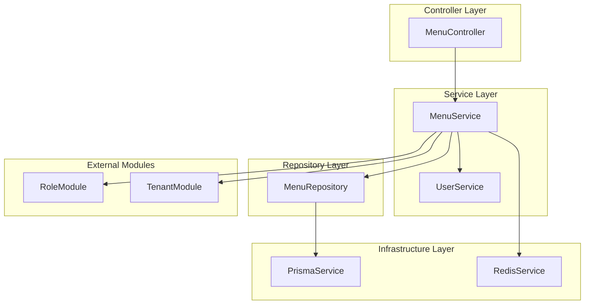
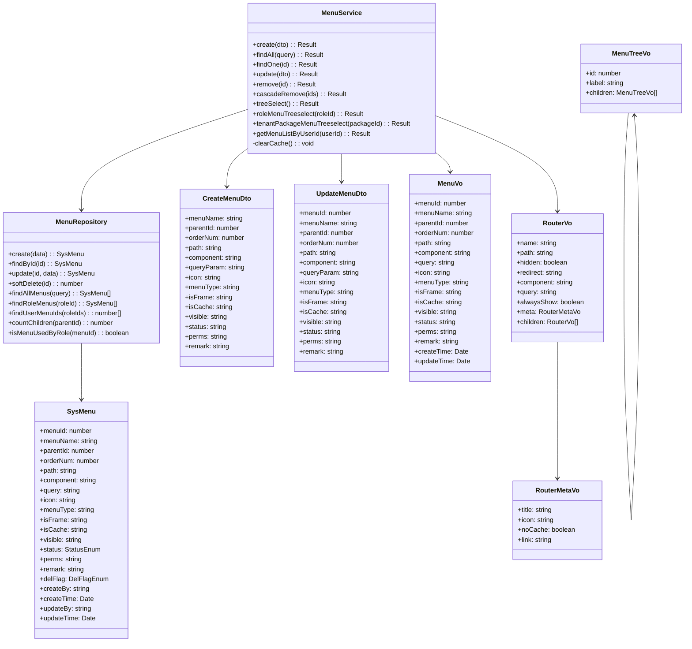
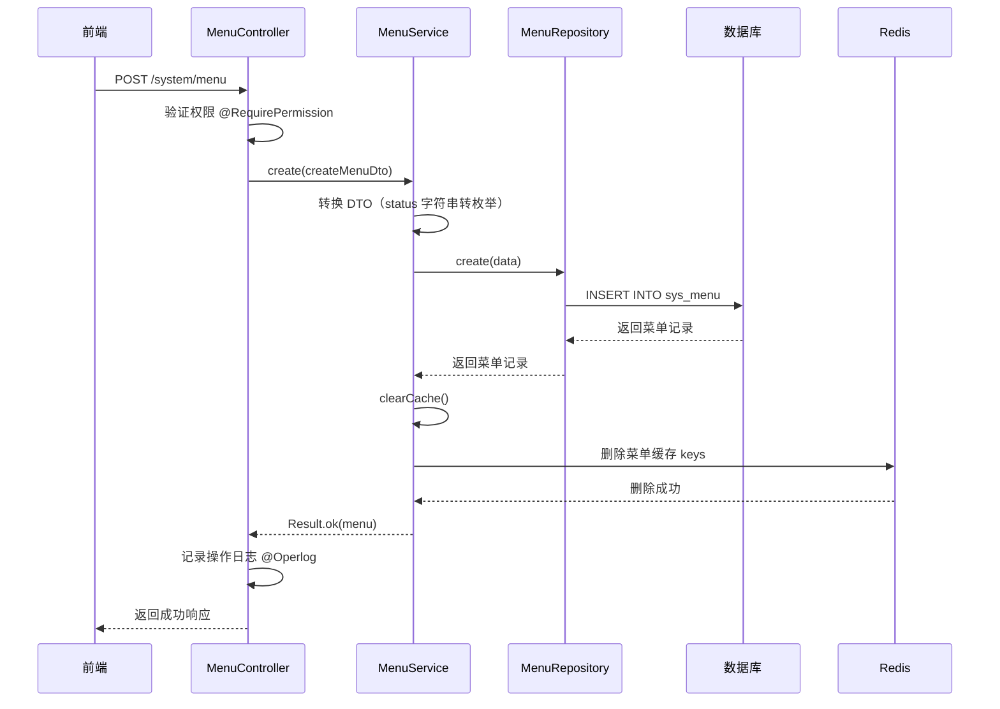
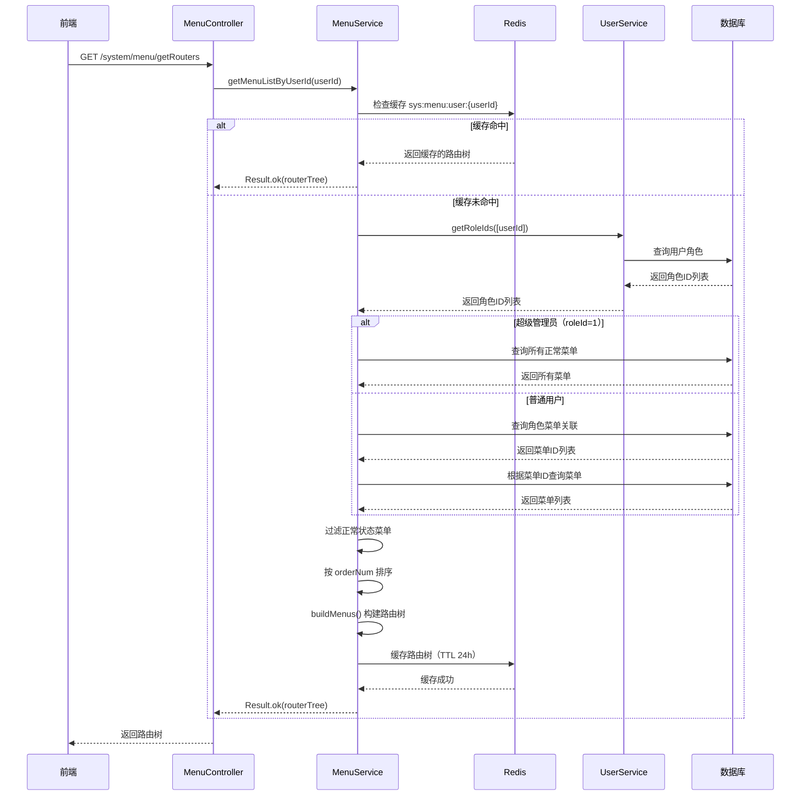
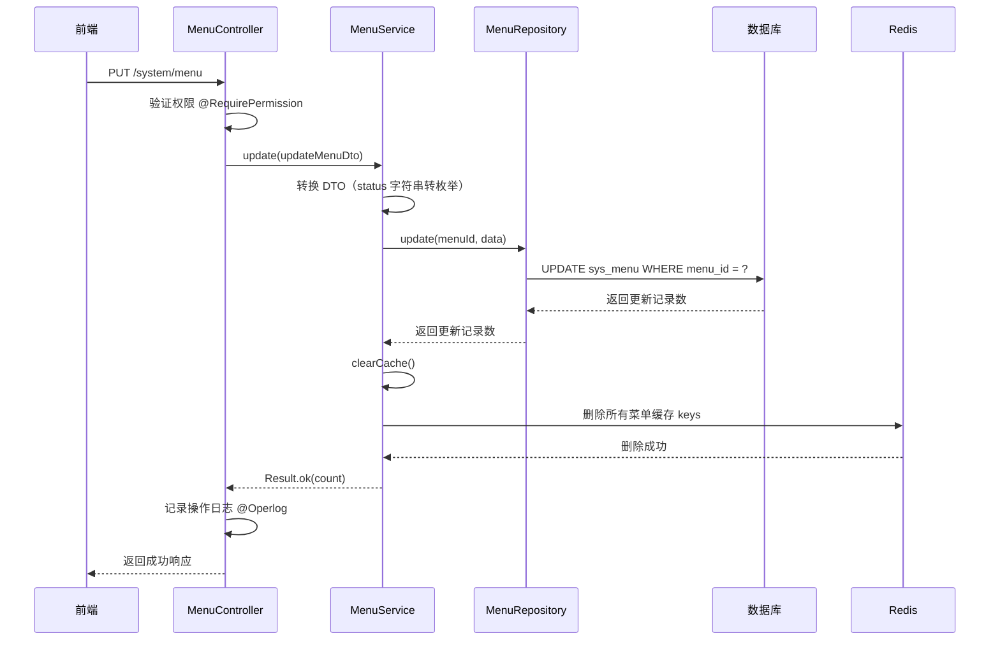
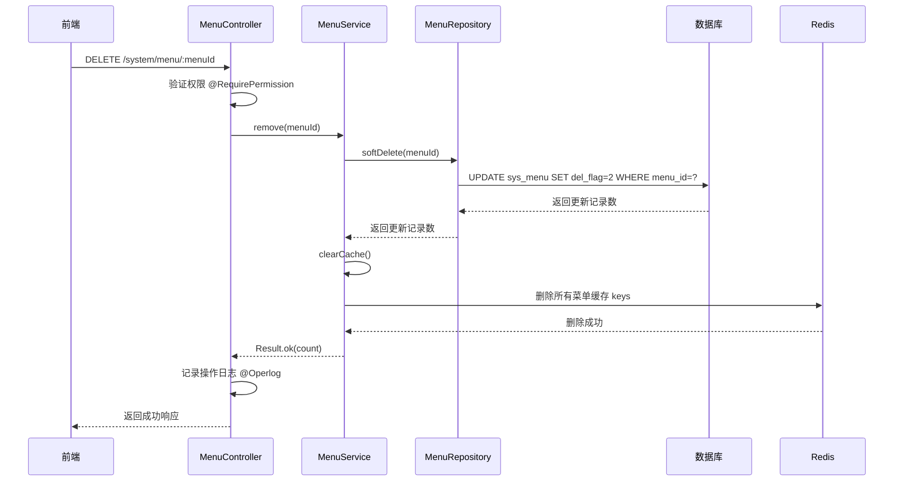
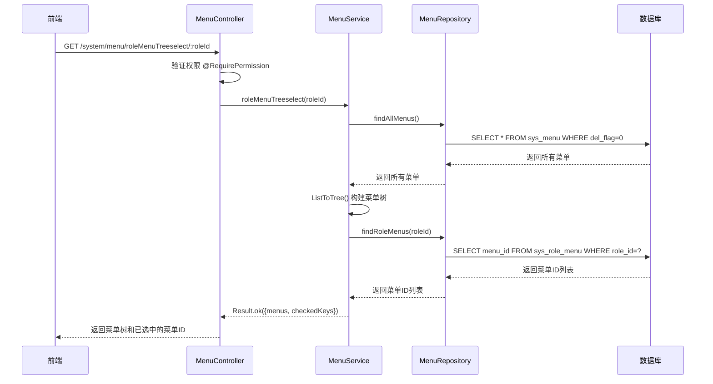
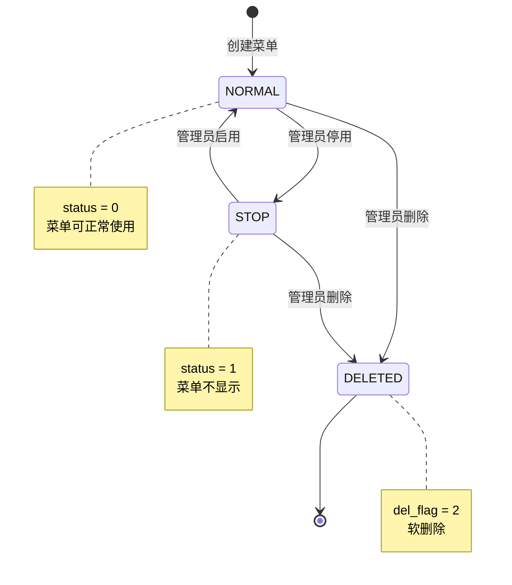
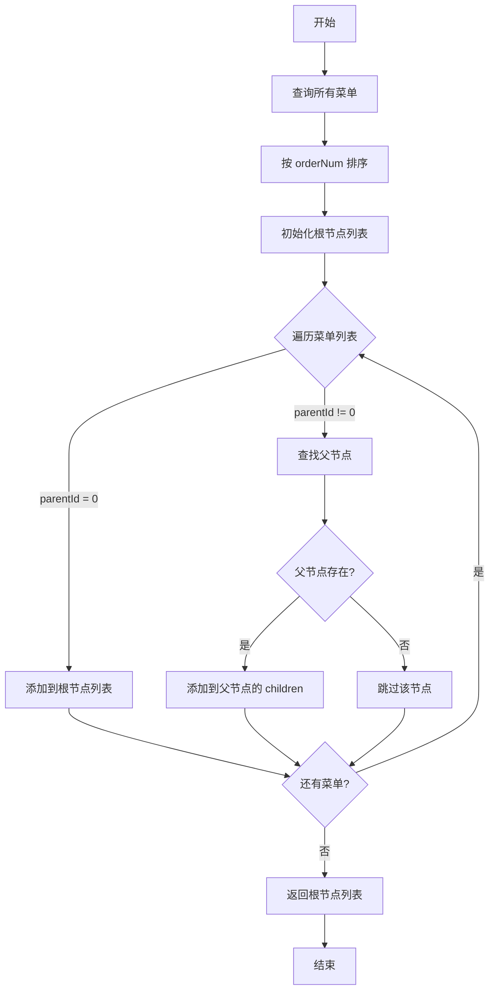
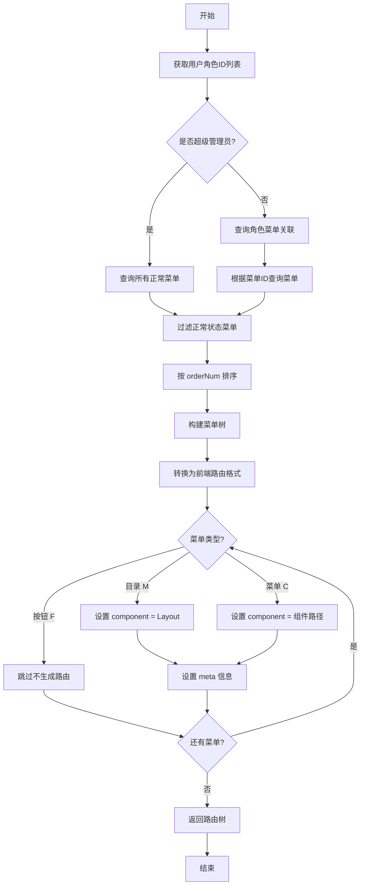

# 菜单管理模块 (System Menu) — 设计文档

> 版本：1.0  
> 日期：2026-02-22  
> 状态：草案  
> 关联需求：[menu-requirements.md](../../../requirements/admin/system/menu-requirements.md)

---

## 1. 概述

### 1.1 设计目标

菜单管理模块是后台管理系统 RBAC 权限体系的核心模块，负责菜单的全生命周期管理和前端路由生成。本设计文档旨在：

- 定义菜单管理的技术架构和模块划分
- 规范菜单数据模型和接口约定
- 明确菜单树形结构的构建和维护逻辑
- 优化菜单路由生成和缓存策略
- 为后续扩展（如菜单国际化、菜单模板）预留接口

### 1.2 设计约束

- 使用 NestJS 框架，遵循项目后端开发规范
- 使用 Prisma ORM 进行数据库操作
- 使用 Redis 缓存用户路由，TTL 24 小时
- 菜单操作使用软删除，不物理删除数据
- 所有菜单操作记录操作日志

### 1.3 技术栈

| 技术            | 版本   | 用途     |
| --------------- | ------ | -------- |
| NestJS          | 10.x   | 后端框架 |
| Prisma          | 5.x    | ORM 框架 |
| Redis           | 7.x    | 缓存     |
| TypeScript      | 5.x    | 编程语言 |
| class-validator | 0.14.x | DTO 验证 |

---

## 2. 架构与模块

### 2.1 模块划分

> 图 1：菜单管理模块组件图



### 2.2 目录结构

```
src/module/admin/system/menu/
├── dto/
│   ├── create-menu.dto.ts          # 创建菜单 DTO
│   ├── update-menu.dto.ts          # 更新菜单 DTO
│   ├── list-menu.dto.ts            # 查询菜单列表 DTO
│   └── index.ts                    # DTO 导出
├── vo/
│   └── menu.vo.ts                  # 菜单 VO（包含 RouterVo）
├── utils/
│   └── index.ts                    # 工具函数（buildMenus）
├── menu.controller.ts              # 菜单控制器
├── menu.service.ts                 # 菜单服务
├── menu.repository.ts              # 菜单仓储
└── menu.module.ts                  # 菜单模块
```

---

## 3. 领域/数据模型

### 3.1 菜单实体类图

> 图 2：菜单实体类图



### 3.2 数据库表结构

```sql
CREATE TABLE sys_menu (
  menu_id       BIGINT AUTO_INCREMENT PRIMARY KEY COMMENT '菜单ID',
  menu_name     VARCHAR(50) NOT NULL COMMENT '菜单名称',
  parent_id     BIGINT DEFAULT 0 COMMENT '父菜单ID',
  order_num     INT DEFAULT 0 COMMENT '显示顺序',
  path          VARCHAR(200) DEFAULT '' COMMENT '路由地址',
  component     VARCHAR(255) DEFAULT NULL COMMENT '组件路径',
  query         VARCHAR(200) DEFAULT NULL COMMENT '路由参数',
  icon          VARCHAR(100) DEFAULT '#' COMMENT '菜单图标',
  menu_type     CHAR(1) DEFAULT '' COMMENT '菜单类型（M目录 C菜单 F按钮）',
  is_frame      CHAR(1) DEFAULT '1' COMMENT '是否为外链（0是 1否）',
  is_cache      CHAR(1) DEFAULT '0' COMMENT '是否缓存（0缓存 1不缓存）',
  visible       CHAR(1) DEFAULT '0' COMMENT '显示状态（0显示 1隐藏）',
  status        CHAR(1) DEFAULT '0' COMMENT '菜单状态（0正常 1停用）',
  perms         VARCHAR(100) DEFAULT NULL COMMENT '权限标识',
  remark        VARCHAR(500) DEFAULT NULL COMMENT '备注',
  del_flag      CHAR(1) DEFAULT '0' COMMENT '删除标志（0正常 2删除）',
  create_by     VARCHAR(64) DEFAULT '' COMMENT '创建者',
  create_time   DATETIME DEFAULT CURRENT_TIMESTAMP COMMENT '创建时间',
  update_by     VARCHAR(64) DEFAULT '' COMMENT '更新者',
  update_time   DATETIME DEFAULT CURRENT_TIMESTAMP ON UPDATE CURRENT_TIMESTAMP COMMENT '更新时间',
  INDEX idx_parent_id (parent_id),
  INDEX idx_status (status),
  INDEX idx_del_flag (del_flag)
) COMMENT='菜单权限表';
```

### 3.3 关联表

```sql
-- 角色菜单关联表
CREATE TABLE sys_role_menu (
  role_id BIGINT NOT NULL COMMENT '角色ID',
  menu_id BIGINT NOT NULL COMMENT '菜单ID',
  PRIMARY KEY (role_id, menu_id),
  INDEX idx_role_id (role_id),
  INDEX idx_menu_id (menu_id)
) COMMENT='角色和菜单关联表';

-- 租户套餐菜单关联（存储在 sys_tenant_package.menu_ids 字段）
```

---

## 4. 核心流程时序

### 4.1 创建菜单时序

> 图 3：创建菜单时序图



### 4.2 获取用户路由时序

> 图 4：获取用户路由时序图



### 4.3 修改菜单时序

> 图 5：修改菜单时序图



### 4.4 删除菜单时序

> 图 6：删除菜单时序图



### 4.5 获取角色菜单树时序

> 图 7：获取角色菜单树时序图



---

## 5. 状态与流程

### 5.1 菜单状态机

> 图 8：菜单状态机



### 5.2 菜单树构建流程

> 图 9：菜单树构建活动图



### 5.3 用户路由生成流程

> 图 10：用户路由生成活动图



---

## 6. 接口/数据约定

### 6.1 MenuService 接口

```typescript
interface MenuService {
  /**
   * 创建菜单
   * @param createMenuDto 创建菜单 DTO
   * @returns 创建的菜单信息
   */
  create(createMenuDto: CreateMenuDto): Promise<Result>;

  /**
   * 查询菜单列表
   * @param query 查询条件
   * @returns 菜单列表
   */
  findAll(query: ListMenuDto): Promise<Result>;

  /**
   * 查询菜单详情
   * @param menuId 菜单ID
   * @returns 菜单详情
   */
  findOne(menuId: number): Promise<Result>;

  /**
   * 修改菜单
   * @param updateMenuDto 修改菜单 DTO
   * @returns 修改结果
   */
  update(updateMenuDto: UpdateMenuDto): Promise<Result>;

  /**
   * 删除菜单
   * @param menuId 菜单ID
   * @returns 删除结果
   */
  remove(menuId: number): Promise<Result>;

  /**
   * 级联删除菜单
   * @param menuIds 菜单ID列表
   * @returns 删除结果
   */
  cascadeRemove(menuIds: number[]): Promise<Result>;

  /**
   * 获取菜单树
   * @returns 菜单树
   */
  treeSelect(): Promise<Result>;

  /**
   * 获取角色菜单树
   * @param roleId 角色ID
   * @returns 菜单树和已选中的菜单ID
   */
  roleMenuTreeselect(roleId: number): Promise<Result>;

  /**
   * 获取租户套餐菜单树
   * @param packageId 套餐ID
   * @returns 菜单树和已选中的菜单ID
   */
  tenantPackageMenuTreeselect(packageId: number): Promise<Result>;

  /**
   * 获取用户路由
   * @param userId 用户ID
   * @returns 用户路由树
   */
  getMenuListByUserId(userId: number): Promise<Result>;
}
```

### 6.2 MenuRepository 接口

```typescript
interface MenuRepository {
  /**
   * 创建菜单
   */
  create(data: Prisma.SysMenuCreateInput): Promise<SysMenu>;

  /**
   * 根据ID查询菜单
   */
  findById(menuId: number): Promise<SysMenu | null>;

  /**
   * 更新菜单
   */
  update(menuId: number, data: Prisma.SysMenuUpdateInput): Promise<SysMenu>;

  /**
   * 软删除菜单
   */
  softDelete(menuId: number): Promise<number>;

  /**
   * 查询所有菜单
   */
  findAllMenus(query?: ListMenuDto): Promise<SysMenu[]>;

  /**
   * 查询角色菜单
   */
  findRoleMenus(roleId: number): Promise<SysMenu[]>;

  /**
   * 查询用户菜单ID
   */
  findUserMenuIds(roleIds: number[]): Promise<number[]>;

  /**
   * 统计子菜单数量
   */
  countChildren(parentId: number): Promise<number>;

  /**
   * 检查菜单是否被角色使用
   */
  isMenuUsedByRole(menuId: number): Promise<boolean>;
}
```

### 6.3 DTO 定义

```typescript
// 创建菜单 DTO
class CreateMenuDto {
  menuName: string; // 菜单名称（必填，0-50 字符）
  parentId: number; // 父菜单ID（必填，0表示顶级菜单）
  orderNum?: number; // 显示顺序（可选）
  path?: string; // 路由地址（可选，0-200 字符）
  component?: string; // 组件路径（可选，0-255 字符）
  queryParam?: string; // 路由参数（可选，0-200 字符）
  icon?: string; // 菜单图标（可选，0-100 字符）
  menuType?: string; // 菜单类型（可选，M=目录 C=菜单 F=按钮）
  isFrame: string; // 是否外链（必填，0=是 1=否）
  isCache?: string; // 是否缓存（可选，0=缓存 1=不缓存）
  visible?: string; // 显示状态（可选，0=显示 1=隐藏）
  status?: string; // 菜单状态（可选，0=正常 1=停用）
  perms?: string; // 权限标识（可选，0-100 字符）
  remark?: string; // 备注（可选，0-500 字符）
}

// 更新菜单 DTO
class UpdateMenuDto extends CreateMenuDto {
  menuId: number; // 菜单ID（必填）
}

// 查询菜单列表 DTO
class ListMenuDto {
  menuName?: string; // 菜单名称（可选，模糊查询）
  status?: string; // 菜单状态（可选）
}
```

### 6.4 VO 定义

```typescript
// 菜单 VO
class MenuVo {
  menuId: number;
  menuName: string;
  parentId: number;
  orderNum: number;
  path: string;
  component: string;
  query: string;
  icon: string;
  menuType: string;
  isFrame: string;
  isCache: string;
  visible: string;
  status: string;
  perms: string;
  remark: string;
  createTime: Date;
  updateTime: Date;
}

// 路由 VO
class RouterVo {
  name: string; // 路由名字
  path: string; // 路由地址
  hidden: boolean; // 是否隐藏
  redirect?: string; // 重定向地址
  component: string; // 组件地址
  query?: string; // 路由参数
  alwaysShow?: boolean; // 是否总是显示
  meta: RouterMetaVo; // 路由元信息
  children?: RouterVo[]; // 子路由
}

// 路由元信息 VO
class RouterMetaVo {
  title: string; // 路由标题
  icon: string; // 路由图标
  noCache: boolean; // 是否缓存
  link?: string; // 内链地址
}

// 菜单树 VO
class MenuTreeVo {
  id: number; // 菜单ID
  label: string; // 菜单名称
  children?: MenuTreeVo[]; // 子菜单
}
```

---

## 7. 安全设计

### 7.1 权限控制

| 操作         | 权限标识           | 说明                 |
| ------------ | ------------------ | -------------------- |
| 创建菜单     | system:menu:add    | 创建新菜单           |
| 查询菜单列表 | system:menu:list   | 查询菜单列表         |
| 查看菜单详情 | system:menu:query  | 查看菜单详细信息     |
| 修改菜单     | system:menu:edit   | 修改菜单信息         |
| 删除菜单     | system:menu:remove | 删除菜单             |
| 获取用户路由 | 无需权限           | 所有登录用户均可访问 |

### 7.2 数据验证

| 字段      | 验证规则              |
| --------- | --------------------- |
| menuName  | 必填，0-50 字符       |
| parentId  | 必填，数字            |
| path      | 可选，0-200 字符      |
| component | 可选，0-255 字符      |
| icon      | 可选，0-100 字符      |
| menuType  | 可选，枚举值（M/C/F） |
| isFrame   | 必填，枚举值（0/1）   |
| isCache   | 可选，枚举值（0/1）   |
| visible   | 可选，枚举值（0/1）   |
| status    | 可选，枚举值（0/1）   |
| perms     | 可选，0-100 字符      |
| remark    | 可选，0-500 字符      |

### 7.3 操作日志

所有菜单操作（创建、修改、删除）均使用 `@Operlog` 装饰器记录操作日志，包含：

- 操作人
- 操作时间
- 操作类型（INSERT/UPDATE/DELETE）
- 操作内容（菜单ID、菜单名称）
- 操作结果（成功/失败）

---

## 8. 性能优化

### 8.1 缓存策略

| 缓存项   | 缓存键                 | TTL     | 说明             |
| -------- | ---------------------- | ------- | ---------------- |
| 用户路由 | sys:menu:user:{userId} | 24 小时 | 用户的路由菜单树 |

**缓存更新策略**：

- 创建菜单：清除所有菜单缓存
- 修改菜单：清除所有菜单缓存
- 删除菜单：清除所有菜单缓存
- 分配角色菜单：清除相关用户的路由缓存

### 8.2 查询优化

| 优化项       | 优化方式                                |
| ------------ | --------------------------------------- |
| 菜单列表查询 | 使用索引（parent_id, status, del_flag） |
| 角色菜单查询 | 使用索引（role_id, menu_id）            |
| 用户路由查询 | 使用 Redis 缓存，减少数据库查询         |
| 菜单树构建   | 一次性查询所有菜单，内存中构建树        |

### 8.3 性能指标

| 接口         | P95 延迟目标   | 说明                     |
| ------------ | -------------- | ------------------------ |
| 创建菜单     | 小于等于 300ms | 包含数据库写入和缓存清除 |
| 查询菜单列表 | 小于等于 200ms | 包含数据库查询           |
| 查看菜单详情 | 小于等于 100ms | 单条记录查询             |
| 修改菜单     | 小于等于 300ms | 包含数据库更新和缓存清除 |
| 删除菜单     | 小于等于 300ms | 包含数据库更新和缓存清除 |
| 获取用户路由 | 小于等于 300ms | 包含缓存查询和数据库查询 |

---

## 9. 实施计划

### 9.1 阶段一：核心功能完善（当前）

| 任务             | 状态      | 说明                                   |
| ---------------- | --------- | -------------------------------------- |
| 菜单 CRUD 操作   | ✅ 已完成 | 创建、查询、修改、删除                 |
| 菜单树形结构维护 | ✅ 已完成 | 获取菜单树、角色菜单树、租户套餐菜单树 |
| 用户路由生成     | ✅ 已完成 | 根据用户角色生成前端路由               |
| 菜单缓存管理     | ✅ 已完成 | Redis 缓存用户路由                     |
| 操作日志记录     | ✅ 已完成 | 使用 @Operlog 装饰器                   |

### 9.2 阶段二：功能优化（1-2 个迭代）

| 任务               | 优先级 | 工作量 | 说明                     |
| ------------------ | ------ | ------ | ------------------------ |
| 删除前检查子菜单   | P1     | 1 天   | 删除前检查是否存在子菜单 |
| 实现菜单拖拽排序   | P2     | 3 天   | 支持拖拽调整菜单顺序     |
| 实现菜单图标选择器 | P2     | 2 天   | 提供图标选择界面         |

### 9.3 阶段三：扩展功能（3-6 个月）

| 任务                 | 优先级 | 工作量 | 说明                         |
| -------------------- | ------ | ------ | ---------------------------- |
| 实现权限标识自动生成 | P3     | 2 天   | 根据菜单路径自动生成权限标识 |
| 实现菜单使用情况统计 | P3     | 3 天   | 统计菜单被哪些角色使用       |
| 实现菜单国际化       | P3     | 5 天   | 支持多语言菜单名称           |

---

## 10. 测试策略

### 10.1 单元测试

| 测试项         | 测试内容                           |
| -------------- | ---------------------------------- |
| MenuService    | 创建、查询、修改、删除菜单         |
| MenuRepository | 数据库操作（CRUD、查询角色菜单等） |
| buildMenus     | 菜单树构建逻辑                     |
| ListToTree     | 通用树形结构构建逻辑               |

### 10.2 集成测试

| 测试项       | 测试内容                           |
| ------------ | ---------------------------------- |
| 创建菜单     | 创建菜单并验证数据库记录           |
| 修改菜单     | 修改菜单并验证缓存清除             |
| 删除菜单     | 删除菜单并验证软删除               |
| 获取用户路由 | 验证超级管理员和普通用户的路由生成 |
| 角色菜单树   | 验证角色菜单树和已选中的菜单ID     |

### 10.3 性能测试

| 测试项       | 测试内容                           |
| ------------ | ---------------------------------- |
| 菜单列表查询 | 验证 P95 延迟小于等于 200ms        |
| 用户路由查询 | 验证 P95 延迟小于等于 300ms        |
| 缓存命中率   | 验证用户路由缓存命中率大于等于 90% |

---

## 11. 监控与告警

### 11.1 监控指标

| 指标          | 说明                   | 告警阈值   |
| ------------- | ---------------------- | ---------- |
| 接口 QPS      | 每秒请求数             | 大于 100   |
| 接口 P95 延迟 | 95% 请求的响应时间     | 大于 500ms |
| 接口错误率    | 请求失败比例           | 大于 1%    |
| 缓存命中率    | Redis 缓存命中比例     | 小于 80%   |
| 数据库慢查询  | 查询时间大于 1s 的 SQL | 出现慢查询 |

### 11.2 日志记录

| 日志级别 | 记录内容                     |
| -------- | ---------------------------- |
| INFO     | 菜单创建、修改、删除操作     |
| WARN     | 缓存清除失败、数据库查询慢   |
| ERROR    | 数据库操作失败、缓存操作失败 |

---

## 12. 扩展性设计

### 12.1 菜单国际化

**设计思路**：

- 新增 `sys_menu_i18n` 表，存储菜单的多语言名称
- 菜单查询时根据用户语言偏好返回对应语言的菜单名称
- 兼容现有菜单数据，默认使用 `menu_name` 字段

**表结构**：

```sql
CREATE TABLE sys_menu_i18n (
  id          BIGINT AUTO_INCREMENT PRIMARY KEY,
  menu_id     BIGINT NOT NULL COMMENT '菜单ID',
  lang        VARCHAR(10) NOT NULL COMMENT '语言代码（zh-CN, en-US）',
  menu_name   VARCHAR(50) NOT NULL COMMENT '菜单名称',
  create_time DATETIME DEFAULT CURRENT_TIMESTAMP,
  update_time DATETIME DEFAULT CURRENT_TIMESTAMP ON UPDATE CURRENT_TIMESTAMP,
  UNIQUE KEY uk_menu_lang (menu_id, lang),
  INDEX idx_menu_id (menu_id)
) COMMENT='菜单国际化表';
```

### 12.2 菜单模板管理

**设计思路**：

- 新增 `sys_menu_template` 表，存储预定义的菜单模板
- 提供菜单模板导入接口，快速创建常用菜单
- 支持自定义菜单模板

**表结构**：

```sql
CREATE TABLE sys_menu_template (
  id            BIGINT AUTO_INCREMENT PRIMARY KEY,
  template_name VARCHAR(50) NOT NULL COMMENT '模板名称',
  template_desc VARCHAR(200) COMMENT '模板描述',
  menu_data     JSON NOT NULL COMMENT '菜单数据（JSON 格式）',
  create_time   DATETIME DEFAULT CURRENT_TIMESTAMP,
  update_time   DATETIME DEFAULT CURRENT_TIMESTAMP ON UPDATE CURRENT_TIMESTAMP,
  INDEX idx_template_name (template_name)
) COMMENT='菜单模板表';
```

### 12.3 菜单访问统计

**设计思路**：

- 新增 `sys_menu_access_log` 表，记录菜单访问日志
- 提供菜单访问统计接口，分析菜单使用情况
- 支持按时间范围、用户、部门等维度统计

**表结构**：

```sql
CREATE TABLE sys_menu_access_log (
  id          BIGINT AUTO_INCREMENT PRIMARY KEY,
  menu_id     BIGINT NOT NULL COMMENT '菜单ID',
  user_id     BIGINT NOT NULL COMMENT '用户ID',
  access_time DATETIME DEFAULT CURRENT_TIMESTAMP COMMENT '访问时间',
  INDEX idx_menu_id (menu_id),
  INDEX idx_user_id (user_id),
  INDEX idx_access_time (access_time)
) COMMENT='菜单访问日志表';
```

---

## 13. 风险评估

### 13.1 技术风险

| 风险         | 影响     | 概率 | 应对措施                    |
| ------------ | -------- | ---- | --------------------------- |
| 缓存失效     | 性能下降 | 低   | 使用 Redis 持久化，定期备份 |
| 数据库慢查询 | 性能下降 | 中   | 优化索引，使用缓存          |
| 菜单树构建慢 | 性能下降 | 低   | 优化算法，使用缓存          |

### 13.2 业务风险

| 风险           | 影响       | 概率 | 应对措施                     |
| -------------- | ---------- | ---- | ---------------------------- |
| 菜单误删       | 数据丢失   | 中   | 使用软删除，提供恢复功能     |
| 权限配置错误   | 安全风险   | 中   | 提供权限检查工具，定期审计   |
| 菜单树结构混乱 | 用户体验差 | 低   | 提供菜单树校验工具，定期检查 |

---

## 14. 附录

### 14.1 相关文档

- [菜单管理模块需求文档](../../../requirements/admin/system/menu-requirements.md)
- [角色管理模块设计文档](./role-design.md)
- [用户管理模块设计文档](./user-design.md)
- [后端开发规范](../../../../../.kiro/steering/backend-nestjs.md)

### 14.2 参考资料

- [NestJS 官方文档](https://docs.nestjs.com/)
- [Prisma 官方文档](https://www.prisma.io/docs/)
- [Redis 缓存最佳实践](https://redis.io/docs/manual/patterns/)
- [RBAC 权限模型](https://en.wikipedia.org/wiki/Role-based_access_control)

### 14.3 术语表

| 术语     | 说明                                     |
| -------- | ---------------------------------------- |
| 菜单     | 系统中的导航菜单项                       |
| 目录     | 一级菜单，用于分组，不对应具体页面       |
| 菜单     | 二级或三级菜单，对应具体页面             |
| 按钮     | 页面内的操作按钮，对应具体权限           |
| 路由     | 前端路由，用于页面跳转                   |
| 权限标识 | 用于权限控制的字符串，如 system:menu:add |
| 软删除   | 标记为删除但不物理删除数据               |
| 级联删除 | 删除父节点时同时删除所有子节点           |
| 菜单树   | 树形结构的菜单列表                       |
| 路由树   | 树形结构的前端路由列表                   |
