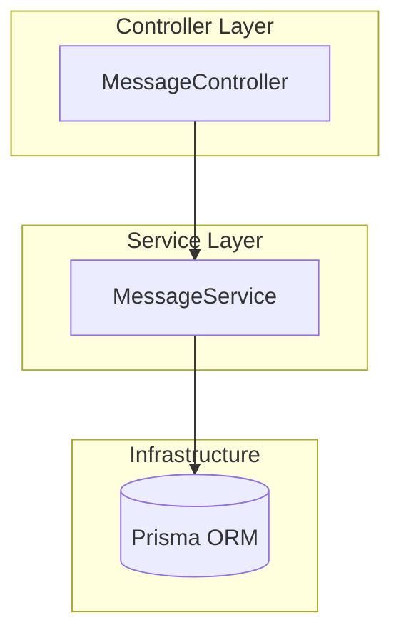
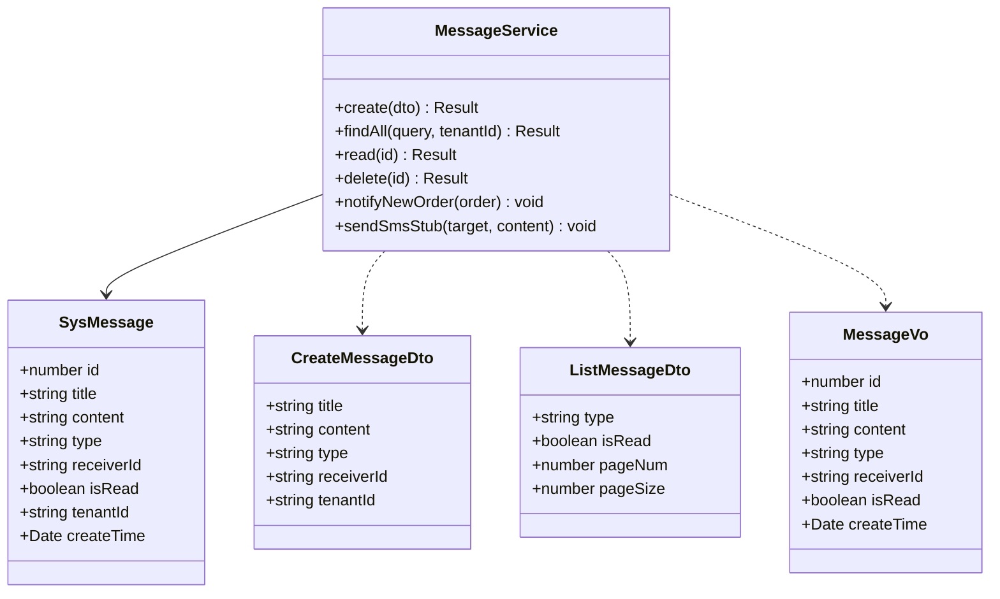
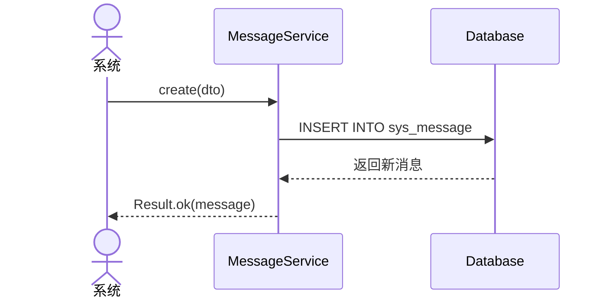
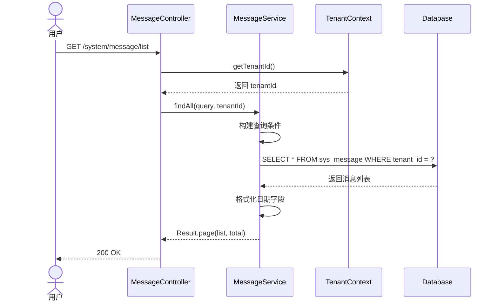
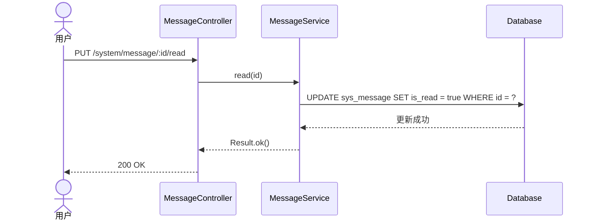
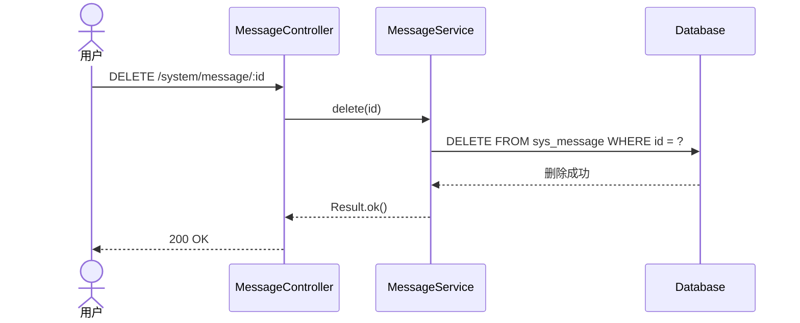
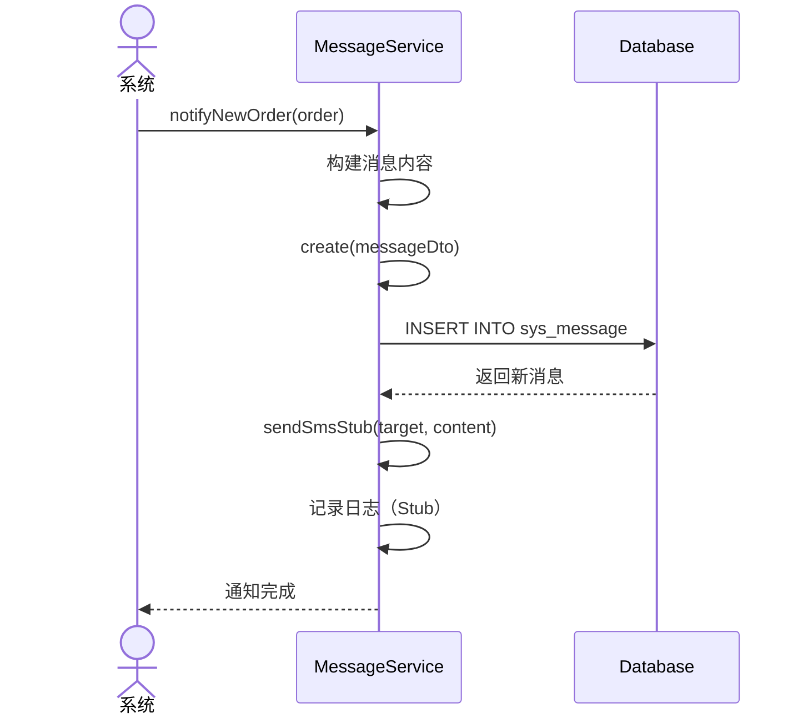
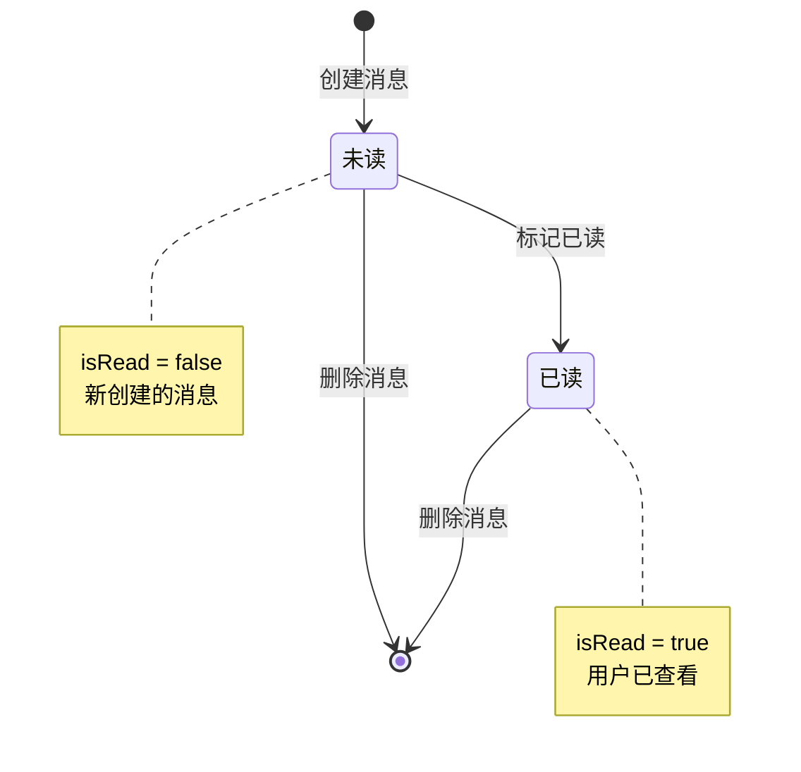
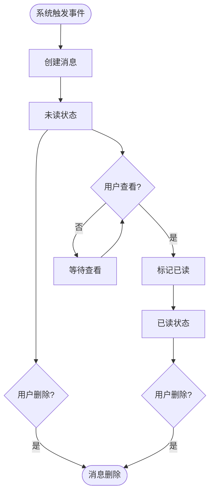

# 消息管理模块 — 设计文档

> 版本：1.0  
> 日期：2026-02-22  
> 状态：草案  
> 关联需求：[message-requirements.md](../../../requirements/admin/system/message-requirements.md)

---

## 1. 概述

### 1.1 设计目标

设计简单的站内消息系统，实现：

- 消息的创建、查询、标记已读、删除
- 按租户隔离消息数据
- 支持消息类型和已读状态筛选
- 为未来通知服务预留扩展接口

### 1.2 设计原则

- 简单优先：当前实现为基础站内消息功能
- 租户隔离：消息按租户隔离
- 扩展性：预留通知服务扩展接口
- 性能优先：使用索引优化查询

### 1.3 约束

- 当前仅支持站内消息
- 未实现短信、邮件、推送通知
- 消息为物理删除，不支持恢复
- 未实现消息模板功能

---

## 2. 架构与模块

### 2.1 模块组件图



### 2.2 目录结构

```
src/module/admin/system/message/
├── dto/
│   └── message.dto.ts             # 消息 DTO
├── vo/
│   └── message.vo.ts              # 消息 VO
├── message.controller.ts          # 控制器
├── message.service.ts             # 核心服务
└── message.module.ts              # 模块配置
```

### 2.3 租户隔离说明

**租户范围**：TenantScoped

- 查询消息时自动过滤 tenantId
- 创建消息时需指定 tenantId
- 标记已读和删除需验证消息归属（当前缺失）

---

## 3. 领域模型

### 3.1 类图



### 3.2 实体说明

**SysMessage**：消息实体

- id：主键，自增
- title：消息标题，最长 100 字符
- content：消息内容，文本类型
- type：消息类型（ORDER/SYSTEM/NOTICE）
- receiverId：接收人 ID
- isRead：是否已读，默认 false
- tenantId：租户 ID
- createTime：创建时间

---

## 4. 核心流程时序

### 4.1 发送消息



### 4.2 查询消息列表



### 4.3 标记已读



### 4.4 删除消息



### 4.5 新订单通知流程



---

## 5. 状态与流程

### 5.1 消息状态机



### 5.2 消息生命周期



---

## 6. 接口与数据约定

### 6.1 REST API 接口

| 方法   | 路径                     | 说明         | 权限                 |
| ------ | ------------------------ | ------------ | -------------------- |
| GET    | /system/message/list     | 查询消息列表 | 需登录（权限待补充） |
| POST   | /system/message          | 发送消息     | 系统内部调用         |
| PUT    | /system/message/:id/read | 标记已读     | 需登录               |
| DELETE | /system/message/:id      | 删除消息     | 需登录               |

### 6.2 数据库表结构

**sys_message 表**：

```sql
CREATE TABLE sys_message (
  id INT PRIMARY KEY AUTO_INCREMENT,
  title VARCHAR(100) NOT NULL,
  content TEXT,
  type VARCHAR(50) NOT NULL,
  receiver_id VARCHAR(255) NOT NULL,
  is_read BOOLEAN DEFAULT FALSE,
  tenant_id VARCHAR(20) NOT NULL,
  create_time TIMESTAMP DEFAULT CURRENT_TIMESTAMP,

  INDEX idx_receiver_id (receiver_id),
  INDEX idx_tenant_id (tenant_id)
);
```

### 6.3 消息类型定义

| 类型   | 说明     | 使用场景             |
| ------ | -------- | -------------------- |
| ORDER  | 订单消息 | 新订单、订单状态变更 |
| SYSTEM | 系统消息 | 系统维护、功能更新   |
| NOTICE | 通知消息 | 业务通知、活动通知   |

---

## 7. 安全设计

### 7.1 权限控制

| 操作         | 权限代码            | 说明                   |
| ------------ | ------------------- | ---------------------- |
| 查询消息列表 | system:message:list | 查看消息列表（待补充） |
| 标记已读     | 需登录              | 标记消息为已读         |
| 删除消息     | 需登录              | 删除消息               |

### 7.2 租户隔离

- 查询消息时自动过滤 tenantId
- 创建消息时需指定 tenantId
- 标记已读和删除需验证消息归属（当前缺失，需补充）

### 7.3 数据访问控制

**当前缺陷**：

- 标记已读和删除未验证消息归属
- 用户可能操作其他用户的消息

**建议改进**：

```typescript
async read(id: number, currentTenantId: string) {
  const message = await this.prisma.sysMessage.findUnique({ where: { id } });
  if (!message || message.tenantId !== currentTenantId) {
    throw new BusinessException(ResponseCode.DATA_NOT_FOUND, '消息不存在');
  }
  await this.prisma.sysMessage.update({
    where: { id },
    data: { isRead: true }
  });
  return Result.ok();
}
```

---

## 8. 性能优化

### 8.1 索引使用

**已有索引**：

- receiver_id：用于按接收人查询
- tenant_id：用于按租户查询

**建议增加索引**：

- (tenant_id, is_read)：优化未读消息查询
- (tenant_id, type)：优化按类型筛选
- (tenant_id, create_time)：优化按时间排序

### 8.2 查询优化

**分页查询**：

- 使用 skip/take 分页
- 限制单页最大记录数（建议 100）
- 按 createTime 降序排列

**计数优化**：

- 使用 Prisma 的 count 方法
- 与查询在同一事务中执行

### 8.3 批量操作

**当前缺失**：

- 批量标记已读
- 批量删除

**建议实现**：

```typescript
async batchRead(ids: number[], tenantId: string) {
  await this.prisma.sysMessage.updateMany({
    where: {
      id: { in: ids },
      tenantId
    },
    data: { isRead: true }
  });
  return Result.ok();
}
```

---

## 9. 实现计划

### 9.1 第一阶段：核心功能（已完成）

- [x] 消息创建
- [x] 消息列表查询
- [x] 标记已读
- [x] 删除消息

### 9.2 第二阶段：缺陷修复（建议）

- [ ] 补充权限校验
- [ ] 增加消息归属验证
- [ ] 明确 receiverId 语义
- [ ] 实现批量操作
- [ ] 增加未读消息数量统计

### 9.3 第三阶段：功能增强（可选）

- [ ] 消息模板功能
- [ ] 消息推送功能（WebSocket）
- [ ] 短信通知集成
- [ ] 邮件通知集成
- [ ] 消息分类管理
- [ ] 消息优先级
- [ ] 消息过期自动清理

---

## 10. 测试策略

### 10.1 单元测试

**MessageService 测试**：

- create：正常创建、参数验证
- findAll：分页查询、条件筛选、租户隔离
- read：正常标记、消息不存在
- delete：正常删除、消息不存在
- notifyNewOrder：消息创建、短信发送（Stub）

### 10.2 集成测试

**端到端流程**：

1. 系统发送消息
2. 用户查询消息列表，验证消息存在
3. 用户标记消息已读
4. 再次查询，验证 isRead = true
5. 用户删除消息
6. 再次查询，验证消息不存在

**租户隔离测试**：

1. 租户 A 发送消息
2. 租户 B 查询，验证查询不到
3. 租户 A 查询，验证可以查询到

### 10.3 性能测试

**查询性能**：

- 1000 条消息：P99 < 200ms
- 10000 条消息：P99 < 500ms
- 100000 条消息：P99 < 1000ms

**并发测试**：

- 100 并发查询：QPS > 500
- 100 并发标记已读：QPS > 1000

---

## 11. 监控与运维

### 11.1 关键指标

| 指标         | 阈值    | 说明           |
| ------------ | ------- | -------------- |
| 消息查询延迟 | < 500ms | P99 延迟       |
| 消息发送延迟 | < 200ms | P99 延迟       |
| 未读消息数量 | < 1000  | 单用户未读消息 |
| 消息总数     | < 100万 | 单租户消息总数 |

### 11.2 日志记录

**操作日志**：

- 发送消息：记录 title、type、receiverId、tenantId
- 标记已读：记录 id、操作人
- 删除消息：记录 id、操作人

**错误日志**：

- 消息发送失败：记录异常信息、消息内容
- 查询异常：记录查询条件、异常信息

### 11.3 告警规则

| 告警项           | 条件         | 级别 | 处理建议         |
| ---------------- | ------------ | ---- | ---------------- |
| 消息查询延迟高   | P99 > 1000ms | P1   | 检查数据库索引   |
| 未读消息过多     | > 1000       | P2   | 提醒用户清理消息 |
| 消息总数过多     | > 100万      | P1   | 考虑归档或清理   |
| 消息发送失败率高 | > 5%         | P0   | 检查数据库连接   |

---

## 12. 可扩展性设计

### 12.1 通知服务抽离

**需求**：将消息功能扩展为完整的通知服务，支持多渠道通知。

**设计**：

- 新增 NotificationService 通用通知服务
- 支持多渠道：站内信、短信、邮件、推送、微信模板消息
- 统一接口：`notify(target, channel, template, params)`
- 支持异步队列发送、发送记录、失败重试

**架构**：

```
NotificationService
├── InAppChannel (站内信)
├── SmsChannel (短信)
├── EmailChannel (邮件)
├── PushChannel (APP 推送)
└── WechatTemplateChannel (微信模板消息)
```

### 12.2 消息模板功能

**需求**：支持消息模板，统一管理消息格式。

**设计**：

- 新增 sys_message_template 表
- 字段：templateCode、title、content、type、variables
- 发送消息时使用模板 + 变量替换

### 12.3 消息推送功能

**需求**：实时推送消息给在线用户。

**设计**：

- 集成 WebSocket
- 用户登录时建立 WebSocket 连接
- 新消息创建时通过 WebSocket 推送
- 支持消息已读状态实时同步

### 12.4 消息分类管理

**需求**：支持消息分类，用户可按分类查看。

**设计**：

- 扩展 type 字段为分类 ID
- 新增 sys_message_category 表
- 支持多级分类
- 用户可订阅/取消订阅分类

---

## 13. 风险评估

### 13.1 技术风险

| 风险                | 概率 | 影响 | 缓解措施               |
| ------------------- | ---- | ---- | ---------------------- |
| 消息归属验证缺失    | 高   | 高   | 补充归属验证逻辑       |
| 权限校验缺失        | 高   | 高   | 补充权限装饰器         |
| receiverId 语义不清 | 中   | 中   | 明确定义或增加类型字段 |
| 消息数量过多        | 中   | 中   | 实现自动清理机制       |
| 查询性能下降        | 低   | 中   | 增加索引，优化查询     |

### 13.2 业务风险

| 风险         | 概率 | 影响 | 缓解措施                 |
| ------------ | ---- | ---- | ------------------------ |
| 消息误删     | 中   | 中   | 改为软删除，支持恢复     |
| 消息泄露     | 低   | 高   | 严格的租户隔离和归属验证 |
| 消息发送失败 | 低   | 中   | 增加重试机制和失败记录   |

---

## 14. 附录

### 14.1 相关文档

- [需求文档](../../../requirements/admin/system/message-requirements.md)
- [后端开发规范](../../../../../../.kiro/steering/backend-nestjs.md)
- [文档规范](../../../../../../.kiro/steering/documentation.md)

### 14.2 参考资料

- [NestJS 官方文档](https://docs.nestjs.com/)
- [Prisma 官方文档](https://www.prisma.io/docs)
- [WebSocket 最佳实践](https://socket.io/docs/v4/)

### 14.3 术语表

| 术语      | 说明                                 |
| --------- | ------------------------------------ |
| 站内消息  | 系统内部的消息通知，用户登录后可查看 |
| 消息类型  | 区分不同业务场景的消息分类           |
| 接收人 ID | 消息接收者的唯一标识                 |
| 已读状态  | 标识消息是否被用户查看               |
| 通知服务  | 支持多渠道的通用通知系统             |
| 消息模板  | 预定义的消息格式，支持变量替换       |

### 14.4 变更记录

| 版本 | 日期       | 变更内容 | 作者 |
| ---- | ---------- | -------- | ---- |
| 1.0  | 2026-02-22 | 初始版本 | Kiro |
