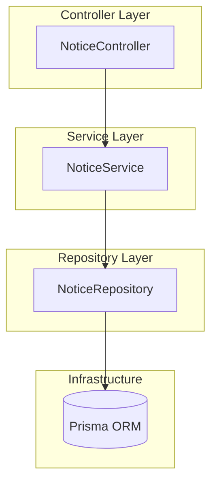
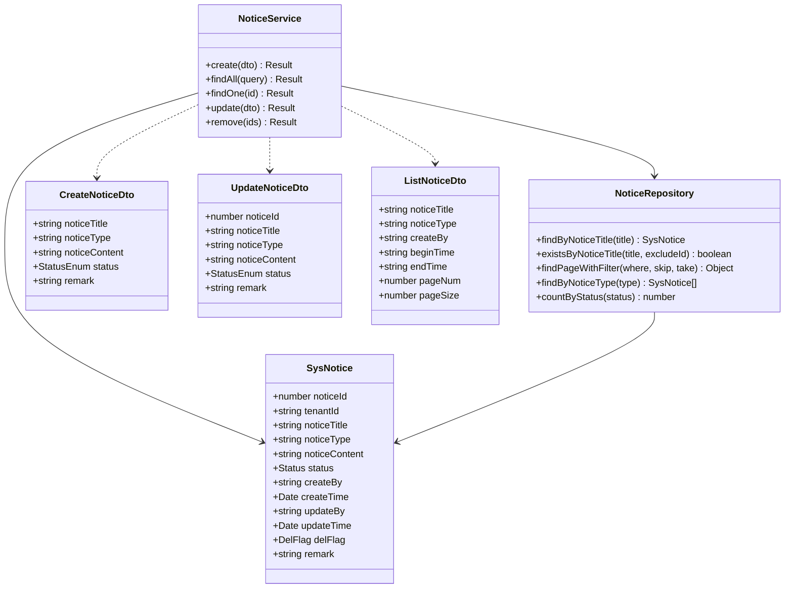
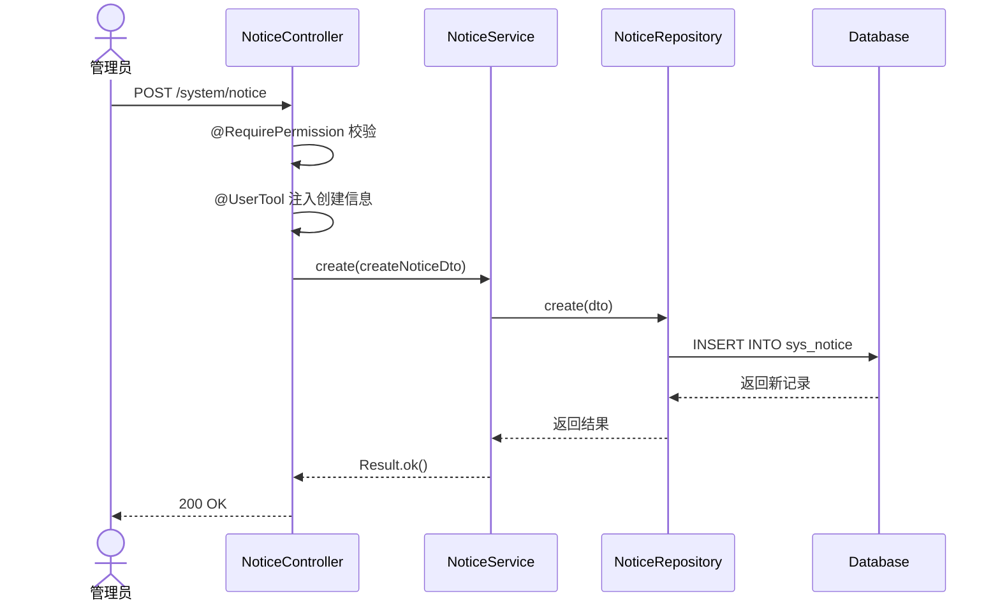
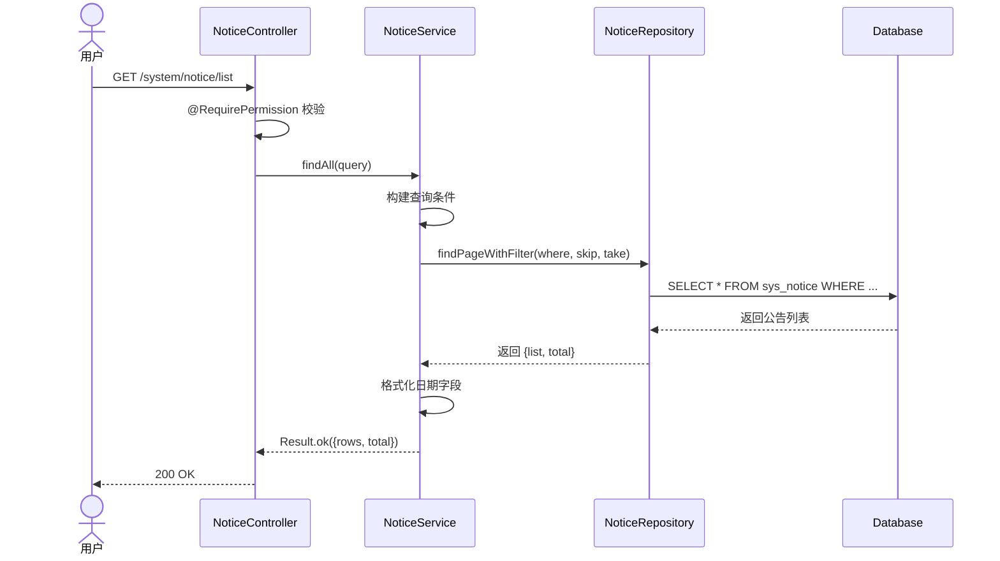
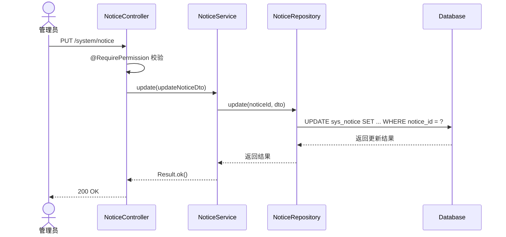
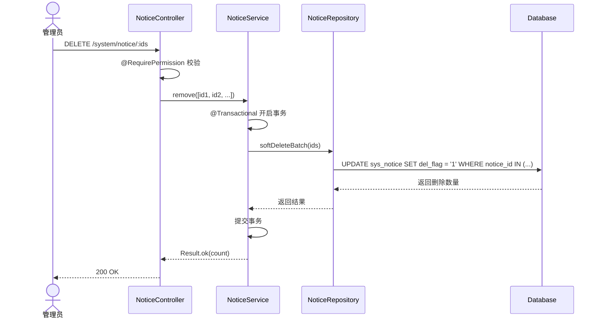
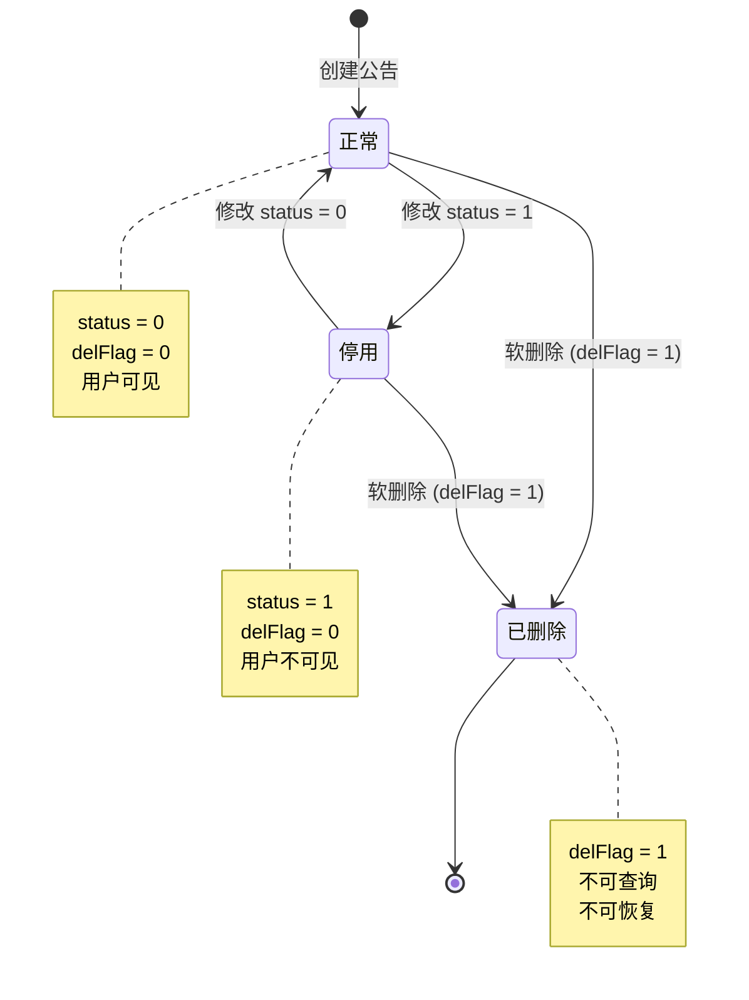
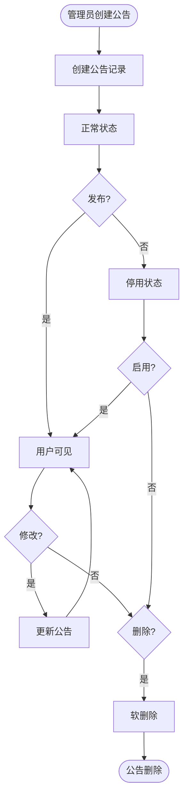

# 通知公告管理模块 — 设计文档

> 版本：1.0  
> 日期：2026-02-22  
> 状态：草案  
> 关联需求：[notice-requirements.md](../../../requirements/admin/system/notice-requirements.md)

---

## 1. 概述

### 1.1 设计目标

设计通知公告管理系统，实现：

- 公告的创建、修改、删除、查询
- 按租户隔离公告数据
- 支持公告类型和状态管理
- 支持分页查询和条件筛选

### 1.2 设计原则

- 租户隔离：通过 SoftDeleteRepository 自动过滤 tenantId
- 软删除优先：公告删除使用软删除
- 统一响应：使用 Result.ok() / Result.fail()
- 事务保证：批量操作使用事务

### 1.3 约束

- 公告标题最长 50 字符
- 公告内容为文本类型
- 当前未实现阅读统计和定时发布

---

## 2. 架构与模块

### 2.1 模块组件图



### 2.2 目录结构

```
src/module/admin/system/notice/
├── dto/
│   ├── create-notice.dto.ts       # 创建公告 DTO
│   ├── update-notice.dto.ts       # 更新公告 DTO
│   ├── list-notice.dto.ts         # 查询公告 DTO
│   └── index.ts
├── vo/
│   └── notice.vo.ts               # 公告 VO
├── notice.controller.ts           # 控制器
├── notice.service.ts              # 核心服务
├── notice.repository.ts           # 数据访问层
└── notice.module.ts               # 模块配置
```

### 2.3 租户隔离说明

**租户范围**：TenantScoped

- 所有接口按当前租户隔离数据
- 租户 ID 来自请求头 `tenant-id` 或登录态
- Repository 继承 SoftDeleteRepository，自动过滤 tenantId

---

## 3. 领域模型

### 3.1 类图



### 3.2 实体说明

**SysNotice**：通知公告实体

- noticeId：主键，自增
- tenantId：租户 ID，默认 '000000'
- noticeTitle：公告标题，最长 50 字符
- noticeType：公告类型（1=通知，2=公告）
- noticeContent：公告内容，文本类型
- status：状态（0=正常，1=停用）
- delFlag：删除标识（0=正常，1=删除）

---

## 4. 核心流程时序

### 4.1 创建公告



### 4.2 查询公告列表



### 4.3 修改公告



### 4.4 删除公告



---

## 5. 状态与流程

### 5.1 公告状态机



### 5.2 公告生命周期



---

## 6. 接口与数据约定

### 6.1 REST API 接口

| 方法   | 路径                | 说明         | 权限                 |
| ------ | ------------------- | ------------ | -------------------- |
| POST   | /system/notice      | 创建公告     | system:notice:add    |
| GET    | /system/notice/list | 查询公告列表 | system:notice:list   |
| GET    | /system/notice/:id  | 查看公告详情 | system:notice:query  |
| PUT    | /system/notice      | 修改公告     | system:notice:edit   |
| DELETE | /system/notice/:ids | 删除公告     | system:notice:remove |

### 6.2 数据库表结构

**sys_notice 表**：

```sql
CREATE TABLE sys_notice (
  notice_id INT PRIMARY KEY AUTO_INCREMENT,
  tenant_id VARCHAR(20) DEFAULT '000000',
  notice_title VARCHAR(50) NOT NULL,
  notice_type CHAR(1) NOT NULL,
  notice_content TEXT,
  status CHAR(1) DEFAULT '0',
  create_by VARCHAR(64) DEFAULT '',
  create_time TIMESTAMP DEFAULT CURRENT_TIMESTAMP,
  update_by VARCHAR(64) DEFAULT '',
  update_time TIMESTAMP DEFAULT CURRENT_TIMESTAMP,
  del_flag CHAR(1) DEFAULT '0',
  remark VARCHAR(500),

  INDEX idx_tenant_status (tenant_id, status),
  INDEX idx_tenant_type (tenant_id, notice_type),
  INDEX idx_tenant_time (tenant_id, create_time),
  INDEX idx_tenant_del_status (tenant_id, del_flag, status),
  INDEX idx_create_time (create_time),
  INDEX idx_del_flag (del_flag)
);
```

### 6.3 公告类型定义

| 类型 | 值  | 说明     | 使用场景           |
| ---- | --- | -------- | ------------------ |
| 通知 | 1   | 系统通知 | 系统维护、功能更新 |
| 公告 | 2   | 公司公告 | 公司新闻、活动通知 |

---

## 7. 安全设计

### 7.1 权限控制

| 操作         | 权限代码             | 说明             |
| ------------ | -------------------- | ---------------- |
| 创建公告     | system:notice:add    | 创建新公告       |
| 查询公告列表 | system:notice:list   | 查看公告列表     |
| 查看公告详情 | system:notice:query  | 查看单个公告详情 |
| 修改公告     | system:notice:edit   | 修改公告内容     |
| 删除公告     | system:notice:remove | 删除公告         |

### 7.2 租户隔离

- 所有查询自动过滤 tenantId
- 创建时自动注入当前租户 ID
- 修改和删除时验证记录属于当前租户
- 跨租户访问返回 404

### 7.3 数据访问控制

- 使用 SoftDeleteRepository 自动处理租户隔离
- 软删除记录不可查询
- 批量操作使用事务保证原子性

---

## 8. 性能优化

### 8.1 索引使用

**已有索引**：

- (tenant_id, status)：优化按状态筛选
- (tenant_id, notice_type)：优化按类型筛选
- (tenant_id, create_time)：优化按时间排序
- (tenant_id, del_flag, status)：优化复合查询

**查询优化**：

- 主键查询：使用 notice_id 主键索引
- 列表查询：使用 (tenant_id, del_flag, status) 复合索引
- 按时间排序：使用 (tenant_id, create_time) 索引

### 8.2 分页优化

- 使用 skip/take 分页
- 限制单页最大记录数（建议 100）
- 按 createTime 降序排列

### 8.3 批量操作

**批量删除**：

- 使用 @Transactional 装饰器
- 批量更新 delFlag
- 保证原子性

---

## 9. 实现计划

### 9.1 第一阶段：核心功能（已完成）

- [x] 公告创建
- [x] 公告列表查询
- [x] 公告详情查看
- [x] 公告修改
- [x] 公告删除

### 9.2 第二阶段：功能增强（建议）

- [ ] 公告标题唯一性校验
- [ ] 公告阅读统计
- [ ] 公告定时发布
- [ ] 公告置顶功能
- [ ] 公告附件功能

### 9.3 第三阶段：高级功能（可选）

- [ ] 公告分类管理
- [ ] 公告模板功能
- [ ] 公告推送通知
- [ ] 公告评论功能
- [ ] 公告分享功能

---

## 10. 测试策略

### 10.1 单元测试

**NoticeService 测试**：

- create：正常创建、参数验证
- findAll：分页查询、条件筛选、租户隔离
- findOne：正常查询、记录不存在、跨租户访问
- update：正常修改、记录不存在、跨租户修改
- remove：正常删除、批量删除、事务回滚

**NoticeRepository 测试**：

- findByNoticeTitle：正常查询、记录不存在、租户隔离
- existsByNoticeTitle：存在、不存在、排除指定 ID
- findPageWithFilter：分页、筛选、排序
- findByNoticeType：按类型查询、租户隔离
- countByStatus：按状态统计

### 10.2 集成测试

**端到端流程**：

1. 创建公告
2. 查询公告列表，验证新公告存在
3. 查看公告详情
4. 修改公告内容
5. 再次查看详情，验证修改生效
6. 删除公告
7. 查询列表，验证公告不存在

**租户隔离测试**：

1. 租户 A 创建公告
2. 租户 B 查询，验证查询不到
3. 租户 B 创建同标题公告，验证成功
4. 租户 A 修改公告，验证不影响租户 B

### 10.3 性能测试

**查询性能**：

- 100 条公告：P99 < 100ms
- 1000 条公告：P99 < 300ms
- 10000 条公告：P99 < 500ms

**并发测试**：

- 100 并发查询：QPS > 500
- 100 并发创建：QPS > 200

---

## 11. 监控与运维

### 11.1 关键指标

| 指标         | 阈值    | 说明           |
| ------------ | ------- | -------------- |
| 公告查询延迟 | < 500ms | P99 延迟       |
| 公告创建延迟 | < 200ms | P99 延迟       |
| 公告总数     | < 10000 | 单租户公告总数 |
| 正常公告数量 | < 1000  | 单租户正常公告 |

### 11.2 日志记录

**操作日志**：

- 创建公告：记录 noticeTitle、noticeType、操作人
- 修改公告：记录 noticeId、修改字段、操作人
- 删除公告：记录 noticeIds、操作人

**错误日志**：

- 公告操作异常：记录异常信息、操作参数
- 查询异常：记录查询条件、异常信息

### 11.3 告警规则

| 告警项           | 条件         | 级别 | 处理建议       |
| ---------------- | ------------ | ---- | -------------- |
| 公告查询延迟高   | P99 > 1000ms | P1   | 检查数据库索引 |
| 公告总数过多     | > 10000      | P2   | 建议归档旧公告 |
| 公告创建失败率高 | > 5%         | P0   | 检查数据库连接 |

---

## 12. 可扩展性设计

### 12.1 公告阅读统计

**需求**：记录公告的阅读次数和阅读人。

**设计**：

- 新增 readCount 字段记录阅读次数
- 新增 sys_notice_read 表记录阅读详情
- 字段：noticeId、userId、readTime
- 查看详情时增加阅读次数

### 12.2 公告定时发布

**需求**：支持定时发布公告。

**设计**：

- 新增 publishTime 字段
- 新增 publishStatus 字段（草稿/待发布/已发布）
- 定时任务扫描待发布公告
- 到达发布时间后自动发布

### 12.3 公告置顶功能

**需求**：支持置顶重要公告。

**设计**：

- 新增 isTop 字段
- 新增 topOrder 字段控制置顶顺序
- 查询时先按 isTop 降序，再按 topOrder 降序，最后按 createTime 降序

### 12.4 公告附件功能

**需求**：支持公告附件上传。

**设计**：

- 新增 sys_notice_attachment 表
- 字段：noticeId、uploadId、attachmentName、attachmentUrl
- 关联 sys_upload 表
- 查看详情时返回附件列表

---

## 13. 风险评估

### 13.1 技术风险

| 风险         | 概率 | 影响 | 缓解措施               |
| ------------ | ---- | ---- | ---------------------- |
| 公告标题重复 | 中   | 低   | 增加唯一性校验         |
| 公告数量过多 | 中   | 中   | 实现归档机制           |
| 查询性能下降 | 低   | 中   | 优化索引，限制查询范围 |

### 13.2 业务风险

| 风险           | 概率 | 影响 | 缓解措施             |
| -------------- | ---- | ---- | -------------------- |
| 公告误删       | 中   | 中   | 使用软删除，支持恢复 |
| 跨租户数据泄露 | 低   | 高   | 严格的租户隔离验证   |
| 公告内容不当   | 低   | 高   | 增加审核机制         |

---

## 14. 附录

### 14.1 相关文档

- [需求文档](../../../requirements/admin/system/notice-requirements.md)
- [后端开发规范](../../../../../../.kiro/steering/backend-nestjs.md)
- [文档规范](../../../../../../.kiro/steering/documentation.md)

### 14.2 参考资料

- [NestJS 官方文档](https://docs.nestjs.com/)
- [Prisma 官方文档](https://www.prisma.io/docs)

### 14.3 术语表

| 术语     | 说明                       |
| -------- | -------------------------- |
| 通知公告 | 系统发布的通知或公告信息   |
| 公告类型 | 区分通知和公告的分类       |
| 公告状态 | 标识公告是否正常显示       |
| 软删除   | 标记删除但不删除数据库记录 |
| 置顶     | 将重要公告固定在列表顶部   |
| 定时发布 | 设置公告在指定时间自动发布 |

### 14.4 变更记录

| 版本 | 日期       | 变更内容 | 作者 |
| ---- | ---------- | -------- | ---- |
| 1.0  | 2026-02-22 | 初始版本 | Kiro |
