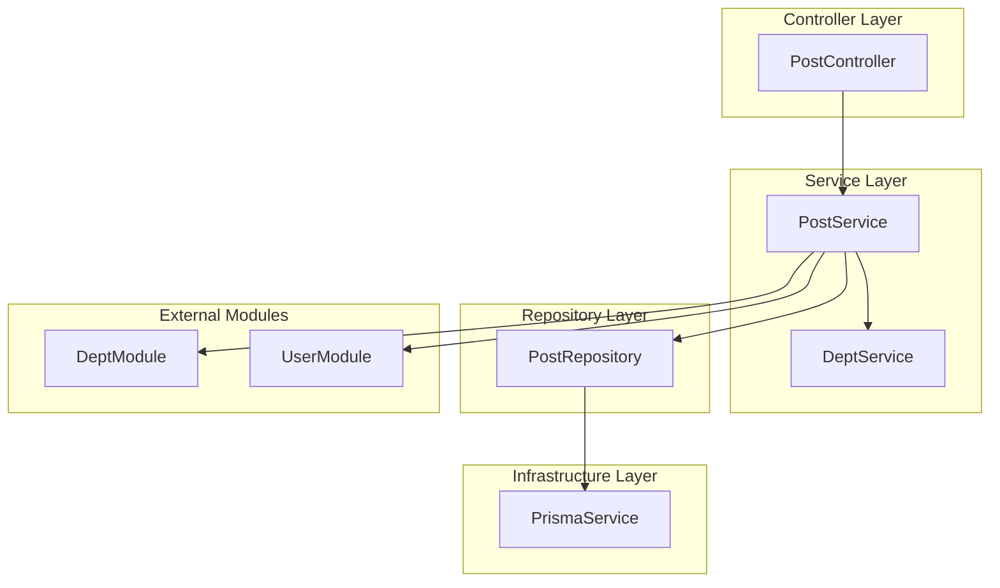
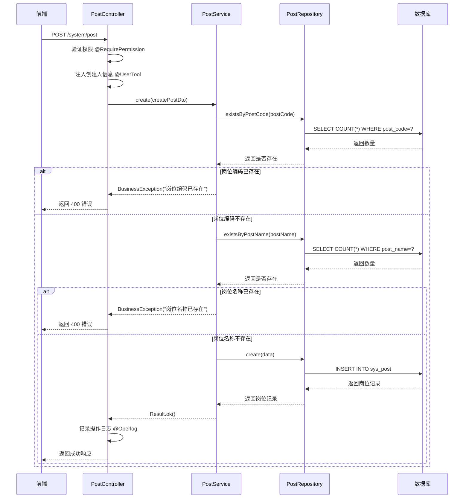
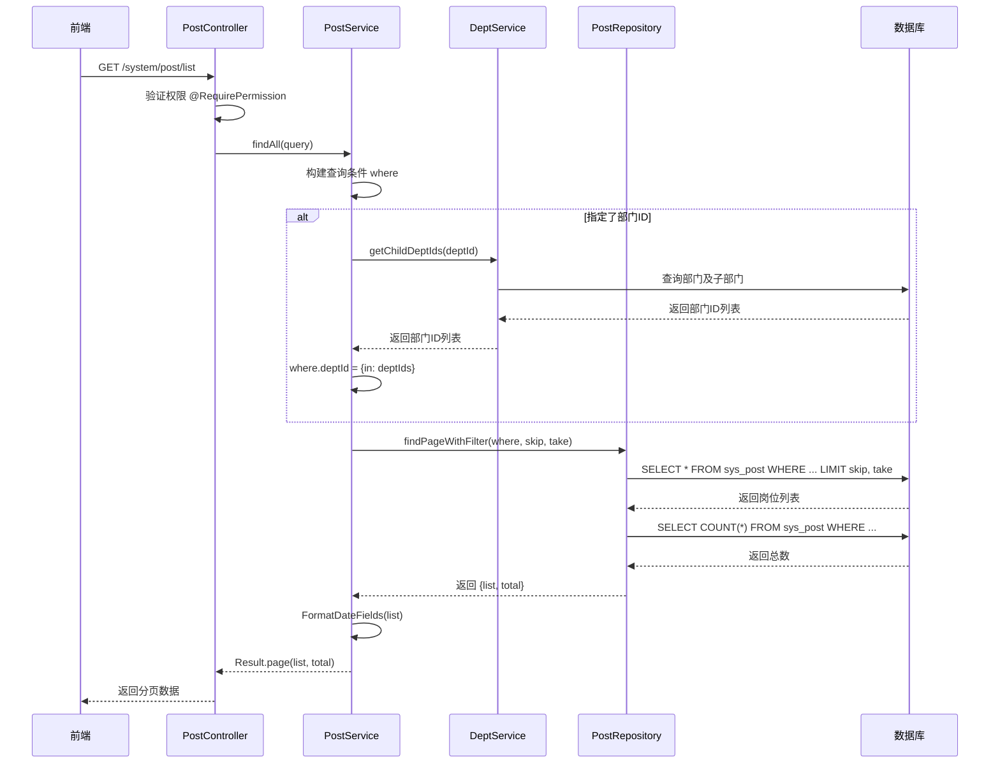
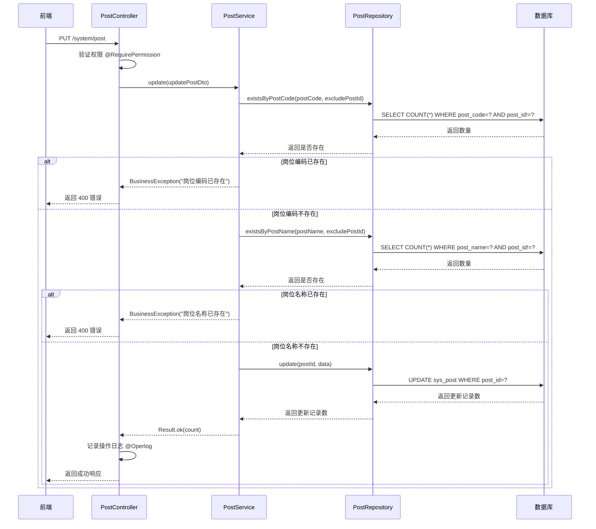
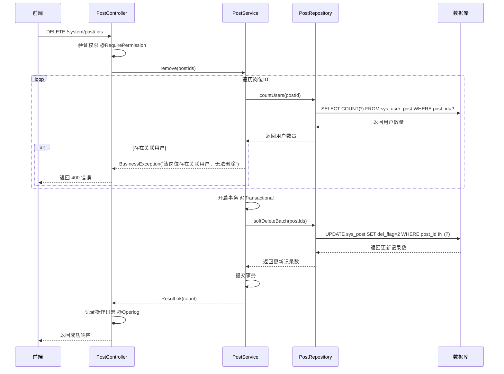
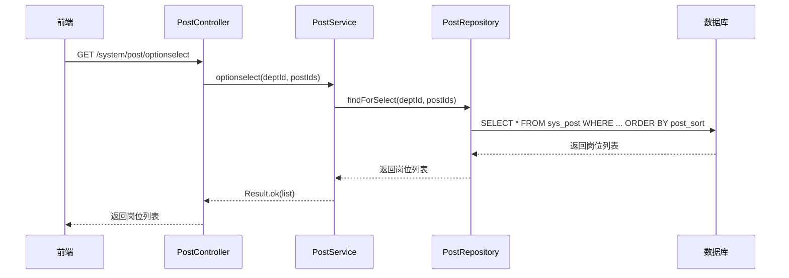
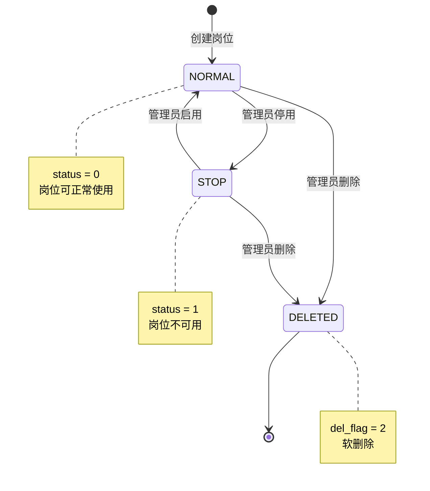
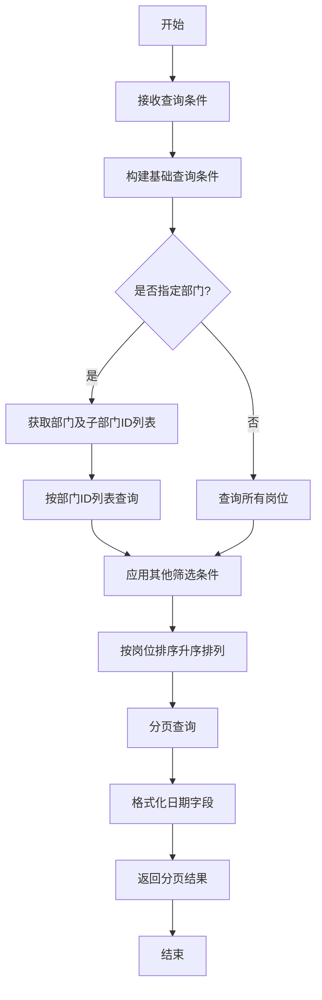
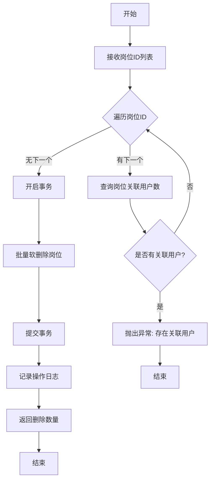

# 岗位管理模块 (System Post) — 设计文档

> 版本：1.0  
> 日期：2026-02-22  
> 状态：草案  
> 关联需求：[post-requirements.md](../../../requirements/admin/system/post-requirements.md)

---

## 1. 概述

### 1.1 设计目标

岗位管理模块是后台管理系统的基础模块，负责岗位的全生命周期管理和组织架构维护。本设计文档旨在：

- 定义岗位管理的技术架构和模块划分
- 规范岗位数据模型和接口约定
- 明确岗位与部门、用户的关联关系
- 优化岗位查询和筛选逻辑
- 为后续扩展（如岗位职责、岗位等级）预留接口

### 1.2 设计约束

- 使用 NestJS 框架，遵循项目后端开发规范
- 使用 Prisma ORM 进行数据库操作
- 岗位操作使用软删除，不物理删除数据
- 所有岗位操作记录操作日志
- 岗位编码和名称在同一租户下必须唯一

### 1.3 技术栈

| 技术            | 版本   | 用途     |
| --------------- | ------ | -------- |
| NestJS          | 10.x   | 后端框架 |
| Prisma          | 5.x    | ORM 框架 |
| TypeScript      | 5.x    | 编程语言 |
| class-validator | 0.14.x | DTO 验证 |

---

## 2. 架构与模块

### 2.1 模块划分

> 图 1：岗位管理模块组件图



### 2.2 目录结构

```
src/module/admin/system/post/
├── dto/
│   ├── create-post.dto.ts          # 创建岗位 DTO
│   ├── update-post.dto.ts          # 更新岗位 DTO
│   ├── list-post.dto.ts            # 查询岗位列表 DTO
│   └── index.ts                    # DTO 导出
├── vo/
│   └── post.vo.ts                  # 岗位 VO
├── post.controller.ts              # 岗位控制器
├── post.service.ts                 # 岗位服务
├── post.repository.ts              # 岗位仓储
└── post.module.ts                  # 岗位模块
```

---

## 3. 领域/数据模型

### 3.1 岗位实体类图

> 图 2：岗位实体类图

```mermaid
classDiagram
    class SysPost {
        +postId: number
        +deptId: number
        +postCode: string
        +postName: string
        +postCategory: string
        +postSort: number
        +status: StatusEnum
        +remark: string
        +delFlag: DelFlagEnum
        +createBy: string
        +createTime: Date
        +updateBy: string
        +updateTime: Date
        +tenantId: string
    }

    class CreatePostDto {
        +deptId: number
        +postName: string
        +postCode: string
        +postCategory: string
        +postSort: number
        +status: StatusEnum
        +remark: string
    }

    class UpdatePostDto {
        +postId: number
        +deptId: number
        +postName: string
        +postCode: string
        +postCategory: string
        +postSort: number
        +status: StatusEnum
        +remark: string
    }

    class PostVo {
        +postId: number
        +postCode: string
        +postName: string
        +postSort: number
        +status: string
        +remark: string
        +createTime: Date
        +updateTime: Date
    }

    class PostRepository {
        +create(data): SysPost
        +findById(id): SysPost
        +update(id, data): SysPost
        +softDelete(id): number
        +softDeleteBatch(ids): number
        +findPageWithFilter(where, skip, take): {list, total}
        +findForSelect(deptId, postIds): SysPost[]
        +findUserPosts(userId): SysPost[]
        +countUsers(postId): number
        +existsByPostCode(code, excludeId): boolean
        +existsByPostName(name, excludeId): boolean
    }

    class PostService {
        +create(dto): Result
        +findAll(query): Result
        +findOne(id): Result
        +update(dto): Result
        +remove(ids): Result
        +optionselect(deptId, postIds): Result
        +deptTree(): Result
        +export(res, body): void
    }

    PostService --> PostRepository
    PostService --> CreatePostDto
    PostService --> UpdatePostDto
    PostService --> PostVo
    PostRepository --> SysPost
```

### 3.2 数据库表结构

```sql
CREATE TABLE sys_post (
  post_id       BIGINT AUTO_INCREMENT PRIMARY KEY COMMENT '岗位ID',
  dept_id       BIGINT DEFAULT NULL COMMENT '部门ID',
  post_code     VARCHAR(64) NOT NULL COMMENT '岗位编码',
  post_name     VARCHAR(50) NOT NULL COMMENT '岗位名称',
  post_category VARCHAR(100) DEFAULT NULL COMMENT '类别编码',
  post_sort     INT DEFAULT 0 COMMENT '显示顺序',
  status        CHAR(1) DEFAULT '0' COMMENT '状态（0正常 1停用）',
  remark        VARCHAR(500) DEFAULT NULL COMMENT '备注',
  del_flag      CHAR(1) DEFAULT '0' COMMENT '删除标志（0正常 2删除）',
  create_by     VARCHAR(64) DEFAULT '' COMMENT '创建者',
  create_time   DATETIME DEFAULT CURRENT_TIMESTAMP COMMENT '创建时间',
  update_by     VARCHAR(64) DEFAULT '' COMMENT '更新者',
  update_time   DATETIME DEFAULT CURRENT_TIMESTAMP ON UPDATE CURRENT_TIMESTAMP COMMENT '更新时间',
  tenant_id     VARCHAR(20) DEFAULT '000000' COMMENT '租户ID',
  INDEX idx_dept_id (dept_id),
  INDEX idx_status (status),
  INDEX idx_del_flag (del_flag),
  INDEX idx_tenant_id (tenant_id),
  UNIQUE KEY uk_tenant_code (tenant_id, post_code),
  UNIQUE KEY uk_tenant_name (tenant_id, post_name)
) COMMENT='岗位信息表';
```

### 3.3 关联表

```sql
-- 用户岗位关联表
CREATE TABLE sys_user_post (
  user_id BIGINT NOT NULL COMMENT '用户ID',
  post_id BIGINT NOT NULL COMMENT '岗位ID',
  PRIMARY KEY (user_id, post_id),
  INDEX idx_user_id (user_id),
  INDEX idx_post_id (post_id)
) COMMENT='用户和岗位关联表';
```

---

## 4. 核心流程时序

### 4.1 创建岗位时序

> 图 3：创建岗位时序图



### 4.2 查询岗位列表时序

> 图 4：查询岗位列表时序图



### 4.3 修改岗位时序

> 图 5：修改岗位时序图



### 4.4 删除岗位时序

> 图 6：删除岗位时序图



### 4.5 获取岗位选择框列表时序

> 图 7：获取岗位选择框列表时序图



---

## 5. 状态与流程

### 5.1 岗位状态机

> 图 8：岗位状态机



### 5.2 岗位查询流程

> 图 9：岗位查询活动图



### 5.3 岗位删除流程

> 图 10：岗位删除活动图



---

## 6. 接口/数据约定

### 6.1 PostService 接口

```typescript
interface PostService {
  /**
   * 创建岗位
   * @param createPostDto 创建岗位 DTO
   * @returns 创建结果
   */
  create(createPostDto: CreatePostDto): Promise<Result>;

  /**
   * 查询岗位列表
   * @param query 查询条件
   * @returns 分页岗位列表
   */
  findAll(query: ListPostDto): Promise<Result>;

  /**
   * 查询岗位详情
   * @param postId 岗位ID
   * @returns 岗位详情
   */
  findOne(postId: number): Promise<Result>;

  /**
   * 修改岗位
   * @param updatePostDto 修改岗位 DTO
   * @returns 修改结果
   */
  update(updatePostDto: UpdatePostDto): Promise<Result>;

  /**
   * 删除岗位
   * @param postIds 岗位ID列表
   * @returns 删除结果
   */
  remove(postIds: string[]): Promise<Result>;

  /**
   * 获取岗位选择框列表
   * @param deptId 部门ID（可选）
   * @param postIds 岗位ID列表（可选）
   * @returns 岗位列表
   */
  optionselect(deptId?: number, postIds?: number[]): Promise<Result>;

  /**
   * 获取部门树
   * @returns 部门树
   */
  deptTree(): Promise<Result>;

  /**
   * 导出岗位数据
   * @param res 响应对象
   * @param body 查询条件
   */
  export(res: Response, body: ListPostDto): Promise<void>;
}
```

### 6.2 PostRepository 接口

```typescript
interface PostRepository {
  /**
   * 创建岗位
   */
  create(data: Prisma.SysPostCreateInput): Promise<SysPost>;

  /**
   * 根据ID查询岗位
   */
  findById(postId: number): Promise<SysPost | null>;

  /**
   * 更新岗位
   */
  update(postId: number, data: Prisma.SysPostUpdateInput): Promise<SysPost>;

  /**
   * 软删除岗位
   */
  softDelete(postId: number): Promise<number>;

  /**
   * 批量软删除岗位
   */
  softDeleteBatch(postIds: number[]): Promise<number>;

  /**
   * 分页查询岗位列表
   */
  findPageWithFilter(
    where: Prisma.SysPostWhereInput,
    skip: number,
    take: number,
  ): Promise<{ list: SysPost[]; total: number }>;

  /**
   * 查询岗位选择框列表
   */
  findForSelect(deptId?: number, postIds?: number[]): Promise<SysPost[]>;

  /**
   * 查询用户的岗位
   */
  findUserPosts(userId: number): Promise<SysPost[]>;

  /**
   * 统计岗位下的用户数
   */
  countUsers(postId: number): Promise<number>;

  /**
   * 检查岗位编码是否存在
   */
  existsByPostCode(postCode: string, excludePostId?: number): Promise<boolean>;

  /**
   * 检查岗位名称是否存在
   */
  existsByPostName(postName: string, excludePostId?: number): Promise<boolean>;
}
```

### 6.3 DTO 定义

```typescript
// 创建岗位 DTO
class CreatePostDto {
  deptId?: number; // 部门ID（可选）
  postName: string; // 岗位名称（必填，0-50 字符）
  postCode: string; // 岗位编码（必填，0-64 字符）
  postCategory?: string; // 类别编码（可选，0-100 字符）
  postSort?: number; // 岗位排序（可选）
  status?: StatusEnum; // 岗位状态（可选，0=正常 1=停用）
  remark?: string; // 备注（可选，0-500 字符）
}

// 更新岗位 DTO
class UpdatePostDto extends CreatePostDto {
  postId: number; // 岗位ID（必填）
}

// 查询岗位列表 DTO
class ListPostDto extends PageQueryDto {
  postName?: string; // 岗位名称（可选，模糊查询）
  postCode?: string; // 岗位编码（可选，模糊查询）
  status?: StatusEnum; // 岗位状态（可选）
  belongDeptId?: string; // 所属部门ID（可选）
}
```

### 6.4 VO 定义

```typescript
// 岗位 VO
class PostVo {
  postId: number;
  postCode: string;
  postName: string;
  postSort: number;
  status: string;
  remark: string;
  createTime: Date;
  updateTime: Date;
}

// 岗位列表 VO
class PostListVo {
  rows: PostVo[];
  total: number;
}
```

---

## 7. 安全设计

### 7.1 权限控制

| 操作         | 权限标识           | 说明                 |
| ------------ | ------------------ | -------------------- |
| 创建岗位     | system:post:add    | 创建新岗位           |
| 查询岗位列表 | system:post:list   | 查询岗位列表         |
| 查看岗位详情 | system:post:query  | 查看岗位详细信息     |
| 修改岗位     | system:post:edit   | 修改岗位信息         |
| 删除岗位     | system:post:remove | 删除岗位             |
| 导出岗位数据 | system:post:export | 导出岗位数据为 Excel |

### 7.2 数据验证

| 字段         | 验证规则            |
| ------------ | ------------------- |
| postName     | 必填，0-50 字符     |
| postCode     | 必填，0-64 字符     |
| deptId       | 可选，数字          |
| postCategory | 可选，0-100 字符    |
| postSort     | 可选，数字          |
| status       | 可选，枚举值（0/1） |
| remark       | 可选，0-500 字符    |

### 7.3 业务规则校验

| 规则           | 校验时机   | 说明                       |
| -------------- | ---------- | -------------------------- |
| 岗位编码唯一性 | 创建、修改 | 同一租户下岗位编码必须唯一 |
| 岗位名称唯一性 | 创建、修改 | 同一租户下岗位名称必须唯一 |
| 用户关联检查   | 删除       | 删除前检查是否有用户关联   |

### 7.4 操作日志

所有岗位操作（创建、修改、删除、导出）均使用 `@Operlog` 装饰器记录操作日志，包含：

- 操作人
- 操作时间
- 操作类型（INSERT/UPDATE/DELETE/EXPORT）
- 操作内容（岗位ID、岗位名称）
- 操作结果（成功/失败）

---

## 8. 性能优化

### 8.1 查询优化

| 优化项       | 优化方式                                         |
| ------------ | ------------------------------------------------ |
| 岗位列表查询 | 使用索引（dept_id, status, del_flag, tenant_id） |
| 岗位编码查询 | 使用唯一索引（tenant_id, post_code）             |
| 岗位名称查询 | 使用唯一索引（tenant_id, post_name）             |
| 用户岗位查询 | 使用索引（user_id, post_id）                     |
| 部门岗位查询 | 使用索引（dept_id）                              |

### 8.2 性能指标

| 接口         | P95 延迟目标   | 说明                     |
| ------------ | -------------- | ------------------------ |
| 创建岗位     | 小于等于 200ms | 包含数据库写入和校验     |
| 查询岗位列表 | 小于等于 200ms | 包含数据库查询           |
| 查看岗位详情 | 小于等于 100ms | 单条记录查询             |
| 修改岗位     | 小于等于 200ms | 包含数据库更新和校验     |
| 删除岗位     | 小于等于 300ms | 包含关联检查和数据库更新 |

---

## 9. 实施计划

### 9.1 阶段一：核心功能完善（当前）

| 任务           | 状态      | 说明                   |
| -------------- | --------- | ---------------------- |
| 岗位 CRUD 操作 | ✅ 已完成 | 创建、查询、修改、删除 |
| 岗位与部门关联 | ✅ 已完成 | 支持岗位关联部门       |
| 岗位选择框列表 | ✅ 已完成 | 支持按部门和岗位ID筛选 |
| 岗位数据导出   | ✅ 已完成 | 导出为 Excel           |
| 操作日志记录   | ✅ 已完成 | 使用 @Operlog 装饰器   |

### 9.2 阶段二：功能优化（1-2 个迭代）

| 任务               | 优先级 | 工作量 | 说明                                 |
| ------------------ | ------ | ------ | ------------------------------------ |
| 实现唯一性校验     | P0     | 1 天   | 创建和修改时校验岗位编码和名称唯一性 |
| 删除前检查用户关联 | P0     | 1 天   | 删除前检查是否有用户关联             |
| 实现岗位批量导入   | P1     | 3 天   | 支持 Excel 批量导入岗位              |
| 实现批量启用/停用  | P1     | 1 天   | 批量修改岗位状态                     |

### 9.3 阶段三：扩展功能（3-6 个月）

| 任务                 | 优先级 | 工作量 | 说明                     |
| -------------------- | ------ | ------ | ------------------------ |
| 实现岗位使用情况统计 | P2     | 2 天   | 统计岗位被多少用户使用   |
| 实现岗位职责管理     | P2     | 5 天   | 定义岗位的职责和要求     |
| 优化岗位与部门关联   | P2     | 3 天   | 支持一个岗位关联多个部门 |

---

## 10. 测试策略

### 10.1 单元测试

| 测试项         | 测试内容                                   |
| -------------- | ------------------------------------------ |
| PostService    | 创建、查询、修改、删除岗位                 |
| PostRepository | 数据库操作（CRUD、唯一性校验、关联检查等） |
| 唯一性校验     | 岗位编码和名称唯一性校验                   |
| 关联检查       | 删除前检查用户关联                         |

### 10.2 集成测试

| 测试项         | 测试内容                         |
| -------------- | -------------------------------- |
| 创建岗位       | 创建岗位并验证数据库记录         |
| 修改岗位       | 修改岗位并验证数据库更新         |
| 删除岗位       | 删除岗位并验证软删除             |
| 按部门查询     | 验证按部门查询岗位（包含子部门） |
| 岗位选择框列表 | 验证岗位选择框列表的筛选逻辑     |

### 10.3 性能测试

| 测试项       | 测试内容                    |
| ------------ | --------------------------- |
| 岗位列表查询 | 验证 P95 延迟小于等于 200ms |
| 岗位详情查询 | 验证 P95 延迟小于等于 100ms |
| 岗位创建     | 验证 P95 延迟小于等于 200ms |

---

## 11. 监控与告警

### 11.1 监控指标

| 指标          | 说明                   | 告警阈值   |
| ------------- | ---------------------- | ---------- |
| 接口 QPS      | 每秒请求数             | 大于 50    |
| 接口 P95 延迟 | 95% 请求的响应时间     | 大于 300ms |
| 接口错误率    | 请求失败比例           | 大于 1%    |
| 数据库慢查询  | 查询时间大于 1s 的 SQL | 出现慢查询 |

### 11.2 日志记录

| 日志级别 | 记录内容                     |
| -------- | ---------------------------- |
| INFO     | 岗位创建、修改、删除操作     |
| WARN     | 唯一性校验失败、关联检查失败 |
| ERROR    | 数据库操作失败               |

---

## 12. 扩展性设计

### 12.1 岗位职责管理

**设计思路**：

- 新增 `sys_post_duty` 表，存储岗位的职责和要求
- 岗位查询时可选择是否包含职责信息
- 支持岗位职责的增删改查

**表结构**：

```sql
CREATE TABLE sys_post_duty (
  id          BIGINT AUTO_INCREMENT PRIMARY KEY,
  post_id     BIGINT NOT NULL COMMENT '岗位ID',
  duty_name   VARCHAR(100) NOT NULL COMMENT '职责名称',
  duty_desc   VARCHAR(500) COMMENT '职责描述',
  duty_sort   INT DEFAULT 0 COMMENT '显示顺序',
  create_time DATETIME DEFAULT CURRENT_TIMESTAMP,
  update_time DATETIME DEFAULT CURRENT_TIMESTAMP ON UPDATE CURRENT_TIMESTAMP,
  INDEX idx_post_id (post_id)
) COMMENT='岗位职责表';
```

### 12.2 岗位等级管理

**设计思路**：

- 新增 `sys_post_level` 表，存储岗位的等级信息
- 支持岗位等级的晋升路径定义
- 支持岗位等级的薪资范围定义

**表结构**：

```sql
CREATE TABLE sys_post_level (
  id          BIGINT AUTO_INCREMENT PRIMARY KEY,
  post_id     BIGINT NOT NULL COMMENT '岗位ID',
  level_name  VARCHAR(50) NOT NULL COMMENT '等级名称',
  level_code  VARCHAR(20) NOT NULL COMMENT '等级编码',
  level_sort  INT DEFAULT 0 COMMENT '等级顺序',
  salary_min  DECIMAL(10,2) COMMENT '最低薪资',
  salary_max  DECIMAL(10,2) COMMENT '最高薪资',
  create_time DATETIME DEFAULT CURRENT_TIMESTAMP,
  update_time DATETIME DEFAULT CURRENT_TIMESTAMP ON UPDATE CURRENT_TIMESTAMP,
  INDEX idx_post_id (post_id),
  UNIQUE KEY uk_post_level (post_id, level_code)
) COMMENT='岗位等级表';
```

### 12.3 岗位多部门关联

**设计思路**：

- 新增 `sys_post_dept` 表，支持一个岗位关联多个部门
- 兼容现有的 `dept_id` 字段，逐步迁移
- 查询时优先使用关联表，如果关联表为空则使用 `dept_id` 字段

**表结构**：

```sql
CREATE TABLE sys_post_dept (
  post_id BIGINT NOT NULL COMMENT '岗位ID',
  dept_id BIGINT NOT NULL COMMENT '部门ID',
  PRIMARY KEY (post_id, dept_id),
  INDEX idx_post_id (post_id),
  INDEX idx_dept_id (dept_id)
) COMMENT='岗位部门关联表';
```

---

## 13. 风险评估

### 13.1 技术风险

| 风险           | 影响     | 概率 | 应对措施                   |
| -------------- | -------- | ---- | -------------------------- |
| 数据库慢查询   | 性能下降 | 中   | 优化索引，使用缓存         |
| 唯一性校验失败 | 数据质量 | 低   | 完善校验逻辑，提供友好提示 |

### 13.2 业务风险

| 风险           | 影响       | 概率 | 应对措施                             |
| -------------- | ---------- | ---- | ------------------------------------ |
| 岗位误删       | 数据丢失   | 中   | 使用软删除，提供恢复功能             |
| 岗位编码重复   | 数据质量   | 中   | 实现唯一性校验，定期检查             |
| 关联用户未清理 | 数据一致性 | 中   | 删除前检查关联，提供批量解除关联功能 |

---

## 14. 附录

### 14.1 相关文档

- [岗位管理模块需求文档](../../../requirements/admin/system/post-requirements.md)
- [用户管理模块设计文档](./user-design.md)
- [部门管理模块设计文档](./dept-design.md)
- [后端开发规范](../../../../../.kiro/steering/backend-nestjs.md)

### 14.2 参考资料

- [NestJS 官方文档](https://docs.nestjs.com/)
- [Prisma 官方文档](https://www.prisma.io/docs/)
- [组织架构管理最佳实践](https://www.owasp.org/index.php/Access_Control_Cheat_Sheet)

### 14.3 术语表

| 术语     | 说明                                 |
| -------- | ------------------------------------ |
| 岗位     | 组织中的职位，如经理、工程师、助理等 |
| 岗位编码 | 岗位的唯一标识符                     |
| 岗位名称 | 岗位的名称                           |
| 岗位排序 | 岗位的显示顺序                       |
| 岗位状态 | 岗位的启用/停用状态                  |
| 软删除   | 标记为删除但不物理删除数据           |
| 岗位职责 | 岗位的职责和要求                     |
| 岗位等级 | 岗位的等级和晋升路径                 |
