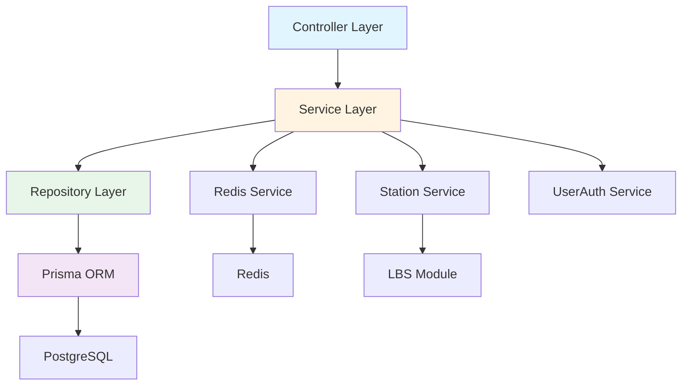
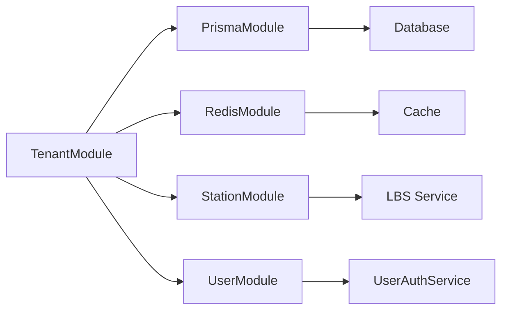
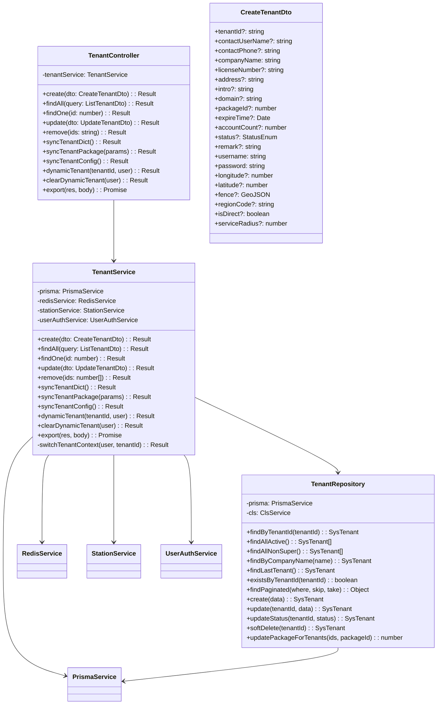
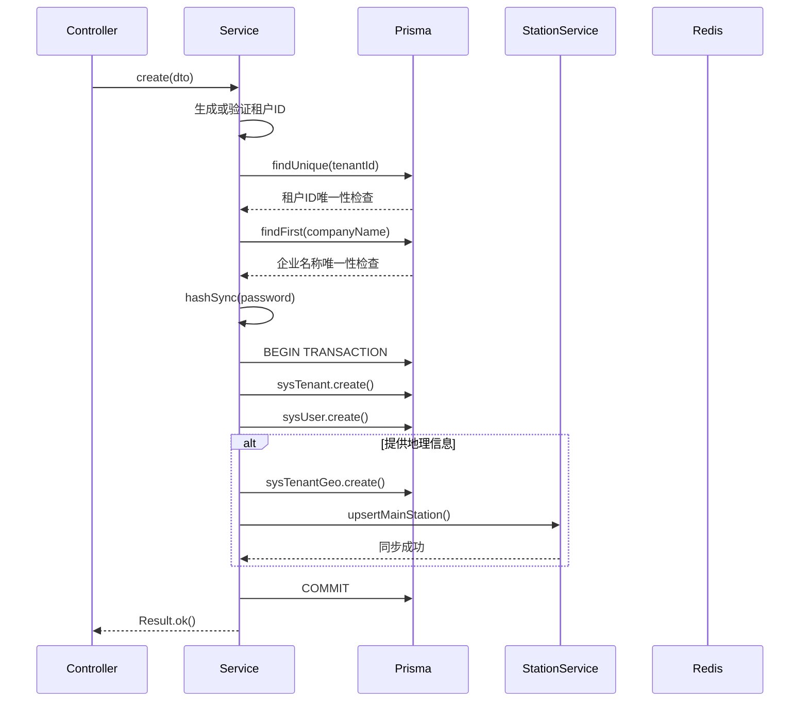
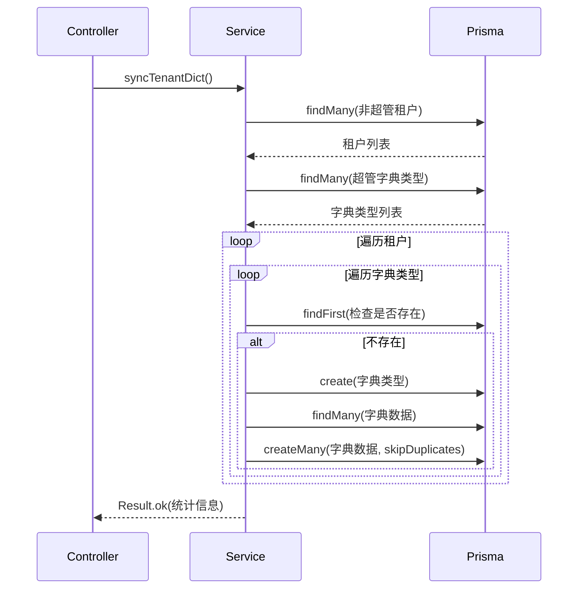
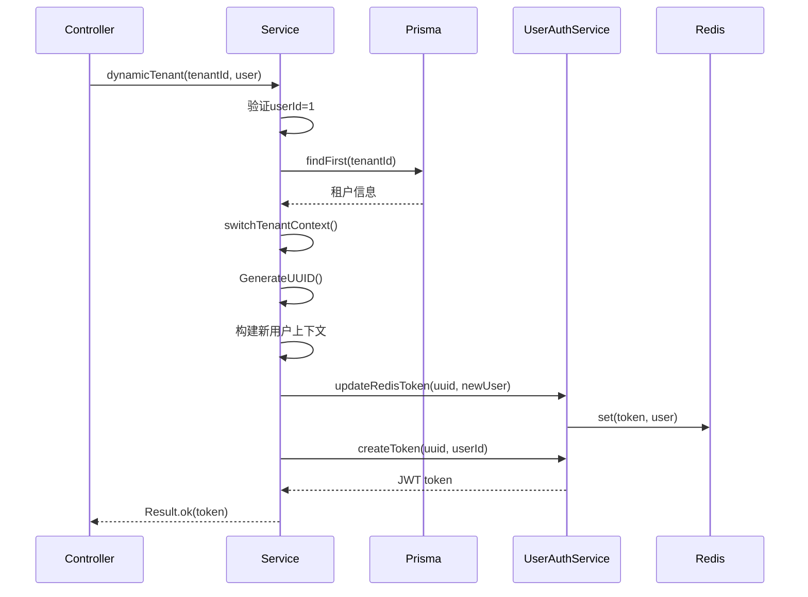
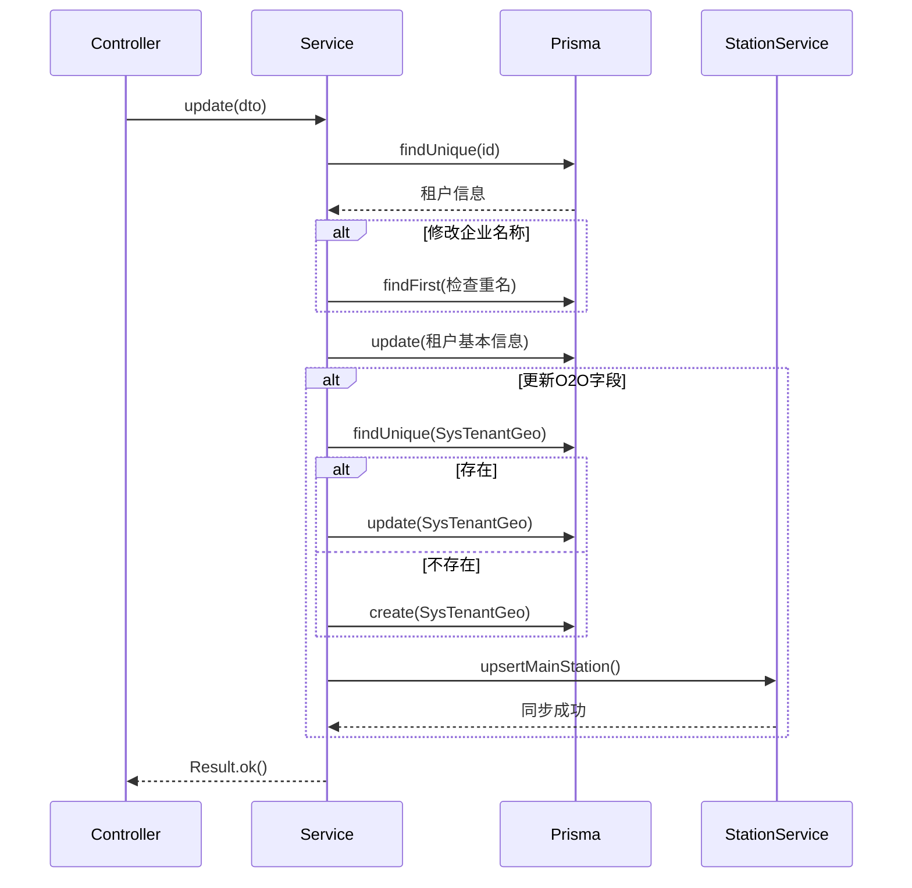
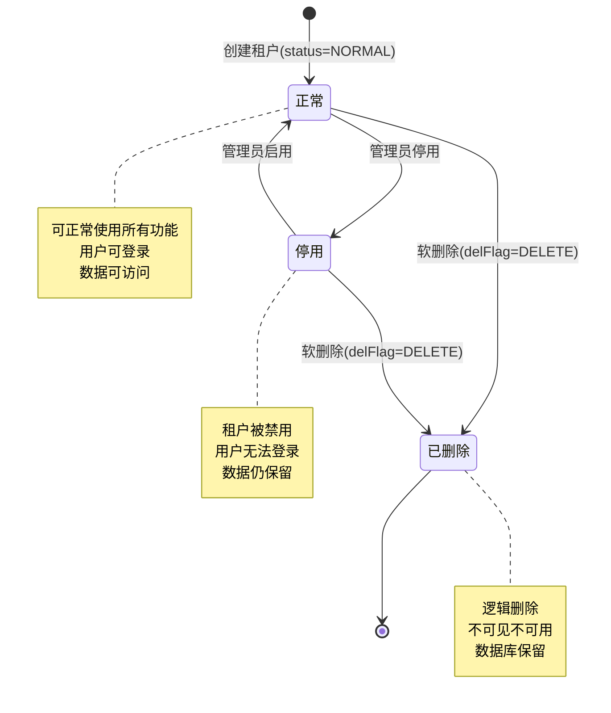
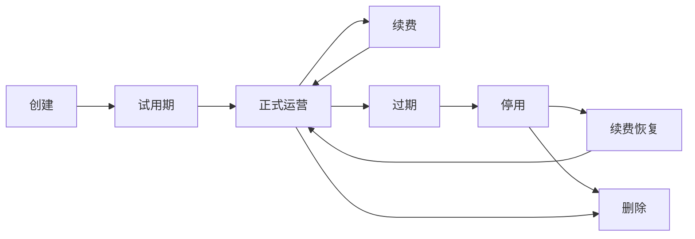
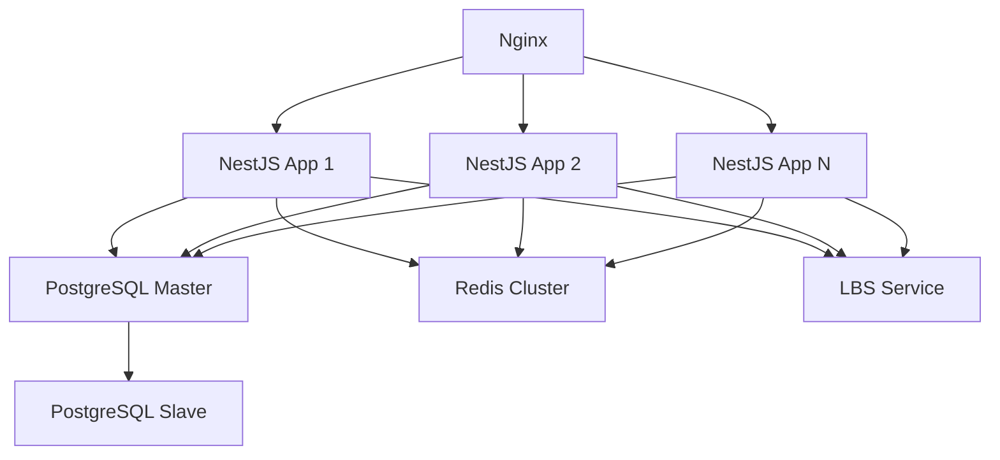

# 租户管理模块设计文档

## 1. 概述

### 1.1 模块简介

租户管理模块是多租户SaaS系统的核心基础设施，负责租户的全生命周期管理、多租户数据隔离、套餐权限管理、配置同步以及O2O地理服务支持。该模块采用Repository模式、事务管理、批量优化等设计模式，确保数据一致性和高性能。

### 1.2 设计目标

- 实现租户数据完全隔离，保障数据安全
- 支持超级管理员动态切换租户上下文
- 提供高效的配置和字典同步机制
- 支持O2O业务场景的地理位置服务
- 确保事务一致性和数据完整性
- 优化查询性能，避免N+1问题

### 1.3 技术栈

- NestJS框架
- Prisma ORM
- PostgreSQL数据库
- Redis缓存
- bcryptjs密码加密
- class-validator数据验证
- nestjs-cls上下文管理

## 2. 架构设计

### 2.1 分层架构



### 2.2 模块依赖关系



### 2.3 核心组件

| 组件             | 职责     | 说明                                   |
| ---------------- | -------- | -------------------------------------- |
| TenantController | 接口层   | 处理HTTP请求，权限验证，参数验证       |
| TenantService    | 业务层   | 实现业务逻辑，事务管理，调用Repository |
| TenantRepository | 数据层   | 封装数据访问，提供通用查询方法         |
| CreateTenantDto  | 数据传输 | 创建租户请求参数                       |
| UpdateTenantDto  | 数据传输 | 更新租户请求参数                       |
| ListTenantDto    | 数据传输 | 查询租户列表参数                       |
| TenantVo         | 视图对象 | 租户列表返回数据                       |

## 3. 类设计

### 3.1 类图



### 3.2 核心类说明

#### 3.2.1 TenantController

职责：处理租户管理相关的HTTP请求

关键方法：

- create: 创建租户，使用@Operlog记录操作日志
- findAll: 分页查询租户列表
- update: 更新租户信息
- remove: 批量软删除租户
- syncTenantDict: 同步租户字典
- syncTenantPackage: 同步租户套餐
- syncTenantConfig: 同步租户配置
- dynamicTenant: 动态切换租户上下文
- export: 导出租户数据为Excel

装饰器：

- @ApiTags: API文档分组
- @Controller: 路由前缀
- @ApiBearerAuth: JWT认证
- @RequirePermission: 权限验证
- @Operlog: 操作日志

#### 3.2.2 TenantService

职责：实现租户管理的核心业务逻辑

关键方法：

- create: 创建租户，使用@Transactional确保事务一致性
- findAll: 分页查询，批量优化避免N+1问题
- update: 更新租户，同步O2O地理配置
- syncTenantDict: 同步字典，使用批量创建优化性能
- syncTenantConfig: 同步配置，清除Redis缓存
- dynamicTenant: 切换租户上下文，生成新token
- switchTenantContext: 私有方法，构建新用户上下文

装饰器：

- @Injectable: 依赖注入
- @IgnoreTenant: 忽略租户隔离
- @Transactional: 事务管理

#### 3.2.3 TenantRepository

职责：封装租户数据访问逻辑

特点：

- 继承SoftDeleteRepository，支持软删除
- 使用ClsService获取事务上下文
- 提供通用查询方法
- 支持批量操作

关键方法：

- findPaginated: 分页查询，自动处理事务上下文
- findAllNonSuper: 查询非超管租户
- updatePackageForTenants: 批量更新套餐

## 4. 核心流程序列图

### 4.1 创建租户流程



### 4.2 同步租户字典流程



### 4.3 动态切换租户流程



### 4.4 更新租户并同步O2O流程



## 5. 状态和流转

### 5.1 租户状态机



### 5.2 租户生命周期流转



## 6. 接口/数据契约

### 6.1 DTO定义

#### 6.1.1 CreateTenantDto

```typescript
class CreateTenantDto {
  tenantId?: string; // 租户ID（可选，不传则自动生成）
  contactUserName?: string; // 联系人
  contactPhone?: string; // 联系电话
  companyName: string; // 企业名称（必填）
  licenseNumber?: string; // 统一社会信用代码
  address?: string; // 地址
  intro?: string; // 企业简介
  domain?: string; // 域名
  packageId?: number; // 租户套餐ID
  expireTime?: Date; // 过期时间
  accountCount?: number; // 账号数量
  status?: StatusEnum; // 状态
  remark?: string; // 备注
  username: string; // 管理员账号（必填）
  password: string; // 管理员密码（必填）
  longitude?: number; // 经度
  latitude?: number; // 纬度
  fence?: GeoJSON; // 电子围栏
  regionCode?: string; // 行政区划代码
  isDirect?: boolean; // 是否直营
  serviceRadius?: number; // 服务半径
}
```

#### 6.1.2 UpdateTenantDto

```typescript
class UpdateTenantDto {
  id: number; // 租户ID（必填）
  tenantId: string; // 租户编号（必填）
  // 其他字段继承自CreateTenantDto（除username和password）
}
```

#### 6.1.3 ListTenantDto

```typescript
class ListTenantDto extends PageQueryDto {
  tenantId?: string; // 租户ID
  contactUserName?: string; // 联系人
  contactPhone?: string; // 联系电话
  companyName?: string; // 企业名称
  status?: StatusEnum; // 状态
  beginTime?: Date; // 开始时间
  endTime?: Date; // 结束时间
}
```

### 6.2 VO定义

#### 6.2.1 TenantVo

```typescript
interface TenantVo {
  id: number;
  tenantId: string;
  contactUserName: string;
  contactPhone: string;
  companyName: string;
  licenseNumber: string;
  address: string;
  packageId: number;
  packageName: string; // 套餐名称（关联查询）
  expireTime: string;
  accountCount: number;
  status: string; // "0"正常 "1"停用
  regionCode: string;
  regionName: string; // 区域名称（关联查询）
  isDirect: boolean;
  createTime: string;
  remark: string;
}
```

### 6.3 数据库模型

#### 6.3.1 SysTenant

```prisma
model SysTenant {
  id              Int       @id @default(autoincrement())
  tenantId        String    @unique
  contactUserName String?
  contactPhone    String?
  companyName     String
  licenseNumber   String?
  address         String?
  intro           String?
  domain          String?
  packageId       Int?
  expireTime      DateTime?
  accountCount    Int       @default(-1)
  storageQuota    Int       @default(10240)
  storageUsed     Int       @default(0)
  status          Status    @default(NORMAL)
  delFlag         DelFlag   @default(NORMAL)
  regionCode      String?
  isDirect        Boolean   @default(true)
  createBy        String
  createTime      DateTime
  updateBy        String
  updateTime      DateTime
  remark          String?

  geoConfig       SysTenantGeo?
  orders          OmsOrder[]
}
```

#### 6.3.2 SysTenantGeo

```prisma
model SysTenantGeo {
  id            Int     @id @default(autoincrement())
  tenantId      String  @unique
  address       String?
  latitude      Float?
  longitude     Float?
  serviceRadius Int     @default(3000)
  geoFence      Json?

  tenant        SysTenant @relation(fields: [tenantId], references: [tenantId])
}
```

## 7. 数据库设计

### 7.1 表结构

#### 7.1.1 sys_tenant（租户表）

| 字段              | 类型         | 约束                       | 说明             |
| ----------------- | ------------ | -------------------------- | ---------------- |
| id                | INT          | PK, AUTO_INCREMENT         | 主键ID           |
| tenant_id         | VARCHAR(20)  | UNIQUE, NOT NULL           | 租户编号         |
| contact_user_name | VARCHAR(50)  | NULL                       | 联系人           |
| contact_phone     | VARCHAR(20)  | NULL                       | 联系电话         |
| company_name      | VARCHAR(100) | NOT NULL                   | 企业名称         |
| license_number    | VARCHAR(50)  | NULL                       | 统一社会信用代码 |
| address           | VARCHAR(200) | NULL                       | 地址             |
| intro             | TEXT         | NULL                       | 企业简介         |
| domain            | VARCHAR(100) | NULL                       | 域名             |
| package_id        | INT          | NULL                       | 租户套餐ID       |
| expire_time       | TIMESTAMP    | NULL                       | 过期时间         |
| account_count     | INT          | NOT NULL, DEFAULT -1       | 账号数量         |
| storage_quota     | INT          | NOT NULL, DEFAULT 10240    | 存储配额(MB)     |
| storage_used      | INT          | NOT NULL, DEFAULT 0        | 已使用存储(MB)   |
| status            | ENUM         | NOT NULL, DEFAULT 'NORMAL' | 状态             |
| del_flag          | ENUM         | NOT NULL, DEFAULT 'NORMAL' | 删除标志         |
| region_code       | VARCHAR(20)  | NULL                       | 行政区划代码     |
| is_direct         | BOOLEAN      | NOT NULL, DEFAULT true     | 是否直营         |
| create_by         | VARCHAR(64)  | NOT NULL                   | 创建者           |
| create_time       | TIMESTAMP    | NOT NULL                   | 创建时间         |
| update_by         | VARCHAR(64)  | NOT NULL                   | 更新者           |
| update_time       | TIMESTAMP    | NOT NULL                   | 更新时间         |
| remark            | VARCHAR(500) | NULL                       | 备注             |

索引：

- PRIMARY KEY (id)
- UNIQUE KEY (tenant_id)
- INDEX (del_flag)

#### 7.1.2 sys_tenant_geo（租户地理配置表）

| 字段           | 类型         | 约束                   | 说明         |
| -------------- | ------------ | ---------------------- | ------------ |
| id             | INT          | PK, AUTO_INCREMENT     | 主键ID       |
| tenant_id      | VARCHAR(20)  | UNIQUE, NOT NULL       | 租户编号     |
| address        | VARCHAR(200) | NULL                   | 地址         |
| latitude       | DOUBLE       | NULL                   | 纬度         |
| longitude      | DOUBLE       | NULL                   | 经度         |
| service_radius | INT          | NOT NULL, DEFAULT 3000 | 服务半径(米) |
| geo_fence      | JSON         | NULL                   | 电子围栏     |

索引：

- PRIMARY KEY (id)
- UNIQUE KEY (tenant_id)
- FOREIGN KEY (tenant_id) REFERENCES sys_tenant(tenant_id)

### 7.2 索引设计

| 表             | 索引名          | 字段        | 类型 | 说明             |
| -------------- | --------------- | ----------- | ---- | ---------------- |
| sys_tenant     | PRIMARY         | id          | 主键 | 主键索引         |
| sys_tenant     | UK_tenant_id    | tenant_id   | 唯一 | 租户ID唯一索引   |
| sys_tenant     | IDX_del_flag    | del_flag    | 普通 | 软删除查询优化   |
| sys_tenant     | IDX_status      | status      | 普通 | 状态查询优化     |
| sys_tenant     | IDX_create_time | create_time | 普通 | 时间范围查询优化 |
| sys_tenant_geo | PRIMARY         | id          | 主键 | 主键索引         |
| sys_tenant_geo | UK_tenant_id    | tenant_id   | 唯一 | 租户ID唯一索引   |

### 7.3 数据库优化策略

1. 查询优化
   - 使用批量查询避免N+1问题
   - 分页查询限制offset ≤ 5000
   - 使用索引覆盖常用查询条件

2. 写入优化
   - 使用createMany批量插入
   - 使用skipDuplicates避免重复插入错误
   - 使用事务确保数据一致性

3. 缓存策略
   - 租户配置使用Redis缓存
   - 同步操作后清除相关缓存
   - 缓存key格式：`sys:config:{tenantId}`

## 8. 安全设计

### 8.1 权限控制

| 接口     | 权限                  | 说明         |
| -------- | --------------------- | ------------ |
| 创建租户 | system:tenant:add     | 仅超级管理员 |
| 查询租户 | system:tenant:list    | 仅超级管理员 |
| 更新租户 | system:tenant:edit    | 仅超级管理员 |
| 删除租户 | system:tenant:remove  | 仅超级管理员 |
| 同步操作 | system:tenant:edit    | 仅超级管理员 |
| 动态切换 | system:tenant:dynamic | 仅userId=1   |
| 导出数据 | system:tenant:export  | 仅超级管理员 |

### 8.2 数据隔离

- 所有接口使用@IgnoreTenant装饰器，忽略租户隔离
- 接口类型标记为PlatformOnly
- 仅超级管理员可访问租户管理功能
- 动态切换租户仅限userId=1的超级管理员

### 8.3 密码安全

- 使用bcryptjs加密密码
- salt rounds设置为10
- 密码不记录日志
- 密码不返回给前端

### 8.4 数据脱敏

- 日志中不记录密码
- 导出数据时脱敏敏感信息
- 错误信息不暴露内部实现

### 8.5 防护措施

- 使用class-validator验证输入参数
- 使用BusinessException统一异常处理
- 使用事务确保数据一致性
- 使用软删除避免数据丢失

## 9. 性能优化

### 9.1 查询优化

1. 批量查询优化

```typescript
// 避免N+1问题
const packageIds = list.map((item) => item.packageId).filter(Boolean);
const packages = await this.prisma.sysTenantPackage.findMany({
  where: { packageId: { in: packageIds } },
});
const packageMap = new Map(packages.map((pkg) => [pkg.packageId, pkg.packageName]));
```

2. 分页优化

```typescript
// 限制分页深度
if (query.skip > 5000) {
  throw new BusinessException(ResponseCode.BAD_REQUEST, '分页深度超限');
}
```

3. 索引优化

- 在delFlag、status、createTime字段上建立索引
- 使用复合索引优化多条件查询

### 9.2 写入优化

1. 批量创建

```typescript
// 使用createMany批量插入
await this.prisma.sysDictData.createMany({
  data: dictDatas.map((d) => ({ ...d, tenantId })),
  skipDuplicates: true,
});
```

2. 事务优化

```typescript
// 使用@Transactional装饰器
@Transactional()
async create(dto: CreateTenantDto) {
  // 事务内操作
}
```

### 9.3 缓存策略

1. Redis缓存

```typescript
// 清除租户配置缓存
await this.redisService.del(`${CacheEnum.SYS_CONFIG_KEY}${tenantId}`);
```

2. 缓存失效

- 同步配置后清除缓存
- 更新租户后清除相关缓存

### 9.4 性能指标

| 指标         | 目标           | 说明               |
| ------------ | -------------- | ------------------ |
| 接口响应时间 | P99 < 1000ms   | 后台管理级别       |
| 并发支持     | 100 QPS        | 租户管理为低频操作 |
| 批量同步     | 1000租户 < 30s | 使用批量操作优化   |
| 分页查询     | offset ≤ 5000  | 超限抛错           |

## 10. 监控与日志

### 10.1 日志记录

1. 关键操作日志

```typescript
this.logger.log(`创建租户: ${tenantId}`);
this.logger.log(`同步租户字典: ${tenants.length}个租户`);
this.logger.error('创建租户失败', error);
```

2. 日志级别

- INFO: 正常操作（创建、更新、同步）
- WARN: 警告信息（跳过重复数据）
- ERROR: 错误信息（创建失败、同步失败）

3. 日志内容

- 操作类型
- 租户ID
- 操作结果
- 错误堆栈（使用getErrorInfo）

### 10.2 操作日志

使用@Operlog装饰器记录操作日志：

```typescript
@Operlog({ businessType: BusinessType.INSERT })
@Post('/')
create(@Body() dto: CreateTenantDto) {
  return this.tenantService.create(dto);
}
```

### 10.3 监控指标

| 指标           | 说明             | 告警阈值 |
| -------------- | ---------------- | -------- |
| 接口响应时间   | P99延迟          | > 2000ms |
| 接口错误率     | 错误请求比例     | > 1%     |
| 同步成功率     | 同步操作成功比例 | < 95%    |
| 租户创建失败率 | 创建失败比例     | > 5%     |

### 10.4 审计日志

- 记录所有租户管理操作
- 记录动态切换租户操作
- 记录同步操作的详细信息
- 保留操作人、操作时间、操作内容

## 11. 扩展性设计

### 11.1 O2O扩展

1. 地理位置支持

- SysTenantGeo表存储地理配置
- 支持地址、经纬度、服务半径、电子围栏
- 与LBS站点服务集成

2. 区域管理

- regionCode关联行政区划表
- 支持省市区三级联动
- 支持区域名称显示

3. 直营/加盟模式

- isDirect字段区分模式
- 支持不同业务规则

### 11.2 套餐扩展

1. 套餐管理

- 支持多套餐配置
- 支持菜单权限配置
- 支持套餐同步

2. 套餐功能

- 账号数量限制
- 存储配额限制
- 功能权限控制

### 11.3 配置扩展

1. 配置同步

- 从超级管理员同步配置
- 支持批量同步
- 支持增量同步

2. 字典同步

- 从超级管理员同步字典
- 支持字典类型和数据同步
- 支持跳过重复数据

### 11.4 集成扩展

1. LBS集成

- 自动同步主站点
- 支持地理信息更新
- 使用Adapter模式解耦

2. 用户集成

- 创建租户管理员账号
- 支持动态切换租户上下文
- 支持token刷新

## 12. 部署架构

### 12.1 部署拓扑



### 12.2 高可用设计

1. 应用层

- 多实例部署
- 负载均衡
- 健康检查

2. 数据库层

- 主从复制
- 读写分离
- 自动故障转移

3. 缓存层

- Redis集群
- 哨兵模式
- 持久化配置

### 12.3 扩展策略

1. 水平扩展

- 增加应用实例
- 数据库分片
- 缓存集群

2. 垂直扩展

- 增加服务器资源
- 优化数据库配置
- 优化缓存配置

## 13. 测试策略

### 13.1 单元测试

测试范围：

- TenantService所有方法
- TenantRepository所有方法
- 租户ID生成逻辑
- 密码加密逻辑
- 批量查询优化

测试工具：

- Jest测试框架
- Mock Prisma客户端
- Mock Redis服务

### 13.2 集成测试

测试范围：

- 创建租户完整流程
- 同步租户字典流程
- 同步租户配置流程
- 动态切换租户流程
- 更新租户并同步O2O

测试环境：

- 测试数据库
- 测试Redis
- Mock LBS服务

### 13.3 性能测试

测试场景：

- 批量创建租户
- 同步1000个租户的字典
- 分页查询大量租户
- 并发创建租户

性能指标：

- 响应时间 < 1000ms
- 吞吐量 > 100 QPS
- 错误率 < 1%

### 13.4 安全测试

测试范围：

- 权限验证
- 参数验证
- SQL注入防护
- XSS防护
- 密码加密

## 14. 技术债与改进

### 14.1 已识别技术债

| 优先级 | 技术债                           | 影响             | 计划         |
| ------ | -------------------------------- | ---------------- | ------------ |
| P1     | 同步租户套餐的菜单权限逻辑未实现 | 套餐同步不完整   | Sprint 2实现 |
| P2     | 缺少租户过期自动停用的定时任务   | 过期租户仍可使用 | Sprint 3实现 |
| P2     | 缺少账号数量限制验证             | 可能超过限制     | Sprint 3实现 |
| P2     | 缺少存储配额验证                 | 可能超过限制     | Sprint 3实现 |
| P3     | 动态切换租户缺少审计日志         | 无法追踪切换记录 | Sprint 4实现 |

### 14.2 改进建议

1. 性能优化

- 同步操作支持异步执行
- 添加同步进度查询接口
- 大量租户同步使用消息队列

2. 功能增强

- 添加租户试用期功能
- 添加租户续费提醒
- 添加租户到期前自动通知

3. 安全增强

- 动态切换租户添加二次验证
- 记录所有租户管理操作的审计日志
- 添加租户数据隔离验证机制

4. 可观测性

- 添加更详细的监控指标
- 添加分布式追踪
- 添加性能分析工具

## 15. 版本历史

| 版本 | 日期       | 作者   | 变更说明                   |
| ---- | ---------- | ------ | -------------------------- |
| 1.0  | 2026-02-22 | System | 初始版本，包含完整设计文档 |
