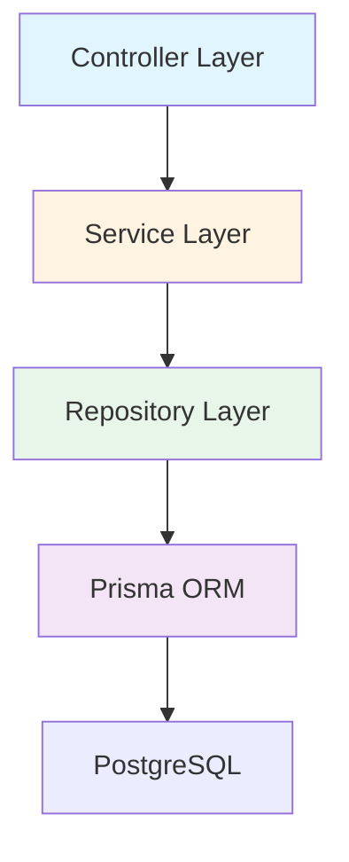
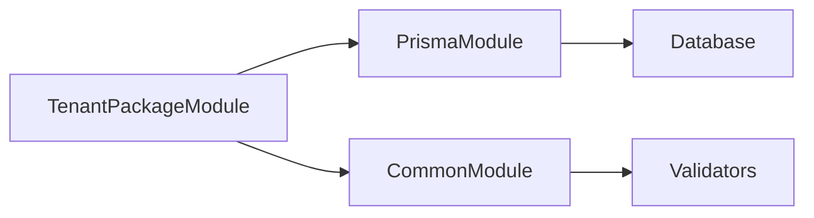
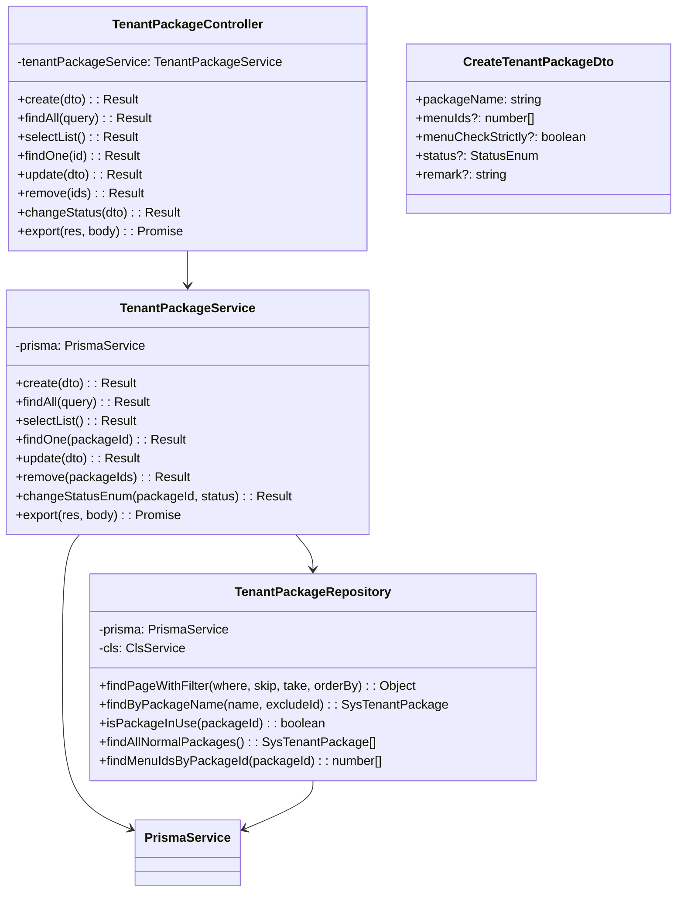
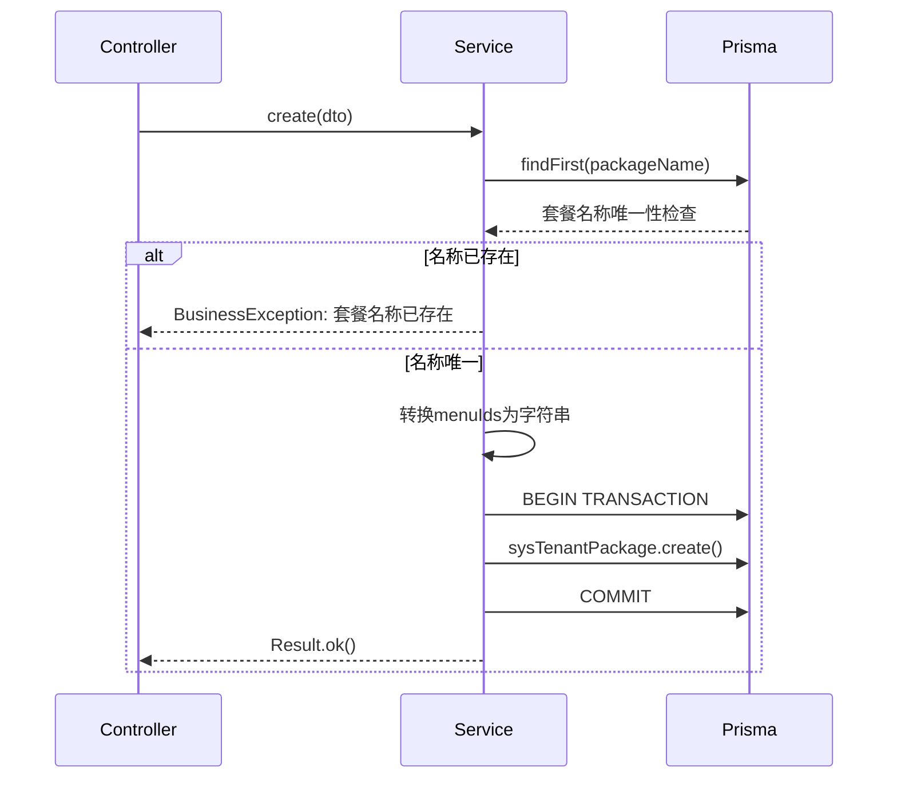
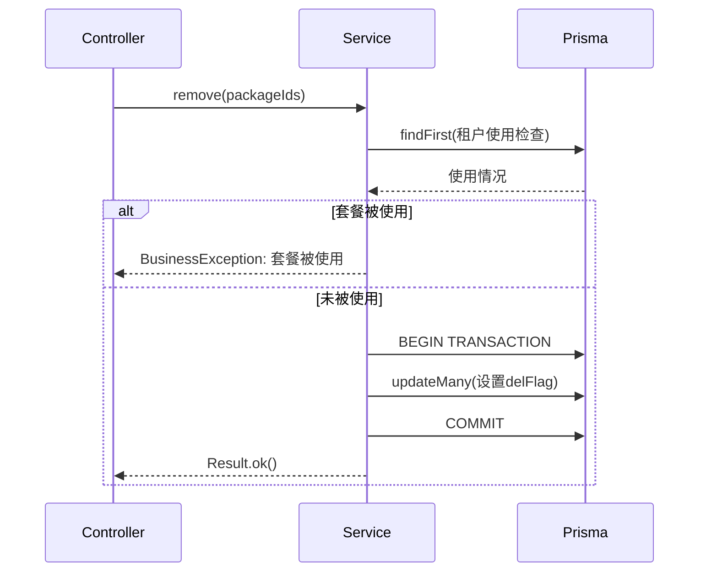
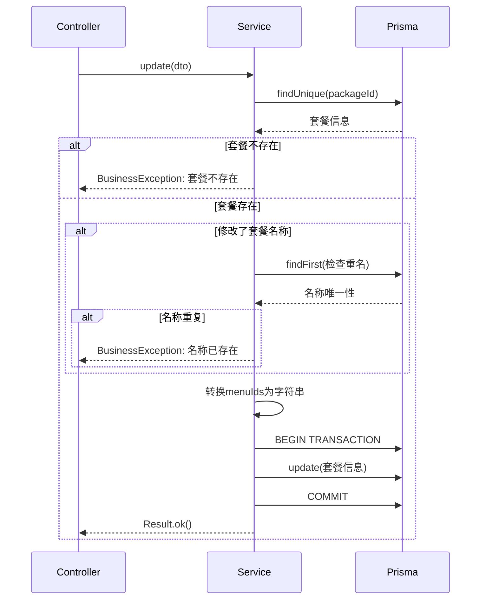
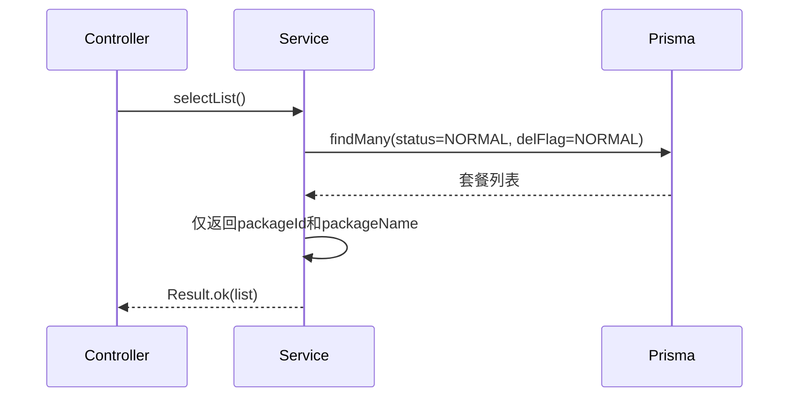
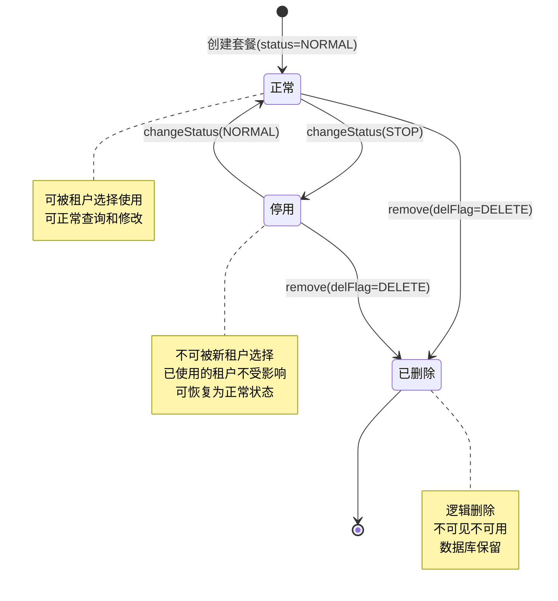
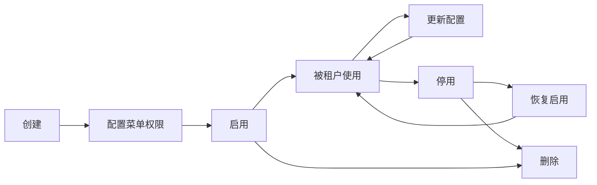
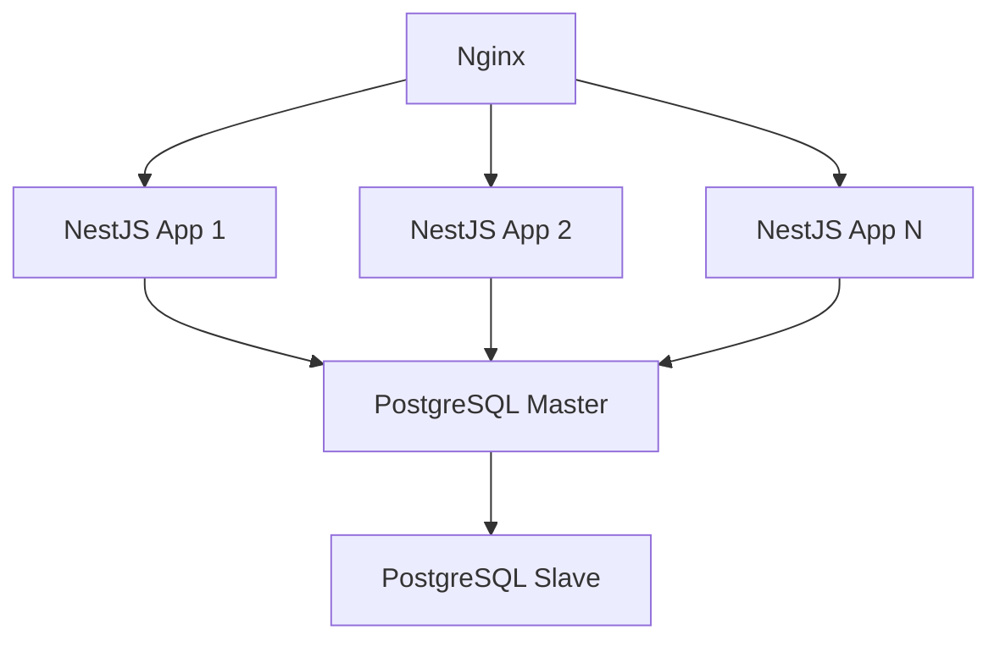

# 租户套餐管理模块设计文档

## 1. 概述

### 1.1 模块简介

租户套餐管理模块是多租户SaaS系统的权限管理核心，负责套餐的全生命周期管理、菜单权限配置以及套餐使用情况追踪。该模块采用Repository模式、事务管理、软删除等设计模式，确保数据一致性和业务安全性。

### 1.2 设计目标

- 实现套餐的灵活配置和管理
- 支持菜单权限的批量配置
- 确保套餐删除的安全性（检查使用情况）
- 提供高效的套餐查询和选择功能
- 保证数据一致性和事务完整性

### 1.3 技术栈

- NestJS框架
- Prisma ORM
- PostgreSQL数据库
- class-validator数据验证
- nestjs-cls上下文管理

## 2. 架构设计

### 2.1 分层架构



### 2.2 模块依赖关系



### 2.3 核心组件

| 组件                    | 职责     | 说明                                   |
| ----------------------- | -------- | -------------------------------------- |
| TenantPackageController | 接口层   | 处理HTTP请求，权限验证，参数验证       |
| TenantPackageService    | 业务层   | 实现业务逻辑，事务管理，调用Repository |
| TenantPackageRepository | 数据层   | 封装数据访问，提供通用查询方法         |
| CreateTenantPackageDto  | 数据传输 | 创建套餐请求参数                       |
| UpdateTenantPackageDto  | 数据传输 | 更新套餐请求参数                       |
| ListTenantPackageDto    | 数据传输 | 查询套餐列表参数                       |
| TenantPackageVo         | 视图对象 | 套餐详情返回数据                       |

## 3. 类设计

### 3.1 类图



### 3.2 核心类说明

#### 3.2.1 TenantPackageController

职责：处理租户套餐管理相关的HTTP请求

关键方法：

- create: 创建套餐，使用@Operlog记录操作日志
- findAll: 分页查询套餐列表
- selectList: 获取套餐选择框列表（无权限要求）
- update: 更新套餐信息
- remove: 批量软删除套餐
- changeStatus: 修改套餐状态
- export: 导出套餐数据为Excel

装饰器：

- @ApiTags: API文档分组
- @Controller: 路由前缀
- @ApiBearerAuth: JWT认证
- @RequirePermission: 权限验证
- @Operlog: 操作日志

#### 3.2.2 TenantPackageService

职责：实现租户套餐管理的核心业务逻辑

关键方法：

- create: 创建套餐，验证名称唯一性，使用@Transactional确保事务
- findAll: 分页查询，状态转换为前端格式
- selectList: 查询正常状态套餐，用于下拉选择
- update: 更新套餐，验证名称唯一性
- remove: 删除套餐，检查使用情况
- changeStatusEnum: 修改套餐状态
- export: 导出Excel

装饰器：

- @Injectable: 依赖注入
- @IgnoreTenant: 忽略租户隔离
- @Transactional: 事务管理

#### 3.2.3 TenantPackageRepository

职责：封装租户套餐数据访问逻辑

特点：

- 继承SoftDeleteRepository，支持软删除
- 使用ClsService获取事务上下文
- 提供通用查询方法
- 支持套餐使用情况检查

关键方法：

- findPageWithFilter: 分页查询
- findByPackageName: 按名称查询（支持排除指定ID）
- isPackageInUse: 检查套餐是否被租户使用
- findAllNormalPackages: 查询所有正常状态套餐
- findMenuIdsByPackageId: 查询套餐关联的菜单ID列表

## 4. 核心流程序列图

### 4.1 创建套餐流程



### 4.2 删除套餐流程



### 4.3 更新套餐流程



### 4.4 查询套餐选择框列表流程



## 5. 状态和流转

### 5.1 套餐状态机



### 5.2 套餐生命周期流转



## 6. 接口/数据契约

### 6.1 DTO定义

#### 6.1.1 CreateTenantPackageDto

```typescript
class CreateTenantPackageDto {
  packageName: string; // 套餐名称（必填，1-50字符）
  menuIds?: number[]; // 关联的菜单ID列表
  menuCheckStrictly?: boolean; // 菜单树选择项是否关联显示
  status?: StatusEnum; // 状态（默认NORMAL）
  remark?: string; // 备注（0-500字符）
}
```

#### 6.1.2 UpdateTenantPackageDto

```typescript
class UpdateTenantPackageDto {
  packageId: number; // 套餐ID（必填）
  packageName?: string; // 套餐名称
  menuIds?: number[]; // 关联的菜单ID列表
  menuCheckStrictly?: boolean; // 菜单树选择项是否关联显示
  status?: StatusEnum; // 状态
  remark?: string; // 备注
}
```

#### 6.1.3 ListTenantPackageDto

```typescript
class ListTenantPackageDto extends PageQueryDto {
  packageName?: string; // 套餐名称（模糊查询）
  status?: StatusEnum; // 状态
}
```

### 6.2 VO定义

#### 6.2.1 TenantPackageVo

```typescript
interface TenantPackageVo {
  packageId: number;
  packageName: string;
  menuIds: string; // 逗号分隔的菜单ID字符串
  menuCheckStrictly: boolean;
  status: string; // "0"正常 "1"停用
  createTime: string;
  remark: string;
}
```

#### 6.2.2 TenantPackageSelectVo

```typescript
interface TenantPackageSelectVo {
  packageId: number;
  packageName: string;
}
```

### 6.3 数据库模型

#### 6.3.1 SysTenantPackage

```prisma
model SysTenantPackage {
  packageId         Int       @id @default(autoincrement())
  packageName       String
  menuIds           String?
  menuCheckStrictly Boolean   @default(false)
  status            Status    @default(NORMAL)
  delFlag           DelFlag   @default(NORMAL)
  createBy          String
  createTime        DateTime
  updateBy          String
  updateTime        DateTime
  remark            String?
}
```

## 7. 数据库设计

### 7.1 表结构

#### 7.1.1 sys_tenant_package（租户套餐表）

| 字段                | 类型         | 约束                       | 说明                         |
| ------------------- | ------------ | -------------------------- | ---------------------------- |
| package_id          | INT          | PK, AUTO_INCREMENT         | 套餐ID                       |
| package_name        | VARCHAR(50)  | NOT NULL                   | 套餐名称                     |
| menu_ids            | TEXT         | NULL                       | 关联的菜单ID列表（逗号分隔） |
| menu_check_strictly | BOOLEAN      | NOT NULL, DEFAULT false    | 菜单树选择项是否关联显示     |
| status              | ENUM         | NOT NULL, DEFAULT 'NORMAL' | 状态                         |
| del_flag            | ENUM         | NOT NULL, DEFAULT 'NORMAL' | 删除标志                     |
| create_by           | VARCHAR(64)  | NOT NULL                   | 创建者                       |
| create_time         | TIMESTAMP    | NOT NULL                   | 创建时间                     |
| update_by           | VARCHAR(64)  | NOT NULL                   | 更新者                       |
| update_time         | TIMESTAMP    | NOT NULL                   | 更新时间                     |
| remark              | VARCHAR(500) | NULL                       | 备注                         |

索引：

- PRIMARY KEY (package_id)
- INDEX (del_flag)
- INDEX (status)
- INDEX (package_name)

### 7.2 索引设计

| 表                 | 索引名           | 字段         | 类型 | 说明           |
| ------------------ | ---------------- | ------------ | ---- | -------------- |
| sys_tenant_package | PRIMARY          | package_id   | 主键 | 主键索引       |
| sys_tenant_package | IDX_del_flag     | del_flag     | 普通 | 软删除查询优化 |
| sys_tenant_package | IDX_status       | status       | 普通 | 状态查询优化   |
| sys_tenant_package | IDX_package_name | package_name | 普通 | 名称查询优化   |

### 7.3 数据库优化策略

1. 查询优化
   - 在delFlag、status、packageName字段上建立索引
   - 分页查询限制offset ≤ 5000
   - 使用事务确保查询一致性

2. 写入优化
   - 使用事务确保数据一致性
   - 批量删除使用updateMany
   - 创建和更新前验证唯一性

3. 数据完整性
   - 删除前检查套餐使用情况
   - 使用软删除保留历史数据
   - menuIds格式统一（逗号分隔字符串）

## 8. 安全设计

### 8.1 权限控制

| 接口       | 权限                        | 说明           |
| ---------- | --------------------------- | -------------- |
| 创建套餐   | system:tenantPackage:add    | 仅超级管理员   |
| 查询套餐   | system:tenantPackage:list   | 仅超级管理员   |
| 套餐详情   | system:tenantPackage:query  | 仅超级管理员   |
| 更新套餐   | system:tenantPackage:edit   | 仅超级管理员   |
| 删除套餐   | system:tenantPackage:remove | 仅超级管理员   |
| 修改状态   | system:tenantPackage:edit   | 仅超级管理员   |
| 导出数据   | system:tenantPackage:export | 仅超级管理员   |
| 选择框列表 | 无                          | 所有已登录用户 |

### 8.2 数据隔离

- 所有接口使用@IgnoreTenant装饰器，忽略租户隔离
- 接口类型标记为PlatformOnly
- 仅超级管理员可管理套餐
- 套餐数据全局共享，不按租户隔离

### 8.3 数据验证

- 使用class-validator验证输入参数
- 套餐名称长度验证（1-50字符）
- 状态枚举值验证
- menuIds数组类型验证

### 8.4 业务安全

- 删除前检查套餐使用情况
- 名称唯一性验证
- 使用软删除避免数据丢失
- 事务确保数据一致性

## 9. 性能优化

### 9.1 查询优化

1. 索引优化

```typescript
// 在常用查询字段上建立索引
@@index([delFlag])
@@index([status])
@@index([packageName])
```

2. 分页优化

```typescript
// 限制分页深度
if (query.skip > 5000) {
  throw new BusinessException(ResponseCode.BAD_REQUEST, '分页深度超限');
}
```

3. 选择框列表优化

```typescript
// 仅查询必要字段
select: {
  packageId: true,
  packageName: true,
}
```

### 9.2 写入优化

1. 事务优化

```typescript
// 使用@Transactional装饰器
@Transactional()
async create(dto: CreateTenantPackageDto) {
  // 事务内操作
}
```

2. 批量删除优化

```typescript
// 使用updateMany批量更新
await this.prisma.sysTenantPackage.updateMany({
  where: { packageId: { in: packageIds } },
  data: { delFlag: DelFlagEnum.DELETE },
});
```

### 9.3 性能指标

| 指标         | 目标          | 说明               |
| ------------ | ------------- | ------------------ |
| 接口响应时间 | P99 < 1000ms  | 后台管理级别       |
| 并发支持     | 50 QPS        | 套餐管理为低频操作 |
| 分页查询     | offset ≤ 5000 | 超限抛错           |
| 套餐使用检查 | < 100ms       | 单次查询           |

## 10. 监控与日志

### 10.1 日志记录

1. 关键操作日志

```typescript
this.logger.log(`创建套餐: ${packageName}`);
this.logger.log(`删除套餐: ${packageIds.join(',')}`);
this.logger.error('创建套餐失败', error);
```

2. 日志级别

- INFO: 正常操作（创建、更新、删除）
- WARN: 警告信息（套餐被使用）
- ERROR: 错误信息（创建失败、更新失败）

3. 日志内容

- 操作类型
- 套餐ID/名称
- 操作结果
- 错误堆栈

### 10.2 操作日志

使用@Operlog装饰器记录操作日志：

```typescript
@Operlog({ businessType: BusinessType.INSERT })
@Post('/')
create(@Body() dto: CreateTenantPackageDto) {
  return this.tenantPackageService.create(dto);
}
```

### 10.3 监控指标

| 指标           | 说明                 | 告警阈值 |
| -------------- | -------------------- | -------- |
| 接口响应时间   | P99延迟              | > 2000ms |
| 接口错误率     | 错误请求比例         | > 1%     |
| 套餐创建失败率 | 创建失败比例         | > 5%     |
| 套餐使用率     | 被租户使用的套餐比例 | < 20%    |

### 10.4 审计日志

- 记录所有套餐管理操作
- 记录套餐状态变更
- 记录套餐删除操作
- 保留操作人、操作时间、操作内容

## 11. 扩展性设计

### 11.1 菜单权限扩展

1. 菜单ID存储

- 当前：逗号分隔字符串
- 扩展：支持JSON格式存储更多信息

2. 权限粒度

- 当前：菜单级别
- 扩展：支持功能点级别、数据权限级别

### 11.2 套餐功能扩展

1. 商业化支持

- 添加套餐价格字段
- 添加套餐有效期字段
- 添加套餐试用期字段

2. 套餐升级

- 支持套餐升级和降级
- 支持套餐变更历史记录
- 支持套餐变更影响分析

### 11.3 统计分析扩展

1. 使用统计

- 统计每个套餐的使用租户数
- 统计套餐的创建和使用趋势
- 提供套餐使用报表

2. 权限分析

- 分析套餐权限覆盖情况
- 分析菜单使用频率
- 提供权限优化建议

## 12. 部署架构

### 12.1 部署拓扑



### 12.2 高可用设计

1. 应用层

- 多实例部署
- 负载均衡
- 健康检查

2. 数据库层

- 主从复制
- 读写分离
- 自动故障转移

### 12.3 扩展策略

1. 水平扩展

- 增加应用实例
- 数据库分片（如需要）

2. 垂直扩展

- 增加服务器资源
- 优化数据库配置

## 13. 测试策略

### 13.1 单元测试

测试范围：

- TenantPackageService所有方法
- TenantPackageRepository所有方法
- 套餐名称唯一性验证
- menuIds数组与字符串转换
- 套餐使用情况检查

测试工具：

- Jest测试框架
- Mock Prisma客户端

### 13.2 集成测试

测试范围：

- 创建套餐完整流程
- 更新套餐完整流程
- 删除套餐完整流程（包括使用检查）
- 修改套餐状态流程
- 查询套餐选择框列表

测试环境：

- 测试数据库
- 测试数据准备

### 13.3 性能测试

测试场景：

- 批量创建套餐
- 分页查询大量套餐
- 套餐使用情况检查
- 并发创建套餐

性能指标：

- 响应时间 < 1000ms
- 吞吐量 > 50 QPS
- 错误率 < 1%

### 13.4 安全测试

测试范围：

- 权限验证
- 参数验证
- SQL注入防护
- 业务规则验证

## 14. 技术债与改进

### 14.1 已识别技术债

| 优先级 | 技术债                            | 影响                 | 计划         |
| ------ | --------------------------------- | -------------------- | ------------ |
| P1     | menuIds仅存储ID，未验证菜单存在性 | 可能关联不存在的菜单 | Sprint 2实现 |
| P2     | 缺少套餐功能点配置                | 仅能控制菜单权限     | Sprint 3实现 |
| P2     | 缺少套餐价格和有效期配置          | 无法支持商业化       | Sprint 4实现 |
| P3     | 缺少套餐使用统计                  | 无法了解套餐使用情况 | Sprint 5实现 |

### 14.2 改进建议

1. 菜单权限管理

- 添加菜单存在性验证
- 支持菜单树结构展示
- 支持菜单权限继承
- 支持功能点级别权限

2. 商业化支持

- 添加套餐价格配置
- 添加套餐有效期配置
- 支持套餐试用期
- 支持套餐升级和降级

3. 统计分析

- 统计套餐使用情况
- 分析权限覆盖情况
- 提供优化建议
- 生成使用报表

4. 性能优化

- 优化套餐使用检查性能
- 添加缓存机制
- 优化分页查询
- 添加异步处理

## 15. 版本历史

| 版本 | 日期       | 作者   | 变更说明                   |
| ---- | ---------- | ------ | -------------------------- |
| 1.0  | 2026-02-22 | System | 初始版本，包含完整设计文档 |
