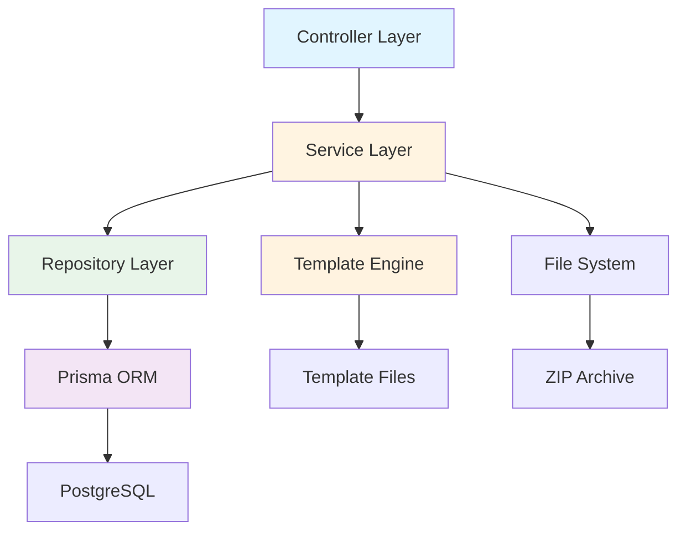
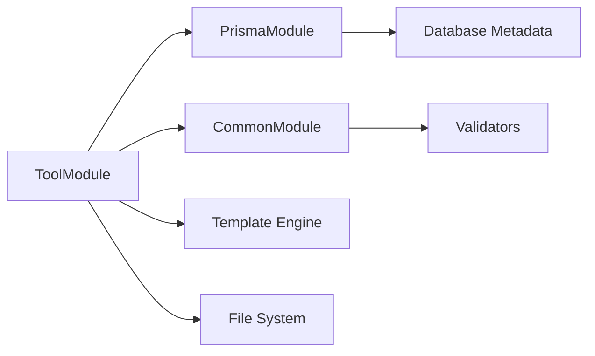
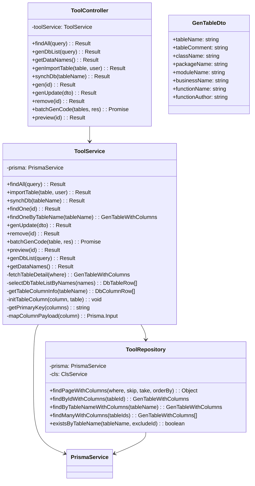
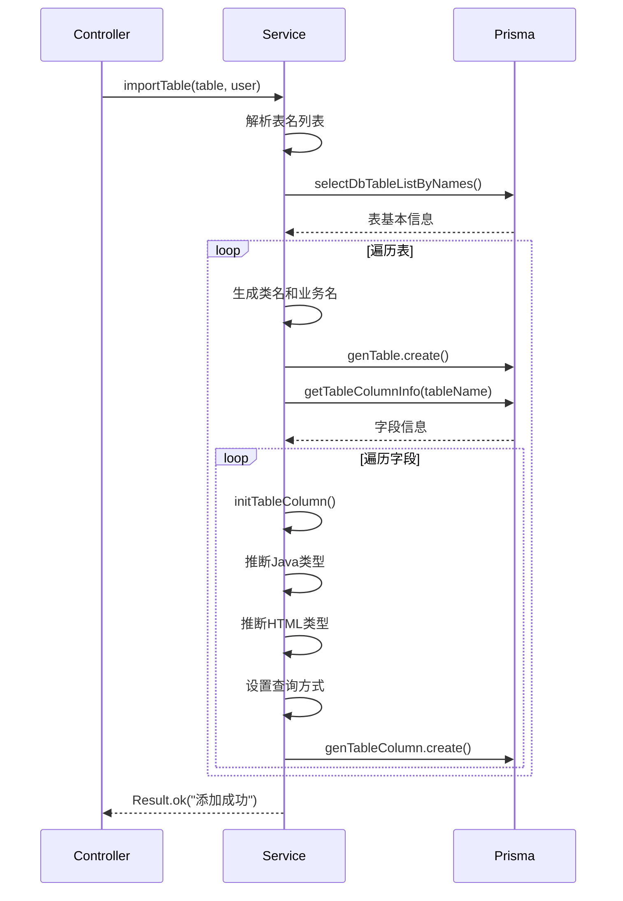
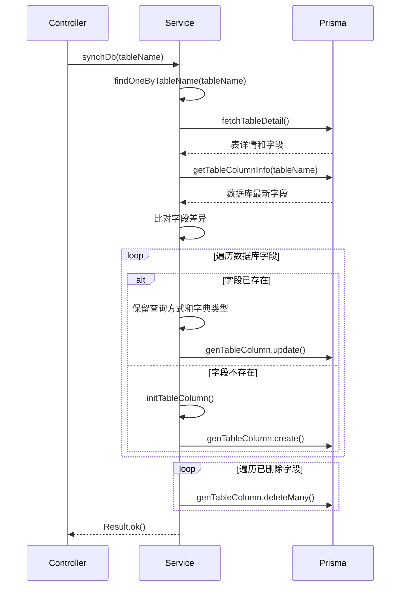
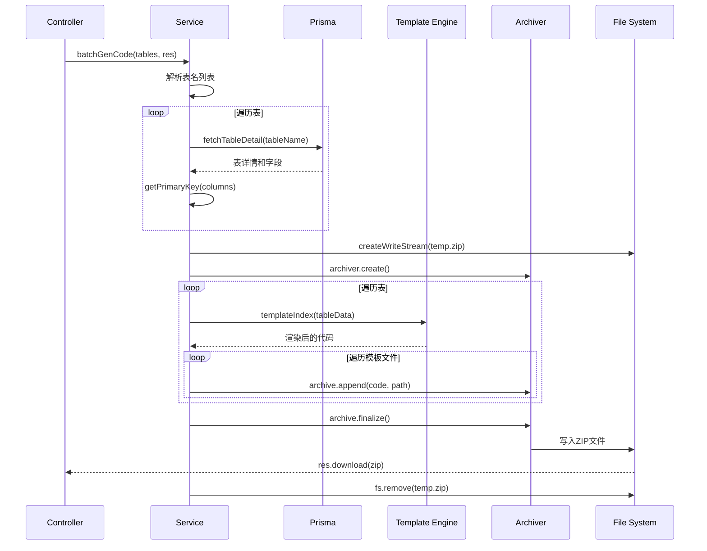
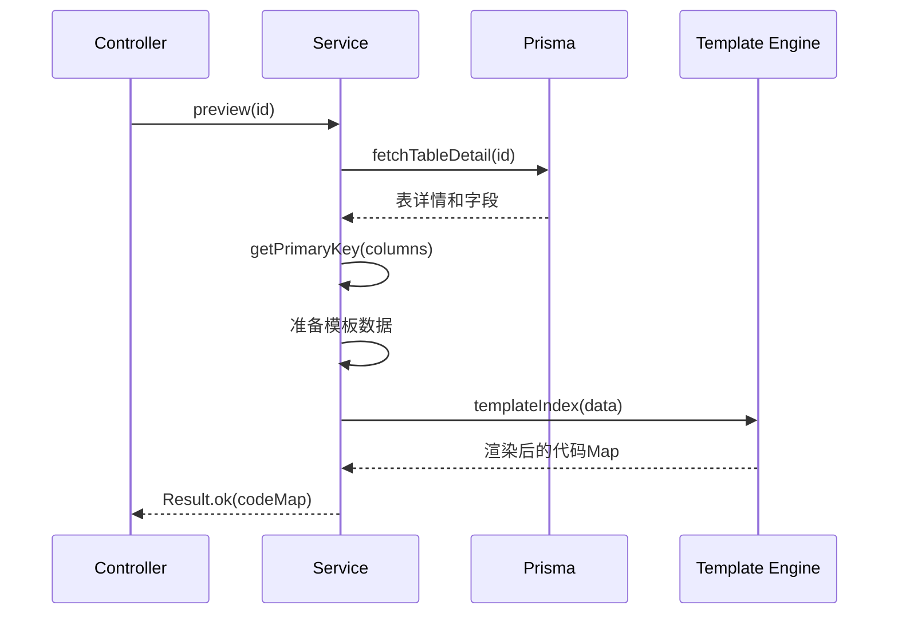
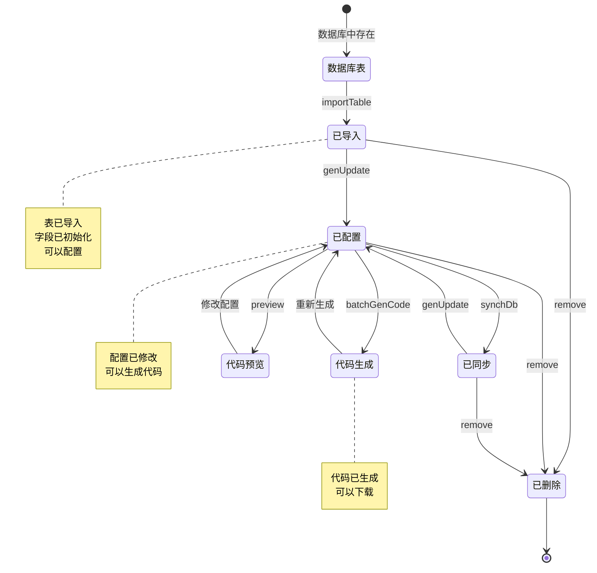
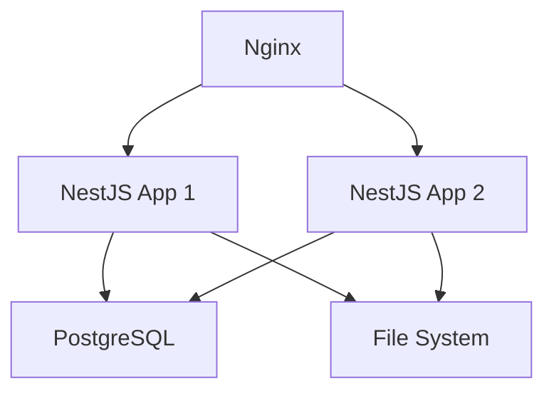

# 代码生成工具模块设计文档

## 1. 概述

### 1.1 模块简介

代码生成工具模块是一个基于数据库表结构的自动化代码生成系统，采用模板引擎技术，能够根据配置生成标准的CRUD代码。该模块使用Repository模式、事务管理、模板渲染等设计模式，确保代码生成的准确性和一致性。

### 1.2 设计目标

- 实现数据库表结构的自动解析和导入
- 支持灵活的字段配置和类型映射
- 提供高效的代码模板渲染引擎
- 确保生成代码的规范性和可用性
- 支持批量生成和打包下载
- 保证数据一致性和事务完整性

### 1.3 技术栈

- NestJS框架
- Prisma ORM（数据库访问和元数据查询）
- PostgreSQL数据库
- archiver（ZIP文件打包）
- fs-extra（文件系统操作）
- lodash（工具函数）
- 自定义模板引擎

## 2. 架构设计

### 2.1 分层架构



### 2.2 模块依赖关系



### 2.3 核心组件

| 组件             | 职责       | 说明                             |
| ---------------- | ---------- | -------------------------------- |
| ToolController   | 接口层     | 处理HTTP请求，参数验证           |
| ToolService      | 业务层     | 实现业务逻辑，模板渲染，文件打包 |
| ToolRepository   | 数据层     | 封装数据访问，提供查询方法       |
| TemplateEngine   | 模板引擎   | 渲染代码模板                     |
| MetadataParser   | 元数据解析 | 解析数据库表结构                 |
| TypeMapper       | 类型映射   | 数据库类型到Java类型映射         |
| FieldInitializer | 字段初始化 | 初始化字段配置                   |

## 3. 类设计

### 3.1 类图



### 3.2 核心类说明

#### 3.2.1 ToolController

职责：处理代码生成工具相关的HTTP请求

关键方法：

- findAll: 查询已导入表列表
- genDbList: 查询数据库表列表
- genImportTable: 导入表，使用@Operlog记录操作
- synchDb: 同步表结构
- genUpdate: 修改生成配置
- batchGenCode: 批量生成代码并打包
- preview: 预览生成代码
- remove: 删除表

装饰器：

- @ApiTags: API文档分组
- @Controller: 路由前缀
- @ApiBearerAuth: JWT认证
- @Operlog: 操作日志

#### 3.2.2 ToolService

职责：实现代码生成的核心业务逻辑

关键方法：

- importTable: 导入表，初始化字段配置
- synchDb: 同步表结构，比对字段差异
- batchGenCode: 批量生成代码，使用archiver打包
- preview: 预览生成代码
- initTableColumn: 初始化字段配置（类型推断、HTML类型推断）
- fetchTableDetail: 查询表详情（包含字段）
- selectDbTableListByNames: 查询数据库表信息
- getTableColumnInfo: 查询数据库表字段信息
- getPrimaryKey: 查找主键字段

特点：

- 使用Prisma原生SQL查询数据库元数据
- 使用模板引擎渲染代码
- 使用archiver打包ZIP文件
- 使用@Transactional确保事务

#### 3.2.3 ToolRepository

职责：封装代码生成表数据访问逻辑

特点：

- 继承SoftDeleteRepository
- 提供带字段信息的查询方法
- 支持批量查询

关键方法：

- findByIdWithColumns: 查询表详情（包含字段）
- findByTableNameWithColumns: 根据表名查询
- findManyWithColumns: 批量查询
- existsByTableName: 检查表名是否存在

## 4. 核心流程序列图

### 4.1 导入表流程



### 4.2 同步表结构流程



### 4.3 批量生成代码流程



### 4.4 预览生成代码流程



## 5. 状态和流转

### 5.1 表导入和生成流程



## 6. 接口/数据契约

### 6.1 DTO定义

#### 6.1.1 TableName

```typescript
class TableName {
  tableNames: string; // 表名列表（逗号分隔）
}
```

#### 6.1.2 GenTableList

```typescript
class GenTableList extends PageQueryDto {
  tableNames?: string; // 表名（模糊查询）
  tableComment?: string; // 表注释（模糊查询）
}
```

#### 6.1.3 GenDbTableList

```typescript
class GenDbTableList extends PageQueryDto {
  tableName?: string; // 表名（模糊查询）
  tableComment?: string; // 表注释（模糊查询）
}
```

#### 6.1.4 GenTableUpdate

```typescript
class GenTableUpdate {
  tableId: number; // 表ID（必填）
  tableName?: string; // 表名
  tableComment?: string; // 表注释
  className?: string; // 类名
  functionAuthor?: string; // 作者
  remark?: string; // 备注
  tplCategory?: string; // 模板类型
  packageName?: string; // 包路径
  moduleName?: string; // 模块名
  businessName?: string; // 业务名
  functionName?: string; // 功能名
  genType?: string; // 生成方式
  tplWebType?: string; // 前端模板类型
  columns?: GenTableColumnUpdate[]; // 字段配置
}
```

#### 6.1.5 GenTableColumnUpdate

```typescript
class GenTableColumnUpdate {
  columnId: number; // 字段ID（必填）
  columnComment?: string; // 字段注释
  javaType?: string; // Java类型
  javaField?: string; // Java字段名
  isInsert?: string; // 是否插入
  isEdit?: string; // 是否编辑
  isList?: string; // 是否列表
  isQuery?: string; // 是否查询
  queryType?: string; // 查询方式
  isRequired?: string; // 是否必填
  htmlType?: string; // HTML类型
  dictType?: string; // 字典类型
}
```

### 6.2 内部数据结构

#### 6.2.1 DbTableRow

```typescript
type DbTableRow = {
  tableName: string; // 表名
  tableComment: string | null; // 表注释
  createTime: Date | null; // 创建时间
  updateTime: Date | null; // 更新时间
};
```

#### 6.2.2 DbColumnRow

```typescript
type DbColumnRow = {
  columnName: string; // 列名
  columnComment: string | null; // 列注释
  columnType: string; // 列类型
  columnDefault: string | null; // 默认值
  isRequired: string; // 是否必填（1是 0否）
  isPk: string; // 是否主键（1是 0否）
  isIncrement: string; // 是否自增（1是 0否）
  sort: number; // 排序
};
```

#### 6.2.3 GenTableWithColumns

```typescript
type GenTableWithColumns = GenTable & {
  columns: GenTableColumn[]; // 字段列表
};
```

### 6.3 数据库模型

#### 6.3.1 GenTable

```prisma
model GenTable {
  tableId         Int       @id @default(autoincrement())
  tableName       String
  tableComment    String?
  className       String
  packageName     String
  moduleName      String
  businessName    String
  functionName    String
  functionAuthor  String
  genType         String
  genPath         String?
  tplCategory     String
  tplWebType      String
  options         String?
  status          Status
  delFlag         DelFlag
  createBy        String
  createTime      DateTime
  updateBy        String
  updateTime      DateTime
  remark          String?

  columns         GenTableColumn[]
}
```

#### 6.3.2 GenTableColumn

```prisma
model GenTableColumn {
  columnId      Int       @id @default(autoincrement())
  tableId       Int
  columnName    String
  columnComment String?
  columnType    String
  javaType      String
  javaField     String
  isPk          String
  isIncrement   String
  isRequired    String
  isInsert      String
  isEdit        String
  isList        String
  isQuery       String
  queryType     String
  htmlType      String
  dictType      String?
  columnDefault String?
  sort          Int
  status        Status
  delFlag       DelFlag
  createBy      String
  createTime    DateTime
  updateBy      String
  updateTime    DateTime
  remark        String?

  table         GenTable  @relation(fields: [tableId], references: [tableId])
}
```

## 7. 数据库设计

### 7.1 表结构

#### 7.1.1 gen_table（代码生成表）

| 字段            | 类型          | 约束                       | 说明         |
| --------------- | ------------- | -------------------------- | ------------ |
| table_id        | INT           | PK, AUTO_INCREMENT         | 表ID         |
| table_name      | VARCHAR(200)  | NOT NULL                   | 表名称       |
| table_comment   | VARCHAR(500)  | NULL                       | 表注释       |
| class_name      | VARCHAR(100)  | NOT NULL                   | 实体类名称   |
| package_name    | VARCHAR(100)  | NOT NULL                   | 生成包路径   |
| module_name     | VARCHAR(30)   | NOT NULL                   | 生成模块名   |
| business_name   | VARCHAR(30)   | NOT NULL                   | 生成业务名   |
| function_name   | VARCHAR(50)   | NOT NULL                   | 生成功能名   |
| function_author | VARCHAR(50)   | NOT NULL                   | 生成功能作者 |
| gen_type        | CHAR(1)       | NOT NULL, DEFAULT '0'      | 生成代码方式 |
| gen_path        | VARCHAR(200)  | NULL, DEFAULT '/'          | 生成路径     |
| tpl_category    | VARCHAR(200)  | NOT NULL, DEFAULT 'crud'   | 使用的模板   |
| tpl_web_type    | VARCHAR(30)   | NOT NULL                   | 前端模板类型 |
| options         | VARCHAR(1000) | NULL                       | 其他生成选项 |
| status          | ENUM          | NOT NULL, DEFAULT 'NORMAL' | 状态         |
| del_flag        | ENUM          | NOT NULL, DEFAULT 'NORMAL' | 删除标志     |
| create_by       | VARCHAR(64)   | NOT NULL                   | 创建者       |
| create_time     | TIMESTAMP     | NOT NULL                   | 创建时间     |
| update_by       | VARCHAR(64)   | NOT NULL                   | 更新者       |
| update_time     | TIMESTAMP     | NOT NULL                   | 更新时间     |
| remark          | VARCHAR(500)  | NULL                       | 备注         |

索引：

- PRIMARY KEY (table_id)
- INDEX (table_name)
- INDEX (del_flag)

#### 7.1.2 gen_table_column（代码生成表字段）

| 字段           | 类型         | 约束                       | 说明           |
| -------------- | ------------ | -------------------------- | -------------- |
| column_id      | INT          | PK, AUTO_INCREMENT         | 字段ID         |
| table_id       | INT          | NOT NULL                   | 归属表ID       |
| column_name    | VARCHAR(200) | NOT NULL                   | 列名称         |
| column_comment | VARCHAR(500) | NULL                       | 列描述         |
| column_type    | VARCHAR(100) | NOT NULL                   | 列类型         |
| java_type      | VARCHAR(500) | NOT NULL                   | Java类型       |
| java_field     | VARCHAR(200) | NOT NULL                   | Java字段名     |
| is_pk          | CHAR(1)      | NOT NULL                   | 是否主键       |
| is_increment   | CHAR(1)      | NOT NULL                   | 是否自增       |
| is_required    | CHAR(1)      | NOT NULL                   | 是否必填       |
| is_insert      | CHAR(1)      | NOT NULL                   | 是否为插入字段 |
| is_edit        | CHAR(1)      | NOT NULL                   | 是否编辑字段   |
| is_list        | CHAR(1)      | NOT NULL                   | 是否列表字段   |
| is_query       | CHAR(1)      | NOT NULL                   | 是否查询字段   |
| query_type     | VARCHAR(200) | NOT NULL, DEFAULT 'EQ'     | 查询方式       |
| html_type      | VARCHAR(200) | NOT NULL                   | 显示类型       |
| dict_type      | VARCHAR(200) | NULL                       | 字典类型       |
| column_default | VARCHAR(500) | NULL                       | 列默认值       |
| sort           | INT          | NOT NULL                   | 排序           |
| status         | ENUM         | NOT NULL, DEFAULT 'NORMAL' | 状态           |
| del_flag       | ENUM         | NOT NULL, DEFAULT 'NORMAL' | 删除标志       |
| create_by      | VARCHAR(64)  | NOT NULL                   | 创建者         |
| create_time    | TIMESTAMP    | NOT NULL                   | 创建时间       |
| update_by      | VARCHAR(64)  | NOT NULL                   | 更新者         |
| update_time    | TIMESTAMP    | NOT NULL                   | 更新时间       |
| remark         | VARCHAR(500) | NULL                       | 备注           |

索引：

- PRIMARY KEY (column_id)
- INDEX (table_id)
- FOREIGN KEY (table_id) REFERENCES gen_table(table_id)

### 7.2 元数据查询SQL

#### 7.2.1 查询表信息

```sql
SELECT
  t.table_name AS "tableName",
  obj_description((quote_ident(t.table_schema) || '.' || quote_ident(t.table_name))::regclass) AS "tableComment",
  NOW() AS "createTime",
  NOW() AS "updateTime"
FROM information_schema.tables t
WHERE t.table_schema = current_schema()
  AND t.table_type = 'BASE TABLE'
  AND t.table_name NOT LIKE 'qrtz_%'
  AND t.table_name NOT LIKE 'gen_%'
  AND NOT EXISTS (SELECT 1 FROM gen_table gt WHERE gt.table_name = t.table_name AND gt.del_flag = '0')
  AND t.table_name IN (?)
```

#### 7.2.2 查询字段信息

```sql
WITH pk_columns AS (
  SELECT k.column_name
  FROM information_schema.table_constraints tc
  JOIN information_schema.key_column_usage k
    ON tc.constraint_name = k.constraint_name
  WHERE tc.table_schema = current_schema()
    AND tc.table_name = ?
    AND tc.constraint_type = 'PRIMARY KEY'
)
SELECT
  c.column_name AS "columnName",
  CASE WHEN c.is_nullable = 'NO' AND c.column_default IS NULL THEN '1' ELSE '0' END AS "isRequired",
  CASE WHEN c.column_name IN (SELECT column_name FROM pk_columns) THEN '1' ELSE '0' END AS "isPk",
  c.ordinal_position AS "sort",
  COALESCE(col_description((quote_ident(c.table_schema) || '.' || quote_ident(c.table_name))::regclass, c.ordinal_position)::text, c.column_name) AS "columnComment",
  c.column_default AS "columnDefault",
  CASE WHEN c.is_identity = 'YES' OR c.column_default LIKE 'nextval%' THEN '1' ELSE '0' END AS "isIncrement",
  c.data_type AS "columnType"
FROM information_schema.columns c
WHERE c.table_schema = current_schema()
  AND c.table_name = ?
ORDER BY c.ordinal_position
```

## 8. 安全设计

### 8.1 权限控制

- 所有接口需要登录认证
- 使用@ApiBearerAuth验证JWT token
- 使用@Operlog记录关键操作

### 8.2 SQL注入防护

- 使用Prisma参数化查询
- 使用Prisma.sql模板标签
- 不直接拼接SQL字符串

### 8.3 文件安全

- 临时文件使用唯一名称
- 下载完成后立即删除临时文件
- 限制ZIP文件大小
- 验证文件路径，防止路径遍历

### 8.4 数据验证

- 使用class-validator验证输入参数
- 验证表名和字段名格式
- 限制批量操作数量

## 9. 性能优化

### 9.1 查询优化

1. 批量查询表信息

```typescript
// 使用IN查询批量获取表信息
const tableSql = Prisma.join(tableNames.map((name) => Prisma.sql`${name}`));
return this.prisma.$queryRaw`... WHERE t.table_name IN (${tableSql})`;
```

2. 使用索引

- 在table_name、del_flag字段上建立索引
- 在table_id外键上建立索引

3. 分页查询

- 支持分页，避免一次查询大量数据

### 9.2 生成优化

1. 模板缓存

- 缓存已编译的模板
- 避免重复编译

2. 流式写入

- 使用stream写入ZIP文件
- 避免内存占用过大

3. 异步处理

- 使用异步I/O操作
- 避免阻塞主线程

### 9.3 性能指标

| 指标        | 目标     | 说明               |
| ----------- | -------- | ------------------ |
| 导入表      | < 2秒/表 | 包含字段初始化     |
| 同步表      | < 1秒/表 | 包含字段比对       |
| 生成代码    | < 3秒/表 | 包含模板渲染和打包 |
| ZIP文件大小 | < 10MB   | 单次生成           |

## 10. 监控与日志

### 10.1 日志记录

1. 关键操作日志

```typescript
this.logger.log(`导入表: ${tableNames.join(',')}`);
this.logger.log(`同步表结构: ${tableName}`);
this.logger.log(`生成代码: ${tableNames.join(',')}`);
```

2. 日志级别

- INFO: 正常操作
- WARN: 警告信息
- ERROR: 错误信息

3. 日志内容

- 操作类型
- 表名
- 操作结果
- 错误堆栈

### 10.2 操作日志

使用@Operlog装饰器记录操作日志：

```typescript
@Operlog({ businessType: BusinessType.IMPORT })
@Post('/gen/importTable')
genImportTable(@Body() table: TableName, @User() user: UserDto) {
  return this.toolService.importTable(table, user);
}
```

### 10.3 监控指标

| 指标         | 说明             | 告警阈值 |
| ------------ | ---------------- | -------- |
| 接口响应时间 | P99延迟          | > 5000ms |
| 接口错误率   | 错误请求比例     | > 5%     |
| 导入失败率   | 导入失败比例     | > 10%    |
| 生成失败率   | 生成失败比例     | > 5%     |
| 临时文件数量 | 未清理的临时文件 | > 10     |

## 11. 扩展性设计

### 11.1 多数据库支持

1. 抽象元数据查询接口

```typescript
interface MetadataProvider {
  getTableList(filter): Promise<DbTableRow[]>;
  getColumnList(tableName): Promise<DbColumnRow[]>;
}
```

2. 实现不同数据库的Provider

- PostgreSQLMetadataProvider
- MySQLMetadataProvider
- OracleMetadataProvider

### 11.2 模板管理

1. 模板文件化

- 将模板存储为文件
- 支持模板上传和编辑
- 支持模板版本管理

2. 模板配置

```typescript
interface TemplateConfig {
  name: string;
  category: string;
  files: TemplateFile[];
}
```

### 11.3 类型映射配置

1. 可配置的类型映射

```typescript
const typeMapping = {
  postgresql: {
    varchar: 'String',
    int: 'Number',
    timestamp: 'Date',
  },
  mysql: {
    varchar: 'String',
    int: 'Number',
    datetime: 'Date',
  },
};
```

### 11.4 命名规则配置

1. 可配置的命名规则

```typescript
interface NamingConfig {
  removePrefix: boolean;
  prefixes: string[];
  classNameCase: 'PascalCase' | 'camelCase';
  fieldNameCase: 'camelCase' | 'snake_case';
}
```

## 12. 部署架构

### 12.1 部署拓扑



### 12.2 文件存储

1. 临时文件

- 存储在应用服务器本地
- 使用唯一文件名
- 定期清理过期文件

2. 模板文件

- 存储在应用服务器
- 支持热更新
- 版本控制

## 13. 测试策略

### 13.1 单元测试

测试范围：

- 表名转换逻辑
- 字段名转换逻辑
- Java类型推断
- HTML类型推断
- 查询方式推断
- 字段配置初始化

### 13.2 集成测试

测试范围：

- 导入表完整流程
- 同步表结构完整流程
- 生成代码完整流程
- 预览代码完整流程

### 13.3 性能测试

测试场景：

- 批量导入100张表
- 同步大表（100+字段）
- 批量生成50张表
- 并发生成代码

## 14. 技术债与改进

### 14.1 已识别技术债

| 优先级 | 技术债                   | 影响               | 计划                     |
| ------ | ------------------------ | ------------------ | ------------------------ |
| P1     | 模板硬编码在代码中       | 无法自定义模板     | Sprint 2实现模板文件化   |
| P2     | 仅支持PostgreSQL         | 无法支持其他数据库 | Sprint 3实现多数据库支持 |
| P2     | 临时文件清理依赖下载完成 | 可能产生垃圾文件   | Sprint 3实现定时清理     |
| P3     | 缺少生成历史记录         | 无法追溯           | Sprint 4实现             |

### 14.2 改进建议

1. 模板管理

- 实现模板文件化
- 支持模板在线编辑
- 支持模板版本管理
- 支持模板市场

2. 多数据库支持

- 抽象元数据查询接口
- 实现MySQL、Oracle支持
- 支持数据库类型映射配置

3. 代码生成增强

- 支持增量生成
- 支持代码合并
- 支持自定义生成规则
- 支持代码格式化

4. 用户体验优化

- 添加生成进度提示
- 支持在线预览
- 支持代码高亮
- 支持单文件下载

## 15. 版本历史

| 版本 | 日期       | 作者   | 变更说明                                     |
| ---- | ---------- | ------ | -------------------------------------------- |
| 1.0  | 2026-02-22 | System | 初始版本，支持PostgreSQL和NestJS/Vue代码生成 |
