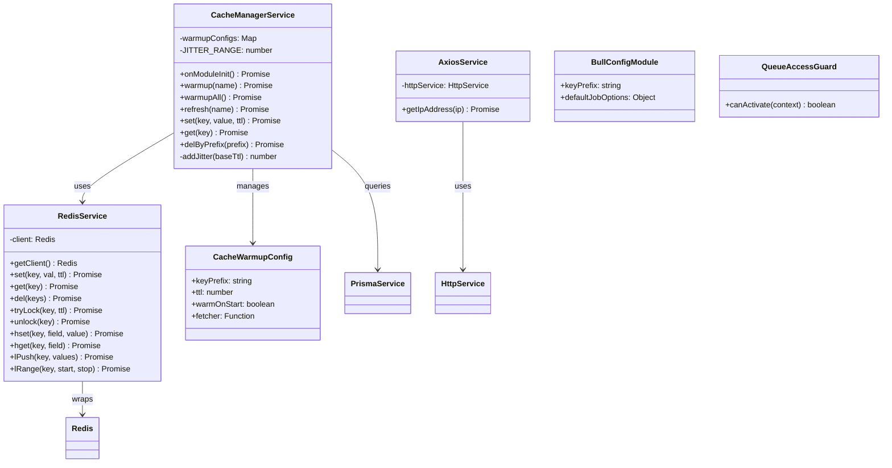

# Common（公共基础设施）模块 — 设计文档

> 版本：1.0
> 日期：2026-02-22
> 模块路径：`src/module/common/`
> 需求文档：[common-requirements.md](../../requirements/common/common-requirements.md)
> 状态：技术方案 + 改进设计

---

## 1. 设计目标与约束

### 1.1 设计目标

1. 提供高性能的缓存能力（P95 < 10ms）
2. 提供可靠的异步任务调度能力（失败重试 3 次）
3. 提供 HTTP 客户端和 IP 地理位置查询能力
4. 支持分布式锁，保证并发安全
5. 支持缓存预热和防雪崩机制
6. 支持任务重试和失败处理
7. 全局导出，无需重复导入

### 1.2 技术约束

| 约束项      | 说明                              |
| ----------- | --------------------------------- |
| 缓存        | Redis（ioredis）                  |
| 队列        | Bull（基于 Redis）                |
| HTTP 客户端 | Axios                             |
| 全局模块    | 使用 @Global() 装饰器             |
| 性能        | 缓存 P95 < 10ms，队列不阻塞主流程 |

### 1.3 性能目标

| 指标     | 目标值     | 说明            |
| -------- | ---------- | --------------- |
| 缓存查询 | P95 < 10ms | Redis 单次查询  |
| 缓存预热 | < 5s       | 应用启动时预热  |
| 任务添加 | P95 < 50ms | 添加任务到队列  |
| 任务执行 | 异步       | 不阻塞主流程    |
| IP 查询  | 3s 超时    | 第三方 API 超时 |

---

## 2. 架构设计

### 2.1 架构组件图

> 图 1：Common 模块架构组件图


**架构说明**：

1. CommonModule 使用 @Global() 装饰器，全局导出
2. Redis 子模块提供缓存和分布式锁能力
3. Bull 子模块提供异步任务调度能力
4. Axios 子模块提供 HTTP 客户端和 IP 查询能力
5. 业务模块直接注入使用，无需重复导入

---

## 3. 数据模型设计

### 3.1 数据模型类图

> 图 2：Common 模块数据模型类图



### 3.2 Redis 数据结构

#### 3.2.1 缓存数据

| Key 格式                 | 类型   | TTL          | 说明            |
| ------------------------ | ------ | ------------ | --------------- |
| `sys:dict:{dictType}`    | String | 24h + Jitter | 字典数据        |
| `sys:config:{configKey}` | String | 1h + Jitter  | 系统配置        |
| `cache:ip:{ip}`          | String | 1h           | IP 地理位置缓存 |
| `lock:{resource}`        | String | 10s          | 分布式锁        |

#### 3.2.2 队列数据

| Key 格式                     | 类型 | 说明       |
| ---------------------------- | ---- | ---------- |
| `bull:{queueName}:jobs`      | Hash | 任务详情   |
| `bull:{queueName}:waiting`   | List | 等待队列   |
| `bull:{queueName}:active`    | List | 执行中队列 |
| `bull:{queueName}:completed` | Set  | 已完成队列 |
| `bull:{queueName}:failed`    | Set  | 失败队列   |
| `bull:{queueName}:delayed`   | ZSet | 延迟队列   |

### 3.3 缓存预热配置

```typescript
interface CacheWarmupConfig {
  keyPrefix: string; // 缓存键前缀
  ttl: number; // 过期时间（秒）
  warmOnStart?: boolean; // 是否在启动时预热
  fetcher: () => Promise<Map<string, any>>; // 数据获取函数
}
```

**预热配置示例**：

```typescript
{
  'dict': {
    keyPrefix: 'sys:dict:',
    ttl: 86400,
    warmOnStart: true,
    fetcher: async () => {
      // 从数据库查询字典数据
      return dictDataMap;
    }
  }
}
```

---

## 4. 核心流程设计

### 4.1 缓存预热流程时序图

> 图 3：缓存预热时序图


**关键设计**：

1. 模块初始化时自动预热
2. 使用 Jitter 策略防止缓存雪崩（随机 0-5 分钟偏移）
3. 预热失败不影响应用启动

### 4.2 分布式锁使用流程时序图

> 图 4：分布式锁使用时序图


**关键设计**：

1. 使用 `SET key val PX ttl NX` 实现分布式锁
2. 锁自动过期，防止死锁
3. 业务执行完成后释放锁

### 4.3 异步任务调度流程时序图

> 图 5：异步任务调度时序图


**关键设计**：

1. 任务异步执行，不阻塞主流程
2. 失败自动重试 3 次，使用指数退避策略
3. 已完成任务自动清理，防止 Redis 堆积

### 4.4 IP 地理位置查询流程时序图

> 图 6：IP 地理位置查询时序图


**关键设计**：

1. 优先从缓存获取，减少第三方 API 调用
2. 使用 3 秒超时，防止第三方 API 延迟
3. 失败降级返回"未知"，不影响主流程

---

## 5. 部署架构设计

### 5.1 部署架构图

> 图 7：Common 模块部署架构图


**部署说明**：

1. 应用层：多实例部署，共享 Redis
2. Worker 层：独立部署，专门处理异步任务
3. 数据层：Redis 单实例或集群
4. 监控层：Bull Board 监控队列，Redis Insight 监控缓存

### 5.2 Redis 配置

```yaml
# Redis 配置
redis:
  host: localhost
  port: 6379
  password: your_password
  db: 0
  keyPrefix: 'app:'

  # 连接池配置
  maxRetriesPerRequest: 3
  enableReadyCheck: true
  enableOfflineQueue: true

  # 性能配置
  lazyConnect: false
  keepAlive: 30000
```

### 5.3 Bull 配置

```typescript
// Bull 配置
{
  redis: {
    host: 'localhost',
    port: 6379,
    password: 'your_password',
  },
  prefix: 'bull:',
  defaultJobOptions: {
    attempts: 3,
    backoff: {
      type: 'exponential',
      delay: 1000,
    },
    removeOnComplete: 100,
    removeOnFail: 1000,
  },
}
```

---

## 6. 缺陷改进方案

### 6.1 D-1：分布式锁释放不安全

**问题**：`unlock` 直接 `del`，未比对锁的值（Token），可能误删其他进程的锁。

**改进方案**：

```typescript
// redis.service.ts
async tryLock(key: string, ttl: number = 10000): Promise<string | null> {
  // 生成唯一 Token
  const token = `${Date.now()}-${Math.random()}`;
  const result = await this.client.set(key, token, 'PX', ttl, 'NX');
  return result === 'OK' ? token : null;
}

async unlock(key: string, token: string): Promise<boolean> {
  // 使用 Lua 脚本保证原子性
  const script = `
    if redis.call("get", KEYS[1]) == ARGV[1] then
      return redis.call("del", KEYS[1])
    else
      return 0
    end
  `;

  const result = await this.client.eval(script, 1, key, token);
  return result === 1;
}
```

**使用示例**：

```typescript
// 业务代码
const token = await this.redis.tryLock('lock:order:123', 10000);
if (!token) {
  throw new BusinessException(1001, '操作过于频繁');
}

try {
  // 执行业务逻辑
  await this.processOrder();
} finally {
  // 释放锁时比对 Token
  await this.redis.unlock('lock:order:123', token);
}
```

**验收标准**：

1. 锁释放时比对 Token，防止误删
2. 使用 Lua 脚本保证原子性
3. 锁自动过期，防止死锁

### 6.2 D-2：reset 方法使用 keys \*

**问题**：`reset()` 使用 `keys *` 后跟 `del`，在生产环境海量 Key 场景下会阻塞 Redis 主线程。

**改进方案**：

```typescript
// redis.service.ts
async reset(): Promise<number> {
  let cursor = '0';
  let deletedCount = 0;
  const batchSize = 100;

  do {
    // 使用 SCAN 代替 KEYS
    const [nextCursor, keys] = await this.client.scan(
      cursor,
      'MATCH',
      '*',
      'COUNT',
      batchSize,
    );

    cursor = nextCursor;

    if (keys.length > 0) {
      const deleted = await this.client.del(...keys);
      deletedCount += deleted;
    }
  } while (cursor !== '0');

  return deletedCount;
}

async resetByPattern(pattern: string): Promise<number> {
  let cursor = '0';
  let deletedCount = 0;
  const batchSize = 100;

  do {
    const [nextCursor, keys] = await this.client.scan(
      cursor,
      'MATCH',
      pattern,
      'COUNT',
      batchSize,
    );

    cursor = nextCursor;

    if (keys.length > 0) {
      const deleted = await this.client.del(...keys);
      deletedCount += deleted;
    }
  } while (cursor !== '0');

  return deletedCount;
}
```

**验收标准**：

1. 使用 SCAN 代替 KEYS，不阻塞 Redis
2. 支持按模式删除
3. 返回删除的 Key 数量

### 6.3 D-3 + D-4：缓存穿透和击穿保护

**问题**：缓存未命中时直接查询数据库，高并发下可能导致缓存穿透和击穿。

**改进方案**：

```typescript
// cache-manager.service.ts
async getWithProtection<T>(
  key: string,
  fetcher: () => Promise<T>,
  ttl: number,
): Promise<T> {
  // 1. 尝试从缓存获取
  const cached = await this.redis.get(key);
  if (cached !== null) {
    return cached;
  }

  // 2. 缓存穿透保护：空值缓存
  if (cached === '') {
    return null;
  }

  // 3. 缓存击穿保护：互斥锁
  const lockKey = `lock:cache:${key}`;
  const token = await this.redis.tryLock(lockKey, 5000);

  if (!token) {
    // 获取锁失败，等待后重试
    await this.sleep(100);
    return this.getWithProtection(key, fetcher, ttl);
  }

  try {
    // 双重检查
    const cached = await this.redis.get(key);
    if (cached !== null) {
      return cached;
    }

    // 查询数据库
    const data = await fetcher();

    if (data === null) {
      // 空值缓存，防止穿透
      await this.redis.set(key, '', 300); // 5 分钟
      return null;
    }

    // 正常缓存
    await this.set(key, data, ttl);
    return data;
  } finally {
    await this.redis.unlock(lockKey, token);
  }
}

private sleep(ms: number): Promise<void> {
  return new Promise((resolve) => setTimeout(resolve, ms));
}
```

**验收标准**：

1. 空值缓存，防止缓存穿透
2. 互斥锁，防止缓存击穿
3. 双重检查，减少数据库查询

### 6.4 D-7：任务幂等性保护

**问题**：任务重试时，如果业务逻辑不具备幂等性，可能导致重复执行。

**改进方案**：

```typescript
// commission.processor.ts
@Processor('commission')
export class CommissionProcessor {
  @Process('calculate')
  async handleCalculate(job: Job) {
    const { orderId } = job.data;

    // 1. 检查是否已处理（幂等性保护）
    const existing = await this.commissionRepo.findOne({
      where: { orderId },
    });

    if (existing) {
      this.logger.warn(`Commission already calculated for order ${orderId}`);
      return { status: 'skipped', reason: 'already_calculated' };
    }

    // 2. 使用分布式锁防止并发
    const lockKey = `lock:commission:${orderId}`;
    const token = await this.redis.tryLock(lockKey, 10000);

    if (!token) {
      throw new Error('Failed to acquire lock');
    }

    try {
      // 3. 双重检查
      const existing = await this.commissionRepo.findOne({
        where: { orderId },
      });

      if (existing) {
        return { status: 'skipped', reason: 'already_calculated' };
      }

      // 4. 执行业务逻辑
      const commission = await this.calculateCommission(orderId);
      await this.commissionRepo.create(commission);

      return { status: 'success', commission };
    } finally {
      await this.redis.unlock(lockKey, token);
    }
  }
}
```

**验收标准**：

1. 业务表状态检查，防止重复执行
2. 分布式锁，防止并发执行
3. 双重检查，确保幂等性

### 6.5 D-12 + D-13 + D-14：IP 查询优化

**问题**：IP API 单点依赖、硬编码、无缓存。

**改进方案**：

```typescript
// axios.service.ts
import { Injectable, Logger } from '@nestjs/common';
import { HttpService } from '@nestjs/axios';
import { ConfigService } from '@nestjs/config';
import { RedisService } from '../redis/redis.service';
import iconv from 'iconv-lite';
import { getErrorMessage } from 'src/common/utils/error';

@Injectable()
export class AxiosService {
  private readonly logger = new Logger(AxiosService.name);
  private readonly ipApis: Array<{ url: string; parser: (data: any) => string }>;

  constructor(
    private readonly httpService: HttpService,
    private readonly configService: ConfigService,
    private readonly redis: RedisService,
  ) {
    // 配置多个 IP 查询源
    this.ipApis = [
      {
        url: this.configService.get('IP_API_PCONLINE', 'https://whois.pconline.com.cn/ipJson.jsp'),
        parser: (data) => data.addr,
      },
      {
        url: this.configService.get('IP_API_TAOBAO', 'https://ip.taobao.com/outGetIpInfo'),
        parser: (data) => data.data?.region + data.data?.city,
      },
    ];
  }

  async getIpAddress(ip: string): Promise<string> {
    // 1. 尝试从缓存获取
    const cacheKey = `cache:ip:${ip}`;
    const cached = await this.redis.get(cacheKey);
    if (cached) {
      return cached;
    }

    // 2. 依次尝试多个 API
    for (const api of this.ipApis) {
      try {
        const address = await this.queryIpApi(api.url, ip, api.parser);
        if (address && address !== '未知') {
          // 缓存 1 小时
          await this.redis.set(cacheKey, address, 3600000);
          return address;
        }
      } catch (error) {
        this.logger.warn(`IP API ${api.url} failed: ${getErrorMessage(error)}`);
        continue;
      }
    }

    // 3. 所有 API 都失败，返回未知
    return '未知';
  }

  private async queryIpApi(url: string, ip: string, parser: (data: any) => string): Promise<string> {
    const response = await this.httpService.axiosRef(`${url}?ip=${ip}&json=true`, {
      responseType: 'arraybuffer',
      timeout: 3000,
      transformResponse: [
        function (data) {
          const str = iconv.decode(data, 'gbk');
          return JSON.parse(str);
        },
      ],
    });

    return parser(response.data);
  }
}
```

**配置文件**：

```yaml
# .env
IP_API_PCONLINE=https://whois.pconline.com.cn/ipJson.jsp
IP_API_TAOBAO=https://ip.taobao.com/outGetIpInfo
```

**验收标准**：

1. 支持多个 IP 查询源，自动切换
2. IP 查询结果缓存 1 小时
3. API 地址配置化，不硬编码

---

## 7. 架构改进方案

### 7.1 A-1：多级缓存

**问题**：缺少本地缓存，所有请求都访问 Redis，增加网络开销。

**改进方案**：

```typescript
// local-cache.service.ts
import { Injectable } from '@nestjs/common';
import { LRUCache } from 'lru-cache';

@Injectable()
export class LocalCacheService {
  private cache: LRUCache<string, any>;

  constructor() {
    this.cache = new LRUCache({
      max: 1000, // 最多 1000 个条目
      ttl: 60000, // 1 分钟
      updateAgeOnGet: true,
    });
  }

  get<T>(key: string): T | undefined {
    return this.cache.get(key);
  }

  set(key: string, value: any, ttl?: number): void {
    this.cache.set(key, value, { ttl });
  }

  del(key: string): void {
    this.cache.delete(key);
  }

  clear(): void {
    this.cache.clear();
  }
}
```

```typescript
// multi-level-cache.service.ts
import { Injectable } from '@nestjs/common';
import { LocalCacheService } from './local-cache.service';
import { RedisService } from './redis.service';

@Injectable()
export class MultiLevelCacheService {
  constructor(
    private readonly localCache: LocalCacheService,
    private readonly redis: RedisService,
  ) {}

  async get<T>(key: string): Promise<T | null> {
    // 1. 尝试从本地缓存获取
    const local = this.localCache.get<T>(key);
    if (local !== undefined) {
      return local;
    }

    // 2. 尝试从 Redis 获取
    const remote = await this.redis.get(key);
    if (remote !== null) {
      // 回写本地缓存
      this.localCache.set(key, remote, 60000);
      return remote;
    }

    return null;
  }

  async set(key: string, value: any, ttl: number): Promise<void> {
    // 同时写入本地缓存和 Redis
    this.localCache.set(key, value, Math.min(ttl, 60000));
    await this.redis.set(key, value, ttl);
  }

  async del(key: string): Promise<void> {
    // 同时删除本地缓存和 Redis
    this.localCache.del(key);
    await this.redis.del(key);
  }
}
```

**验收标准**：

1. 本地缓存使用 LRU 策略
2. 本地缓存 TTL 不超过 1 分钟
3. 缓存更新时同步删除本地缓存

### 7.2 A-3：任务编排

**问题**：缺少任务编排能力，无法定义复杂的任务流（如 DAG）。

**改进方案**：

```typescript
// task-flow.service.ts
import { Injectable } from '@nestjs/common';
import { Queue } from 'bull';
import { InjectQueue } from '@nestjs/bull';

interface TaskNode {
  name: string;
  processor: string;
  data: any;
  dependencies?: string[];
}

interface TaskFlow {
  flowId: string;
  nodes: TaskNode[];
}

@Injectable()
export class TaskFlowService {
  constructor(@InjectQueue('task-flow') private readonly queue: Queue) {}

  async executeFlow(flow: TaskFlow): Promise<void> {
    // 1. 构建依赖图
    const graph = this.buildDependencyGraph(flow.nodes);

    // 2. 拓扑排序
    const sorted = this.topologicalSort(graph);

    // 3. 按顺序执行任务
    for (const node of sorted) {
      await this.queue.add(node.processor, {
        flowId: flow.flowId,
        nodeId: node.name,
        data: node.data,
      });

      // 等待任务完成
      await this.waitForCompletion(flow.flowId, node.name);
    }
  }

  private buildDependencyGraph(nodes: TaskNode[]): Map<string, TaskNode> {
    const graph = new Map<string, TaskNode>();
    for (const node of nodes) {
      graph.set(node.name, node);
    }
    return graph;
  }

  private topologicalSort(graph: Map<string, TaskNode>): TaskNode[] {
    // 实现拓扑排序算法
    const sorted: TaskNode[] = [];
    const visited = new Set<string>();

    const visit = (node: TaskNode) => {
      if (visited.has(node.name)) return;
      visited.add(node.name);

      if (node.dependencies) {
        for (const dep of node.dependencies) {
          const depNode = graph.get(dep);
          if (depNode) visit(depNode);
        }
      }

      sorted.push(node);
    };

    for (const node of graph.values()) {
      visit(node);
    }

    return sorted;
  }

  private async waitForCompletion(flowId: string, nodeId: string): Promise<void> {
    // 轮询任务状态，直到完成
    const key = `task:flow:${flowId}:${nodeId}`;
    while (true) {
      const status = await this.redis.get(key);
      if (status === 'completed') break;
      if (status === 'failed') throw new Error(`Task ${nodeId} failed`);
      await this.sleep(1000);
    }
  }

  private sleep(ms: number): Promise<void> {
    return new Promise((resolve) => setTimeout(resolve, ms));
  }
}
```

**使用示例**：

```typescript
// 定义任务流
const flow: TaskFlow = {
  flowId: 'order-process-123',
  nodes: [
    {
      name: 'validate-order',
      processor: 'order-validation',
      data: { orderId: 123 },
    },
    {
      name: 'calculate-commission',
      processor: 'commission-calculation',
      data: { orderId: 123 },
      dependencies: ['validate-order'],
    },
    {
      name: 'send-notification',
      processor: 'notification',
      data: { orderId: 123 },
      dependencies: ['calculate-commission'],
    },
  ],
};

// 执行任务流
await this.taskFlowService.executeFlow(flow);
```

**验收标准**：

1. 支持定义任务依赖关系
2. 使用拓扑排序确定执行顺序
3. 任务失败时终止整个流程

---

## 8. 接口与数据约定

### 8.1 Redis 接口

| 方法    | 说明              | 参数              | 返回值                    |
| ------- | ----------------- | ----------------- | ------------------------- |
| set     | 设置缓存          | key, value, ttl   | Promise<'OK' \| null>     |
| get     | 获取缓存          | key               | Promise<any>              |
| del     | 删除缓存          | keys              | Promise<number>           |
| tryLock | 尝试获取分布式锁  | key, ttl          | Promise<string \| null>   |
| unlock  | 释放分布式锁      | key, token        | Promise<boolean>          |
| hset    | Hash 设置单个字段 | key, field, value | Promise<string \| number> |
| hget    | Hash 获取单个字段 | key, field        | Promise<string \| number> |
| lPush   | List 头部插入     | key, values       | Promise<number>           |
| lRange  | List 范围查询     | key, start, stop  | Promise<string[]>         |

### 8.2 CacheManager 接口

| 方法        | 说明                  | 参数            | 返回值                       |
| ----------- | --------------------- | --------------- | ---------------------------- |
| warmup      | 预热指定缓存          | name            | Promise<void>                |
| warmupAll   | 预热所有缓存          | 无              | Promise<void>                |
| refresh     | 刷新指定缓存          | name            | Promise<void>                |
| set         | 设置缓存（带 Jitter） | key, value, ttl | Promise<void>                |
| get         | 获取缓存              | key             | Promise<T \| null>           |
| delByPrefix | 按前缀批量删除        | prefix          | Promise<void>                |
| getStats    | 获取缓存统计          | 无              | Promise<Record<string, any>> |

### 8.3 Axios 接口

| 方法         | 说明             | 参数 | 返回值          |
| ------------ | ---------------- | ---- | --------------- |
| getIpAddress | 获取 IP 地理位置 | ip   | Promise<string> |

### 8.4 数据约定

#### 8.4.1 缓存键命名规范

```
{prefix}:{module}:{resource}:{id}

示例：
- sys:dict:user_type
- sys:config:upload_size
- cache:ip:192.168.1.1
- lock:order:123
```

#### 8.4.2 队列命名规范

```
{queueName}

示例：
- commission
- order-delay
- notification
- risk-log
```

#### 8.4.3 任务数据结构

```typescript
interface JobData {
  // 业务数据
  [key: string]: any;

  // 元数据（可选）
  _meta?: {
    createdBy?: string;
    createdAt?: Date;
    priority?: number;
  };
}
```

---

## 9. 优先级总结与实施路线图

### 9.1 优先级矩阵

| 优先级 | 任务                | 预估工时 | 依赖                      |
| ------ | ------------------- | -------- | ------------------------- |
| P0     | D-1：分布式锁优化   | 0.5d     | -                         |
| P0     | D-2：SCAN 优化      | 0.5d     | -                         |
| P0     | D-14：IP 查询缓存   | 1d       | Redis                     |
| P0     | D-13：IP API 配置化 | 0.5d     | Config                    |
| P0     | D-7：任务幂等性文档 | 1d       | -                         |
| P1     | D-3：缓存穿透保护   | 2-3d     | Redis                     |
| P1     | D-4：缓存击穿保护   | 2d       | Redis                     |
| P1     | D-5：缓存监控       | 2d       | Prometheus                |
| P1     | D-10：任务监控      | 2d       | Prometheus                |
| P2     | X-1：统一监控面板   | 1-2w     | Bull Board, Redis Insight |
| P2     | X-2：统一告警机制   | 1w       | Prometheus, Alertmanager  |
| P2     | D-8：任务优先级     | 1w       | Bull                      |
| P2     | D-9：任务超时控制   | 1w       | Bull                      |
| P3     | A-1：多级缓存       | 1-2w     | LRU Cache                 |
| P3     | A-3：任务编排       | 2-3w     | Bull                      |

### 9.2 实施路线图

#### 第一阶段：核心修复（1-2 周）

```
Week 1:
- D-1：分布式锁优化（0.5d）
- D-2：SCAN 优化（0.5d）
- D-14：IP 查询缓存（1d）
- D-13：IP API 配置化（0.5d）

Week 2:
- D-7：任务幂等性文档和示例（1d）
- 单元测试和集成测试
```

#### 第二阶段：缓存保护（2-3 周）

```
Week 3:
- D-3：缓存穿透保护（2-3d）
- D-4：缓存击穿保护（2d）

Week 4:
- D-5：缓存监控指标（2d）
- D-10：任务监控指标（2d）
- 接口测试和文档
```

#### 第三阶段：监控告警（1-2 月）

```
Month 2:
- X-1：统一监控面板（1-2w）
- X-2：统一告警机制（1w）
- D-8：任务优先级（1w）
- D-9：任务超时控制（1w）
```

#### 第四阶段：架构优化（3-6 月）

```
Month 3-6:
- A-1：多级缓存（1-2w）
- A-3：任务编排（2-3w）
- A-4：分布式追踪（2-3w）
- A-5：服务降级（1-2w）
```

### 9.3 关键路径

```
D-1(分布式锁优化) → D-2(SCAN 优化) → D-3(缓存穿透保护) → D-4(缓存击穿保护) → X-1(监控面板) → A-1(多级缓存)
```

### 9.4 风险与依赖

| 风险               | 影响                 | 缓解措施               |
| ------------------ | -------------------- | ---------------------- |
| Redis 故障         | 缓存和队列不可用     | 服务降级，使用本地缓存 |
| Bull Worker 故障   | 任务堆积             | 监控告警，自动重启     |
| 第三方 IP API 限流 | IP 查询失败          | 多源切换，缓存结果     |
| 缓存雪崩           | 大量请求穿透到数据库 | Jitter 策略，缓存预热  |
| 任务重复执行       | 数据不一致           | 幂等性保护，分布式锁   |

### 9.5 监控指标

| 指标                    | 说明             | 告警阈值  |
| ----------------------- | ---------------- | --------- |
| redis_hit_rate          | 缓存命中率       | < 80%     |
| redis_memory_usage      | Redis 内存使用率 | > 80%     |
| redis_connected_clients | Redis 连接数     | > 1000    |
| bull_waiting_jobs       | 等待任务数       | > 1000    |
| bull_failed_jobs        | 失败任务数       | > 100     |
| bull_job_duration       | 任务执行时长     | P95 > 10s |
| ip_query_success_rate   | IP 查询成功率    | < 90%     |

---

## 10. 测试策略

### 10.1 单元测试

```typescript
// redis.service.spec.ts
describe('RedisService', () => {
  let service: RedisService;
  let redis: Redis;

  beforeEach(async () => {
    const module = await Test.createTestingModule({
      providers: [RedisService],
    }).compile();

    service = module.get<RedisService>(RedisService);
    redis = service.getClient();
  });

  afterEach(async () => {
    await redis.flushdb();
  });

  describe('tryLock', () => {
    it('should acquire lock successfully', async () => {
      const token = await service.tryLock('test-lock', 1000);
      expect(token).toBeTruthy();
    });

    it('should fail to acquire lock if already locked', async () => {
      await service.tryLock('test-lock', 1000);
      const token = await service.tryLock('test-lock', 1000);
      expect(token).toBeNull();
    });
  });

  describe('unlock', () => {
    it('should release lock with correct token', async () => {
      const token = await service.tryLock('test-lock', 1000);
      const result = await service.unlock('test-lock', token);
      expect(result).toBe(true);
    });

    it('should not release lock with wrong token', async () => {
      await service.tryLock('test-lock', 1000);
      const result = await service.unlock('test-lock', 'wrong-token');
      expect(result).toBe(false);
    });
  });
});
```

### 10.2 集成测试

```typescript
// cache-manager.service.e2e-spec.ts
describe('CacheManagerService (e2e)', () => {
  let app: INestApplication;
  let cacheManager: CacheManagerService;
  let redis: RedisService;

  beforeAll(async () => {
    const moduleFixture = await Test.createTestingModule({
      imports: [CommonModule],
    }).compile();

    app = moduleFixture.createNestApplication();
    await app.init();

    cacheManager = app.get<CacheManagerService>(CacheManagerService);
    redis = app.get<RedisService>(RedisService);
  });

  afterAll(async () => {
    await app.close();
  });

  describe('warmup', () => {
    it('should warmup cache on module init', async () => {
      const keys = await redis.keys('sys:dict:*');
      expect(keys.length).toBeGreaterThan(0);
    });

    it('should add jitter to TTL', async () => {
      const key = 'sys:dict:user_type';
      const ttl1 = await redis.ttl(key);

      await cacheManager.refresh('dict');

      const ttl2 = await redis.ttl(key);
      expect(Math.abs(ttl1 - ttl2)).toBeGreaterThan(0);
    });
  });
});
```

---

**文档版本**：1.0
**最后更新**：2026-02-22
**维护者**：Backend Team
