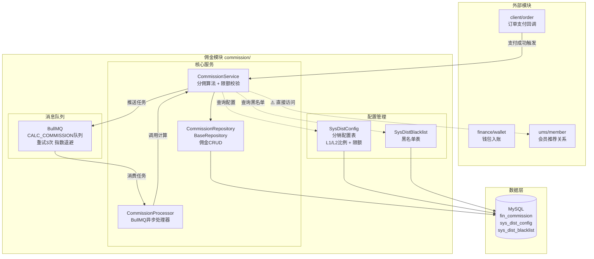
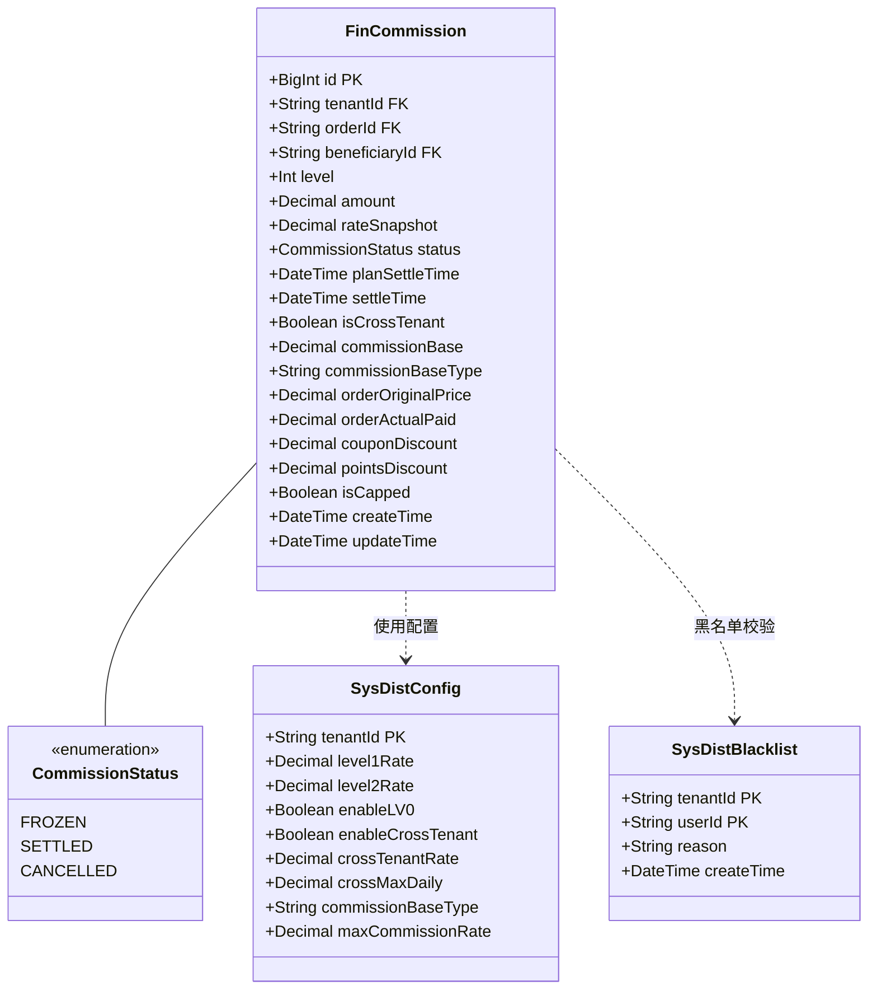
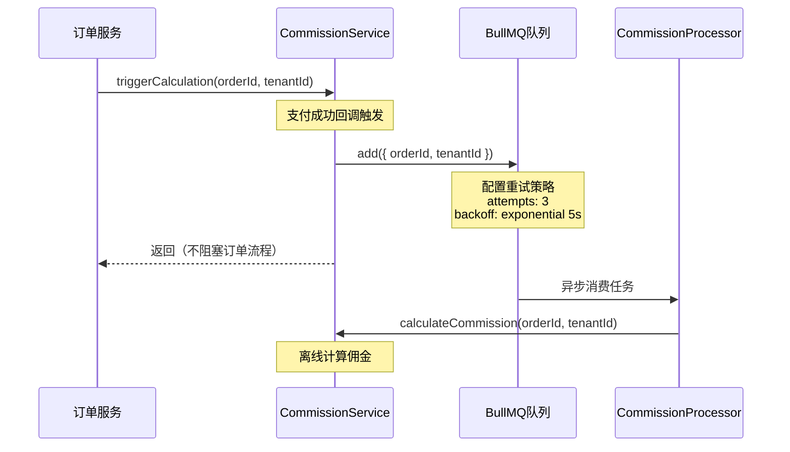
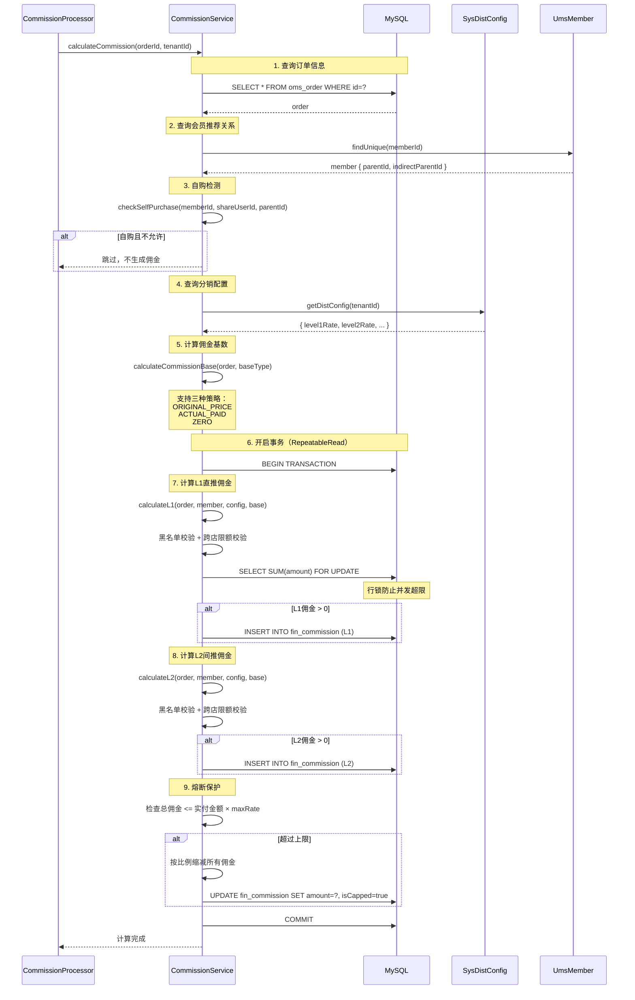
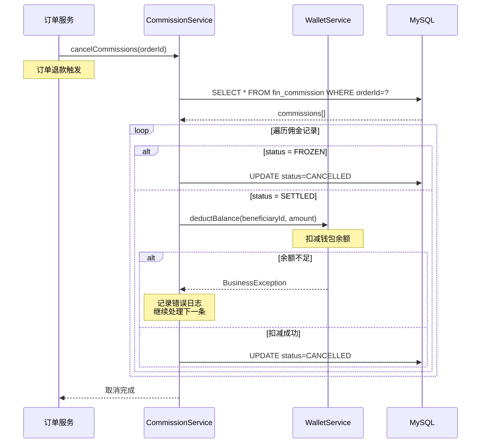
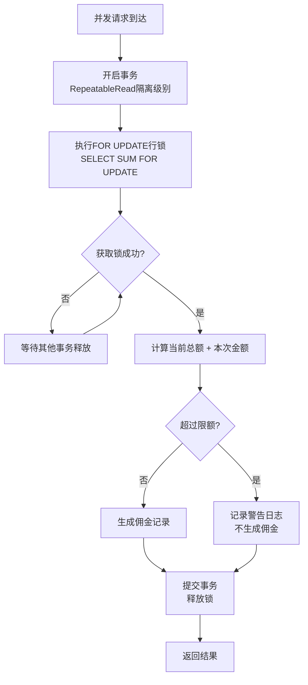
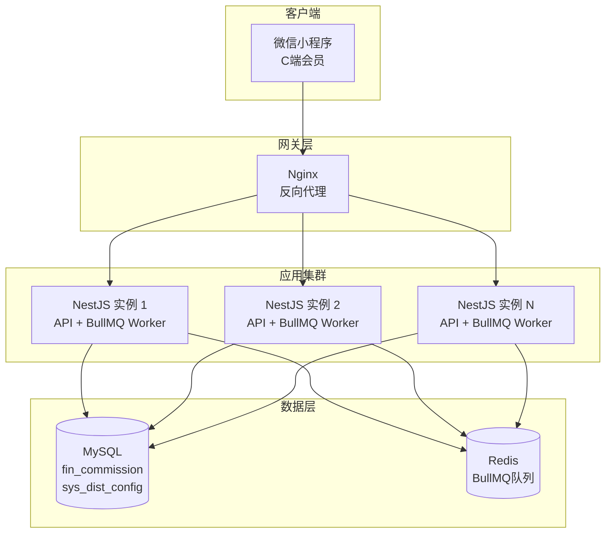

# 佣金模块 - 设计文档

> 版本：1.0  
> 日期：2026-02-24  
> 模块路径：`src/module/finance/commission/`  
> 需求文档：[commission-requirements.md](../../../requirements/finance/commission/commission-requirements.md)  
> 状态：现状架构分析 + 改进方案设计

---

## 1. 概述

### 1.1 设计目标

1. 完整描述佣金模块的技术架构、数据流、跨模块协作关系
2. 针对需求文档中识别的 10 个代码缺陷（D-1 ~ D-10）和 2 个跨模块缺陷（X-1 ~ X-2），给出具体改进方案与代码示例
3. 为中长期演进（事件驱动、规则引擎化）提供技术设计

### 1.2 约束

| 约束     | 说明                                                       |
| -------- | ---------------------------------------------------------- |
| 框架     | NestJS + Prisma ORM + MySQL                                |
| 队列     | BullMQ（异步佣金计算）                                     |
| 事务     | `@Transactional()` 装饰器（基于 CLS 上下文）               |
| 多租户   | 通过 `BaseRepository` 自动注入 `tenantId` 过滤             |
| 并发控制 | 数据库行级锁（FOR UPDATE）+ 事务隔离级别（RepeatableRead） |

---

## 2. 架构与模块（组件图）

> 图 1：佣金模块组件图



**组件说明**：

| 组件                   | 职责                             | 当前问题                                                      |
| ---------------------- | -------------------------------- | ------------------------------------------------------------- |
| `CommissionService`    | 核心业务逻辑：分佣算法、限额校验 | 直接访问 `omsOrder` 表（X-1）、直接访问 `umsMember` 表（X-2） |
| `CommissionProcessor`  | BullMQ 异步处理器：离线计算佣金  | 正常工作                                                      |
| `CommissionRepository` | 数据访问层：fin_commission 表    | 正常工作                                                      |
| `BullMQ`               | 消息队列：解耦佣金计算与订单支付 | 正常工作                                                      |

**依赖方向**：`Order` → `Commission`（触发计算）、`Commission` → `Wallet`（结算入账）、`Commission` → `Member`（推荐关系）。

---

## 3. 领域/数据模型（类图）

> 图 2：佣金模块数据模型类图



**关键字段说明**：

| 表                                 | 字段     | 说明                                      |
| ---------------------------------- | -------- | ----------------------------------------- |
| `FinCommission.level`              | Int      | 分佣级别：1=L1 直推，2=L2 间推            |
| `FinCommission.rateSnapshot`       | Decimal  | 分佣比例快照（百分比），记录计算时的配置  |
| `FinCommission.planSettleTime`     | DateTime | 计划结算时间，T+7 或 T+1                  |
| `FinCommission.isCrossTenant`      | Boolean  | 是否跨店分销                              |
| `FinCommission.commissionBase`     | Decimal  | 佣金计算基数                              |
| `FinCommission.commissionBaseType` | String   | 基数类型：ORIGINAL_PRICE/ACTUAL_PAID/ZERO |
| `FinCommission.isCapped`           | Boolean  | 是否触发熔断上限                          |
| `SysDistConfig.maxCommissionRate`  | Decimal  | 最大佣金比例（默认 0.5，即 50%）          |

---

## 4. 核心流程时序（时序图）

### 4.1 佣金计算触发流程

> 图 3：佣金计算触发时序图



### 4.2 佣金计算核心流程

> 图 4：佣金计算时序图



### 4.3 佣金取消流程

> 图 5：佣金取消时序图



---

## 5. 状态与流程

### 5.1 佣金状态机

佣金状态机已在需求文档图 5 中详细描述，此处补充技术实现细节。

**状态机实现**：佣金模块未使用独立的状态机配置文件，状态流转通过 `CommissionRepository` 的原子操作方法隐式控制。

**关键技术点**：

| 机制     | 实现方式                             | 说明                                                     |
| -------- | ------------------------------------ | -------------------------------------------------------- |
| 跃迁控制 | `update` + `WHERE status = ?`        | 通过 WHERE 条件隐式校验当前状态，不匹配则 `affected = 0` |
| 并发控制 | 数据库行级锁（`update` 原子操作）    | 无额外分布式锁，依赖数据库事务隔离                       |
| 终态保护 | CANCELLED 状态无对应的 `update` 方法 | 隐式保护，但缺少显式校验                                 |

### 5.2 跨店限额并发控制流程

> 图 6：跨店限额并发控制活动图



---

## 6. 部署架构（部署图）

> 图 7：佣金模块部署图



**部署注意事项**：

| 关注点   | 当前状态                | 风险                          | 改进建议                |
| -------- | ----------------------- | ----------------------------- | ----------------------- |
| 队列消费 | 所有实例均消费          | 正常工作，BullMQ 自动负载均衡 | 无需改进                |
| 并发控制 | 数据库行级锁            | 高并发时可能产生锁等待        | 监控锁等待时间          |
| 数据增长 | `fin_commission` 为大表 | 数据量级 D2~D3                | 需要索引优化 + 归档策略 |

---

## 7. 缺陷改进方案

### 7.1 D-1：跨店限额并发漏洞修复

**问题**：checkDailyLimit 使用 SELECT SUM FOR UPDATE，当天首笔无法命中行锁。

**改进方案**：引入专门的 fin_user_daily_quota 计数器表。

```typescript
// 新增表结构（Prisma Schema）
model FinUserDailyQuota {
  id            BigInt   @id @default(autoincrement())
  tenantId      String
  beneficiaryId String
  quotaDate     DateTime @db.Date
  usedAmount    Decimal  @db.Decimal(10, 2) @default(0)
  version       Int      @default(0)
  createTime    DateTime @default(now())
  updateTime    DateTime @updatedAt

  @@unique([tenantId, beneficiaryId, quotaDate])
  @@index([quotaDate])
}
```

```typescript
// commission.service.ts — 改进后
private async checkDailyLimit(
  tenantId: string,
  beneficiaryId: string,
  amount: Decimal,
  limit: Decimal,
): Promise<boolean> {
  const today = new Date();
  today.setHours(0, 0, 0, 0);

  // 使用 upsert + 乐观锁更新
  try {
    const quota = await this.prisma.finUserDailyQuota.upsert({
      where: {
        tenantId_beneficiaryId_quotaDate: {
          tenantId,
          beneficiaryId,
          quotaDate: today,
        },
      },
      create: {
        tenantId,
        beneficiaryId,
        quotaDate: today,
        usedAmount: amount,
        version: 1,
      },
      update: {
        usedAmount: { increment: amount },
        version: { increment: 1 },
      },
    });

    return quota.usedAmount.lte(limit);
  } catch (error) {
    // 并发冲突时重试
    this.logger.warn('Daily limit check conflict, retrying...');
    return this.checkDailyLimit(tenantId, beneficiaryId, amount, limit);
  }
}
```

### 7.2 D-2：佣金上限熔断实现

**问题**：缺乏对订单实付金额的最终比例校验。

**改进方案**：在 calculateCommission 末尾增加熔断逻辑（已实现）。

```typescript
// commission.service.ts — 已实现
// 8. 熔断保护：总佣金不能超过实付金额的配置比例
const totalCommission = records.reduce((sum, r) => sum.add(r.amount), new Decimal(0));
const maxAllowed = order.payAmount.mul(distConfig.maxCommissionRate);

if (totalCommission.gt(maxAllowed)) {
  const ratio = maxAllowed.div(totalCommission);
  this.logger.warn(
    `[Commission] Order ${orderId} commission capped: ` +
      `original=${totalCommission.toFixed(2)}, max=${maxAllowed.toFixed(2)}, ` +
      `ratio=${ratio.toFixed(4)}`,
  );

  // 按比例缩减所有佣金
  records.forEach((record) => {
    record.amount = record.amount.mul(ratio).toDecimalPlaces(2);
    record.isCapped = true;
  });
}
```

### 7.3 D-3：cancelCommissions 原子性保障

**问题**：循环回滚佣金时若发生中断，会导致部分佣金回收失败。

**改进方案**：标记为 @Transactional，确保所有佣金回滚在同一事务内完成。

```typescript
// commission.service.ts — 改进后
@Transactional()
async cancelCommissions(orderId: string) {
  const commissions = await this.commissionRepo.findMany({ where: { orderId } });

  for (const comm of commissions) {
    if (comm.status === CommissionStatus.FROZEN) {
      // 冻结中: 直接取消
      await this.commissionRepo.update(comm.id, { status: CommissionStatus.CANCELLED });
    } else if (comm.status === CommissionStatus.SETTLED) {
      // 已结算: 需要倒扣
      await this.rollbackCommission(comm);
    }
  }

  this.logger.log(`Cancelled commissions for order ${orderId}`);
}
```

### 7.4 D-4：幂等性修正机制

**问题**：calculateCommission 使用 upsert 且 update: {}，屏蔽异常重试修正机会。

**改进方案**：记录计算版本号，仅在 PENDING 状态下允许重算覆盖。

```typescript
// 新增字段（Prisma Schema）
model FinCommission {
  // ... 其他字段
  calculationVersion Int @default(1)
  calculationStatus  String @default("PENDING") // PENDING, COMPLETED, FAILED
}
```

```typescript
// commission.service.ts — 改进后
await this.commissionRepo.upsert({
  where: {
    orderId_beneficiaryId_level: {
      orderId: record.orderId,
      beneficiaryId: record.beneficiaryId,
      level: record.level,
    },
  },
  create: {
    ...enrichedRecord,
    calculationStatus: 'COMPLETED',
    calculationVersion: 1,
  },
  update: {
    // 仅在 PENDING 或 FAILED 状态下允许更新
    ...((await this.shouldRecalculate(record))
      ? {
          ...enrichedRecord,
          calculationStatus: 'COMPLETED',
          calculationVersion: { increment: 1 },
        }
      : {}),
  },
});
```

### 7.5 D-5：钱包余额不足回滚处理

**问题**：退款触发佣金回滚时，若受益人余额不足，deductBalance 抛出异常。

**改进方案**：允许负余额存在（作为债权），或建立待回收佣金台账。

```typescript
// wallet.service.ts — 改进后（方案1：允许负余额）
@Transactional()
async deductBalance(memberId: string, amount: Decimal, relatedId: string, remark: string, type: TransType) {
  const wallet = await this.walletRepo.updateByMemberId(memberId, {
    balance: { decrement: amount },
    version: { increment: 1 },
  });

  // 允许负余额，记录为债权
  if (wallet.balance.lt(0)) {
    this.logger.warn(`Wallet ${memberId} balance is negative: ${wallet.balance.toFixed(2)}`);
    // 可选：发送告警通知
  }

  await this.transactionRepo.create({
    wallet: { connect: { id: wallet.id } },
    tenantId: wallet.tenantId,
    type,
    amount: new Decimal(0).minus(amount), // 负数
    balanceAfter: wallet.balance,
    relatedId,
    remark,
  });

  return wallet;
}
```

```typescript
// commission.service.ts — 改进后（方案2：待回收台账）
@Transactional()
private async rollbackCommission(commission: { beneficiaryId: string; amount: Decimal; orderId: string; id: string | bigint }) {
  try {
    // 尝试扣减余额
    await this.walletService.deductBalance(
      commission.beneficiaryId,
      commission.amount,
      commission.orderId,
      `订单退款，佣金回收`,
      TransType.REFUND_DEDUCT,
    );

    // 更新佣金状态
    await this.commissionRepo.update(commission.id, { status: CommissionStatus.CANCELLED });
  } catch (error) {
    // 余额不足时，记录到待回收台账
    await this.prisma.finPendingRecovery.create({
      data: {
        commissionId: commission.id,
        beneficiaryId: commission.beneficiaryId,
        amount: commission.amount,
        orderId: commission.orderId,
        reason: '余额不足',
        status: 'PENDING',
      },
    });

    this.logger.warn(`Commission ${commission.id} recovery pending due to insufficient balance`);
  }
}
```

### 7.6 D-6：部分退款分佣逻辑

**问题**：cancelCommissions 采用一刀切策略，未支持按商品比例回滚。

**改进方案**：重构分佣结构，将佣金记录关联至 order_item_id。

```typescript
// 新增字段（Prisma Schema）
model FinCommission {
  // ... 其他字段
  orderItemId String? // 关联订单明细
}
```

```typescript
// commission.service.ts — 改进后
async cancelCommissionsByItems(orderId: string, itemIds: string[]) {
  const commissions = await this.commissionRepo.findMany({
    where: {
      orderId,
      orderItemId: { in: itemIds },
    },
  });

  for (const comm of commissions) {
    if (comm.status === CommissionStatus.FROZEN) {
      await this.commissionRepo.update(comm.id, { status: CommissionStatus.CANCELLED });
    } else if (comm.status === CommissionStatus.SETTLED) {
      await this.rollbackCommission(comm);
    }
  }

  this.logger.log(`Cancelled commissions for order ${orderId} items ${itemIds.join(',')}`);
}
```

---

## 8. 架构改进方案

### 8.1 事件驱动架构

**问题**：佣金的生成、结算、取消等关键节点未发送事件。

**改进方案**：创建 `commission/events/` 事件定义和发送机制。

```typescript
// commission/events/commission-event.types.ts
export enum CommissionEventType {
  COMMISSION_CALCULATED = 'commission.calculated', // 佣金计算完成
  COMMISSION_SETTLED = 'commission.settled', // 佣金已结算
  COMMISSION_CANCELLED = 'commission.cancelled', // 佣金已取消
  COMMISSION_CAPPED = 'commission.capped', // 佣金触发熔断
}

export interface CommissionEvent {
  type: CommissionEventType;
  commissionId: string | bigint;
  orderId: string;
  beneficiaryId: string;
  amount: Decimal;
  level: number;
  payload?: any;
  timestamp: Date;
}
```

```typescript
// commission.service.ts — 在 calculateCommission 末尾添加
for (const record of records) {
  this.eventEmitter.emit(CommissionEventType.COMMISSION_CALCULATED, {
    type: CommissionEventType.COMMISSION_CALCULATED,
    commissionId: record.id,
    orderId: record.orderId,
    beneficiaryId: record.beneficiaryId,
    amount: record.amount,
    level: record.level,
    timestamp: new Date(),
  });
}
```

### 8.2 消除跨模块直接表访问

**问题**：calculateCommission 直接 prisma.omsOrder.findUnique 和 prisma.umsMember.findUnique。

**改进方案**：通过 Service 获取数据，或使用事件驱动。

```typescript
// commission.service.ts — 改进后
@Transactional({ isolationLevel: IsolationLevel.RepeatableRead })
async calculateCommission(orderId: string, tenantId: string) {
  // 1. 通过 OrderService 获取订单详情（而非直接访问表）
  const order = await this.orderService.getOrderForCommission(orderId);
  if (!order) {
    this.logger.warn(`[Commission] Order ${orderId} not found`);
    return;
  }

  // 2. 通过 MemberService 获取会员推荐关系（而非直接访问表）
  const member = await this.memberService.getMemberForCommission(order.memberId);
  if (!member) return;

  // ... 其余逻辑不变
}
```

---

## 9. 接口设计

### 9.1 HTTP 接口

佣金模块当前无 HTTP 接口，待建设管理端查询接口。

#### 9.1.1 待建设接口

| 接口         | 方法 | 路径                                | 说明                         |
| ------------ | ---- | ----------------------------------- | ---------------------------- |
| 佣金列表     | GET  | `/admin/finance/commission`         | 分页查询，支持按状态筛选     |
| 佣金详情     | GET  | `/admin/finance/commission/:id`     | 查询单条佣金记录             |
| 佣金统计     | GET  | `/admin/finance/commission/stats`   | 按时间、用户、商品维度统计   |
| 手动触发计算 | POST | `/admin/finance/commission/trigger` | 手动触发佣金计算（异常修复） |

### 9.2 内部接口

| 方法                 | 说明                                 |
| -------------------- | ------------------------------------ |
| triggerCalculation   | 触发佣金计算，推送任务到 BullMQ 队列 |
| calculateCommission  | 核心计算逻辑，生成 L1/L2 佣金记录    |
| cancelCommissions    | 取消佣金，订单退款时调用             |
| updatePlanSettleTime | 更新结算时间，订单确认收货时触发     |

### 9.3 事件接口

| 事件                  | 说明         | 订阅方             |
| --------------------- | ------------ | ------------------ |
| commission.calculated | 佣金计算完成 | 通知服务、统计服务 |
| commission.settled    | 佣金已结算   | 通知服务           |
| commission.cancelled  | 佣金已取消   | 通知服务           |
| commission.capped     | 佣金触发熔断 | 监控服务           |

---

## 10. 数据库设计

### 10.1 表结构

#### 10.1.1 fin_commission（佣金记录表）

| 字段                 | 类型          | 说明                           |
| -------------------- | ------------- | ------------------------------ |
| id                   | BigInt        | 主键，自增                     |
| tenant_id            | String        | 租户 ID                        |
| order_id             | String        | 订单 ID                        |
| beneficiary_id       | String        | 受益人 ID                      |
| level                | Int           | 分佣级别：1=L1，2=L2           |
| amount               | Decimal(10,2) | 佣金金额                       |
| rate_snapshot        | Decimal(5,2)  | 分佣比例快照（百分比）         |
| status               | Enum          | 状态：FROZEN/SETTLED/CANCELLED |
| plan_settle_time     | DateTime      | 计划结算时间                   |
| settle_time          | DateTime      | 实际结算时间                   |
| is_cross_tenant      | Boolean       | 是否跨店分销                   |
| commission_base      | Decimal(10,2) | 佣金计算基数                   |
| commission_base_type | String        | 基数类型                       |
| order_original_price | Decimal(10,2) | 订单原价                       |
| order_actual_paid    | Decimal(10,2) | 订单实付                       |
| coupon_discount      | Decimal(10,2) | 优惠券优惠                     |
| points_discount      | Decimal(10,2) | 积分优惠                       |
| is_capped            | Boolean       | 是否触发熔断                   |
| create_time          | DateTime      | 创建时间                       |
| update_time          | DateTime      | 更新时间                       |

### 10.2 索引设计

| 索引名                         | 字段                            | 类型 | 说明             |
| ------------------------------ | ------------------------------- | ---- | ---------------- |
| idx_order_id                   | order_id                        | 普通 | 按订单查询佣金   |
| idx_beneficiary_status         | beneficiary_id, status          | 普通 | 按受益人查询佣金 |
| idx_plan_settle_time           | plan_settle_time, status        | 普通 | 结算任务扫描     |
| idx_create_time                | create_time                     | 普通 | 按时间统计       |
| unique_order_beneficiary_level | order_id, beneficiary_id, level | 唯一 | 防止重复计算     |

### 10.3 数据迁移

无需数据迁移，新增字段已在 Prisma Schema 中定义。

---

## 11. 缓存设计

### 11.1 缓存策略

佣金模块不使用缓存，所有数据直接从数据库读取，确保数据一致性。

### 11.2 缓存更新

不适用。

### 11.3 缓存失效

不适用。

---

## 12. 安全设计

### 12.1 认证授权

- 管理端接口需添加 `@ApiBearerAuth` 和 `@RequirePermission` 装饰器
- 权限编码：`finance:commission:{list,query,stats,trigger}`

### 12.2 数据加密

- 佣金金额不加密，但需记录审计日志
- 敏感操作（手动触发计算）需记录操作人

### 12.3 审计日志

- 所有佣金变动记录审计日志
- 包含操作人、操作时间、操作内容、变更前后值

---

## 13. 性能优化

### 13.1 查询优化

- 使用索引优化查询性能
- 避免全表扫描，查询时必须带时间范围或状态条件
- 批量查询使用 WHERE IN，避免 N+1 查询

### 13.2 并发控制

- 使用数据库行级锁（FOR UPDATE）防止并发超限
- 使用事务隔离级别（RepeatableRead）保障数据一致性
- 跨店限额使用专门的计数器表，避免锁等待

### 13.3 资源管理

- BullMQ 队列配置合理的并发数和重试策略
- 定期归档历史佣金记录，保持表大小可控
- 监控数据库连接池使用情况

---

## 14. 测试策略

### 14.1 单元测试

- CommissionService 核心方法单元测试
- 覆盖主路径与关键边界、异常分支
- 测试用例：自购检测、黑名单校验、限额校验、熔断保护

### 14.2 集成测试

- 佣金计算完整流程测试
- 佣金取消流程测试
- 跨店限额并发测试
- 与钱包模块集成测试

### 14.3 性能测试

- 高并发佣金计算性能测试
- 跨店限额并发性能测试
- BullMQ 队列吞吐量测试

---

**文档版本**: 1.0  
**编写日期**: 2026-02-24  
**最后更新**: 2026-02-24
