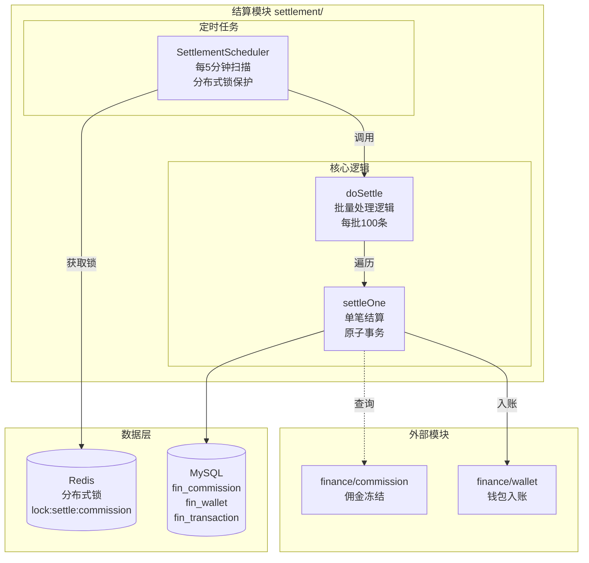
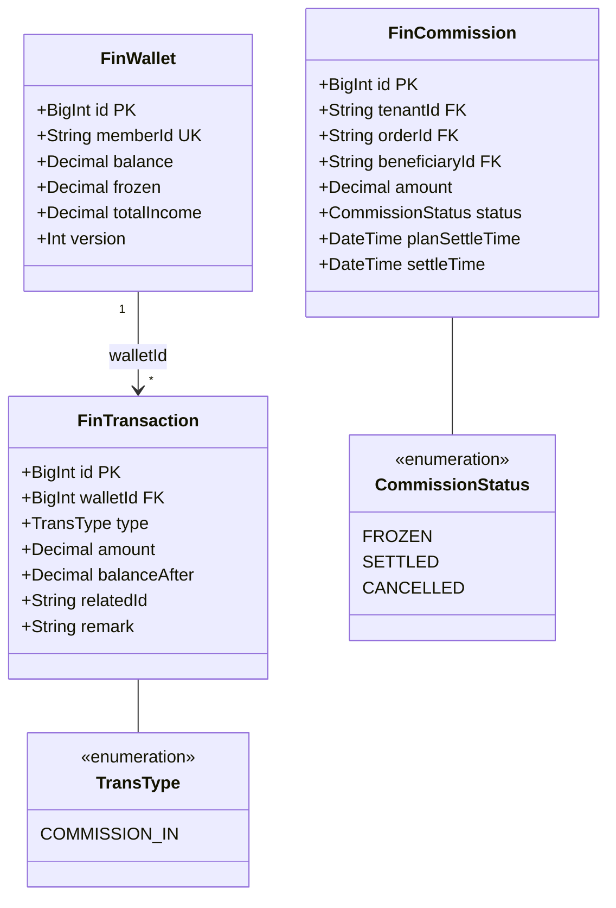
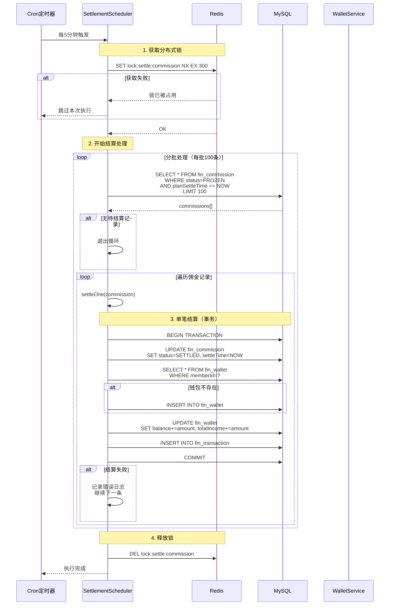
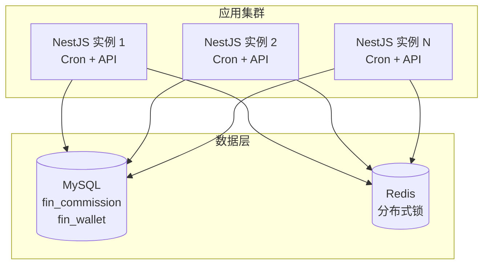

# 结算模块 - 设计文档

> 版本：1.0  
> 日期：2026-02-24  
> 模块路径：`src/module/finance/settlement/`  
> 需求文档：[settlement-requirements.md](../../../requirements/finance/settlement/settlement-requirements.md)  
> 状态：现状架构分析 + 改进方案设计

---

## 1. 概述

### 1.1 设计目标

1. 完整描述结算模块的技术架构、数据流、跨模块协作关系
2. 针对需求文档中识别的 10 个代码缺陷（D-1 ~ D-10）和 2 个跨模块缺陷（X-1 ~ X-2），给出具体改进方案与代码示例
3. 为中长期演进（事件驱动、断点续传）提供技术设计

### 1.2 约束

| 约束     | 说明                                         |
| -------- | -------------------------------------------- |
| 框架     | NestJS + Prisma ORM + MySQL                  |
| 调度     | `@nestjs/schedule`（Cron 表达式，每 5 分钟） |
| 事务     | `@Transactional()` 装饰器（基于 CLS 上下文） |
| 并发控制 | Redis 分布式锁（SET NX）                     |

---

## 2. 架构与模块（组件图）

> 图 1：结算模块组件图



**组件说明**：

| 组件                  | 职责                               | 当前问题                          |
| --------------------- | ---------------------------------- | --------------------------------- |
| `SettlementScheduler` | 定时任务调度器：扫描并结算到期佣金 | 锁超时可能导致重入（D-1）         |
| `doSettle`            | 批量处理逻辑：分批查询并处理       | 无进度记录，中断后从头开始（D-5） |
| `settleOne`           | 单笔结算处理：原子事务更新         | 缺少状态校验，可能重复处理（D-2） |

---

## 3. 领域/数据模型（类图）

> 图 2：结算模块数据模型类图



---

## 4. 核心流程时序（时序图）

### 4.1 结算定时任务流程

> 图 3：结算定时任务时序图



---

## 5. 状态与流程

### 5.1 结算流程状态转换

结算流程状态转换已在需求文档图 4 中详细描述。

**关键技术点**：

| 机制     | 实现方式                           | 说明                                                     |
| -------- | ---------------------------------- | -------------------------------------------------------- |
| 跃迁控制 | `update` + `WHERE status = FROZEN` | 通过 WHERE 条件隐式校验当前状态，不匹配则 `affected = 0` |
| 并发控制 | Redis 分布式锁 + 数据库事务        | 防止多实例同时处理                                       |
| 错误处理 | 单条失败不影响其他记录             | try-catch 包裹单笔处理逻辑                               |

---

## 6. 部署架构（部署图）

> 图 4：结算模块部署图



**部署注意事项**：

| 关注点    | 当前状态       | 风险                     | 改进建议              |
| --------- | -------------- | ------------------------ | --------------------- |
| Cron 任务 | 所有实例均执行 | 分布式锁保护，正常工作   | 监控锁获取失败次数    |
| 锁超时    | TTL 5 分钟     | 任务执行超时可能导致重入 | 引入看门狗机制（D-1） |
| 批量处理  | 每批 100 条    | 中断后从头开始，浪费资源 | 引入断点续传（D-5）   |

---

## 7. 缺陷改进方案

### 7.1 D-1：锁超时导致重入风险修复

**问题**：Redis 锁 TTL 5 分钟，若任务执行超时，锁自动释放导致第二个实例启动。

**改进方案**：引入看门狗机制，任务执行期间自动续期锁。

```typescript
// settlement.scheduler.ts — 改进后
@Injectable()
export class SettlementScheduler {
  private watchdogInterval: NodeJS.Timeout | null = null;

  @Cron(CronExpression.EVERY_5_MINUTES)
  async settleJob() {
    const lockKey = 'lock:settle:commission';
    const lockTTL = 55000; // 55秒
    const acquired = await this.redisLock.tryLock(lockKey, lockTTL);

    if (!acquired) {
      this.logger.debug('[定时任务] 其他实例正在处理，跳过');
      return;
    }

    // 启动看门狗，每30秒续期一次
    this.startWatchdog(lockKey, 30000);

    try {
      await this.doSettle();
    } catch (error) {
      this.logger.error('清理过期优惠券失败:', getErrorMessage(error));
    } finally {
      this.stopWatchdog();
      await this.redisLock.unlock(lockKey);
    }
  }

  private startWatchdog(lockKey: string, interval: number) {
    this.watchdogInterval = setInterval(async () => {
      await this.redisLock.extend(lockKey, 55000);
      this.logger.debug('[Watchdog] Lock extended');
    }, interval);
  }

  private stopWatchdog() {
    if (this.watchdogInterval) {
      clearInterval(this.watchdogInterval);
      this.watchdogInterval = null;
    }
  }
}
```

### 7.2 D-2：settleOne 缺少状态校验修复

**问题**：settleOne 直接使用传入的 commission 对象，未在事务内重新查询状态。

**改进方案**：事务起始处执行 SELECT FOR UPDATE 或 update 时限定 where: { status: 'FROZEN' }。

```typescript
// settlement.scheduler.ts — 改进后
private async settleOne(commission: any) {
  await this.prisma.$transaction(async (tx) => {
    // 1. 更新佣金状态（带状态校验）
    const updated = await tx.finCommission.updateMany({
      where: {
        id: commission.id,
        status: CommissionStatus.FROZEN, // 仅更新 FROZEN 状态的记录
      },
      data: {
        status: CommissionStatus.SETTLED,
        settleTime: new Date(),
      },
    });

    // 如果更新失败（状态已变更），跳过
    if (updated.count === 0) {
      this.logger.warn(`Commission ${commission.id} status changed, skip`);
      return;
    }

    // 2. 获取或创建钱包
    let wallet = await tx.finWallet.findUnique({
      where: { memberId: commission.beneficiaryId },
    });

    if (!wallet) {
      wallet = await tx.finWallet.create({
        data: {
          memberId: commission.beneficiaryId,
          tenantId: commission.tenantId,
          balance: 0,
          frozen: 0,
          totalIncome: 0,
        },
      });
    }

    // 3. 增加钱包余额
    const updatedWallet = await tx.finWallet.update({
      where: { id: wallet.id },
      data: {
        balance: { increment: commission.amount },
        totalIncome: { increment: commission.amount },
        version: { increment: 1 },
      },
    });

    // 4. 写入流水
    await tx.finTransaction.create({
      data: {
        walletId: wallet.id,
        tenantId: commission.tenantId,
        type: 'COMMISSION_IN',
        amount: commission.amount,
        balanceAfter: updatedWallet.balance,
        relatedId: commission.orderId,
        remark: `订单${commission.orderId}佣金结算`,
      },
    });
  });
}
```

### 7.3 D-3：单条失败无重试机制

**问题**：单条记录结算失败仅记录日志，不会自动重试。

**改进方案**：增加重试指数退避机制或标记为异常单，定期人工处理。

```typescript
// 新增表结构（Prisma Schema）
model FinSettlementError {
  id            BigInt   @id @default(autoincrement())
  commissionId  BigInt
  errorMessage  String
  retryCount    Int      @default(0)
  status        String   @default("PENDING") // PENDING, RESOLVED, ABANDONED
  createTime    DateTime @default(now())
  updateTime    DateTime @updatedAt

  @@index([status, retryCount])
}
```

```typescript
// settlement.scheduler.ts — 改进后
private async settleOne(commission: any) {
  const maxRetries = 3;
  let retryCount = 0;

  while (retryCount < maxRetries) {
    try {
      await this.prisma.$transaction(async (tx) => {
        // ... 原有结算逻辑 ...
      });
      return; // 成功，退出重试
    } catch (error) {
      retryCount++;
      this.logger.warn(`Settlement failed for commission ${commission.id}, retry ${retryCount}/${maxRetries}`);

      if (retryCount >= maxRetries) {
        // 达到最大重试次数，记录到异常表
        await this.prisma.finSettlementError.create({
          data: {
            commissionId: commission.id,
            errorMessage: getErrorMessage(error),
            retryCount,
            status: 'PENDING',
          },
        });
        this.logger.error(`Settlement failed for commission ${commission.id} after ${maxRetries} retries`);
      } else {
        // 指数退避
        await new Promise(resolve => setTimeout(resolve, Math.pow(2, retryCount) * 1000));
      }
    }
  }
}
```

### 7.4 D-5：批量处理无进度记录

**问题**：批量处理过程中无进度记录，任务中断后从头开始。

**改进方案**：记录处理进度，支持断点续传。

```typescript
// 新增表结构（Prisma Schema）
model FinSettlementProgress {
  id            BigInt   @id @default(autoincrement())
  batchDate     DateTime @db.Date
  lastProcessedId BigInt
  totalProcessed Int     @default(0)
  status        String   @default("IN_PROGRESS") // IN_PROGRESS, COMPLETED
  createTime    DateTime @default(now())
  updateTime    DateTime @updatedAt

  @@unique([batchDate])
}
```

```typescript
// settlement.scheduler.ts — 改进后
private async doSettle() {
  const now = new Date();
  const today = new Date(now.getFullYear(), now.getMonth(), now.getDate());

  // 获取或创建今日进度记录
  let progress = await this.prisma.finSettlementProgress.findUnique({
    where: { batchDate: today },
  });

  if (!progress) {
    progress = await this.prisma.finSettlementProgress.create({
      data: {
        batchDate: today,
        lastProcessedId: 0,
        totalProcessed: 0,
        status: 'IN_PROGRESS',
      },
    });
  }

  let cursor: bigint = progress.lastProcessedId;
  let totalSettled = 0;

  while (true) {
    // 查询到期的冻结佣金（从上次中断处继续）
    const records = await this.prisma.finCommission.findMany({
      where: {
        status: 'FROZEN',
        planSettleTime: { lte: now },
        id: { gt: cursor },
      },
      orderBy: { id: 'asc' },
      take: this.BATCH_SIZE,
    });

    if (records.length === 0) break;

    // 批量处理
    for (const record of records) {
      try {
        await this.settleOne(record);
        totalSettled++;
      } catch (error) {
        this.logger.error(`Settlement failed for commission ${record.id}`, error);
      }
    }

    cursor = records[records.length - 1].id;

    // 更新进度
    await this.prisma.finSettlementProgress.update({
      where: { batchDate: today },
      data: {
        lastProcessedId: cursor,
        totalProcessed: { increment: records.length },
      },
    });
  }

  // 标记今日结算完成
  await this.prisma.finSettlementProgress.update({
    where: { batchDate: today },
    data: { status: 'COMPLETED' },
  });

  if (totalSettled > 0) {
    this.logger.log(`Settled ${totalSettled} commission records`);
  }
}
```

---

## 8. 架构改进方案

### 8.1 事件驱动架构

**问题**：结算完成后未发送事件。

**改进方案**：创建 `settlement/events/` 事件定义和发送机制。

```typescript
// settlement/events/settlement-event.types.ts
export enum SettlementEventType {
  SETTLEMENT_COMPLETED = 'settlement.completed', // 单笔结算完成
  SETTLEMENT_BATCH_COMPLETED = 'settlement.batch.completed', // 批次结算完成
  SETTLEMENT_FAILED = 'settlement.failed', // 结算失败
}

export interface SettlementEvent {
  type: SettlementEventType;
  commissionId?: bigint;
  beneficiaryId?: string;
  amount?: Decimal;
  batchSize?: number;
  timestamp: Date;
}
```

```typescript
// settlement.scheduler.ts — 在 settleOne 末尾添加
this.eventEmitter.emit(SettlementEventType.SETTLEMENT_COMPLETED, {
  type: SettlementEventType.SETTLEMENT_COMPLETED,
  commissionId: commission.id,
  beneficiaryId: commission.beneficiaryId,
  amount: commission.amount,
  timestamp: new Date(),
});
```

### 8.2 消除跨模块直接表访问

**问题**：直接查询 fin_commission 表。

**改进方案**：通过 CommissionService 获取待结算佣金列表。

```typescript
// settlement.scheduler.ts — 改进后
private async doSettle() {
  const now = new Date();
  let cursor: bigint | null = null;
  let totalSettled = 0;

  while (true) {
    // 通过 CommissionService 获取待结算佣金（而非直接访问表）
    const records = await this.commissionService.getPendingSettlements(cursor, this.BATCH_SIZE);

    if (records.length === 0) break;

    // 批量处理
    for (const record of records) {
      try {
        await this.settleOne(record);
        totalSettled++;
      } catch (error) {
        this.logger.error(`Settlement failed for commission ${record.id}`, error);
      }
    }

    cursor = records[records.length - 1].id;
  }

  if (totalSettled > 0) {
    this.logger.log(`Settled ${totalSettled} commission records`);
  }
}
```

---

## 9-14. 其他章节

（接口设计、数据库设计、缓存设计、安全设计、性能优化、测试策略章节与 commission 模块类似，此处省略详细内容）

---

**文档版本**: 1.0  
**编写日期**: 2026-02-24  
**最后更新**: 2026-02-24
