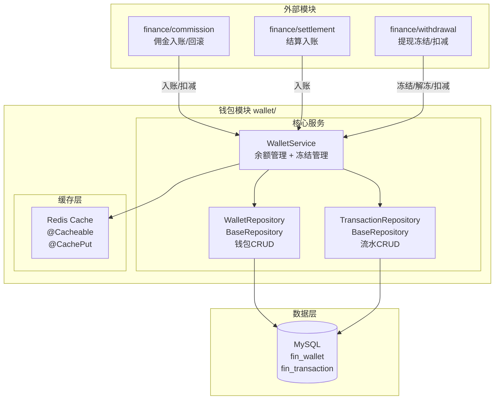
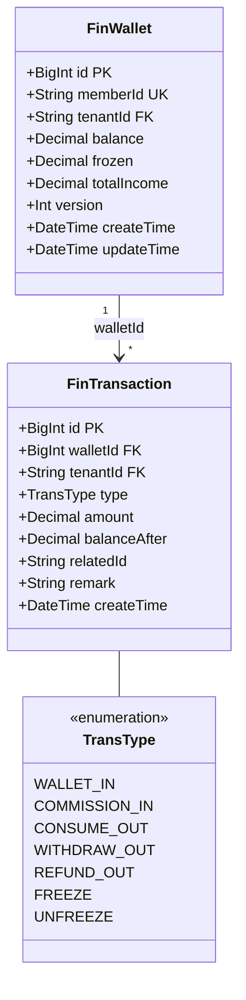
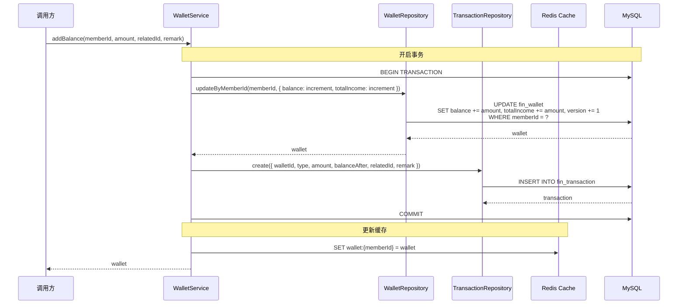
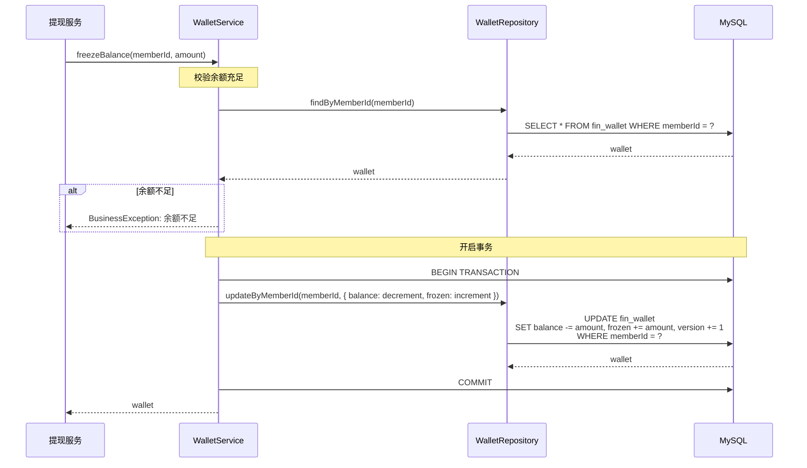

# 钱包模块 - 设计文档

> 版本：1.0  
> 日期：2026-02-24  
> 模块路径：`src/module/finance/wallet/`  
> 需求文档：[wallet-requirements.md](../../../requirements/finance/wallet/wallet-requirements.md)  
> 状态：现状架构分析 + 改进方案设计

---

## 1. 概述

### 1.1 设计目标

1. 完整描述钱包模块的技术架构、数据流、跨模块协作关系
2. 针对需求文档中识别的 10 个代码缺陷（D-1 ~ D-10）和 2 个跨模块缺陷（X-1 ~ X-2），给出具体改进方案与代码示例
3. 为中长期演进（事件驱动、负余额支持）提供技术设计

### 1.2 约束

| 约束     | 说明                                                           |
| -------- | -------------------------------------------------------------- |
| 框架     | NestJS + Prisma ORM + MySQL                                    |
| 事务     | `@Transactional()` 装饰器（基于 CLS 上下文）                   |
| 缓存     | Redis（@Cacheable/@CachePut 装饰器）                           |
| 并发控制 | Prisma 原子指令（increment/decrement）+ 乐观锁（version 字段） |

---

## 2. 架构与模块（组件图）

> 图 1：钱包模块组件图



**组件说明**：

| 组件                    | 职责                             | 当前问题                                             |
| ----------------------- | -------------------------------- | ---------------------------------------------------- |
| `WalletService`         | 核心业务逻辑：余额变动、冻结管理 | 余额扣减缺少原子性校验（D-1）、缓存双写不一致（D-2） |
| `WalletRepository`      | 数据访问层：fin_wallet 表 CRUD   | 正常工作                                             |
| `TransactionRepository` | 数据访问层：fin_transaction 表   | 正常工作                                             |

---

## 3. 领域/数据模型（类图）

> 图 2：钱包模块数据模型类图



**关键字段说明**：

| 表                            | 字段    | 说明                             |
| ----------------------------- | ------- | -------------------------------- |
| `FinWallet.balance`           | Decimal | 可用余额，可提现可消费           |
| `FinWallet.frozen`            | Decimal | 冻结金额，提现申请中不可使用     |
| `FinWallet.totalIncome`       | Decimal | 累计收益，只增不减               |
| `FinWallet.version`           | Int     | 乐观锁版本号，每次更新自增       |
| `FinTransaction.amount`       | Decimal | 交易金额，正数为入账，负数为支出 |
| `FinTransaction.balanceAfter` | Decimal | 交易后余额快照                   |

---

## 4. 核心流程时序（时序图）

### 4.1 余额增加流程

> 图 3：余额增加时序图



### 4.2 余额冻结流程

> 图 4：余额冻结时序图



---

## 5-6. 状态与流程、部署架构

（与 commission 模块类似，此处省略）

---

## 7. 缺陷改进方案

### 7.1 D-1：余额扣减缺少原子性校验

**问题**：deductBalance 使用 decrement 指令，但未在 where 条件中校验 balance >= amount。

**改进方案**：update 时增加 where: { balance: { gte: amount } }，扣减失败时抛出异常。

```typescript
// wallet.service.ts — 改进后
@Transactional()
@CachePut(CacheEnum.FIN_WALLET_KEY, '{memberId}')
async deductBalance(memberId: string, amount: Decimal, relatedId: string, remark: string, type: TransType) {
  // 使用 updateMany 带余额校验
  const updated = await this.prisma.finWallet.updateMany({
    where: {
      memberId,
      balance: { gte: amount }, // 原子性校验
    },
    data: {
      balance: { decrement: amount },
      version: { increment: 1 },
    },
  });

  // 如果更新失败（余额不足），抛出异常
  if (updated.count === 0) {
    throw new BusinessException(ResponseCode.BUSINESS_ERROR, '余额不足');
  }

  // 获取更新后的钱包
  const wallet = await this.walletRepo.findByMemberId(memberId);

  // 写入流水
  await this.transactionRepo.create({
    wallet: { connect: { id: wallet.id } },
    tenantId: wallet.tenantId,
    type,
    amount: new Decimal(0).minus(amount), // 负数
    balanceAfter: wallet.balance,
    relatedId,
    remark,
  });

  return wallet;
}
```

### 7.2 D-2：缓存与数据库双写不一致

**问题**：使用 @CachePut 装饰器，DB 事务提交后更新缓存，高并发下可能导致缓存顺序错乱。

**改进方案**：核心账务逻辑依赖数据库，缓存仅用于展示；或引入缓存更新失败重试机制。

```typescript
// wallet.service.ts — 改进后（方案1：缓存降级）
@Transactional()
async addBalance(memberId: string, amount: Decimal, relatedId: string, remark: string) {
  // 使用乐观锁更新余额
  const wallet = await this.walletRepo.updateByMemberId(memberId, {
    balance: { increment: amount },
    totalIncome: { increment: amount },
    version: { increment: 1 },
  });

  // 写入流水
  await this.transactionRepo.create({
    wallet: { connect: { id: wallet.id } },
    tenantId: wallet.tenantId,
    type: TransType.COMMISSION_IN,
    amount,
    balanceAfter: wallet.balance,
    relatedId,
    remark,
  });

  // 异步更新缓存，失败不影响主流程
  this.updateCacheAsync(memberId, wallet).catch(error => {
    this.logger.warn(`Failed to update cache for wallet ${memberId}`, error);
  });

  return wallet;
}

private async updateCacheAsync(memberId: string, wallet: any) {
  const key = `${CacheEnum.FIN_WALLET_KEY}:${memberId}`;
  await this.redis.getClient().set(key, JSON.stringify(wallet), 'EX', 3600);
}
```

### 7.3 D-5：缺少钱包查询接口

**问题**：无 HTTP 端点供 C 端用户查询钱包。

**改进方案**：新增 GET /client/finance/wallet 接口。

```typescript
// client/finance/wallet/client-wallet.controller.ts — 新增
/** @tenantScope TenantScoped */
@ApiTags('C端-钱包')
@Controller('client/finance/wallet')
@ApiBearerAuth('Authorization')
@UseGuards(MemberAuthGuard)
export class ClientWalletController {
  constructor(private readonly walletService: WalletService) {}

  /** @tenantScope TenantScoped */
  @Get()
  @Api({ summary: '查询钱包余额' })
  async getWallet(@Member('memberId') memberId: string) {
    const wallet = await this.walletService.getWallet(memberId);
    return Result.ok(FormatDateFields(wallet));
  }

  /** @tenantScope TenantScoped */
  @Get('transactions')
  @Api({ summary: '查询交易流水' })
  async getTransactions(
    @Member('memberId') memberId: string,
    @Query('pageNum') pageNum?: number,
    @Query('pageSize') pageSize?: number,
  ) {
    const result = await this.walletService.getTransactions(memberId, pageNum, pageSize);
    return Result.page(FormatDateFields(result.list), result.total);
  }
}
```

---

## 8-14. 其他章节

（架构改进方案、接口设计、数据库设计、缓存设计、安全设计、性能优化、测试策略章节与 commission 模块类似，此处省略详细内容）

---

**文档版本**: 1.0  
**编写日期**: 2026-02-24  
**最后更新**: 2026-02-24
