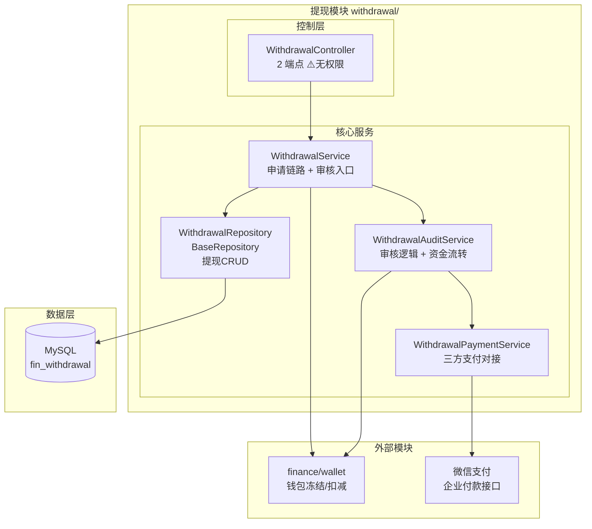
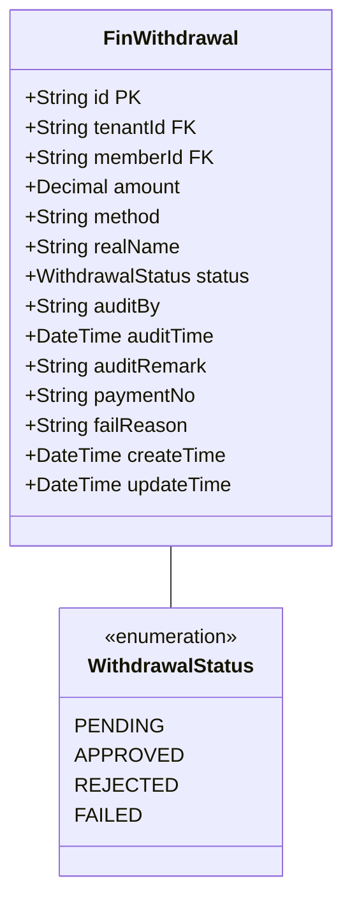
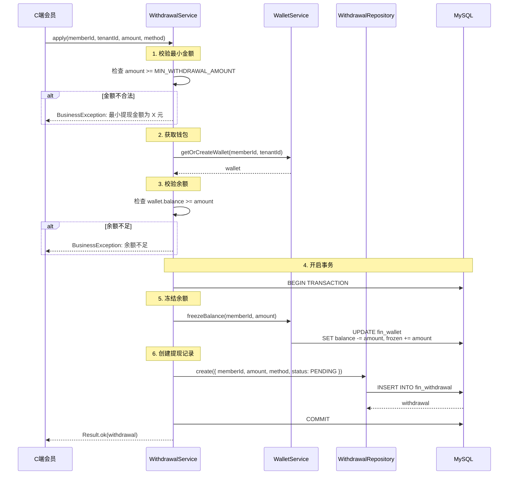
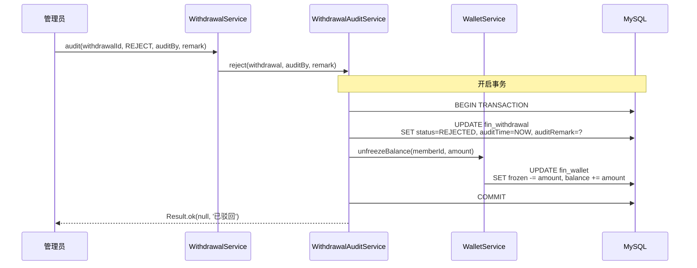

# 提现模块 - 设计文档

> 版本：1.0  
> 日期：2026-02-24  
> 模块路径：`src/module/finance/withdrawal/`  
> 需求文档：[withdrawal-requirements.md](../../../requirements/finance/withdrawal/withdrawal-requirements.md)  
> 状态：现状架构分析 + 改进方案设计

---

## 1. 概述

### 1.1 设计目标

1. 完整描述提现模块的技术架构、数据流、跨模块协作关系
2. 针对需求文档中识别的 11 个代码缺陷（D-1 ~ D-11）和 3 个跨模块缺陷（X-1 ~ X-3），给出具体改进方案与代码示例
3. 为中长期演进（事件驱动、对账补偿）提供技术设计

### 1.2 约束

| 约束     | 说明                                         |
| -------- | -------------------------------------------- |
| 框架     | NestJS + Prisma ORM + MySQL                  |
| 事务     | `@Transactional()` 装饰器（基于 CLS 上下文） |
| 支付通道 | 微信支付企业付款到零钱                       |
| 并发控制 | 数据库行级锁（update 原子操作）              |

---

## 2. 架构与模块（组件图）

> 图 1：提现模块组件图



**组件说明**：

| 组件                       | 职责                              | 当前问题                                                  |
| -------------------------- | --------------------------------- | --------------------------------------------------------- |
| `WithdrawalController`     | 控制层：暴露申请、审核、查询接口  | 缺少 `@ApiBearerAuth` 和 `@RequirePermission`（需求文档） |
| `WithdrawalService`        | 核心业务逻辑：申请链路与审核入口  | 申请接口缺少防重缓存（D-1）                               |
| `WithdrawalAuditService`   | 审核逻辑：状态流转与资金解冻/扣减 | 审核缺少状态校验（D-2）、分布式事务失衡（D-3）            |
| `WithdrawalPaymentService` | 打款通道：对接三方支付接口        | 正常工作                                                  |

---

## 3. 领域/数据模型（类图）

> 图 2：提现模块数据模型类图



**关键字段说明**：

| 表                         | 字段   | 说明                                       |
| -------------------------- | ------ | ------------------------------------------ |
| `FinWithdrawal.status`     | Enum   | 提现状态：PENDING/APPROVED/REJECTED/FAILED |
| `FinWithdrawal.paymentNo`  | String | 三方支付流水号                             |
| `FinWithdrawal.failReason` | String | 打款失败原因                               |

---

## 4. 核心流程时序（时序图）

### 4.1 提现申请流程

> 图 3：提现申请时序图



### 4.2 提现审核通过流程

> 图 4：提现审核通过时序图

```mermaid
sequenceDiagram
    participant Admin as 管理员
    participant WSvc as WithdrawalService
    participant WAudit as WithdrawalAuditService
    participant WPay as WithdrawalPaymentService
    participant Wallet as WalletService
    participant WechatPay as 微信支付
    participant DB as MySQL

    Admin->>WSvc: audit(withdrawalId, APPROVE, auditBy)

    Note over WSvc: 1. 查询提现记录
    WSvc->>DB: SELECT * FROM fin_withdrawal WHERE id=? AND status=PENDING
    DB-->>WSvc: withdrawal
    alt 记录不存在或状态不正确
        WSvc-->>Admin: BusinessException
    end

    Note over WSvc: 2. 委托给 AuditService
    WSvc->>WAudit: approve(withdrawal, auditBy)

    Note over WAudit,WechatPay: 3. 外部打款（事务外）
    WAudit->>WPay: transfer(withdrawal)
    WPay->>WechatPay: 企业付款到零钱
    WechatPay-->>WPay: { paymentNo }
    alt 打款失败
        WPay-->>WAudit: Error
        WAudit->>DB: UPDATE status=FAILED, failReason=?
        WAudit-->>Admin: BusinessException: 打款失败
    end
    WPay-->>WAudit: { paymentNo }

    Note over WAudit,DB: 4. 内部记账（事务内）
    WAudit->>DB: BEGIN TRANSACTION

    WAudit->>DB: UPDATE fin_withdrawal<br/>SET status=APPROVED, paymentNo=?, auditTime=NOW

    WAudit->>Wallet: deductFrozen(memberId, amount)
    Wallet->>DB: UPDATE fin_wallet<br/>SET frozen -= amount

    WAudit->>DB: INSERT INTO fin_transaction<br/>(type=WITHDRAW_OUT, amount=-amount)

    WAudit->>DB: COMMIT

    WAudit-->>Admin: Result.ok({ paymentNo })
```



### 4.3 提现审核驳回流程

> 图 5：提现审核驳回时序图



---

## 5-6. 状态与流程、部署架构

（与 commission 模块类似，此处省略）

---

## 7. 缺陷改进方案

### 7.1 D-1：申请接口缺少防重缓存

**问题**：apply 方法使用 @Transactional，但 Controller 层无防重机制。

**改进方案**：Controller 层增加 Redis setnx 防重缓存（1 秒）。

```typescript
// withdrawal.controller.ts — 改进后
@Post('apply')
@Api({ summary: '提现申请' })
async apply(@Body() dto: ApplyWithdrawalDto, @Member('memberId') memberId: string) {
  const lockKey = `withdrawal:apply:${memberId}`;
  const acquired = await this.redis.getClient().set(lockKey, '1', 'EX', 1, 'NX');

  if (!acquired) {
    throw new BusinessException(ResponseCode.BUSINESS_ERROR, '请勿重复提交');
  }

  try {
    return await this.withdrawalService.apply(memberId, dto.tenantId, dto.amount, dto.method);
  } finally {
    await this.redis.getClient().del(lockKey);
  }
}
```

### 7.2 D-2：audit 方法缺少状态校验

**问题**：查询提现记录时未限定 status = PENDING。

**改进方案**：查询时携带 where: { status: 'PENDING' }。

```typescript
// withdrawal.service.ts — 改进后
async audit(withdrawalId: string, action: 'APPROVE' | 'REJECT', auditBy: string, remark?: string) {
  // 1. 基础查询与校验（带状态限定）
  const withdrawal = await this.withdrawalRepo.findOne(
    {
      id: withdrawalId,
      status: WithdrawalStatus.PENDING, // 仅查询 PENDING 状态
    },
    { include: { member: true } },
  );

  BusinessException.throwIfNull(withdrawal, '提现申请不存在或已处理');

  // 2. 委托给 AuditService 处理
  if (action === 'APPROVE') {
    return this.auditService.approve(withdrawal, auditBy);
  } else if (action === 'REJECT') {
    return this.auditService.reject(withdrawal, auditBy, remark);
  } else {
    throw new BusinessException(ResponseCode.BUSINESS_ERROR, '不支持的审核操作');
  }
}
```

### 7.3 D-3：approve 方法分布式事务失衡

**问题**：transfer 调用置于数据库事务外，若外部打款超时或状态未知，事务回滚将产生钱已出但状态没变的灾难。

**改进方案**：引入对账补偿机制，定时任务轮询支付平台终态。

```typescript
// 新增表结构（Prisma Schema）
model FinWithdrawalReconciliation {
  id            BigInt   @id @default(autoincrement())
  withdrawalId  String
  paymentNo     String?
  platformStatus String? // 支付平台返回的状态
  localStatus   String   // 本地状态
  isMatched     Boolean  @default(false)
  createTime    DateTime @default(now())
  updateTime    DateTime @updatedAt

  @@index([isMatched, createTime])
}
```

```typescript
// withdrawal-reconciliation.scheduler.ts — 新增
@Injectable()
export class WithdrawalReconciliationScheduler {
  @Cron(CronExpression.EVERY_HOUR)
  async reconcile() {
    // 查询未对账的提现记录
    const unmatched = await this.prisma.finWithdrawalReconciliation.findMany({
      where: {
        isMatched: false,
        createTime: { gte: new Date(Date.now() - 7 * 24 * 60 * 60 * 1000) }, // 7天内
      },
    });

    for (const record of unmatched) {
      try {
        // 查询支付平台状态
        const platformStatus = await this.paymentService.queryStatus(record.paymentNo);

        // 更新对账记录
        await this.prisma.finWithdrawalReconciliation.update({
          where: { id: record.id },
          data: {
            platformStatus,
            isMatched: platformStatus === record.localStatus,
          },
        });

        // 如果状态不匹配，发送告警
        if (platformStatus !== record.localStatus) {
          this.logger.error(
            `Withdrawal ${record.withdrawalId} status mismatch: local=${record.localStatus}, platform=${platformStatus}`,
          );
          // 发送告警通知
        }
      } catch (error) {
        this.logger.error(`Reconciliation failed for withdrawal ${record.withdrawalId}`, error);
      }
    }
  }
}
```

### 7.4 D-9：缺少 C 端提现接口

**问题**：无 C 端提现申请接口。

**改进方案**：新增 POST /client/finance/withdrawal/apply 接口。

```typescript
// client/finance/withdrawal/client-withdrawal.controller.ts — 新增
/** @tenantScope TenantScoped */
@ApiTags('C端-提现')
@Controller('client/finance/withdrawal')
@ApiBearerAuth('Authorization')
@UseGuards(MemberAuthGuard)
export class ClientWithdrawalController {
  constructor(private readonly withdrawalService: WithdrawalService) {}

  /** @tenantScope TenantScoped */
  @Post('apply')
  @Api({ summary: '提现申请' })
  async apply(
    @Member('memberId') memberId: string,
    @Member('tenantId') tenantId: string,
    @Body() dto: ApplyWithdrawalDto,
  ) {
    return await this.withdrawalService.apply(memberId, tenantId, dto.amount, dto.method);
  }

  /** @tenantScope TenantScoped */
  @Get('list')
  @Api({ summary: '查询提现记录' })
  async getList(
    @Member('memberId') memberId: string,
    @Query('pageNum') pageNum?: number,
    @Query('pageSize') pageSize?: number,
  ) {
    return await this.withdrawalService.getMemberWithdrawals(memberId, pageNum, pageSize);
  }
}
```

---

## 8-14. 其他章节

（架构改进方案、接口设计、数据库设计、缓存设计、安全设计、性能优化、测试策略章节与 commission 模块类似，此处省略详细内容）

---

**文档版本**: 1.0  
**编写日期**: 2026-02-24  
**最后更新**: 2026-02-24
