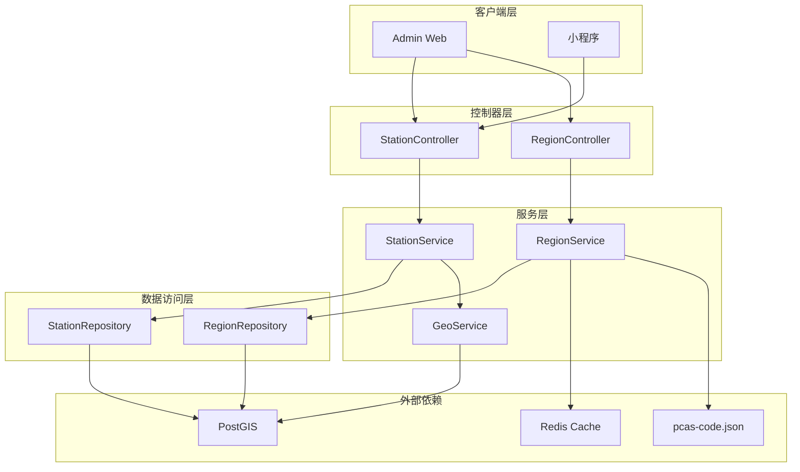
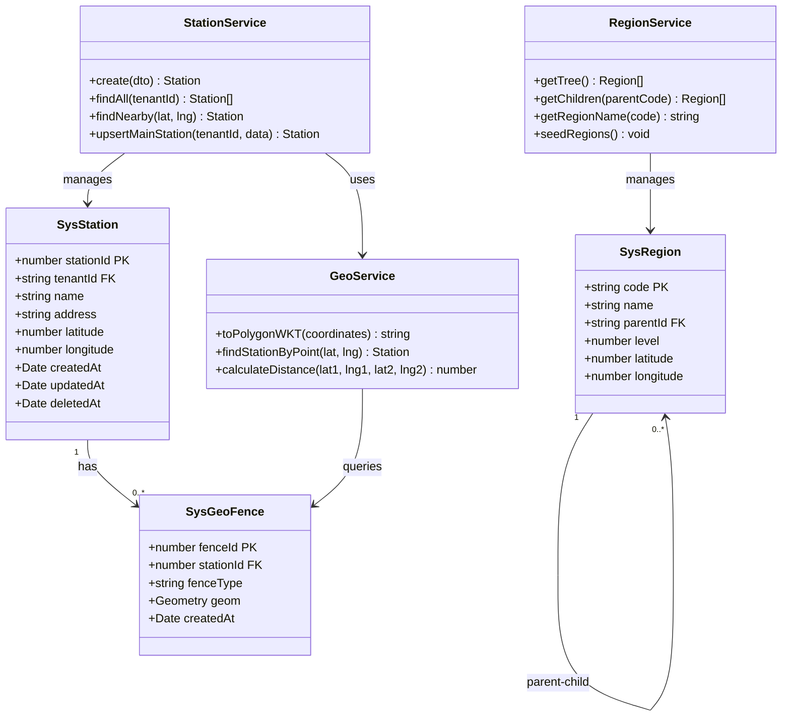
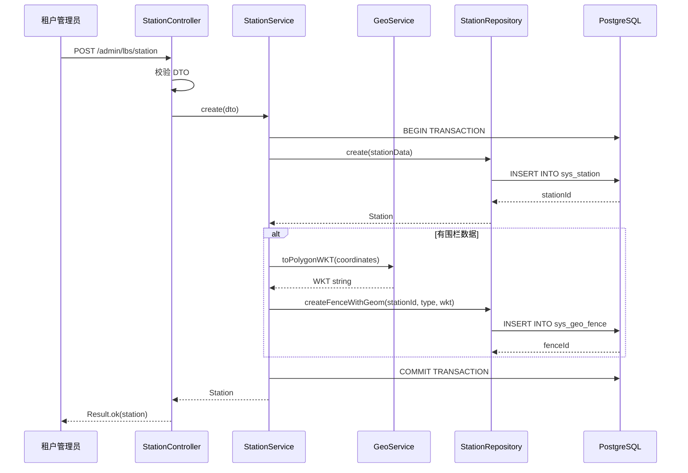
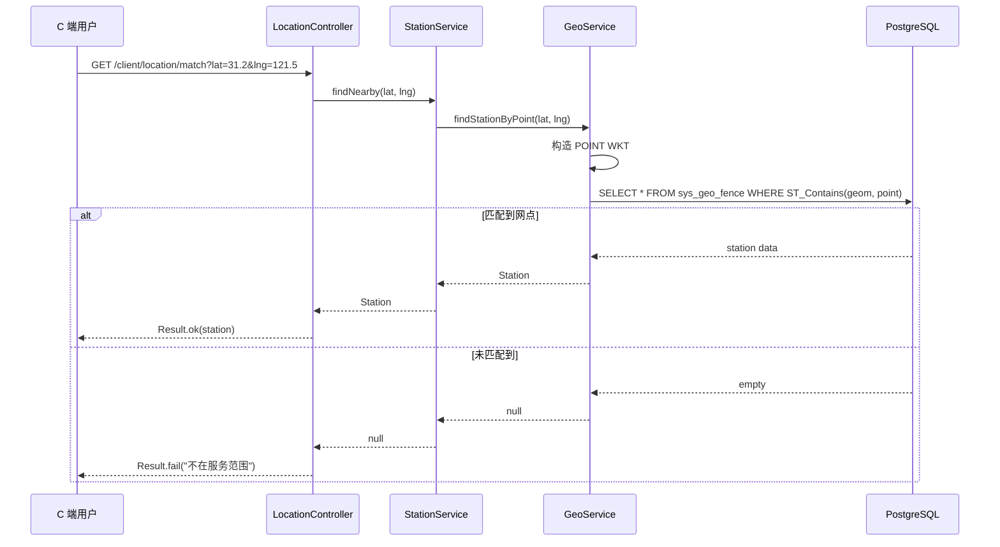
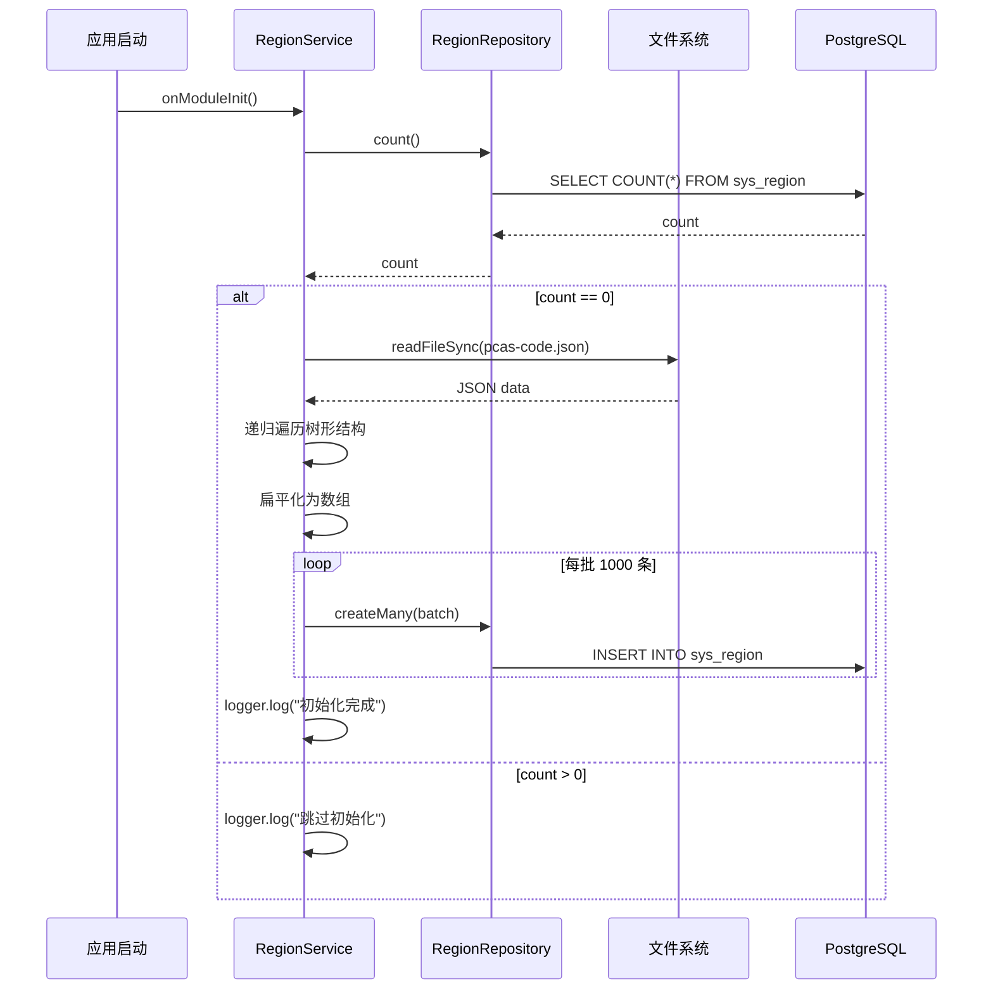
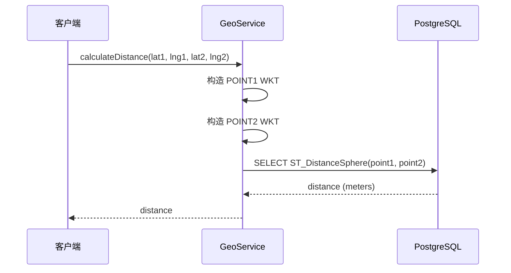
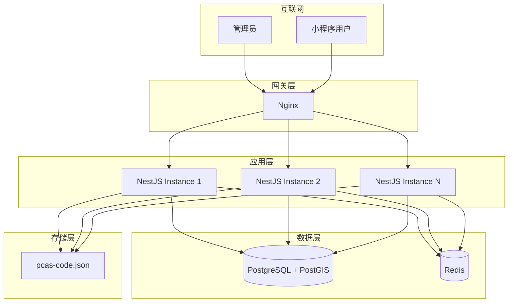

# LBS（位置服务）模块 — 设计文档

> 版本：1.0
> 日期：2026-02-22
> 模块路径：`src/module/lbs/`
> 需求文档：[lbs-requirements.md](../../requirements/lbs/lbs-requirements.md)
> 状态：技术方案 + 改进设计

---

## 1. 设计目标与约束

### 1.1 设计目标

1. 提供高性能的地理空间计算能力（基于 PostGIS）
2. 提供标准化的行政区划数据管理
3. 支持服务网点的地理围栏管理
4. 实现基于位置的服务准入校验
5. 支持多租户隔离的网点管理
6. 保证地理数据的一致性和准确性

### 1.2 技术约束

| 约束项   | 说明                             |
| -------- | -------------------------------- |
| 数据库   | PostgreSQL + PostGIS 扩展        |
| 坐标系   | WGS84（SRID 4326）               |
| 空间索引 | GIST 索引                        |
| 缓存     | Redis（行政区划树缓存）          |
| 事务     | 网点与围栏创建使用事务保证一致性 |

### 1.3 性能目标

| 指标         | 目标值      | 说明             |
| ------------ | ----------- | ---------------- |
| 位置匹配查询 | P95 < 50ms  | 使用空间索引     |
| 距离计算     | P95 < 30ms  | PostGIS 球面距离 |
| 行政区划查询 | P95 < 10ms  | Redis 缓存       |
| 网点创建     | P95 < 200ms | 含事务和围栏创建 |

---

## 2. 架构设计

### 2.1 架构组件图

> 图 1：LBS 模块架构组件图



**架构说明**：

1. 控制器层：提供 Admin 和 Client 接口
2. 服务层：封装业务逻辑，GeoService 提供地理计算能力
3. 数据访问层：Repository 模式访问数据库
4. 外部依赖：PostGIS 提供空间计算，Redis 缓存行政区划

---

## 3. 数据模型设计

### 3.1 数据模型类图

> 图 2：LBS 模块数据模型类图



### 3.2 核心表结构

#### 3.2.1 sys_station（服务网点表）

| 字段       | 类型          | 说明               | 索引  |
| ---------- | ------------- | ------------------ | ----- |
| station_id | SERIAL        | 主键               | PK    |
| tenant_id  | VARCHAR(50)   | 租户 ID            | INDEX |
| name       | VARCHAR(100)  | 网点名称           | -     |
| address    | VARCHAR(255)  | 网点地址           | -     |
| latitude   | DECIMAL(10,7) | 纬度               | -     |
| longitude  | DECIMAL(10,7) | 经度               | -     |
| created_at | TIMESTAMP     | 创建时间           | -     |
| updated_at | TIMESTAMP     | 更新时间           | -     |
| deleted_at | TIMESTAMP     | 删除时间（软删除） | INDEX |

#### 3.2.2 sys_geo_fence（地理围栏表）

| 字段       | 类型                    | 说明                | 索引      |
| ---------- | ----------------------- | ------------------- | --------- |
| fence_id   | SERIAL                  | 主键                | PK        |
| station_id | INTEGER                 | 关联网点 ID         | FK, INDEX |
| fence_type | VARCHAR(20)             | 围栏类型（SERVICE） | -         |
| geom       | GEOMETRY(Polygon, 4326) | PostGIS 几何对象    | GIST      |
| created_at | TIMESTAMP               | 创建时间            | -         |

**关键设计**：

1. `geom` 字段使用 PostGIS 的 GEOMETRY 类型
2. 必须创建 GIST 空间索引：`CREATE INDEX idx_geo_fence_geom ON sys_geo_fence USING GIST(geom);`
3. 坐标系使用 WGS84（SRID 4326）

#### 3.2.3 sys_region（行政区划表）

| 字段      | 类型          | 说明                             | 索引  |
| --------- | ------------- | -------------------------------- | ----- |
| code      | VARCHAR(20)   | 行政区划编码（主键）             | PK    |
| name      | VARCHAR(50)   | 区域名称                         | -     |
| parent_id | VARCHAR(20)   | 父级编码                         | INDEX |
| level     | INTEGER       | 层级（1=省，2=市，3=区，4=街道） | -     |
| latitude  | DECIMAL(10,7) | 纬度                             | -     |
| longitude | DECIMAL(10,7) | 经度                             | -     |

---

## 4. 核心流程设计

### 4.1 服务网点创建流程时序图

> 图 3：服务网点创建时序图



**关键设计**：

1. 使用 `@Transactional()` 装饰器确保网点和围栏创建的原子性
2. 坐标数组转换为 WKT 格式后存储
3. 使用 PostGIS 的 `ST_GeomFromText` 函数创建 Geometry 对象

### 4.2 位置匹配流程时序图

> 图 4：用户位置匹配服务网点时序图



**关键设计**：

1. 使用 PostGIS 的 `ST_Contains` 函数判断点是否在多边形内
2. 使用参数化查询防止 SQL 注入
3. 使用 GIST 空间索引提升查询性能（P95 < 50ms）

### 4.3 行政区划数据初始化流程时序图

> 图 5：行政区划数据初始化时序图



**关键设计**：

1. 模块启动时自动检测并初始化数据
2. 使用批量插入提升性能（每批 1000 条）
3. 支持省市区街道四级行政区划

### 4.4 距离计算流程时序图

> 图 6：两点间距离计算时序图



**关键设计**：

1. 使用 PostGIS 的 `ST_DistanceSphere` 函数计算球面距离
2. 返回单位为米
3. 使用参数化查询防止 SQL 注入

---

## 5. 部署架构设计

### 5.1 部署架构图

> 图 7：LBS 模块部署架构图



**部署说明**：

1. 应用层：多实例部署，通过 Nginx 负载均衡
2. 数据层：PostgreSQL 启用 PostGIS 扩展，Redis 缓存行政区划数据
3. 存储层：pcas-code.json 文件需部署到每个实例的 `src/assets/json/` 目录

### 5.2 数据库扩展安装

```sql
-- 启用 PostGIS 扩展
CREATE EXTENSION IF NOT EXISTS postgis;

-- 创建空间索引
CREATE INDEX idx_geo_fence_geom ON sys_geo_fence USING GIST(geom);

-- 验证 PostGIS 版本
SELECT PostGIS_Version();
```

### 5.3 Redis 缓存策略

| 缓存键            | TTL | 说明             |
| ----------------- | --- | ---------------- |
| `sys:region:tree` | 24h | 行政区划树形结构 |

**缓存更新策略**：

1. 行政区划数据变更后，手动清理缓存键
2. 缓存装饰器 `@SystemCacheable` 自动管理缓存

---

## 6. 缺陷改进方案

### 6.1 D-5：数据初始化无幂等性保护

**问题**：`seedRegions` 方法未使用分布式锁，多实例部署时可能重复初始化数据。

**改进方案**：

```typescript
import { RedisService } from 'src/module/common/redis/redis.service';

@Injectable()
export class RegionService implements OnModuleInit {
  constructor(
    private readonly repo: RegionRepository,
    private readonly redis: RedisService,
  ) {}

  async onModuleInit() {
    const count = await this.repo.count();
    if (count === 0) {
      await this.seedRegionsWithLock();
    }
  }

  private async seedRegionsWithLock() {
    const lockKey = 'lock:region:seed';
    const lockValue = `${Date.now()}`;
    const lockTTL = 60; // 60 秒超时

    // 尝试获取分布式锁
    const acquired = await this.redis.getClient().set(lockKey, lockValue, 'EX', lockTTL, 'NX');

    if (!acquired) {
      this.logger.log('Another instance is seeding regions. Skipping.');
      return;
    }

    try {
      // 再次检查（双重检查锁）
      const count = await this.repo.count();
      if (count > 0) {
        this.logger.log('Regions already seeded by another instance.');
        return;
      }

      // 执行初始化
      await this.seedRegions();
    } finally {
      // 释放锁
      const currentValue = await this.redis.getClient().get(lockKey);
      if (currentValue === lockValue) {
        await this.redis.getClient().del(lockKey);
      }
    }
  }
}
```

**验收标准**：

1. 多实例同时启动时，仅一个实例执行初始化
2. 初始化失败时，锁自动过期，其他实例可重试
3. 初始化成功后，其他实例跳过初始化

### 6.2 D-6：缓存装饰器未实现

**问题**：`@SystemCacheable` 装饰器仅定义了元数据，未实现实际的缓存逻辑（需要 AOP 拦截器）。

**改进方案**：

```typescript
// src/module/admin/common/interceptors/cache.interceptor.ts
import { Injectable, NestInterceptor, ExecutionContext, CallHandler } from '@nestjs/common';
import { Reflector } from '@nestjs/core';
import { Observable, of } from 'rxjs';
import { tap } from 'rxjs/operators';
import { RedisService } from 'src/module/common/redis/redis.service';
import { CACHE_KEY_METADATA, CACHE_TTL_METADATA } from '../decorators/system-cache.decorator';

@Injectable()
export class CacheInterceptor implements NestInterceptor {
  constructor(
    private readonly reflector: Reflector,
    private readonly redis: RedisService,
  ) {}

  async intercept(context: ExecutionContext, next: CallHandler): Promise<Observable<any>> {
    const cacheKey = this.reflector.get<string>(CACHE_KEY_METADATA, context.getHandler());
    const cacheTTL = this.reflector.get<number>(CACHE_TTL_METADATA, context.getHandler());

    if (!cacheKey) {
      return next.handle();
    }

    // 尝试从缓存获取
    const cached = await this.redis.getClient().get(cacheKey);
    if (cached) {
      return of(JSON.parse(cached));
    }

    // 缓存未命中，执行方法并缓存结果
    return next.handle().pipe(
      tap(async (data) => {
        await this.redis.getClient().set(cacheKey, JSON.stringify(data), 'EX', cacheTTL || 3600);
      }),
    );
  }
}
```

```typescript
// src/module/admin/common/decorators/system-cache.decorator.ts
import { SetMetadata } from '@nestjs/common';

export const CACHE_KEY_METADATA = 'cache:key';
export const CACHE_TTL_METADATA = 'cache:ttl';

export function SystemCacheable(options: { key: string; ttl?: number }) {
  return (target: any, propertyKey: string, descriptor: PropertyDescriptor) => {
    SetMetadata(CACHE_KEY_METADATA, options.key)(target, propertyKey, descriptor);
    SetMetadata(CACHE_TTL_METADATA, options.ttl || 3600)(target, propertyKey, descriptor);
    return descriptor;
  };
}
```

```typescript
// lbs.module.ts
import { Module } from '@nestjs/common';
import { APP_INTERCEPTOR } from '@nestjs/core';
import { CacheInterceptor } from 'src/module/admin/common/interceptors/cache.interceptor';

@Module({
  providers: [
    {
      provide: APP_INTERCEPTOR,
      useClass: CacheInterceptor,
    },
    // ... other providers
  ],
})
export class LbsModule {}
```

**验收标准**：

1. `getTree()` 方法首次调用查询数据库，后续调用从 Redis 获取
2. 缓存 TTL 为 24 小时
3. 缓存键为 `sys:region:tree`

### 6.3 D-9：DTO 与 Entity 映射不一致

**问题**：`create` 方法中 DTO 使用嵌套结构（`location: {lat, lng}`），但代码中同时支持扁平结构（`latitude, longitude`），逻辑混乱。

**改进方案**：

```typescript
// dto/station.dto.ts
export class StationPointDto {
  @ApiProperty({ description: '经度' })
  @IsNumber()
  @Min(-180)
  @Max(180)
  lng: number;

  @ApiProperty({ description: '纬度' })
  @IsNumber()
  @Min(-90)
  @Max(90)
  lat: number;
}

export class StationFenceDto {
  @ApiProperty({ description: '围栏坐标点数组', type: [StationPointDto] })
  @IsArray()
  @ValidateNested({ each: true })
  @Type(() => StationPointDto)
  points: StationPointDto[];
}

export class CreateStationDto {
  @ApiProperty({ description: '租户 ID' })
  @IsString()
  tenantId: string;

  @ApiProperty({ description: '网点名称' })
  @IsString()
  @Length(1, 100)
  name: string;

  @ApiProperty({ description: '网点地址' })
  @IsString()
  @Length(1, 255)
  address: string;

  @ApiProperty({ description: '网点位置', type: StationPointDto })
  @ValidateNested()
  @Type(() => StationPointDto)
  location: StationPointDto;

  @ApiProperty({ description: '地理围栏', type: StationFenceDto, required: false })
  @IsOptional()
  @ValidateNested()
  @Type(() => StationFenceDto)
  fence?: StationFenceDto;
}
```

```typescript
// station.service.ts
@Transactional()
async create(dto: CreateStationDto) {
  // 统一使用 DTO 结构，移除扁平结构支持
  const station = await this.repo.create({
    tenantId: dto.tenantId,
    name: dto.name,
    address: dto.address,
    latitude: dto.location.lat,
    longitude: dto.location.lng,
  } as any);

  // 如果提供了围栏数据，则同步创建空间地理围栏记录
  if (dto.fence && dto.fence.points && dto.fence.points.length > 0) {
    const coordinates = dto.fence.points.map((p) => [p.lng, p.lat]);
    const wkt = this.geoService.toPolygonWKT(coordinates);
    await this.repo.createFenceWithGeom(station.stationId, 'SERVICE', wkt);
  }

  return station;
}
```

**验收标准**：

1. DTO 结构统一为嵌套结构
2. 移除扁平结构支持
3. DTO 校验通过后，数据映射到 Entity

### 6.4 D-13：软删除后围栏未清理

**问题**：网点软删除后，关联的围栏记录未清理，可能导致空间查询返回已删除网点。

**改进方案**：

```typescript
// station.service.ts
@Transactional()
async softDelete(stationId: number) {
  // 1. 软删除网点
  await this.repo.update(stationId, { deletedAt: new Date() } as any);

  // 2. 删除关联的围栏记录（硬删除）
  await this.repo.deleteFencesByStationId(stationId);

  return Result.ok(null, '删除成功');
}
```

```typescript
// station.repository.ts
async deleteFencesByStationId(stationId: number, fenceType?: string) {
  const where: any = { stationId };
  if (fenceType) {
    where.fenceType = fenceType;
  }

  return this.prisma.sysGeoFence.deleteMany({ where });
}
```

**验收标准**：

1. 网点软删除后，关联的围栏记录被硬删除
2. 空间查询不会返回已删除网点
3. 使用事务保证网点删除和围栏清理的原子性

### 6.5 X-1：无 C 端接口

**问题**：缺少 C 端查询附近网点、检查服务范围的接口，C 端无法直接使用位置服务。

**改进方案**：

```typescript
// src/module/client/lbs/client-lbs.controller.ts
import { Controller, Get, Query } from '@nestjs/common';
import { ApiTags } from '@nestjs/swagger';
import { Api } from 'src/common/decorators/api.decorator';
import { StationService } from 'src/module/lbs/station/station.service';
import { Result } from 'src/common/result';

/**
 * @tenantScope TenantAgnostic
 * C 端位置服务接口（根据坐标解析租户，不依赖当前登录租户）
 */
@ApiTags('C 端-位置服务')
@Controller('client/lbs')
export class ClientLbsController {
  constructor(private readonly stationService: StationService) {}

  @Api({ summary: '查询附近网点', description: '根据经纬度查询最近的服务网点' })
  @Get('nearby')
  async findNearby(@Query('lat') lat: number, @Query('lng') lng: number) {
    const station = await this.stationService.findNearby(lat, lng);
    if (!station) {
      return Result.fail(404, '当前位置不在服务范围内');
    }
    return Result.ok(station);
  }

  @Api({ summary: '检查服务范围', description: '检查指定位置是否在服务范围内' })
  @Get('check-coverage')
  async checkCoverage(@Query('lat') lat: number, @Query('lng') lng: number) {
    const station = await this.stationService.findNearby(lat, lng);
    return Result.ok({
      inCoverage: !!station,
      station: station || null,
    });
  }
}
```

```typescript
// src/module/client/lbs/client-lbs.module.ts
import { Module } from '@nestjs/common';
import { ClientLbsController } from './client-lbs.controller';
import { LbsModule } from 'src/module/lbs/lbs.module';

@Module({
  imports: [LbsModule],
  controllers: [ClientLbsController],
})
export class ClientLbsModule {}
```

**验收标准**：

1. C 端可以通过 `GET /client/lbs/nearby?lat=31.2&lng=121.5` 查询附近网点
2. C 端可以通过 `GET /client/lbs/check-coverage?lat=31.2&lng=121.5` 检查服务范围
3. 接口返回网点信息（名称、地址、经纬度）

### 6.6 X-2：无与订单模块集成

**问题**：订单创建时未调用位置匹配服务，无法自动分配网点。

**改进方案**：

```typescript
// src/module/client/order/order.service.ts
import { StationService } from 'src/module/lbs/station/station.service';

@Injectable()
export class OrderService {
  constructor(
    private readonly stationService: StationService,
    // ... other dependencies
  ) {}

  @Transactional()
  async create(dto: CreateOrderDto, memberId: string) {
    // 1. 根据收货地址经纬度匹配服务网点
    const station = await this.stationService.findNearby(dto.deliveryAddress.latitude, dto.deliveryAddress.longitude);

    if (!station) {
      throw new BusinessException(ResponseCode.BUSINESS_ERROR, '当前收货地址不在服务范围内');
    }

    // 2. 创建订单，关联网点
    const order = await this.orderRepo.create({
      ...dto,
      memberId,
      tenantId: station.tenantId,
      stationId: station.stationId,
    });

    return order;
  }
}
```

**验收标准**：

1. 订单创建时自动调用位置匹配服务
2. 匹配到网点后，订单关联网点 ID 和租户 ID
3. 未匹配到网点时，返回错误提示

### 6.7 X-3：无与配送模块集成

**问题**：缺少配送距离计算、配送范围校验等功能。

**改进方案**：

```typescript
// src/module/delivery/delivery.service.ts
import { GeoService } from 'src/module/lbs/geo/geo.service';

@Injectable()
export class DeliveryService {
  constructor(
    private readonly geoService: GeoService,
    // ... other dependencies
  ) {}

  async calculateDeliveryFee(
    stationLat: number,
    stationLng: number,
    deliveryLat: number,
    deliveryLng: number,
  ): Promise<number> {
    // 1. 计算配送距离（米）
    const distance = await this.geoService.calculateDistance(stationLat, stationLng, deliveryLat, deliveryLng);

    // 2. 根据距离计算配送费
    const distanceKm = distance / 1000;
    let fee = 0;

    if (distanceKm <= 3) {
      fee = 5; // 3 公里内 5 元
    } else if (distanceKm <= 5) {
      fee = 8; // 3-5 公里 8 元
    } else {
      fee = 8 + Math.ceil((distanceKm - 5) / 1) * 2; // 超过 5 公里，每公里加 2 元
    }

    return fee;
  }

  async checkDeliveryRange(
    stationLat: number,
    stationLng: number,
    deliveryLat: number,
    deliveryLng: number,
    maxDistance: number = 10000, // 默认最大配送距离 10 公里
  ): Promise<boolean> {
    const distance = await this.geoService.calculateDistance(stationLat, stationLng, deliveryLat, deliveryLng);

    return distance <= maxDistance;
  }
}
```

**验收标准**：

1. 配送模块可以调用 `calculateDistance` 计算配送距离
2. 配送模块可以根据距离计算配送费
3. 配送模块可以校验配送范围

---

## 7. 架构改进方案

### 7.1 A-1：地理编码服务

**问题**：缺少地址到坐标的转换（Geocoding），需要手动输入经纬度，用户体验差。

**改进方案**：

```typescript
// src/module/lbs/geocoding/geocoding.service.ts
import { Injectable } from '@nestjs/common';
import { HttpService } from '@nestjs/axios';
import { ConfigService } from '@nestjs/config';
import { firstValueFrom } from 'rxjs';

@Injectable()
export class GeocodingService {
  private readonly apiKey: string;
  private readonly apiUrl = 'https://restapi.amap.com/v3/geocode/geo';

  constructor(
    private readonly httpService: HttpService,
    private readonly configService: ConfigService,
  ) {
    this.apiKey = this.configService.get<string>('AMAP_API_KEY');
  }

  async geocode(address: string): Promise<{ lat: number; lng: number } | null> {
    try {
      const response = await firstValueFrom(
        this.httpService.get(this.apiUrl, {
          params: {
            key: this.apiKey,
            address,
          },
        }),
      );

      if (response.data.status === '1' && response.data.geocodes.length > 0) {
        const location = response.data.geocodes[0].location.split(',');
        return {
          lng: parseFloat(location[0]),
          lat: parseFloat(location[1]),
        };
      }

      return null;
    } catch (error) {
      this.logger.error('Geocoding failed:', getErrorMessage(error));
      return null;
    }
  }
}
```

**验收标准**：

1. 输入地址，返回经纬度
2. 地址无法解析时，返回 null
3. 集成高德地图或百度地图 API

### 7.2 A-2：逆地理编码服务

**问题**：缺少坐标到地址的转换（Reverse Geocoding），无法自动填充地址信息。

**改进方案**：

```typescript
// src/module/lbs/geocoding/geocoding.service.ts
async reverseGeocode(lat: number, lng: number): Promise<string | null> {
  try {
    const response = await firstValueFrom(
      this.httpService.get('https://restapi.amap.com/v3/geocode/regeo', {
        params: {
          key: this.apiKey,
          location: `${lng},${lat}`,
        },
      }),
    );

    if (response.data.status === '1' && response.data.regeocode) {
      return response.data.regeocode.formatted_address;
    }

    return null;
  } catch (error) {
    this.logger.error('Reverse geocoding failed:', getErrorMessage(error));
    return null;
  }
}
```

**验收标准**：

1. 输入经纬度，返回地址
2. 坐标无法解析时，返回 null
3. 集成高德地图或百度地图 API

---

## 8. 接口与数据约定

### 8.1 Admin 接口

| 接口       | 方法   | 路径                    | 说明               | 权限               |
| ---------- | ------ | ----------------------- | ------------------ | ------------------ |
| 创建网点   | POST   | /admin/lbs/station      | 创建服务网点及围栏 | lbs:station:create |
| 更新网点   | PUT    | /admin/lbs/station/:id  | 更新网点信息       | lbs:station:update |
| 删除网点   | DELETE | /admin/lbs/station/:id  | 软删除网点         | lbs:station:delete |
| 网点列表   | GET    | /admin/lbs/station/list | 查询网点列表       | lbs:station:list   |
| 行政区划树 | GET    | /admin/lbs/region/tree  | 获取行政区划树     | lbs:region:list    |

### 8.2 Client 接口

| 接口         | 方法 | 路径                       | 说明                     | 租户隔离       |
| ------------ | ---- | -------------------------- | ------------------------ | -------------- |
| 查询附近网点 | GET  | /client/lbs/nearby         | 根据经纬度查询最近网点   | TenantAgnostic |
| 检查服务范围 | GET  | /client/lbs/check-coverage | 检查位置是否在服务范围内 | TenantAgnostic |

### 8.3 数据约定

#### 8.3.1 坐标系

- 统一使用 WGS84 坐标系（SRID 4326）
- 经度范围：-180 ~ 180
- 纬度范围：-90 ~ 90

#### 8.3.2 WKT 格式

```
POINT(121.5 31.2)
POLYGON((121.5 31.2, 121.6 31.2, 121.6 31.3, 121.5 31.3, 121.5 31.2))
```

#### 8.3.3 围栏类型枚举

```typescript
export enum FenceType {
  SERVICE = 'SERVICE', // 服务范围
  DELIVERY = 'DELIVERY', // 配送范围
  BUSINESS = 'BUSINESS', // 营业范围
}
```

---

## 9. 优先级总结与实施路线图

### 9.1 优先级矩阵

| 优先级 | 任务                    | 预估工时 | 依赖            |
| ------ | ----------------------- | -------- | --------------- |
| P0     | D-5：数据初始化分布式锁 | 2h       | Redis           |
| P0     | D-6：缓存装饰器实现     | 2d       | Redis           |
| P0     | D-9：DTO 映射统一       | 1d       | -               |
| P0     | D-13：软删除后围栏清理  | 0.5d     | -               |
| P1     | X-1：C 端接口           | 1.5d     | -               |
| P1     | A-1：地理编码服务       | 2-3d     | 高德/百度 API   |
| P1     | A-2：逆地理编码服务     | 1-2d     | 高德/百度 API   |
| P2     | X-2：订单模块集成       | 1-2d     | Order Module    |
| P2     | X-3：配送模块集成       | 2-3d     | Delivery Module |
| P2     | A-6：多围栏类型支持     | 2-3d     | -               |

### 9.2 实施路线图

#### 第一阶段：核心修复（1-2 周）

```
Week 1:
- D-5：数据初始化分布式锁（2h）
- D-9：DTO 映射统一（1d）
- D-13：软删除后围栏清理（0.5d）

Week 2:
- D-6：缓存装饰器实现（2d）
- 单元测试和集成测试
```

#### 第二阶段：C 端能力（2-3 周）

```
Week 3:
- X-1：C 端接口（1.5d）
- A-1：地理编码服务（2-3d）

Week 4:
- A-2：逆地理编码服务（1-2d）
- 接口测试和文档
```

#### 第三阶段：业务集成（1-2 月）

```
Month 2:
- X-2：订单模块集成（1-2d）
- X-3：配送模块集成（2-3d）
- A-6：多围栏类型支持（2-3d）
- 集成测试
```

#### 第四阶段：运营工具（3-6 月）

```
Month 3-6:
- A-4：地图可视化
- A-5：围栏热力图
- A-3：路径规划服务
- 行政区划数据更新机制
```

### 9.3 关键路径

```
D-5(分布式锁) → D-6(缓存装饰器) → D-9(DTO 映射) → X-1(C 端接口) → A-1(地理编码) → X-2(订单集成)
```

### 9.4 风险与依赖

| 风险                 | 影响             | 缓解措施                 |
| -------------------- | ---------------- | ------------------------ |
| PostGIS 扩展未安装   | 无法使用空间计算 | 部署前检查，提供安装脚本 |
| 第三方地图 API 限流  | 地理编码失败     | 缓存结果，降级方案       |
| 多实例数据初始化冲突 | 数据重复         | 分布式锁 + 双重检查      |
| 空间索引未创建       | 查询性能差       | 迁移脚本自动创建索引     |

---

**文档版本**：1.0
**最后更新**：2026-02-22
**维护者**：Backend Team
