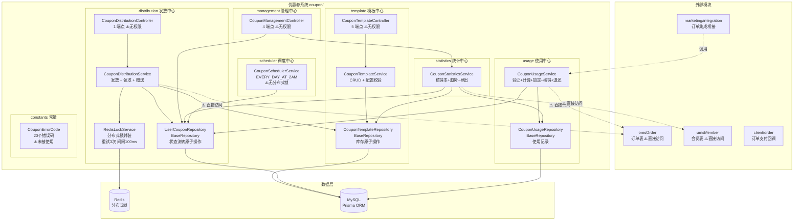
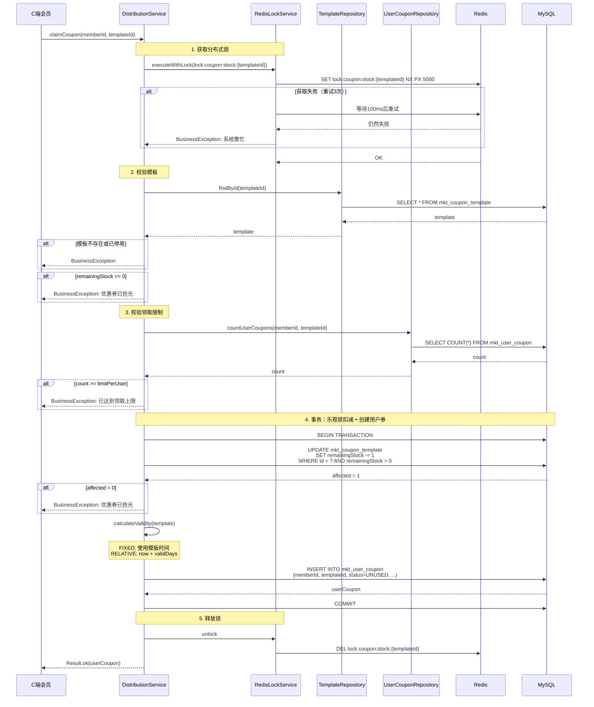
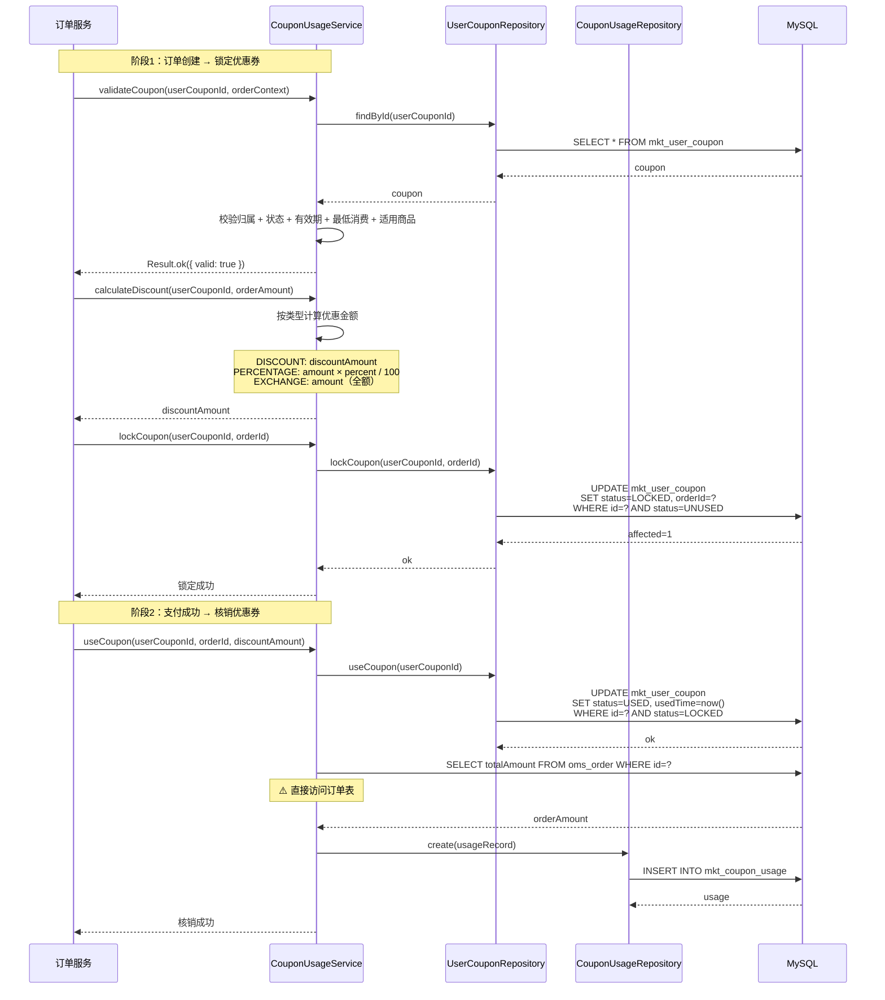
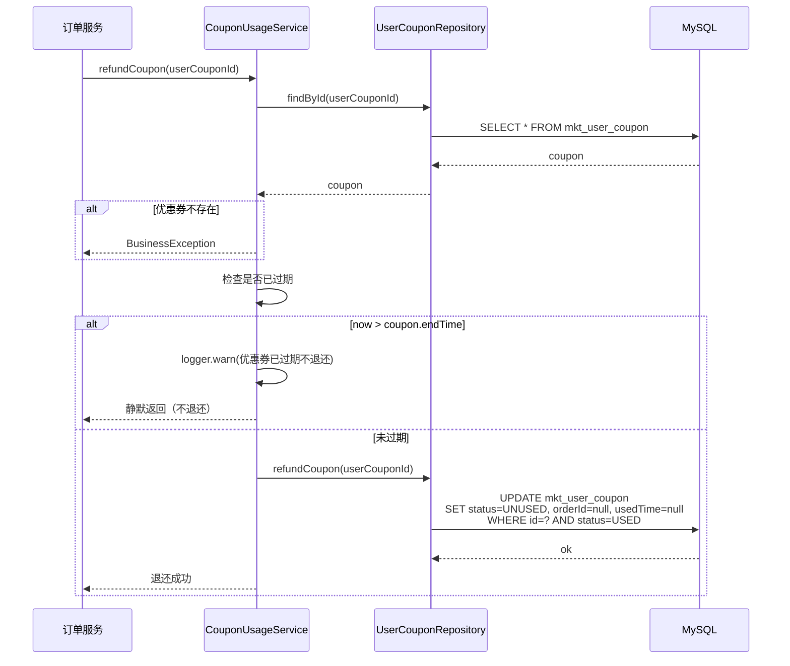
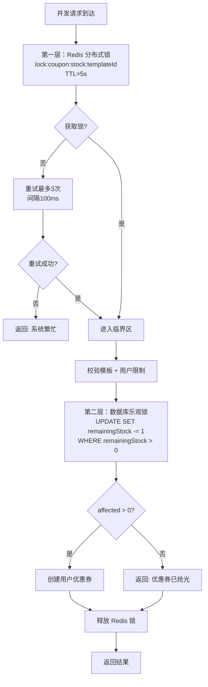
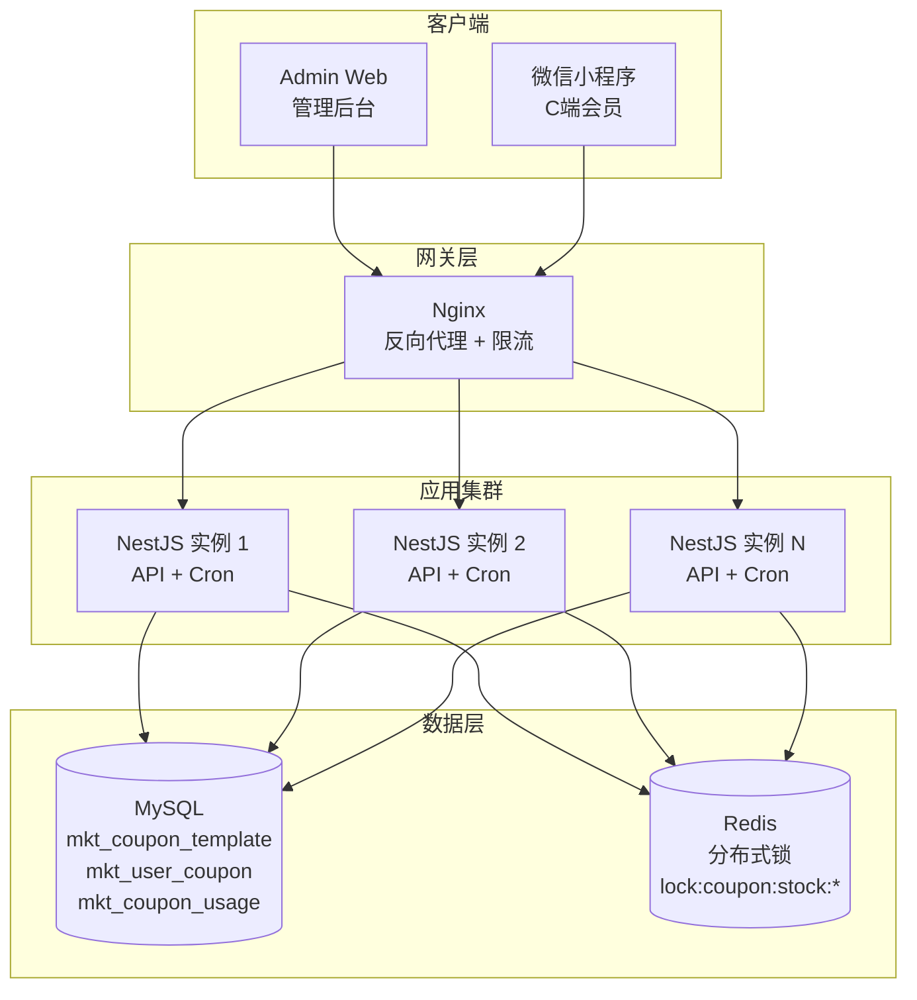

# 优惠券系统 — 设计文档

> 版本：1.0
> 日期：2026-02-22
> 模块路径：`src/module/marketing/coupon/`（template, distribution, usage, management, statistics, scheduler）
> 需求文档：[coupon-requirements.md](../../../requirements/marketing/coupon/coupon-requirements.md)
> 状态：现状架构分析 + 改进方案设计

---

## 1. 概述

### 1.1 设计目标

1. 完整描述优惠券系统的技术架构、数据流、跨模块协作关系
2. 针对需求文档中识别的 14 个代码缺陷（D-1 ~ D-14）和 5 个跨模块缺陷（X-1 ~ X-5），给出具体改进方案与代码示例
3. 针对 9 个架构不足（A-1 ~ A-9），给出技术设计方案
4. 为中长期演进（C 端接口层、叠加规则、事件驱动）提供技术设计

### 1.2 约束

| 约束     | 说明                                                                 |
| -------- | -------------------------------------------------------------------- |
| 框架     | NestJS + Prisma ORM + MySQL                                          |
| 缓存/锁  | Redis（分布式锁、库存并发控制）                                      |
| 事务     | `@Transactional()` 装饰器（基于 CLS 上下文）                         |
| 调度     | `@nestjs/schedule`（Cron 表达式）                                    |
| 多租户   | 通过 `BaseRepository` 自动注入 `tenantId` 过滤                       |
| 并发控制 | 分布式锁（Redis SET NX）+ 数据库乐观锁（`WHERE remainingStock > 0`） |

---

## 2. 架构与模块（组件图）

> 图 1：优惠券系统组件图



**组件说明**：

| 组件                        | 职责                             | 当前问题                                                        |
| --------------------------- | -------------------------------- | --------------------------------------------------------------- |
| `CouponTemplateController`  | 模板 CRUD（5 端点）              | 缺少 `@ApiBearerAuth`、`@RequirePermission`、`@Operlog`         |
| `CouponDistributionService` | 发放 + 领取 + 赠送（分布式锁）   | 直接访问 `omsOrder` 表（D-10）                                  |
| `CouponUsageService`        | 验证 + 计算 + 锁定 + 核销 + 退还 | 直接访问 `omsOrder` 表（D-11）                                  |
| `CouponStatisticsService`   | 核销率 + 7 日趋势 + 导出         | N+1 查询（D-7）、导出无限制（D-8）、直接访问 `umsMember`（X-3） |
| `CouponSchedulerService`    | 过期券清理（每天凌晨 2 点）      | 无分布式锁（D-5）                                               |
| `RedisLockService`          | 分布式锁封装                     | 正常工作                                                        |
| `CouponErrorCode`           | 20 个错误码定义                  | 未被任何 Service 使用（D-4）                                    |

**依赖方向**：`Distribution` → `Template`（模板校验 + 库存扣减）、`Usage` → `UserCoupon`（状态流转）、`Management` → `Statistics`（统计查询）、`Integration` → `Usage`（订单集成调用）。

---

## 3. 领域/数据模型（类图）

> 图 2：优惠券系统数据模型类图

```mermaid
classDiagram
    class MktCouponTemplate {
        +String id PK
        +String tenantId FK
        +String name
        +CouponType type
        +CouponValidityType validityType
        +Decimal discountAmount
        +Int discountPercent
        +Decimal maxDiscountAmount
        +Decimal minOrderAmount
        +String exchangeProductId
        +Int totalStock
        +Int remainingStock
        +Int limitPerUser
        +DateTime startTime
        +DateTime endTime
        +Int validDays
        +String[] applicableProducts
        +Int[] applicableCategories
        +String[] memberLevels
        +CouponStatus status
        +String createBy
        +DateTime createTime
        +DateTime updateTime
    }

    class MktUserCoupon {
        +String id PK
        +String tenantId FK
        +String memberId FK
        +String templateId FK
        +String couponName
        +CouponType couponType
        +Decimal discountAmount
        +Int discountPercent
        +Decimal maxDiscountAmount
        +Decimal minOrderAmount
        +DateTime startTime
        +DateTime endTime
        +UserCouponStatus status
        +CouponDistributionType distributionType
        +String orderId
        +DateTime usedTime
        +DateTime receiveTime
        +DateTime createTime
    end

    class MktCouponUsage {
        +String id PK
        +String tenantId FK
        +String userCouponId FK
        +String memberId
        +String orderId
        +Decimal discountAmount
        +Decimal orderAmount
        +DateTime usedTime
        +DateTime createTime
    }

    class CouponType {
        <<enumeration>>
        DISCOUNT
        PERCENTAGE
        EXCHANGE
    }

    class CouponValidityType {
        <<enumeration>>
        FIXED
        RELATIVE
    }

    class UserCouponStatus {
        <<enumeration>>
        UNUSED
        LOCKED
        USED
        EXPIRED
    }

    class CouponDistributionType {
        <<enumeration>>
        MANUAL
        ACTIVITY
        ORDER
    }

    class CouponStatus {
        <<enumeration>>
        ACTIVE
        INACTIVE
    }

    MktCouponTemplate "1" --> "*" MktUserCoupon : templateId
    MktUserCoupon "1" --> "0..1" MktCouponUsage : userCouponId
    MktCouponTemplate -- CouponType
    MktCouponTemplate -- CouponValidityType
    MktCouponTemplate -- CouponStatus
    MktUserCoupon -- UserCouponStatus
    MktUserCoupon -- CouponDistributionType
    MktUserCoupon -- CouponType
```

**数据流向**：`MktCouponTemplate`（蓝图定义）→ `MktUserCoupon`（用户持有的券实例）→ `MktCouponUsage`（使用记录）。

**关键字段说明**：

| 表                                       | 字段     | 说明                                               |
| ---------------------------------------- | -------- | -------------------------------------------------- |
| `MktCouponTemplate.remainingStock`       | Int      | 剩余库存，乐观锁扣减（`WHERE remainingStock > 0`） |
| `MktCouponTemplate.limitPerUser`         | Int      | 每人限领数量                                       |
| `MktCouponTemplate.applicableProducts`   | String[] | 适用商品 ID 列表（空 = 全部适用）                  |
| `MktCouponTemplate.applicableCategories` | Int[]    | 适用分类 ID 列表（空 = 全部适用）                  |
| `MktCouponTemplate.memberLevels`         | String[] | 限制会员等级（⚠️ 已定义但未校验）                  |
| `MktUserCoupon.orderId`                  | String   | 锁定时绑定的订单 ID，解锁/退还时清除               |
| `MktUserCoupon.status`                   | Enum     | 4 种状态，由 Repository 原子操作控制流转           |
| `MktCouponUsage.discountAmount`          | Decimal  | 实际优惠金额（核销时记录）                         |

---

## 4. 核心流程时序（时序图）

### 4.1 优惠券领取（分布式锁 + 乐观锁双重保障）

> 图 3：优惠券领取时序图



### 4.2 优惠券在订单中的使用（锁定 → 核销）

> 图 4：优惠券订单使用时序图



### 4.3 优惠券退还（订单退款场景）

> 图 5：优惠券退还时序图



---

## 5. 状态与流程

### 5.1 用户优惠券状态机（状态图）

状态图已在需求文档图 7 中详细描述，此处补充技术实现细节。

**状态机实现**：优惠券系统未使用独立的状态机配置文件（与 MaaS 的 `state-machine.config.ts` 不同），状态流转通过 `UserCouponRepository` 的原子操作方法隐式控制。

**关键技术点**：

| 机制     | 实现方式                               | 说明                                                     |
| -------- | -------------------------------------- | -------------------------------------------------------- |
| 跃迁控制 | `updateMany` + `WHERE status = ?`      | 通过 WHERE 条件隐式校验当前状态，不匹配则 `affected = 0` |
| 并发控制 | 数据库行级锁（`updateMany` 原子操作）  | 无额外分布式锁，依赖数据库事务隔离                       |
| 终态保护 | EXPIRED 状态无对应的 `updateMany` 方法 | 隐式保护，但缺少显式校验                                 |
| 退还限制 | `refundCoupon` 前检查 `endTime`        | 已过期的券不退还，静默返回                               |

**与 MaaS 状态机的对比**：

| 维度     | MaaS PlayInstance                  | Coupon UserCoupon           |
| -------- | ---------------------------------- | --------------------------- |
| 状态数   | 7 个                               | 4 个                        |
| 实现方式 | 独立配置文件 + `isValidTransition` | Repository 原子操作隐式控制 |
| 并发控制 | Redis 分布式锁 + 状态机校验        | 数据库 `WHERE status = ?`   |
| 事件发送 | `emitStatusChangeEvent`            | 无                          |
| 终态保护 | `isFinal` 标记                     | 隐式（无对应方法）          |

### 5.2 优惠券领取并发控制流程（活动图）

> 图 6：并发控制双重保障活动图



**设计分析**：

当前双重锁方案的优劣：

| 维度      | 优势                                      | 劣势                                                   |
| --------- | ----------------------------------------- | ------------------------------------------------------ |
| 安全性    | 双重保障，即使 Redis 锁失效仍有数据库兜底 | —                                                      |
| 吞吐量    | —                                         | 锁粒度为模板级，同一模板的所有领取请求串行化           |
| 复杂度    | —                                         | 两层锁增加了代码复杂度和故障排查难度                   |
| 对比 MaaS | —                                         | MaaS 使用 Redis Lua 原子扣减，无需分布式锁，吞吐量更高 |

---

## 6. 部署架构（部署图）

> 图 7：优惠券系统部署图



**部署注意事项**：

| 关注点    | 当前状态                 | 风险                           | 改进建议                |
| --------- | ------------------------ | ------------------------------ | ----------------------- |
| Cron 任务 | 所有实例均执行           | 多实例重复处理过期券           | 添加分布式锁（D-5）     |
| 库存扣减  | 分布式锁 + 乐观锁        | 锁粒度为模板级，高并发时串行化 | 改用 Redis Lua 原子扣减 |
| 分布式锁  | Redis SET NX             | 锁超时后可能重入               | 使用 Redlock 或续期机制 |
| 导出      | 同步全量查询             | 大数据量内存溢出               | 异步导出 + 分页流式写入 |
| 数据增长  | `mkt_user_coupon` 为大表 | 数据量级 D2~D3                 | 需要索引优化 + 归档策略 |

---

## 7. 缺陷改进方案

### 7.1 D-1/D-2/D-3：Controller 安全基线修复

**问题**：10 个端点缺少 `@ApiBearerAuth`、`@RequirePermission`、`@Operlog`。

**改进方案**：以 `CouponTemplateController` 为例，其他 Controller 同理。

```typescript
// template.controller.ts — 改进后
@ApiTags('营销-优惠券模板')
@Controller('admin/marketing/coupon/templates')
@ApiBearerAuth('Authorization') // ✅ 新增
export class CouponTemplateController {
  constructor(private readonly service: CouponTemplateService) {}

  @Get()
  @Api({ summary: '查询优惠券模板列表', type: CouponTemplateListVo, isPager: true })
  @RequirePermission('marketing:coupon:template:list') // ✅ 新增
  async findAll(@Query() query: ListCouponTemplateDto) {
    return await this.service.findAll(query);
  }

  @Post()
  @Api({ summary: '创建优惠券模板', type: CouponTemplateVo })
  @RequirePermission('marketing:coupon:template:create') // ✅ 新增
  @Operlog({ businessType: BusinessType.INSERT }) // ✅ 新增
  async create(@Body() dto: CreateCouponTemplateDto) {
    return await this.service.create(dto);
  }

  @Put(':id')
  @Api({ summary: '更新优惠券模板', type: CouponTemplateVo })
  @RequirePermission('marketing:coupon:template:update') // ✅ 新增
  @Operlog({ businessType: BusinessType.UPDATE }) // ✅ 新增
  async update(@Param('id') id: string, @Body() dto: UpdateCouponTemplateDto) {
    return await this.service.update(id, dto);
  }

  // ... 其他端点同理
}
```

**权限编码规范**：

| 子模块       | 操作                          | 权限编码                                                                 |
| ------------ | ----------------------------- | ------------------------------------------------------------------------ |
| template     | 列表/详情/创建/更新/状态/停用 | `marketing:coupon:template:{list,query,create,update,status,deactivate}` |
| distribution | 手动发放                      | `marketing:coupon:distribute:manual`                                     |
| management   | 用户券列表/使用记录/统计/导出 | `marketing:coupon:manage:{user-coupons,usage-records,statistics,export}` |

### 7.2 D-4：错误码统一使用

**问题**：`CouponErrorCode` 定义了 20 个错误码但未被使用。

**改进方案**：创建辅助函数，在所有 Service 中统一使用。

```typescript
// constants/error-codes.ts — 新增辅助函数
import { BusinessException } from 'src/common/exceptions';
import { ResponseCode } from 'src/common/response';

export function throwCouponError(code: CouponErrorCode): never {
  throw new BusinessException(ResponseCode.BUSINESS_ERROR, CouponErrorMessages[code]);
}

export function throwCouponErrorIf(condition: boolean, code: CouponErrorCode): void {
  if (condition) throwCouponError(code);
}

export function throwCouponErrorIfNull<T>(value: T | null | undefined, code: CouponErrorCode): asserts value is T {
  if (value == null) throwCouponError(code);
}
```

```typescript
// distribution.service.ts — 改进后
import { throwCouponErrorIfNull, throwCouponErrorIf, CouponErrorCode } from '../constants/error-codes';

// ❌ 旧: BusinessException.throwIfNull(template, '优惠券模板不存在');
// ✅ 新:
throwCouponErrorIfNull(template, CouponErrorCode.TEMPLATE_NOT_FOUND);

// ❌ 旧: BusinessException.throwIf(template.status !== CouponStatus.ACTIVE, '优惠券模板已停用');
// ✅ 新:
throwCouponErrorIf(template.status !== CouponStatus.ACTIVE, CouponErrorCode.TEMPLATE_INACTIVE);

// ❌ 旧: BusinessException.throwIf(template.remainingStock <= 0, '优惠券已抢光');
// ✅ 新:
throwCouponErrorIf(template.remainingStock <= 0, CouponErrorCode.STOCK_INSUFFICIENT);
```

### 7.3 D-5/D-6：定时任务修复

**问题**：无分布式锁 + catch 不安全。

**改进方案**：

```typescript
// scheduler.service.ts — 改进后
import { getErrorMessage } from 'src/common/utils/error';

@Injectable()
export class CouponSchedulerService {
  constructor(
    private readonly userCouponRepo: UserCouponRepository,
    private readonly redisLock: RedisLockService, // ✅ 注入锁服务
  ) {}

  @Cron(CronExpression.EVERY_DAY_AT_2AM)
  async cleanExpiredCoupons() {
    // ✅ 新增：分布式锁
    const lockKey = 'scheduler:coupon:expire:lock';
    const acquired = await this.redisLock.tryLock(lockKey, 55000);
    if (!acquired) {
      this.logger.debug('[定时任务] 其他实例正在处理，跳过');
      return;
    }

    try {
      this.logger.log('开始清理过期优惠券...');
      const count = await this.userCouponRepo.expireCoupons();
      this.logger.log(`清理过期优惠券完成，共处理 ${count} 张优惠券`);
    } catch (error) {
      // ✅ 修复：使用 getErrorMessage 安全提取
      this.logger.error('清理过期优惠券失败:', getErrorMessage(error));
    } finally {
      await this.redisLock.unlock(lockKey);
    }
  }
}
```

### 7.4 D-7：7 日趋势 N+1 查询优化

**问题**：循环 7 天 × 2 次查询 = 14 次 DB 查询。

**改进方案**：改为 2 次聚合查询。

```typescript
// statistics.service.ts — 改进后
private async getLast7DaysTrend() {
  const today = new Date();
  today.setHours(0, 0, 0, 0);
  const sevenDaysAgo = new Date(today);
  sevenDaysAgo.setDate(sevenDaysAgo.getDate() - 6);

  // ✅ 改进：单次查询获取7天发放数据
  const distributedByDay = await this.prisma.mktUserCoupon.groupBy({
    by: ['receiveTime'],
    where: {
      receiveTime: { gte: sevenDaysAgo },
    },
    _count: true,
  });

  // ✅ 改进：单次查询获取7天使用数据
  const usedByDay = await this.prisma.mktUserCoupon.groupBy({
    by: ['usedTime'],
    where: {
      status: 'USED',
      usedTime: { gte: sevenDaysAgo },
    },
    _count: true,
  });

  // 按日期聚合（Prisma groupBy 按日期需要 raw query 或应用层聚合）
  // 实际实现可使用 $queryRaw 按 DATE(receiveTime) 分组
  // 此处展示思路，具体实现需根据 Prisma 版本调整
}
```

> 注：Prisma `groupBy` 不直接支持按日期截断分组，生产实现建议使用 `$queryRaw`：

```typescript
const distributed = await this.prisma.$queryRaw<{ date: string; count: bigint }[]>`
  SELECT DATE(receive_time) as date, COUNT(*) as count
  FROM mkt_user_coupon
  WHERE receive_time >= ${sevenDaysAgo}
  GROUP BY DATE(receive_time)
`;

const used = await this.prisma.$queryRaw<{ date: string; count: bigint }[]>`
  SELECT DATE(used_time) as date, COUNT(*) as count
  FROM mkt_user_coupon
  WHERE status = 'USED' AND used_time >= ${sevenDaysAgo}
  GROUP BY DATE(used_time)
`;
```

### 7.5 D-8：导出数量限制

**问题**：`exportUsageRecords` 无分页限制，大数据量时内存溢出。

**改进方案**：

```typescript
// statistics.service.ts — 改进后
async exportUsageRecords(query: any, res: Response): Promise<void> {
  // ✅ 新增：数量限制
  const MAX_EXPORT_ROWS = 10000;

  const totalCount = await this.prisma.mktCouponUsage.count({ where });
  if (totalCount > MAX_EXPORT_ROWS) {
    throw new BusinessException(
      ResponseCode.BUSINESS_ERROR,
      `导出数据量（${totalCount}条）超过上限（${MAX_EXPORT_ROWS}条），请缩小查询范围`,
    );
  }

  // ... 原有导出逻辑 ...
}
```

### 7.6 D-10/D-11/X-1：消除跨模块直接表访问

**问题**：`distribution.service.ts` 和 `usage.service.ts` 直接访问 `omsOrder` 表。

**改进方案**：通过参数传递替代直接查询。

```typescript
// usage.service.ts — 改进后

// ❌ 旧: useCoupon 内部调用 getOrderAmount 直接查 omsOrder
// ✅ 新: 调用方传入 orderAmount，消除跨模块依赖
@Transactional()
async useCoupon(userCouponId: string, orderId: string, discountAmount: number, orderAmount: number) {
  const coupon = await this.userCouponRepo.findById(userCouponId);
  BusinessException.throwIfNull(coupon, '优惠券不存在');

  await this.userCouponRepo.useCoupon(userCouponId);

  // ✅ 改进：使用传入的 orderAmount，不再直接查询 omsOrder
  await this.usageRepo.create({
    tenantId: coupon.tenantId,
    userCoupon: { connect: { id: userCouponId } },
    memberId: coupon.memberId,
    orderId,
    discountAmount: new Decimal(discountAmount),
    orderAmount: new Decimal(orderAmount),
  });
}
```

```typescript
// distribution.service.ts — 改进后

// ❌ 旧: grantByOrder 直接查 omsOrder 获取 memberId
// ✅ 新: 调用方传入 memberId
@Transactional()
async grantByOrder(memberId: string, templateIds: string[]) {
  // 不再需要查询 omsOrder
  const coupons = [];
  for (const templateId of templateIds) {
    try {
      const userCoupon = await this.claimCouponInternal(
        memberId,
        templateId,
        CouponDistributionType.ORDER,
      );
      coupons.push(userCoupon);
    } catch (error) {
      this.logger.warn({
        message: 'Failed to grant coupon by order',
        memberId,
        templateId,
        error: getErrorMessage(error),
      });
    }
  }
  return coupons;
}
```

---

## 8. 架构改进方案

### 8.1 A-7：事件驱动架构

**问题**：优惠券的领取、使用、过期等关键节点未发送事件。

**改进方案**：创建 `coupon/events/` 事件定义和发送机制。

```typescript
// coupon/events/coupon-event.types.ts
export enum CouponEventType {
  COUPON_CLAIMED = 'coupon.claimed', // 优惠券被领取
  COUPON_LOCKED = 'coupon.locked', // 优惠券被锁定
  COUPON_USED = 'coupon.used', // 优惠券被使用
  COUPON_UNLOCKED = 'coupon.unlocked', // 优惠券被解锁
  COUPON_REFUNDED = 'coupon.refunded', // 优惠券被退还
  COUPON_EXPIRED = 'coupon.expired', // 优惠券过期（批量）
  TEMPLATE_CREATED = 'coupon.template.created',
  TEMPLATE_DEACTIVATED = 'coupon.template.deactivated',
}

export interface CouponEvent {
  type: CouponEventType;
  userCouponId?: string;
  templateId: string;
  memberId?: string;
  orderId?: string;
  payload?: any;
  timestamp: Date;
}
```

```typescript
// distribution.service.ts — 在 claimCouponInternal 末尾添加
this.eventEmitter.emit(CouponEventType.COUPON_CLAIMED, {
  type: CouponEventType.COUPON_CLAIMED,
  userCouponId: userCoupon.id,
  templateId,
  memberId,
  timestamp: new Date(),
});
```

### 8.2 X-2：C 端 Controller 规范化

**问题**：`client/marketing/coupon/` 下已有 `ClientCouponController`（claim、available、my-coupons 3 个端点），但存在以下规范偏离：

1. 缺少 `@ApiBearerAuth('Authorization')` 装饰器
2. 缺少 `/** @tenantScope TenantScoped */` JSDoc 注解
3. `available` 端点返回硬编码占位（`{ message: '功能开发中' }`），未对接 `CouponUsageService.findAvailableCoupons`

**改进方案**：

```typescript
// client-coupon.controller.ts — 改进后
/** @tenantScope TenantScoped */
@ApiTags('C端-优惠券')
@Controller('client/marketing/coupon')
@ApiBearerAuth('Authorization') // ✅ 新增
@UseGuards(MemberAuthGuard)
export class ClientCouponController {
  constructor(
    private readonly distributionService: CouponDistributionService,
    private readonly usageService: CouponUsageService, // ✅ 新增：注入使用服务
    private readonly userCouponRepo: UserCouponRepository,
  ) {}

  /** @tenantScope TenantScoped */
  @Post('claim/:templateId')
  @Api({ summary: '用户领取优惠券' })
  async claimCoupon(@Param('templateId') templateId: string, @Member('memberId') memberId: string) {
    return await this.distributionService.claimCoupon(memberId, templateId);
  }

  /** @tenantScope TenantScoped */
  @Get('available')
  @Api({ summary: '查询可用优惠券' })
  async getAvailableCoupons(@Member('memberId') memberId: string, @Query() query: AvailableCouponsDto) {
    // ✅ 改进：对接 CouponUsageService，替代硬编码占位
    return await this.usageService.findAvailableCoupons(memberId, {
      orderAmount: query.orderAmount,
      productIds: query.productIds,
      categoryIds: query.categoryIds,
    });
  }

  /** @tenantScope TenantScoped */
  @Get('my-coupons')
  @Api({ summary: '查询我的优惠券' })
  async getMyCoupons(
    @Member('memberId') memberId: string,
    @Query('status') status?: string,
    @Query('pageNum') pageNum?: number,
    @Query('pageSize') pageSize?: number,
  ) {
    const result = await this.userCouponRepo.findUserCouponsPage(memberId, status as any, pageNum, pageSize);
    return Result.page(FormatDateFields(result.rows), result.total);
  }
}
```

**现状与改进对照**：

| 端点                     | 现状                                            | 改进内容                                       |
| ------------------------ | ----------------------------------------------- | ---------------------------------------------- |
| `POST claim/:templateId` | 功能正常，缺少 `@ApiBearerAuth`、`@tenantScope` | 添加装饰器                                     |
| `GET available`          | 返回硬编码 `{ message: '功能开发中' }`          | 对接 `CouponUsageService.findAvailableCoupons` |
| `GET my-coupons`         | 功能正常，缺少 `@ApiBearerAuth`、`@tenantScope` | 添加装饰器                                     |

### 8.3 A-1：优惠券叠加规则引擎

**问题**：不支持多张优惠券叠加使用。

**改进方案**：设计叠加规则配置。

```typescript
// coupon/rules/stacking-rules.ts
export enum StackingPolicy {
  EXCLUSIVE = 'EXCLUSIVE', // 互斥：同类型只能用一张
  STACKABLE = 'STACKABLE', // 可叠加：不同类型可叠加
  BEST_OFFER = 'BEST_OFFER', // 最优：自动选择优惠最大的一张
}

export const DEFAULT_STACKING_MATRIX: Record<CouponType, Record<CouponType, StackingPolicy>> = {
  DISCOUNT: {
    DISCOUNT: StackingPolicy.EXCLUSIVE, // 满减 + 满减 = 互斥
    PERCENTAGE: StackingPolicy.STACKABLE, // 满减 + 折扣 = 可叠加
    EXCHANGE: StackingPolicy.EXCLUSIVE, // 满减 + 兑换 = 互斥
  },
  PERCENTAGE: {
    DISCOUNT: StackingPolicy.STACKABLE,
    PERCENTAGE: StackingPolicy.EXCLUSIVE,
    EXCHANGE: StackingPolicy.EXCLUSIVE,
  },
  EXCHANGE: {
    DISCOUNT: StackingPolicy.EXCLUSIVE,
    PERCENTAGE: StackingPolicy.EXCLUSIVE,
    EXCHANGE: StackingPolicy.EXCLUSIVE,
  },
};
```

### 8.4 X-5：Redis Lua 原子库存扣减（长期优化）

**问题**：分布式锁粒度为模板级，高并发时串行化。

**改进方案**：参考 MaaS 的 `MarketingStockService`，使用 Redis Lua 原子扣减。

```typescript
// distribution/coupon-stock.service.ts — 新增
@Injectable()
export class CouponStockService {
  private readonly DECREMENT_SCRIPT = `
    local key = KEYS[1]
    local amount = tonumber(ARGV[1])
    local current = tonumber(redis.call('GET', key) or '0')
    if current < amount then
      return -1
    end
    return redis.call('DECRBY', key, amount)
  `;

  async initStock(templateId: string, stock: number): Promise<void> {
    const key = `coupon:stock:${templateId}`;
    await this.redis.getClient().set(key, stock.toString());
  }

  async decrement(templateId: string, amount: number = 1): Promise<number> {
    const key = `coupon:stock:${templateId}`;
    const result = await this.redis.getClient().eval(this.DECREMENT_SCRIPT, 1, key, amount.toString());
    if (result === -1) {
      throw new BusinessException(ResponseCode.BUSINESS_ERROR, '优惠券库存不足');
    }
    return result as number;
  }

  async increment(templateId: string, amount: number = 1): Promise<void> {
    const key = `coupon:stock:${templateId}`;
    await this.redis.getClient().incrby(key, amount);
  }
}
```

> 注：引入 Redis Lua 库存后，需要在模板启用时初始化 Redis 库存，并保持 Redis 与 MySQL 的最终一致性。可参考 MaaS `MarketingStockService` 的懒加载补偿机制。

---

## 9. 接口/数据约定

### 9.1 核心接口契约

#### 9.1.1 创建优惠券模板

```
POST /admin/marketing/coupon/templates
Content-Type: application/json
Authorization: Bearer {token}

Request:
{
  "name": "新用户满100减20",
  "type": "DISCOUNT",
  "validityType": "RELATIVE",
  "discountAmount": 20.00,
  "minOrderAmount": 100.00,
  "totalStock": 1000,
  "limitPerUser": 1,
  "validDays": 30,
  "applicableProducts": [],
  "applicableCategories": [],
  "memberLevels": []
}

Response 201:
{
  "code": 200,
  "msg": "创建成功",
  "data": {
    "id": "tpl_001",
    "name": "新用户满100减20",
    "type": "DISCOUNT",
    "validityType": "RELATIVE",
    "discountAmount": 20.00,
    "minOrderAmount": 100.00,
    "totalStock": 1000,
    "remainingStock": 1000,
    "limitPerUser": 1,
    "validDays": 30,
    "status": "ACTIVE",
    "createTime": "2026-02-22T10:00:00Z"
  }
}
```

#### 9.1.2 手动发放优惠券

```
POST /admin/marketing/coupon/distribute/manual
Content-Type: application/json
Authorization: Bearer {token}

Request:
{
  "templateId": "tpl_001",
  "memberIds": ["member_001", "member_002", "member_003"]
}

Response:
{
  "code": 200,
  "msg": "发放完成",
  "data": [
    { "memberId": "member_001", "success": true, "couponId": "uc_001" },
    { "memberId": "member_002", "success": true, "couponId": "uc_002" },
    { "memberId": "member_003", "success": false, "error": "已达到领取上限" }
  ]
}
```

#### 9.1.3 C 端领取优惠券（已有，装饰器待规范化）

```
POST /client/marketing/coupon/claim
Content-Type: application/json
Authorization: Bearer {member_token}

Request:
{
  "templateId": "tpl_001"
}

Response:
{
  "code": 200,
  "msg": "领取成功",
  "data": {
    "id": "uc_003",
    "couponName": "新用户满100减20",
    "couponType": "DISCOUNT",
    "discountAmount": 20.00,
    "minOrderAmount": 100.00,
    "startTime": "2026-02-22T10:00:00Z",
    "endTime": "2026-03-24T10:00:00Z",
    "status": "UNUSED"
  }
}
```

### 9.2 Redis Key 约定

| Key 模式                                    | 用途                       | TTL    |
| ------------------------------------------- | -------------------------- | ------ |
| `lock:coupon:stock:{templateId}`            | 库存扣减分布式锁           | 5s     |
| `lock:coupon:claim:{memberId}:{templateId}` | 用户领取锁（已定义未使用） | 10s    |
| `scheduler:coupon:expire:lock`              | 定时任务分布式锁（待实现） | 55s    |
| `coupon:stock:{templateId}`                 | Redis 库存缓存（待实现）   | 无过期 |

---

## 10. 优先级总结

| 优先级 | 任务                                         | 工时 | 说明                        |
| ------ | -------------------------------------------- | ---- | --------------------------- |
| 🔴 P0  | Controller 权限控制（D-1, D-2）              | 2h   | 安全基线，10 个端点无权限   |
| 🟡 P1  | 操作日志（D-3）                              | 1h   | 审计追踪                    |
| 🟡 P1  | 错误码统一使用（D-4）                        | 3h   | 代码规范                    |
| 🟡 P1  | 定时任务分布式锁（D-5）                      | 1h   | 多实例部署安全              |
| 🟡 P1  | 消除跨模块直接表访问（D-10, D-11, X-1, X-3） | 2h   | 模块边界                    |
| 🟡 P1  | C 端 Controller 规范化（X-2）                | 0.5d | 装饰器 + available 端点实现 |
| 🟡 P1  | 7 日趋势 N+1 优化（D-7）                     | 0.5d | 性能                        |
| 🟡 P1  | 导出数量限制（D-8）                          | 1d   | 稳定性                      |
| 🟡 P1  | 事件驱动（A-7）                              | 2d   | 架构一致性                  |
| 🟡 P1  | 叠加规则引擎（A-1）                          | 3-5d | 运营能力                    |
| 🟢 P2  | 定时任务 catch 修复（D-6）                   | 0.5h | 代码规范                    |
| 🟢 P2  | 手动发放批量上限（D-9）                      | 0.5h | 稳定性                      |
| 🟢 P2  | 发放时间窗口（A-2）                          | 1-2d | 运营能力                    |
| 🟢 P2  | 会员等级限制（A-3）                          | 1d   | 运营能力                    |
| 🟢 P2  | Redis Lua 原子库存（X-5）                    | 2-3d | 性能优化                    |
| 低优   | 优惠券分享/转赠（A-4）                       | 3-5d | 社交裂变                    |
| 低优   | 即将过期提醒（A-6）                          | 1-2d | 用户体验                    |
| 低优   | 优惠券码（兑换码）                           | 2-3d | 线下推广                    |
