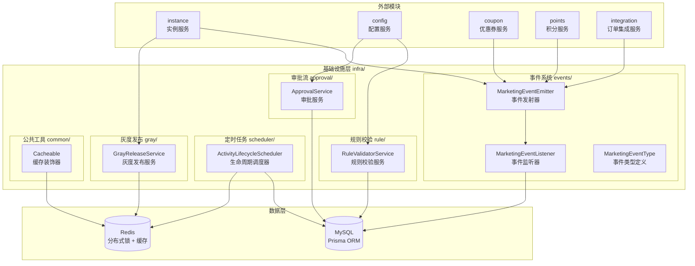
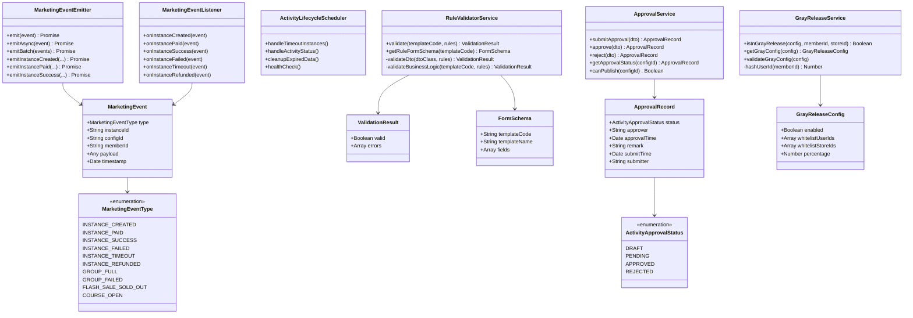
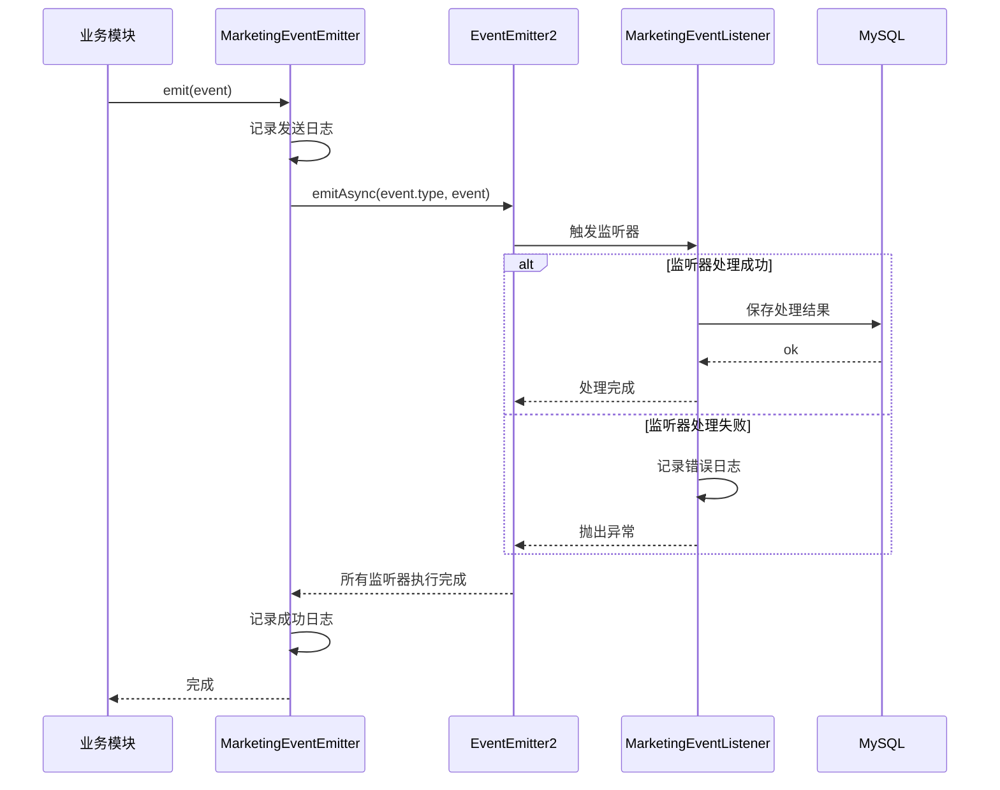
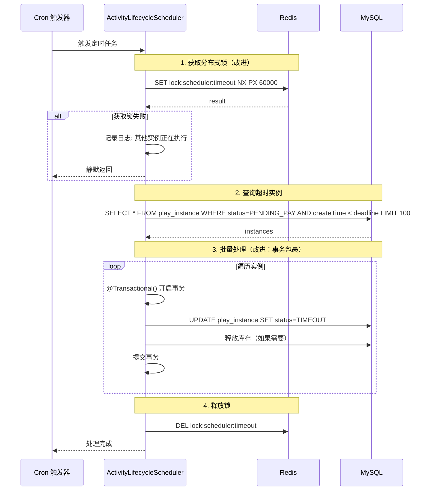
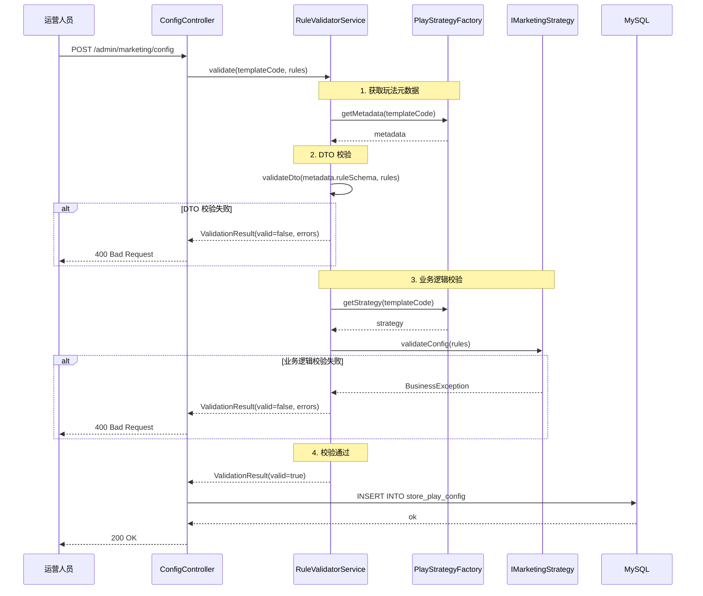
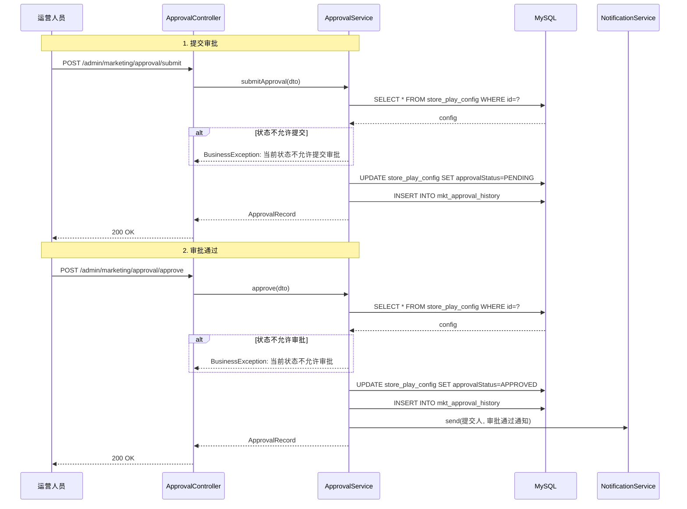
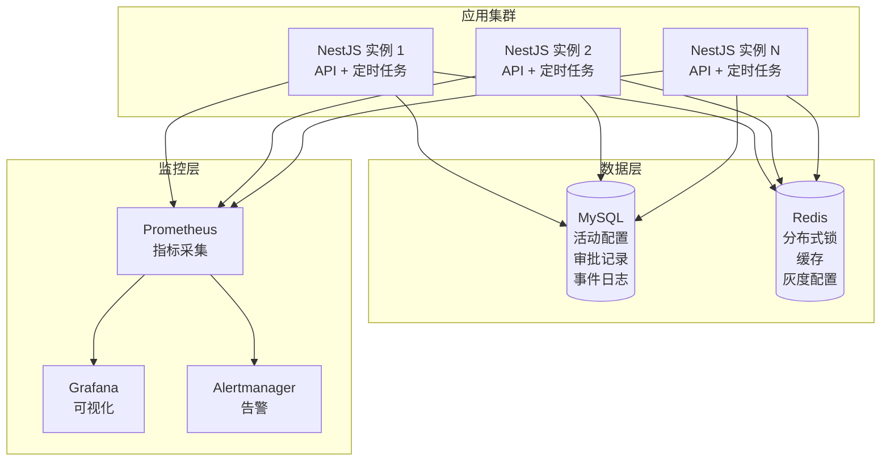

# 营销基础设施层 — 设计文档

> 版本：1.0
> 日期：2026-02-22
> 模块路径：`src/module/marketing/events/`, `src/module/marketing/scheduler/`, `src/module/marketing/rule/`, `src/module/marketing/approval/`, `src/module/marketing/gray/`, `src/module/marketing/common/`
> 需求文档：[infra-requirements.md](../../../requirements/marketing/infra/infra-requirements.md)
> 状态：现状架构分析 + 改进方案设计

---

## 1. 概述

### 1.1 设计目标

1. 完整描述基础设施层的技术架构、数据流、跨模块协作关系
2. 针对需求文档中识别的 20 个代码缺陷（D-1 ~ D-20）和 5 个跨模块缺陷（X-1 ~ X-5），给出具体改进方案与代码示例
3. 针对 6 个架构不足（A-1 ~ A-6），给出技术设计方案
4. 为中长期演进（事件溯源、多级审批、灰度策略扩展）提供技术设计

### 1.2 约束

| 约束     | 说明                                           |
| -------- | ---------------------------------------------- |
| 框架     | NestJS + Prisma ORM + MySQL                    |
| 事件系统 | @nestjs/event-emitter（基于 EventEmitter2）    |
| 定时任务 | @nestjs/schedule（基于 node-cron）             |
| 缓存/锁  | Redis（分布式锁、缓存）                        |
| 校验     | class-validator + class-transformer            |
| 多租户   | 通过 `BaseRepository` 自动注入 `tenantId` 过滤 |

---

## 2. 架构与模块（组件图）

> 图 1：营销基础设施层组件图



**组件说明**：

| 组件                         | 职责                       | 当前问题                               |
| ---------------------------- | -------------------------- | -------------------------------------- |
| `MarketingEventEmitter`      | 事件发射器，发送营销事件   | 无事件持久化、无重试机制               |
| `MarketingEventListener`     | 事件监听器，处理营销事件   | 无超时控制、无重试机制                 |
| `ActivityLifecycleScheduler` | 生命周期调度器，定时任务   | 无分布式锁、无任务监控                 |
| `RuleValidatorService`       | 规则校验服务，校验运营配置 | 表单 Schema 生成不完整、无规则版本管理 |
| `ApprovalService`            | 审批服务，活动审批流程     | 审批逻辑未实现、无审批历史             |
| `GrayReleaseService`         | 灰度发布服务，灰度控制     | 灰度配置未持久化、无灰度日志           |
| `Cacheable`                  | 缓存装饰器，方法级缓存     | 缓存装饰器未实现                       |

**依赖方向**：`Instance/Config/Coupon/Points/Integration` → `Events/Scheduler/Rule/Approval/Gray/Common`。

---

## 3. 领域/数据模型（类图）

> 图 2：营销基础设施层数据模型类图



**数据流向**：业务模块 → `MarketingEventEmitter` → `MarketingEventListener` → 下游处理。`RuleValidatorService` 校验规则配置，`ApprovalService` 管理审批流程，`GrayReleaseService` 控制灰度发布。

---

## 4. 核心流程时序（时序图）

### 4.1 事件发送与监听流程

> 图 3：事件发送与监听时序图



### 4.2 定时任务执行流程（含分布式锁）

> 图 4：定时任务执行时序图（改进后）



**关键改进**：

1. 分布式锁：使用 Redis `SET NX PX` 防止多实例重复执行
2. 事务包裹：批量更新使用 `@Transactional()` 确保原子性
3. 锁 TTL：设置为 60 秒，防止死锁

### 4.3 规则校验流程

> 图 5：规则校验时序图



### 4.4 审批流程（改进后）

> 图 6：活动审批时序图（改进后）



**关键改进**：

1. 连接数据库：从 Prisma 查询和更新审批状态
2. 审批历史：每次审批操作记录到 `mkt_approval_history` 表
3. 审批通知：审批通过/驳回后发送通知给提交人

---

## 5. 状态与流程

### 5.1 审批状态机

审批状态机详见需求文档 § 4.1。

---

## 6. 部署架构（部署图）

> 图 7：营销基础设施层部署图



**部署注意事项**：

| 关注点     | 当前状态 | 风险               | 改进建议                     |
| ---------- | -------- | ------------------ | ---------------------------- |
| 分布式锁   | 无       | 定时任务重复执行   | 添加 Redis 分布式锁（T-1）   |
| 事件持久化 | 无       | 事件丢失，无法追溯 | 添加事件日志表（T-6）        |
| 任务监控   | 无       | 任务失败无感知     | 添加 Prometheus 指标（T-11） |
| 审批历史   | 无       | 无法追溯审批记录   | 添加审批历史表（T-12）       |

---

## 7. 缺陷改进方案（核心）

### 7.1 D-5：定时任务添加分布式锁

**问题**：多实例部署时，定时任务会重复执行，导致重复处理。

**改进方案**：使用 Redis 分布式锁。

```typescript
// apps/backend/src/module/marketing/scheduler/lifecycle.scheduler.ts

import { Injectable, Logger } from '@nestjs/common';
import { Cron } from '@nestjs/schedule';
import { RedisService } from 'src/redis/redis.service';

@Injectable()
export class ActivityLifecycleScheduler {
  constructor(
    private readonly redis: RedisService,
    // ... 其他依赖
  ) {}

  @Cron('0 * * * * *')
  async handleTimeoutInstances() {
    const lockKey = 'lock:scheduler:timeout';
    const lockTTL = 60000; // 60 秒

    // 获取分布式锁
    const acquired = await this.redis.set(lockKey, '1', 'PX', lockTTL, 'NX');

    if (acquired !== 'OK') {
      this.logger.debug('[定时任务] 其他实例正在执行，跳过');
      return;
    }

    try {
      // 执行任务逻辑
      // ...
    } finally {
      // 释放锁
      await this.redis.del(lockKey);
    }
  }
}
```

### 7.2 D-12：审批流完整实现

**问题**：`ApprovalService` 的所有方法均为示例代码，未连接数据库。

**改进方案**：连接 Prisma，实现完整的审批逻辑。

#### 7.2.1 数据模型设计

```prisma
// schema.prisma

model StorePlayConfig {
  // ... 现有字段

  /// 审批状态
  approvalStatus  String   @default("DRAFT") @map("approval_status")

  /// 审批记录（JSON）
  approvalRecord  Json?    @map("approval_record")
}

/// 审批历史记录
model MktApprovalHistory {
  id              String   @id @default(cuid())
  tenantId        String   @map("tenant_id")

  /// 活动配置ID
  configId        String   @map("config_id")

  /// 操作类型：SUBMIT=提交审批, APPROVE=审批通过, REJECT=审批驳回
  action          String

  /// 操作人ID
  operator        String

  /// 操作时间
  operatedAt      DateTime @default(now()) @map("operated_at")

  /// 备注/审批意见
  remark          String?

  /// 审批前状态
  fromStatus      String   @map("from_status")

  /// 审批后状态
  toStatus        String   @map("to_status")

  @@map("mkt_approval_history")
  @@index([tenantId, configId])
}
```

#### 7.2.2 实现审批服务

```typescript
// apps/backend/src/module/marketing/approval/approval.service.ts

@Injectable()
export class ApprovalService {
  constructor(
    private readonly prisma: PrismaService,
    private readonly cls: ClsService,
  ) {}

  async submitApproval(dto: SubmitApprovalDto): Promise<ApprovalRecord> {
    const { configId, submitterId, remark } = dto;

    // 查询活动配置
    const config = await this.prisma.storePlayConfig.findUnique({
      where: { id: configId },
    });

    if (!config) {
      BusinessException.throw(404, '活动不存在');
    }

    // 检查当前状态
    if (!['DRAFT', 'REJECTED'].includes(config.approvalStatus)) {
      BusinessException.throw(400, '当前状态不允许提交审批');
    }

    // 更新审批状态
    await this.prisma.storePlayConfig.update({
      where: { id: configId },
      data: {
        approvalStatus: 'PENDING',
        approvalRecord: {
          status: 'PENDING',
          submitTime: new Date(),
          submitter: submitterId,
          remark,
        },
      },
    });

    // 记录审批历史
    await this.prisma.mktApprovalHistory.create({
      data: {
        tenantId: this.cls.get('tenantId'),
        configId,
        action: 'SUBMIT',
        operator: submitterId,
        remark,
        fromStatus: config.approvalStatus,
        toStatus: 'PENDING',
      },
    });

    return {
      status: ActivityApprovalStatus.PENDING,
      submitTime: new Date(),
      submitter: submitterId,
      remark,
    };
  }

  // approve 和 reject 方法类似实现
}
```

### 7.3 X-3：活动配置接口集成规则校验

**问题**：活动配置接口未调用规则校验服务，运营可以提交非法配置。

**改进方案**：在配置接口中调用规则校验。

```typescript
// apps/backend/src/module/marketing/config/config.service.ts

@Injectable()
export class StorePlayConfigService {
  constructor(
    private readonly ruleValidator: RuleValidatorService,
    // ... 其他依赖
  ) {}

  async create(dto: CreateConfigDto) {
    // 规则校验（新增）
    const validationResult = await this.ruleValidator.validate(dto.templateCode, dto.rules);

    if (!validationResult.valid) {
      const errors = validationResult.errors.map((e) => `${e.field}: ${e.message}`).join('; ');
      BusinessException.throw(400, `规则校验失败: ${errors}`);
    }

    // 创建配置
    return this.prisma.storePlayConfig.create({
      data: dto,
    });
  }
}
```

### 7.4 X-4：活动上线接口集成审批流校验

**问题**：活动上线接口未校验审批状态，未通过审批的活动可以直接上线。

**改进方案**：在上线接口中校验审批状态。

```typescript
// apps/backend/src/module/marketing/config/config.service.ts

async publish(configId: string) {
  // 查询活动配置
  const config = await this.prisma.storePlayConfig.findUnique({
    where: { id: configId },
  });

  if (!config) {
    BusinessException.throw(404, '活动不存在');
  }

  // 校验审批状态（新增）
  if (config.approvalStatus !== 'APPROVED') {
    BusinessException.throw(400, '活动未通过审批，无法上线');
  }

  // 上线活动
  return this.prisma.storePlayConfig.update({
    where: { id: configId },
    data: { status: 'ON_SHELF' },
  });
}
```

### 7.5 D-19：缓存装饰器实现

**问题**：`@Cacheable` 和 `@CacheEvict` 装饰器仅定义了元数据，未实现实际的缓存逻辑。

**改进方案**：实现 AOP 拦截器。

```typescript
// apps/backend/src/common/interceptors/cache.interceptor.ts

import { Injectable, NestInterceptor, ExecutionContext, CallHandler } from '@nestjs/common';
import { Reflector } from '@nestjs/core';
import { Observable, of } from 'rxjs';
import { tap } from 'rxjs/operators';
import { RedisService } from 'src/redis/redis.service';
import { CACHE_KEY_METADATA, CACHE_TTL_METADATA } from 'src/module/marketing/common/cache.decorator';

@Injectable()
export class CacheInterceptor implements NestInterceptor {
  constructor(
    private readonly reflector: Reflector,
    private readonly redis: RedisService,
  ) {}

  async intercept(context: ExecutionContext, next: CallHandler): Promise<Observable<any>> {
    const cacheKey = this.reflector.get<string>(CACHE_KEY_METADATA, context.getHandler());
    const cacheTTL = this.reflector.get<number>(CACHE_TTL_METADATA, context.getHandler());

    if (!cacheKey) {
      return next.handle();
    }

    // 生成完整的缓存 key
    const args = context.getArgs();
    const fullKey = `${cacheKey}:${JSON.stringify(args)}`;

    // 尝试从缓存获取
    const cached = await this.redis.get(fullKey);
    if (cached) {
      return of(JSON.parse(cached));
    }

    // 执行方法并缓存结果
    return next.handle().pipe(
      tap(async (data) => {
        await this.redis.setex(fullKey, cacheTTL, JSON.stringify(data));
      }),
    );
  }
}
```

**使用方式**：

```typescript
// 在 Module 中注册拦截器
@Module({
  providers: [
    {
      provide: APP_INTERCEPTOR,
      useClass: CacheInterceptor,
    },
  ],
})
export class MarketingModule {}
```

---

## 8. 架构改进方案（核心）

### 8.1 A-1：事件溯源（Event Sourcing）

**问题**：缺少事件存储和回放机制，无法追溯系统状态变更历史。

**改进方案**：实现事件溯源模式。

#### 8.1.1 数据模型设计

```prisma
/// 事件日志表
model MktEventLog {
  id              String   @id @default(cuid())
  tenantId        String   @map("tenant_id")

  /// 事件类型
  eventType       String   @map("event_type")

  /// 聚合根ID（如 instanceId）
  aggregateId     String   @map("aggregate_id")

  /// 聚合根类型（如 PlayInstance）
  aggregateType   String   @map("aggregate_type")

  /// 事件版本号（用于乐观锁）
  version         Int

  /// 事件负载（JSON）
  payload         Json

  /// 事件时间戳
  occurredAt      DateTime @default(now()) @map("occurred_at")

  /// 处理状态：PENDING=待处理, PROCESSED=已处理, FAILED=处理失败
  status          String   @default("PENDING")

  /// 重试次数
  retryCount      Int      @default(0) @map("retry_count")

  @@map("mkt_event_log")
  @@index([tenantId, aggregateId, version])
  @@index([tenantId, eventType, occurredAt])
  @@unique([aggregateId, version])
}
```

#### 8.1.2 事件存储服务

```typescript
@Injectable()
export class EventStoreService {
  constructor(private readonly prisma: PrismaService) {}

  async saveEvent(event: MarketingEvent): Promise<void> {
    await this.prisma.mktEventLog.create({
      data: {
        tenantId: TenantContext.getTenantId(),
        eventType: event.type,
        aggregateId: event.instanceId,
        aggregateType: 'PlayInstance',
        version: await this.getNextVersion(event.instanceId),
        payload: event.payload,
        occurredAt: event.timestamp,
      },
    });
  }

  async getEvents(aggregateId: string): Promise<MarketingEvent[]> {
    const logs = await this.prisma.mktEventLog.findMany({
      where: { aggregateId },
      orderBy: { version: 'asc' },
    });

    return logs.map((log) => ({
      type: log.eventType as MarketingEventType,
      instanceId: log.aggregateId,
      configId: log.payload.configId,
      memberId: log.payload.memberId,
      payload: log.payload,
      timestamp: log.occurredAt,
    }));
  }

  private async getNextVersion(aggregateId: string): Promise<number> {
    const lastEvent = await this.prisma.mktEventLog.findFirst({
      where: { aggregateId },
      orderBy: { version: 'desc' },
    });

    return (lastEvent?.version || 0) + 1;
  }
}
```

### 8.2 A-2：定时任务监控

**问题**：缺少定时任务执行状态监控和告警。

**改进方案**：添加 Prometheus 指标和告警规则。

```typescript
// apps/backend/src/module/marketing/scheduler/lifecycle.scheduler.ts

import { Counter, Histogram } from 'prom-client';

@Injectable()
export class ActivityLifecycleScheduler {
  private readonly taskExecutionCounter: Counter;
  private readonly taskDurationHistogram: Histogram;

  constructor() {
    this.taskExecutionCounter = new Counter({
      name: 'scheduler_task_execution_total',
      help: '定时任务执行次数',
      labelNames: ['task', 'status'],
    });

    this.taskDurationHistogram = new Histogram({
      name: 'scheduler_task_duration_seconds',
      help: '定时任务执行耗时',
      labelNames: ['task'],
    });
  }

  @Cron('0 * * * * *')
  async handleTimeoutInstances() {
    const startTime = Date.now();

    try {
      // 执行任务逻辑
      // ...

      // 记录成功指标
      this.taskExecutionCounter.inc({ task: 'timeout', status: 'success' });
    } catch (error) {
      // 记录失败指标
      this.taskExecutionCounter.inc({ task: 'timeout', status: 'failure' });
      throw error;
    } finally {
      // 记录耗时
      const duration = (Date.now() - startTime) / 1000;
      this.taskDurationHistogram.observe({ task: 'timeout' }, duration);
    }
  }
}
```

**告警规则**：

```yaml
# prometheus/alerts/scheduler.yml

groups:
  - name: scheduler
    interval: 1m
    rules:
      - alert: SchedulerTaskFailureHigh
        expr: rate(scheduler_task_execution_total{status="failure"}[5m]) > 0.1
        for: 5m
        labels:
          severity: warning
        annotations:
          summary: '定时任务失败率过高'
          description: '任务 {{ $labels.task }} 过去 5 分钟失败率超过 10%'
```

---

## 9. 接口/数据约定

### 9.1 事件数据结构

```typescript
interface MarketingEvent {
  type: MarketingEventType;
  instanceId: string;
  configId: string;
  memberId: string;
  payload: any;
  timestamp: Date;
}
```

### 9.2 Redis Key 约定

| Key 模式                     | 用途             | TTL     | 示例                                 |
| ---------------------------- | ---------------- | ------- | ------------------------------------ |
| `lock:scheduler:{task}`      | 定时任务分布式锁 | 60000ms | `lock:scheduler:timeout`             |
| `cache:{prefix}:{args}`      | 方法缓存         | 300s    | `cache:coupon:template:{"id":"123"}` |
| `gray:{configId}:{memberId}` | 灰度判断结果缓存 | 3600s   | `gray:cfg_1:mem_2`                   |

---

## 10. 优先级总结

### 10.1 缺陷修复优先级

| 优先级 | 缺陷编号 | 问题                     | 预估工时 |
| ------ | -------- | ------------------------ | -------- |
| P0     | D-5      | 定时任务无分布式锁       | 2h       |
| P0     | D-12     | 审批流未实现             | 1d       |
| P0     | X-4      | 审批流未集成到上线流程   | 0.5d     |
| P1     | X-3      | 规则校验未集成到配置接口 | 0.5d     |
| P1     | X-5      | 灰度发布未集成到参与接口 | 0.5d     |
| P1     | D-19     | 缓存装饰器未实现         | 2d       |
| P1     | D-3      | 无事件持久化             | 2d       |

### 10.2 实施路线图

#### 第一阶段：安全基线（1-2 周）

```
D-5(分布式锁) → D-12(审批流实现) → X-4(审批流集成) → X-3(规则校验集成) → X-5(灰度发布集成)
```

#### 第二阶段：可靠性增强（2-3 周）

```
D-3(事件持久化) → D-1(事件重试) → D-19(缓存装饰器) → D-16(灰度配置持久化)
```

#### 第三阶段：可观测性提升（1-2 月）

```
A-2(任务监控) → D-13(审批历史) → D-17(灰度日志) → A-1(事件溯源)
```

---

**文档版本**：1.0
**最后更新**：2026-02-22
**维护者**：Backend Team
