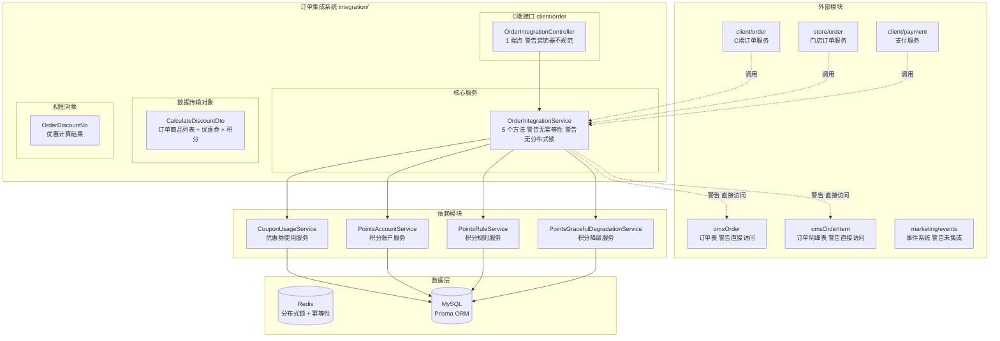
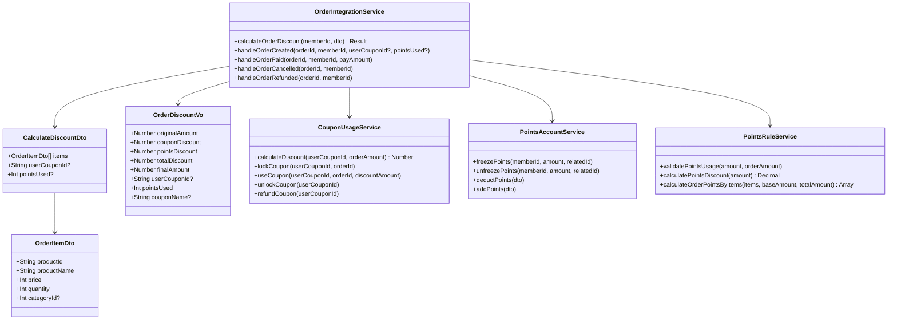
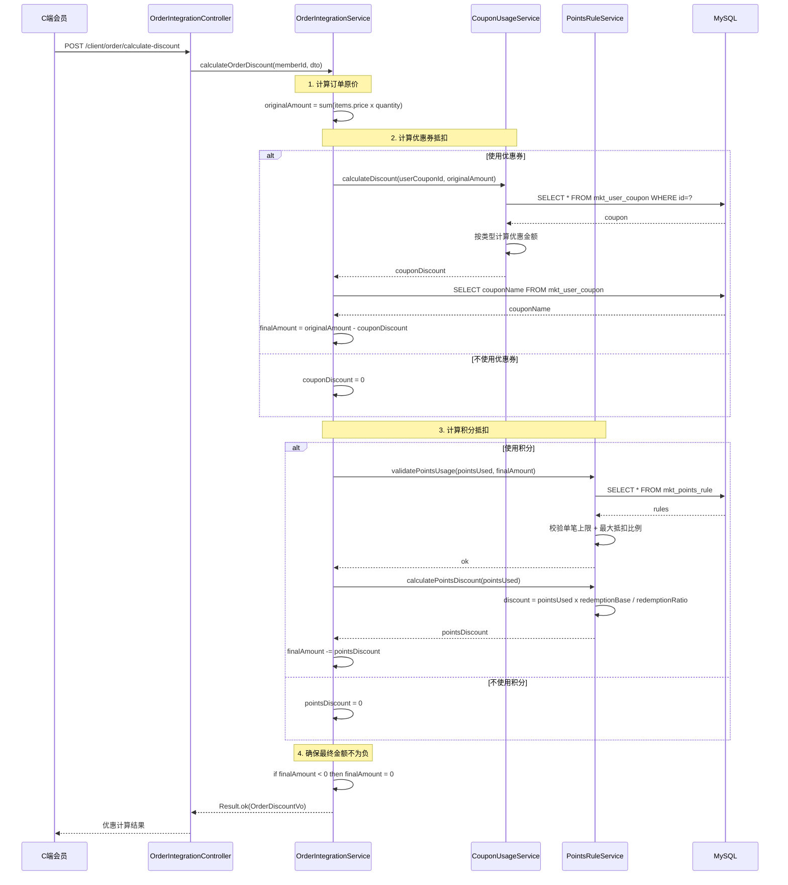
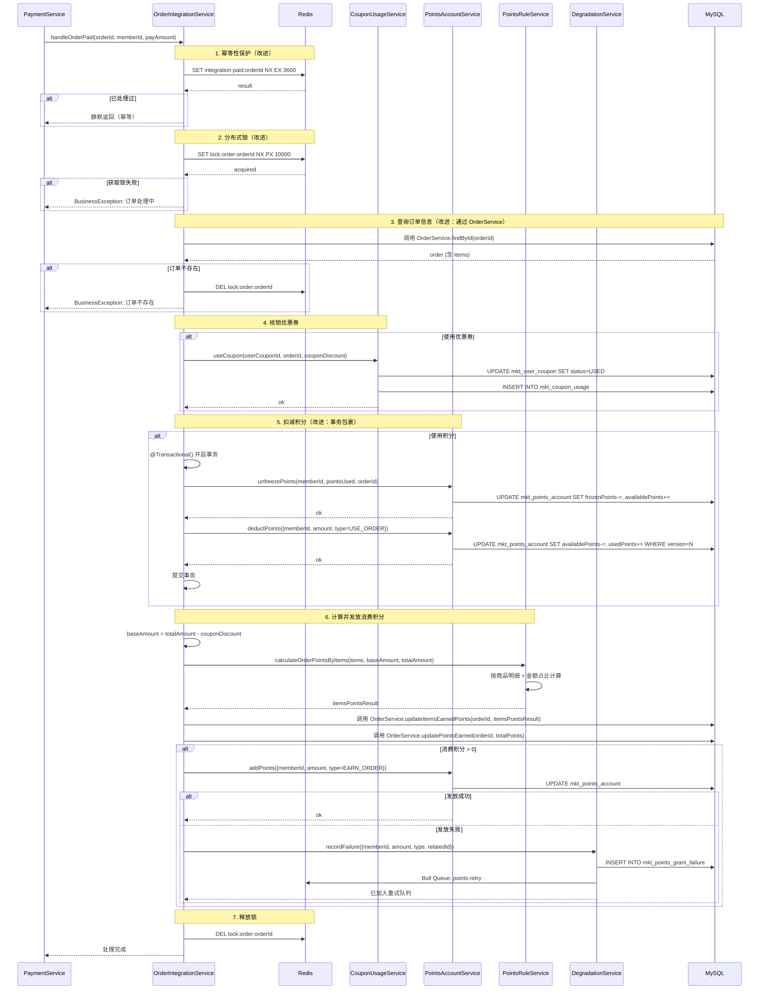
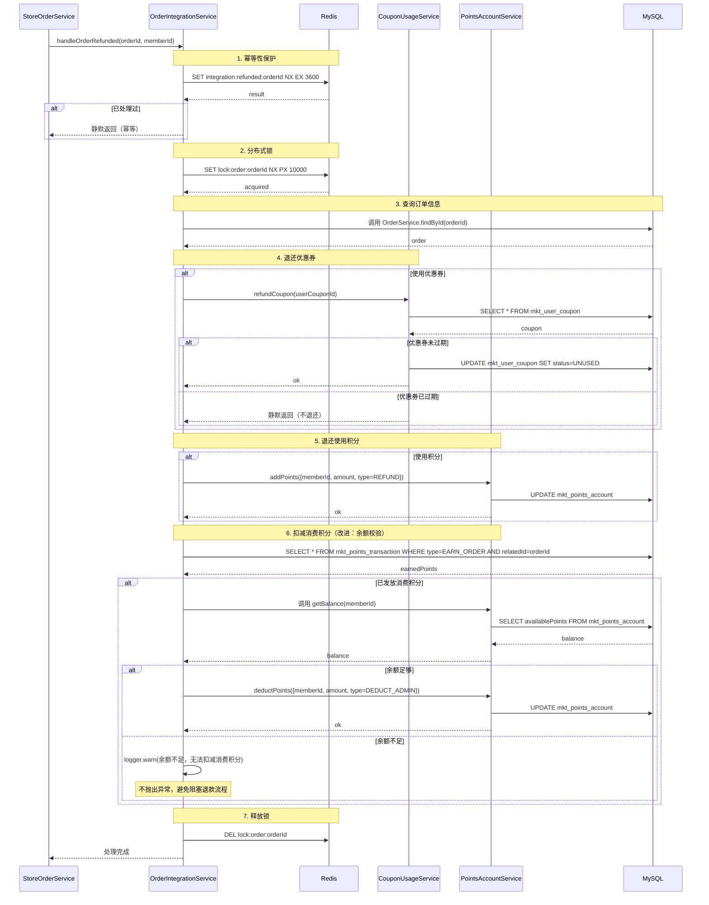
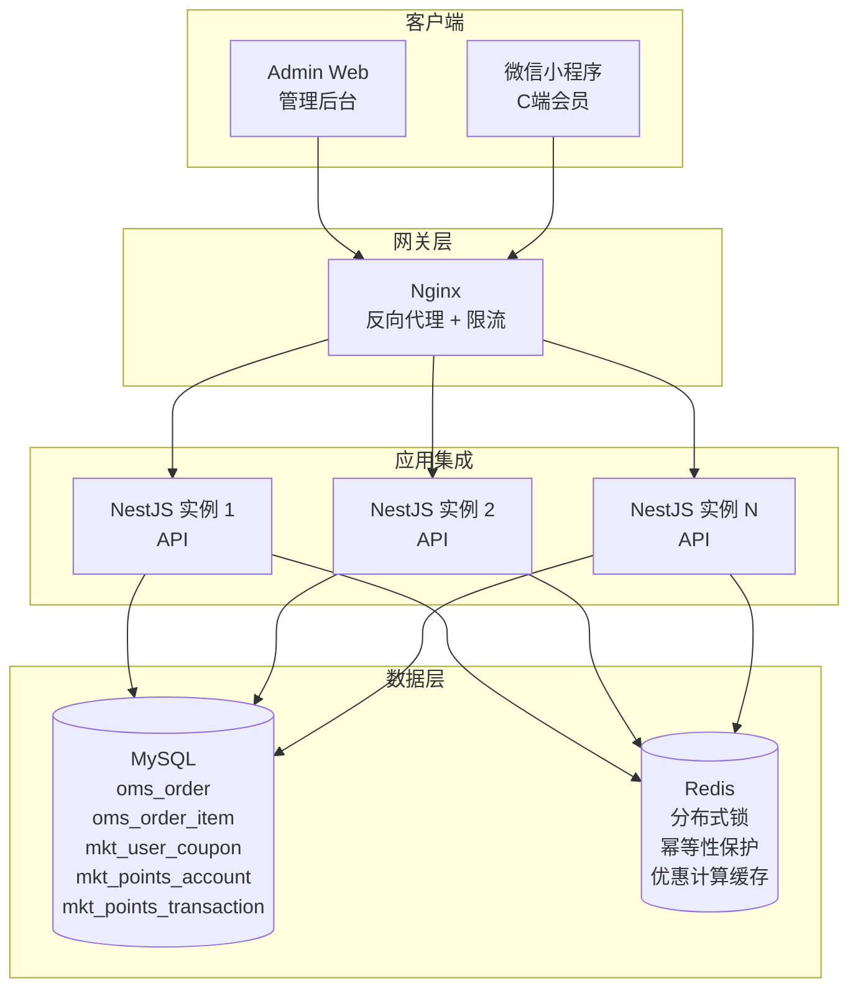

# 订单集成系统 — 设计文档

> 版本：1.0
> 日期：2026-02-22
> 模块路径：`src/module/marketing/integration/`
> 需求文档：[integration-requirements.md](../../../requirements/marketing/integration/integration-requirements.md)
> 状态：现状架构分析 + 改进方案设计

---

## 1. 概述

### 1.1 设计目标

1. 完整描述订单集成系统的技术架构、数据流、跨模块协作关系
2. 针对需求文档中识别的 9 个代码缺陷（D-1 ~ D-9）和 5 个跨模块缺陷（X-1 ~ X-5），给出具体改进方案与代码示例
3. 针对 8 个架构不足（A-1 ~ A-8），给出技术设计方案
4. 为中长期演进（优惠叠加规则、优惠上限配置、审计日志）提供技术设计

### 1.2 约束

| 约束     | 说明                                                                 |
| -------- | -------------------------------------------------------------------- |
| 框架     | NestJS + Prisma ORM + MySQL                                          |
| 缓存/锁  | Redis（分布式锁、幂等性保护、优惠计算缓存）                          |
| 事务     | `@Transactional()` 装饰器（基于 CLS 上下文）                         |
| 多租户   | 通过 `BaseRepository` 自动注入 `tenantId` 过滤                       |
| 并发控制 | 分布式锁（Redis SET NX）+ 幂等性保护（Redis SetNX 或数据库唯一约束） |

---

## 2. 架构与模块（组件图）

> 图 1：订单集成系统组件图



**组件说明**：

| 组件                               | 职责                         | 当前问题                                                                |
| ---------------------------------- | ---------------------------- | ----------------------------------------------------------------------- |
| `OrderIntegrationController`       | C 端优惠计算接口（1 端点）   | 使用 `@ApiOperation` 而非 `@Api`，缺少 `@ApiBearerAuth`、`@tenantScope` |
| `OrderIntegrationService`          | 订单集成核心服务（5 个方法） | 无幂等性保护、无分布式锁、直接访问订单表、积分扣减非事务                |
| `CouponUsageService`               | 优惠券使用服务               | 正常工作                                                                |
| `PointsAccountService`             | 积分账户服务                 | 正常工作                                                                |
| `PointsRuleService`                | 积分规则服务                 | 正常工作                                                                |
| `PointsGracefulDegradationService` | 积分降级服务                 | 正常工作                                                                |

**依赖方向**：`Integration` → `Coupon/Usage` + `Points/Account` + `Points/Rule` + `Points/Degradation`；`ClientOrder` + `StoreOrder` + `Payment` → `Integration`。

---

## 3. 领域/数据模型（类图）

> 图 2：订单集成系统数据模型类图



**数据流向**：`CalculateDiscountDto`（输入）→ `OrderIntegrationService`（计算）→ `OrderDiscountVo`（输出）。`OrderIntegrationService` 协调 `CouponUsageService` 和 `PointsAccountService` 完成优惠券和积分的状态流转。

---

## 4. 核心流程时序（时序图）

### 4.1 优惠计算流程

> 图 3：优惠计算时序图



### 4.2 订单支付流程（含幂等性和分布式锁）

> 图 4：订单支付时序图（改进后）



**关键改进**：

1. 幂等性保护：使用 Redis `SET NX` 记录已处理的订单，TTL 1 小时
2. 分布式锁：使用 Redis `SET NX PX` 防止并发处理，TTL 10 秒
3. 事务包裹：积分解冻和扣减使用 `@Transactional()` 确保原子性
4. 消除跨模块访问：通过 `OrderService` 获取订单信息和更新订单字段

### 4.3 订单退款流程（含余额校验）

> 图 5：订单退款时序图（改进后）



**关键改进**：

1. 余额校验：扣减消费积分前先查询账户余额，余额不足时记录警告日志但不抛出异常
2. 幂等性保护：使用 Redis `SET NX` 防止重复退款
3. 分布式锁：防止并发退款

---

## 5. 状态与流程

订单集成系统本身无状态机，其职责是协调优惠券和积分的状态流转。相关状态机详见：

- 优惠券状态机：[coupon-design.md § 5.1](../../coupon/coupon-design.md#51-用户优惠券状态机状态图)
- 积分账户余额联动：[points-design.md § 5.1](../../points/points-design.md#51-积分账户余额联动状态图)

---

## 6. 部署架构（部署图）

> 图 6：订单集成系统部署图



**部署注意事项**：

| 关注点       | 当前状态       | 风险                           | 改进建议                                |
| ------------ | -------------- | ------------------------------ | --------------------------------------- |
| 幂等性       | 无             | 订单系统重复调用导致重复处理   | 添加 Redis SetNX 幂等性保护（T-5）      |
| 分布式锁     | 无             | 高并发场景下竞态条件           | 添加 Redis 分布式锁（T-6）              |
| 事务         | 部分           | 积分扣减非事务，可能状态不一致 | 添加 `@Transactional()` 事务包裹（T-3） |
| 跨模块访问   | 直接访问订单表 | 违反模块边界，难以维护         | 通过 OrderService 获取订单信息（T-2）   |
| 优惠计算缓存 | 无             | 高频场景性能较差               | 添加 Redis 缓存，TTL 5 分钟（T-17）     |

---

## 7. 缺陷改进方案

### 7.1 D-1：C 端接口装饰器规范化

**问题**：`OrderIntegrationController` 使用 `@ApiOperation` 而非 `@Api`，缺少 `@ApiBearerAuth`，缺少 `@tenantScope` 注解。

**改进方案**：

```typescript
// apps/backend/src/module/client/order/order-integration.controller.ts

/**
 * 订单集成 C 端接口
 * @tenantScope TenantScoped
 */
@ApiTags('订单集成')
@Controller('client/order')
@ApiBearerAuth('Authorization')
export class OrderIntegrationController {
  constructor(private readonly orderIntegrationService: OrderIntegrationService) {}

  /**
   * 计算订单优惠
   */
  @Api({
    summary: '订单优惠计算',
    type: OrderDiscountVo,
  })
  @Post('calculate-discount')
  @UseGuards(MemberAuthGuard)
  calculateDiscount(@Body() dto: CalculateDiscountDto, @Member() member: MemberDto) {
    return this.orderIntegrationService.calculateOrderDiscount(member.memberId, dto);
  }
}
```

**关键改动**：

1. 类级别添加 `@ApiBearerAuth('Authorization')`
2. 方法级别使用 `@Api` 替代 `@ApiOperation`
3. 类级别添加 JSDoc 注解 `@tenantScope TenantScoped`

---

### 7.2 D-2/D-3/X-1：消除对订单表的直接访问

**问题**：`handleOrderPaid`、`handleOrderCancelled`、`handleOrderRefunded` 均直接访问 `omsOrder` 和 `omsOrderItem` 表，违反模块边界。

**改进方案**：通过 `OrderService` 获取订单信息和更新订单字段。

#### 7.2.1 在 OrderService 中添加必要方法

```typescript
// apps/backend/src/module/client/order/order.service.ts

@Injectable()
export class ClientOrderService {
  // 现有方法...

  /**
   * 根据订单 ID 查询订单（含明细）
   * 供订单集成服务使用
   */
  async findByIdWithItems(orderId: string) {
    return this.prisma.omsOrder.findUnique({
      where: { id: orderId },
      include: { items: true },
    });
  }

  /**
   * 更新订单明细的消费积分
   * 供订单集成服务使用
   */
  async updateItemsEarnedPoints(orderId: string, itemsPoints: Array<{ skuId: string; earnedPoints: number }>) {
    for (const item of itemsPoints) {
      await this.prisma.omsOrderItem.updateMany({
        where: {
          orderId,
          skuId: item.skuId,
        },
        data: {
          earnedPoints: item.earnedPoints,
        },
      });
    }
  }

  /**
   * 更新订单的总消费积分
   * 供订单集成服务使用
   */
  async updatePointsEarned(orderId: string, pointsEarned: number) {
    return this.prisma.omsOrder.update({
      where: { id: orderId },
      data: { pointsEarned },
    });
  }
}
```

#### 7.2.2 在 OrderIntegrationService 中注入 OrderService

```typescript
// apps/backend/src/module/marketing/integration/integration.service.ts

@Injectable()
export class OrderIntegrationService {
  constructor(
    private readonly prisma: PrismaService,
    private readonly cls: ClsService,
    private readonly couponUsageService: CouponUsageService,
    private readonly pointsAccountService: PointsAccountService,
    private readonly pointsRuleService: PointsRuleService,
    private readonly degradationService: PointsGracefulDegradationService,
    private readonly orderService: ClientOrderService, // 新增
  ) {}

  async handleOrderPaid(orderId: string, memberId: string, payAmount: number) {
    // 改为通过 OrderService 获取订单
    const order = await this.orderService.findByIdWithItems(orderId);

    if (!order) {
      BusinessException.throw(404, '订单不存在');
    }

    // ... 其他逻辑 ...

    // 改为通过 OrderService 更新订单明细
    await this.orderService.updateItemsEarnedPoints(orderId, itemsPointsResult);

    // 改为通过 OrderService 更新订单总积分
    await this.orderService.updatePointsEarned(orderId, totalPointsToEarn);
  }

  async handleOrderCancelled(orderId: string, memberId: string) {
    // 改为通过 OrderService 获取订单
    const order = await this.orderService.findByIdWithItems(orderId);
    // ...
  }

  async handleOrderRefunded(orderId: string, memberId: string) {
    // 改为通过 OrderService 获取订单
    const order = await this.orderService.findByIdWithItems(orderId);
    // ...
  }
}
```

#### 7.2.3 在 IntegrationModule 中导入 OrderModule

```typescript
// apps/backend/src/module/marketing/integration/integration.module.ts

@Module({
  imports: [
    CouponModule,
    PointsModule,
    forwardRef(() => OrderModule), // 新增
  ],
  providers: [OrderIntegrationService],
  exports: [OrderIntegrationService],
})
export class IntegrationModule {}
```

**关键改动**：

1. 在 `OrderService` 中添加 3 个方法供集成服务使用
2. 在 `OrderIntegrationService` 中注入 `OrderService`
3. 移除所有 `this.prisma.omsOrder` 和 `this.prisma.omsOrderItem` 的直接访问
4. 使用 `forwardRef` 解决循环依赖（OrderModule 已依赖 IntegrationModule）

---

### 7.3 D-4：积分扣减添加事务包裹

**问题**：`handleOrderPaid` 中先 `unfreezePoints` 再 `deductPoints`，两个操作非事务包裹，若解冻成功但扣减失败，积分状态不一致。

**改进方案**：使用 `@Transactional()` 装饰器包裹积分扣减逻辑。

```typescript
// apps/backend/src/module/marketing/integration/integration.service.ts

import { Transactional } from 'src/common/decorators/transactional.decorator';

@Injectable()
export class OrderIntegrationService {
  // ...

  /**
   * 订单支付成功时处理优惠券和积分
   */
  async handleOrderPaid(orderId: string, memberId: string, payAmount: number) {
    this.logger.log(`处理订单支付: orderId=${orderId}, memberId=${memberId}, payAmount=${payAmount}`);

    try {
      const order = await this.orderService.findByIdWithItems(orderId);

      if (!order) {
        BusinessException.throw(404, '订单不存在');
      }

      // 1. 使用优惠券
      if (order.userCouponId) {
        await this.couponUsageService.useCoupon(order.userCouponId, orderId, Number(order.couponDiscount));
        this.logger.log(`优惠券已使用: couponId=${order.userCouponId}`);
      }

      // 2. 扣减冻结的积分（事务包裹）
      if (order.pointsUsed && order.pointsUsed > 0) {
        await this.deductFrozenPoints(memberId, order.pointsUsed, orderId);
        this.logger.log(`积分已扣减: points=${order.pointsUsed}`);
      }

      // 3. 计算并发放消费积分
      await this.grantOrderPoints(order, memberId, orderId);
    } catch (error) {
      this.logger.error(`订单支付处理失败: orderId=${orderId}, error=${getErrorMessage(error)}`);
      throw error;
    }
  }

  /**
   * 扣减冻结的积分（事务包裹）
   * @private
   */
  @Transactional()
  private async deductFrozenPoints(memberId: string, pointsUsed: number, orderId: string) {
    // 先解冻
    await this.pointsAccountService.unfreezePoints(memberId, pointsUsed, orderId);

    // 再扣减
    await this.pointsAccountService.deductPoints({
      memberId,
      amount: pointsUsed,
      type: PointsTransactionType.USE_ORDER,
      relatedId: orderId,
      remark: '订单抵扣',
    });
  }

  /**
   * 计算并发放消费积分
   * @private
   */
  private async grantOrderPoints(order: any, memberId: string, orderId: string) {
    const baseAmount = order.totalAmount.sub(order.couponDiscount);

    const itemsPointsResult = await this.pointsRuleService.calculateOrderPointsByItems(
      order.items.map((item) => ({
        skuId: item.skuId,
        price: item.price,
        quantity: item.quantity,
        pointsRatio: item.pointsRatio,
      })),
      baseAmount,
      order.totalAmount,
    );

    const totalPointsToEarn = itemsPointsResult.reduce((sum, item) => sum + item.earnedPoints, 0);

    await this.orderService.updateItemsEarnedPoints(orderId, itemsPointsResult);
    await this.orderService.updatePointsEarned(orderId, totalPointsToEarn);

    if (totalPointsToEarn > 0) {
      try {
        await this.pointsAccountService.addPoints({
          memberId,
          amount: totalPointsToEarn,
          type: PointsTransactionType.EARN_ORDER,
          relatedId: orderId,
          remark: '消费获得',
        });

        this.logger.log(`消费积分已发放: points=${totalPointsToEarn}`);
      } catch (error) {
        this.logger.warn({
          message: '消费积分发放失败，已加入重试队列',
          orderId,
          memberId,
          pointsToEarn: totalPointsToEarn,
          error: getErrorMessage(error),
        });

        await this.degradationService.recordFailure({
          memberId,
          amount: totalPointsToEarn,
          type: PointsTransactionType.EARN_ORDER,
          relatedId: orderId,
          remark: '消费获得',
          failureReason: getErrorMessage(error),
        });
      }
    }
  }
}
```

**关键改动**：

1. 将积分解冻和扣减逻辑提取到 `deductFrozenPoints` 私有方法
2. 在 `deductFrozenPoints` 方法上添加 `@Transactional()` 装饰器
3. 将消费积分发放逻辑提取到 `grantOrderPoints` 私有方法，提升代码可读性

---

### 7.4 D-6：退款时消费积分扣减添加余额校验

**问题**：`handleOrderRefunded` 中扣减消费积分时未校验账户余额是否足够，若用户已使用消费积分，扣减会失败。

**改进方案**：扣减前先查询账户余额，余额不足时记录警告日志但不抛出异常，避免阻塞退款流程。

```typescript
// apps/backend/src/module/marketing/integration/integration.service.ts

async handleOrderRefunded(orderId: string, memberId: string) {
  this.logger.log(
    `处理订单退款: orderId=${orderId}, memberId=${memberId}`,
  );

  try {
    const order = await this.orderService.findByIdWithItems(orderId);

    if (!order) {
      BusinessException.throw(404, '订单不存在');
    }

    // 1. 退还优惠券
    if (order.userCouponId) {
      await this.couponUsageService.refundCoupon(order.userCouponId);
      this.logger.log(`优惠券已退还: couponId=${order.userCouponId}`);
    }

    // 2. 退还使用积分
    if (order.pointsUsed && order.pointsUsed > 0) {
      await this.pointsAccountService.addPoints({
        memberId,
        amount: order.pointsUsed,
        type: PointsTransactionType.REFUND,
        relatedId: orderId,
        remark: '订单退款返还',
      });

      this.logger.log(`积分已退还: points=${order.pointsUsed}`);
    }

    // 3. 扣减消费积分（如果已发放）
    const earnedPoints = await this.prisma.mktPointsTransaction.findFirst({
      where: {
        memberId,
        type: PointsTransactionType.EARN_ORDER,
        relatedId: orderId,
      },
    });

    if (earnedPoints && earnedPoints.amount > 0) {
      // 改进：先查询账户余额
      const account = await this.pointsAccountService.getBalance(memberId);

      if (account.availablePoints >= earnedPoints.amount) {
        // 余额足够，扣减消费积分
        await this.pointsAccountService.deductPoints({
          memberId,
          amount: earnedPoints.amount,
          type: PointsTransactionType.DEDUCT_ADMIN,
          relatedId: orderId,
          remark: '订单退款扣减消费积分',
        });

        this.logger.log(`消费积分已扣减: points=${earnedPoints.amount}`);
      } else {
        // 余额不足，记录警告日志但不抛出异常
        this.logger.warn({
          message: '账户余额不足，无法扣减消费积分',
          orderId,
          memberId,
          earnedPoints: earnedPoints.amount,
          availablePoints: account.availablePoints,
        });
      }
    }
  } catch (error) {
    this.logger.error(
      `订单退款处理失败: orderId=${orderId}, error=${getErrorMessage(error)}`,
      getErrorStack(error),
    );
    throw error;
  }
}
```

**关键改动**：

1. 扣减消费积分前先调用 `getBalance` 查询账户余额
2. 余额足够时正常扣减，余额不足时记录警告日志但不抛出异常
3. 避免因积分余额不足导致退款流程失败

**补充**：需在 `PointsAccountService` 中添加 `getBalance` 方法：

```typescript
// apps/backend/src/module/marketing/points/account/account.service.ts

/**
 * 查询账户余额
 */
async getBalance(memberId: string) {
  const account = await this.prisma.mktPointsAccount.findUnique({
    where: { memberId },
    select: {
      availablePoints: true,
      frozenPoints: true,
      usedPoints: true,
    },
  });

  if (!account) {
    BusinessException.throw(404, '积分账户不存在');
  }

  return account;
}
```

---

### 7.5 D-7：添加幂等性保护

**问题**：5 个 `handle*` 方法均无幂等性保护，若订单系统重复调用（如网络重试），会导致重复处理。

**改进方案**：使用 Redis `SET NX` 记录已处理的订单，TTL 1 小时。

#### 7.5.1 创建幂等性工具类

```typescript
// apps/backend/src/common/utils/idempotency.ts

import { Injectable } from '@nestjs/common';
import { RedisService } from 'src/redis/redis.service';

@Injectable()
export class IdempotencyService {
  constructor(private readonly redis: RedisService) {}

  /**
   * 检查并标记操作为已处理（幂等性保护）
   * @param key 幂等性 key
   * @param ttl 过期时间（秒）
   * @returns true=首次处理，false=已处理过
   */
  async checkAndMark(key: string, ttl: number = 3600): Promise<boolean> {
    const result = await this.redis.set(key, '1', 'EX', ttl, 'NX');
    return result === 'OK';
  }

  /**
   * 删除幂等性标记（用于异常回滚）
   */
  async remove(key: string): Promise<void> {
    await this.redis.del(key);
  }
}
```

#### 7.5.2 在 OrderIntegrationService 中使用

```typescript
// apps/backend/src/module/marketing/integration/integration.service.ts

@Injectable()
export class OrderIntegrationService {
  constructor(
    // ... 其他依赖
    private readonly idempotency: IdempotencyService, // 新增
  ) {}

  async handleOrderCreated(orderId: string, memberId: string, userCouponId?: string, pointsUsed?: number) {
    // 幂等性保护
    const idempotencyKey = `integration:created:${orderId}`;
    const isFirstTime = await this.idempotency.checkAndMark(idempotencyKey);

    if (!isFirstTime) {
      this.logger.log(`订单创建已处理过，跳过: orderId=${orderId}`);
      return;
    }

    try {
      // ... 原有逻辑
    } catch (error) {
      // 异常时删除幂等性标记，允许重试
      await this.idempotency.remove(idempotencyKey);
      throw error;
    }
  }

  async handleOrderPaid(orderId: string, memberId: string, payAmount: number) {
    const idempotencyKey = `integration:paid:${orderId}`;
    const isFirstTime = await this.idempotency.checkAndMark(idempotencyKey);

    if (!isFirstTime) {
      this.logger.log(`订单支付已处理过，跳过: orderId=${orderId}`);
      return;
    }

    try {
      // ... 原有逻辑
    } catch (error) {
      await this.idempotency.remove(idempotencyKey);
      throw error;
    }
  }

  async handleOrderCancelled(orderId: string, memberId: string) {
    const idempotencyKey = `integration:cancelled:${orderId}`;
    const isFirstTime = await this.idempotency.checkAndMark(idempotencyKey);

    if (!isFirstTime) {
      this.logger.log(`订单取消已处理过，跳过: orderId=${orderId}`);
      return;
    }

    try {
      // ... 原有逻辑
    } catch (error) {
      await this.idempotency.remove(idempotencyKey);
      throw error;
    }
  }

  async handleOrderRefunded(orderId: string, memberId: string) {
    const idempotencyKey = `integration:refunded:${orderId}`;
    const isFirstTime = await this.idempotency.checkAndMark(idempotencyKey);

    if (!isFirstTime) {
      this.logger.log(`订单退款已处理过，跳过: orderId=${orderId}`);
      return;
    }

    try {
      // ... 原有逻辑
    } catch (error) {
      await this.idempotency.remove(idempotencyKey);
      throw error;
    }
  }
}
```

**关键改动**：

1. 创建 `IdempotencyService` 工具类封装 Redis `SET NX` 逻辑
2. 在每个 `handle*` 方法开头检查幂等性，已处理过则静默返回
3. 异常时删除幂等性标记，允许重试
4. TTL 设置为 1 小时，防止 Redis 内存泄漏

---

### 7.6 D-8：添加分布式锁

**问题**：5 个 `handle*` 方法均无分布式锁，高并发场景下可能出现竞态条件（如同一订单被多个请求同时处理）。

**改进方案**：使用 Redis 分布式锁，TTL 10 秒。

#### 7.6.1 创建分布式锁工具类

```typescript
// apps/backend/src/common/utils/distributed-lock.ts

import { Injectable, Logger } from '@nestjs/common';
import { RedisService } from 'src/redis/redis.service';
import { BusinessException } from 'src/common/exceptions/business.exception';

@Injectable()
export class DistributedLockService {
  private readonly logger = new Logger(DistributedLockService.name);

  constructor(private readonly redis: RedisService) {}

  /**
   * 获取分布式锁
   * @param key 锁 key
   * @param ttl 过期时间（毫秒）
   * @returns true=获取成功，false=获取失败
   */
  async acquire(key: string, ttl: number = 10000): Promise<boolean> {
    const result = await this.redis.set(key, '1', 'PX', ttl, 'NX');
    return result === 'OK';
  }

  /**
   * 释放分布式锁
   */
  async release(key: string): Promise<void> {
    await this.redis.del(key);
  }

  /**
   * 使用分布式锁执行操作
   * @param key 锁 key
   * @param fn 要执行的操作
   * @param ttl 锁过期时间（毫秒）
   */
  async withLock<T>(key: string, fn: () => Promise<T>, ttl: number = 10000): Promise<T> {
    const acquired = await this.acquire(key, ttl);

    if (!acquired) {
      BusinessException.throw(409, '操作正在处理中，请稍后重试');
    }

    try {
      return await fn();
    } finally {
      await this.release(key);
    }
  }
}
```

#### 7.6.2 在 OrderIntegrationService 中使用

```typescript
// apps/backend/src/module/marketing/integration/integration.service.ts

@Injectable()
export class OrderIntegrationService {
  constructor(
    // ... 其他依赖
    private readonly distributedLock: DistributedLockService, // 新增
  ) {}

  async handleOrderCreated(orderId: string, memberId: string, userCouponId?: string, pointsUsed?: number) {
    // 幂等性保护
    const idempotencyKey = `integration:created:${orderId}`;
    const isFirstTime = await this.idempotency.checkAndMark(idempotencyKey);

    if (!isFirstTime) {
      this.logger.log(`订单创建已处理过，跳过: orderId=${orderId}`);
      return;
    }

    // 分布式锁
    const lockKey = `lock:order:${orderId}`;
    return this.distributedLock.withLock(lockKey, async () => {
      try {
        // ... 原有逻辑
      } catch (error) {
        await this.idempotency.remove(idempotencyKey);
        throw error;
      }
    });
  }

  async handleOrderPaid(orderId: string, memberId: string, payAmount: number) {
    const idempotencyKey = `integration:paid:${orderId}`;
    const isFirstTime = await this.idempotency.checkAndMark(idempotencyKey);

    if (!isFirstTime) {
      this.logger.log(`订单支付已处理过，跳过: orderId=${orderId}`);
      return;
    }

    const lockKey = `lock:order:${orderId}`;
    return this.distributedLock.withLock(lockKey, async () => {
      try {
        // ... 原有逻辑
      } catch (error) {
        await this.idempotency.remove(idempotencyKey);
        throw error;
      }
    });
  }

  // handleOrderCancelled 和 handleOrderRefunded 同理
}
```

**关键改动**：

1. 创建 `DistributedLockService` 工具类封装 Redis 分布式锁逻辑
2. 提供 `withLock` 方法自动获取锁、执行操作、释放锁
3. 锁 TTL 设置为 10 秒，防止死锁
4. 获取锁失败时抛出 409 异常，提示用户稍后重试

---

### 7.7 D-9：错误日志使用 getErrorStack

**问题**：所有 `catch (error)` 块中仅使用 `getErrorMessage(error)`，未使用 `getErrorStack(error)` 记录堆栈，排查问题困难。

**改进方案**：在所有 `catch` 块中使用 `getErrorInfo` 或 `getErrorStack` 记录完整错误信息。

```typescript
// apps/backend/src/module/marketing/integration/integration.service.ts

import { getErrorMessage, getErrorStack, getErrorInfo } from 'src/common/utils/error';

@Injectable()
export class OrderIntegrationService {
  // ...

  async handleOrderCreated(orderId: string, memberId: string, userCouponId?: string, pointsUsed?: number) {
    // ...
    try {
      // ... 业务逻辑
    } catch (error) {
      // 改进：记录完整错误信息（message + stack）
      const { message, stack } = getErrorInfo(error);
      this.logger.error(`订单创建处理失败: orderId=${orderId}, error=${message}`, stack);
      throw error;
    }
  }

  async handleOrderPaid(orderId: string, memberId: string, payAmount: number) {
    // ...
    try {
      // ... 业务逻辑
    } catch (error) {
      const { message, stack } = getErrorInfo(error);
      this.logger.error(`订单支付处理失败: orderId=${orderId}, error=${message}`, stack);
      throw error;
    }
  }

  async handleOrderCancelled(orderId: string, memberId: string) {
    // ...
    try {
      // ... 业务逻辑
    } catch (error) {
      const { message, stack } = getErrorInfo(error);
      this.logger.error(`订单取消处理失败: orderId=${orderId}, error=${message}`, stack);
      throw error;
    }
  }

  async handleOrderRefunded(orderId: string, memberId: string) {
    // ...
    try {
      // ... 业务逻辑
    } catch (error) {
      const { message, stack } = getErrorInfo(error);
      this.logger.error(`订单退款处理失败: orderId=${orderId}, error=${message}`, stack);
      throw error;
    }
  }
}
```

**关键改动**：

1. 导入 `getErrorInfo` 工具函数
2. 在所有 `catch` 块中使用 `getErrorInfo(error)` 获取 `{ message, stack }`
3. 使用 `this.logger.error(message, stack)` 记录完整错误信息
4. 便于生产环境排查问题

---

### 7.8 X-4：订单集成发送事件到 marketing/events

**问题**：订单集成的 5 个关键节点（创建、支付、取消、退款、优惠计算）未发送事件到 `marketing/events`，下游系统无法感知。

**改进方案**：在每个关键节点发送事件。

#### 7.8.1 定义订单集成事件类型

```typescript
// apps/backend/src/module/marketing/events/types/integration-events.ts

export enum IntegrationEventType {
  ORDER_DISCOUNT_CALCULATED = 'order.discount.calculated',
  ORDER_CREATED = 'order.created',
  ORDER_PAID = 'order.paid',
  ORDER_CANCELLED = 'order.cancelled',
  ORDER_REFUNDED = 'order.refunded',
}

export interface OrderDiscountCalculatedEvent {
  orderId?: string;
  memberId: string;
  originalAmount: number;
  couponDiscount: number;
  pointsDiscount: number;
  totalDiscount: number;
  finalAmount: number;
  userCouponId?: string;
  pointsUsed: number;
  timestamp: Date;
}

export interface OrderCreatedEvent {
  orderId: string;
  memberId: string;
  userCouponId?: string;
  pointsUsed?: number;
  timestamp: Date;
}

export interface OrderPaidEvent {
  orderId: string;
  memberId: string;
  payAmount: number;
  couponDiscount: number;
  pointsUsed: number;
  pointsEarned: number;
  timestamp: Date;
}

export interface OrderCancelledEvent {
  orderId: string;
  memberId: string;
  userCouponId?: string;
  pointsUsed?: number;
  timestamp: Date;
}

export interface OrderRefundedEvent {
  orderId: string;
  memberId: string;
  userCouponId?: string;
  pointsUsed?: number;
  pointsEarned?: number;
  timestamp: Date;
}
```

#### 7.8.2 在 OrderIntegrationService 中发送事件

```typescript
// apps/backend/src/module/marketing/integration/integration.service.ts

import { EventEmitter2 } from '@nestjs/event-emitter';
import {
  IntegrationEventType,
  OrderDiscountCalculatedEvent,
  OrderCreatedEvent,
  OrderPaidEvent,
  OrderCancelledEvent,
  OrderRefundedEvent,
} from '../events/types/integration-events';

@Injectable()
export class OrderIntegrationService {
  constructor(
    // ... 其他依赖
    private readonly eventEmitter: EventEmitter2, // 新增
  ) {}

  async calculateOrderDiscount(memberId: string, dto: CalculateDiscountDto) {
    // ... 原有逻辑

    const result = {
      originalAmount,
      couponDiscount,
      pointsDiscount,
      totalDiscount,
      finalAmount,
      userCouponId: dto.userCouponId || null,
      pointsUsed: dto.pointsUsed || 0,
      couponName,
    };

    // 发送事件
    this.eventEmitter.emit(IntegrationEventType.ORDER_DISCOUNT_CALCULATED, {
      memberId,
      ...result,
      timestamp: new Date(),
    } as OrderDiscountCalculatedEvent);

    return Result.ok(result);
  }

  async handleOrderCreated(orderId: string, memberId: string, userCouponId?: string, pointsUsed?: number) {
    // ... 原有逻辑

    // 发送事件
    this.eventEmitter.emit(IntegrationEventType.ORDER_CREATED, {
      orderId,
      memberId,
      userCouponId,
      pointsUsed,
      timestamp: new Date(),
    } as OrderCreatedEvent);
  }

  async handleOrderPaid(orderId: string, memberId: string, payAmount: number) {
    // ... 原有逻辑

    // 发送事件
    this.eventEmitter.emit(IntegrationEventType.ORDER_PAID, {
      orderId,
      memberId,
      payAmount,
      couponDiscount: Number(order.couponDiscount),
      pointsUsed: order.pointsUsed || 0,
      pointsEarned: totalPointsToEarn,
      timestamp: new Date(),
    } as OrderPaidEvent);
  }

  async handleOrderCancelled(orderId: string, memberId: string) {
    // ... 原有逻辑

    // 发送事件
    this.eventEmitter.emit(IntegrationEventType.ORDER_CANCELLED, {
      orderId,
      memberId,
      userCouponId: order.userCouponId,
      pointsUsed: order.pointsUsed || 0,
      timestamp: new Date(),
    } as OrderCancelledEvent);
  }

  async handleOrderRefunded(orderId: string, memberId: string) {
    // ... 原有逻辑

    // 发送事件
    this.eventEmitter.emit(IntegrationEventType.ORDER_REFUNDED, {
      orderId,
      memberId,
      userCouponId: order.userCouponId,
      pointsUsed: order.pointsUsed || 0,
      pointsEarned: earnedPoints?.amount || 0,
      timestamp: new Date(),
    } as OrderRefundedEvent);
  }
}
```

**关键改动**：

1. 定义 5 个订单集成事件类型和对应的事件数据结构
2. 在每个关键节点使用 `EventEmitter2` 发送事件
3. 下游系统可通过 `@OnEvent` 监听这些事件并执行相应逻辑

---

### 7.9 D-5：消费积分发放失败监控告警

**问题**：`handleOrderPaid` 中消费积分发放失败时仅记录警告日志并加入重试队列，不抛出异常。虽然不影响订单流程，但缺少监控告警机制。

**改进方案**：添加监控指标和告警规则。

#### 7.9.1 添加监控指标

```typescript
// apps/backend/src/module/marketing/integration/integration.service.ts

import { Counter } from 'prom-client';

@Injectable()
export class OrderIntegrationService {
  private readonly pointsGrantFailureCounter: Counter;

  constructor() {
    // ... 其他依赖
    // 初始化监控指标
    this.pointsGrantFailureCounter = new Counter({
      name: 'integration_points_grant_failure_total',
      help: '消费积分发放失败次数',
      labelNames: ['reason'],
    });
  }

  private async grantOrderPoints(order: any, memberId: string, orderId: string) {
    // ... 原有逻辑

    if (totalPointsToEarn > 0) {
      try {
        await this.pointsAccountService.addPoints({
          memberId,
          amount: totalPointsToEarn,
          type: PointsTransactionType.EARN_ORDER,
          relatedId: orderId,
          remark: '消费获得',
        });

        this.logger.log(`消费积分已发放: points=${totalPointsToEarn}`);
      } catch (error) {
        // 增加监控指标
        this.pointsGrantFailureCounter.inc({ reason: 'grant_failed' });

        this.logger.warn({
          message: '消费积分发放失败，已加入重试队列',
          orderId,
          memberId,
          pointsToEarn: totalPointsToEarn,
          error: getErrorMessage(error),
        });

        await this.degradationService.recordFailure({
          memberId,
          amount: totalPointsToEarn,
          type: PointsTransactionType.EARN_ORDER,
          relatedId: orderId,
          remark: '消费获得',
          failureReason: getErrorMessage(error),
        });
      }
    }
  }
}
```

#### 7.9.2 配置告警规则（Prometheus + Alertmanager）

```yaml
# prometheus/alerts/integration.yml

groups:
  - name: integration
    interval: 1m
    rules:
      - alert: PointsGrantFailureHigh
        expr: rate(integration_points_grant_failure_total[5m]) > 0.1
        for: 5m
        labels:
          severity: warning
        annotations:
          summary: '消费积分发放失败率过高'
          description: '过去 5 分钟内消费积分发放失败率超过 10%，当前值：{{ $value }}'

      - alert: PointsGrantFailureCritical
        expr: rate(integration_points_grant_failure_total[5m]) > 0.5
        for: 2m
        labels:
          severity: critical
        annotations:
          summary: '消费积分发放失败率严重'
          description: '过去 5 分钟内消费积分发放失败率超过 50%，当前值：{{ $value }}'
```

**关键改动**：

1. 使用 Prometheus Counter 记录消费积分发放失败次数
2. 配置告警规则：失败率 > 10% 触发 warning，> 50% 触发 critical
3. 通过 Alertmanager 发送告警通知（邮件、钉钉、企业微信等）

---

## 8. 架构改进方案

### 8.1 A-1：优惠叠加规则配置

**问题**：当前优惠券和积分可无限制叠加，缺少「同类互斥」「最多 N 张券」等规则配置。

**改进方案**：新增优惠叠加规则配置表和校验逻辑。

#### 8.1.1 数据模型设计

```prisma
// schema.prisma

/// 优惠叠加规则配置
model MktDiscountStackingRule {
  id                String   @id @default(cuid())
  tenantId          String   @map("tenant_id")

  /// 规则名称
  name              String

  /// 规则类型：COUPON_LIMIT=优惠券数量限制, CATEGORY_EXCLUSIVE=同类互斥, POINTS_WITH_COUPON=积分与优惠券叠加规则
  type              String

  /// 规则配置（JSON）
  /// COUPON_LIMIT: { maxCoupons: 3 }
  /// CATEGORY_EXCLUSIVE: { categories: ['DISCOUNT', 'CASHBACK'] }
  /// POINTS_WITH_COUPON: { allowStacking: true, maxPointsRatio: 0.5 }
  config            Json

  /// 优先级（数字越小优先级越高）
  priority          Int      @default(0)

  /// 状态：ENABLED=启用, DISABLED=停用
  status            String   @default("ENABLED")

  createdAt         DateTime @default(now()) @map("created_at")
  updatedAt         DateTime @updatedAt @map("updated_at")

  @@map("mkt_discount_stacking_rule")
  @@index([tenantId, status])
}
```

#### 8.1.2 规则校验服务

```typescript
// apps/backend/src/module/marketing/integration/stacking-rule.service.ts

@Injectable()
export class DiscountStackingRuleService {
  constructor(private readonly prisma: PrismaService) {}

  /**
   * 校验优惠叠加规则
   */
  async validateStacking(dto: { userCouponIds?: string[]; pointsUsed?: number; orderAmount: number }): Promise<void> {
    const rules = await this.prisma.mktDiscountStackingRule.findMany({
      where: {
        tenantId: TenantContext.getTenantId(),
        status: 'ENABLED',
      },
      orderBy: { priority: 'asc' },
    });

    for (const rule of rules) {
      switch (rule.type) {
        case 'COUPON_LIMIT':
          this.validateCouponLimit(dto.userCouponIds, rule.config);
          break;
        case 'CATEGORY_EXCLUSIVE':
          await this.validateCategoryExclusive(dto.userCouponIds, rule.config);
          break;
        case 'POINTS_WITH_COUPON':
          this.validatePointsWithCoupon(dto, rule.config);
          break;
      }
    }
  }

  /**
   * 校验优惠券数量限制
   */
  private validateCouponLimit(userCouponIds: string[] | undefined, config: any): void {
    const maxCoupons = config.maxCoupons || 1;
    const couponCount = userCouponIds?.length || 0;

    if (couponCount > maxCoupons) {
      BusinessException.throw(400, `最多只能使用 ${maxCoupons} 张优惠券`);
    }
  }

  /**
   * 校验同类互斥规则
   */
  private async validateCategoryExclusive(userCouponIds: string[] | undefined, config: any): Promise<void> {
    if (!userCouponIds || userCouponIds.length <= 1) {
      return;
    }

    const exclusiveCategories = config.categories || [];
    const coupons = await this.prisma.mktUserCoupon.findMany({
      where: { id: { in: userCouponIds } },
      include: { template: true },
    });

    const usedCategories = new Set<string>();
    for (const coupon of coupons) {
      const category = coupon.template.category;
      if (exclusiveCategories.includes(category)) {
        if (usedCategories.has(category)) {
          BusinessException.throw(400, `同类优惠券不能叠加使用`);
        }
        usedCategories.add(category);
      }
    }
  }

  /**
   * 校验积分与优惠券叠加规则
   */
  private validatePointsWithCoupon(dto: any, config: any): void {
    const allowStacking = config.allowStacking ?? true;
    const maxPointsRatio = config.maxPointsRatio ?? 1.0;

    if (!allowStacking && dto.userCouponIds?.length > 0 && dto.pointsUsed > 0) {
      BusinessException.throw(400, '积分不能与优惠券同时使用');
    }

    if (dto.pointsUsed > 0 && dto.userCouponIds?.length > 0) {
      const maxPointsAmount = dto.orderAmount * maxPointsRatio;
      // 需要根据积分规则计算积分抵扣金额
      // 这里简化处理，实际需要调用 PointsRuleService
      const pointsDiscount = dto.pointsUsed * 0.01; // 假设 100 积分 = 1 元
      if (pointsDiscount > maxPointsAmount) {
        BusinessException.throw(400, `使用优惠券时，积分抵扣金额不能超过订单金额的 ${maxPointsRatio * 100}%`);
      }
    }
  }
}
```

#### 8.1.3 在 calculateOrderDiscount 中集成

```typescript
// apps/backend/src/module/marketing/integration/integration.service.ts

@Injectable()
export class OrderIntegrationService {
  constructor(
    // ... 其他依赖
    private readonly stackingRuleService: DiscountStackingRuleService, // 新增
  ) {}

  async calculateOrderDiscount(memberId: string, dto: CalculateDiscountDto) {
    // 1. 计算订单原价
    const originalAmount = dto.items.reduce((sum, item) => sum + item.price * item.quantity, 0);

    // 2. 校验优惠叠加规则（新增）
    await this.stackingRuleService.validateStacking({
      userCouponIds: dto.userCouponId ? [dto.userCouponId] : undefined,
      pointsUsed: dto.pointsUsed,
      orderAmount: originalAmount,
    });

    // 3. 计算优惠券抵扣
    // ... 原有逻辑
  }
}
```

**关键改动**：

1. 新增 `MktDiscountStackingRule` 表存储叠加规则配置
2. 创建 `DiscountStackingRuleService` 实现规则校验逻辑
3. 在 `calculateOrderDiscount` 中调用规则校验
4. 支持 3 种规则类型：优惠券数量限制、同类互斥、积分与优惠券叠加规则

---

### 8.2 A-2：优惠上限配置

**问题**：缺少「单笔订单最大优惠金额」「单笔订单最大优惠比例」等全局上限配置，运营无法控制优惠成本。

**改进方案**：新增优惠上限配置表和校验逻辑。

#### 8.2.1 数据模型设计

```prisma
// schema.prisma

/// 优惠上限配置
model MktDiscountLimitConfig {
  id                    String   @id @default(cuid())
  tenantId              String   @map("tenant_id")

  /// 配置名称
  name                  String

  /// 单笔订单最大优惠金额（分）
  maxDiscountAmount     Int?     @map("max_discount_amount")

  /// 单笔订单最大优惠比例（0-100）
  maxDiscountPercent    Int?     @map("max_discount_percent")

  /// 优惠券最大抵扣金额（分）
  maxCouponAmount       Int?     @map("max_coupon_amount")

  /// 积分最大抵扣金额（分）
  maxPointsAmount       Int?     @map("max_points_amount")

  /// 状态：ENABLED=启用, DISABLED=停用
  status                String   @default("ENABLED")

  createdAt             DateTime @default(now()) @map("created_at")
  updatedAt             DateTime @updatedAt @map("updated_at")

  @@map("mkt_discount_limit_config")
  @@index([tenantId, status])
}
```

#### 8.2.2 上限校验服务

```typescript
// apps/backend/src/module/marketing/integration/discount-limit.service.ts

@Injectable()
export class DiscountLimitService {
  constructor(private readonly prisma: PrismaService) {}

  /**
   * 校验优惠上限
   */
  async validateLimit(dto: { originalAmount: number; couponDiscount: number; pointsDiscount: number }): Promise<void> {
    const config = await this.prisma.mktDiscountLimitConfig.findFirst({
      where: {
        tenantId: TenantContext.getTenantId(),
        status: 'ENABLED',
      },
    });

    if (!config) {
      return;
    }

    const totalDiscount = dto.couponDiscount + dto.pointsDiscount;

    // 校验单笔订单最大优惠金额
    if (config.maxDiscountAmount && totalDiscount > config.maxDiscountAmount) {
      BusinessException.throw(400, `单笔订单优惠金额不能超过 ${(config.maxDiscountAmount / 100).toFixed(2)} 元`);
    }

    // 校验单笔订单最大优惠比例
    if (config.maxDiscountPercent) {
      const discountPercent = (totalDiscount / dto.originalAmount) * 100;
      if (discountPercent > config.maxDiscountPercent) {
        BusinessException.throw(400, `单笔订单优惠比例不能超过 ${config.maxDiscountPercent}%`);
      }
    }

    // 校验优惠券最大抵扣金额
    if (config.maxCouponAmount && dto.couponDiscount > config.maxCouponAmount) {
      BusinessException.throw(400, `优惠券抵扣金额不能超过 ${(config.maxCouponAmount / 100).toFixed(2)} 元`);
    }

    // 校验积分最大抵扣金额
    if (config.maxPointsAmount && dto.pointsDiscount > config.maxPointsAmount) {
      BusinessException.throw(400, `积分抵扣金额不能超过 ${(config.maxPointsAmount / 100).toFixed(2)} 元`);
    }
  }
}
```

#### 8.2.3 在 calculateOrderDiscount 中集成

```typescript
// apps/backend/src/module/marketing/integration/integration.service.ts

async calculateOrderDiscount(memberId: string, dto: CalculateDiscountDto) {
  // ... 计算优惠券和积分抵扣

  // 校验优惠上限（新增）
  await this.discountLimitService.validateLimit({
    originalAmount,
    couponDiscount,
    pointsDiscount,
  });

  // 确保最终金额不为负数
  if (finalAmount < 0) {
    finalAmount = 0;
  }

  // ...
}
```

**关键改动**：

1. 新增 `MktDiscountLimitConfig` 表存储优惠上限配置
2. 创建 `DiscountLimitService` 实现上限校验逻辑
3. 在 `calculateOrderDiscount` 中调用上限校验
4. 支持 4 种上限类型：总优惠金额、总优惠比例、优惠券金额、积分金额

---

### 8.3 A-3：优惠计算缓存

**问题**：`calculateOrderDiscount` 每次调用均重新计算，高频场景（如购物车页面）性能较差。

**改进方案**：使用 Redis 缓存优惠计算结果，TTL 5 分钟。

```typescript
// apps/backend/src/module/marketing/integration/integration.service.ts

@Injectable()
export class OrderIntegrationService {
  constructor(
    // ... 其他依赖
    private readonly redis: RedisService, // 新增
  ) {}

  async calculateOrderDiscount(memberId: string, dto: CalculateDiscountDto) {
    // 1. 生成缓存 key
    const cacheKey = this.generateDiscountCacheKey(memberId, dto);

    // 2. 尝试从缓存获取
    const cached = await this.redis.get(cacheKey);
    if (cached) {
      this.logger.log(`优惠计算命中缓存: memberId=${memberId}`);
      return Result.ok(JSON.parse(cached));
    }

    // 3. 计算优惠（原有逻辑）
    const originalAmount = dto.items.reduce((sum, item) => sum + item.price * item.quantity, 0);

    // ... 原有计算逻辑

    const result = {
      originalAmount,
      couponDiscount,
      pointsDiscount,
      totalDiscount,
      finalAmount,
      userCouponId: dto.userCouponId || null,
      pointsUsed: dto.pointsUsed || 0,
      couponName,
    };

    // 4. 写入缓存（TTL 5 分钟）
    await this.redis.setex(cacheKey, 300, JSON.stringify(result));

    // 5. 发送事件
    this.eventEmitter.emit(IntegrationEventType.ORDER_DISCOUNT_CALCULATED, {
      memberId,
      ...result,
      timestamp: new Date(),
    } as OrderDiscountCalculatedEvent);

    return Result.ok(result);
  }

  /**
   * 生成优惠计算缓存 key
   * @private
   */
  private generateDiscountCacheKey(memberId: string, dto: CalculateDiscountDto): string {
    const itemsHash = crypto.createHash('md5').update(JSON.stringify(dto.items)).digest('hex').substring(0, 8);

    return `discount:${memberId}:${dto.userCouponId || 'none'}:${dto.pointsUsed || 0}:${itemsHash}`;
  }

  /**
   * 清除优惠计算缓存
   * 当优惠券或积分规则变更时调用
   */
  async clearDiscountCache(memberId: string): Promise<void> {
    const pattern = `discount:${memberId}:*`;
    const keys = await this.redis.keys(pattern);
    if (keys.length > 0) {
      await this.redis.del(...keys);
      this.logger.log(`已清除优惠计算缓存: memberId=${memberId}, count=${keys.length}`);
    }
  }
}
```

**关键改动**：

1. 使用 MD5 哈希商品列表生成缓存 key
2. 缓存 key 包含：memberId + userCouponId + pointsUsed + itemsHash
3. 缓存 TTL 设置为 5 分钟
4. 提供 `clearDiscountCache` 方法供规则变更时清除缓存

**注意事项**：

- 优惠券状态变更（如被使用、过期）时需清除缓存
- 积分规则变更时需清除缓存
- 商品价格变更时需清除缓存

---

### 8.4 A-4：优惠计算审计日志

**问题**：优惠计算结果未记录到数据库，无法追溯用户的优惠使用历史（如「为什么我的优惠券不能用」）。

**改进方案**：新增优惠计算审计日志表。

#### 8.4.1 数据模型设计

```prisma
// schema.prisma

/// 优惠计算审计日志
model MktDiscountCalculationLog {
  id                String   @id @default(cuid())
  tenantId          String   @map("tenant_id")

  /// 会员 ID
  memberId          String   @map("member_id")

  /// 订单 ID（可选，订单创建前为空）
  orderId           String?  @map("order_id")

  /// 订单原价（分）
  originalAmount    Int      @map("original_amount")

  /// 优惠券 ID
  userCouponId      String?  @map("user_coupon_id")

  /// 优惠券名称
  couponName        String?  @map("coupon_name")

  /// 优惠券抵扣金额（分）
  couponDiscount    Int      @default(0) @map("coupon_discount")

  /// 使用积分数量
  pointsUsed        Int      @default(0) @map("points_used")

  /// 积分抵扣金额（分）
  pointsDiscount    Int      @default(0) @map("points_discount")

  /// 总优惠金额（分）
  totalDiscount     Int      @map("total_discount")

  /// 最终金额（分）
  finalAmount       Int      @map("final_amount")

  /// 商品明细（JSON）
  items             Json

  /// 计算时间
  calculatedAt      DateTime @default(now()) @map("calculated_at")

  @@map("mkt_discount_calculation_log")
  @@index([tenantId, memberId, calculatedAt])
  @@index([tenantId, orderId])
}
```

#### 8.4.2 记录审计日志

```typescript
// apps/backend/src/module/marketing/integration/integration.service.ts

async calculateOrderDiscount(memberId: string, dto: CalculateDiscountDto) {
  // ... 原有计算逻辑

  const result = {
    originalAmount,
    couponDiscount,
    pointsDiscount,
    totalDiscount,
    finalAmount,
    userCouponId: dto.userCouponId || null,
    pointsUsed: dto.pointsUsed || 0,
    couponName,
  };

  // 记录审计日志（新增）
  await this.prisma.mktDiscountCalculationLog.create({
    data: {
      tenantId: TenantContext.getTenantId(),
      memberId,
      originalAmount,
      userCouponId: dto.userCouponId,
      couponName,
      couponDiscount,
      pointsUsed: dto.pointsUsed || 0,
      pointsDiscount,
      totalDiscount,
      finalAmount,
      items: dto.items,
    },
  });

  // 写入缓存
  await this.redis.setex(cacheKey, 300, JSON.stringify(result));

  // 发送事件
  this.eventEmitter.emit(
    IntegrationEventType.ORDER_DISCOUNT_CALCULATED,
    {
      memberId,
      ...result,
      timestamp: new Date(),
    } as OrderDiscountCalculatedEvent,
  );

  return Result.ok(result);
}
```

**关键改动**：

1. 新增 `MktDiscountCalculationLog` 表存储每次优惠计算结果
2. 在 `calculateOrderDiscount` 中记录审计日志
3. 记录商品明细、优惠券信息、积分使用情况
4. 便于追溯用户的优惠使用历史和排查问题

---

### 8.5 A-5：订单优惠快照

**问题**：订单表中仅记录 `couponDiscount` 和 `pointsDiscount`，未记录优惠券名称、积分规则等详细信息，退款时无法还原优惠计算逻辑。

**改进方案**：在订单表中添加优惠快照字段。

#### 8.5.1 数据模型设计

```prisma
// schema.prisma

model OmsOrder {
  // ... 现有字段

  /// 优惠快照（JSON）
  /// { couponName, couponType, pointsRule, stackingRules, limitConfig }
  discountSnapshot  Json?    @map("discount_snapshot")
}
```

#### 8.5.2 保存优惠快照

```typescript
// apps/backend/src/module/client/order/order.service.ts

async create(dto: CreateOrderDto, memberId: string) {
  // 1. 计算优惠
  const discountResult = await this.orderIntegrationService.calculateOrderDiscount(
    memberId,
    {
      items: dto.items,
      userCouponId: dto.userCouponId,
      pointsUsed: dto.pointsUsed,
    },
  );

  // 2. 构建优惠快照（新增）
  const discountSnapshot = await this.buildDiscountSnapshot(
    dto.userCouponId,
    dto.pointsUsed,
  );

  // 3. 创建订单
  const order = await this.prisma.omsOrder.create({
    data: {
      // ... 其他字段
      couponDiscount: discountResult.data.couponDiscount,
      pointsDiscount: discountResult.data.pointsDiscount,
      pointsUsed: discountResult.data.pointsUsed,
      discountSnapshot, // 新增
    },
  });

  // ...
}

/**
 * 构建优惠快照
 * @private
 */
private async buildDiscountSnapshot(
  userCouponId?: string,
  pointsUsed?: number,
): Promise<any> {
  const snapshot: any = {};

  // 优惠券快照
  if (userCouponId) {
    const coupon = await this.prisma.mktUserCoupon.findUnique({
      where: { id: userCouponId },
      include: { template: true },
    });

    if (coupon) {
      snapshot.coupon = {
        id: coupon.id,
        name: coupon.couponName,
        type: coupon.template.type,
        discountValue: coupon.template.discountValue,
        minOrderAmount: coupon.template.minOrderAmount,
      };
    }
  }

  // 积分规则快照
  if (pointsUsed && pointsUsed > 0) {
    const rule = await this.prisma.mktPointsRule.findFirst({
      where: {
        tenantId: TenantContext.getTenantId(),
        status: 'ENABLED',
      },
    });

    if (rule) {
      snapshot.pointsRule = {
        redemptionBase: rule.redemptionBase,
        redemptionRatio: rule.redemptionRatio,
        maxPointsPerOrder: rule.maxPointsPerOrder,
        maxDiscountPercentOrder: rule.maxDiscountPercentOrder,
      };
    }
  }

  return snapshot;
}
```

**关键改动**：

1. 在 `OmsOrder` 表中添加 `discountSnapshot` JSON 字段
2. 订单创建时保存优惠券和积分规则的快照
3. 退款时可根据快照还原优惠计算逻辑

---

### 8.6 A-6：优惠预占机制

**问题**：优惠券和积分在订单创建时锁定/冻结，但未预占优惠金额。若规则变更（如优惠券被停用），支付时优惠金额可能与创建时不一致。

**改进方案**：在订单创建时预占优惠金额，支付时直接使用预占金额。

```typescript
// apps/backend/src/module/marketing/integration/integration.service.ts

async handleOrderCreated(
  orderId: string,
  memberId: string,
  userCouponId?: string,
  pointsUsed?: number,
) {
  // ... 原有逻辑

  // 预占优惠金额（新增）
  if (userCouponId || (pointsUsed && pointsUsed > 0)) {
    // 从订单中获取预计算的优惠金额
    const order = await this.orderService.findByIdWithItems(orderId);

    await this.redis.setex(
      `discount:reserved:${orderId}`,
      1800, // 30 分钟
      JSON.stringify({
        couponDiscount: Number(order.couponDiscount),
        pointsDiscount: Number(order.pointsDiscount),
        userCouponId: order.userCouponId,
        pointsUsed: order.pointsUsed,
      }),
    );

    this.logger.log(`优惠金额已预占: orderId=${orderId}`);
  }
}

async handleOrderPaid(orderId: string, memberId: string, payAmount: number) {
  // ... 原有逻辑

  // 使用预占的优惠金额（新增）
  const reservedKey = `discount:reserved:${orderId}`;
  const reserved = await this.redis.get(reservedKey);

  if (reserved) {
    const reservedData = JSON.parse(reserved);
    this.logger.log(
      `使用预占优惠金额: orderId=${orderId}, coupon=${reservedData.couponDiscount}, points=${reservedData.pointsDiscount}`,
    );

    // 删除预占记录
    await this.redis.del(reservedKey);
  }

  // ...
}
```

**关键改动**：

1. 订单创建时将优惠金额写入 Redis，TTL 30 分钟
2. 订单支付时使用预占的优惠金额，而非重新计算
3. 防止规则变更导致优惠金额不一致

---

### 8.7 A-7：优惠失效通知

**问题**：订单创建后，若优惠券过期或积分不足，用户无感知，支付时才发现优惠失效。

**改进方案**：定时检查订单的优惠有效性，失效时推送通知。

#### 8.7.1 定时任务

```typescript
// apps/backend/src/module/marketing/integration/scheduler/discount-expiry-check.scheduler.ts

@Injectable()
export class DiscountExpiryCheckScheduler {
  private readonly logger = new Logger(DiscountExpiryCheckScheduler.name);

  constructor(
    private readonly prisma: PrismaService,
    private readonly notificationService: NotificationService,
  ) {}

  /**
   * 检查待支付订单的优惠有效性
   * 每 5 分钟执行一次
   */
  @Cron('*/5 * * * *')
  async checkPendingOrders() {
    this.logger.log('开始检查待支付订单的优惠有效性');

    // 查询待支付订单（创建时间在 30 分钟内）
    const orders = await this.prisma.omsOrder.findMany({
      where: {
        status: 'PENDING',
        createdAt: {
          gte: new Date(Date.now() - 30 * 60 * 1000),
        },
        OR: [{ userCouponId: { not: null } }, { pointsUsed: { gt: 0 } }],
      },
    });

    for (const order of orders) {
      await this.checkOrderDiscount(order);
    }

    this.logger.log(`检查完成，共处理 ${orders.length} 个订单`);
  }

  /**
   * 检查单个订单的优惠有效性
   * @private
   */
  private async checkOrderDiscount(order: any) {
    let needNotify = false;
    const reasons: string[] = [];

    // 检查优惠券
    if (order.userCouponId) {
      const coupon = await this.prisma.mktUserCoupon.findUnique({
        where: { id: order.userCouponId },
      });

      if (!coupon || coupon.status !== 'LOCKED') {
        needNotify = true;
        reasons.push('优惠券已失效');
      } else if (coupon.endTime && coupon.endTime < new Date()) {
        needNotify = true;
        reasons.push('优惠券已过期');
      }
    }

    // 检查积分
    if (order.pointsUsed && order.pointsUsed > 0) {
      const account = await this.prisma.mktPointsAccount.findUnique({
        where: { memberId: order.memberId },
      });

      if (!account || account.frozenPoints < order.pointsUsed) {
        needNotify = true;
        reasons.push('积分已不足');
      }
    }

    // 发送通知
    if (needNotify) {
      await this.notificationService.send({
        memberId: order.memberId,
        type: 'DISCOUNT_EXPIRED',
        title: '订单优惠失效提醒',
        content: `您的订单 ${order.orderNo} 的优惠已失效：${reasons.join('、')}。请尽快完成支付或重新下单。`,
        relatedId: order.id,
      });

      this.logger.warn(`订单优惠失效: orderId=${order.id}, reasons=${reasons.join(', ')}`);
    }
  }
}
```

**关键改动**：

1. 创建定时任务每 5 分钟检查待支付订单
2. 检查优惠券状态和过期时间
3. 检查积分冻结余额是否足够
4. 优惠失效时通过 `NotificationService` 推送通知

---

### 8.8 A-8：优惠使用统计

**问题**：缺少「优惠券使用率」「积分使用率」「平均优惠金额」等运营指标统计。

**改进方案**：新增优惠使用统计表和定时统计任务。

#### 8.8.1 数据模型设计

```prisma
// schema.prisma

/// 优惠使用统计
model MktDiscountUsageStats {
  id                    String   @id @default(cuid())
  tenantId              String   @map("tenant_id")

  /// 统计日期
  statDate              DateTime @map("stat_date") @db.Date

  /// 订单总数
  totalOrders           Int      @default(0) @map("total_orders")

  /// 使用优惠券的订单数
  couponOrders          Int      @default(0) @map("coupon_orders")

  /// 使用积分的订单数
  pointsOrders          Int      @default(0) @map("points_orders")

  /// 优惠券使用率（百分比）
  couponUsageRate       Decimal  @default(0) @map("coupon_usage_rate") @db.Decimal(5, 2)

  /// 积分使用率（百分比）
  pointsUsageRate       Decimal  @default(0) @map("points_usage_rate") @db.Decimal(5, 2)

  /// 优惠券总抵扣金额（分）
  totalCouponDiscount   Int      @default(0) @map("total_coupon_discount")

  /// 积分总抵扣金额（分）
  totalPointsDiscount   Int      @default(0) @map("total_points_discount")

  /// 平均优惠金额（分）
  avgDiscountAmount     Int      @default(0) @map("avg_discount_amount")

  /// 最大优惠金额（分）
  maxDiscountAmount     Int      @default(0) @map("max_discount_amount")

  createdAt             DateTime @default(now()) @map("created_at")
  updatedAt             DateTime @updatedAt @map("updated_at")

  @@map("mkt_discount_usage_stats")
  @@unique([tenantId, statDate])
  @@index([tenantId, statDate])
}
```

#### 8.8.2 统计任务

```typescript
// apps/backend/src/module/marketing/integration/scheduler/discount-stats.scheduler.ts

@Injectable()
export class DiscountStatsScheduler {
  private readonly logger = new Logger(DiscountStatsScheduler.name);

  constructor(private readonly prisma: PrismaService) {}

  /**
   * 统计昨日优惠使用情况
   * 每天凌晨 1 点执行
   */
  @Cron('0 1 * * *')
  async statsYesterday() {
    const yesterday = new Date();
    yesterday.setDate(yesterday.getDate() - 1);
    yesterday.setHours(0, 0, 0, 0);

    const today = new Date(yesterday);
    today.setDate(today.getDate() + 1);

    this.logger.log(`开始统计优惠使用情况: ${yesterday.toISOString().split('T')[0]}`);

    // 查询昨日订单
    const orders = await this.prisma.omsOrder.findMany({
      where: {
        status: 'PAID',
        paidAt: {
          gte: yesterday,
          lt: today,
        },
      },
    });

    const totalOrders = orders.length;
    const couponOrders = orders.filter((o) => o.userCouponId).length;
    const pointsOrders = orders.filter((o) => o.pointsUsed && o.pointsUsed > 0).length;

    const totalCouponDiscount = orders.reduce((sum, o) => sum + Number(o.couponDiscount), 0);
    const totalPointsDiscount = orders.reduce((sum, o) => sum + Number(o.pointsDiscount), 0);

    const totalDiscount = totalCouponDiscount + totalPointsDiscount;
    const avgDiscountAmount = totalOrders > 0 ? Math.floor(totalDiscount / totalOrders) : 0;
    const maxDiscountAmount = Math.max(...orders.map((o) => Number(o.couponDiscount) + Number(o.pointsDiscount)), 0);

    // 保存统计结果
    await this.prisma.mktDiscountUsageStats.upsert({
      where: {
        tenantId_statDate: {
          tenantId: TenantContext.getTenantId(),
          statDate: yesterday,
        },
      },
      create: {
        tenantId: TenantContext.getTenantId(),
        statDate: yesterday,
        totalOrders,
        couponOrders,
        pointsOrders,
        couponUsageRate: totalOrders > 0 ? (couponOrders / totalOrders) * 100 : 0,
        pointsUsageRate: totalOrders > 0 ? (pointsOrders / totalOrders) * 100 : 0,
        totalCouponDiscount,
        totalPointsDiscount,
        avgDiscountAmount,
        maxDiscountAmount,
      },
      update: {
        totalOrders,
        couponOrders,
        pointsOrders,
        couponUsageRate: totalOrders > 0 ? (couponOrders / totalOrders) * 100 : 0,
        pointsUsageRate: totalOrders > 0 ? (pointsOrders / totalOrders) * 100 : 0,
        totalCouponDiscount,
        totalPointsDiscount,
        avgDiscountAmount,
        maxDiscountAmount,
      },
    });

    this.logger.log(
      `统计完成: 总订单=${totalOrders}, 优惠券使用率=${((couponOrders / totalOrders) * 100).toFixed(2)}%, 积分使用率=${((pointsOrders / totalOrders) * 100).toFixed(2)}%`,
    );
  }
}
```

**关键改动**：

1. 新增 `MktDiscountUsageStats` 表存储每日统计数据
2. 创建定时任务每天凌晨 1 点统计昨日数据
3. 统计指标：订单总数、优惠券使用率、积分使用率、平均优惠金额、最大优惠金额
4. 运营可通过查询统计表获取优惠使用趋势

---

## 9. 接口/数据约定

### 9.1 C 端接口契约

#### 9.1.1 计算订单优惠

```typescript
POST /client/order/calculate-discount
Authorization: Bearer <token>
Content-Type: application/json

// 请求体
{
  "items": [
    {
      "productId": "prod_123",
      "productName": "商品A",
      "price": 10000,  // 单价（分）
      "quantity": 2,
      "categoryId": "cat_1"
    }
  ],
  "userCouponId": "coupon_456",  // 可选
  "pointsUsed": 100              // 可选
}

// 响应体
{
  "code": 200,
  "message": "success",
  "data": {
    "originalAmount": 20000,      // 订单原价（分）
    "couponDiscount": 2000,       // 优惠券抵扣（分）
    "pointsDiscount": 100,        // 积分抵扣（分）
    "totalDiscount": 2100,        // 总优惠（分）
    "finalAmount": 17900,         // 最终金额（分）
    "userCouponId": "coupon_456",
    "pointsUsed": 100,
    "couponName": "满200减20"
  }
}
```

### 9.2 内部服务方法契约

#### 9.2.1 订单创建时处理

```typescript
await orderIntegrationService.handleOrderCreated(
  orderId: string,
  memberId: string,
  userCouponId?: string,
  pointsUsed?: number,
);

// 功能：锁定优惠券（UNUSED → LOCKED）、冻结积分（availablePoints → frozenPoints）
// 幂等性：通过 Redis SetNX 保证
// 分布式锁：通过 Redis 分布式锁防止并发
```

#### 9.2.2 订单支付时处理

```typescript
await orderIntegrationService.handleOrderPaid(
  orderId: string,
  memberId: string,
  payAmount: number,
);

// 功能：
// 1. 核销优惠券（LOCKED → USED）
// 2. 扣减积分（先解冻再扣减，事务包裹）
// 3. 计算并发放消费积分（防套利，失败降级）
// 幂等性：通过 Redis SetNX 保证
// 分布式锁：通过 Redis 分布式锁防止并发
```

#### 9.2.3 订单取消时处理

```typescript
await orderIntegrationService.handleOrderCancelled(
  orderId: string,
  memberId: string,
);

// 功能：解锁优惠券（LOCKED → UNUSED）、解冻积分（frozenPoints → availablePoints）
// 幂等性：通过 Redis SetNX 保证
// 分布式锁：通过 Redis 分布式锁防止并发
```

#### 9.2.4 订单退款时处理

```typescript
await orderIntegrationService.handleOrderRefunded(
  orderId: string,
  memberId: string,
);

// 功能：
// 1. 退还优惠券（USED → UNUSED，仅限未过期）
// 2. 退还使用积分（type=REFUND）
// 3. 扣减消费积分（type=DEDUCT_ADMIN，余额校验）
// 幂等性：通过 Redis SetNX 保证
// 分布式锁：通过 Redis 分布式锁防止并发
```

### 9.3 Redis Key 约定

| Key 模式                                         | 用途               | TTL     | 示例                                   |
| ------------------------------------------------ | ------------------ | ------- | -------------------------------------- |
| `integration:created:{orderId}`                  | 订单创建幂等性保护 | 3600s   | `integration:created:ord_123`          |
| `integration:paid:{orderId}`                     | 订单支付幂等性保护 | 3600s   | `integration:paid:ord_123`             |
| `integration:cancelled:{orderId}`                | 订单取消幂等性保护 | 3600s   | `integration:cancelled:ord_123`        |
| `integration:refunded:{orderId}`                 | 订单退款幂等性保护 | 3600s   | `integration:refunded:ord_123`         |
| `lock:order:{orderId}`                           | 订单处理分布式锁   | 10000ms | `lock:order:ord_123`                   |
| `discount:{memberId}:{couponId}:{points}:{hash}` | 优惠计算缓存       | 300s    | `discount:mem_1:coupon_2:100:a1b2c3d4` |
| `discount:reserved:{orderId}`                    | 优惠金额预占       | 1800s   | `discount:reserved:ord_123`            |

### 9.4 事件约定

#### 9.4.1 订单优惠计算事件

```typescript
EventType: 'order.discount.calculated'

Payload: {
  memberId: string;
  originalAmount: number;
  couponDiscount: number;
  pointsDiscount: number;
  totalDiscount: number;
  finalAmount: number;
  userCouponId?: string;
  pointsUsed: number;
  timestamp: Date;
}
```

#### 9.4.2 订单创建事件

```typescript
EventType: 'order.created'

Payload: {
  orderId: string;
  memberId: string;
  userCouponId?: string;
  pointsUsed?: number;
  timestamp: Date;
}
```

#### 9.4.3 订单支付事件

```typescript
EventType: 'order.paid';

Payload: {
  orderId: string;
  memberId: string;
  payAmount: number;
  couponDiscount: number;
  pointsUsed: number;
  pointsEarned: number;
  timestamp: Date;
}
```

#### 9.4.4 订单取消事件

```typescript
EventType: 'order.cancelled'

Payload: {
  orderId: string;
  memberId: string;
  userCouponId?: string;
  pointsUsed?: number;
  timestamp: Date;
}
```

#### 9.4.5 订单退款事件

```typescript
EventType: 'order.refunded'

Payload: {
  orderId: string;
  memberId: string;
  userCouponId?: string;
  pointsUsed?: number;
  pointsEarned?: number;
  timestamp: Date;
}
```

---

## 10. 优先级总结

### 10.1 缺陷修复优先级

| 优先级 | 缺陷编号    | 问题                         | 预估工时 | 依赖 |
| ------ | ----------- | ---------------------------- | -------- | ---- |
| P0     | D-7         | 无幂等性保护                 | 3h       | 无   |
| P0     | D-4         | 积分扣减非事务               | 0.5h     | 无   |
| P1     | D-8         | 无分布式锁                   | 2h       | D-7  |
| P1     | D-2/D-3/X-1 | 直接访问订单表               | 2h       | 无   |
| P1     | D-6         | 退款时无余额校验             | 1h       | 无   |
| P1     | D-1         | C 端接口装饰器不规范         | 0.5h     | 无   |
| P2     | D-9         | 错误日志未使用 getErrorStack | 0.5h     | 无   |
| P2     | D-5         | 消费积分发放失败无监控       | 1h       | 无   |

### 10.2 架构改进优先级

| 优先级 | 改进编号 | 问题               | 预估工时 | 依赖 |
| ------ | -------- | ------------------ | -------- | ---- |
| P1     | X-4      | 无事件驱动         | 2d       | 无   |
| P1     | A-1      | 无优惠叠加规则配置 | 3-5d     | 无   |
| P1     | A-2      | 无优惠上限配置     | 1-2d     | 无   |
| P2     | A-3      | 无优惠计算缓存     | 1d       | 无   |
| P2     | A-4      | 无优惠计算审计日志 | 2-3d     | 无   |
| P2     | A-5      | 无订单优惠快照     | 2-3d     | 无   |
| P2     | A-6      | 无优惠预占机制     | 1-2d     | A-3  |
| P2     | A-7      | 无优惠失效通知     | 2-3d     | 无   |
| P2     | A-8      | 无优惠使用统计     | 3-5d     | 无   |

### 10.3 实施路线图

#### 第一阶段：安全基线（1-2 周）

```
D-7(幂等性) → D-8(分布式锁) → D-4(事务) → D-6(余额校验) → D-2/D-3/X-1(消除跨模块访问) → D-1(装饰器) → D-9(错误日志)
```

**目标**：消除 P0/P1 缺陷，确保系统安全稳定。

#### 第二阶段：架构对齐（2-3 周）

```
X-4(事件驱动) → X-2/X-3(事件处理器封装) → X-5(模块导出)
```

**目标**：对齐架构规范，提升系统可维护性。

#### 第三阶段：运营增强（1-2 月）

```
A-1(叠加规则) → A-2(优惠上限) → A-4(审计日志) → A-5(优惠快照) → A-8(使用统计)
```

**目标**：增强运营能力，支持灵活的优惠策略配置。

#### 第四阶段：体验优化（3-6 月）

```
A-3(计算缓存) → A-6(优惠预占) → A-7(失效通知) → D-5(监控告警)
```

**目标**：优化用户体验，提升系统性能和可观测性。

### 10.4 关键里程碑

| 里程碑           | 完成标志                              | 预期时间 |
| ---------------- | ------------------------------------- | -------- |
| M1：安全基线达标 | 所有 P0/P1 缺陷修复完成，通过安全测试 | 2 周     |
| M2：架构规范对齐 | 事件驱动集成完成，跨模块访问消除      | 4 周     |
| M3：运营能力上线 | 叠加规则、优惠上限、审计日志上线      | 8 周     |
| M4：体验优化完成 | 缓存、预占、通知、监控全部上线        | 16 周    |

---

## 附录

### A. 参考文档

- [优惠券系统需求文档](../../requirements/marketing/coupon/coupon-requirements.md)
- [优惠券系统设计文档](../coupon/coupon-design.md)
- [积分系统需求文档](../../requirements/marketing/points/points-requirements.md)
- [积分系统设计文档](../points/points-design.md)
- [订单集成系统需求文档](../../requirements/marketing/integration/integration-requirements.md)

### B. 相关代码文件

| 文件                                                             | 说明             |
| ---------------------------------------------------------------- | ---------------- |
| `src/module/marketing/integration/integration.service.ts`        | 订单集成核心服务 |
| `src/module/client/order/order-integration.controller.ts`        | C 端优惠计算接口 |
| `src/module/client/order/order.service.ts`                       | 订单服务         |
| `src/module/client/payment/payment.service.ts`                   | 支付服务         |
| `src/module/store/order/store-order.service.ts`                  | 门店订单服务     |
| `src/module/marketing/coupon/usage/usage.service.ts`             | 优惠券使用服务   |
| `src/module/marketing/points/account/account.service.ts`         | 积分账户服务     |
| `src/module/marketing/points/rule/rule.service.ts`               | 积分规则服务     |
| `src/module/marketing/points/degradation/degradation.service.ts` | 积分降级服务     |

### C. 数据库表

| 表名                       | 说明               |
| -------------------------- | ------------------ |
| `oms_order`                | 订单表             |
| `oms_order_item`           | 订单明细表         |
| `mkt_user_coupon`          | 用户优惠券表       |
| `mkt_coupon_usage`         | 优惠券使用记录表   |
| `mkt_points_account`       | 积分账户表         |
| `mkt_points_transaction`   | 积分交易记录表     |
| `mkt_points_rule`          | 积分规则表         |
| `mkt_points_grant_failure` | 积分发放失败记录表 |

---

**文档版本**：1.0
**最后更新**：2026-02-22
**维护者**：Backend Team
