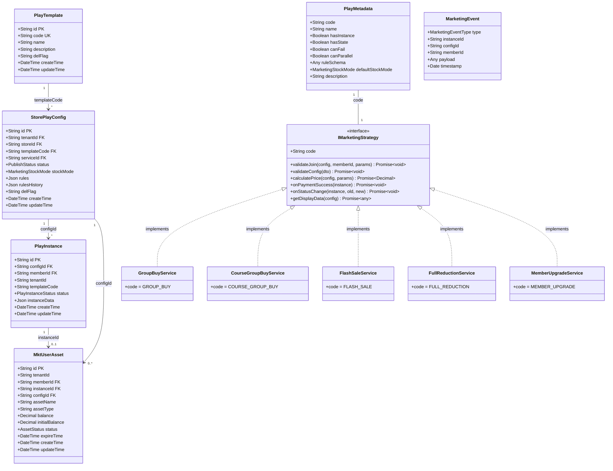
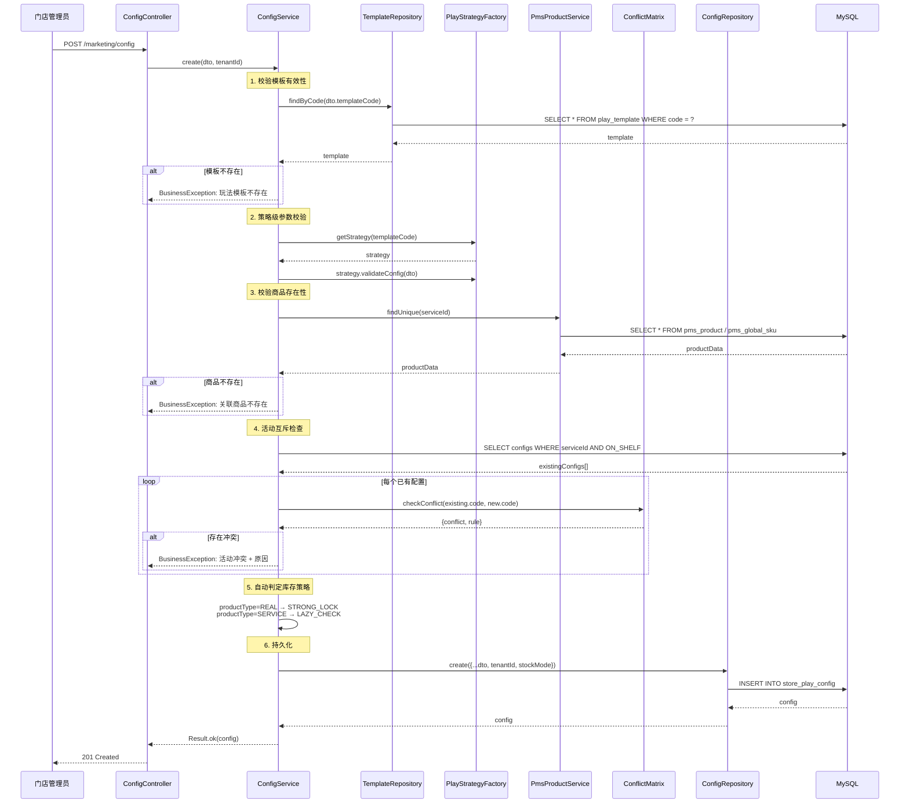
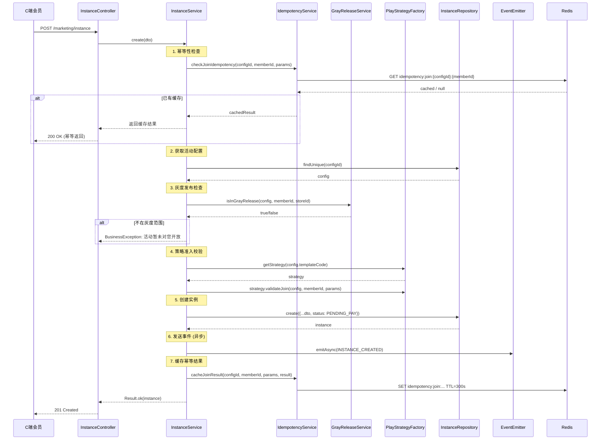
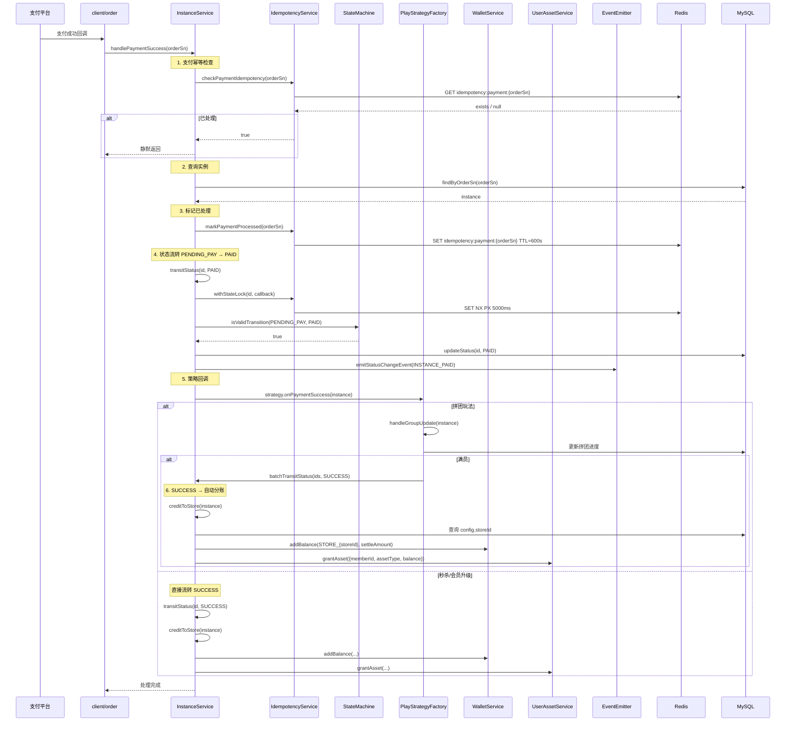
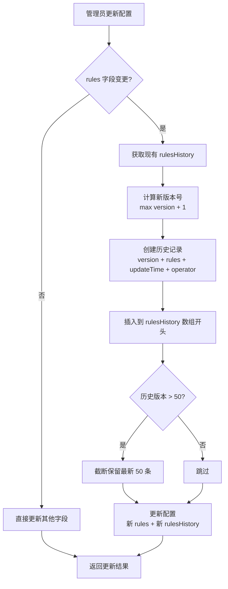
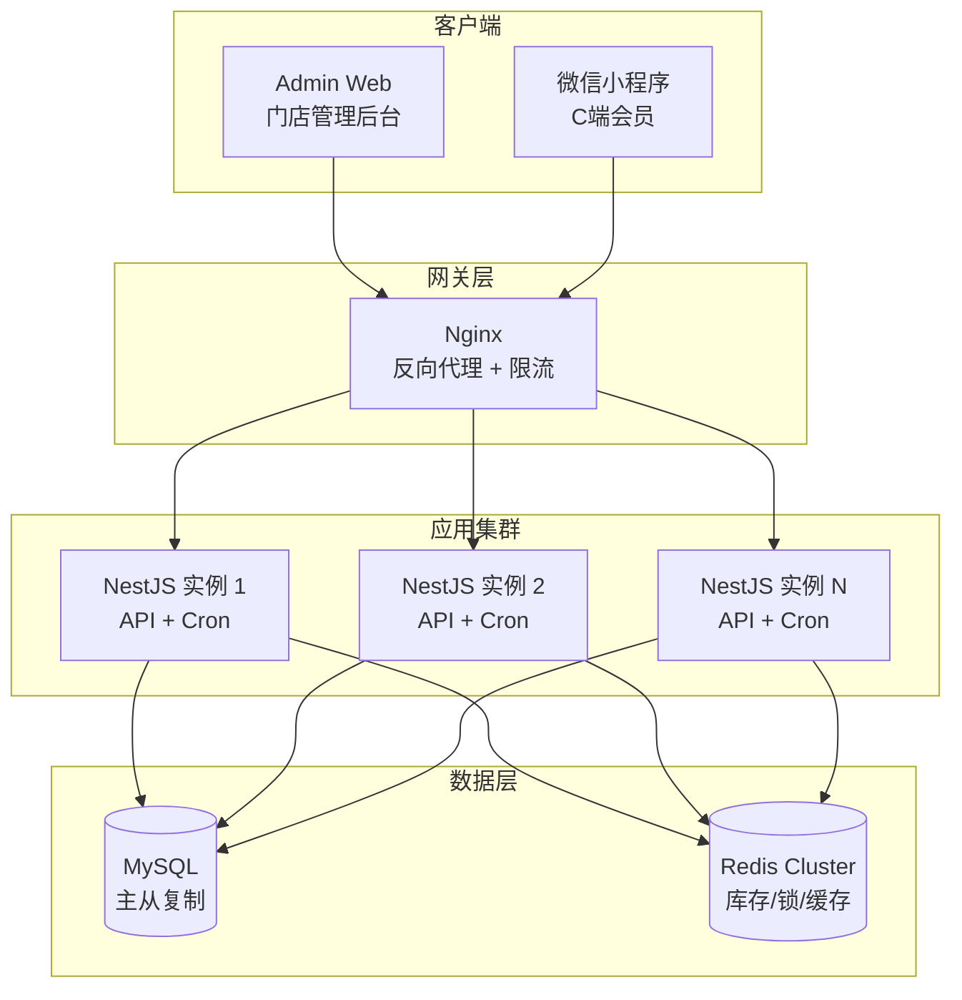

# MaaS 营销核心引擎 — 设计文档

> 版本：1.0
> 日期：2026-02-22
> 模块路径：`src/module/marketing/`（template, config, instance, play, stock, asset）
> 需求文档：[maas-requirements.md](../../../requirements/marketing/maas/maas-requirements.md)
> 状态：现状架构分析 + 改进方案设计

---

## 1. 概述

### 1.1 设计目标

1. 完整描述 MaaS 核心引擎的技术架构、数据流、跨模块协作关系
2. 针对需求文档中识别的 14 个代码缺陷（D-1 ~ D-14）和 5 个跨模块缺陷（X-1 ~ X-5），给出具体改进方案与代码示例
3. 针对 9 个架构不足（A-1 ~ A-9），给出技术设计方案
4. 为中长期演进（C 端接口层、数据统计、审批流集成）提供技术设计

### 1.2 约束

| 约束     | 说明                                                                           |
| -------- | ------------------------------------------------------------------------------ |
| 框架     | NestJS + Prisma ORM + MySQL                                                    |
| 缓存/锁  | Redis（库存 Lua 脚本、分布式锁、幂等缓存）                                     |
| 事务     | `@Transactional()` 装饰器（基于 CLS 上下文）                                   |
| 事件     | EventEmitter2（进程内事件总线）                                                |
| 调度     | `@nestjs/schedule`（Cron 表达式）                                              |
| 多租户   | 门店管理员通过 Token 解析 `tenantId`，平台管理员使用 `SUPER_TENANT_ID`         |
| 设计模式 | 策略模式（玩法插件化）、工厂模式（策略注册与获取）、状态机模式（实例生命周期） |

---

## 2. 架构与模块（组件图）

> 图 1：MaaS 核心引擎组件图

```mermaid
graph TB
    subgraph External["外部模块"]
        PMS[PmsProductService<br/>全局商品库]
        Wallet[WalletService<br/>钱包结算]
        ClientOrder[client/order<br/>支付回调入口]
        GrayRelease[GrayReleaseService<br/>灰度发布]
    end

    subgraph MaaS["MaaS 核心引擎"]
        subgraph Template["template 元数据中心"]
            TCtrl[PlayTemplateController<br/>5 端点 ⚠️无权限]
            TSvc[PlayTemplateService]
            TRepo[PlayTemplateRepository<br/>SoftDeleteRepository]
        end

        subgraph Config["config 配置中心"]
            CCtrl[StorePlayConfigController<br/>9 端点 ⚠️无权限]
            CSvc[StorePlayConfigService<br/>互斥检查+版本控制]
            CRepo[StorePlayConfigRepository]
            Matrix[ActivityConflictMatrix<br/>5×5 互斥规则]
        end

        subgraph Instance["instance 执行中心"]
            ICtrl[PlayInstanceController<br/>4 端点 ⚠️无权限]
            ISvc[PlayInstanceService<br/>状态机+分账+权益]
            IRepo[PlayInstanceRepository]
            Idempotency[IdempotencyService<br/>Redis 分布式锁+缓存]
            StateMachine[StateMachineConfig<br/>7 状态 + 跃迁规则]
        end

        subgraph Play["play 策略中心"]
            Factory[PlayStrategyFactory<br/>策略注册+获取]
            Registry[PlayRegistry<br/>5 种玩法元数据]
            GroupBuy[GroupBuyService]
            CourseGroupBuy[CourseGroupBuyService]
            FlashSale[FlashSaleService]
            FullReduction[FullReductionService]
            MemberUpgrade[MemberUpgradeService]
        end

        subgraph Stock["stock 库存中心"]
            StockSvc[MarketingStockService<br/>Redis Lua 原子扣减]
        end

        subgraph Asset["asset 履约中心"]
            ACtrl[UserAssetController<br/>3 端点 ⚠️无权限]
            ASvc[UserAssetService<br/>发放+核销]
            ARepo[UserAssetRepository]
        end
    end

    subgraph Infra["基础设施层"]
        Events[MarketingEventEmitter<br/>10 种事件类型]
        Scheduler[ActivityLifecycleScheduler<br/>4 个 Cron 任务]
        RuleValidator[RuleValidatorService<br/>DTO+业务校验+Schema]
    end

    subgraph DataLayer["数据层"]
        Redis[(Redis<br/>库存/锁/幂等)]
        MySQL[(MySQL<br/>Prisma ORM)]
    end

    TCtrl --> TSvc --> TRepo
    CCtrl --> CSvc --> CRepo
    CSvc --> Matrix
    CSvc --> TSvc
    CSvc --> PMS
    CSvc --> Factory

    ICtrl --> ISvc --> IRepo
    ISvc --> Idempotency
    ISvc --> StateMachine
    ISvc --> Factory
    ISvc --> Wallet
    ISvc --> ASvc
    ISvc --> Events
    ISvc --> GrayRelease
    ISvc -.->|⚠️ 未调用| StockSvc

    ACtrl --> ASvc --> ARepo

    Factory --> GroupBuy
    Factory --> CourseGroupBuy
    Factory --> FlashSale
    Factory --> FullReduction
    Factory --> MemberUpgrade
    GroupBuy --> ISvc
    GroupBuy --> StockSvc

    Scheduler --> ISvc
    Scheduler --> StockSvc

    StockSvc --> Redis
    Idempotency --> Redis
    TRepo --> MySQL
    CRepo --> MySQL
    IRepo --> MySQL
    ARepo --> MySQL

    ClientOrder -.->|内部调用| ISvc

    style ICtrl fill:#fff3cd
    style CCtrl fill:#fff3cd
    style TCtrl fill:#fff3cd
    style ACtrl fill:#fff3cd
```



**组件说明**：

| 组件                         | 职责                                    | 当前问题                                                |
| ---------------------------- | --------------------------------------- | ------------------------------------------------------- |
| `PlayTemplateController`     | 玩法模板 CRUD（5 端点）                 | 缺少 `@ApiBearerAuth`、`@RequirePermission`、`@Operlog` |
| `StorePlayConfigService`     | 活动配置管理 + 互斥检查 + 版本控制      | 互斥矩阵 templateCode 不一致（D-4）                     |
| `PlayInstanceService`        | 实例生命周期管理 + 状态机 + 分账 + 权益 | 未调用库存扣减（D-10）、批量流转跳过校验（D-7）         |
| `PlayStrategyFactory`        | 策略注册与获取（5 种玩法）              | 正常工作                                                |
| `MarketingStockService`      | Redis Lua 原子库存扣减                  | 未被主流程调用（D-10）                                  |
| `UserAssetService`           | 资产发放与核销                          | 核销缺少并发控制（D-11）                                |
| `MarketingEventEmitter`      | 事件发送（10 种类型）                   | 无监听器消费（A-7）、异步丢失风险（D-9）                |
| `ActivityLifecycleScheduler` | 4 个 Cron 任务                          | 无分布式锁（D-12）、归档无效（D-13）                    |
| `RuleValidatorService`       | 规则校验 + 表单 Schema                  | 未集成到配置创建流程（A-9）                             |

**依赖方向**：`Instance` → `Play`（策略调用）、`Instance` → `Stock`（库存，待接入）、`Instance` → `Asset`（权益发放）、`Instance` → `Wallet`（资金结算）、`Config` → `Template`（模板校验）、`Config` → `PMS`（商品校验）。

---

## 3. 领域/数据模型（类图）

> 图 2：MaaS 核心引擎数据模型类图



**数据流向**：`PlayTemplate`（蓝图定义）→ `StorePlayConfig`（门店应用配置）→ `PlayInstance`（用户参与记录）→ `MktUserAsset`（履约凭证）。

**关键字段说明**：

| 表                             | 字段    | 说明                                                                         |
| ------------------------------ | ------- | ---------------------------------------------------------------------------- |
| `StorePlayConfig.rules`        | JSON    | 存储玩法特有的规则配置（价格、人数、时间等），结构由各玩法的 `RulesDto` 定义 |
| `StorePlayConfig.rulesHistory` | JSON[]  | 规则变更历史版本数组，每条含 version/rules/updateTime/operator               |
| `StorePlayConfig.stockMode`    | Enum    | STRONG_LOCK（实物，Redis 预扣）/ LAZY_CHECK（服务，懒检查）                  |
| `PlayInstance.instanceData`    | JSON    | 存储实例运行时数据（订单号、价格、拼团进度等）                               |
| `PlayInstance.status`          | Enum    | 7 种状态，由状态机严格控制跃迁                                               |
| `MktUserAsset.balance`         | Decimal | 可用余额/次数，核销时扣减，耗尽自动标记 USED                                 |

---

## 4. 核心流程时序（时序图）

### 4.1 活动配置创建（含互斥检查 + 版本控制）

> 图 3：活动配置创建时序图



### 4.2 用户参与活动（幂等 + 灰度 + 策略校验）

> 图 4：用户参与活动时序图



### 4.3 支付回调 → 状态机 → 分账结算

> 图 5：支付成功回调完整时序图



---

## 5. 状态与流程

### 5.1 实例状态机（状态图）

> 图 6：PlayInstance 完整状态图

状态图已在需求文档图 7 中详细描述，此处补充技术实现细节。

**状态机实现**：`instance/state-machine.config.ts` 使用 `Record<PlayInstanceStatus, { allowedNext, description, isFinal }>` 结构定义跃迁规则。

**关键技术点**：

| 机制       | 实现方式                           | 说明                                              |
| ---------- | ---------------------------------- | ------------------------------------------------- |
| 跃迁校验   | `isValidTransition(current, next)` | 查表判断，O(n) 复杂度（n 为允许目标数，最大 4）   |
| 并发控制   | `IdempotencyService.withStateLock` | Redis SET NX PX 5000ms，Lua 脚本释放              |
| 副作用触发 | `transitStatus` 内部               | SUCCESS → creditToStore + strategy.onStatusChange |
| 事件发送   | `emitStatusChangeEvent`            | 根据 newStatus 映射到对应 MarketingEventType      |
| 终态保护   | `isFinal` 标记                     | SUCCESS/TIMEOUT/FAILED/REFUNDED 为终态            |

### 5.2 活动配置版本控制流程（活动图）

> 图 7：规则版本控制活动图



---

## 6. 部署架构（部署图）

> 图 8：MaaS 核心引擎部署图



**部署注意事项**：

| 关注点    | 当前状态             | 风险                   | 改进建议                          |
| --------- | -------------------- | ---------------------- | --------------------------------- |
| Cron 任务 | 所有实例均执行       | 多实例重复处理超时实例 | 添加分布式锁（D-12）              |
| 库存扣减  | Redis Lua 原子操作   | 单点 Redis 故障        | Redis Cluster + 懒加载补偿        |
| 分布式锁  | Redis SET NX         | 锁超时后可能重入       | 使用 Redlock 或续期机制           |
| 事件发送  | 进程内 EventEmitter2 | 进程崩溃事件丢失       | 考虑引入消息队列（Bull/RabbitMQ） |
| 数据归档  | Cron 每天凌晨 2 点   | 归档逻辑未实现（D-13） | 实现 archived 字段或迁移到冷存储  |

---

## 7. 缺陷改进方案

### 7.1 D-1/D-2/D-3：Controller 安全基线修复

**问题**：21 个端点缺少 `@ApiBearerAuth`、`@RequirePermission`、`@Operlog`。

**改进方案**：以 `PlayTemplateController` 为例，其他 Controller 同理。

```typescript
// template.controller.ts — 改进后
@ApiTags('营销-玩法模板')
@Controller('marketing/template')
@ApiBearerAuth('Authorization') // ✅ 新增
export class PlayTemplateController {
  constructor(private readonly service: PlayTemplateService) {}

  @Get('list')
  @Api({ summary: '查询模板列表', type: PlayTemplateListVo })
  @RequirePermission('marketing:template:list') // ✅ 新增
  async findAll(@Query() query: ListPlayTemplateDto) {
    return await this.service.findAll(query);
  }

  @Post()
  @Api({ summary: '创建玩法模板', type: PlayTemplateVo })
  @RequirePermission('marketing:template:create') // ✅ 新增
  @Operlog({ businessType: BusinessType.INSERT }) // ✅ 新增
  async create(@Body() dto: CreatePlayTemplateDto) {
    return await this.service.create(dto);
  }

  // ... 其他端点同理
}
```

**权限编码规范**：

| 子模块   | 操作                                         | 权限编码                                                                             |
| -------- | -------------------------------------------- | ------------------------------------------------------------------------------------ |
| template | 列表/详情/创建/更新/删除                     | `marketing:template:{list,query,create,update,delete}`                               |
| config   | 列表/详情/创建/更新/删除/状态/历史/回滚/比较 | `marketing:config:{list,query,create,update,delete,status,history,rollback,compare}` |
| instance | 列表/详情/创建/状态                          | `marketing:instance:{list,query,create,status}`                                      |
| asset    | 列表/详情/核销                               | `marketing:asset:{list,query,consume}`                                               |

### 7.2 D-4：互斥矩阵 templateCode 修复

**问题**：`activity-conflict.matrix.ts` 使用 `SECKILL`，但注册表使用 `FLASH_SALE`。

**改进方案**：

```typescript
// activity-conflict.matrix.ts — 改进
export const CONFLICT_MATRIX: Record<string, Record<string, ConflictRule>> = {
  // ...
  // ❌ 旧: SECKILL
  // ✅ 新: FLASH_SALE
  FLASH_SALE: {
    GROUP_BUY: {
      type: ConflictType.EXCLUSIVE,
      reason: '秒杀和拼团是互斥的玩法',
    },
    // ... 其他规则同步修改键名
  },
  // 其他玩法中引用 SECKILL 的也需改为 FLASH_SALE
};
```

### 7.3 D-7/D-8：批量状态流转修复

**问题**：`batchTransitStatus` 跳过状态机校验和事件发送。

**改进方案**：

```typescript
// instance.service.ts — 改进
@Transactional()
async batchTransitStatus(ids: string[], nextStatus: PlayInstanceStatus, extraData?: any) {
  if (ids.length === 0) return;

  // ✅ 改进：逐条校验状态机 + 发送事件
  const instances = await this.repo.findMany({ where: { id: { in: ids } } });

  for (const instance of instances) {
    // 1. 状态机校验
    if (!isValidTransition(instance.status, nextStatus)) {
      this.logger.warn(
        `批量流转跳过非法跃迁: ${instance.id} ${instance.status} -> ${nextStatus}`,
      );
      continue; // 跳过非法跃迁，不中断整批
    }

    // 2. 执行状态变更
    await this.repo.updateStatus(instance.id, nextStatus, extraData);

    // 3. SUCCESS 时执行分账
    if (nextStatus === PlayInstanceStatus.SUCCESS) {
      await this.creditToStore(instance);
    }

    // 4. 策略钩子
    const strategy = this.strategyFactory.getStrategy(instance.templateCode);
    await strategy.onStatusChange(instance, instance.status, nextStatus);

    // 5. 发送事件
    await this.emitStatusChangeEvent(instance, instance.status, nextStatus);
  }
}
```

### 7.4 D-10：库存扣减接入参与流程

**问题**：`PlayInstanceService.create` 未调用 `MarketingStockService.decrement`。

**改进方案**：在策略校验之后、创建实例之前插入库存扣减。

```typescript
// instance.service.ts — create 方法改进
async create(dto: CreatePlayInstanceDto) {
  // ... 幂等检查、配置获取、灰度检查、策略校验 ...

  // ✅ 新增：库存扣减（在创建实例之前）
  const quantity = dto.instanceData?.quantity || 1;
  const stockDeducted = await this.stockService.decrement(
    config.id,
    quantity,
    config.stockMode,
  );
  // STRONG_LOCK 模式下扣减失败会抛出 BusinessException
  // LAZY_CHECK 模式下直接放行

  // 创建实例
  const instance = await this.repo.create({
    ...dto,
    status: PlayInstanceStatus.PENDING_PAY,
  });

  // ... 事件发送、幂等缓存 ...
}
```

**注意**：需要在 `PlayInstanceService` 构造函数中注入 `MarketingStockService`。

### 7.5 D-11：资产核销并发控制

**问题**：`consumeAsset` 无分布式锁，高并发下可能重复扣减。

**改进方案**：

```typescript
// asset.service.ts — 改进
@Transactional()
async consumeAsset(id: string, useAmount: number) {
  // ✅ 新增：分布式锁
  const lockKey = `asset:consume:${id}`;
  const lockValue = `${Date.now()}`;
  const acquired = await this.redis.getClient().set(lockKey, lockValue, 'PX', 5000, 'NX');

  if (!acquired) {
    throw new BusinessException(ResponseCode.BUSINESS_ERROR, '核销操作正在处理中，请稍后重试');
  }

  try {
    const asset = await this.repo.findById(id);
    BusinessException.throwIfNull(asset, '待核销的资产不存在');

    // ... 状态预检、有效期校验、余额校验 ...

    const updated = await this.repo.consume(id, useAmount);

    if (Number(updated.balance) <= 0) {
      await this.repo.update(id, { status: AssetStatus.USED });
    }

    return Result.ok(FormatDateFields(updated), '权益核销成功');
  } finally {
    // 释放锁
    const releaseLua = `
      if redis.call("get", KEYS[1]) == ARGV[1] then
        return redis.call("del", KEYS[1])
      else
        return 0
      end
    `;
    await this.redis.getClient().eval(releaseLua, 1, lockKey, lockValue);
  }
}
```

### 7.6 D-12：调度器分布式锁

**问题**：多实例部署时 Cron 任务重复执行。

**改进方案**：

```typescript
// lifecycle.scheduler.ts — 改进
@Cron(CronExpression.EVERY_MINUTE)
async handleTimeoutInstances() {
  // ✅ 新增：分布式锁，确保只有一个实例执行
  const lockKey = 'scheduler:timeout:lock';
  const lockValue = `${process.pid}:${Date.now()}`;
  const acquired = await this.redis.getClient().set(lockKey, lockValue, 'PX', 55000, 'NX');

  if (!acquired) {
    this.logger.debug('[定时任务] 其他实例正在处理，跳过');
    return;
  }

  try {
    // ... 原有逻辑 ...
  } finally {
    // 释放锁（Lua 脚本确保只删自己的锁）
    await this.releaseLock(lockKey, lockValue);
  }
}
```

### 7.7 D-9：事件发送可靠性改进

**问题**：`emitAsync` 使用 `setImmediate`，事件处理失败无重试。

**改进方案**：

```typescript
// marketing-event.emitter.ts — 改进
async emitAsync(event: MarketingEvent): Promise<void> {
  try {
    this.logger.log(`[异步事件发送] 类型: ${event.type}, 实例: ${event.instanceId}`);

    // ✅ 改进：使用 Promise 而非 setImmediate，保留错误追踪
    // 不 await，但记录 Promise 用于监控
    const promise = this.eventEmitter.emitAsync(event.type, event)
      .then(() => {
        this.logger.log(`[异步事件发送成功] 类型: ${event.type}`);
      })
      .catch(async (error) => {
        this.logger.error(`[异步事件处理失败] 类型: ${event.type}, 错误: ${getErrorMessage(error)}`);

        // ✅ 新增：关键事件重试（最多 3 次）
        if (this.isCriticalEvent(event.type)) {
          await this.retryEmit(event, 3);
        }
      });

    // 不阻塞主流程
  } catch (error) {
    this.logger.error(`[异步事件发送失败] ${getErrorMessage(error)}`);
  }
}

private isCriticalEvent(type: MarketingEventType): boolean {
  return [
    MarketingEventType.INSTANCE_SUCCESS,
    MarketingEventType.INSTANCE_FAILED,
    MarketingEventType.INSTANCE_REFUNDED,
  ].includes(type);
}
```

---

## 8. 架构改进方案

### 8.1 A-7：事件监听器实现

**问题**：10 种事件类型已定义并发送，但无 `@OnEvent` 监听器消费。

**改进方案**：创建 `marketing/events/marketing-event.listener.ts`。

```typescript
@Injectable()
export class MarketingEventListener {
  private readonly logger = new Logger(MarketingEventListener.name);

  @OnEvent(MarketingEventType.INSTANCE_SUCCESS)
  async handleInstanceSuccess(event: MarketingEvent) {
    this.logger.log(`[实例成功] instanceId=${event.instanceId}, memberId=${event.memberId}`);
    // 1. 发送成功通知（短信/推送）
    // 2. 更新统计数据
    // 3. 触发后续业务（如拼团成功通知团员）
  }

  @OnEvent(MarketingEventType.INSTANCE_FAILED)
  async handleInstanceFailed(event: MarketingEvent) {
    this.logger.log(`[实例失败] instanceId=${event.instanceId}`);
    // 1. 触发退款流程
    // 2. 释放库存
    // 3. 发送失败通知
  }

  @OnEvent(MarketingEventType.INSTANCE_TIMEOUT)
  async handleInstanceTimeout(event: MarketingEvent) {
    this.logger.log(`[实例超时] instanceId=${event.instanceId}`);
    // 1. 释放库存
    // 2. 发送超时通知
  }

  @OnEvent(MarketingEventType.INSTANCE_REFUNDED)
  async handleInstanceRefunded(event: MarketingEvent) {
    this.logger.log(`[实例退款] instanceId=${event.instanceId}`);
    // 1. 回收已发放资产
    // 2. 更新统计数据
  }
}
```

### 8.2 A-8：C 端接口层设计

**问题**：会员直接调用管理端接口，违反 Client/能力域分层规范。

**改进方案**：在 `module/client/marketing/` 下创建薄 Controller。

```
module/client/marketing/
  client-marketing.controller.ts   # C端营销接口
  client-marketing.module.ts       # 模块定义
```

```typescript
// client-marketing.controller.ts
@ApiTags('C端-营销活动')
@Controller('client/marketing')
@ApiBearerAuth('Authorization')
export class ClientMarketingController {
  constructor(
    private readonly instanceService: PlayInstanceService,
    private readonly assetService: UserAssetService,
    private readonly configService: StorePlayConfigService,
  ) {}

  /** @tenantScope TenantScoped */
  @Get('activities')
  @Api({ summary: '查询可参与的活动列表' })
  async getActivities(@Query() query: ListActivitiesDto, @Member() member: MemberDto) {
    // 仅返回 ON_SHELF 状态的活动
    return await this.configService.findAll({ ...query, status: 'ON_SHELF' });
  }

  /** @tenantScope TenantScoped */
  @Post('join')
  @Api({ summary: '参与活动' })
  async joinActivity(@Body() dto: JoinActivityDto, @Member() member: MemberDto) {
    return await this.instanceService.create({
      ...dto,
      memberId: member.memberId,
    });
  }

  /** @tenantScope TenantScoped */
  @Get('my-instances')
  @Api({ summary: '我的参与记录' })
  async getMyInstances(@Query() query: ListMyInstancesDto, @Member() member: MemberDto) {
    return await this.instanceService.findAll({
      ...query,
      memberId: member.memberId,
    });
  }

  /** @tenantScope TenantScoped */
  @Get('my-assets')
  @Api({ summary: '我的权益资产' })
  async getMyAssets(@Query() query: ListMyAssetsDto, @Member() member: MemberDto) {
    return await this.assetService.findAll({
      ...query,
      memberId: member.memberId,
    });
  }

  /** @tenantScope TenantScoped */
  @Post('assets/:id/consume')
  @Api({ summary: '核销权益' })
  async consumeAsset(@Param('id') id: string, @Body('amount') amount: number) {
    return await this.assetService.consumeAsset(id, amount);
  }
}
```

### 8.3 A-9：规则校验服务集成

**问题**：`RuleValidatorService` 未集成到配置创建流程。

**改进方案**：在 `StorePlayConfigService.create` 中调用统一校验。

```typescript
// config.service.ts — create 方法改进
async create(dto: CreateStorePlayConfigDto, tenantId: string) {
  // 1. 校验模板有效性
  const template = await this.templateRepo.findByCode(dto.templateCode);
  BusinessException.throwIfNull(template, '指定的营销玩法模板不存在或已下架');

  // ✅ 改进：使用统一规则校验服务（替代直接调用 strategy.validateConfig）
  const validationResult = await this.ruleValidator.validate(dto.templateCode, dto.rules);
  if (!validationResult.valid) {
    const errorMsg = validationResult.errors.map(e => `${e.field}: ${e.message}`).join('; ');
    throw new BusinessException(ResponseCode.PARAM_INVALID, `规则校验失败: ${errorMsg}`);
  }

  // ... 后续逻辑不变 ...
}
```

### 8.4 X-4/X-5：活动上下架联动改进

**问题**：下架不处理进行中实例，上架不初始化库存。

**改进方案**：

```typescript
// config.service.ts — updateStatus 方法改进
async updateStatus(id: string, status: string) {
  const config = await this.repo.findById(id);
  BusinessException.throwIfNull(config, '配置不存在');

  // ✅ 新增：上架时初始化库存
  if (status === 'ON_SHELF') {
    const rules = config.rules as any;
    if (rules?.stock && config.stockMode === 'STRONG_LOCK') {
      await this.stockService.initStock(id, rules.stock);
    }
  }

  // ✅ 新增：下架时检查进行中实例
  if (status === 'OFF_SHELF') {
    const activeCount = await this.prisma.playInstance.count({
      where: {
        configId: id,
        status: { in: ['PENDING_PAY', 'PAID', 'ACTIVE'] },
      },
    });
    if (activeCount > 0) {
      this.logger.warn(`活动 ${id} 下架时仍有 ${activeCount} 个进行中实例`);
      // 可选：抛出异常阻止下架，或发送通知
    }
  }

  const updated = await this.repo.update(id, { status } as any);
  return Result.ok(FormatDateFields(updated), '状态更新成功');
}
```

---

## 9. 接口/数据约定

### 9.1 核心接口契约

#### 9.1.1 创建活动配置

```
POST /marketing/config
Content-Type: application/json
Authorization: Bearer {token}

Request:
{
  "templateCode": "GROUP_BUY",
  "serviceId": "product_001",
  "storeId": "store_001",
  "rules": {
    "name": "春季拼团特惠",
    "price": 99.00,
    "minCount": 2,
    "maxCount": 10,
    "validDays": 3,
    "stock": 100,
    "startTime": "2026-03-01T00:00:00Z",
    "endTime": "2026-03-31T23:59:59Z"
  }
}

Response:
{
  "code": 200,
  "msg": "配置创建成功",
  "data": {
    "id": "config_001",
    "templateCode": "GROUP_BUY",
    "serviceId": "product_001",
    "storeId": "store_001",
    "status": "OFF_SHELF",
    "stockMode": "STRONG_LOCK",
    "rules": { ... },
    "rulesHistory": [],
    "createTime": "2026-03-01T10:00:00Z"
  }
}
```

#### 9.1.2 参与活动

```
POST /marketing/instance
Content-Type: application/json
Authorization: Bearer {token}

Request:
{
  "configId": "config_001",
  "memberId": "member_001",
  "instanceData": {
    "skuId": "sku_001",
    "quantity": 1,
    "price": 99.00,
    "isLeader": true
  }
}

Response:
{
  "code": 200,
  "data": {
    "id": "instance_001",
    "configId": "config_001",
    "memberId": "member_001",
    "status": "PENDING_PAY",
    "instanceData": { ... },
    "createTime": "2026-03-01T10:05:00Z"
  }
}
```

#### 9.1.3 核销资产

```
POST /marketing/asset/{id}/consume
Content-Type: application/json
Authorization: Bearer {token}

Request:
{
  "amount": 1
}

Response:
{
  "code": 200,
  "msg": "权益核销成功",
  "data": {
    "id": "asset_001",
    "balance": 0,
    "initialBalance": 1,
    "status": "USED",
    "updateTime": "2026-03-02T14:30:00Z"
  }
}
```

### 9.2 事件数据契约

```typescript
// 所有营销事件遵循统一结构
interface MarketingEvent {
  type: MarketingEventType; // 事件类型（10 种）
  instanceId: string; // 实例 ID
  configId: string; // 配置 ID
  memberId: string; // 用户 ID
  payload: {
    // 业务负载（按事件类型不同）
    oldStatus?: string; // 状态变更事件：旧状态
    newStatus?: string; // 状态变更事件：新状态
    orderSn?: string; // 关联订单号
    amount?: number; // 金额
    templateCode?: string; // 玩法代码
    instanceData?: any; // 实例数据
  };
  timestamp: Date; // 事件时间戳
}
```

### 9.3 Redis 键命名规范

| 键模式                                                         | 用途                         | TTL            |
| -------------------------------------------------------------- | ---------------------------- | -------------- |
| `mkt:stock:{configId}`                                         | 库存缓存                     | 无（手动管理） |
| `idempotency:join:{configId}:{memberId}[:{groupId}][:{skuId}]` | 参与幂等                     | 300s           |
| `idempotency:payment:{orderSn}`                                | 支付回调幂等                 | 600s           |
| `idempotency:state:{instanceId}`                               | 状态变更分布式锁             | 5000ms         |
| `scheduler:timeout:lock`                                       | 调度器分布式锁（建议新增）   | 55000ms        |
| `asset:consume:{assetId}`                                      | 资产核销分布式锁（建议新增） | 5000ms         |

---

## 10. 优先级总结与实施路线

### 10.1 缺陷优先级汇总

| 优先级 | 数量 | 缺陷编号                                 | 核心风险                                       |
| ------ | ---- | ---------------------------------------- | ---------------------------------------------- |
| 🔴 P0  | 3    | D-2, D-7, D-10                           | 无权限控制、批量流转跳过状态机、库存扣减未接入 |
| 🟡 P1  | 8    | D-1, D-3, D-4, D-5, D-8, D-9, D-11, D-12 | 无审计日志、互斥失效、事件丢失、并发安全       |
| 🟢 P2  | 3    | D-6, D-13, D-14                          | 资产类型硬编码、归档无效、废弃代码             |
| 跨模块 | 5    | X-1 ~ X-5                                | 隐式依赖、约定不统一、联动缺失                 |
| 架构   | 9    | A-1 ~ A-9                                | 无统计、无审批、无 C 端接口、事件无消费者      |

### 10.2 四周实施路线

```
第 1 周：安全基线 + 核心修复
├── T-1: Controller 添加 @ApiBearerAuth + @RequirePermission (2h)
├── T-2: 写操作添加 @Operlog (1h)
├── T-3: 互斥矩阵 SECKILL → FLASH_SALE (0.5h)
├── T-4: 参与流程接入库存扣减 (2h)
├── T-5: 批量流转增加状态机校验+事件 (2h)
├── T-6: 资产类型从 rules 读取 (0.5h)
└── T-7: 删除废弃方法 (0.5h)

第 2 周：可靠性加固
├── T-8: 资产核销分布式锁 (1d)
├── T-9: 调度器分布式锁 (1d)
├── T-10: 修复归档任务 (1d)
├── T-11: 事件发送重试机制 (1d)
└── T-12: 活动上架初始化库存 (0.5d)

第 3 周：跨模块联动
├── T-13: 活动下架检查进行中实例 (1d)
├── T-14: 平台费率配置化 (0.5d)
├── T-15: 门店钱包 ID 约定统一 (0.5d)
├── T-16: 创建 client/marketing/ C端接口层 (2-3d)
└── T-18: 集成 RuleValidatorService (1d)

第 4 周：可观测性
├── T-17: 实现事件监听器 (2-3d)
└── T-20: 活动数据统计接口 (3-5d)
```

### 10.3 技术债务跟踪

| 类别       | 当前 | 第 1 周后 | 第 4 周后 |
| ---------- | ---- | --------- | --------- |
| P0 缺陷    | 3    | 0         | 0         |
| P1 缺陷    | 8    | 5         | 0         |
| P2 缺陷    | 3    | 2         | 0         |
| 跨模块缺陷 | 5    | 5         | 1         |
| 架构不足   | 9    | 9         | 5         |
