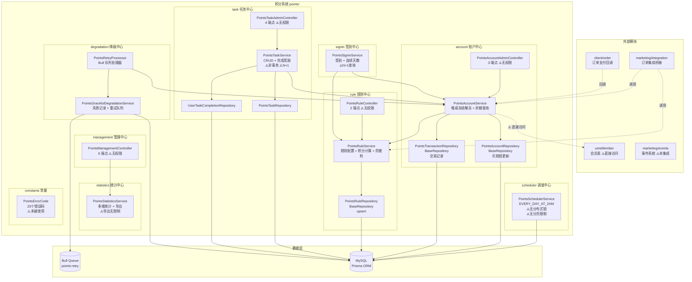
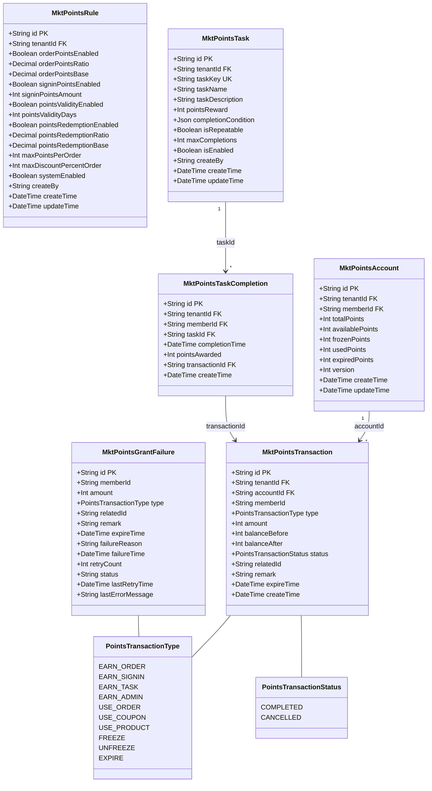
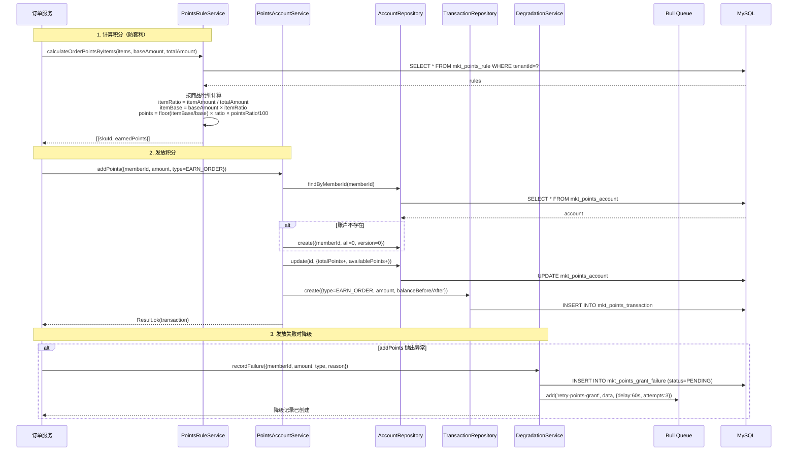
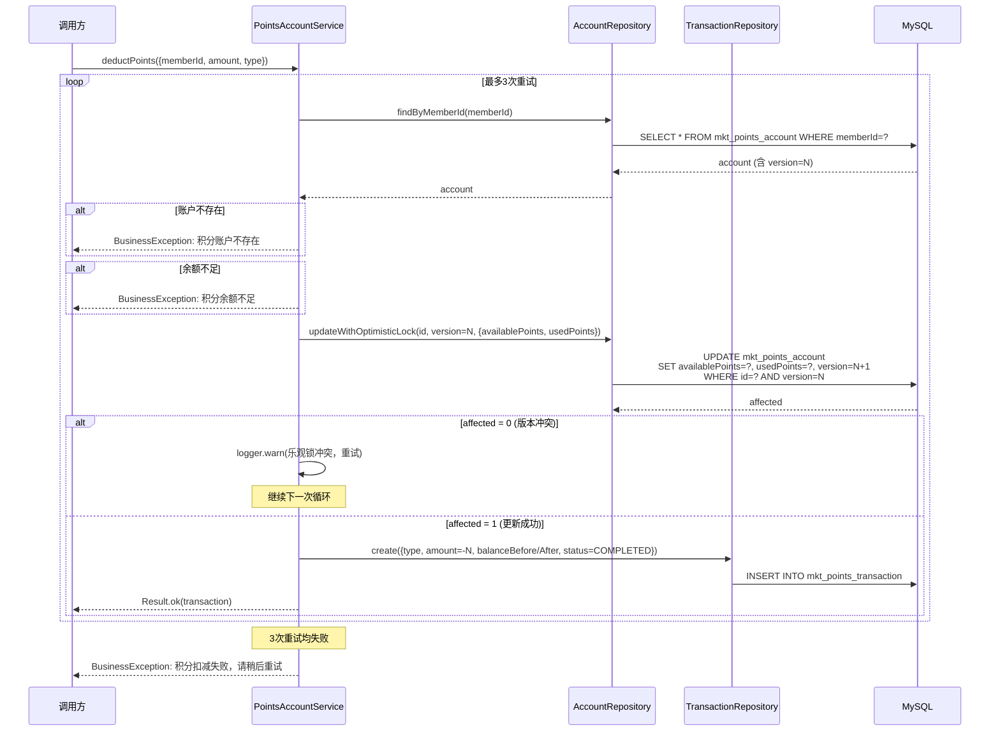
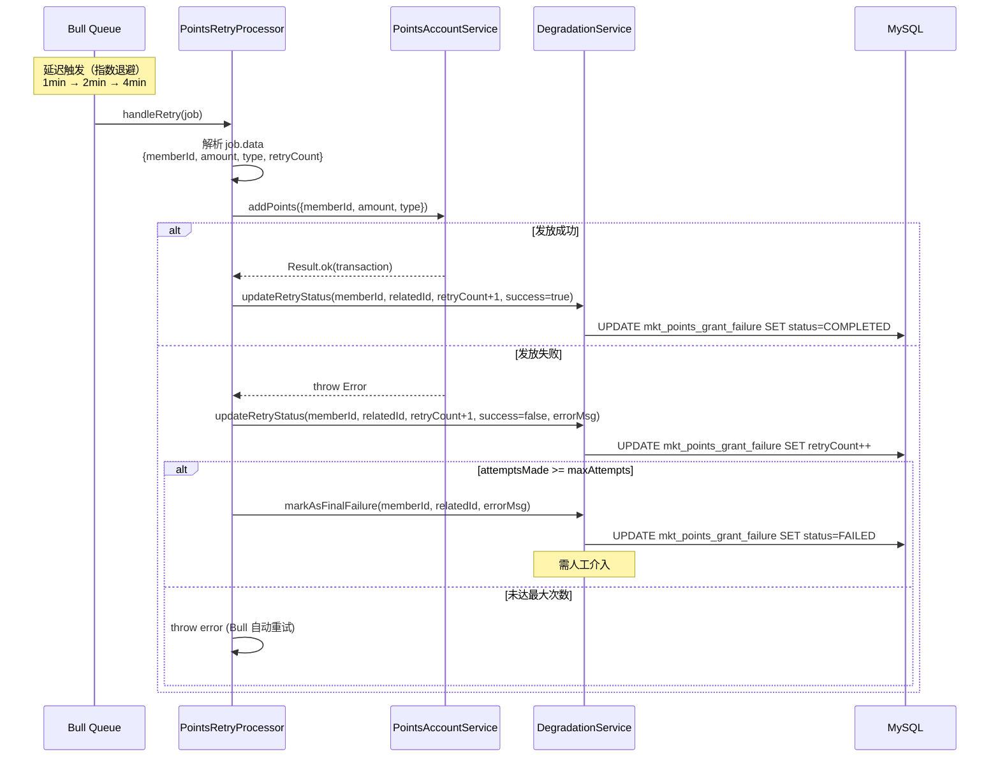
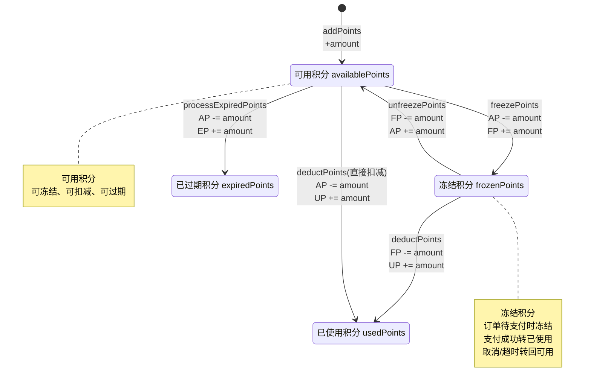
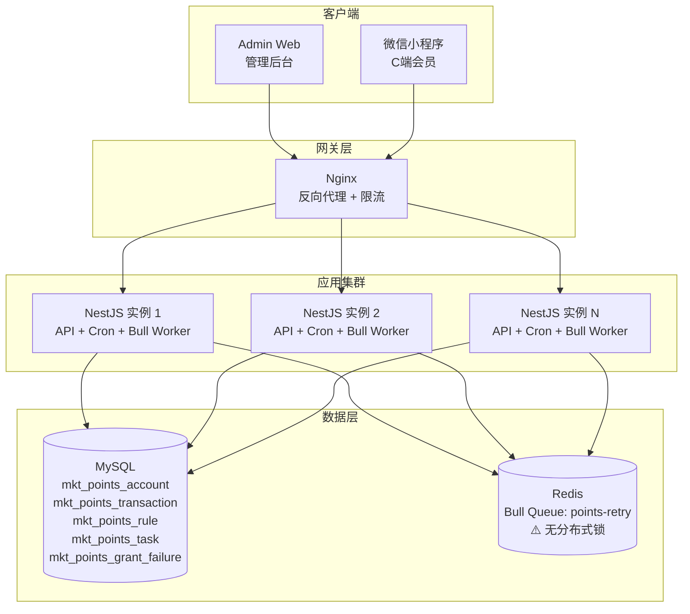

# 积分系统 — 设计文档

> 版本：1.0
> 日期：2026-02-22
> 模块路径：`src/module/marketing/points/`（account, rule, signin, task, degradation, management, statistics, scheduler, constants）
> 需求文档：[points-requirements.md](../../../requirements/marketing/points/points-requirements.md)
> 状态：现状架构分析 + 改进方案设计

---

## 1. 概述

### 1.1 设计目标

1. 完整描述积分系统的技术架构、数据流、跨模块协作关系
2. 针对需求文档中识别的 14 个代码缺陷（D-1 ~ D-14）和 6 个跨模块缺陷（X-1 ~ X-6），给出具体改进方案与代码示例
3. 针对 9 个架构不足（A-1 ~ A-9），给出技术设计方案
4. 为中长期演进（C 端接口层、签到递增、积分等级、积分商城）提供技术设计

### 1.2 约束

| 约束     | 说明                                           |
| -------- | ---------------------------------------------- |
| 框架     | NestJS + Prisma ORM + MySQL                    |
| 队列     | Bull（Redis-backed，积分发放降级重试）         |
| 事务     | `@Transactional()` 装饰器（基于 CLS 上下文）   |
| 调度     | `@nestjs/schedule`（Cron 表达式）              |
| 多租户   | 通过 `BaseRepository` 自动注入 `tenantId` 过滤 |
| 并发控制 | 乐观锁（version 字段，3 次重试）               |

---

## 2. 架构与模块（组件图）

> 图 1：积分系统组件图



**组件说明**：

| 组件                               | 职责                                        | 当前问题                                                  |
| ---------------------------------- | ------------------------------------------- | --------------------------------------------------------- |
| `PointsAccountAdminController`     | 积分调整 + 账户列表 + 交易记录（3 端点）    | 缺少 `@ApiBearerAuth`、`@RequirePermission`、`@Operlog`   |
| `PointsAccountService`             | 增减冻结解冻 + 余额查询 + 管理端查询        | 直接访问 `umsMember` 表（X-1）；冻结/解冻无乐观锁（D-11） |
| `PointsRuleService`                | 规则配置 + 消费积分计算 + 防套利 + 抵扣验证 | 正常工作                                                  |
| `PointsSigninService`              | 签到 + 连续天数统计                         | N+1 查询（D-6）                                           |
| `PointsTaskService`                | 任务 CRUD + 完成奖励                        | N+1 查询（D-7）；非事务（D-14）；硬删除（D-13）           |
| `PointsGracefulDegradationService` | 失败记录 + Bull 队列重试                    | 未集成事件系统（X-5）                                     |
| `PointsStatisticsService`          | 多维统计 + 排行榜 + 导出                    | 导出无限制（D-8）                                         |
| `PointsSchedulerService`           | 过期积分处理（每天凌晨 2 点）               | 无分布式锁（D-9）；无分页（D-10）                         |
| `PointsErrorCode`                  | 23 个错误码定义                             | 未被任何 Service 使用（D-5）                              |

**依赖方向**：`Signin` → `Account` + `Rule`（签到发放积分）、`Task` → `Account`（任务奖励）、`Degradation` → `Account`（重试发放）、`Management` → `Statistics`（统计查询）、`Integration` → `Rule` + `Account`（订单集成）。

---

## 3. 领域/数据模型（类图）

> 图 2：积分系统数据模型类图



**数据流向**：`MktPointsRule`（规则配置）→ `MktPointsAccount`（账户余额）→ `MktPointsTransaction`（交易流水）。`MktPointsTask`（任务定义）→ `MktPointsTaskCompletion`（完成记录）→ `MktPointsTransaction`（积分发放）。`MktPointsGrantFailure`（降级记录）→ Bull 队列 → `MktPointsTransaction`（重试发放）。

**关键字段说明**：

| 表                                 | 字段     | 说明                                                              |
| ---------------------------------- | -------- | ----------------------------------------------------------------- |
| `MktPointsAccount.version`         | Int      | 乐观锁版本号，`deductPoints` 使用 `updateWithOptimisticLock` 校验 |
| `MktPointsAccount.availablePoints` | Int      | 可用积分，冻结时减少，解冻时恢复                                  |
| `MktPointsTransaction.amount`      | Int      | 正数=获取，负数=扣减/冻结/过期                                    |
| `MktPointsTransaction.expireTime`  | DateTime | 积分过期时间，定时任务据此判断是否过期                            |
| `MktPointsTransaction.status`      | Enum     | COMPLETED=正常，CANCELLED=过期后标记                              |
| `MktPointsRule.orderPointsBase`    | Decimal  | 消费积分基数（每 base 元获得 ratio 积分）                         |
| `MktPointsTask.taskKey`            | String   | 任务唯一标识，用于 `completeTask` 查找                            |
| `MktPointsGrantFailure.status`     | String   | PENDING/COMPLETED/FAILED，降级记录状态                            |

**恒等关系**：`totalPoints = availablePoints + frozenPoints + usedPoints + expiredPoints`

---

## 4. 核心流程时序（时序图）

### 4.1 积分获取（消费 + 降级）

> 图 3：消费获取积分时序图



### 4.2 积分扣减（乐观锁）

> 图 4：积分扣减乐观锁时序图



### 4.3 降级重试流程

> 图 5：Bull 队列降级重试时序图



---

## 5. 状态与流程

### 5.1 积分账户余额联动（状态图）

积分系统的核心复杂度不在交易状态流转（仅 COMPLETED/CANCELLED），而在账户 5 个余额字段的联动更新。

> 图 6：积分账户余额联动状态图



**技术实现对比**：

| 操作                   | 使用乐观锁                   | 使用事务           | 问题                             |
| ---------------------- | ---------------------------- | ------------------ | -------------------------------- |
| `addPoints`            | 否                           | 否                 | D-12：与 deductPoints 策略不一致 |
| `deductPoints`         | 是（version 字段，3 次重试） | 否                 | 正常                             |
| `freezePoints`         | 否                           | 否                 | D-11：并发场景可能余额不一致     |
| `unfreezePoints`       | 否                           | 否                 | D-11：同上                       |
| `processExpiredPoints` | 否                           | 是（$transaction） | 正常（事务内原子操作）           |

### 5.2 降级记录状态机实现

降级记录状态通过 `mktPointsGrantFailure.status` 字段控制，使用 `updateMany` + `WHERE status = ?` 隐式校验。

| 跃迁                | 触发方法                          | WHERE 条件           | 目标状态       |
| ------------------- | --------------------------------- | -------------------- | -------------- |
| PENDING → COMPLETED | `updateRetryStatus(success=true)` | `status = 'PENDING'` | COMPLETED      |
| PENDING → FAILED    | `markAsFinalFailure`              | `status = 'PENDING'` | FAILED         |
| FAILED → PENDING    | `manualRetry`                     | 查询后加入队列       | 队列处理后更新 |

---

## 6. 部署架构（部署图）

> 图 7：积分系统部署图



**部署注意事项**：

| 关注点      | 当前状态                        | 风险                          | 改进建议                       |
| ----------- | ------------------------------- | ----------------------------- | ------------------------------ |
| Cron 任务   | 所有实例均执行                  | 多实例重复处理过期积分        | 添加分布式锁（D-9）            |
| Bull Worker | 所有实例均为 Worker             | Bull 自动分配，无重复消费风险 | 正常                           |
| 乐观锁      | 仅 `deductPoints` 使用          | 冻结/解冻并发不安全           | 统一使用乐观锁（D-11）         |
| 导出        | 同步全量查询                    | 大数据量内存溢出              | 异步导出 + 分页流式写入（D-8） |
| 数据增长    | `mkt_points_transaction` 为大表 | 数据量级 D2~D3                | 需要索引优化 + 归档策略        |
| 过期处理    | 一次性加载所有过期记录          | 大数据量 OOM                  | 分批处理（D-10）               |

---

## 7. 缺陷改进方案

### 7.1 D-1/D-2/D-3/D-4：Controller 安全基线修复

**问题**：15 个端点缺少 `@ApiBearerAuth`、`@RequirePermission`、`@Operlog`，且使用 `@ApiOperation` 而非 `@Api`。

**改进方案**：以 `PointsAccountAdminController` 为例，其他 Controller 同理。

```typescript
// account.controller.ts — 改进后
@ApiTags('营销-积分账户管理')
@Controller('admin/marketing/points')
@ApiBearerAuth('Authorization') // ✅ 新增
export class PointsAccountAdminController {
  constructor(private readonly accountService: PointsAccountService) {}

  @Post('adjust')
  @Api({ summary: '调整用户积分' }) // ✅ 替代 @ApiOperation
  @RequirePermission('marketing:points:account:adjust') // ✅ 新增
  @Operlog({ businessType: BusinessType.UPDATE }) // ✅ 新增
  async adjustPoints(@Body() dto: AddPointsDto) {
    return this.accountService.addPoints(dto);
  }

  @Get('accounts')
  @Api({ summary: '查询积分账户列表', isPager: true }) // ✅ 替代 @ApiOperation
  @RequirePermission('marketing:points:account:list') // ✅ 新增
  async getAccounts(@Query() query: ListPointsAccountDto) {
    return this.accountService.getAccountsForAdmin(query);
  }

  @Get('transactions')
  @Api({ summary: '查询积分交易记录', isPager: true })
  @RequirePermission('marketing:points:account:transactions')
  async getTransactions(@Query() query: TransactionQueryDto) {
    return this.accountService.getTransactionsForAdmin(query);
  }
}
```

**权限编码规范**：

| 子模块     | 操作                | 权限编码                                              |
| ---------- | ------------------- | ----------------------------------------------------- |
| account    | 调整/列表/交易记录  | `marketing:points:account:{adjust,list,transactions}` |
| rule       | 查询/更新           | `marketing:points:rule:{query,update}`                |
| task       | 创建/更新/列表/删除 | `marketing:points:task:{create,update,list,delete}`   |
| management | 统计/排行/导出      | `marketing:points:manage:{statistics,ranking,export}` |

### 7.2 D-5：错误码统一使用

**问题**：`PointsErrorCode` 定义了 23 个错误码但未被使用。

**改进方案**：创建辅助函数，在所有 Service 中统一使用。

```typescript
// constants/error-codes.ts — 新增辅助函数
import { BusinessException } from 'src/common/exceptions';
import { ResponseCode } from 'src/common/response';

export function throwPointsError(code: PointsErrorCode): never {
  throw new BusinessException(ResponseCode.BUSINESS_ERROR, PointsErrorMessages[code]);
}

export function throwPointsErrorIf(condition: boolean, code: PointsErrorCode): void {
  if (condition) throwPointsError(code);
}

export function throwPointsErrorIfNull<T>(value: T | null | undefined, code: PointsErrorCode): asserts value is T {
  if (value == null) throwPointsError(code);
}
```

```typescript
// account.service.ts — 改进示例
import { throwPointsErrorIfNull, throwPointsErrorIf, PointsErrorCode } from '../constants/error-codes';

// ❌ 旧: BusinessException.throw(400, '积分账户不存在');
// ✅ 新:
throwPointsErrorIfNull(account, PointsErrorCode.ACCOUNT_NOT_FOUND);

// ❌ 旧: BusinessException.throw(400, '积分余额不足');
// ✅ 新:
throwPointsErrorIf(account.availablePoints < dto.amount, PointsErrorCode.INSUFFICIENT_BALANCE);
```

### 7.3 D-6：签到连续天数 N+1 优化

**问题**：`calculateContinuousDays` 逐天查询，最多 100 次 DB 查询。

**改进方案**：单次查询最近 100 天签到记录，内存中计算连续天数。

```typescript
// signin.service.ts — 改进后
private async calculateContinuousDays(memberId: string): Promise<number> {
  const tenantId = TenantContext.getTenantId() ?? TenantContext.SUPER_TENANT_ID;
  const hundredDaysAgo = new Date();
  hundredDaysAgo.setDate(hundredDaysAgo.getDate() - 100);
  hundredDaysAgo.setHours(0, 0, 0, 0);

  // ✅ 单次查询最近100天的签到记录
  const signinRecords = await this.prisma.mktPointsTransaction.findMany({
    where: {
      tenantId,
      memberId,
      type: PointsTransactionType.EARN_SIGNIN,
      createTime: { gte: hundredDaysAgo },
    },
    select: { createTime: true },
    orderBy: { createTime: 'desc' },
  });

  // ✅ 内存中计算连续天数
  const signinDates = new Set(
    signinRecords.map((r) => {
      const d = new Date(r.createTime);
      return `${d.getFullYear()}-${d.getMonth()}-${d.getDate()}`;
    }),
  );

  let continuousDays = 0;
  const checkDate = new Date();
  checkDate.setHours(0, 0, 0, 0);

  while (continuousDays < 100) {
    const key = `${checkDate.getFullYear()}-${checkDate.getMonth()}-${checkDate.getDate()}`;
    if (!signinDates.has(key)) break;
    continuousDays++;
    checkDate.setDate(checkDate.getDate() - 1);
  }

  return continuousDays;
}
```

**性能对比**：改进前最多 100 次 DB 查询 → 改进后 1 次 DB 查询 + O(N) 内存计算。

### 7.4 D-7：任务完成记录 N+1 优化

**问题**：`getUserCompletions` 对每条记录逐个查询任务信息。

**改进方案**：使用 `WHERE IN` 批量查询。

```typescript
// task.service.ts — 改进后
async getUserCompletions(memberId: string, pageNum: number = 1, pageSize: number = 10) {
  const { rows, total } = await this.completionRepo.findUserCompletions(memberId, pageNum, pageSize);

  // ✅ 批量查询任务信息（WHERE IN）
  const taskIds = [...new Set(rows.map((r) => r.taskId))];
  const tasks = taskIds.length > 0
    ? await this.taskRepo.findByIds(taskIds) // 需在 Repository 中添加 findByIds 方法
    : [];
  const taskMap = new Map(tasks.map((t) => [t.id, t]));

  const completions = rows.map((record) => ({
    id: record.id,
    taskId: record.taskId,
    taskName: taskMap.get(record.taskId)?.taskName || '未知任务',
    completionTime: record.completionTime,
    pointsAwarded: record.pointsAwarded,
  }));

  return Result.page(FormatDateFields(completions), total);
}
```

**性能对比**：改进前 N+1 次查询 → 改进后 2 次查询（分页 + 批量任务）。

### 7.5 D-9/D-10：定时任务修复

**问题**：无分布式锁 + findMany 无分页限制。

**改进方案**：

```typescript
// scheduler.service.ts — 改进后
@Injectable()
export class PointsSchedulerService {
  private readonly BATCH_SIZE = 500;

  constructor(
    private readonly prisma: PrismaService,
    private readonly redisService: RedisService, // ✅ 注入 Redis
  ) {}

  @Cron(CronExpression.EVERY_DAY_AT_2AM)
  async processExpiredPoints() {
    // ✅ 新增：分布式锁
    const lockKey = 'scheduler:points:expire:lock';
    const acquired = await this.redisService.tryLock(lockKey, 55000);
    if (!acquired) {
      this.logger.debug('[定时任务] 其他实例正在处理，跳过');
      return;
    }

    try {
      this.logger.log('开始处理过期积分...');
      let totalProcessed = 0;
      let hasMore = true;

      // ✅ 新增：分批处理
      while (hasMore) {
        const batch = await this.prisma.mktPointsTransaction.findMany({
          where: {
            expireTime: { lte: new Date() },
            amount: { gt: 0 },
            status: PointsTransactionStatus.COMPLETED,
          },
          include: { account: true },
          take: this.BATCH_SIZE, // ✅ 每批500条
        });

        if (batch.length === 0) {
          hasMore = false;
          break;
        }

        for (const transaction of batch) {
          // ... 原有处理逻辑（事务内扣减+创建记录+标记取消）
        }

        totalProcessed += batch.length;
        hasMore = batch.length === this.BATCH_SIZE;
      }

      this.logger.log(`过期积分处理完成: 共处理 ${totalProcessed} 条`);
    } catch (error) {
      this.logger.error(`处理过期积分异常: ${getErrorMessage(error)}`, getErrorStack(error));
    } finally {
      await this.redisService.unlock(lockKey); // ✅ 释放锁
    }
  }
}
```

### 7.6 D-11：冻结/解冻添加乐观锁

**问题**：`freezePoints` 和 `unfreezePoints` 未使用乐观锁，并发场景可能余额不一致。

**改进方案**：与 `deductPoints` 保持一致，使用 `updateWithOptimisticLock`。

```typescript
// account.service.ts — freezePoints 改进后
async freezePoints(memberId: string, amount: number, relatedId: string) {
  const maxRetries = 3;

  for (let attempt = 0; attempt < maxRetries; attempt++) {
    const account = await this.accountRepo.findByMemberId(memberId);
    throwPointsErrorIfNull(account, PointsErrorCode.ACCOUNT_NOT_FOUND);
    throwPointsErrorIf(account.availablePoints < amount, PointsErrorCode.INSUFFICIENT_BALANCE);

    // ✅ 使用乐观锁
    const updated = await this.accountRepo.updateWithOptimisticLock(account.id, account.version, {
      availablePoints: account.availablePoints - amount,
      frozenPoints: account.frozenPoints + amount,
    });

    if (!updated) {
      this.logger.warn(`冻结积分乐观锁冲突，重试 ${attempt + 1}/${maxRetries}`);
      continue;
    }

    const transaction = await this.transactionRepo.create({
      // ... 创建冻结交易记录
    });

    return Result.ok(FormatDateFields(transaction));
  }

  throwPointsError(PointsErrorCode.OPTIMISTIC_LOCK_FAILED);
}
```

### 7.7 D-14：completeTask 事务包裹

**问题**：发放积分和记录完成是两个独立操作，非事务。

**改进方案**：

```typescript
// task.service.ts — 改进后
@Transactional() // ✅ 事务包裹
async completeTask(memberId: string, taskKey: string) {
  const task = await this.taskRepo.findByTaskKey(taskKey);
  throwPointsErrorIfNull(task, PointsErrorCode.TASK_NOT_FOUND);
  throwPointsErrorIf(!task.isEnabled, PointsErrorCode.TASK_DISABLED);

  const eligibility = await this.checkTaskEligibility(memberId, task.id);
  if (!eligibility.eligible) {
    throwPointsError(PointsErrorCode.TASK_NOT_ELIGIBLE);
  }

  // ✅ 事务内：发放积分 + 记录完成（原子操作）
  const pointsResult = await this.accountService.addPoints({
    memberId,
    amount: task.pointsReward,
    type: PointsTransactionType.EARN_TASK,
    relatedId: task.id,
    remark: `完成任务：${task.taskName}`,
  });

  await this.completionRepo.create({
    tenantId: TenantContext.getTenantId(),
    memberId,
    taskId: task.id,
    completionTime: new Date(),
    pointsAwarded: task.pointsReward,
    transactionId: pointsResult.data.id,
  });

  return Result.ok({
    taskName: task.taskName,
    pointsAwarded: task.pointsReward,
  }, '任务完成');
}
```

### 7.8 X-1：消除跨模块直接表访问

**问题**：`getAccountsForAdmin` 直接访问 `umsMember` 表。

**改进方案**：通过 `MemberService` 获取会员信息。

```typescript
// account.service.ts — 改进后
constructor(
  // ... 原有依赖
  private readonly memberService: MemberService, // ✅ 注入会员服务
) {}

async getAccountsForAdmin(query: any) {
  const { rows, total } = await this.accountRepo.findPage({ ... });
  const memberIds = [...new Set((rows as any[]).map((r) => r.memberId))];

  // ✅ 通过 MemberService 获取会员信息
  const members = memberIds.length > 0
    ? await this.memberService.findByIds(memberIds)
    : [];
  const memberMap = new Map(members.map((m) => [m.memberId, m]));

  const rowsWithMember = (rows as any[]).map((r) => ({
    ...FormatDateFields(r),
    member: memberMap.get(r.memberId) || null,
  }));

  return Result.page(rowsWithMember, total);
}
```

---

## 8. 架构改进方案

### 8.1 X-2/A-1：C 端 Controller 装饰器规范化

**问题**：`client/marketing/points/` 下已有 3 个 C 端 Controller（`ClientPointsAccountController`、`ClientPointsSigninController`、`ClientPointsTaskController`），但存在以下规范偏离：

1. 使用 `@ApiOperation` 而非项目标准 `@Api` 装饰器
2. 缺少 `@ApiBearerAuth('Authorization')` 装饰器
3. 缺少 `/** @tenantScope TenantScoped */` JSDoc 注解

**改进方案**：以 `ClientPointsAccountController` 为例，其他 2 个 Controller 同理。

```typescript
// client-points-account.controller.ts — 改进后
/** @tenantScope TenantScoped */
@ApiTags('C端-积分账户')
@Controller('client/marketing/points')
@ApiBearerAuth('Authorization') // ✅ 新增
@UseGuards(MemberAuthGuard)
export class ClientPointsAccountController {
  constructor(private readonly accountService: PointsAccountService) {}

  /** @tenantScope TenantScoped */
  @Get('balance')
  @Api({ summary: '查询积分余额' }) // ✅ 替代 @ApiOperation
  async getBalance(@Member('memberId') memberId: string) {
    return this.accountService.getBalance(memberId);
  }

  /** @tenantScope TenantScoped */
  @Get('transactions')
  @Api({ summary: '查询积分明细', isPager: true }) // ✅ 替代 @ApiOperation
  async getTransactions(@Member('memberId') memberId: string, @Query() query: TransactionQueryDto) {
    return this.accountService.getTransactions(memberId, query);
  }

  /** @tenantScope TenantScoped */
  @Get('expiring')
  @Api({ summary: '查询即将过期的积分' }) // ✅ 替代 @ApiOperation
  async getExpiringPoints(@Member('memberId') memberId: string, @Query('days') days?: number) {
    return this.accountService.getExpiringPoints(memberId, days);
  }
}
```

**3 个 C 端 Controller 现状与改进对照**：

| Controller                      | 端点数                               | 现有问题                                                | 改进内容                                                  |
| ------------------------------- | ------------------------------------ | ------------------------------------------------------- | --------------------------------------------------------- |
| `ClientPointsAccountController` | 3（balance, transactions, expiring） | `@ApiOperation`、无 `@ApiBearerAuth`、无 `@tenantScope` | 替换为 `@Api`、添加 `@ApiBearerAuth`、添加 `@tenantScope` |
| `ClientPointsSigninController`  | 2（signin, status）                  | 同上                                                    | 同上                                                      |
| `ClientPointsTaskController`    | 3（tasks, complete, my-completions） | 同上                                                    | 同上                                                      |

### 8.2 A-2：连续签到递增奖励

**问题**：每次签到固定获得 `signinPointsAmount` 积分，无递增机制。

**改进方案**：在规则表中增加签到递增配置。

```typescript
// 规则表新增字段
interface SigninBonusConfig {
  enabled: boolean;
  rules: Array<{
    continuousDays: number;  // 连续签到天数阈值
    bonusPoints: number;     // 额外奖励积分
    multiplier?: number;     // 倍率（与 bonusPoints 二选一）
  }>;
}

// 示例配置
const signinBonusConfig: SigninBonusConfig = {
  enabled: true,
  rules: [
    { continuousDays: 3, bonusPoints: 5 },     // 连续3天额外+5
    { continuousDays: 7, bonusPoints: 20 },    // 连续7天额外+20
    { continuousDays: 30, multiplier: 2 },     // 连续30天翻倍
  ],
};

// signin.service.ts — 改进后
async signin(memberId: string) {
  // ... 原有签到逻辑 ...

  const continuousDays = await this.calculateContinuousDays(memberId) + 1; // +1 含今天
  let totalPoints = rules.signinPointsAmount;

  // ✅ 计算连续签到奖励
  if (rules.signinBonusConfig?.enabled) {
    const matchedRule = rules.signinBonusConfig.rules
      .filter((r) => continuousDays >= r.continuousDays)
      .sort((a, b) => b.continuousDays - a.continuousDays)[0];

    if (matchedRule) {
      if (matchedRule.multiplier) {
        totalPoints = rules.signinPointsAmount * matchedRule.multiplier;
      } else {
        totalPoints = rules.signinPointsAmount + matchedRule.bonusPoints;
      }
    }
  }

  const result = await this.accountService.addPoints({
    memberId,
    amount: totalPoints,
    type: PointsTransactionType.EARN_SIGNIN,
    remark: `每日签到（连续${continuousDays}天）`,
  });

  return Result.ok({
    points: totalPoints,
    basePoints: rules.signinPointsAmount,
    bonusPoints: totalPoints - rules.signinPointsAmount,
    continuousDays,
    transaction: result.data,
  });
}
```

### 8.3 A-5：事件驱动架构

**问题**：积分的获取、使用、过期等关键节点未发送事件。

**改进方案**：定义积分事件类型，在关键操作后发送事件。

```typescript
// points/events/points-event.types.ts
export enum PointsEventType {
  POINTS_EARNED = 'points.earned', // 积分获取
  POINTS_DEDUCTED = 'points.deducted', // 积分扣减
  POINTS_FROZEN = 'points.frozen', // 积分冻结
  POINTS_UNFROZEN = 'points.unfrozen', // 积分解冻
  POINTS_EXPIRED = 'points.expired', // 积分过期（批量）
  SIGNIN_COMPLETED = 'points.signin', // 签到完成
  TASK_COMPLETED = 'points.task.completed', // 任务完成
  GRANT_FAILED = 'points.grant.failed', // 发放失败
  GRANT_RETRIED = 'points.grant.retried', // 重试成功
  GRANT_FINAL_FAILED = 'points.grant.final_failed', // 最终失败
}

export interface PointsEvent {
  type: PointsEventType;
  memberId: string;
  amount: number;
  transactionType?: PointsTransactionType;
  relatedId?: string;
  payload?: any;
  timestamp: Date;
}
```

```typescript
// account.service.ts — 在 addPoints 末尾添加
this.eventEmitter.emit(PointsEventType.POINTS_EARNED, {
  type: PointsEventType.POINTS_EARNED,
  memberId: dto.memberId,
  amount: dto.amount,
  transactionType: dto.type,
  relatedId: dto.relatedId,
  timestamp: new Date(),
});
```

### 8.4 A-9：冻结超时自动解冻

**问题**：订单创建时冻结积分，若订单长时间未支付也未取消，冻结积分将永久锁定。

**改进方案**：定时任务扫描超时冻结记录，自动解冻。

```typescript
// scheduler.service.ts — 新增
@Cron(CronExpression.EVERY_HOUR)
async processExpiredFreezes() {
  const lockKey = 'scheduler:points:freeze-timeout:lock';
  const acquired = await this.redisService.tryLock(lockKey, 55000);
  if (!acquired) return;

  try {
    const timeoutMinutes = 30; // 冻结超时时间（可配置）
    const cutoff = new Date();
    cutoff.setMinutes(cutoff.getMinutes() - timeoutMinutes);

    // 查询超时的冻结交易
    const frozenTransactions = await this.prisma.mktPointsTransaction.findMany({
      where: {
        type: 'FREEZE',
        status: PointsTransactionStatus.COMPLETED,
        createTime: { lte: cutoff },
      },
      take: 500,
    });

    for (const tx of frozenTransactions) {
      // 检查是否已有对应的解冻/扣减记录
      const resolved = await this.prisma.mktPointsTransaction.findFirst({
        where: {
          relatedId: tx.relatedId,
          type: { in: ['UNFREEZE', 'USE_ORDER'] },
        },
      });

      if (!resolved) {
        // 超时未处理，自动解冻
        await this.accountService.unfreezePoints(
          tx.memberId,
          Math.abs(tx.amount),
          tx.relatedId,
        );
        this.logger.warn(`冻结超时自动解冻: memberId=${tx.memberId}, amount=${Math.abs(tx.amount)}`);
      }
    }
  } catch (error) {
    this.logger.error(`处理冻结超时异常: ${getErrorMessage(error)}`);
  } finally {
    await this.redisService.unlock(lockKey);
  }
}
```

---

## 9. 接口/数据约定

### 9.1 核心接口契约

#### 9.1.1 管理员调整积分

```
POST /admin/marketing/points/adjust
Content-Type: application/json
Authorization: Bearer {token}

Request:
{
  "memberId": "member_001",
  "amount": 100,
  "type": "EARN_ADMIN",
  "remark": "客服补偿积分"
}

Response:
{
  "code": 200,
  "msg": "操作成功",
  "data": {
    "id": "tx_001",
    "accountId": "acc_001",
    "memberId": "member_001",
    "type": "EARN_ADMIN",
    "amount": 100,
    "balanceBefore": 500,
    "balanceAfter": 600,
    "status": "COMPLETED",
    "remark": "客服补偿积分",
    "createTime": "2026-02-22T10:00:00Z"
  }
}
```

#### 9.1.2 C 端签到（已有，装饰器待规范化）

```
POST /client/marketing/points/signin
Authorization: Bearer {member_token}

Response:
{
  "code": 200,
  "msg": "签到成功",
  "data": {
    "points": 10,
    "basePoints": 10,
    "bonusPoints": 0,
    "continuousDays": 5,
    "transaction": {
      "id": "tx_002",
      "type": "EARN_SIGNIN",
      "amount": 10,
      "balanceAfter": 610
    }
  }
}
```

#### 9.1.3 C 端查询余额（已有，装饰器待规范化）

```
GET /client/marketing/points/balance
Authorization: Bearer {member_token}

Response:
{
  "code": 200,
  "data": {
    "availablePoints": 610,
    "frozenPoints": 0,
    "expiringPoints": 50
  }
}
```

#### 9.1.4 C 端完成任务（已有，装饰器待规范化）

```
POST /client/marketing/points/tasks/daily_share/complete
Authorization: Bearer {member_token}

Response:
{
  "code": 200,
  "msg": "任务完成",
  "data": {
    "taskName": "每日分享",
    "pointsAwarded": 5
  }
}
```

### 9.2 Bull Queue 约定

| Queue 名称     | Job 名称             | 延迟 | 最大重试 | 退避策略             | 说明             |
| -------------- | -------------------- | ---- | -------- | -------------------- | ---------------- |
| `points-retry` | `retry-points-grant` | 60s  | 3        | 指数退避（base=60s） | 积分发放失败重试 |

### 9.3 Redis Key 约定

| Key 模式                               | 用途                               | TTL          |
| -------------------------------------- | ---------------------------------- | ------------ |
| `scheduler:points:expire:lock`         | 过期处理定时任务分布式锁（待实现） | 55s          |
| `scheduler:points:freeze-timeout:lock` | 冻结超时处理分布式锁（待实现）     | 55s          |
| `bull:points-retry:*`                  | Bull 队列内部 Key                  | 由 Bull 管理 |

---

## 10. 优先级总结

| 优先级 | 任务数 | 核心内容                                                          | 预估工时 |
| ------ | ------ | ----------------------------------------------------------------- | -------- |
| P0     | 8 项   | 安全基线（权限+日志+错误码）+ 核心修复（事务+乐观锁+分布式锁）    | 1-2 周   |
| P1     | 7 项   | 架构对齐（C 端装饰器规范化+N+1 优化+导出限制+事件驱动+集成契约）  | 2-3 周   |
| P2     | 6 项   | 运营增强（签到递增+积分等级+积分商城+多维统计+过期提醒+冻结超时） | 1-2 月   |
| P3     | 5 项   | 体验优化（风控+转赠+排行榜增强+降级事件+addPoints 乐观锁）        | 3-6 月   |

**关键路径**：T-1（权限）→ T-6（事务）→ T-7（乐观锁）→ T-5（分布式锁）→ T-9（C 端装饰器规范化）→ T-14（事件驱动）→ T-16（签到递增）
