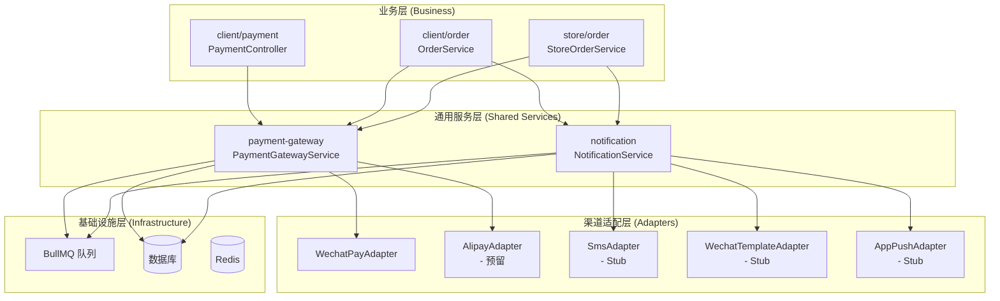
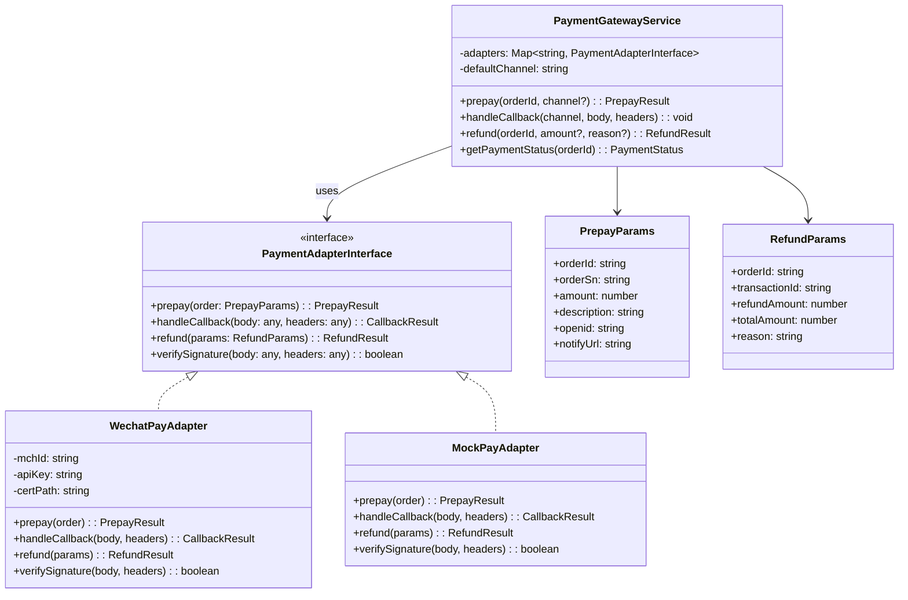
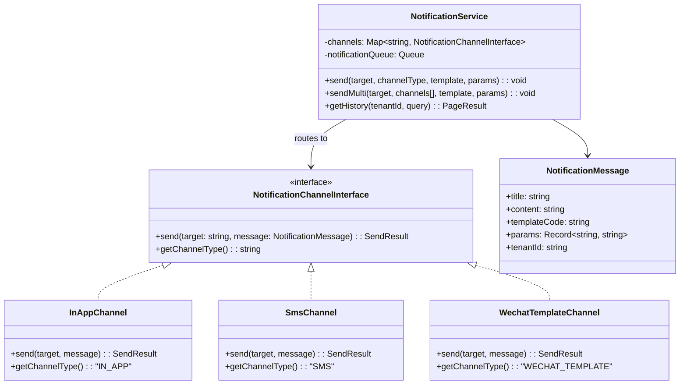
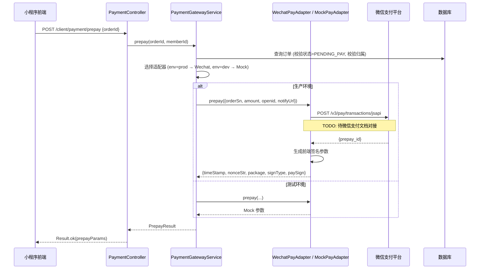
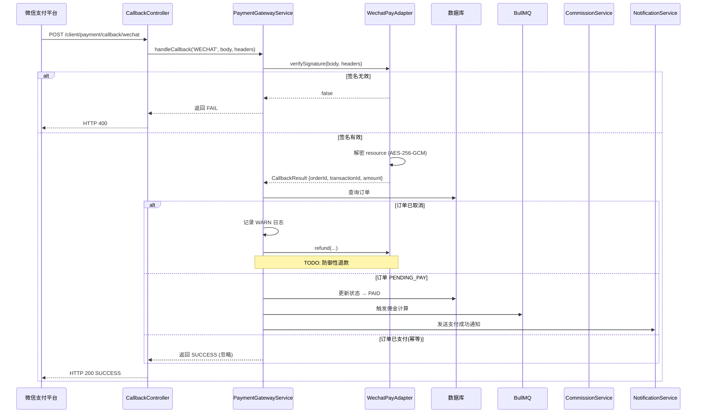
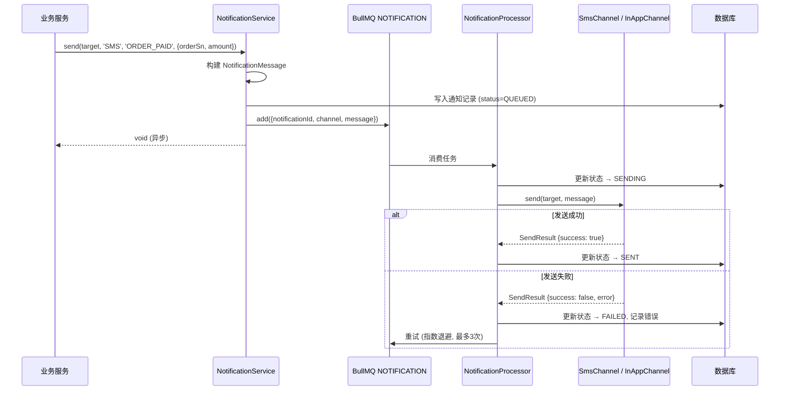

# 支付网关与通知服务模块化抽离 — 设计文档

> 版本：1.0  
> 日期：2026-02-22  
> 状态：草案  
> 关联需求：[payment-service-requirements.md](../requirements/payment-service-requirements.md)

---

## 1. 概述

### 1.1 设计目标

将支付能力和通知能力从业务代码中抽离为独立的通用服务模块，遵循"模块化设计 + 通用服务抽离"原则（参考 [后端开发经验总结](https://developer.aliyun.com/article/657562)），实现：

- 支付渠道可插拔（策略模式），当前仅实现微信支付 Stub，待文档对接后替换
- 通知渠道可扩展，统一接口屏蔽底层差异
- 业务模块通过接口调用，不直接依赖具体支付/通知实现

### 1.2 约束

- 微信支付 API 尚未对接，所有生产环境调用以 `BusinessException` 阻断，测试环境使用 Mock
- 短信 SDK（阿里云/腾讯云）尚未选型，以 Stub 日志替代
- 不引入新的中间件，复用现有 BullMQ + Redis 基础设施

---

## 2. 架构与模块

### 2.1 模块划分

> 图 1：支付与通知服务组件图



### 2.2 目录结构

```
src/module/
├── payment-gateway/                    # 支付网关通用服务 (新建)
│   ├── adapters/
│   │   ├── payment-adapter.interface.ts  # 支付渠道适配器接口
│   │   ├── wechat-pay.adapter.ts         # 微信支付适配器 (Stub → 实现)
│   │   └── mock-pay.adapter.ts           # Mock 适配器 (测试环境)
│   ├── dto/
│   │   ├── prepay.dto.ts                 # 预下单请求
│   │   ├── refund.dto.ts                 # 退款请求
│   │   └── callback.dto.ts              # 回调请求
│   ├── payment-gateway.service.ts        # 核心服务 (策略路由)
│   ├── payment-gateway.module.ts         # 模块配置
│   └── payment-gateway.md               # 模块文档
│
├── notification/                        # 通知通用服务 (新建)
│   ├── channels/
│   │   ├── notification-channel.interface.ts  # 通知渠道接口
│   │   ├── in-app.channel.ts                  # 站内信渠道
│   │   ├── sms.channel.ts                     # 短信渠道 (Stub)
│   │   ├── wechat-template.channel.ts         # 微信模板消息 (Stub)
│   │   └── app-push.channel.ts                # APP 推送 (Stub)
│   ├── dto/
│   │   └── send-notification.dto.ts
│   ├── notification.service.ts           # 核心服务
│   ├── notification.processor.ts         # BullMQ 消费者
│   ├── notification.module.ts            # 模块配置
│   └── notification.md                   # 模块文档
│
├── client/payment/                      # 现有 (瘦身为薄 Controller)
│   ├── payment.controller.ts            # 保留，调用 PaymentGatewayService
│   └── payment.service.ts               # 简化为编排层
```

> 省略部署图：当前为单体部署，支付网关和通知服务作为内部模块运行在同一 NestJS 进程中，不涉及独立部署节点。待未来微服务拆分时再补充部署图。

---

## 3. 领域/数据模型

### 3.1 支付网关

> 图 2：支付网关类图



### 3.2 通知服务

> 图 3：通知服务类图



---

## 4. 核心流程时序

### 4.1 支付预下单时序

> 图 4：预下单时序图



### 4.2 支付回调时序

> 图 5：支付回调时序图



### 4.3 通知发送时序

> 图 6：通知发送时序图



---

## 5. 状态与流程

### 5.1 支付订单状态机

已在需求文档图 5 中定义，此处补充技术实现要点：

- 状态转换通过 `OrderRepository.updateStatus()` 执行，内部使用乐观锁（`version` 字段）
- `PENDING_PAY → PAID` 转换必须在 `@Transactional(RepeatableRead)` 中执行
- `PAID → REFUNDED` 转换需先调用支付网关退款，成功后再更新状态

### 5.2 通知状态机

已在需求文档图 6 中定义，技术要点：

- BullMQ 配置 `attempts: 3, backoff: { type: 'exponential', delay: 5000 }`
- 超过重试次数的任务进入 Dead Letter Queue，由运营人工处理

---

## 6. 接口/数据约定

### 6.1 PaymentGatewayService 接口

```typescript
interface PaymentGatewayService {
  /**
   * 预下单
   * @returns 前端支付参数
   */
  prepay(orderId: string, memberId: string, channel?: string): Promise<PrepayResult>;

  /**
   * 处理支付回调
   * @param channel 支付渠道标识 ('WECHAT' | 'ALIPAY')
   * @param body 原始请求体
   * @param headers 请求头 (含签名)
   */
  handleCallback(channel: string, body: any, headers: any): Promise<void>;

  /**
   * 申请退款
   * @param orderId 订单ID
   * @param amount 退款金额 (null=全额退款)
   * @param reason 退款原因
   */
  refund(orderId: string, amount?: number, reason?: string): Promise<RefundResult>;
}
```

### 6.2 PaymentAdapterInterface 接口

```typescript
interface PaymentAdapterInterface {
  /** 渠道标识 */
  getChannel(): string;

  /** 预下单 */
  prepay(params: PrepayParams): Promise<PrepayResult>;

  /** 验证回调签名 */
  verifySignature(body: any, headers: any): boolean;

  /** 解析回调数据 */
  parseCallback(body: any, headers: any): CallbackResult;

  /** 申请退款 */
  refund(params: RefundParams): Promise<RefundResult>;
}
```

### 6.3 NotificationService 接口

```typescript
interface NotificationService {
  /**
   * 发送通知 (异步)
   * @param target 接收人标识 (memberId / phone / openid)
   * @param channel 渠道 ('IN_APP' | 'SMS' | 'WECHAT_TEMPLATE' | 'APP_PUSH')
   * @param templateCode 模板编码
   * @param params 模板参数
   */
  send(target: string, channel: string, templateCode: string, params: Record<string, string>): Promise<void>;

  /**
   * 多渠道发送
   */
  sendMulti(target: string, channels: string[], templateCode: string, params: Record<string, string>): Promise<void>;
}
```

### 6.4 数据库表（新增）

```sql
-- 支付记录表 (可选，用于对账)
CREATE TABLE pay_transaction (
  id            VARCHAR(36) PRIMARY KEY,
  order_id      VARCHAR(36) NOT NULL,
  tenant_id     VARCHAR(20) NOT NULL,
  channel       VARCHAR(20) NOT NULL COMMENT 'WECHAT / ALIPAY / MOCK',
  transaction_id VARCHAR(64) COMMENT '第三方交易号',
  amount        DECIMAL(10,2) NOT NULL,
  status        VARCHAR(20) NOT NULL COMMENT 'PENDING / SUCCESS / FAILED / REFUNDED',
  raw_data      JSON COMMENT '原始回调数据',
  create_time   DATETIME DEFAULT CURRENT_TIMESTAMP,
  update_time   DATETIME DEFAULT CURRENT_TIMESTAMP ON UPDATE CURRENT_TIMESTAMP,
  INDEX idx_order (order_id),
  INDEX idx_tenant_time (tenant_id, create_time)
);

-- 通知记录表
CREATE TABLE sys_notification (
  id            BIGINT AUTO_INCREMENT PRIMARY KEY,
  tenant_id     VARCHAR(20) NOT NULL,
  target        VARCHAR(64) NOT NULL COMMENT '接收人标识',
  channel       VARCHAR(20) NOT NULL COMMENT 'IN_APP / SMS / WECHAT_TEMPLATE / APP_PUSH',
  template_code VARCHAR(50) NOT NULL,
  title         VARCHAR(200),
  content       TEXT,
  params        JSON,
  status        VARCHAR(20) NOT NULL DEFAULT 'QUEUED' COMMENT 'QUEUED / SENDING / SENT / FAILED / DEAD',
  error_msg     VARCHAR(500),
  retry_count   INT DEFAULT 0,
  create_time   DATETIME DEFAULT CURRENT_TIMESTAMP,
  send_time     DATETIME,
  INDEX idx_tenant_time (tenant_id, create_time),
  INDEX idx_target (target, channel)
);
```

---

## 7. 实施计划

### 阶段一：接口定义 + Stub 实现（当前）

| 任务                                | 状态      | 说明                                                                       |
| ----------------------------------- | --------- | -------------------------------------------------------------------------- |
| 定义 `PaymentAdapterInterface`      | 待开发    | 策略模式接口                                                               |
| 实现 `MockPayAdapter`               | 待开发    | 复用现有 mock 逻辑                                                         |
| 实现 `WechatPayAdapter` (Stub)      | 待开发    | 所有方法抛出"未配置"异常                                                   |
| 创建 `PaymentGatewayService`        | 待开发    | 路由到对应适配器                                                           |
| 定义 `NotificationChannelInterface` | 待开发    | 通知渠道接口                                                               |
| 实现 `InAppChannel`                 | 待开发    | 复用现有 MessageService 逻辑                                               |
| 实现 `SmsChannel` (Stub)            | 待开发    | 复用现有 sendSmsStub                                                       |
| 创建 `NotificationService`          | 待开发    | 队列 + 渠道路由                                                            |
| 现有代码 TODO 标注                  | ✅ 已完成 | 已在 payment.service.ts、message.service.ts、store-order.service.ts 中标注 |

### 阶段二：微信支付对接（待文档就绪）

| 任务                                      | 依赖                  |
| ----------------------------------------- | --------------------- |
| 安装 `wechatpay-node-v3` SDK              | 微信商户号 + API 密钥 |
| 实现 `WechatPayAdapter.prepay()`          | 微信 JSAPI 文档       |
| 实现 `WechatPayAdapter.verifySignature()` | 微信平台证书          |
| 实现 `WechatPayAdapter.refund()`          | 微信退款文档          |
| 新增退款回调 Controller                   | 微信退款回调文档      |
| 集成测试 + 沙箱验证                       | 微信沙箱环境          |

### 阶段三：通知渠道对接

| 任务                            | 依赖             |
| ------------------------------- | ---------------- |
| 选型短信 SDK（阿里云 / 腾讯云） | 业务决策         |
| 实现 `SmsChannel`               | SDK 接入         |
| 实现 `WechatTemplateChannel`    | 微信模板消息文档 |
| 实现 `AppPushChannel`           | 推送 SDK 选型    |
