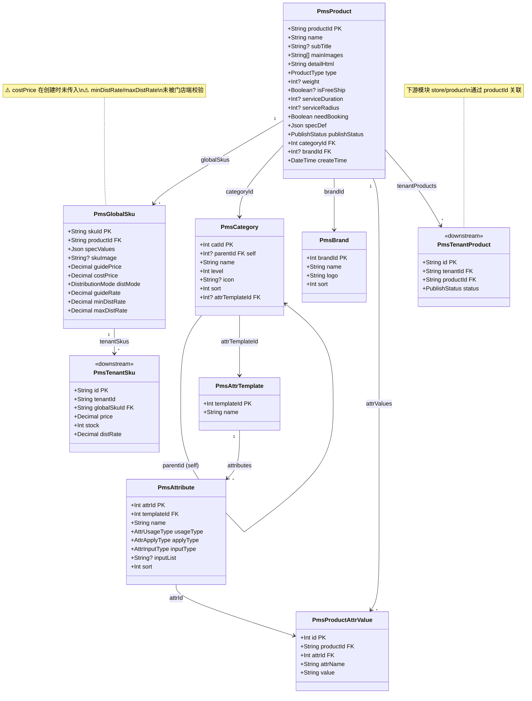
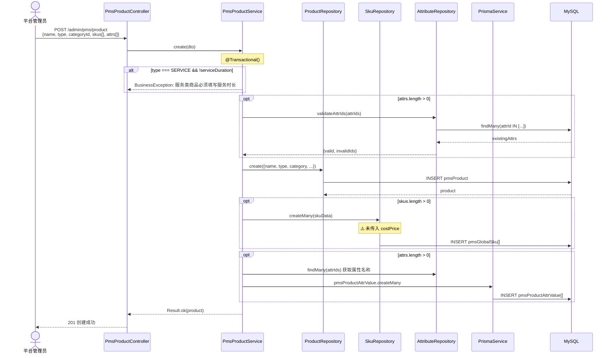
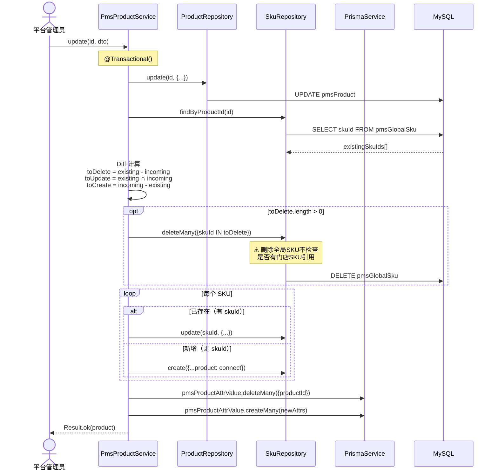
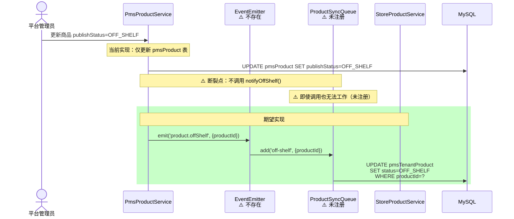
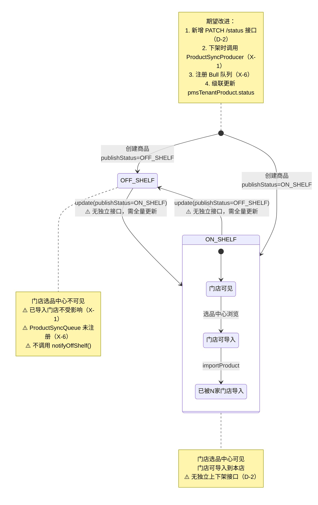
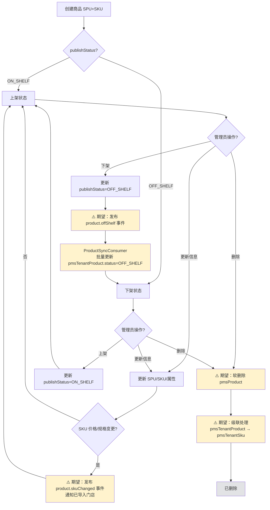
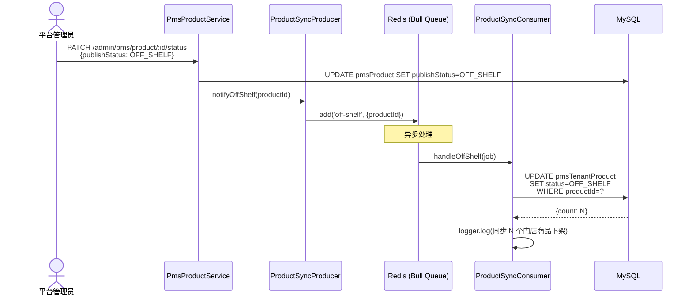
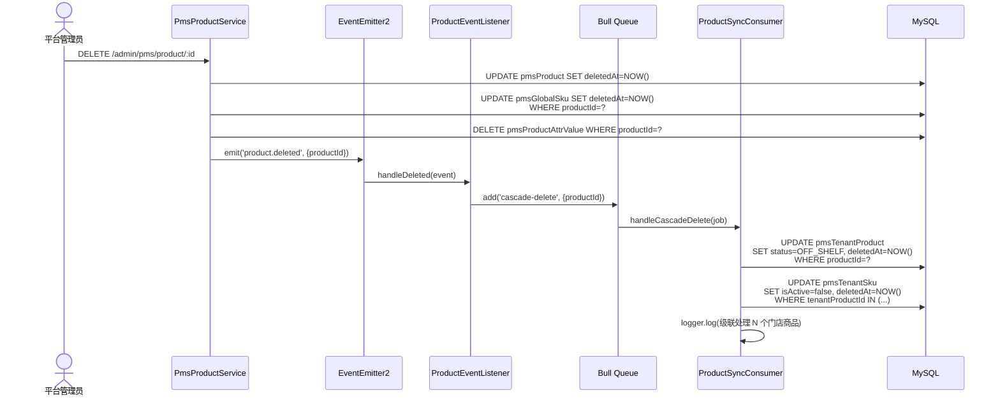

# 全局商品库管理模块（PMS）— 设计文档

> 版本：1.0
> 日期：2026-02-22
> 模块路径：`src/module/pms`
> 需求文档：[pms-requirements.md](../../../requirements/pms/pms-requirements.md)
> 关联设计：[store/product 设计文档](../store/product/product-design.md)
> 状态：现状架构分析 + 改进方案设计

---

## 1. 概述

### 1.1 设计目标

1. 完整描述 PMS 模块四个子域的技术架构、数据流和内部协作
2. 重点分析 PMS 与 `store/product` 的跨模块数据联动架构及断裂点
3. 针对需求文档中识别的 9 个自身缺陷（D-1~D-9）、6 个跨模块缺陷（X-1~X-6）和 7 个架构不足（A-1~A-7），给出具体改进方案
4. 为中长期演进（商品事件机制、删除级联、审核流程）提供技术设计

### 1.2 约束

| 约束       | 说明                                                                                      |
| ---------- | ----------------------------------------------------------------------------------------- |
| 框架       | NestJS + Prisma ORM + MySQL                                                               |
| 租户模型   | PMS 为全局共享（`getTenantWhere` 返回 `{}`），不按租户隔离                                |
| 事务       | `@Transactional()` 装饰器（CLS 上下文）                                                   |
| 缓存       | Redis，分类树使用 `@Cacheable`/`@CacheEvict` 装饰器                                       |
| 下游消费者 | `store/product`（门店选品/导入）、`store/stock`（门店库存）、`client/product`（C 端展示） |

---

## 2. 架构与模块（组件图）

> 图 1：PMS 模块及其与 store/product 的关联组件图

```mermaid
graph TB
    subgraph AdminWeb["Admin Web (前端)"]
        AW_Product[商品管理页面]
        AW_Category[分类管理页面]
        AW_Brand[品牌管理页面]
        AW_Attr[属性模板页面]
    end

    subgraph PMS["pms 模块（全局商品库）"]
        subgraph ProductDomain["商品子域"]
            PCtrl[PmsProductController<br/>4 端点]
            PSvc[PmsProductService]
            PRepo[ProductRepository]
            SRepo[SkuRepository]
        end

        subgraph CategoryDomain["分类子域"]
            CCtrl[CategoryController<br/>6 端点]
            CSvc[CategoryService<br/>@Cacheable]
            CRepo[CategoryRepository]
        end

        subgraph BrandDomain["品牌子域"]
            BCtrl[BrandController<br/>5 端点]
            BSvc[BrandService]
            BRepo[BrandRepository]
        end

        subgraph AttrDomain["属性子域"]
            ACtrl[AttributeController<br/>6 端点]
            ASvc[AttributeService]
            ARepo[AttributeRepository]
            TRepo[TemplateRepository]
        end
    end

    subgraph StoreProduct["store/product 模块（门店端）"]
        SPCtrl[StoreProductController]
        SPSvc[StoreProductService]
        PV[ProfitValidator]
        SyncQ[ProductSyncQueue<br/>⚠️ 未注册]
    end

    subgraph DataLayer["数据层"]
        Redis[(Redis<br/>分类树缓存)]
        DB_P[(pmsProduct)]
        DB_S[(pmsGlobalSku)]
        DB_C[(pmsCategory)]
        DB_B[(pmsBrand)]
        DB_AT[(pmsAttrTemplate)]
        DB_A[(pmsAttribute)]
        DB_AV[(pmsProductAttrValue)]
        DB_TP[(pmsTenantProduct)]
        DB_TS[(pmsTenantSku)]
    end

    AW_Product --> PCtrl
    AW_Category --> CCtrl
    AW_Brand --> BCtrl
    AW_Attr --> ACtrl

    PCtrl --> PSvc
    PSvc --> PRepo
    PSvc --> SRepo
    PSvc --> ARepo

    CCtrl --> CSvc
    CSvc --> CRepo
    CSvc --> Redis

    BCtrl --> BSvc
    BSvc --> BRepo

    ACtrl --> ASvc
    ASvc --> ARepo
    ASvc --> TRepo

    PRepo --> DB_P
    SRepo --> DB_S
    CRepo --> DB_C
    BRepo --> DB_B
    TRepo --> DB_AT
    ARepo --> DB_A
    PSvc -.->|PrismaService 直接| DB_AV

    SPSvc -->|查询全局商品| DB_P
    SPSvc -->|查询全局SKU| DB_S
    SPSvc -->|写入门店商品| DB_TP
    SPSvc -->|写入门店SKU| DB_TS
    SPSvc --> PV

    PSvc -.->|⚠️ 不调用| SyncQ

    style SyncQ stroke-dasharray: 5 5
```

**组件说明**：

| 子域 | 组件                | 职责                       | 规范遵循                                |
| ---- | ------------------- | -------------------------- | --------------------------------------- |
| 商品 | `PmsProductService` | SPU+SKU+属性值的事务 CRUD  | ✅ `@Transactional`、Repository 模式    |
| 分类 | `CategoryService`   | 分类树构建、Redis 缓存管理 | ✅ `@Cacheable`/`@CacheEvict`、删除校验 |
| 品牌 | `BrandService`      | 品牌 CRUD、删除引用校验    | ✅ `@Transactional`、Repository 模式    |
| 属性 | `AttributeService`  | 模板+属性项联动 CRUD       | ✅ `@Transactional`、Diff 更新          |

**跨模块断裂点**：PMS 更新商品后不发布事件，`store/product` 的 `ProductSyncQueue` 未注册且未被调用。两个模块之间无运行时通信机制。

---

## 3. 领域/数据模型（类图）

> 图 2：PMS 全局商品库完整数据模型类图



**模型层次**：`PmsCategory` → `PmsProduct`（SPU）→ `PmsGlobalSku`（SKU）→ `PmsTenantSku`（门店重写）。PMS 维护前三层，`store/product` 维护第四层。

---

## 4. 核心流程时序（时序图）

### 4.1 商品创建（事务）

> 图 3：商品创建时序图



### 4.2 商品更新（SKU Diff）

> 图 4：商品更新时序图



### 4.3 PMS → store/product 数据联动（现状 vs 期望）

> 图 5：跨模块数据联动时序图



---

## 5. 状态与流程

### 5.1 全局商品发布状态机（含跨模块影响）

> 图 6：全局商品发布状态图（含跨模块级联影响）



### 5.2 全局商品生命周期活动图（期望）

> 图 7：全局商品完整生命周期活动图（含待建设功能）



---

## 6. 部署架构（部署图）

> 图 8：PMS 模块及跨模块部署架构图

```mermaid
graph TB
    subgraph Client["客户端"]
        AdminWeb[Admin Web<br/>Vue3 + Vite]
    end

    subgraph AppServer["NestJS 应用服务器"]
        subgraph PmsModule["PmsModule（全局商品库）"]
            PmsCtrl[PmsProductController<br/>4 端点]
            CatCtrl[CategoryController<br/>6 端点]
            BrandCtrl[BrandController<br/>5 端点]
            AttrCtrl[AttributeController<br/>6 端点]
            PmsSvc[PmsProductService]
        end

        subgraph StoreProductModule["StoreProductModule（门店商品）"]
            SPCtrl[StoreProductController<br/>6 端点]
            SPSvc[StoreProductService]
            PV[ProfitValidator]
            SyncProducer[ProductSyncProducer<br/>⚠️ 未注册]
            SyncConsumer[ProductSyncConsumer<br/>⚠️ 未注册]
        end

        subgraph Planned["期望新增"]
            EventBus[EventEmitter2<br/>商品变更事件总线]
        end
    end

    subgraph DataStore["数据存储"]
        MySQL[(MySQL<br/>pmsProduct / pmsGlobalSku<br/>pmsCategory / pmsBrand<br/>pmsAttrTemplate / pmsAttribute<br/>pmsProductAttrValue<br/>pmsTenantProduct / pmsTenantSku)]
        Redis[(Redis<br/>分类树缓存<br/>Bull 队列存储)]
    end

    AdminWeb -->|HTTPS| PmsCtrl
    AdminWeb -->|HTTPS| CatCtrl
    AdminWeb -->|HTTPS| BrandCtrl
    AdminWeb -->|HTTPS| AttrCtrl
    AdminWeb -->|HTTPS| SPCtrl

    PmsSvc -->|Prisma ORM| MySQL
    SPSvc -->|Prisma ORM| MySQL
    CatCtrl -.->|@Cacheable| Redis

    PmsSvc -.->|⚠️ 期望| EventBus
    EventBus -.->|⚠️ 期望| SyncProducer
    SyncProducer -.->|⚠️ 未注册| Redis
    SyncConsumer -.->|消费队列| Redis
    SyncConsumer -.->|Prisma ORM| MySQL

    style SyncProducer stroke-dasharray: 5 5
    style SyncConsumer stroke-dasharray: 5 5
    style EventBus stroke-dasharray: 5 5
    style Planned stroke-dasharray: 5 5
```

**部署说明**：

| 组件                | 运行环境                     | 说明                                                |
| ------------------- | ---------------------------- | --------------------------------------------------- |
| PmsModule           | NestJS 主进程                | 全局商品 CRUD，分类缓存使用 Redis                   |
| StoreProductModule  | NestJS 主进程                | 门店选品/导入，依赖 PmsModule 导出的 Service        |
| ProductSyncConsumer | NestJS 主进程（Bull Worker） | ⚠️ 未注册，期望作为 Bull 队列消费者处理异步同步任务 |
| MySQL               | 独立实例                     | 存储全部 PMS 和门店商品数据                         |
| Redis               | 独立实例                     | 分类树缓存 + Bull 队列存储                          |

---

## 7. 缺陷改进方案

### 7.1 D-1：新增商品删除接口（含级联校验）

**现状**：Controller 仅有 list/detail/create/update 四个端点，无 DELETE 路由。

**改进**：

```typescript
// product.controller.ts
@ApiOperation({ summary: '删除商品' })
@RequirePermission('pms:product:delete')
@ApiBearerAuth('Authorization')
@Operlog({ businessType: BusinessType.DELETE })
@Delete(':id')
async remove(@Param('id') id: string) {
  return this.pmsProductService.remove(id);
}
```

```typescript
// product.service.ts
@Transactional()
async remove(id: string) {
  const product = await this.productRepo.findOneWithDetails(id);
  BusinessException.throwIfNull(product, '商品不存在', ResponseCode.NOT_FOUND);

  // 级联校验：检查是否有门店已导入该商品
  const tenantCount = await this.prisma.pmsTenantProduct.count({
    where: { productId: id },
  });

  BusinessException.throwIf(
    tenantCount > 0,
    `该商品已被 ${tenantCount} 家门店导入，请先通知门店移除后再删除`,
    ResponseCode.BUSINESS_ERROR,
  );

  // 删除关联数据（事务内）
  await this.prisma.pmsProductAttrValue.deleteMany({ where: { productId: id } });
  await this.skuRepo.deleteByProductId(id);
  await this.productRepo.delete(id);

  return Result.ok(null, '商品已删除');
}
```

**说明**：当前采用「硬删除 + 级联校验」策略。若有门店已导入，拒绝删除并提示门店数量。未来可改为软删除 + 事件通知门店级联处理（见 8.2 节）。

**工时**：2h

### 7.2 D-2：新增独立上下架接口 + 调用 ProductSyncProducer

**现状**：上下架需通过完整的 `update` 接口传入所有字段。PMS 下架不通知门店（X-1）。

**改进**：

```typescript
// product.controller.ts
@ApiOperation({ summary: '更新商品发布状态（上下架）' })
@RequirePermission('pms:product:update')
@ApiBearerAuth('Authorization')
@Operlog({ businessType: BusinessType.UPDATE })
@Patch(':id/status')
async updateStatus(
  @Param('id') id: string,
  @Body() dto: UpdateProductStatusDto,
) {
  return this.pmsProductService.updateStatus(id, dto);
}
```

```typescript
// dto/update-product-status.dto.ts
import { IsEnum } from 'class-validator';
import { ApiProperty } from '@nestjs/swagger';
import { PublishStatus } from '@prisma/client';

export class UpdateProductStatusDto {
  @ApiProperty({ enum: PublishStatus, description: '发布状态' })
  @IsEnum(PublishStatus)
  publishStatus: PublishStatus;
}
```

```typescript
// product.service.ts
async updateStatus(id: string, dto: UpdateProductStatusDto) {
  const product = await this.productRepo.findById(id);
  BusinessException.throwIfNull(product, '商品不存在', ResponseCode.NOT_FOUND);

  // 状态未变更，直接返回
  if (product.publishStatus === dto.publishStatus) {
    return Result.ok(product);
  }

  const updated = await this.productRepo.update(id, {
    publishStatus: dto.publishStatus,
  });

  // 下架时通知已导入门店（解决 X-1）
  if (dto.publishStatus === 'OFF_SHELF') {
    await this.productSyncProducer.notifyOffShelf(id);
  }

  return Result.ok(updated);
}
```

**前置依赖**：

1. `PmsModule` 需导入 `StoreProductModule`（或单独导入 `ProductSyncProducer`）
2. `StoreProductModule` 需注册 Bull 队列（见 7.6 节 X-6 修复）

**工时**：1.5h（含 DTO 创建 + 路由注册 + 事件调用）

### 7.3 D-3：创建 `UpdateProductDto`

**现状**：`update` 方法复用 `CreateProductDto`，所有字段均为必填。

**改进**：

```typescript
// dto/update-product.dto.ts
import { PartialType } from '@nestjs/swagger';
import { CreateProductDto } from './create-product.dto';

export class UpdateProductDto extends PartialType(CreateProductDto) {}
```

```typescript
// product.controller.ts — 修改 update 方法签名
@Put(':id')
async update(@Param('id') id: string, @Body() dto: UpdateProductDto) {
  return this.pmsProductService.update(id, dto);
}
```

```typescript
// product.service.ts — update 方法适配部分更新
@Transactional()
async update(id: string, dto: UpdateProductDto) {
  // 仅校验传入的字段
  if (dto.type === ProductType.SERVICE && dto.serviceDuration === undefined) {
    const existing = await this.productRepo.findById(id);
    BusinessException.throwIf(
      !existing?.serviceDuration,
      '服务类商品必须填写服务时长',
      ResponseCode.PARAM_INVALID,
    );
  }

  // 构建更新数据（仅包含传入的字段）
  const updateData: any = {};
  if (dto.name !== undefined) updateData.name = dto.name;
  if (dto.subTitle !== undefined) updateData.subTitle = dto.subTitle;
  if (dto.mainImages !== undefined) updateData.mainImages = dto.mainImages;
  if (dto.detailHtml !== undefined) updateData.detailHtml = dto.detailHtml;
  if (dto.type !== undefined) updateData.type = dto.type;
  if (dto.publishStatus !== undefined) updateData.publishStatus = dto.publishStatus;
  if (dto.categoryId !== undefined) updateData.category = { connect: { catId: dto.categoryId } };
  if (dto.brandId !== undefined) updateData.brand = { connect: { brandId: dto.brandId } };
  // ... 其他字段同理

  const product = await this.productRepo.update(id, updateData);

  // SKU 和属性值仅在传入时更新
  if (dto.skus !== undefined) {
    await this.updateSkus(id, dto.skus);
  }
  if (dto.attrs !== undefined) {
    await this.updateAttrValues(id, dto.attrs);
  }

  return Result.ok(product);
}
```

**工时**：1h

### 7.4 D-4：SKU 创建时传入 `costPrice`

**现状**：`createSkus` 方法中未传入 `costPrice`，导致 `pmsGlobalSku.costPrice` 为 null/0。

**改进**：

```typescript
// product.service.ts — createSkus 方法
private async createSkus(productId: string, skus: any[]) {
  const skuData = skus.map((sku: any) => ({
    productId,
    specValues: sku.specValues || {},
    skuImage: sku.skuImage,
    guidePrice: sku.guidePrice,
    costPrice: sku.costPrice,       // ✅ 新增：传入成本价
    distMode: sku.distMode,
    guideRate: sku.guideRate,
    minDistRate: sku.minDistRate,
    maxDistRate: sku.maxDistRate,
  }));

  await this.skuRepo.createMany(skuData);
}
```

同时需在 `CreateSkuDto` 中添加 `costPrice` 字段：

```typescript
// dto/create-sku.dto.ts
@ApiProperty({ description: '成本价（元）', example: 50.00 })
@IsNumber()
@Min(0)
costPrice: number;
```

**影响范围**：修复后，门店导入时 `ProfitValidator.validate()` 的 `costPrice` 参数将有正确值，利润校验恢复有效。

**工时**：0.5h

### 7.5 D-9：所有 Controller 添加 `@ApiBearerAuth`

**现状**：`PmsProductController`、`AttributeController`、`CategoryController`、`BrandController` 均缺少 `@ApiBearerAuth('Authorization')`。

**改进**：

```typescript
// product.controller.ts
@ApiTags('商品管理')
@Controller('admin/pms/product')
@ApiBearerAuth('Authorization')  // ✅ 新增
export class PmsProductController { ... }

// attribute.controller.ts
@ApiTags('属性管理')
@Controller('admin/pms/attribute')
@ApiBearerAuth('Authorization')  // ✅ 新增
export class AttributeController { ... }

// category.controller.ts
@ApiTags('分类管理')
@Controller('admin/pms/category')
@ApiBearerAuth('Authorization')  // ✅ 新增
export class CategoryController { ... }

// brand.controller.ts
@ApiTags('品牌管理')
@Controller('admin/pms/brand')
@ApiBearerAuth('Authorization')  // ✅ 新增
export class BrandController { ... }
```

**工时**：0.5h

### 7.6 X-1 + X-6：商品下架联动修复（端到端）

**现状**：PMS 下架商品不通知门店（X-1），且 `ProductSyncProducer`/`Consumer` 未在 Module 注册（X-6）。

**修复步骤**：

**步骤 1**：在 `store/product` 的 Module 中注册 Bull 队列

```typescript
// store/product/product.module.ts
import { BullModule } from '@nestjs/bull';
import { ProductSyncProducer, ProductSyncConsumer, PRODUCT_SYNC_QUEUE } from './product-sync.queue';

@Module({
  imports: [BullModule.registerQueue({ name: PRODUCT_SYNC_QUEUE })],
  providers: [
    // ... 现有 providers
    ProductSyncProducer,
    ProductSyncConsumer,
  ],
  exports: [
    StoreProductService,
    ProductSyncProducer, // ✅ 导出供 PMS 模块使用
  ],
})
export class StoreProductModule {}
```

**步骤 2**：`PmsModule` 导入 `StoreProductModule` 并注入 `ProductSyncProducer`

```typescript
// pms.module.ts
import { StoreProductModule } from '../store/product/product.module';

@Module({
  imports: [CategoryModule, BrandModule, StoreProductModule],
  // ...
})
export class PmsModule {}
```

```typescript
// product.service.ts — 注入 ProductSyncProducer
constructor(
  private readonly productRepo: ProductRepository,
  private readonly skuRepo: SkuRepository,
  private readonly attrRepo: AttributeRepository,
  private readonly prisma: PrismaService,
  private readonly productSyncProducer: ProductSyncProducer,  // ✅ 新增
) {}
```

**步骤 3**：在 `updateStatus` 中调用（已在 7.2 节实现）

**端到端流程**：



**工时**：2h（含 Module 注册 + 依赖注入 + 联调测试）

### 7.7 X-5：门店导入时校验 `distRate` 在 `minDistRate`~`maxDistRate` 范围内

**现状**：`store/product` 的 `importProduct` 中调用 `ProfitValidator.validate()` 校验利润，但不校验门店设置的 `distRate` 是否在全局 SKU 定义的 `minDistRate`~`maxDistRate` 范围内。

**改进**：在 `ProfitValidator` 中新增分销费率范围校验方法：

```typescript
// profit-validator.ts — 新增方法
/**
 * 校验分销费率是否在全局 SKU 定义的范围内
 *
 * @param distRate - 门店设置的分销费率
 * @param minDistRate - 全局 SKU 最低分销费率
 * @param maxDistRate - 全局 SKU 最高分销费率
 * @param distMode - 分销模式
 */
validateDistRateRange(
  distRate: number,
  minDistRate: Decimal,
  maxDistRate: Decimal,
  distMode: DistributionMode,
): void {
  // NONE 模式不校验
  if (distMode === DistributionMode.NONE) return;

  const rate = new Decimal(distRate);

  if (minDistRate && rate.lessThan(minDistRate)) {
    throw new BusinessException(
      ResponseCode.PARAM_INVALID,
      `分销费率 ${distRate} 低于总部最低限制 ${minDistRate.toFixed(4)}`,
    );
  }

  if (maxDistRate && rate.greaterThan(maxDistRate)) {
    throw new BusinessException(
      ResponseCode.PARAM_INVALID,
      `分销费率 ${distRate} 超过总部最高限制 ${maxDistRate.toFixed(4)}`,
    );
  }
}
```

在 `importProduct` 中调用：

```typescript
// store/product/product.service.ts — importProduct 中增加校验
for (const sku of skus) {
  const globalSku = globalProduct.globalSkus.find((g) => g.skuId === sku.globalSkuId);
  if (globalSku) {
    // 现有：利润校验
    this.profitValidator.validate(
      sku.price,
      globalSku.costPrice,
      sku.distRate || 0,
      sku.distMode || DistributionMode.RATIO,
    );

    // ✅ 新增：分销费率范围校验
    this.profitValidator.validateDistRateRange(
      sku.distRate || 0,
      globalSku.minDistRate,
      globalSku.maxDistRate,
      sku.distMode || DistributionMode.RATIO,
    );
  }
}
```

**工时**：1h

---

## 8. 架构改进方案

### 8.1 A-1 + X-1：商品变更事件机制设计

**现状**：PMS 商品变更（创建/更新/上下架/删除）无事件发布机制，下游模块无法感知变更。

**方案**：引入 `@nestjs/event-emitter`（EventEmitter2）作为进程内事件总线，结合 Bull 队列实现异步处理。

**事件定义**：

```typescript
// pms/events/product.events.ts
export enum ProductEventType {
  CREATED = 'product.created',
  UPDATED = 'product.updated',
  STATUS_CHANGED = 'product.statusChanged',
  SKU_CHANGED = 'product.skuChanged',
  DELETED = 'product.deleted',
}

export class ProductEvent {
  constructor(
    public readonly type: ProductEventType,
    public readonly productId: string,
    public readonly payload: Record<string, any>,
    public readonly timestamp: Date = new Date(),
  ) {}
}

export class ProductStatusChangedEvent extends ProductEvent {
  constructor(
    productId: string,
    public readonly oldStatus: string,
    public readonly newStatus: string,
  ) {
    super(ProductEventType.STATUS_CHANGED, productId, { oldStatus, newStatus });
  }
}

export class ProductSkuChangedEvent extends ProductEvent {
  constructor(
    productId: string,
    public readonly changedSkuIds: string[],
    public readonly deletedSkuIds: string[],
  ) {
    super(ProductEventType.SKU_CHANGED, productId, { changedSkuIds, deletedSkuIds });
  }
}
```

**事件发布（PMS 侧）**：

```typescript
// product.service.ts
import { EventEmitter2 } from '@nestjs/event-emitter';

constructor(
  // ... 现有依赖
  private readonly eventEmitter: EventEmitter2,
) {}

async updateStatus(id: string, dto: UpdateProductStatusDto) {
  const product = await this.productRepo.findById(id);
  const oldStatus = product.publishStatus;

  const updated = await this.productRepo.update(id, {
    publishStatus: dto.publishStatus,
  });

  // 发布状态变更事件
  this.eventEmitter.emit(
    ProductEventType.STATUS_CHANGED,
    new ProductStatusChangedEvent(id, oldStatus, dto.publishStatus),
  );

  return Result.ok(updated);
}
```

**事件消费（store/product 侧）**：

```typescript
// store/product/listeners/product-event.listener.ts
import { OnEvent } from '@nestjs/event-emitter';
import { Injectable, Logger } from '@nestjs/common';
import {
  ProductEventType,
  ProductStatusChangedEvent,
  ProductSkuChangedEvent,
} from 'src/module/pms/events/product.events';
import { ProductSyncProducer } from '../product-sync.queue';

@Injectable()
export class ProductEventListener {
  private readonly logger = new Logger(ProductEventListener.name);

  constructor(private readonly syncProducer: ProductSyncProducer) {}

  @OnEvent(ProductEventType.STATUS_CHANGED)
  async handleStatusChanged(event: ProductStatusChangedEvent) {
    if (event.newStatus === 'OFF_SHELF') {
      this.logger.log(`全局商品 ${event.productId} 下架，触发门店同步`);
      await this.syncProducer.notifyOffShelf(event.productId);
    }
  }

  @OnEvent(ProductEventType.SKU_CHANGED)
  async handleSkuChanged(event: ProductSkuChangedEvent) {
    this.logger.log(
      `全局商品 ${event.productId} SKU 变更: changed=${event.changedSkuIds.length}, deleted=${event.deletedSkuIds.length}`,
    );
    // 未来：通知门店 SKU 价格/规格变更
  }
}
```

**架构图**：

```mermaid
graph LR
    subgraph PMS["PMS 模块"]
        PSvc[PmsProductService]
    end

    subgraph EventBus["事件总线"]
        EE[EventEmitter2]
    end

    subgraph StoreProduct["store/product 模块"]
        Listener[ProductEventListener]
        Producer[ProductSyncProducer]
        Queue[(Bull Queue<br/>product-sync)]
        Consumer[ProductSyncConsumer]
    end

    subgraph DB["数据层"]
        MySQL[(MySQL)]
    end

    PSvc -->|emit| EE
    EE -->|@OnEvent| Listener
    Listener --> Producer
    Producer --> Queue
    Queue --> Consumer
    Consumer --> MySQL
```

**优势**：PMS 模块不直接依赖 `store/product`，通过事件解耦。未来新增下游消费者（如 `client/product` 缓存刷新）只需添加 Listener，无需修改 PMS 代码。

**工时**：2-3d

### 8.2 X-3 + D-1：商品删除级联设计

**现状**：无删除接口（D-1），且若未来实现删除，需处理 `pmsTenantProduct` 和 `pmsTenantSku` 的级联清理。

**方案**：分两阶段实现。

**阶段 1（短期）**：硬删除 + 级联校验（已在 7.1 节实现），有门店导入时拒绝删除。

**阶段 2（中期）**：软删除 + 事件通知 + 门店级联处理。



**工时**：2-3d

### 8.3 A-3：商品导入/导出（Excel）

**方案**：使用 `exceljs` 库实现 Excel 导入/导出。

**导出**：

```typescript
// pms/product-excel.service.ts
@Injectable()
export class ProductExcelService {
  constructor(
    private readonly productRepo: ProductRepository,
    private readonly skuRepo: SkuRepository,
  ) {}

  async exportProducts(query: ListProductDto): Promise<Buffer> {
    const products = await this.productRepo.findAllForExport(query);

    const workbook = new ExcelJS.Workbook();
    const sheet = workbook.addWorksheet('商品列表');

    sheet.columns = [
      { header: '商品ID', key: 'productId', width: 20 },
      { header: '商品名称', key: 'name', width: 30 },
      { header: '分类', key: 'categoryName', width: 15 },
      { header: '品牌', key: 'brandName', width: 15 },
      { header: '类型', key: 'type', width: 10 },
      { header: '发布状态', key: 'publishStatus', width: 10 },
      { header: 'SKU数量', key: 'skuCount', width: 10 },
      { header: '最低指导价', key: 'minGuidePrice', width: 12 },
      { header: '创建时间', key: 'createTime', width: 20 },
    ];

    products.forEach((p) => sheet.addRow(p));

    return workbook.xlsx.writeBuffer() as Promise<Buffer>;
  }
}
```

**导入**：

```typescript
async importProducts(file: Buffer): Promise<{ success: number; failed: { row: number; reason: string }[] }> {
  const workbook = new ExcelJS.Workbook();
  await workbook.xlsx.load(file);
  const sheet = workbook.getWorksheet('商品列表');

  const results = { success: 0, failed: [] };

  sheet.eachRow((row, rowNumber) => {
    if (rowNumber === 1) return; // 跳过表头
    try {
      // 解析行数据 → CreateProductDto → 调用 create()
      results.success++;
    } catch (error) {
      results.failed.push({ row: rowNumber, reason: getErrorMessage(error) });
    }
  });

  return results;
}
```

**接口**：

| 接口     | 方法 | 路径                          | 说明              |
| -------- | ---- | ----------------------------- | ----------------- |
| 导出商品 | GET  | `/admin/pms/product/export`   | 返回 Excel 文件流 |
| 导入商品 | POST | `/admin/pms/product/import`   | 上传 Excel 文件   |
| 下载模板 | GET  | `/admin/pms/product/template` | 下载导入模板      |

**限制**：单次导入最多 500 行，超过需分批。导入为异步任务（Bull 队列），完成后通过消息通知。

**工时**：2-3d

### 8.4 X-4：PmsModule 导出 Repository

**现状**：`PmsModule` 仅导出 `PmsProductService`，不导出 Repository。

**改进**：

```typescript
// pms.module.ts
@Module({
  imports: [CategoryModule, BrandModule],
  controllers: [PmsProductController, AttributeController],
  providers: [
    PmsProductService,
    ProductRepository,
    SkuRepository,
    AttributeService,
    AttributeRepository,
    TemplateRepository,
  ],
  exports: [
    PmsProductService,
    ProductRepository, // ✅ 新增导出
    SkuRepository, // ✅ 新增导出
  ],
})
export class PmsModule {}
```

**影响**：`store/product` 可通过注入 `ProductRepository` 和 `SkuRepository` 查询全局商品，无需直接使用 `PrismaService` 操作 PMS 表。

**工时**：0.5h

---

## 9. 接口/数据约定

### 9.1 现有接口约定

| 接口           | 方法            | 路径                                   | 租户类型     | QPS 档位 | 大表             |
| -------------- | --------------- | -------------------------------------- | ------------ | -------- | ---------------- |
| 商品列表       | GET             | `/admin/pms/product/list`              | PlatformOnly | 低       | 否               |
| 商品详情       | GET             | `/admin/pms/product/:id`               | PlatformOnly | 低       | 否               |
| 创建商品       | POST            | `/admin/pms/product`                   | PlatformOnly | 低       | 否               |
| 更新商品       | PUT             | `/admin/pms/product/:id`               | PlatformOnly | 低       | 否               |
| 分类树         | GET             | `/admin/pms/category/tree`             | PlatformOnly | 中       | 否（Redis 缓存） |
| 分类列表       | GET             | `/admin/pms/category/list`             | PlatformOnly | 低       | 否               |
| 创建分类       | POST            | `/admin/pms/category`                  | PlatformOnly | 低       | 否               |
| 更新分类       | PUT             | `/admin/pms/category/:id`              | PlatformOnly | 低       | 否               |
| 删除分类       | DELETE          | `/admin/pms/category/:id`              | PlatformOnly | 低       | 否               |
| 品牌列表       | GET             | `/admin/pms/brand/list`                | PlatformOnly | 低       | 否               |
| 品牌 CRUD      | POST/PUT/DELETE | `/admin/pms/brand[/:id]`               | PlatformOnly | 低       | 否               |
| 模板列表       | GET             | `/admin/pms/attribute/template/list`   | PlatformOnly | 低       | 否               |
| 模板 CRUD      | POST/PUT/DELETE | `/admin/pms/attribute/template[/:id]`  | PlatformOnly | 低       | 否               |
| 按分类获取属性 | GET             | `/admin/pms/attribute/category/:catId` | PlatformOnly | 低       | 否               |

**说明**：PMS 模块所有接口均为 PlatformOnly（全局共享，不按租户隔离），仅平台管理员可操作。`getTenantWhere` 返回 `{}`。

### 9.2 提议新增接口

| 接口         | 方法   | 路径                            | 说明                  | 优先级 | 对应缺陷 |
| ------------ | ------ | ------------------------------- | --------------------- | ------ | -------- |
| 删除商品     | DELETE | `/admin/pms/product/:id`        | 级联校验 + 删除       | P1     | D-1      |
| 更新发布状态 | PATCH  | `/admin/pms/product/:id/status` | 独立上下架 + 通知门店 | P0     | D-2, X-1 |
| 导出商品     | GET    | `/admin/pms/product/export`     | Excel 导出            | P2     | A-3      |
| 导入商品     | POST   | `/admin/pms/product/import`     | Excel 导入（异步）    | P2     | A-3      |
| 下载导入模板 | GET    | `/admin/pms/product/template`   | Excel 模板下载        | P2     | A-3      |

### 9.3 跨模块数据契约

| 数据流向                     | 源表                       | 目标表                                      | 关联字段      | 同步方式               | 现状             |
| ---------------------------- | -------------------------- | ------------------------------------------- | ------------- | ---------------------- | ---------------- |
| PMS → store/product          | `pmsProduct`               | `pmsTenantProduct`                          | `productId`   | 门店手动导入           | ✅ 正常          |
| PMS → store/product          | `pmsGlobalSku`             | `pmsTenantSku`                              | `globalSkuId` | 门店手动导入           | ✅ 正常          |
| PMS 下架 → store/product     | `pmsProduct.publishStatus` | `pmsTenantProduct.status`                   | `productId`   | ⚠️ 期望：Bull 队列异步 | ❌ 未联通        |
| PMS SKU 变更 → store/product | `pmsGlobalSku.*`           | `pmsTenantSku.*`                            | `globalSkuId` | ⚠️ 期望：事件通知      | ❌ 未实现        |
| PMS 删除 → store/product     | `pmsProduct`               | `pmsTenantProduct` + `pmsTenantSku`         | `productId`   | ⚠️ 期望：级联软删除    | ❌ 无删除功能    |
| store/product → PMS          | `pmsTenantSku.distRate`    | 校验 `pmsGlobalSku.minDistRate~maxDistRate` | `globalSkuId` | ⚠️ 期望：导入时校验    | ❌ 未校验（X-5） |

---

## 10. 改进优先级总览

| 优先级 | 编号 | 改进项                                   | 工时 | 对应缺陷/不足 | 依赖     |
| ------ | ---- | ---------------------------------------- | ---- | ------------- | -------- |
| P0     | I-1  | 新增独立上下架接口 + 通知门店下架        | 1.5h | D-2, X-1      | I-5      |
| P0     | I-2  | 注册 Bull 队列（store/product Module）   | 1h   | X-6           | —        |
| P1     | I-3  | SKU 创建时传入 `costPrice`               | 0.5h | D-4           | —        |
| P1     | I-4  | 门店导入时校验 `distRate` 范围           | 1h   | X-5           | —        |
| P1     | I-5  | 商品变更事件机制（EventEmitter2 + Bull） | 2-3d | A-1, X-1      | I-2      |
| P1     | I-6  | 新增商品删除接口（含级联校验）           | 2h   | D-1           | —        |
| P1     | I-7  | 创建 `UpdateProductDto`（PartialType）   | 1h   | D-3           | —        |
| P1     | I-8  | `PmsModule` 导出 Repository              | 0.5h | X-4           | —        |
| P2     | I-9  | 所有 Controller 添加 `@ApiBearerAuth`    | 0.5h | D-9           | —        |
| P2     | I-10 | 商品列表价格改为 `MIN(guidePrice)`       | 0.5h | D-5           | —        |
| P2     | I-11 | 商品删除级联设计（软删除 + 事件通知）    | 2-3d | X-3           | I-5, I-6 |
| P2     | I-12 | 商品导入/导出（Excel）                   | 2-3d | A-3           | —        |
| P2     | I-13 | 品牌名称唯一性校验                       | 0.5h | A-7           | —        |
| P2     | I-14 | 分类层级自动计算                         | 1h   | A-6           | —        |
| P3     | I-15 | 商品审核流程（草稿→审核→发布）           | 3-5d | A-2           | —        |
| P3     | I-16 | 商品版本管理                             | 3-5d | A-4           | —        |
| P3     | I-17 | 商品标签/分组                            | 2-3d | A-5           | —        |

**实施路线**：

1. 第 1 周：I-2（注册队列）→ I-1（上下架接口）→ I-3（costPrice）→ I-4（distRate 校验）→ I-7（UpdateDto）→ I-8（导出 Repo）→ I-9（ApiBearerAuth）→ I-10（MIN 价格）
2. 第 2-3 周：I-5（事件机制）→ I-6（删除接口）→ I-11（删除级联）
3. 第 4 周：I-12（Excel 导入导出）→ I-13（品牌唯一性）→ I-14（分类层级）
4. 后续迭代：I-15 ~ I-17（审核流程、版本管理、标签分组）
