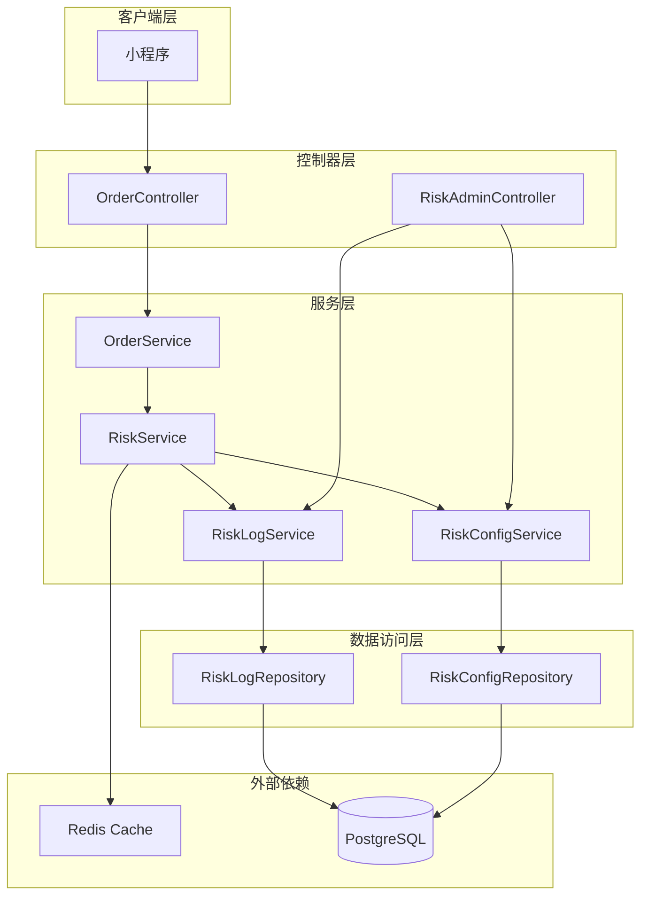
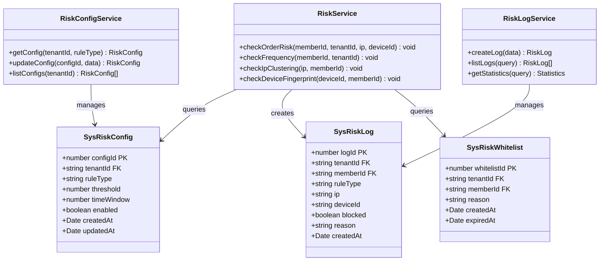
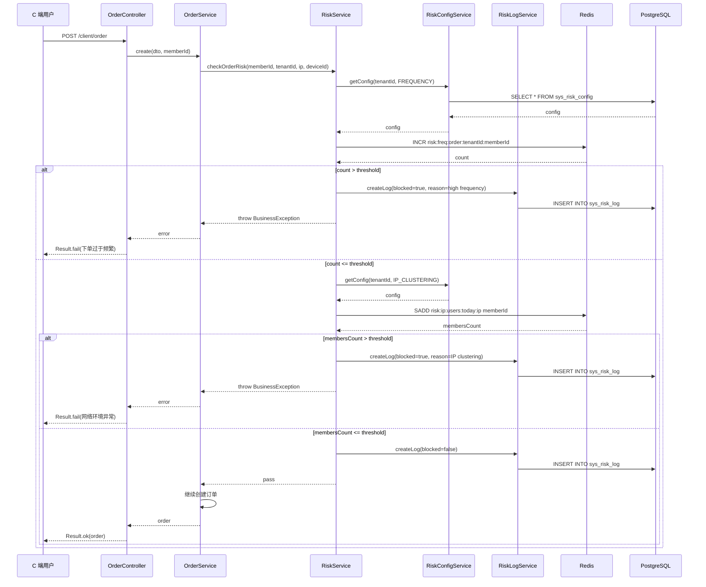
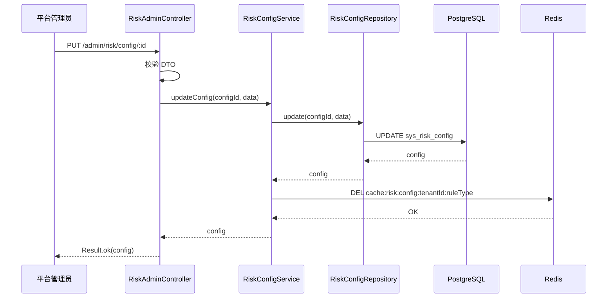
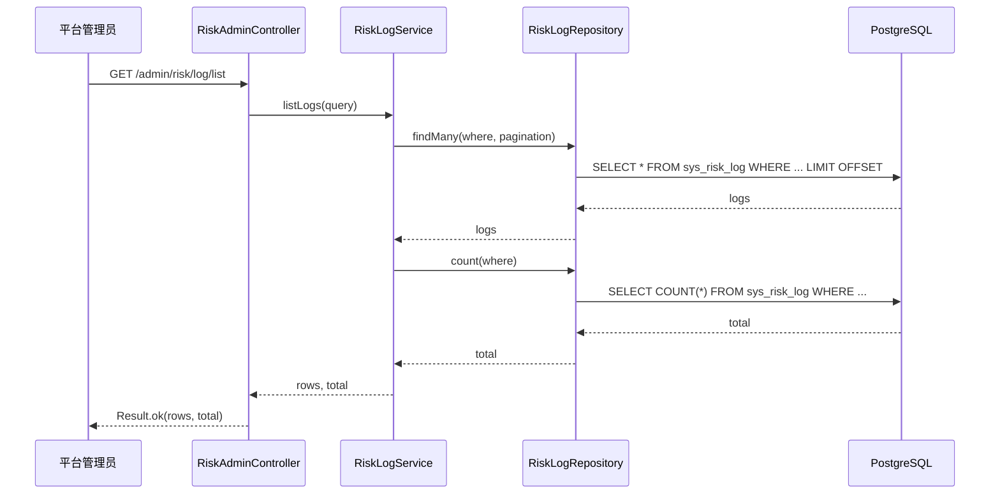
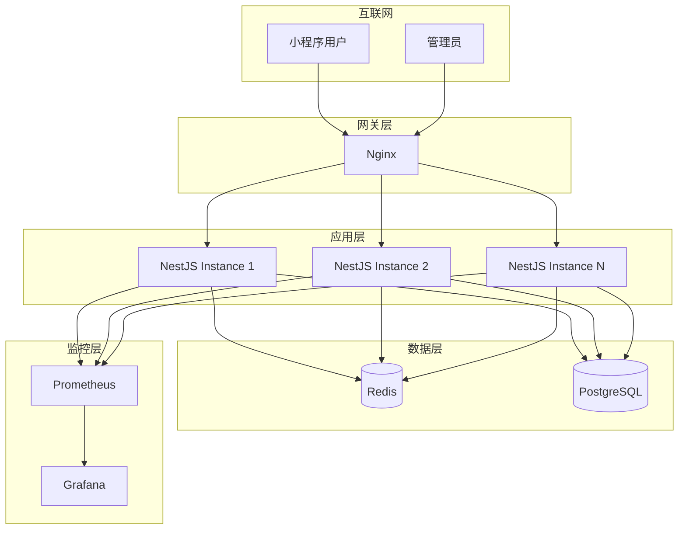

# Risk（风控）模块 — 设计文档

> 版本：1.0
> 日期：2026-02-22
> 模块路径：`src/module/risk/`
> 需求文档：[risk-requirements.md](../../requirements/risk/risk-requirements.md)
> 状态：技术方案 + 改进设计

---

## 1. 设计目标与约束

### 1.1 设计目标

1. 提供高性能的风控检测能力（P95 < 50ms）
2. 支持动态配置风控规则
3. 支持多租户隔离的风控策略
4. 提供风控日志查询和统计分析
5. 支持风控降级和容错
6. 保证风控检测的准确性和实时性

### 1.2 技术约束

| 约束项 | 说明                             |
| ------ | -------------------------------- |
| 缓存   | Redis（风控计数器、用户集合）    |
| 数据库 | PostgreSQL（风控规则、风控日志） |
| 性能   | P95 < 50ms（不影响订单创建性能） |
| 容错   | Redis 故障时降级放行             |
| 并发   | 支持高并发下单场景               |

### 1.3 性能目标

| 指标         | 目标值     | 说明                |
| ------------ | ---------- | ------------------- |
| 风控检测     | P95 < 50ms | 含 Redis 查询       |
| 规则配置查询 | P95 < 10ms | 使用缓存            |
| 日志写入     | 异步       | 不阻塞主流程        |
| 并发支持     | > 1000 QPS | 使用 Redis 原子操作 |

---

## 2. 架构设计

### 2.1 架构组件图

> 图 1：Risk 模块架构组件图



**架构说明**：

1. 控制器层：OrderController 调用风控检测，RiskAdminController 提供配置接口
2. 服务层：RiskService 执行风控检测，RiskConfigService 管理规则配置
3. 数据访问层：Repository 模式访问数据库
4. 外部依赖：Redis 存储风控计数器，PostgreSQL 存储规则和日志

---

## 3. 数据模型设计

### 3.1 数据模型类图

> 图 2：Risk 模块数据模型类图



### 3.2 核心表结构

#### 3.2.1 sys_risk_config（风控规则配置表）

| 字段        | 类型        | 说明                                                     | 索引  |
| ----------- | ----------- | -------------------------------------------------------- | ----- |
| config_id   | SERIAL      | 主键                                                     | PK    |
| tenant_id   | VARCHAR(50) | 租户 ID（NULL 表示全局规则）                             | INDEX |
| rule_type   | VARCHAR(50) | 规则类型（FREQUENCY, IP_CLUSTERING, DEVICE_FINGERPRINT） | INDEX |
| threshold   | INTEGER     | 阈值                                                     | -     |
| time_window | INTEGER     | 时间窗口（秒）                                           | -     |
| enabled     | BOOLEAN     | 是否启用                                                 | -     |
| created_at  | TIMESTAMP   | 创建时间                                                 | -     |
| updated_at  | TIMESTAMP   | 更新时间                                                 | -     |

**关键设计**：

1. `tenant_id` 为 NULL 表示全局规则，非 NULL 表示租户规则
2. 租户规则优先级高于全局规则
3. `rule_type` 使用枚举值，便于扩展新规则

#### 3.2.2 sys_risk_log（风控日志表）

| 字段       | 类型         | 说明     | 索引  |
| ---------- | ------------ | -------- | ----- |
| log_id     | SERIAL       | 主键     | PK    |
| tenant_id  | VARCHAR(50)  | 租户 ID  | INDEX |
| member_id  | VARCHAR(50)  | 会员 ID  | INDEX |
| rule_type  | VARCHAR(50)  | 规则类型 | INDEX |
| ip         | VARCHAR(50)  | IP 地址  | INDEX |
| device_id  | VARCHAR(100) | 设备 ID  | INDEX |
| blocked    | BOOLEAN      | 是否拦截 | INDEX |
| reason     | TEXT         | 拦截原因 | -     |
| created_at | TIMESTAMP    | 创建时间 | INDEX |

**关键设计**：

1. 记录所有风控检测结果（包括通过和拦截）
2. 支持按租户、会员、规则类型、时间查询
3. 使用异步写入，不阻塞主流程

#### 3.2.3 sys_risk_whitelist（风控白名单表）

| 字段         | 类型         | 说明       | 索引  |
| ------------ | ------------ | ---------- | ----- |
| whitelist_id | SERIAL       | 主键       | PK    |
| tenant_id    | VARCHAR(50)  | 租户 ID    | INDEX |
| member_id    | VARCHAR(50)  | 会员 ID    | INDEX |
| reason       | VARCHAR(255) | 白名单原因 | -     |
| created_at   | TIMESTAMP    | 创建时间   | -     |
| expired_at   | TIMESTAMP    | 过期时间   | INDEX |

**关键设计**：

1. 白名单用户跳过所有风控检测
2. 支持设置过期时间
3. 使用联合索引 `(tenant_id, member_id, expired_at)` 提升查询性能

---

## 4. 核心流程设计

### 4.1 订单风控检测流程时序图

> 图 3：订单风控检测时序图



**关键设计**：

1. 风控检测在订单创建前执行
2. 按规则优先级依次检测（高频 → IP 聚集 → 设备指纹）
3. 任一规则触发，立即拦截并记录日志
4. 所有检测通过后，记录通过日志

### 4.2 风控规则配置流程时序图

> 图 4：风控规则配置时序图



**关键设计**：

1. 规则配置更新后，清理缓存
2. 下次风控检测时，重新加载配置
3. 支持租户级别和全局级别配置

### 4.3 风控日志查询流程时序图

> 图 5：风控日志查询时序图



**关键设计**：

1. 支持按租户、会员、规则类型、时间范围查询
2. 使用分页查询，避免大数据量查询
3. 支持导出风控日志

---

## 5. 部署架构设计

### 5.1 部署架构图

> 图 6：Risk 模块部署架构图



**部署说明**：

1. 应用层：多实例部署，通过 Nginx 负载均衡
2. 数据层：Redis 存储风控计数器，PostgreSQL 存储规则和日志
3. 监控层：Prometheus 采集风控指标，Grafana 可视化

### 5.2 Redis 数据结构

| 数据结构         | Key 格式                                  | 类型   | TTL    | 说明                 |
| ---------------- | ----------------------------------------- | ------ | ------ | -------------------- |
| 高频下单计数器   | `risk:freq:order:{tenantId}:{memberId}`   | String | 3600s  | 单用户下单次数       |
| IP 聚集用户集合  | `risk:ip:users:{today}:{ip}`              | Set    | 86400s | 同一 IP 下的不同用户 |
| 设备指纹用户集合 | `risk:device:users:{today}:{deviceId}`    | Set    | 86400s | 同一设备下的不同用户 |
| 规则配置缓存     | `cache:risk:config:{tenantId}:{ruleType}` | String | 3600s  | 风控规则配置         |

### 5.3 监控指标

| 指标                   | 说明           | 告警阈值    |
| ---------------------- | -------------- | ----------- |
| risk_check_total       | 风控检测总次数 | -           |
| risk_block_total       | 风控拦截总次数 | -           |
| risk_block_rate        | 风控拦截率     | > 10%       |
| risk_check_duration    | 风控检测耗时   | P95 > 100ms |
| risk_redis_error_total | Redis 错误次数 | > 10/min    |

---

## 6. 缺陷改进方案

### 6.1 D-1 + D-2：规则阈值硬编码 + 无租户级别配置

**问题**：风控阈值硬编码在代码中，无法动态调整，且所有租户使用相同规则。

**改进方案**：

```typescript
// risk-config.service.ts
import { Injectable } from '@nestjs/common';
import { RiskConfigRepository } from './risk-config.repository';
import { RedisService } from 'src/module/common/redis/redis.service';

@Injectable()
export class RiskConfigService {
  constructor(
    private readonly repo: RiskConfigRepository,
    private readonly redis: RedisService,
  ) {}

  async getConfig(tenantId: string, ruleType: string): Promise<RiskConfig> {
    // 1. 尝试从缓存获取
    const cacheKey = `cache:risk:config:${tenantId}:${ruleType}`;
    const cached = await this.redis.getClient().get(cacheKey);
    if (cached) {
      return JSON.parse(cached);
    }

    // 2. 查询租户级别配置
    let config = await this.repo.findOne({
      tenantId,
      ruleType,
      enabled: true,
    });

    // 3. 如果租户配置不存在，查询全局配置
    if (!config) {
      config = await this.repo.findOne({
        tenantId: null,
        ruleType,
        enabled: true,
      });
    }

    // 4. 如果全局配置也不存在，使用默认配置
    if (!config) {
      config = this.getDefaultConfig(ruleType);
    }

    // 5. 缓存配置
    await this.redis.getClient().set(cacheKey, JSON.stringify(config), 'EX', 3600);

    return config;
  }

  private getDefaultConfig(ruleType: string): RiskConfig {
    const defaults = {
      FREQUENCY: { threshold: 10, timeWindow: 3600 },
      IP_CLUSTERING: { threshold: 5, timeWindow: 86400 },
      DEVICE_FINGERPRINT: { threshold: 3, timeWindow: 86400 },
    };

    return {
      ruleType,
      ...defaults[ruleType],
      enabled: true,
    };
  }
}
```

```typescript
// risk.service.ts
@Injectable()
export class RiskService {
  constructor(
    private readonly redis: RedisService,
    private readonly configService: RiskConfigService,
    private readonly logService: RiskLogService,
  ) {}

  async checkOrderRisk(memberId: string, tenantId: string, ip: string, deviceId?: string) {
    // 1. 检查白名单
    const isWhitelisted = await this.checkWhitelist(memberId, tenantId);
    if (isWhitelisted) {
      return;
    }

    // 2. 高频下单检测
    await this.checkFrequency(memberId, tenantId);

    // 3. IP 聚集检测
    if (ip) {
      await this.checkIpClustering(ip, memberId, tenantId);
    }

    // 4. 设备指纹检测
    if (deviceId) {
      await this.checkDeviceFingerprint(deviceId, memberId, tenantId);
    }
  }

  private async checkFrequency(memberId: string, tenantId: string) {
    // 1. 获取配置
    const config = await this.configService.getConfig(tenantId, 'FREQUENCY');

    // 2. 检测
    const key = `risk:freq:order:${tenantId}:${memberId}`;
    const count = await this.redis.getClient().incr(key);

    if (count === 1) {
      await this.redis.getClient().expire(key, config.timeWindow);
    }

    if (count > config.threshold) {
      await this.logService.createLog({
        tenantId,
        memberId,
        ruleType: 'FREQUENCY',
        blocked: true,
        reason: `下单次数 ${count} 超过阈值 ${config.threshold}`,
      });

      throw new BusinessException(1001, '下单过于频繁，请稍后再试');
    }
  }
}
```

**验收标准**：

1. 风控规则可通过 Admin 接口动态配置
2. 租户规则优先级高于全局规则
3. 配置更新后，清理缓存并立即生效

### 6.2 D-3：无风控日志持久化

**问题**：仅记录警告日志，无法查询历史风控记录和统计分析。

**改进方案**：

```typescript
// risk-log.service.ts
import { Injectable } from '@nestjs/common';
import { RiskLogRepository } from './risk-log.repository';
import { Queue } from 'bull';
import { InjectQueue } from '@nestjs/bull';

@Injectable()
export class RiskLogService {
  constructor(
    private readonly repo: RiskLogRepository,
    @InjectQueue('risk-log') private readonly logQueue: Queue,
  ) {}

  async createLog(data: CreateRiskLogDto) {
    // 异步写入日志，不阻塞主流程
    await this.logQueue.add('create-log', data);
  }

  async listLogs(query: ListRiskLogDto) {
    const where: any = {};

    if (query.tenantId) {
      where.tenantId = query.tenantId;
    }

    if (query.memberId) {
      where.memberId = query.memberId;
    }

    if (query.ruleType) {
      where.ruleType = query.ruleType;
    }

    if (query.blocked !== undefined) {
      where.blocked = query.blocked;
    }

    if (query.startTime && query.endTime) {
      where.createdAt = {
        gte: new Date(query.startTime),
        lte: new Date(query.endTime),
      };
    }

    const [rows, total] = await Promise.all([
      this.repo.findMany({
        where,
        skip: query.offset,
        take: query.limit,
        orderBy: { createdAt: 'desc' },
      }),
      this.repo.count({ where }),
    ]);

    return { rows, total };
  }

  async getStatistics(query: GetRiskStatisticsDto) {
    // 统计分析：拦截率、拦截次数、风险用户分布等
    const where: any = {};

    if (query.tenantId) {
      where.tenantId = query.tenantId;
    }

    if (query.startTime && query.endTime) {
      where.createdAt = {
        gte: new Date(query.startTime),
        lte: new Date(query.endTime),
      };
    }

    const [total, blocked, byRuleType] = await Promise.all([
      this.repo.count({ where }),
      this.repo.count({ where: { ...where, blocked: true } }),
      this.repo.groupBy({
        by: ['ruleType'],
        where,
        _count: true,
      }),
    ]);

    return {
      total,
      blocked,
      blockRate: total > 0 ? (blocked / total) * 100 : 0,
      byRuleType,
    };
  }
}
```

```typescript
// risk-log.processor.ts
import { Processor, Process } from '@nestjs/bull';
import { Job } from 'bull';
import { RiskLogRepository } from './risk-log.repository';

@Processor('risk-log')
export class RiskLogProcessor {
  constructor(private readonly repo: RiskLogRepository) {}

  @Process('create-log')
  async handleCreateLog(job: Job) {
    const data = job.data;
    await this.repo.create(data);
  }
}
```

**验收标准**：

1. 风控日志异步写入数据库
2. 支持按租户、会员、规则类型、时间范围查询
3. 支持统计分析（拦截率、拦截次数、风险用户分布）

### 6.3 D-4：无风控白名单

**问题**：无法为测试账号、VIP 用户设置白名单，影响测试和运营。

**改进方案**：

```typescript
// risk.service.ts
private async checkWhitelist(memberId: string, tenantId: string): Promise<boolean> {
  const cacheKey = `cache:risk:whitelist:${tenantId}:${memberId}`;

  // 1. 尝试从缓存获取
  const cached = await this.redis.getClient().get(cacheKey);
  if (cached) {
    return cached === '1';
  }

  // 2. 查询数据库
  const whitelist = await this.whitelistRepo.findOne({
    tenantId,
    memberId,
    expiredAt: { gte: new Date() },
  });

  const isWhitelisted = !!whitelist;

  // 3. 缓存结果
  await this.redis.getClient().set(
    cacheKey,
    isWhitelisted ? '1' : '0',
    'EX',
    300, // 5 分钟
  );

  return isWhitelisted;
}
```

```typescript
// risk-admin.controller.ts
@Api({ summary: '添加风控白名单' })
@RequirePermission('risk:whitelist:create')
@Post('whitelist')
async createWhitelist(@Body() dto: CreateRiskWhitelistDto) {
  return this.whitelistService.create(dto);
}

@Api({ summary: '删除风控白名单' })
@RequirePermission('risk:whitelist:delete')
@Delete('whitelist/:id')
async deleteWhitelist(@Param('id') id: number) {
  return this.whitelistService.delete(id);
}
```

**验收标准**：

1. 白名单用户跳过所有风控检测
2. 支持设置过期时间
3. 支持通过 Admin 接口管理白名单

### 6.4 D-5：无设备指纹检测

**问题**：`deviceId` 参数未使用，无法检测同一设备多账号。

**改进方案**：

```typescript
// risk.service.ts
private async checkDeviceFingerprint(
  deviceId: string,
  memberId: string,
  tenantId: string,
) {
  // 1. 获取配置
  const config = await this.configService.getConfig(tenantId, 'DEVICE_FINGERPRINT');

  // 2. 检测
  const today = new Date().toISOString().split('T')[0];
  const key = `risk:device:users:${today}:${deviceId}`;

  await this.redis.getClient().sadd(key, memberId);
  await this.redis.getClient().expire(key, config.timeWindow);

  const membersCount = await this.redis.getClient().scard(key);

  if (membersCount > config.threshold) {
    await this.logService.createLog({
      tenantId,
      memberId,
      ruleType: 'DEVICE_FINGERPRINT',
      deviceId,
      blocked: true,
      reason: `设备 ${deviceId} 下用户数 ${membersCount} 超过阈值 ${config.threshold}`,
    });

    throw new BusinessException(1001, '设备异常，无法下单');
  }
}
```

**验收标准**：

1. 同一设备下不同用户超过阈值时，触发设备指纹检测
2. 设备指纹检测失败时，抛出异常并记录日志
3. 支持通过 Admin 接口配置设备指纹阈值

### 6.5 D-6：无风控降级机制

**问题**：Redis 故障时，风控检测失败导致下单失败，应降级放行。

**改进方案**：

```typescript
// risk.service.ts
import { getErrorMessage } from 'src/common/utils/error';

async checkOrderRisk(
  memberId: string,
  tenantId: string,
  ip: string,
  deviceId?: string,
) {
  try {
    // 1. 检查白名单
    const isWhitelisted = await this.checkWhitelist(memberId, tenantId);
    if (isWhitelisted) {
      return;
    }

    // 2. 高频下单检测
    await this.checkFrequency(memberId, tenantId);

    // 3. IP 聚集检测
    if (ip) {
      await this.checkIpClustering(ip, memberId, tenantId);
    }

    // 4. 设备指纹检测
    if (deviceId) {
      await this.checkDeviceFingerprint(deviceId, memberId, tenantId);
    }
  } catch (error) {
    // 如果是 BusinessException（风控拦截），直接抛出
    if (error instanceof BusinessException) {
      throw error;
    }

    // 如果是其他异常（如 Redis 故障），记录日志并降级放行
    this.logger.error(
      `Risk check failed, degrading to pass: ${getErrorMessage(error)}`,
      getErrorStack(error),
    );

    // 记录降级日志
    await this.logService.createLog({
      tenantId,
      memberId,
      ruleType: 'DEGRADATION',
      blocked: false,
      reason: `风控检测异常，降级放行: ${getErrorMessage(error)}`,
    }).catch((err) => {
      // 日志写入失败也不影响主流程
      this.logger.error(`Failed to create degradation log: ${getErrorMessage(err)}`);
    });

    // 降级放行
    return;
  }
}
```

**验收标准**：

1. Redis 故障时，风控检测降级放行
2. 降级时记录日志，便于事后分析
3. 降级不影响订单创建流程

### 6.6 X-1 + X-2：无 Admin 配置接口 + 无风控日志查询接口

**问题**：缺少 Admin 接口配置风控规则和查询风控日志，运营无法动态调整阈值和分析风控效果。

**改进方案**：

```typescript
// src/module/admin/risk/risk-admin.controller.ts
import { Controller, Get, Post, Put, Delete, Body, Param, Query } from '@nestjs/common';
import { ApiTags } from '@nestjs/swagger';
import { Api } from 'src/common/decorators/api.decorator';
import { RequirePermission } from 'src/common/decorators/require-permission.decorator';
import { RiskConfigService } from 'src/module/risk/risk-config.service';
import { RiskLogService } from 'src/module/risk/risk-log.service';
import { Result } from 'src/common/result';

/**
 * @tenantScope PlatformOnly
 * Admin 风控管理接口（仅平台管理员可访问）
 */
@ApiTags('Admin-风控管理')
@Controller('admin/risk')
@ApiBearerAuth('Authorization')
export class RiskAdminController {
  constructor(
    private readonly configService: RiskConfigService,
    private readonly logService: RiskLogService,
  ) {}

  @Api({ summary: '风控规则列表' })
  @RequirePermission('risk:config:list')
  @Get('config/list')
  async listConfigs(@Query() query: ListRiskConfigDto) {
    const result = await this.configService.listConfigs(query);
    return Result.ok(result);
  }

  @Api({ summary: '创建风控规则' })
  @RequirePermission('risk:config:create')
  @Post('config')
  async createConfig(@Body() dto: CreateRiskConfigDto) {
    const config = await this.configService.create(dto);
    return Result.ok(config, '创建成功');
  }

  @Api({ summary: '更新风控规则' })
  @RequirePermission('risk:config:update')
  @Put('config/:id')
  async updateConfig(@Param('id') id: number, @Body() dto: UpdateRiskConfigDto) {
    const config = await this.configService.update(id, dto);
    return Result.ok(config, '更新成功');
  }

  @Api({ summary: '删除风控规则' })
  @RequirePermission('risk:config:delete')
  @Delete('config/:id')
  async deleteConfig(@Param('id') id: number) {
    await this.configService.delete(id);
    return Result.ok(null, '删除成功');
  }

  @Api({ summary: '风控日志列表' })
  @RequirePermission('risk:log:list')
  @Get('log/list')
  async listLogs(@Query() query: ListRiskLogDto) {
    const result = await this.logService.listLogs(query);
    return Result.ok(result);
  }

  @Api({ summary: '风控统计分析' })
  @RequirePermission('risk:log:statistics')
  @Get('log/statistics')
  async getStatistics(@Query() query: GetRiskStatisticsDto) {
    const result = await this.logService.getStatistics(query);
    return Result.ok(result);
  }
}
```

**验收标准**：

1. Admin 可以通过接口配置风控规则
2. Admin 可以通过接口查询风控日志
3. Admin 可以通过接口查看风控统计分析

### 6.7 X-3：未集成到订单模块

**问题**：订单创建时未调用风控检测，风控规则未生效。

**改进方案**：

```typescript
// src/module/client/order/order.service.ts
import { RiskService } from 'src/module/risk/risk.service';

@Injectable()
export class OrderService {
  constructor(
    private readonly riskService: RiskService,
    // ... other dependencies
  ) {}

  @Transactional()
  async create(dto: CreateOrderDto, memberId: string, ip: string, deviceId?: string) {
    // 1. 风控检测
    await this.riskService.checkOrderRisk(memberId, dto.tenantId, ip, deviceId);

    // 2. 创建订单
    const order = await this.orderRepo.create({
      ...dto,
      memberId,
    });

    return order;
  }
}
```

```typescript
// src/module/client/order/order.controller.ts
@Post()
async create(
  @Body() dto: CreateOrderDto,
  @Member() member: MemberDto,
  @Ip() ip: string,
  @Headers('device-id') deviceId?: string,
) {
  return this.orderService.create(dto, member.memberId, ip, deviceId);
}
```

**验收标准**：

1. 订单创建时自动调用风控检测
2. 风控检测失败时，订单创建失败
3. 风控检测通过后，继续创建订单

---

## 7. 架构改进方案

### 7.1 A-1：规则引擎

**问题**：缺少规则引擎，无法灵活配置和组合风控规则。

**改进方案**：

```typescript
// risk-rule-engine.service.ts
import { Injectable } from '@nestjs/common';

interface RiskRule {
  ruleType: string;
  check: (context: RiskContext) => Promise<boolean>;
  message: string;
}

interface RiskContext {
  memberId: string;
  tenantId: string;
  ip: string;
  deviceId?: string;
  orderAmount?: number;
  [key: string]: any;
}

@Injectable()
export class RiskRuleEngine {
  private rules: Map<string, RiskRule> = new Map();

  registerRule(rule: RiskRule) {
    this.rules.set(rule.ruleType, rule);
  }

  async execute(context: RiskContext, ruleTypes: string[]) {
    for (const ruleType of ruleTypes) {
      const rule = this.rules.get(ruleType);
      if (!rule) {
        continue;
      }

      const passed = await rule.check(context);
      if (!passed) {
        throw new BusinessException(1001, rule.message);
      }
    }
  }
}
```

```typescript
// risk.module.ts
@Module({
  providers: [
    RiskRuleEngine,
    {
      provide: 'RISK_RULES',
      useFactory: (ruleEngine: RiskRuleEngine, configService: RiskConfigService, redis: RedisService) => {
        // 注册高频下单规则
        ruleEngine.registerRule({
          ruleType: 'FREQUENCY',
          check: async (context) => {
            const config = await configService.getConfig(context.tenantId, 'FREQUENCY');
            const key = `risk:freq:order:${context.tenantId}:${context.memberId}`;
            const count = await redis.getClient().incr(key);
            if (count === 1) {
              await redis.getClient().expire(key, config.timeWindow);
            }
            return count <= config.threshold;
          },
          message: '下单过于频繁，请稍后再试',
        });

        // 注册 IP 聚集规则
        ruleEngine.registerRule({
          ruleType: 'IP_CLUSTERING',
          check: async (context) => {
            const config = await configService.getConfig(context.tenantId, 'IP_CLUSTERING');
            const today = new Date().toISOString().split('T')[0];
            const key = `risk:ip:users:${today}:${context.ip}`;
            await redis.getClient().sadd(key, context.memberId);
            await redis.getClient().expire(key, config.timeWindow);
            const membersCount = await redis.getClient().scard(key);
            return membersCount <= config.threshold;
          },
          message: '当前网络环境异常，无法下单',
        });

        // 注册设备指纹规则
        ruleEngine.registerRule({
          ruleType: 'DEVICE_FINGERPRINT',
          check: async (context) => {
            if (!context.deviceId) return true;
            const config = await configService.getConfig(context.tenantId, 'DEVICE_FINGERPRINT');
            const today = new Date().toISOString().split('T')[0];
            const key = `risk:device:users:${today}:${context.deviceId}`;
            await redis.getClient().sadd(key, context.memberId);
            await redis.getClient().expire(key, config.timeWindow);
            const membersCount = await redis.getClient().scard(key);
            return membersCount <= config.threshold;
          },
          message: '设备异常，无法下单',
        });

        return ruleEngine;
      },
      inject: [RiskRuleEngine, RiskConfigService, RedisService],
    },
  ],
})
export class RiskModule {}
```

**验收标准**：

1. 规则引擎支持动态注册规则
2. 规则引擎支持组合多个规则
3. 规则引擎支持自定义规则

### 7.2 A-4：风控评分

**问题**：缺少风控评分机制，无法量化用户风险等级。

**改进方案**：

```typescript
// risk-score.service.ts
import { Injectable } from '@nestjs/common';

@Injectable()
export class RiskScoreService {
  async calculateScore(context: RiskContext): Promise<number> {
    let score = 100; // 初始分数 100 分

    // 1. 高频下单扣分
    const orderCount = await this.getOrderCount(context.memberId, context.tenantId);
    if (orderCount > 10) {
      score -= 20;
    } else if (orderCount > 5) {
      score -= 10;
    }

    // 2. IP 聚集扣分
    const ipUsersCount = await this.getIpUsersCount(context.ip);
    if (ipUsersCount > 5) {
      score -= 30;
    } else if (ipUsersCount > 3) {
      score -= 15;
    }

    // 3. 设备指纹扣分
    if (context.deviceId) {
      const deviceUsersCount = await this.getDeviceUsersCount(context.deviceId);
      if (deviceUsersCount > 3) {
        score -= 25;
      } else if (deviceUsersCount > 2) {
        score -= 10;
      }
    }

    // 4. 历史风控记录扣分
    const blockedCount = await this.getBlockedCount(context.memberId, context.tenantId);
    if (blockedCount > 0) {
      score -= blockedCount * 5;
    }

    return Math.max(0, score); // 最低 0 分
  }

  getRiskLevel(score: number): string {
    if (score >= 80) return 'LOW';
    if (score >= 60) return 'MEDIUM';
    if (score >= 40) return 'HIGH';
    return 'CRITICAL';
  }
}
```

**验收标准**：

1. 风控评分综合考虑多个维度
2. 风控评分实时计算
3. 风控评分可用于风控决策

---

## 8. 接口与数据约定

### 8.1 Admin 接口

| 接口         | 方法   | 路径                       | 说明             | 权限                  |
| ------------ | ------ | -------------------------- | ---------------- | --------------------- |
| 风控规则列表 | GET    | /admin/risk/config/list    | 查询风控规则列表 | risk:config:list      |
| 创建风控规则 | POST   | /admin/risk/config         | 创建风控规则     | risk:config:create    |
| 更新风控规则 | PUT    | /admin/risk/config/:id     | 更新风控规则     | risk:config:update    |
| 删除风控规则 | DELETE | /admin/risk/config/:id     | 删除风控规则     | risk:config:delete    |
| 风控日志列表 | GET    | /admin/risk/log/list       | 查询风控日志列表 | risk:log:list         |
| 风控统计分析 | GET    | /admin/risk/log/statistics | 查询风控统计分析 | risk:log:statistics   |
| 添加白名单   | POST   | /admin/risk/whitelist      | 添加风控白名单   | risk:whitelist:create |
| 删除白名单   | DELETE | /admin/risk/whitelist/:id  | 删除风控白名单   | risk:whitelist:delete |

### 8.2 数据约定

#### 8.2.1 规则类型枚举

```typescript
export enum RiskRuleType {
  FREQUENCY = 'FREQUENCY', // 高频下单
  IP_CLUSTERING = 'IP_CLUSTERING', // IP 聚集
  DEVICE_FINGERPRINT = 'DEVICE_FINGERPRINT', // 设备指纹
}
```

#### 8.2.2 风险等级枚举

```typescript
export enum RiskLevel {
  LOW = 'LOW', // 低风险（分数 >= 80）
  MEDIUM = 'MEDIUM', // 中风险（分数 60-79）
  HIGH = 'HIGH', // 高风险（分数 40-59）
  CRITICAL = 'CRITICAL', // 极高风险（分数 < 40）
}
```

---

## 9. 优先级总结与实施路线图

### 9.1 优先级矩阵

| 优先级 | 任务                        | 预估工时 | 依赖              |
| ------ | --------------------------- | -------- | ----------------- |
| P0     | D-1 + D-2：规则配置表与服务 | 2d       | PostgreSQL        |
| P0     | D-3：风控日志持久化         | 1d       | PostgreSQL, Bull  |
| P0     | X-1：Admin 配置接口         | 1d       | RiskConfigService |
| P0     | X-2：Admin 日志查询接口     | 1d       | RiskLogService    |
| P0     | X-3：订单模块集成           | 0.5d     | OrderService      |
| P1     | D-4：风控白名单             | 1d       | PostgreSQL        |
| P1     | D-5：设备指纹检测           | 2d       | Redis             |
| P1     | D-6：风控降级机制           | 1d       | -                 |
| P1     | D-7：风控统计分析           | 2d       | RiskLogService    |
| P1     | X-4：营销模块集成           | 1d       | MarketingService  |
| P2     | A-1：规则引擎               | 1-2w     | -                 |
| P2     | A-4：风控评分               | 1w       | RiskLogService    |

### 9.2 实施路线图

#### 第一阶段：核心修复（1-2 周）

```
Week 1:
- D-1 + D-2：规则配置表与服务（2d）
- D-3：风控日志持久化（1d）
- X-1：Admin 配置接口（1d）

Week 2:
- X-2：Admin 日志查询接口（1d）
- X-3：订单模块集成（0.5d）
- 单元测试和集成测试
```

#### 第二阶段：规则扩展（2-3 周）

```
Week 3:
- D-4：风控白名单（1d）
- D-5：设备指纹检测（2d）
- D-6：风控降级机制（1d）

Week 4:
- D-7：风控统计分析（2d）
- X-4：营销模块集成（1d）
- 接口测试和文档
```

#### 第三阶段：规则引擎（1-2 月）

```
Month 2:
- A-1：规则引擎（1-2w）
- A-4：风控评分（1w）
- 集成测试
```

#### 第四阶段：智能风控（3-6 月）

```
Month 3-6:
- A-2：机器学习模型
- A-3：实时监控与告警
- A-5：风控黑名单管理
- A-6：风控审核流
```

### 9.3 关键路径

```
D-1+D-2(规则配置) → D-3(日志持久化) → X-1(Admin 配置接口) → X-3(订单集成) → D-4(白名单) → A-1(规则引擎)
```

### 9.4 风险与依赖

| 风险             | 影响             | 缓解措施                  |
| ---------------- | ---------------- | ------------------------- |
| Redis 故障       | 风控检测失败     | 降级机制，放行订单        |
| 规则配置错误     | 误拦正常用户     | 白名单机制，人工复核      |
| 日志写入失败     | 无法统计分析     | 异步写入，失败重试        |
| 风控检测耗时过长 | 影响订单创建性能 | 优化 Redis 查询，使用缓存 |

---

**文档版本**：1.0
**最后更新**：2026-02-22
**维护者**：Backend Team
