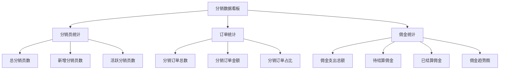

# 分销数据看板设计文档

> 任务：T-7 分销数据看板  
> 创建日期：2026-02-26  
> 状态：设计中

---

## 1. 概述

### 1.1 背景

门店管理员需要了解分销业务的整体运营情况，包括分销员规模、带来的订单量、佣金支出等关键指标，以便评估分销效果和调整策略。

### 1.2 目标

提供一个数据看板接口，展示分销业务的核心指标和趋势数据。

### 1.3 范围

**在范围内：**

- 分销员统计（总数、新增、活跃）
- 订单统计（分销订单数、金额）
- 佣金统计（支出总额、趋势）
- 时间范围筛选

**不在范围内：**

- 分销员详细列表（已有独立接口）
- 佣金明细查询（属于 finance/commission）
- 实时数据推送

---

## 2. 数据模型

### 2.1 数据来源

| 数据项     | 来源表           | 说明                             |
| ---------- | ---------------- | -------------------------------- |
| 分销员数量 | `ums_member`     | `levelId >= 1` 的会员            |
| 分销订单   | `oms_order`      | `shareUserId IS NOT NULL` 的订单 |
| 佣金记录   | `fin_commission` | 所有佣金记录                     |

### 2.2 统计维度



---

## 3. 接口设计

### 3.1 获取分销数据看板

**接口路径：** `GET /store/distribution/dashboard`

**请求参数：**

```typescript
export class GetDashboardDto {
  @ApiProperty({ description: '开始日期', required: false, example: '2026-01-01' })
  @IsOptional()
  @IsDateString()
  startDate?: string;

  @ApiProperty({ description: '结束日期', required: false, example: '2026-02-26' })
  @IsOptional()
  @IsDateString()
  endDate?: string;
}
```

**响应数据：**

```typescript
export class DashboardVo {
  @ApiProperty({ description: '分销员统计' })
  distributorStats: {
    total: number; // 总分销员数
    newCount: number; // 新增分销员数（时间范围内）
    activeCount: number; // 活跃分销员数（时间范围内有佣金记录）
  };

  @ApiProperty({ description: '订单统计' })
  orderStats: {
    totalCount: number; // 分销订单总数
    totalAmount: number; // 分销订单总金额
    percentage: number; // 分销订单占比（%）
  };

  @ApiProperty({ description: '佣金统计' })
  commissionStats: {
    totalAmount: number; // 佣金支出总额
    pendingAmount: number; // 待结算佣金
    settledAmount: number; // 已结算佣金
    trend: Array<{
      // 佣金趋势（按日）
      date: string;
      amount: number;
    }>;
  };
}
```

---

## 4. 业务逻辑

### 4.1 分销员统计

```typescript
// 总分销员数
const total = await prisma.umsMember.count({
  where: {
    tenantId,
    levelId: { gte: 1 },
  },
});

// 新增分销员数（时间范围内升级为C1/C2的）
const newCount = await prisma.umsMember.count({
  where: {
    tenantId,
    levelId: { gte: 1 },
    updateTime: { gte: startDate, lte: endDate },
  },
});

// 活跃分销员数（时间范围内有佣金记录的）
const activeCount = await prisma.finCommission
  .groupBy({
    by: ['beneficiaryId'],
    where: {
      tenantId,
      createTime: { gte: startDate, lte: endDate },
    },
  })
  .then((result) => result.length);
```

### 4.2 订单统计

```typescript
// 分销订单统计
const distributionOrders = await prisma.omsOrder.aggregate({
  where: {
    tenantId,
    shareUserId: { not: null },
    createTime: { gte: startDate, lte: endDate },
  },
  _count: true,
  _sum: { payAmount: true },
});

// 总订单统计（用于计算占比）
const totalOrders = await prisma.omsOrder.aggregate({
  where: {
    tenantId,
    createTime: { gte: startDate, lte: endDate },
  },
  _count: true,
});

const percentage = totalOrders._count > 0 ? (distributionOrders._count / totalOrders._count) * 100 : 0;
```

### 4.3 佣金统计

```typescript
// 佣金总额
const totalCommission = await prisma.finCommission.aggregate({
  where: {
    tenantId,
    createTime: { gte: startDate, lte: endDate },
  },
  _sum: { amount: true },
});

// 待结算佣金
const pendingCommission = await prisma.finCommission.aggregate({
  where: {
    tenantId,
    status: 'FROZEN',
    createTime: { gte: startDate, lte: endDate },
  },
  _sum: { amount: true },
});

// 已结算佣金
const settledCommission = await prisma.finCommission.aggregate({
  where: {
    tenantId,
    status: 'SETTLED',
    createTime: { gte: startDate, lte: endDate },
  },
  _sum: { amount: true },
});

// 佣金趋势（按日分组）
const trend = await prisma.$queryRaw`
  SELECT 
    DATE(create_time) as date,
    SUM(amount) as amount
  FROM fin_commission
  WHERE tenant_id = ${tenantId}
    AND create_time >= ${startDate}
    AND create_time <= ${endDate}
  GROUP BY DATE(create_time)
  ORDER BY date ASC
`;
```

---

## 5. 性能考虑

### 5.1 查询优化

- 使用 `aggregate` 和 `groupBy` 减少数据传输
- 添加必要的索引：
  - `ums_member(tenantId, levelId, updateTime)`
  - `oms_order(tenantId, shareUserId, createTime)`
  - `fin_commission(tenantId, status, createTime)`

### 5.2 缓存策略

- 数据看板数据可缓存 5 分钟
- 使用 Redis 缓存 key: `dist:dashboard:{tenantId}:{startDate}:{endDate}`

### 5.3 数据量级

| 数据量级   | 预估响应时间 | 优化方案        |
| ---------- | ------------ | --------------- |
| < 10万订单 | < 500ms      | 直接查询        |
| 10万-100万 | < 1s         | 添加索引 + 缓存 |
| > 100万    | < 2s         | 考虑预聚合表    |

---

## 6. 测试用例

### 6.1 功能测试

| 用例             | 输入               | 预期输出                     |
| ---------------- | ------------------ | ---------------------------- |
| 查询全部数据     | 无时间范围         | 返回所有历史数据统计         |
| 查询指定时间范围 | startDate, endDate | 返回该时间范围内的统计       |
| 无分销员         | 新租户             | 所有统计为 0                 |
| 无分销订单       | 有分销员但无订单   | 订单统计为 0，分销员统计正常 |

### 6.2 性能测试

- 10万订单数据下响应时间 < 1s
- 并发 10 个请求响应时间 < 2s

---

## 7. 实现计划

### 7.1 开发步骤

1. 创建 DTO 和 VO
2. 实现 DashboardService
3. 添加 Controller 接口
4. 编写单元测试
5. 性能测试和优化

### 7.2 预估工时

- DTO/VO 定义：0.5h
- Service 实现：2h
- Controller 实现：0.5h
- 单元测试：1.5h
- 性能优化：1h
- 总计：5.5h

---

## 8. 后续优化

### 8.1 功能增强

- 支持按周/月聚合
- 支持导出报表
- 支持对比上期数据

### 8.2 性能优化

- 引入预聚合表（每日定时任务）
- 使用 ClickHouse 存储历史数据

---

_文档创建时间：2026-02-26_
