# 分销管理模块 — 设计文档

> 版本：1.0
> 日期：2026-02-22
> 模块路径：`src/module/store/distribution`
> 需求文档：[distribution-requirements.md](../../../requirements/store/distribution/distribution-requirements.md)
> 状态：现状架构分析 + 改进方案设计

---

## 1. 概述

### 1.1 设计目标

1. 完整描述分销配置模块的当前技术架构、数据模型、核心流程
2. 针对需求文档中识别的 7 个代码缺陷（D-1 ~ D-7）和 7 个架构不足（A-1 ~ A-7），给出具体改进方案
3. 为中长期演进（商品级分佣、分销员等级、数据看板）提供接口与数据契约设计

### 1.2 约束

| 约束     | 说明                                                     |
| -------- | -------------------------------------------------------- |
| 框架     | NestJS + Prisma ORM + MySQL                              |
| 多租户   | 所有数据按 `tenantId` 隔离，配置表以 `tenantId` 为唯一键 |
| 事务     | 使用 `@Transactional()` 装饰器（基于 CLS）               |
| 异步任务 | Bull 队列处理佣金计算，3 次指数退避重试                  |
| 法规     | 分销层级不超过二级（符合国内法规要求）                   |

---

## 2. 架构与模块（组件图）

> 图 1：分销模块组件图

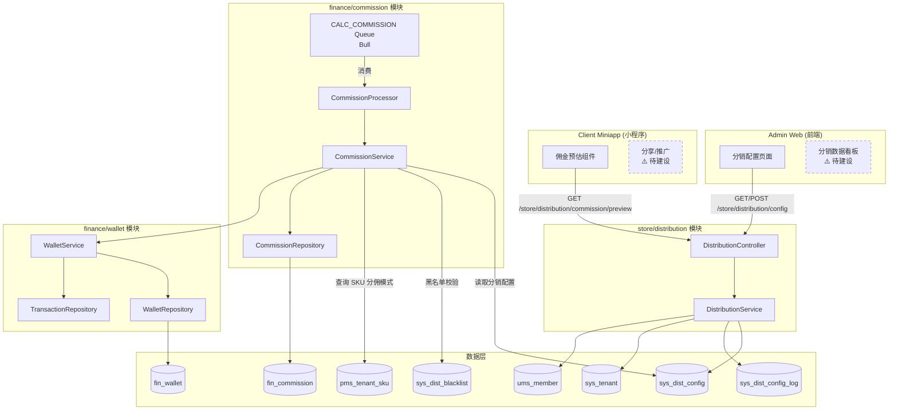

**组件说明**：

| 组件                     | 职责                                                          | 当前状态                    |
| ------------------------ | ------------------------------------------------------------- | --------------------------- |
| `DistributionController` | 暴露分销配置 CRUD 和佣金预估的 HTTP 接口                      | ✅ 已实现                   |
| `DistributionService`    | 配置读写、变更审计、佣金比例预估                              | ✅ 已实现（预估金额未实现） |
| `CommissionService`      | 佣金计算核心引擎，消费分销配置执行 L1/L2 计算                 | ✅ 已实现                   |
| `CommissionProcessor`    | Bull 队列消费者，调用 `CommissionService.calculateCommission` | ✅ 已实现                   |
| `WalletService`          | 钱包余额操作（结算入账、退款扣减）                            | ✅ 已实现                   |

**依赖方向**：`DistributionController` → `DistributionService` → `PrismaService`；`CommissionService` → `PrismaService`（直接读取 `sys_dist_config`，未依赖 `DistributionService`）。

> ⚠️ 当前 `CommissionService.getDistConfig()` 直接通过 Prisma 读取配置表，与 `DistributionService.getConfig()` 存在逻辑重复。改进方案见第 6 节。

---

## 3. 领域/数据模型（类图）

> 图 2：分销配置领域模型类图

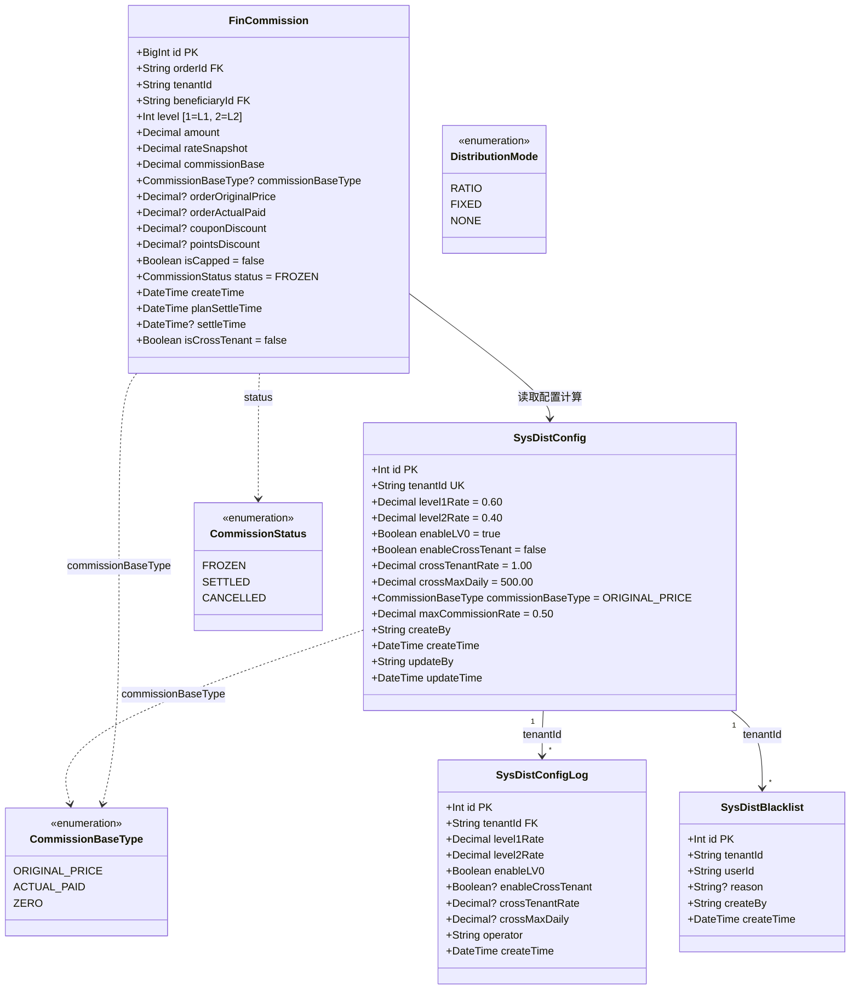

**模型说明**：

- `SysDistConfig`：每个租户唯一一条配置记录（`tenantId` 唯一索引）。不存在时使用 `BusinessConstants.DISTRIBUTION` 中的默认值。
- `SysDistConfigLog`：配置变更审计日志。当前缺失 `commissionBaseType` 和 `maxCommissionRate` 字段（缺陷 D-3）。
- `SysDistBlacklist`：分销黑名单，`(tenantId, userId)` 联合唯一。被拉黑的用户在佣金计算时跳过。
- `FinCommission`：佣金记录表，由 `CommissionService` 在订单支付后异步写入。包含完整的计算快照用于审计对账。

### 3.1 提议新增模型（中期演进）

> 图 3：提议新增的商品级分佣配置模型

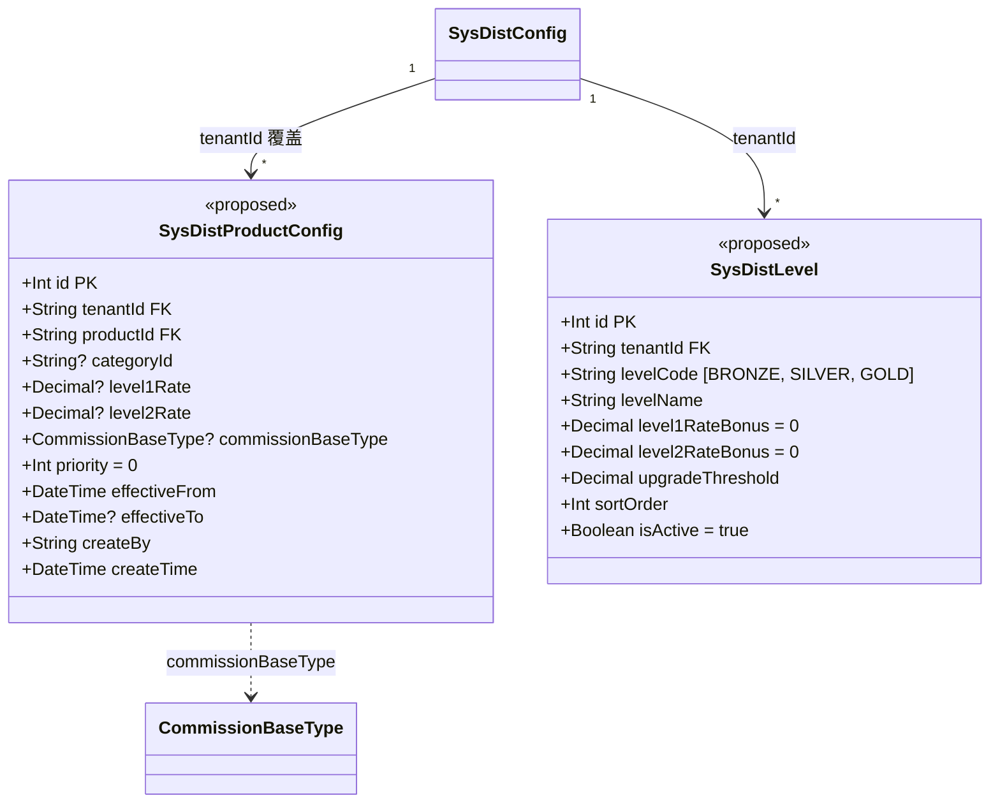

**设计要点**：

- `SysDistProductConfig`：商品/品类级分佣覆盖。查询优先级：商品级 > 品类级 > 租户默认。支持 `effectiveFrom/To` 实现延迟生效（对应架构不足 A-1、A-7）。
- `SysDistLevel`：分销员等级定义。`level1RateBonus` 为在租户默认比例基础上的加成（对应架构不足 A-3）。

---

## 4. 核心流程时序（时序图）

### 4.1 分销配置更新流程

> 图 4：配置更新时序图

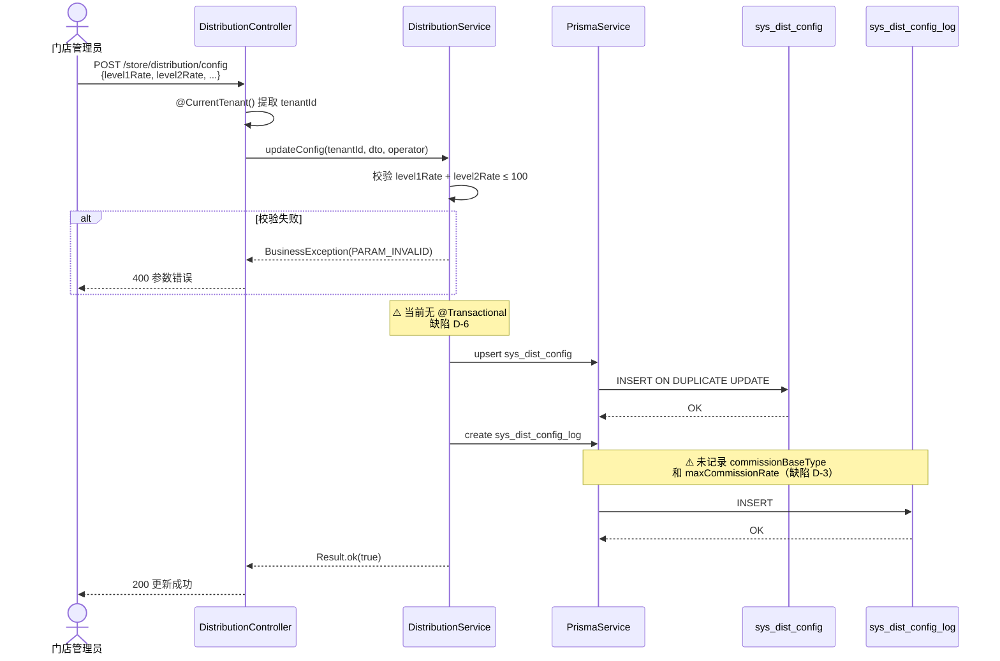

### 4.2 佣金预估流程

> 图 5：佣金预估时序图

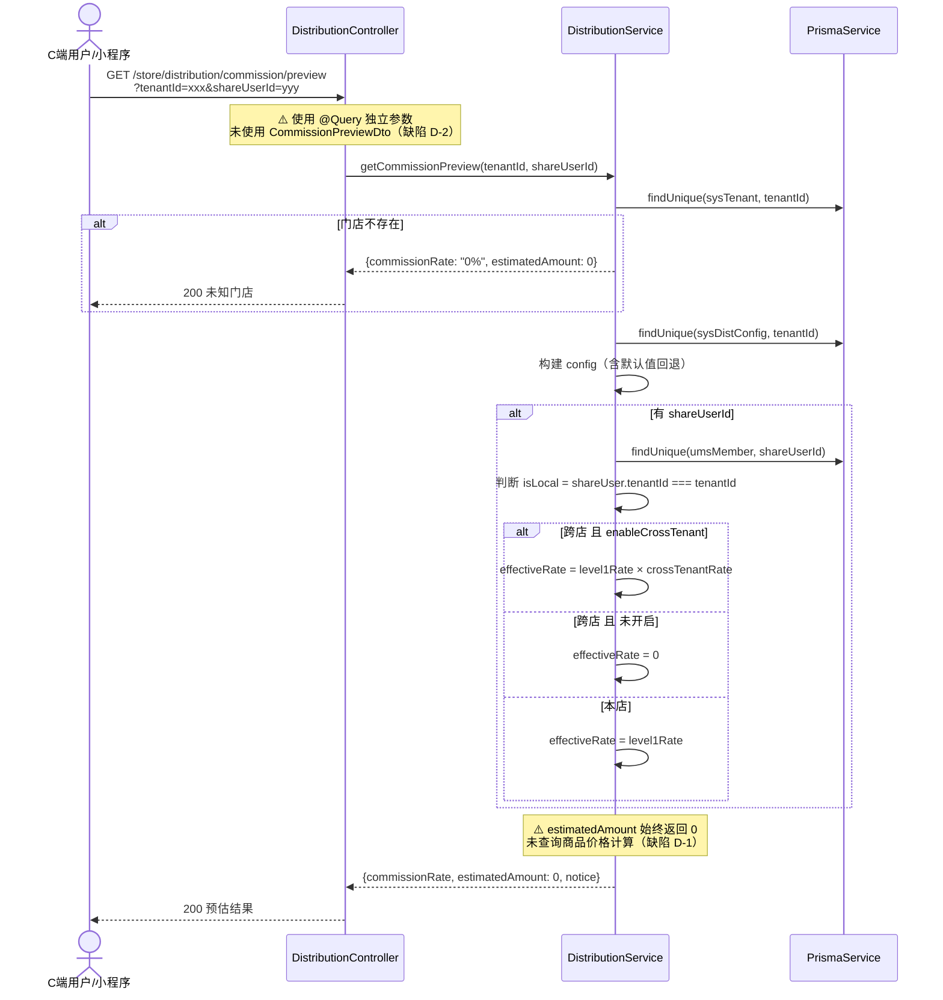

### 4.3 佣金计算流程（跨模块）

> 图 6：订单支付后佣金计算时序图

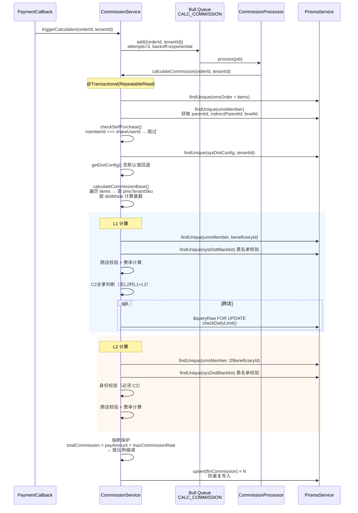

---

## 5. 状态与流程

### 5.1 分销配置生命周期（状态图）

> 图 7：分销配置状态图

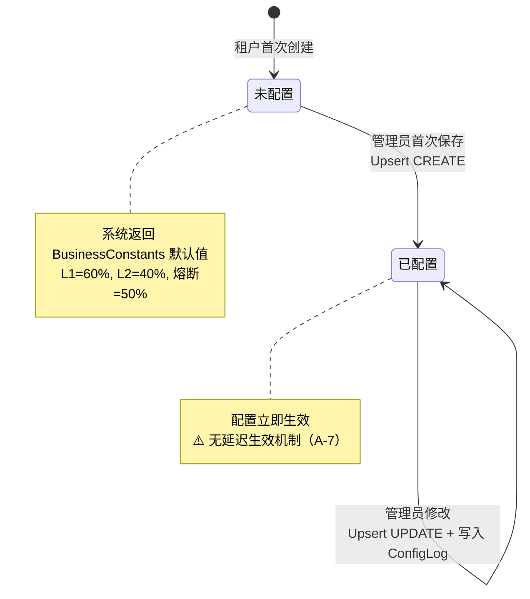

### 5.2 佣金记录生命周期（状态图）

> 图 8：佣金记录状态图

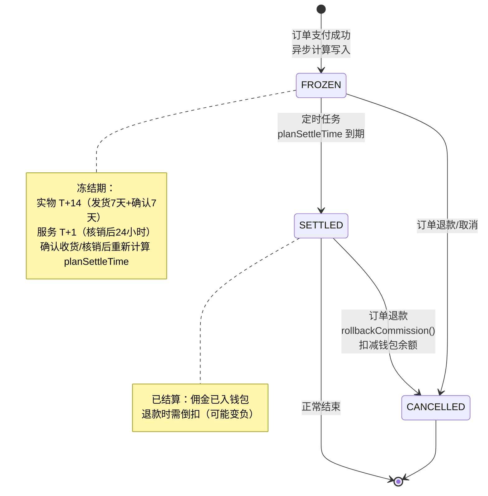

### 5.3 佣金计算决策活动图

> 图 9：佣金计算完整决策流程活动图

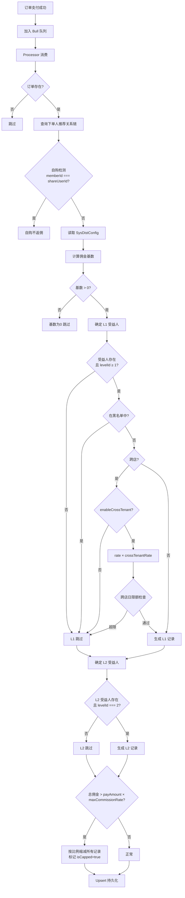

---

## 6. 缺陷改进方案

针对需求文档中识别的 7 个代码缺陷，逐一给出技术改进方案。

### 6.1 D-1 + D-2：佣金预估接口重构

**现状问题**：

- `CommissionPreviewDto` 定义了 `productIds` 字段，但 Controller 使用独立 `@Query` 参数，DTO 形同虚设
- `estimatedAmount` 始终返回 0，未查询商品价格

**改进方案**：

```typescript
// Controller 改为使用 DTO
@Get('commission/preview')
@Api({ summary: '佣金预估', type: CommissionPreviewVo })
async getCommissionPreview(@Query() dto: CommissionPreviewDto) {
  return this.distributionService.getCommissionPreview(dto);
}

// Service 新增商品价格查询逻辑
async getCommissionPreview(dto: CommissionPreviewDto) {
  const { tenantId, productIds, shareUserId } = dto;

  // 1. 查询门店 + 配置（同现有逻辑）
  // 2. 查询商品 SKU 价格
  const skus = await this.prisma.pmsTenantSku.findMany({
    where: { productId: { in: productIds }, tenantId },
    select: { price: true, distMode: true, distRate: true },
  });

  // 3. 按 distMode 计算预估基数
  let estimatedBase = new Decimal(0);
  for (const sku of skus) {
    if (sku.distMode === 'RATIO') {
      estimatedBase = estimatedBase.add(sku.price.mul(sku.distRate));
    } else if (sku.distMode === 'FIXED') {
      estimatedBase = estimatedBase.add(sku.distRate);
    }
  }

  // 4. estimatedAmount = estimatedBase × effectiveRate
  const estimatedAmount = estimatedBase.mul(effectiveRate).toDecimalPlaces(2);

  return Result.ok({ ...result, estimatedAmount: Number(estimatedAmount) });
}
```

**影响范围**：`DistributionController`、`DistributionService`、`CommissionPreviewDto`
**预估工时**：3h

### 6.2 D-3：变更日志补全字段

**现状问题**：`updateConfig` 写入 `sysDistConfigLog` 时未包含 `commissionBaseType` 和 `maxCommissionRate`。

**改进方案**：

1. Prisma Schema 中 `SysDistConfigLog` 新增两个字段：

```prisma
model SysDistConfigLog {
  // ... 现有字段 ...
  commissionBaseType CommissionBaseType? @map("commission_base_type")
  maxCommissionRate  Decimal?            @map("max_commission_rate") @db.Decimal(5, 2)
}
```

2. `DistributionService.updateConfig` 中补充写入：

```typescript
await this.prisma.sysDistConfigLog.create({
  data: {
    // ... 现有字段 ...
    commissionBaseType: dto.commissionBaseType ?? 'ORIGINAL_PRICE',
    maxCommissionRate: maxCommissionRate,
  },
});
```

**影响范围**：`schema.prisma`、`DistributionService`、`DistConfigLogVo`
**预估工时**：1h

### 6.3 D-4：消除 `as any` 类型断言

**现状问题**：`getConfig` 和 `updateConfig` 中大量 `(config as any).enableCrossTenant` 写法。

**根因**：Prisma Schema 中这些字段已定义，但可能是后期新增字段，Prisma Client 未重新生成，或者开发时为了快速通过编译使用了 `as any`。

**改进方案**：

1. 执行 `npx prisma generate` 确保 Prisma Client 类型与 Schema 同步
2. 移除所有 `as any` 断言，直接使用类型安全的属性访问
3. 对于可选字段使用 `??` 运算符提供默认值

**预估工时**：0.5h

### 6.4 D-5：变更日志支持分页

**现状问题**：`getConfigLogs` 硬编码 `take: 20`，无法查看更早记录。

**改进方案**：

```typescript
// 新增 DTO
export class ListDistConfigLogDto extends PageQueryDto {
  // 继承 page, pageSize
}

// Service 改造
async getConfigLogs(tenantId: string, query: ListDistConfigLogDto) {
  const { skip, take } = PaginationHelper.getPagination(query);
  const [rows, total] = await Promise.all([
    this.prisma.sysDistConfigLog.findMany({
      where: { tenantId },
      orderBy: { createTime: 'desc' },
      skip,
      take,
    }),
    this.prisma.sysDistConfigLog.count({ where: { tenantId } }),
  ]);
  return Result.ok({ rows: rows.map(mapToVo), total });
}
```

**预估工时**：1h

### 6.5 D-6：配置更新加事务保护

**现状问题**：`upsert` 和 `create log` 是两个独立操作，日志写入可能失败而配置已更新。

**改进方案**：

```typescript
@Transactional()
async updateConfig(tenantId: string, dto: UpdateDistConfigDto, operator: string) {
  // upsert + create log 在同一事务中
}
```

**预估工时**：0.5h

### 6.6 D-7：调整默认配置值

**现状问题**：默认 L1=60% + L2=40% = 100%，门店利润为 0。

**改进方案**：

```typescript
// business.constants.ts
DISTRIBUTION: {
  DEFAULT_LEVEL1_RATE: 0.10,  // 一级分佣默认 10%
  DEFAULT_LEVEL2_RATE: 0.05,  // 二级分佣默认 5%
  // ... 其余不变
}
```

**注意**：此修改影响所有未配置的租户。需评估是否有租户依赖当前默认值。建议：

1. 新租户使用新默认值
2. 已有租户如果从未配置过，在管理后台首次进入时提示设置

**预估工时**：0.5h

---

## 7. 架构改进方案

### 7.1 A-1：商品级分佣配置

**方案**：新增 `sys_dist_product_config` 表（见第 3.1 节类图），查询时按优先级匹配：

```
商品级配置（productId 精确匹配）
  → 品类级配置（categoryId 匹配）
    → 租户默认配置（SysDistConfig）
```

**接口设计**：

| 接口         | 方法   | 路径                                       | 说明                            |
| ------------ | ------ | ------------------------------------------ | ------------------------------- |
| 商品分佣列表 | GET    | `/store/distribution/product-config`       | 分页查询，支持按商品名/品类筛选 |
| 设置商品分佣 | POST   | `/store/distribution/product-config`       | 创建或更新商品级配置            |
| 删除商品分佣 | DELETE | `/store/distribution/product-config/:id`   | 删除后回退到租户默认            |
| 批量设置     | POST   | `/store/distribution/product-config/batch` | 按品类批量设置                  |

**CommissionService 改造**：

```typescript
async getEffectiveConfig(tenantId: string, productId: string) {
  // 1. 查商品级
  const productConfig = await this.prisma.sysDistProductConfig.findFirst({
    where: { tenantId, productId, effectiveFrom: { lte: now }, OR: [{ effectiveTo: null }, { effectiveTo: { gte: now } }] },
  });
  if (productConfig) return merge(baseConfig, productConfig);

  // 2. 查品类级
  const product = await this.prisma.pmsProduct.findUnique({ where: { id: productId } });
  if (product?.categoryId) {
    const categoryConfig = await this.prisma.sysDistProductConfig.findFirst({
      where: { tenantId, categoryId: product.categoryId, productId: null },
    });
    if (categoryConfig) return merge(baseConfig, categoryConfig);
  }

  // 3. 租户默认
  return baseConfig;
}
```

### 7.2 A-3 + A-4：分销员等级与申请流程

**数据模型**：见第 3.1 节 `SysDistLevel`。

**申请流程状态机**：

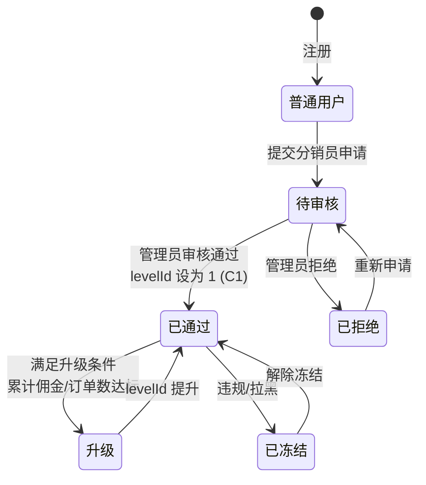

### 7.3 A-5：分销数据看板

**接口设计**：

| 接口       | 方法 | 路径                                     | 说明                              |
| ---------- | ---- | ---------------------------------------- | --------------------------------- |
| 看板概览   | GET  | `/store/distribution/dashboard/overview` | 分销员总数、今日/本月佣金、带单数 |
| 佣金趋势   | GET  | `/store/distribution/dashboard/trend`    | 按日/周/月聚合佣金支出            |
| 分销员排行 | GET  | `/store/distribution/dashboard/ranking`  | 按佣金/订单数排名 TOP N           |

**数据聚合策略**：

- 实时数据：直接查询 `fin_commission` 表（带索引 `[tenantId, status, planSettleTime]`）
- 趋势数据：建议后期引入定时聚合表 `dist_daily_stats`，避免大表实时聚合

### 7.4 A-7：配置延迟生效

**方案**：`SysDistConfig` 新增 `effectiveFrom` 字段。`CommissionService.getDistConfig()` 查询时增加时间条件。

**简化实现**（短期）：

- 新增 `pendingConfig` JSON 字段存储待生效配置
- 定时任务每日 00:00 检查并应用

---

## 8. 部署架构（部署图）

> 图 10：分销模块部署架构图

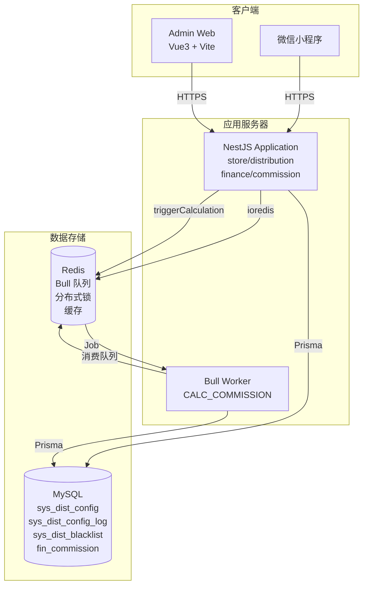

**部署说明**：

| 组件               | 实例 | 说明                                                  |
| ------------------ | ---- | ----------------------------------------------------- |
| NestJS Application | 1+   | 包含 HTTP 接口和 Bull Worker（同进程）                |
| MySQL              | 1    | 主库，分销配置表数据量小（每租户 1 条），佣金表为大表 |
| Redis              | 1    | Bull 队列后端 + 分布式锁 + 可选缓存                   |

**扩展建议**：

- 佣金表 `fin_commission` 属于大表（D3 级别），当数据量超过 100 万时需考虑按 `tenantId` 分表或按时间归档
- 分销配置表数据量极小（租户数量级），无需特殊优化
- Bull Worker 可独立部署为单独进程，避免佣金计算影响 HTTP 接口响应

---

## 9. 接口/数据约定

### 9.1 现有接口约定

| 接口     | 方法 | 路径                                     | 请求参数                | 响应                          | 租户类型       |
| -------- | ---- | ---------------------------------------- | ----------------------- | ----------------------------- | -------------- |
| 获取配置 | GET  | `/store/distribution/config`             | `@CurrentTenant()`      | `Result<DistConfigVo>`        | TenantScoped   |
| 更新配置 | POST | `/store/distribution/config`             | `UpdateDistConfigDto`   | `Result<boolean>`             | TenantScoped   |
| 变更历史 | GET  | `/store/distribution/config/logs`        | `@CurrentTenant()`      | `Result<DistConfigLogVo[]>`   | TenantScoped   |
| 佣金预估 | GET  | `/store/distribution/commission/preview` | `tenantId, shareUserId` | `Result<CommissionPreviewVo>` | TenantAgnostic |

### 9.2 提议新增接口

| 接口         | 方法   | 路径                                     | 说明                   | 优先级 |
| ------------ | ------ | ---------------------------------------- | ---------------------- | ------ |
| 商品分佣列表 | GET    | `/store/distribution/product-config`     | 分页查询商品级分佣配置 | P1     |
| 设置商品分佣 | POST   | `/store/distribution/product-config`     | 创建/更新商品级配置    | P1     |
| 删除商品分佣 | DELETE | `/store/distribution/product-config/:id` | 删除商品级配置         | P1     |
| 看板概览     | GET    | `/store/distribution/dashboard/overview` | 分销数据概览           | P1     |
| 佣金趋势     | GET    | `/store/distribution/dashboard/trend`    | 佣金支出趋势图数据     | P2     |
| 分销员排行   | GET    | `/store/distribution/dashboard/ranking`  | 分销员排行榜           | P2     |
| 黑名单列表   | GET    | `/store/distribution/blacklist`          | 分页查询黑名单         | P2     |
| 添加黑名单   | POST   | `/store/distribution/blacklist`          | 添加用户到黑名单       | P2     |
| 移除黑名单   | DELETE | `/store/distribution/blacklist/:id`      | 从黑名单移除           | P2     |

### 9.3 配置读取统一化

当前 `CommissionService.getDistConfig()` 和 `DistributionService.getConfig()` 存在逻辑重复。建议统一为：

```typescript
// DistributionService 作为配置的唯一读取入口
@Injectable()
export class DistributionService {
  /**
   * 获取租户分销配置（内部调用，返回原始 Decimal）
   * CommissionService 通过此方法获取配置，不再直接查表
   */
  async getDistConfigRaw(tenantId: string): Promise<DistConfigRaw> { ... }

  /**
   * 获取租户分销配置（HTTP 接口，返回百分比格式）
   */
  async getConfig(tenantId: string): Promise<Result<DistConfigVo>> { ... }
}

// CommissionService 注入 DistributionService
@Injectable()
export class CommissionService {
  constructor(
    private readonly distributionService: DistributionService,
    // ...
  ) {}

  async getDistConfig(tenantId: string) {
    return this.distributionService.getDistConfigRaw(tenantId);
  }
}
```

这样配置的默认值逻辑、字段映射只维护一处，避免两处代码不一致的风险。

---

## 10. 改进优先级总览

| 优先级 | 编号 | 改进项                                                  | 工时 | 对应缺陷/不足 |
| ------ | ---- | ------------------------------------------------------- | ---- | ------------- |
| P0     | I-1  | 配置更新加 `@Transactional()`                           | 0.5h | D-6           |
| P0     | I-2  | 变更日志补全 `commissionBaseType` + `maxCommissionRate` | 1h   | D-3           |
| P1     | I-3  | 佣金预估接口重构（使用 DTO + 查询商品价格）             | 3h   | D-1, D-2      |
| P1     | I-4  | 消除 `as any` 类型断言                                  | 0.5h | D-4           |
| P1     | I-5  | 变更日志支持分页                                        | 1h   | D-5           |
| P1     | I-6  | 配置读取逻辑统一化                                      | 1h   | 架构优化      |
| P2     | I-7  | 调整默认配置值                                          | 0.5h | D-7           |
| P1     | I-8  | 商品级分佣配置                                          | 2-3d | A-1           |
| P1     | I-9  | 分销数据看板                                            | 2-3d | A-5           |
| P2     | I-10 | 分销员等级体系                                          | 3-5d | A-3           |
| P2     | I-11 | 分销员申请/审核流程                                     | 2-3d | A-4           |
| P3     | I-12 | 配置延迟生效                                            | 1-2d | A-7           |
| P3     | I-13 | 分销海报/素材管理                                       | 3-5d | A-6           |
