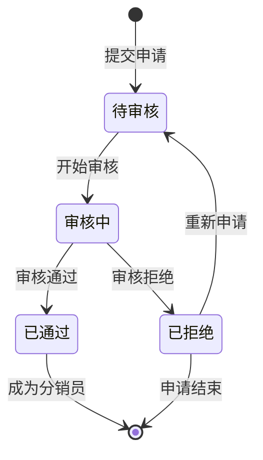
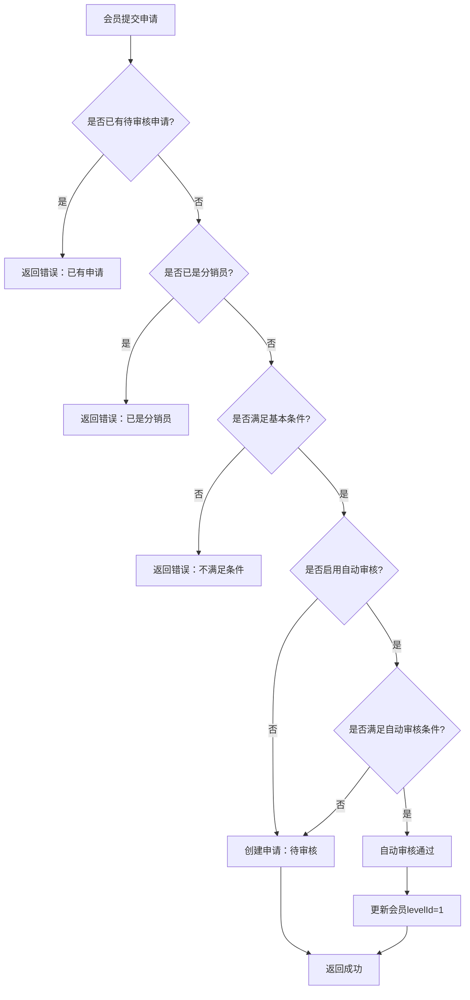
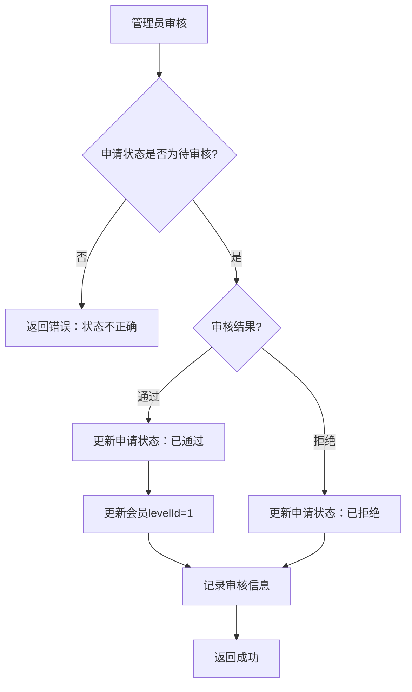

# 分销员申请/审核流程设计文档

> 任务：T-9 分销员申请/审核流程  
> 创建日期：2026-02-26  
> 状态：设计中

---

## 1. 概述

### 1.1 背景

当前系统中，会员成为分销员的方式较为简单，缺少规范的申请和审核流程。需要建立完整的分销员申请/审核机制，确保分销员质量，降低运营风险。

### 1.2 目标

1. 提供规范的分销员申请流程
2. 支持多级审核机制
3. 记录完整的审核历史
4. 支持批量审核操作
5. 提供申请状态查询

### 1.3 范围

**在范围内：**

- 分销员申请提交
- 申请审核（通过/拒绝）
- 申请状态查询
- 审核历史记录
- 批量审核操作

**不在范围内：**

- 分销员资质认证（如身份证验证）
- 分销员培训考核
- 分销员协议签署

---

## 2. 业务模型

### 2.1 申请流程



### 2.2 申请状态

| 状态      | 说明   | 可执行操作               |
| --------- | ------ | ------------------------ |
| PENDING   | 待审核 | 审核通过、审核拒绝、撤回 |
| REVIEWING | 审核中 | 审核通过、审核拒绝       |
| APPROVED  | 已通过 | 无                       |
| REJECTED  | 已拒绝 | 重新申请                 |
| CANCELLED | 已撤回 | 重新申请                 |

### 2.3 审核规则

**自动审核条件**（可配置）：

- 会员注册时间 ≥ N天
- 历史订单数 ≥ N单
- 历史消费金额 ≥ N元
- 无违规记录

**人工审核**：

- 不满足自动审核条件
- 租户配置为人工审核
- 敏感行业/特殊情况

---

## 3. 数据模型

### 3.1 申请表（sys_dist_application）

```prisma
model SysDistApplication {
  id              Int      @id @default(autoincrement())
  tenantId        String   @map("tenant_id") @db.VarChar(20)
  memberId        String   @map("member_id") @db.VarChar(20)
  applyReason     String?  @map("apply_reason") @db.VarChar(500)  // 申请理由
  status          String   @db.VarChar(20)  // PENDING, REVIEWING, APPROVED, REJECTED, CANCELLED
  reviewerId      String?  @map("reviewer_id") @db.VarChar(20)  // 审核人
  reviewTime      DateTime? @map("review_time")
  reviewRemark    String?  @map("review_remark") @db.VarChar(500)  // 审核备注
  autoReviewed    Boolean  @default(false) @map("auto_reviewed")  // 是否自动审核
  createTime      DateTime @default(now()) @map("create_time")
  updateTime      DateTime @updatedAt @map("update_time")

  @@unique([tenantId, memberId, status])  // 同一会员同一状态只能有一条记录
  @@index([tenantId, status])
  @@index([memberId])
  @@index([createTime])
  @@map("sys_dist_application")
}
```

### 3.2 审核配置表（sys_dist_review_config）

```prisma
model SysDistReviewConfig {
  id                    Int      @id @default(autoincrement())
  tenantId              String   @unique @map("tenant_id") @db.VarChar(20)
  enableAutoReview      Boolean  @default(false) @map("enable_auto_review")  // 是否启用自动审核
  minRegisterDays       Int      @default(0) @map("min_register_days")  // 最小注册天数
  minOrderCount         Int      @default(0) @map("min_order_count")  // 最小订单数
  minOrderAmount        Decimal  @default(0) @map("min_order_amount") @db.Decimal(10, 2)  // 最小消费金额
  requireRealName       Boolean  @default(false) @map("require_real_name")  // 是否要求实名
  requirePhone          Boolean  @default(true) @map("require_phone")  // 是否要求手机号
  createBy              String   @map("create_by") @db.VarChar(64)
  createTime            DateTime @default(now()) @map("create_time")
  updateBy              String   @map("update_by") @db.VarChar(64)
  updateTime            DateTime @updatedAt @map("update_time")

  @@map("sys_dist_review_config")
}
```

---

## 4. 接口设计

### 4.1 会员端接口

#### 4.1.1 提交申请

**接口：** `POST /client/distribution/application`

```typescript
export class CreateApplicationDto {
  @ApiProperty({ description: '申请理由', required: false })
  @IsOptional()
  @IsString()
  @Length(0, 500)
  applyReason?: string;
}
```

**响应：**

```typescript
{
  "code": 200,
  "message": "申请提交成功",
  "data": {
    "id": 1,
    "status": "PENDING",
    "autoReviewed": false,
    "createTime": "2026-02-26T10:00:00Z"
  }
}
```

#### 4.1.2 查询申请状态

**接口：** `GET /client/distribution/application/status`

**响应：**

```typescript
{
  "code": 200,
  "data": {
    "hasApplication": true,
    "status": "PENDING",
    "applyTime": "2026-02-26T10:00:00Z",
    "reviewTime": null,
    "reviewRemark": null,
    "canReapply": false
  }
}
```

#### 4.1.3 撤回申请

**接口：** `POST /client/distribution/application/cancel`

### 4.2 管理端接口

#### 4.2.1 查询申请列表

**接口：** `GET /store/distribution/application/list`

```typescript
export class ListApplicationDto extends PageQueryDto {
  @ApiProperty({ description: '状态', required: false })
  @IsOptional()
  @IsEnum(['PENDING', 'REVIEWING', 'APPROVED', 'REJECTED', 'CANCELLED'])
  status?: string;

  @ApiProperty({ description: '会员ID', required: false })
  @IsOptional()
  @IsString()
  memberId?: string;

  @ApiProperty({ description: '开始时间', required: false })
  @IsOptional()
  @IsDateString()
  startTime?: string;

  @ApiProperty({ description: '结束时间', required: false })
  @IsOptional()
  @IsDateString()
  endTime?: string;
}
```

#### 4.2.2 审核申请

**接口：** `POST /store/distribution/application/:id/review`

```typescript
export class ReviewApplicationDto {
  @ApiProperty({ description: '审核结果', enum: ['APPROVED', 'REJECTED'] })
  @IsEnum(['APPROVED', 'REJECTED'])
  result: string;

  @ApiProperty({ description: '审核备注', required: false })
  @IsOptional()
  @IsString()
  @Length(0, 500)
  remark?: string;
}
```

#### 4.2.3 批量审核

**接口：** `POST /store/distribution/application/batch-review`

```typescript
export class BatchReviewDto {
  @ApiProperty({ description: '申请ID列表' })
  @IsArray()
  @ArrayMinSize(1)
  @ArrayMaxSize(100)
  ids: number[];

  @ApiProperty({ description: '审核结果', enum: ['APPROVED', 'REJECTED'] })
  @IsEnum(['APPROVED', 'REJECTED'])
  result: string;

  @ApiProperty({ description: '审核备注', required: false })
  @IsOptional()
  @IsString()
  @Length(0, 500)
  remark?: string;
}
```

#### 4.2.4 获取审核配置

**接口：** `GET /store/distribution/application/config`

#### 4.2.5 更新审核配置

**接口：** `PUT /store/distribution/application/config`

```typescript
export class UpdateReviewConfigDto {
  @ApiProperty({ description: '是否启用自动审核' })
  @IsBoolean()
  enableAutoReview: boolean;

  @ApiProperty({ description: '最小注册天数' })
  @IsInt()
  @Min(0)
  minRegisterDays: number;

  @ApiProperty({ description: '最小订单数' })
  @IsInt()
  @Min(0)
  minOrderCount: number;

  @ApiProperty({ description: '最小消费金额' })
  @IsNumber()
  @Min(0)
  minOrderAmount: number;

  @ApiProperty({ description: '是否要求实名' })
  @IsBoolean()
  requireRealName: boolean;

  @ApiProperty({ description: '是否要求手机号' })
  @IsBoolean()
  requirePhone: boolean;
}
```

---

## 5. 业务逻辑

### 5.1 提交申请流程



### 5.2 审核申请流程



### 5.3 自动审核条件检查

```typescript
async checkAutoReviewConditions(
  memberId: string,
  config: ReviewConfig,
): Promise<boolean> {
  // 1. 检查注册时间
  const member = await this.getMember(memberId);
  const registerDays = this.calculateDays(member.createTime, new Date());
  if (registerDays < config.minRegisterDays) return false;

  // 2. 检查订单数和消费金额
  const orderStats = await this.getOrderStats(memberId);
  if (orderStats.count < config.minOrderCount) return false;
  if (orderStats.amount < config.minOrderAmount) return false;

  // 3. 检查实名认证
  if (config.requireRealName && !member.isRealName) return false;

  // 4. 检查手机号
  if (config.requirePhone && !member.phone) return false;

  // 5. 检查违规记录
  const hasViolation = await this.checkViolation(memberId);
  if (hasViolation) return false;

  return true;
}
```

---

## 6. 数据库索引

```sql
-- 申请表索引
CREATE INDEX idx_tenant_status ON sys_dist_application(tenant_id, status);
CREATE INDEX idx_member ON sys_dist_application(member_id);
CREATE INDEX idx_create_time ON sys_dist_application(create_time);
CREATE UNIQUE INDEX uk_tenant_member_status ON sys_dist_application(tenant_id, member_id, status);

-- 审核配置表索引
CREATE UNIQUE INDEX uk_tenant ON sys_dist_review_config(tenant_id);
```

---

## 7. 测试用例

### 7.1 提交申请测试

| 用例         | 输入           | 预期输出 |
| ------------ | -------------- | -------- |
| 正常提交     | 有效会员       | 创建成功 |
| 重复提交     | 已有待审核申请 | 返回错误 |
| 已是分销员   | levelId >= 1   | 返回错误 |
| 不满足条件   | 注册时间不足   | 返回错误 |
| 自动审核通过 | 满足所有条件   | 自动通过 |

### 7.2 审核申请测试

| 用例     | 输入       | 预期输出                   |
| -------- | ---------- | -------------------------- |
| 审核通过 | 待审核申请 | 更新状态，会员成为C1       |
| 审核拒绝 | 待审核申请 | 更新状态，会员保持普通用户 |
| 状态错误 | 已审核申请 | 返回错误                   |
| 批量审核 | 多个申请   | 批量更新                   |

### 7.3 配置管理测试

| 用例         | 输入                  | 预期输出         |
| ------------ | --------------------- | ---------------- |
| 获取配置     | 租户ID                | 返回配置         |
| 更新配置     | 有效数据              | 更新成功         |
| 启用自动审核 | enableAutoReview=true | 后续申请自动审核 |

---

## 8. 实现计划

### 8.1 开发步骤

**第一阶段：数据模型和基础接口（1天）**

1. 创建Prisma schema
2. 生成migration
3. 创建DTO和VO
4. 实现ApplicationService基础方法
5. 实现Controller接口
6. 编写单元测试

**第二阶段：审核逻辑（0.5天）**

1. 实现自动审核条件检查
2. 实现审核流程
3. 实现批量审核
4. 编写单元测试

**第三阶段：配置管理（0.5天）**

1. 实现配置CRUD
2. 集成到申请流程
3. 编写单元测试

**第四阶段：测试和优化（1天）**

1. 完整功能测试
2. 性能测试
3. 文档完善

### 8.2 预估工时

- 数据模型和基础接口：8h
- 审核逻辑：4h
- 配置管理：4h
- 测试和优化：8h
- 总计：24h（3天）

---

## 9. 风险与注意事项

### 9.1 风险

1. **并发申请**：同一会员同时提交多个申请
2. **状态不一致**：审核过程中会员状态变更
3. **自动审核误判**：条件设置不当导致误审

### 9.2 注意事项

1. 申请提交需要唯一约束保护
2. 审核操作需要事务保护
3. 自动审核条件需要可配置
4. 审核历史需要完整记录
5. 批量审核需要限制数量

---

## 10. 后续优化

### 10.1 功能增强

- 申请撤回功能
- 申请重新提交
- 审核流程可视化
- 审核通知（短信/站内信）
- 审核统计报表

### 10.2 性能优化

- 申请列表分页优化
- 批量审核异步处理
- 自动审核条件缓存

---

_文档创建时间：2026-02-26_
