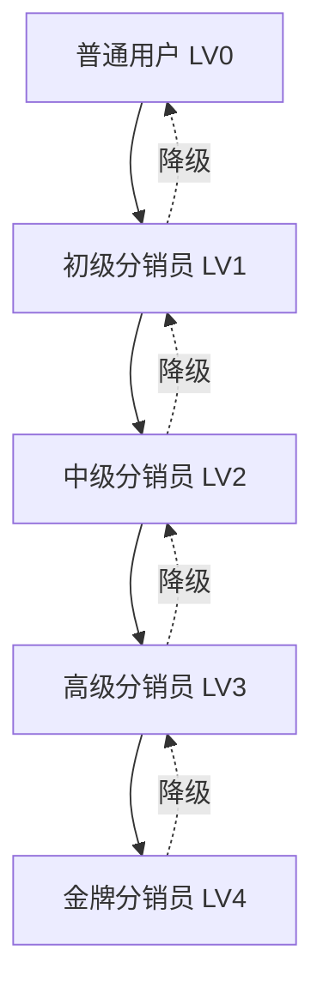
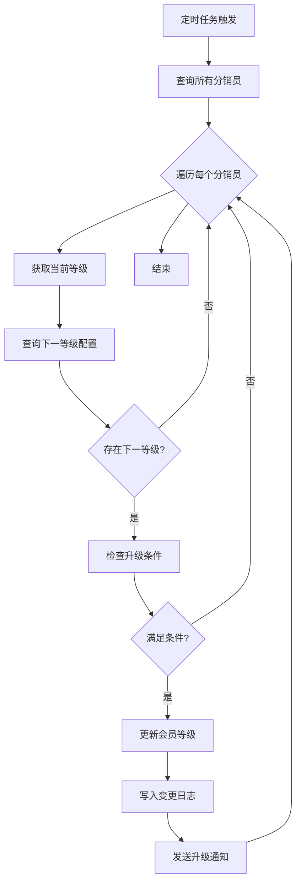
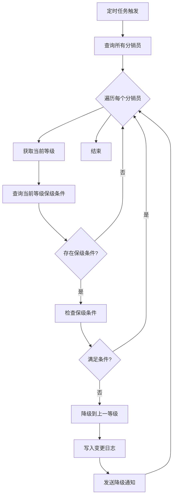

# 分销员等级体系设计文档

> 任务：T-8 分销员等级体系  
> 创建日期：2026-02-26  
> 状态：设计中

---

## 1. 概述

### 1.1 背景

当前系统仅通过 `ums_member.levelId` 区分普通用户（0）、C1分销员（1）、C2分销员（2），缺少灵活的等级定义和差异化佣金配置能力。需要建立完整的分销员等级体系，支持自定义等级、升级条件、差异化佣金比例。

### 1.2 目标

1. 支持租户自定义分销员等级（名称、图标、权益）
2. 支持按等级设置差异化佣金比例
3. 支持自动升级/降级机制
4. 支持等级权益管理

### 1.3 范围

**在范围内：**

- 等级定义管理（CRUD）
- 等级佣金配置
- 升级条件配置
- 会员等级查询和变更
- 等级变更日志

**不在范围内：**

- 等级权益的具体实现（如专属商品、优先客服）
- 等级勋章/徽章系统
- 等级积分体系

---

## 2. 业务模型

### 2.1 等级体系架构



### 2.2 等级属性

| 属性         | 说明                 | 示例                   |
| ------------ | -------------------- | ---------------------- |
| 等级编号     | levelId，0为普通用户 | 0, 1, 2, 3, 4          |
| 等级名称     | 显示名称             | 初级分销员、中级分销员 |
| 等级图标     | 图标URL              | /icons/level-1.png     |
| 一级佣金比例 | 直推佣金比例         | 10%, 12%, 15%          |
| 二级佣金比例 | 间推佣金比例         | 5%, 6%, 8%             |
| 升级条件     | 达成条件             | 累计佣金≥1000元        |
| 保级条件     | 维持条件             | 近30天佣金≥100元       |
| 等级权益     | 文字描述             | 专属客服、优先发货     |

### 2.3 升级条件类型

| 条件类型 | 说明                | 示例           |
| -------- | ------------------- | -------------- |
| 累计佣金 | 历史累计佣金总额    | ≥ 1000元       |
| 近期佣金 | 近N天佣金总额       | 近30天 ≥ 100元 |
| 累计订单 | 历史累计带单数      | ≥ 50单         |
| 近期订单 | 近N天带单数         | 近30天 ≥ 5单   |
| 直推人数 | 直接推荐的分销员数  | ≥ 10人         |
| 团队规模 | 直推+间推分销员总数 | ≥ 50人         |

---

## 3. 数据模型

### 3.1 等级定义表（sys_dist_level）

```prisma
model SysDistLevel {
  id              Int      @id @default(autoincrement())
  tenantId        String   @map("tenant_id") @db.VarChar(20)
  levelId         Int      @map("level_id")  // 等级编号（0-10）
  levelName       String   @map("level_name") @db.VarChar(50)
  levelIcon       String?  @map("level_icon") @db.VarChar(255)
  level1Rate      Decimal  @map("level1_rate") @db.Decimal(5, 4)  // 一级佣金比例
  level2Rate      Decimal  @map("level2_rate") @db.Decimal(5, 4)  // 二级佣金比例
  upgradeCondition Json?   @map("upgrade_condition")  // 升级条件（JSON）
  maintainCondition Json?  @map("maintain_condition") // 保级条件（JSON）
  benefits        String?  @db.Text  // 等级权益描述
  sort            Int      @default(0)  // 排序
  isActive        Boolean  @default(true) @map("is_active")
  createBy        String   @map("create_by") @db.VarChar(64)
  createTime      DateTime @default(now()) @map("create_time")
  updateBy        String   @map("update_by") @db.VarChar(64)
  updateTime      DateTime @updatedAt @map("update_time")

  @@unique([tenantId, levelId])
  @@index([tenantId, isActive])
  @@map("sys_dist_level")
}
```

### 3.2 等级变更日志表（sys_dist_level_log）

```prisma
model SysDistLevelLog {
  id          Int      @id @default(autoincrement())
  tenantId    String   @map("tenant_id") @db.VarChar(20)
  memberId    String   @map("member_id") @db.VarChar(20)
  fromLevel   Int      @map("from_level")
  toLevel     Int      @map("to_level")
  changeType  String   @map("change_type") @db.VarChar(20)  // UPGRADE, DOWNGRADE, MANUAL
  reason      String?  @db.VarChar(255)
  operator    String?  @db.VarChar(64)
  createTime  DateTime @default(now()) @map("create_time")

  @@index([tenantId, memberId])
  @@index([createTime])
  @@map("sys_dist_level_log")
}
```

### 3.3 升级条件JSON结构

```typescript
interface UpgradeCondition {
  type: 'AND' | 'OR'; // 条件关系
  rules: Array<{
    field: 'totalCommission' | 'recentCommission' | 'totalOrders' | 'recentOrders' | 'directReferrals' | 'teamSize';
    operator: '>=' | '>' | '=' | '<' | '<=';
    value: number;
    days?: number; // 用于 recent* 类型
  }>;
}
```

**示例：**

```json
{
  "type": "AND",
  "rules": [
    {
      "field": "totalCommission",
      "operator": ">=",
      "value": 1000
    },
    {
      "field": "recentCommission",
      "operator": ">=",
      "value": 100,
      "days": 30
    }
  ]
}
```

---

## 4. 接口设计

### 4.1 等级管理接口

#### 4.1.1 创建等级

**接口：** `POST /store/distribution/level`

```typescript
export class CreateLevelDto {
  @ApiProperty({ description: '等级编号（1-10）' })
  @IsInt()
  @Min(1)
  @Max(10)
  levelId: number;

  @ApiProperty({ description: '等级名称' })
  @IsString()
  @Length(1, 50)
  levelName: string;

  @ApiProperty({ description: '等级图标URL', required: false })
  @IsOptional()
  @IsString()
  levelIcon?: string;

  @ApiProperty({ description: '一级佣金比例（0-100）' })
  @IsNumber()
  @Min(0)
  @Max(100)
  level1Rate: number;

  @ApiProperty({ description: '二级佣金比例（0-100）' })
  @IsNumber()
  @Min(0)
  @Max(100)
  level2Rate: number;

  @ApiProperty({ description: '升级条件', required: false })
  @IsOptional()
  upgradeCondition?: UpgradeCondition;

  @ApiProperty({ description: '保级条件', required: false })
  @IsOptional()
  maintainCondition?: UpgradeCondition;

  @ApiProperty({ description: '等级权益描述', required: false })
  @IsOptional()
  @IsString()
  benefits?: string;

  @ApiProperty({ description: '排序', required: false })
  @IsOptional()
  @IsInt()
  sort?: number;
}
```

#### 4.1.2 更新等级

**接口：** `PUT /store/distribution/level/:id`

```typescript
export class UpdateLevelDto extends PartialType(CreateLevelDto) {}
```

#### 4.1.3 删除等级

**接口：** `DELETE /store/distribution/level/:id`

#### 4.1.4 查询等级列表

**接口：** `GET /store/distribution/level/list`

```typescript
export class ListLevelDto {
  @ApiProperty({ description: '是否激活', required: false })
  @IsOptional()
  @IsBoolean()
  isActive?: boolean;
}
```

#### 4.1.5 查询等级详情

**接口：** `GET /store/distribution/level/:id`

### 4.2 会员等级管理接口

#### 4.2.1 手动调整会员等级

**接口：** `POST /store/distribution/member-level`

```typescript
export class UpdateMemberLevelDto {
  @ApiProperty({ description: '会员ID' })
  @IsString()
  memberId: string;

  @ApiProperty({ description: '目标等级' })
  @IsInt()
  @Min(0)
  @Max(10)
  targetLevel: number;

  @ApiProperty({ description: '调整原因' })
  @IsString()
  @Length(1, 255)
  reason: string;
}
```

#### 4.2.2 查询会员等级变更日志

**接口：** `GET /store/distribution/member-level/logs`

```typescript
export class ListMemberLevelLogDto extends PageQueryDto {
  @ApiProperty({ description: '会员ID', required: false })
  @IsOptional()
  @IsString()
  memberId?: string;

  @ApiProperty({ description: '变更类型', required: false })
  @IsOptional()
  @IsEnum(['UPGRADE', 'DOWNGRADE', 'MANUAL'])
  changeType?: string;
}
```

### 4.3 等级升级检查接口

#### 4.3.1 检查会员是否满足升级条件

**接口：** `GET /store/distribution/level/check/:memberId`

```typescript
export class LevelCheckVo {
  @ApiProperty({ description: '当前等级' })
  currentLevel: number;

  @ApiProperty({ description: '可升级到的等级' })
  eligibleLevel: number;

  @ApiProperty({ description: '是否满足升级条件' })
  canUpgrade: boolean;

  @ApiProperty({ description: '升级条件检查结果' })
  conditionResults: Array<{
    field: string;
    required: number;
    actual: number;
    passed: boolean;
  }>;
}
```

---

## 5. 业务逻辑

### 5.1 等级升级流程



### 5.2 等级降级流程



### 5.3 条件检查逻辑

```typescript
async checkCondition(
  memberId: string,
  condition: UpgradeCondition,
): Promise<boolean> {
  const results = await Promise.all(
    condition.rules.map(rule => this.checkRule(memberId, rule))
  );

  if (condition.type === 'AND') {
    return results.every(r => r);
  } else {
    return results.some(r => r);
  }
}

async checkRule(
  memberId: string,
  rule: ConditionRule,
): Promise<boolean> {
  const actualValue = await this.getFieldValue(memberId, rule.field, rule.days);

  switch (rule.operator) {
    case '>=': return actualValue >= rule.value;
    case '>': return actualValue > rule.value;
    case '=': return actualValue === rule.value;
    case '<': return actualValue < rule.value;
    case '<=': return actualValue <= rule.value;
  }
}
```

---

## 6. 定时任务

### 6.1 等级升级任务

**执行频率：** 每天凌晨2点

**任务内容：**

1. 查询所有分销员（levelId >= 1）
2. 检查是否满足下一等级的升级条件
3. 满足条件则自动升级
4. 记录变更日志
5. 发送升级通知

### 6.2 等级降级任务

**执行频率：** 每天凌晨3点

**任务内容：**

1. 查询所有分销员（levelId >= 1）
2. 检查是否满足当前等级的保级条件
3. 不满足条件则自动降级
4. 记录变更日志
5. 发送降级通知

---

## 7. 与现有系统的集成

### 7.1 佣金计算集成

**当前逻辑：**

```typescript
// 使用租户级配置或商品级配置
const config = await getEffectiveConfig(tenantId, productId, categoryId);
const rate = config.level1Rate;
```

**改造后：**

```typescript
// 优先使用会员等级配置
const memberLevel = await getMemberLevel(memberId);
const levelConfig = await getLevelConfig(tenantId, memberLevel);

// 优先级：会员等级 > 商品级 > 租户级
const rate = levelConfig?.level1Rate || productConfig?.level1Rate || tenantConfig.level1Rate;
```

### 7.2 配置优先级

```
会员等级配置 > 商品级配置 > 品类级配置 > 租户默认配置
```

---

## 8. 测试用例

### 8.1 等级管理测试

| 用例         | 输入          | 预期输出         |
| ------------ | ------------- | ---------------- |
| 创建等级     | 有效数据      | 创建成功         |
| 创建重复等级 | levelId已存在 | 返回错误         |
| 更新等级     | 有效数据      | 更新成功         |
| 删除等级     | 有效ID        | 软删除成功       |
| 查询等级列表 | 无参数        | 返回所有激活等级 |

### 8.2 等级升级测试

| 用例           | 输入          | 预期输出     |
| -------------- | ------------- | ------------ |
| 满足升级条件   | 累计佣金≥1000 | 自动升级     |
| 不满足升级条件 | 累计佣金<1000 | 保持当前等级 |
| AND条件        | 满足所有条件  | 升级成功     |
| OR条件         | 满足任一条件  | 升级成功     |

### 8.3 等级降级测试

| 用例           | 输入           | 预期输出     |
| -------------- | -------------- | ------------ |
| 满足保级条件   | 近30天佣金≥100 | 保持当前等级 |
| 不满足保级条件 | 近30天佣金<100 | 自动降级     |

---

## 9. 实现计划

### 9.1 开发步骤

**第一阶段：数据模型和基础CRUD（1天）**

1. 创建Prisma schema
2. 生成migration
3. 创建DTO和VO
4. 实现LevelService基础CRUD
5. 实现Controller接口
6. 编写单元测试

**第二阶段：条件检查和升降级逻辑（1.5天）**

1. 实现条件检查Service
2. 实现升级检查逻辑
3. 实现降级检查逻辑
4. 实现手动调整等级
5. 编写单元测试

**第三阶段：定时任务（0.5天）**

1. 实现升级定时任务
2. 实现降级定时任务
3. 编写集成测试

**第四阶段：佣金计算集成（1天）**

1. 修改佣金计算逻辑
2. 添加等级配置优先级
3. 编写集成测试

**第五阶段：测试和优化（1天）**

1. 完整功能测试
2. 性能测试
3. 文档完善

### 9.2 预估工时

- 数据模型和基础CRUD：8h
- 条件检查和升降级逻辑：12h
- 定时任务：4h
- 佣金计算集成：8h
- 测试和优化：8h
- 总计：40h（5天）

---

## 10. 风险与注意事项

### 10.1 风险

1. **数据一致性**：等级变更需要事务保护
2. **性能问题**：定时任务可能处理大量数据
3. **条件复杂度**：复杂的升级条件可能影响性能

### 10.2 注意事项

1. 等级变更必须记录日志
2. 降级需要谨慎，避免频繁降级影响用户体验
3. 定时任务需要幂等性保护
4. 需要考虑等级配置变更对已有分销员的影响

---

## 11. 后续优化

### 11.1 功能增强

- 等级勋章系统
- 等级专属权益实现
- 等级积分体系
- 等级排行榜

### 11.2 性能优化

- 条件检查结果缓存
- 批量处理优化
- 异步通知

---

_文档创建时间：2026-02-26_
