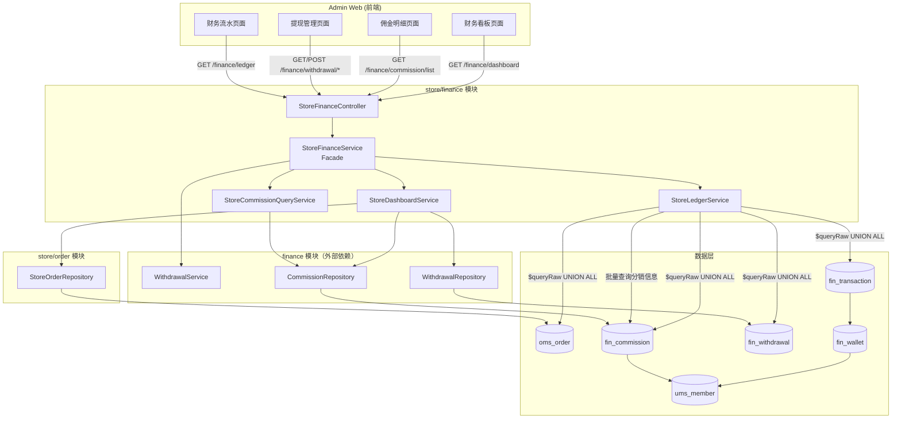
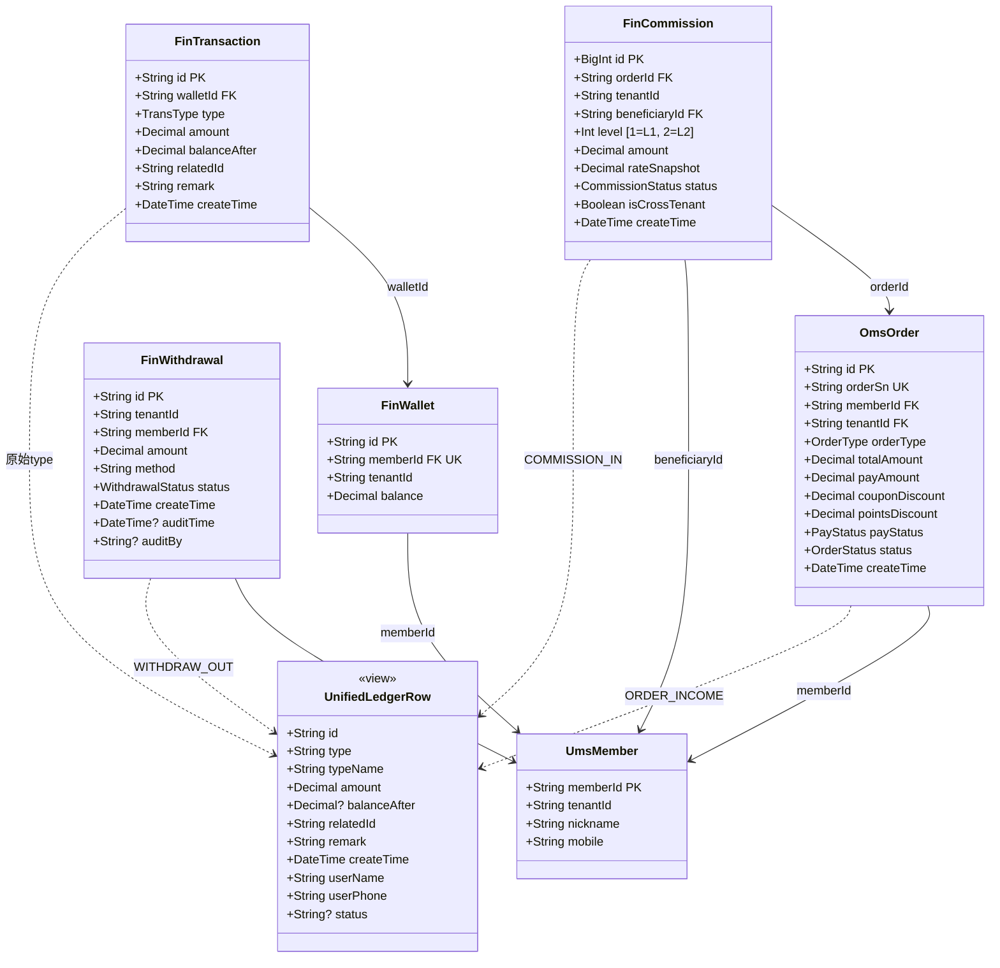
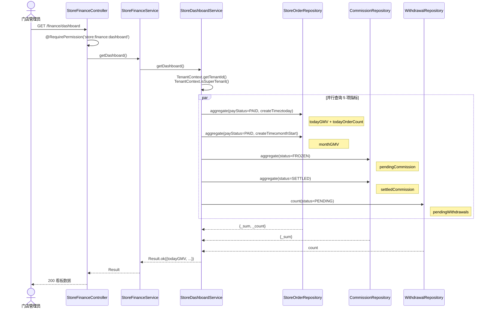
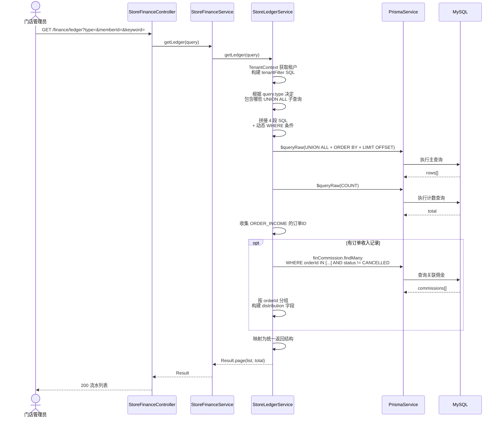
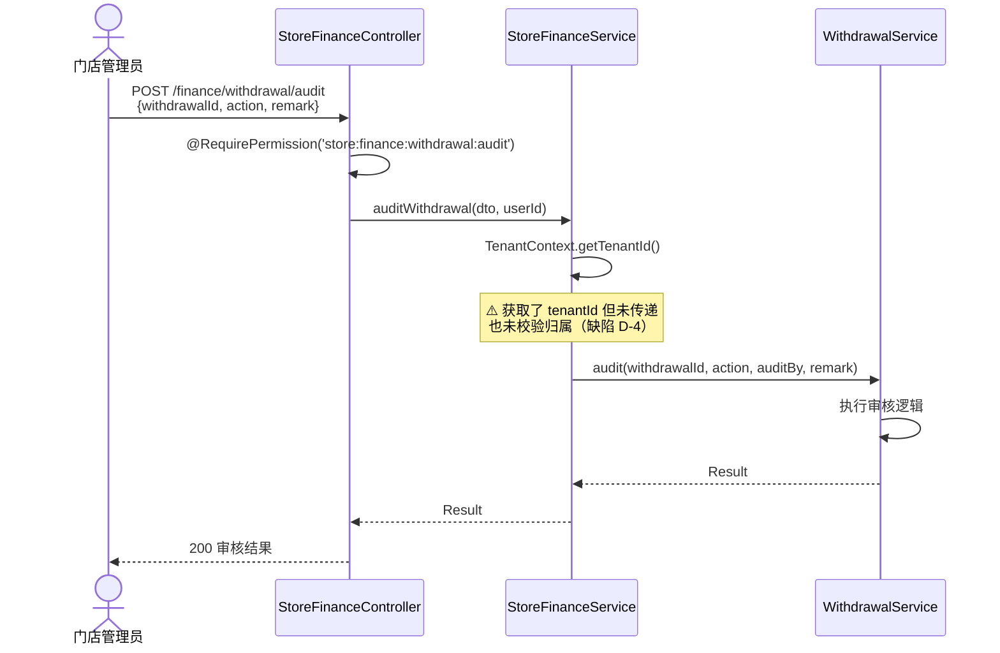
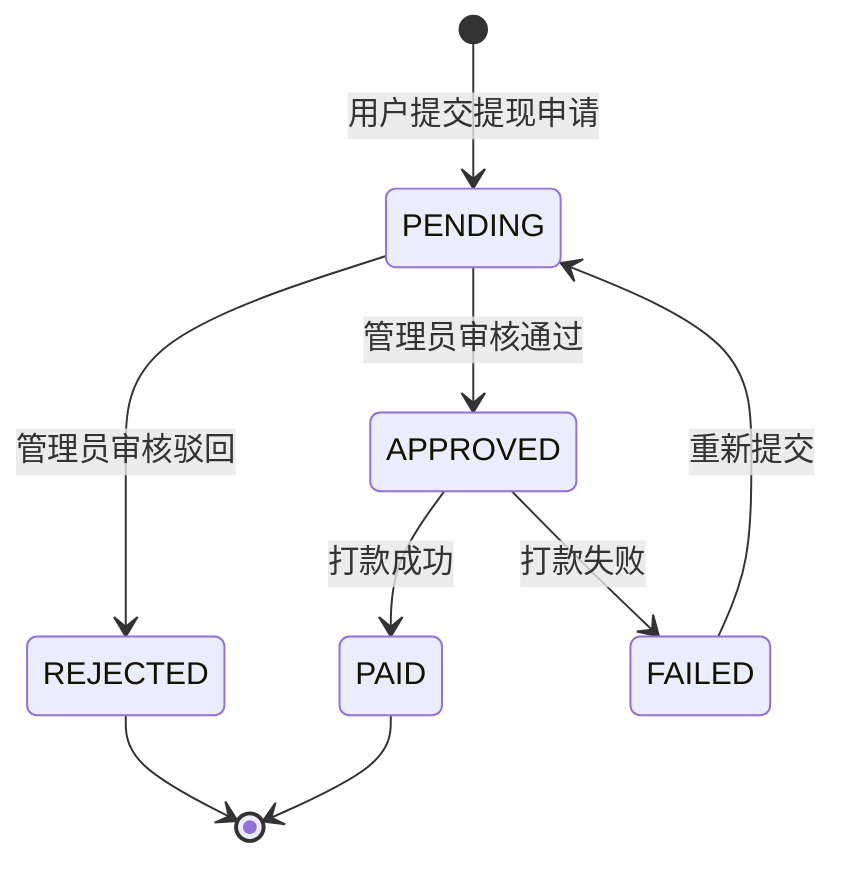
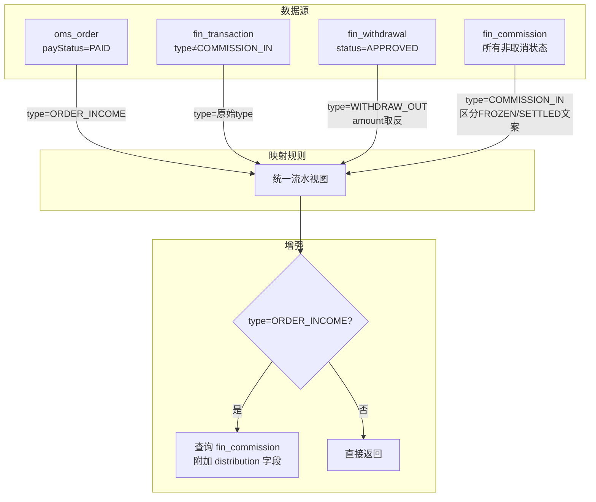
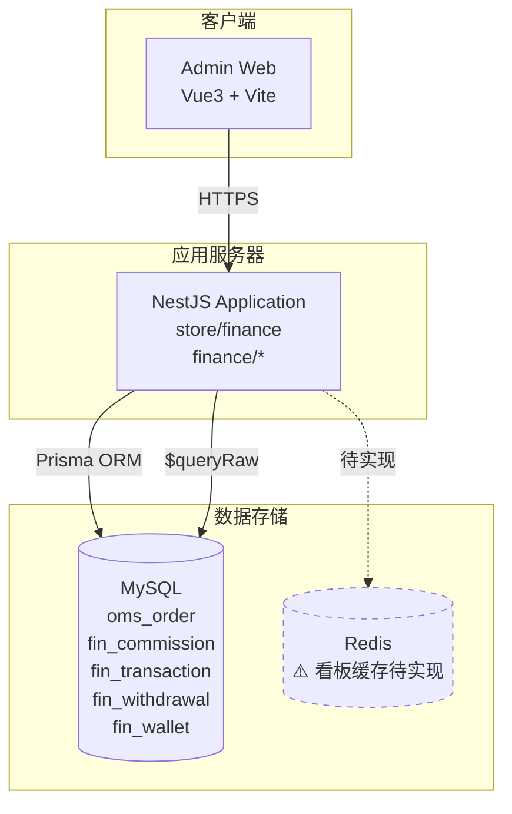
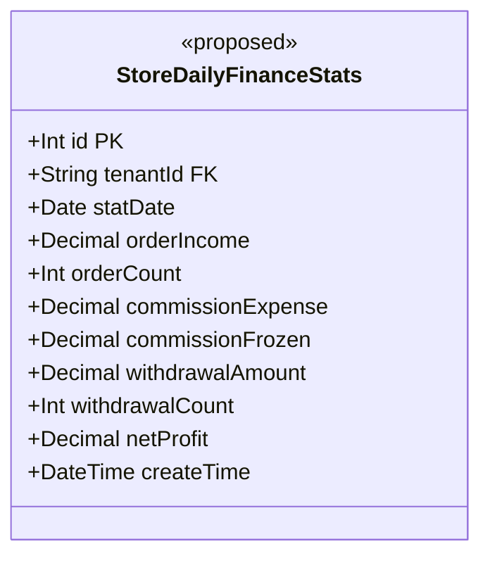
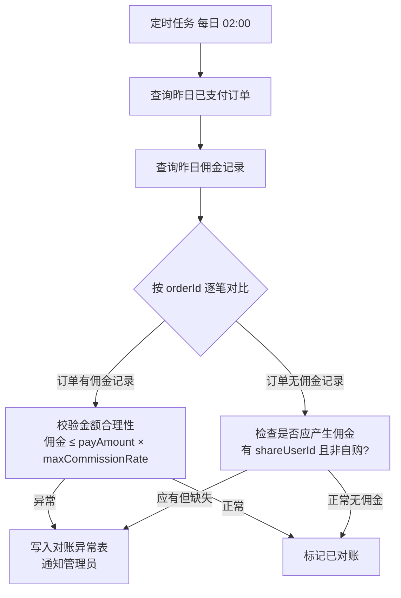

# 门店财务管理模块 — 设计文档

> 版本：1.0
> 日期：2026-02-22
> 模块路径：`src/module/store/finance`
> 需求文档：[finance-requirements.md](../../../requirements/store/finance/finance-requirements.md)
> 状态：现状架构分析 + 改进方案设计

---

## 1. 概述

### 1.1 设计目标

1. 完整描述门店财务模块的当前技术架构、Facade 模式拆分、数据流
2. 针对需求文档中识别的 9 个代码缺陷（D-1 ~ D-9）和 6 个架构不足（A-1 ~ A-6），给出具体改进方案
3. 为中长期演进（利润趋势、自动对账、预聚合表）提供技术设计

### 1.2 约束

| 约束     | 说明                                                           |
| -------- | -------------------------------------------------------------- |
| 框架     | NestJS + Prisma ORM + MySQL                                    |
| 多租户   | 超管（tenantId=000000）可跨租户查看，普通租户严格隔离          |
| 原生 SQL | 流水查询使用 `Prisma.$queryRaw` + `UNION ALL`，非 ORM 查询     |
| 外部依赖 | 提现审核委托给 `finance/withdrawal` 模块的 `WithdrawalService` |
| 导出     | 使用 `ExportTable` 工具函数生成 Excel，同步响应                |

---

## 2. 架构与模块（组件图）

> 图 1：门店财务模块组件图



**组件说明**：

| 组件                          | 职责                                               | 模式            |
| ----------------------------- | -------------------------------------------------- | --------------- |
| `StoreFinanceController`      | HTTP 接口层，权限校验（`@RequirePermission`）      | Controller      |
| `StoreFinanceService`         | 统一入口，分发请求到子服务                         | Facade          |
| `StoreDashboardService`       | 看板统计（5 项并行聚合）、佣金统计（3 项并行聚合） | 聚合查询        |
| `StoreCommissionQueryService` | 佣金明细分页查询，关联受益人和订单信息             | Repository 分页 |
| `StoreLedgerService`          | 4 表 UNION ALL 统一流水、流水统计、Excel 导出      | 原生 SQL        |
| `WithdrawalService`           | 提现列表查询、审核操作（外部模块）                 | 委托调用        |

**依赖方向**：`Controller` → `Facade` → `子服务` → `Repository/PrismaService`。`StoreLedgerService` 直接使用 `PrismaService.$queryRaw` 绕过 Repository 层。

---

## 3. 领域/数据模型（类图）

> 图 2：门店财务模块涉及的数据模型类图



**说明**：`UnifiedLedgerRow` 是 `StoreLedgerService` 通过 UNION ALL 构建的虚拟视图，不对应实际数据库表。4 个数据源通过字段映射统一为相同结构。

---

## 4. 核心流程时序（时序图）

### 4.1 资金看板查询

> 图 3：资金看板时序图



### 4.2 统一流水查询

> 图 4：统一流水查询时序图



### 4.3 提现审核

> 图 5：提现审核时序图



---

## 5. 状态与流程

### 5.1 提现状态机

> 图 6：提现记录状态图



### 5.2 流水类型状态映射

> 图 7：流水类型与来源状态映射活动图



---

## 6. 部署架构（部署图）

> 图 8：门店财务模块部署架构图



**部署说明**：

| 组件   | 说明                                                                                |
| ------ | ----------------------------------------------------------------------------------- |
| NestJS | 看板使用 Repository 聚合查询，流水使用 `$queryRaw` 原生 SQL                         |
| MySQL  | `fin_commission` 和 `oms_order` 为大表（D2-D3 级别），流水 UNION ALL 查询需关注性能 |
| Redis  | 当前未使用，建议为看板接口增加 30 秒缓存（改进 D-8）                                |

---

## 7. 缺陷改进方案

### 7.1 D-1：流水查询深分页保护

**现状**：`LIMIT ${query.take} OFFSET ${query.skip}` 无上限。

**改进方案**：

```typescript
// ListLedgerDto 中增加校验
async getLedger(query: ListLedgerDto) {
  const offset = (query.pageNum - 1) * query.pageSize;
  BusinessException.throwIf(offset > 5000, '查询范围过大，请缩小时间范围或使用筛选条件');
  // ...
}
```

**长期方案**：引入游标分页（基于 `create_time` + `id` 复合游标），替代 offset 分页。

### 7.2 D-2：流水导出数量限制

**现状**：`exportLedger` 的 SQL 无 `LIMIT`。

**改进方案**：

```typescript
async exportLedger(res: Response, query: ListLedgerDto) {
  // 先查总数
  const countResult = await this.prisma.$queryRaw<[{total: bigint}]>(countQuery);
  const total = Number(countResult[0]?.total || 0);

  BusinessException.throwIf(total > 10000, '导出数据超过10000条，请缩小查询范围');

  // 加 LIMIT 保护
  const finalQuery = Prisma.sql`
    SELECT * FROM (...) AS unified_ledger
    ORDER BY create_time DESC
    LIMIT 10000
  `;
}
```

### 7.3 D-3：流水统计排除已取消佣金

**现状**：`getLedgerStats` 中佣金子查询未过滤 `CANCELLED` 状态。

**改进方案**：

```sql
-- 佣金子查询增加条件
FROM fin_commission c
WHERE ${tenantFilter}
  AND c.status != 'CANCELLED'  -- 新增
```

### 7.4 D-4：提现审核租户归属校验

**现状**：`auditWithdrawal` 获取了 `tenantId` 但未使用。

**改进方案**：

```typescript
async auditWithdrawal(dto: AuditWithdrawalDto, auditBy: string) {
  const tenantId = TenantContext.getTenantId();
  const isSuper = TenantContext.isSuperTenant();

  // 校验提现记录归属
  if (!isSuper) {
    const withdrawal = await this.withdrawalService.findById(dto.withdrawalId);
    BusinessException.throwIf(
      withdrawal?.tenantId !== tenantId,
      '无权审核其他门店的提现申请'
    );
  }

  return await this.withdrawalService.audit(dto.withdrawalId, dto.action, auditBy, dto.remark);
}
```

### 7.5 D-6：佣金查询 phone 参数生效

**现状**：`getCommissionList` 中 `query.phone` 未构建 where 条件。

**改进方案**：

```typescript
if (query.phone) {
  where.beneficiary = {
    ...(where.beneficiary as any),
    mobile: { contains: query.phone },
  };
}
```

### 7.6 D-8：看板接口缓存

**改进方案**：

```typescript
@Injectable()
export class StoreDashboardService {
  constructor(
    // ...
    @Inject(CACHE_MANAGER) private cacheManager: Cache,
  ) {}

  async getDashboard() {
    const tenantId = TenantContext.getTenantId();
    const cacheKey = `store:finance:dashboard:${tenantId}`;

    const cached = await this.cacheManager.get(cacheKey);
    if (cached) return Result.ok(cached);

    // ... 原有查询逻辑 ...

    await this.cacheManager.set(cacheKey, data, 30); // 30秒 TTL
    return Result.ok(data);
  }
}
```

### 7.7 D-9：流水 SQL 抽取共享

**现状**：`getLedger` 和 `exportLedger` 中 4 段 UNION ALL SQL 几乎完全重复。

**改进方案**：

```typescript
/**
 * 构建统一流水 UNION ALL 子查询
 * getLedger 和 exportLedger 共用
 */
private buildUnionQueries(
  tenantFilter: Prisma.Sql,
  query: ListLedgerDto,
  options: { includeUserId?: boolean } = {},
): Prisma.Sql[] {
  const unionQueries: Prisma.Sql[] = [];
  const { startTime, endTime } = this.parseDateRange(query);

  if (this.shouldInclude(query.type, 'ORDER_INCOME')) {
    unionQueries.push(this.buildOrderIncomeQuery(tenantFilter, query, startTime, endTime, options));
  }
  // ... 其余 3 段同理
  return unionQueries;
}
```

---

## 8. 架构改进方案

### 8.1 A-1 + A-4：流水预聚合表

**问题**：UNION ALL 实时查询 4 表，随数据增长性能不可控。

**方案**：引入 `store_daily_finance_stats` 预聚合表，定时任务每日凌晨汇总。



**使用场景**：

- 利润趋势图：直接查询预聚合表，按日/周/月 GROUP BY
- 看板中的"本月 GMV"：从预聚合表 SUM，仅当日数据实时查询补充
- 流水列表：仍使用 UNION ALL（明细查询无法预聚合）

### 8.2 A-3：自动对账

**方案**：定时任务每日对比订单收入与佣金支出，发现差异时写入对账异常表并通知。



### 8.3 A-6：异步导出

**方案**：大数据量导出改为异步任务 + 下载中心。

1. 用户点击导出 → 创建导出任务记录（状态 PENDING）
2. Bull 队列异步执行导出 → 生成文件上传到 OSS
3. 完成后更新任务状态为 COMPLETED，记录下载链接
4. 用户在"下载中心"查看历史导出任务并下载

---

## 9. 接口/数据约定

### 9.1 现有接口约定

| 接口     | 方法 | 路径                        | 租户类型     | QPS 档位 | 大表                            |
| -------- | ---- | --------------------------- | ------------ | -------- | ------------------------------- |
| 资金看板 | GET  | `/finance/dashboard`        | TenantScoped | 中       | 是（oms_order, fin_commission） |
| 佣金列表 | GET  | `/finance/commission/list`  | TenantScoped | 中       | 是（fin_commission）            |
| 佣金统计 | GET  | `/finance/commission/stats` | TenantScoped | 中       | 是（fin_commission）            |
| 提现列表 | GET  | `/finance/withdrawal/list`  | TenantScoped | 低       | 否                              |
| 提现审核 | POST | `/finance/withdrawal/audit` | TenantScoped | 低       | 否                              |
| 流水列表 | GET  | `/finance/ledger`           | TenantScoped | 中       | 是（4 表 UNION）                |
| 流水统计 | GET  | `/finance/ledger/stats`     | TenantScoped | 中       | 是（4 表 UNION）                |
| 流水导出 | POST | `/finance/ledger/export`    | TenantScoped | 低       | 是（4 表 UNION）                |

### 9.2 提议新增接口

| 接口         | 方法 | 路径                                  | 说明                   | 优先级 |
| ------------ | ---- | ------------------------------------- | ---------------------- | ------ |
| 利润趋势     | GET  | `/finance/dashboard/profit-trend`     | 按日/周/月聚合利润数据 | P1     |
| 佣金趋势     | GET  | `/finance/dashboard/commission-trend` | 按日/周/月聚合佣金支出 | P2     |
| 对账异常列表 | GET  | `/finance/reconciliation/list`        | 查询对账异常记录       | P2     |
| 触发对账     | POST | `/finance/reconciliation/trigger`     | 手动触发指定日期对账   | P2     |
| 创建导出任务 | POST | `/finance/export/create`              | 异步导出，返回任务ID   | P2     |
| 导出任务列表 | GET  | `/finance/export/list`                | 查询导出历史           | P2     |
| 下载导出文件 | GET  | `/finance/export/download/:id`        | 下载已完成的导出文件   | P2     |

### 9.3 统一流水返回结构

```typescript
interface LedgerRow {
  id: string; // 格式: "order-{id}" | "trans-{id}" | "withdraw-{id}" | "commission-{id}"
  type: string; // ORDER_INCOME | COMMISSION_IN | WITHDRAW_OUT | 其他 TransType
  typeName: string; // 中文显示名
  amount: number; // 正数=收入, 负数=支出
  balanceAfter: number | null; // 交易后余额（订单收入无此字段）
  relatedId: string; // 关联单号
  remark: string; // 备注
  createTime: string; // ISO 时间
  status: string | null; // 佣金状态（仅 COMMISSION_IN 有值）
  user: {
    nickname: string;
    mobile: string;
  };
  distribution?: {
    // 仅 ORDER_INCOME 有此字段
    referrer?: { nickname: string; mobile: string; amount: number; status: string };
    indirectReferrer?: { nickname: string; mobile: string; amount: number; status: string };
  };
}
```

---

## 10. 改进优先级总览

| 优先级 | 编号 | 改进项                              | 工时 | 对应缺陷/不足 |
| ------ | ---- | ----------------------------------- | ---- | ------------- |
| P0     | I-1  | 流水查询深分页保护（offset ≤ 5000） | 1h   | D-1           |
| P0     | I-2  | 流水导出数量限制（≤ 10000 条）      | 1h   | D-2           |
| P1     | I-3  | 流水统计排除已取消佣金              | 0.5h | D-3           |
| P1     | I-4  | 提现审核租户归属校验                | 1h   | D-4           |
| P1     | I-5  | 佣金查询 phone 参数生效             | 0.5h | D-6           |
| P2     | I-6  | 看板接口 Redis 缓存（30s TTL）      | 1h   | D-8           |
| P2     | I-7  | 流水 SQL 抽取共享方法               | 2h   | D-9           |
| P1     | I-8  | 利润趋势分析 + 预聚合表             | 3-5d | A-1, A-4      |
| P2     | I-9  | 自动对账定时任务                    | 3-5d | A-3           |
| P2     | I-10 | 异步导出 + 下载中心                 | 2-3d | A-6           |
| P3     | I-11 | 财务预警机制                        | 2-3d | A-2           |
| P3     | I-12 | 多维度报表                          | 5-7d | A-1           |
