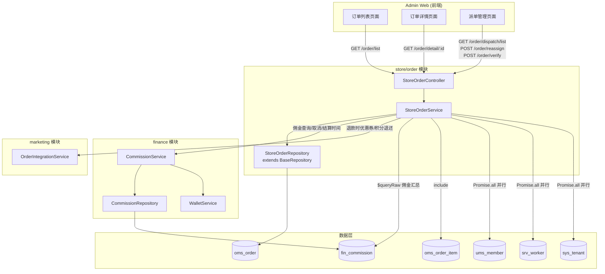
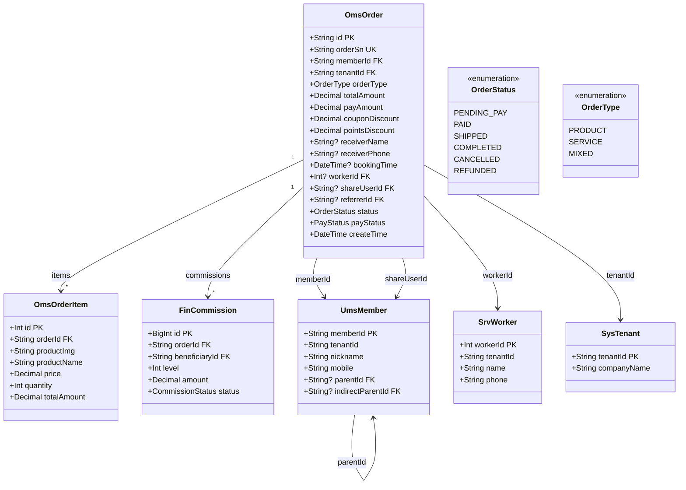
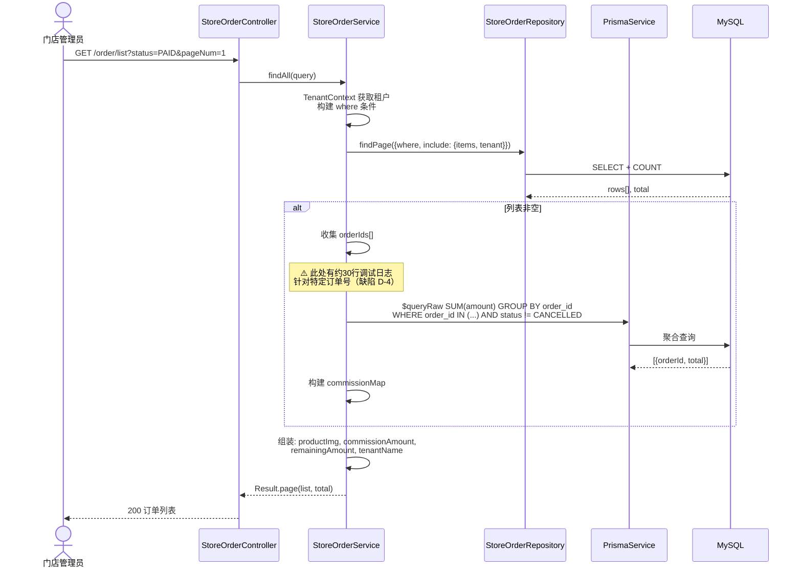
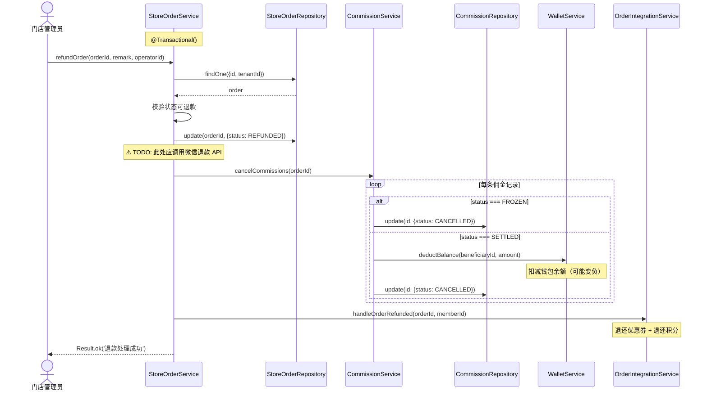
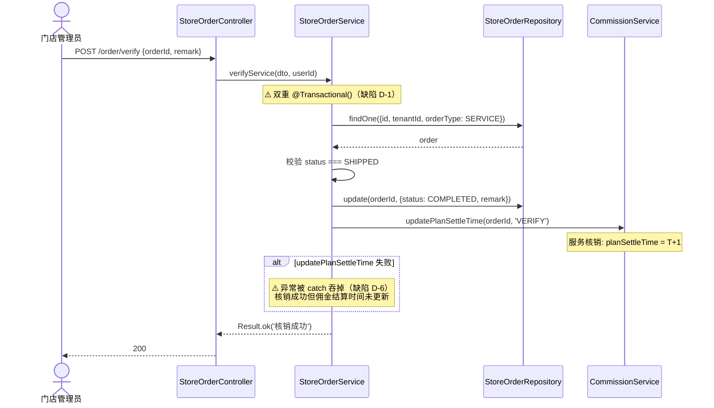
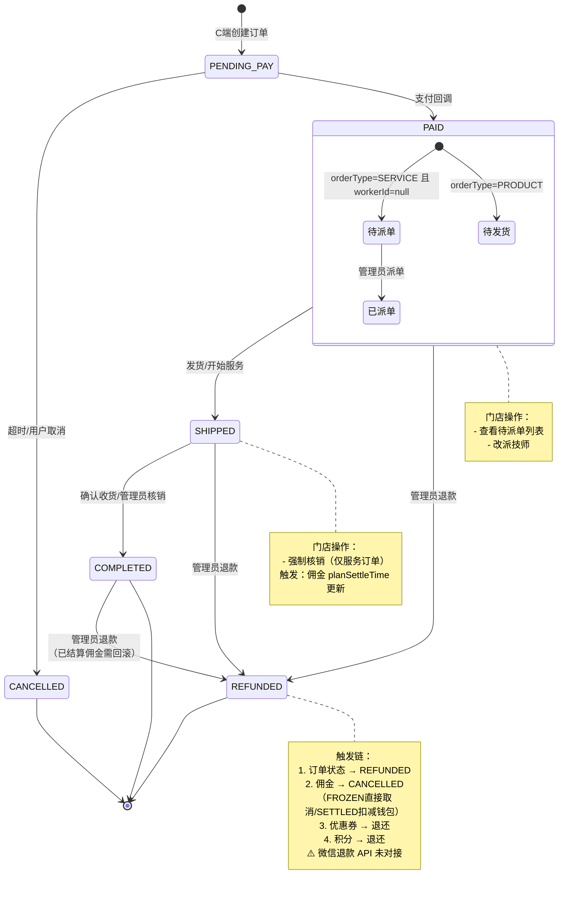
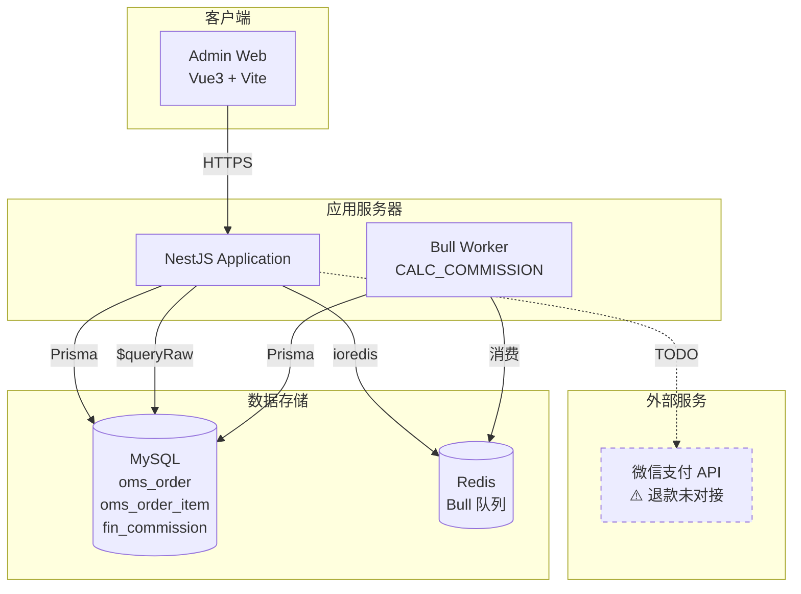
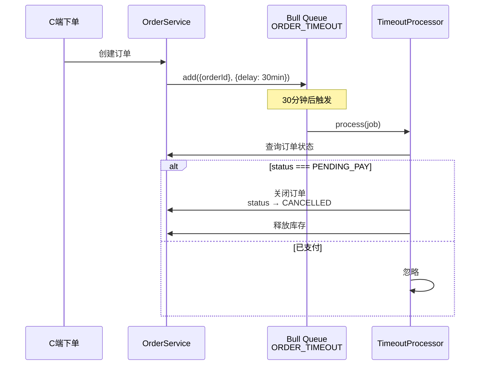
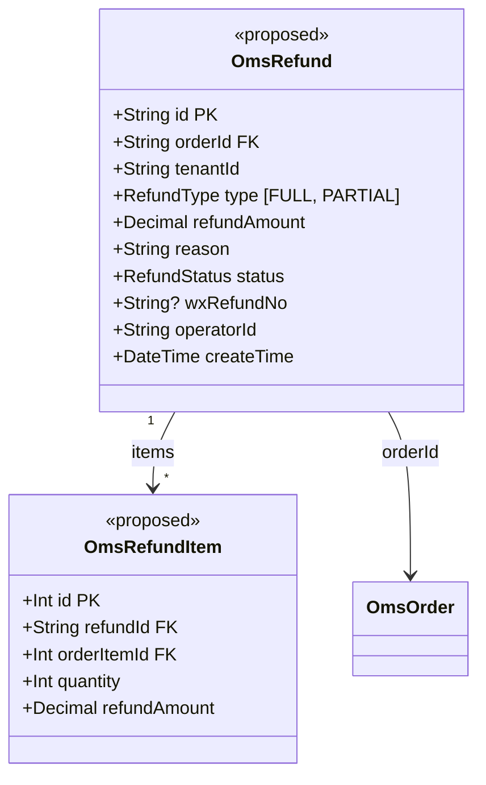

# 门店订单管理模块 — 设计文档

> 版本：1.0
> 日期：2026-02-22
> 模块路径：`src/module/store/order`
> 需求文档：[order-requirements.md](../../../requirements/store/order/order-requirements.md)
> 状态：现状架构分析 + 改进方案设计

---

## 1. 概述

### 1.1 设计目标

1. 完整描述门店订单模块的当前技术架构、数据流、跨模块协作
2. 针对需求文档中识别的 9 个代码缺陷（D-1 ~ D-9）和 7 个架构不足（A-1 ~ A-7），给出具体改进方案
3. 为中长期演进（微信退款、订单超时、部分退款、售后）提供技术设计

### 1.2 约束

| 约束     | 说明                                                                  |
| -------- | --------------------------------------------------------------------- |
| 框架     | NestJS + Prisma ORM + MySQL                                           |
| 多租户   | 超管可跨租户查看，普通租户通过 `TenantContext` 严格隔离               |
| 事务     | `@Transactional()` 装饰器保证状态更新与佣金操作的原子性               |
| 外部依赖 | `CommissionService`（佣金）、`OrderIntegrationService`（优惠券/积分） |
| 支付     | ⚠️ 微信支付退款 API 未对接，退款仅更新状态                            |

---

## 2. 架构与模块（组件图）

> 图 1：门店订单模块组件图



**组件说明**：

| 组件                      | 职责                                                               |
| ------------------------- | ------------------------------------------------------------------ |
| `StoreOrderController`    | HTTP 接口层，权限校验（`@RequirePermission`）                      |
| `StoreOrderService`       | 核心业务：列表查询（含佣金汇总）、详情画像、派单/改派、核销、退款  |
| `StoreOrderRepository`    | 继承 `BaseRepository`，封装 `omsOrder` CRUD + `aggregate` 聚合方法 |
| `CommissionService`       | 佣金查询、取消/回滚、结算时间更新（外部模块）                      |
| `OrderIntegrationService` | 退款时触发优惠券退还和积分退还（外部模块）                         |

**依赖方向**：`StoreOrder` → `Finance`（佣金）、`StoreOrder` → `Marketing`（积分/优惠券）。

---

## 3. 领域/数据模型（类图）

> 图 2：门店订单模块涉及的数据模型类图



---

## 4. 核心流程时序（时序图）

### 4.1 订单列表查询（含佣金汇总）

> 图 3：订单列表查询时序图



### 4.2 退款流程（跨模块）

> 图 4：订单退款时序图



### 4.3 强制核销流程

> 图 5：强制核销时序图



---

## 5. 状态与流程

### 5.1 订单完整状态机

> 图 6：订单状态图（含门店端操作触发点）



---

## 6. 部署架构（部署图）

> 图 7：门店订单模块部署架构图



---

## 7. 缺陷改进方案

### 7.1 D-1：移除重复 `@Transactional()`

**现状**：`verifyService` 方法上有两个 `@Transactional()` 装饰器。

**改进**：删除重复的装饰器，保留一个。

```typescript
@Transactional()
async verifyService(dto: VerifyServiceDto, operatorId: string) {
  // ...
}
```

**工时**：0.1h

### 7.2 D-2 + A-7：暴露退款 HTTP 接口

**现状**：`refundOrder` 仅为内部方法。

**改进**：在 Controller 中增加路由。

```typescript
@Post('refund')
@Api({ summary: '订单退款' })
@RequirePermission('store:order:refund')
@Operlog({ businessType: BusinessType.UPDATE })
async refundOrder(
  @Body() dto: RefundOrderDto,
  @User('userId') userId: string,
) {
  return this.storeOrderService.refundOrder(dto.orderId, dto.remark, userId);
}
```

新增 DTO：

```typescript
export class RefundOrderDto {
  @ApiProperty({ description: '订单ID' })
  @IsString()
  orderId: string;

  @ApiProperty({ description: '退款原因', required: false })
  @IsOptional()
  @IsString()
  remark?: string;
}
```

**工时**：1h

### 7.3 D-4：清理调试日志

**现状**：`findAll` 中约 30 行针对订单号 `202602031020VJSIA849` 的调试代码。

**改进**：删除所有 `debugOrder` 相关代码块和额外的 `$queryRaw` 调试查询。保留必要的业务日志。

**工时**：0.5h

### 7.4 D-6 + D-7：关键副作用失败处理

**现状**：核销后佣金结算时间更新、退款后佣金取消和积分退还失败被静默吞掉。

**改进方案**：

方案 A（推荐）：关键操作失败时抛出异常，让事务回滚。

```typescript
// verifyService 中
await this.commissionService.updatePlanSettleTime(dto.orderId, 'VERIFY');
// 移除 try-catch，让异常传播

// refundOrder 中 - 佣金取消是关键操作，必须成功
await this.commissionService.cancelCommissions(orderId);
// 移除 try-catch

// 积分/优惠券退还可以容忍失败（非资金操作），保留 try-catch 但增加重试
try {
  await this.orderIntegrationService.handleOrderRefunded(orderId, order!.memberId);
} catch (error) {
  this.logger.error(`Handle order refunded failed, will retry`, getErrorMessage(error));
  // 加入重试队列
  await this.retryQueue.add('ORDER_REFUND_SIDE_EFFECTS', { orderId, memberId: order!.memberId });
}
```

方案 B：所有副作用通过事件驱动异步执行，保证最终一致性。

**工时**：2h

### 7.5 D-9：改派技师增加操作日志

**改进**：

```typescript
@Post('reassign')
@Api({ summary: '改派技师' })
@RequirePermission('store:order:dispatch')
@Operlog({ businessType: BusinessType.UPDATE })  // 新增
async reassignWorker(@Body() dto: ReassignWorkerDto, @User('userId') userId: string) {
  return this.storeOrderService.reassignWorker(dto, userId);
}
```

**工时**：0.5h

---

## 8. 架构改进方案

### 8.1 A-4：订单超时自动处理

**方案**：使用 Bull 延迟任务。



**配置**：

- 未支付订单：30 分钟自动关闭
- 待核销服务订单：超过预约时间 24 小时提醒管理员

### 8.2 A-3：部分退款

**数据模型扩展**：



**流程**：

1. 管理员选择退款商品和数量
2. 系统计算退款金额（含优惠分摊）
3. 调用微信部分退款 API
4. 按比例回滚对应佣金
5. 按比例退还积分（优惠券不退还，因为部分退款后订单仍有效）

---

## 9. 接口/数据约定

### 9.1 现有接口约定

| 接口       | 方法 | 路径                   | 租户类型     | QPS 档位 | 大表                                  |
| ---------- | ---- | ---------------------- | ------------ | -------- | ------------------------------------- |
| 订单列表   | GET  | `/order/list`          | TenantScoped | 中       | 是（oms_order + fin_commission 聚合） |
| 订单详情   | GET  | `/order/detail/:id`    | TenantScoped | 中       | 否（单条查询）                        |
| 待派单列表 | GET  | `/order/dispatch/list` | TenantScoped | 低       | 否                                    |
| 改派技师   | POST | `/order/reassign`      | TenantScoped | 低       | 否                                    |
| 强制核销   | POST | `/order/verify`        | TenantScoped | 低       | 否                                    |

### 9.2 提议新增接口

| 接口     | 方法 | 路径                    | 说明               | 优先级 |
| -------- | ---- | ----------------------- | ------------------ | ------ |
| 订单退款 | POST | `/order/refund`         | 暴露退款 HTTP 入口 | P0     |
| 订单导出 | POST | `/order/export`         | Excel 导出         | P1     |
| 批量核销 | POST | `/order/verify/batch`   | 批量强制核销       | P2     |
| 批量发货 | POST | `/order/ship/batch`     | 批量发货           | P2     |
| 部分退款 | POST | `/order/refund/partial` | 按商品维度部分退款 | P1     |

---

## 10. 改进优先级总览

| 优先级 | 编号 | 改进项                      | 工时 | 对应缺陷/不足 |
| ------ | ---- | --------------------------- | ---- | ------------- |
| P0     | I-1  | 移除重复 `@Transactional()` | 0.1h | D-1           |
| P0     | I-2  | 清理硬编码调试日志          | 0.5h | D-4           |
| P0     | I-3  | 暴露退款 HTTP 接口          | 1h   | D-2, A-7      |
| P0     | I-4  | 对接微信退款 API            | 3-5d | D-3           |
| P1     | I-5  | 关键副作用失败处理策略      | 2h   | D-6, D-7      |
| P1     | I-6  | 改派技师增加操作日志        | 0.5h | D-9           |
| P1     | I-7  | 详情佣金排除 CANCELLED      | 0.5h | D-8           |
| P1     | I-8  | 订单超时自动关闭            | 2-3d | A-4           |
| P1     | I-9  | 部分退款                    | 3-5d | A-3           |
| P2     | I-10 | 订单导出                    | 1-2d | A-2           |
| P2     | I-11 | 批量操作                    | 2-3d | A-1           |
| P3     | I-12 | 售后工单系统                | 5-7d | A-3           |
| P3     | I-13 | 物流跟踪集成                | 3-5d | A-5           |
