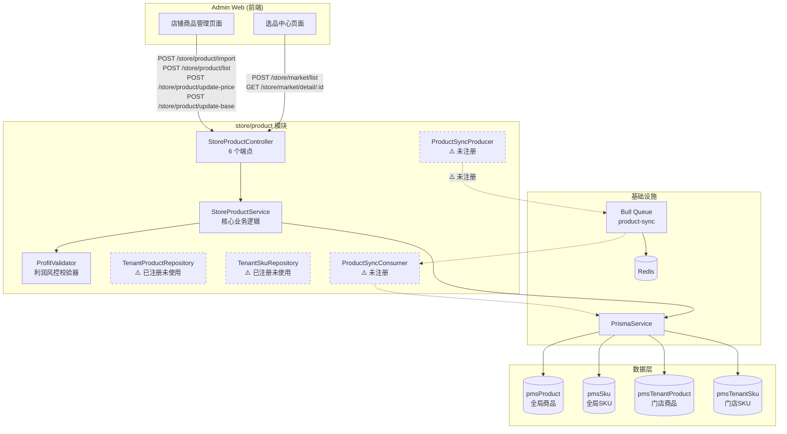
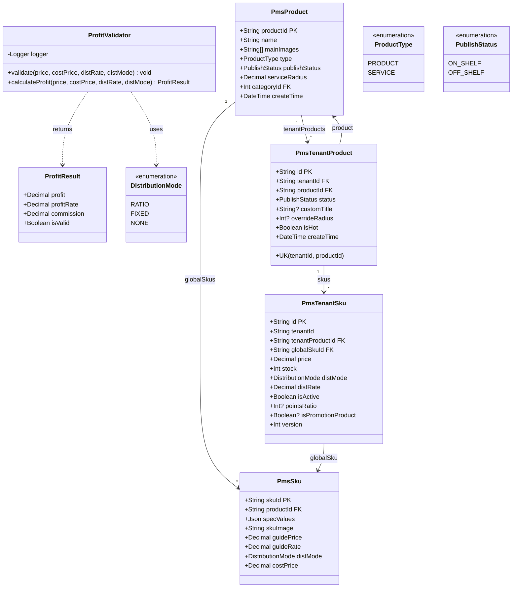
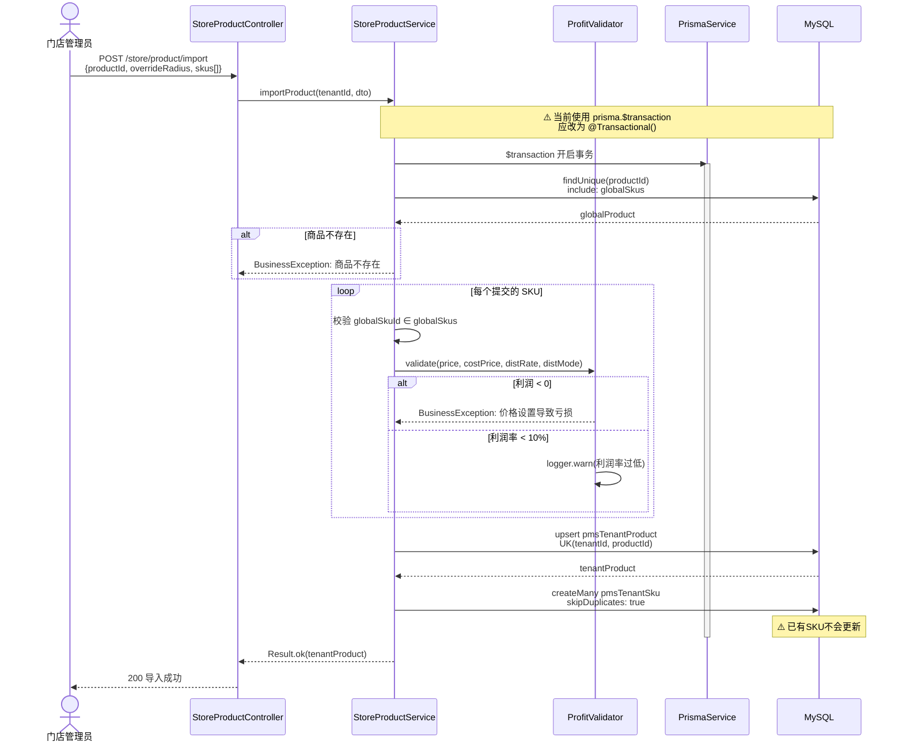
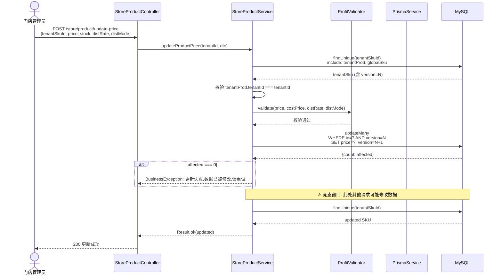
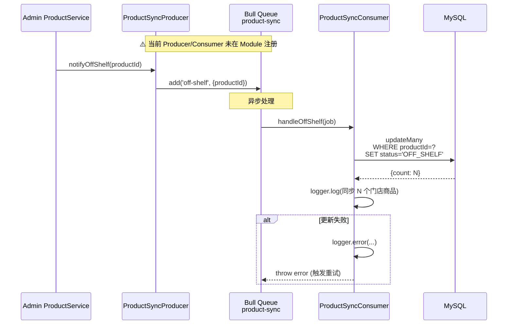
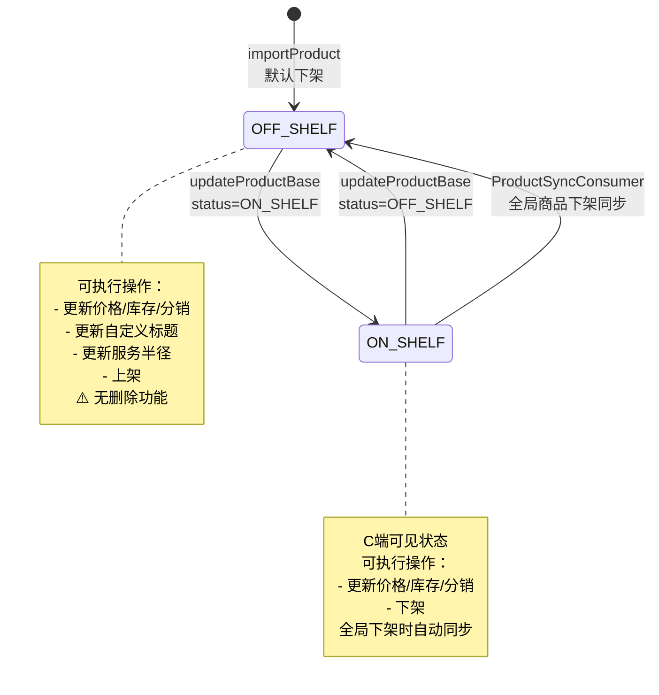
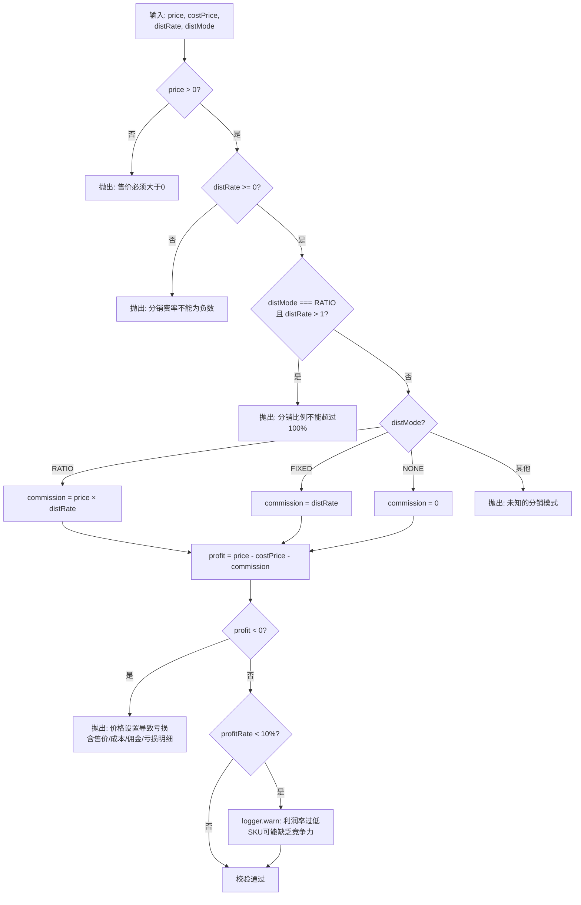
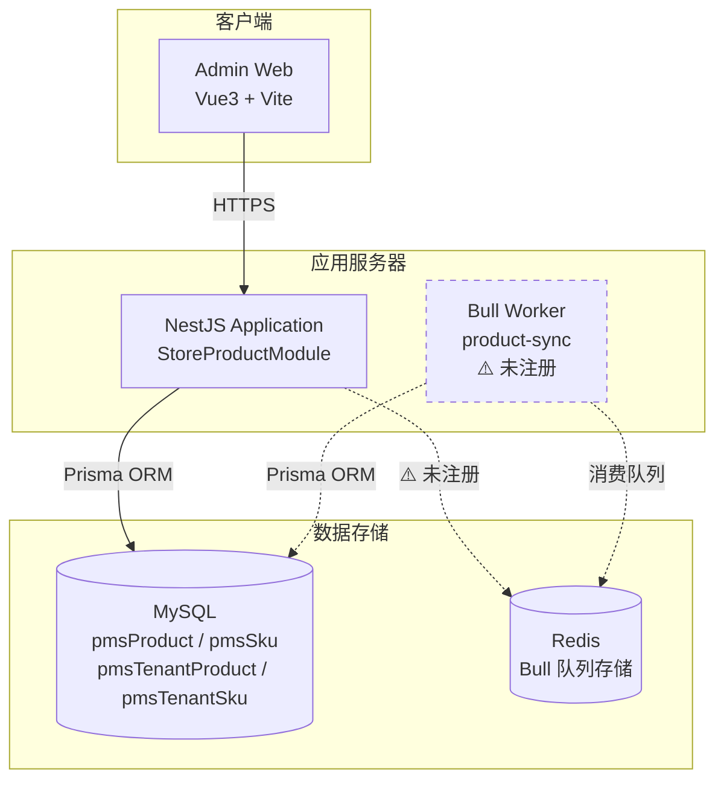
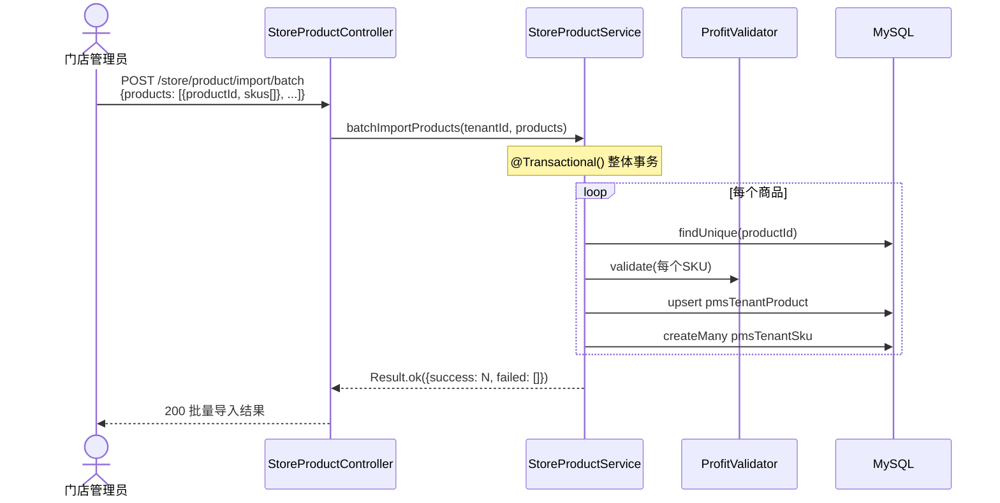
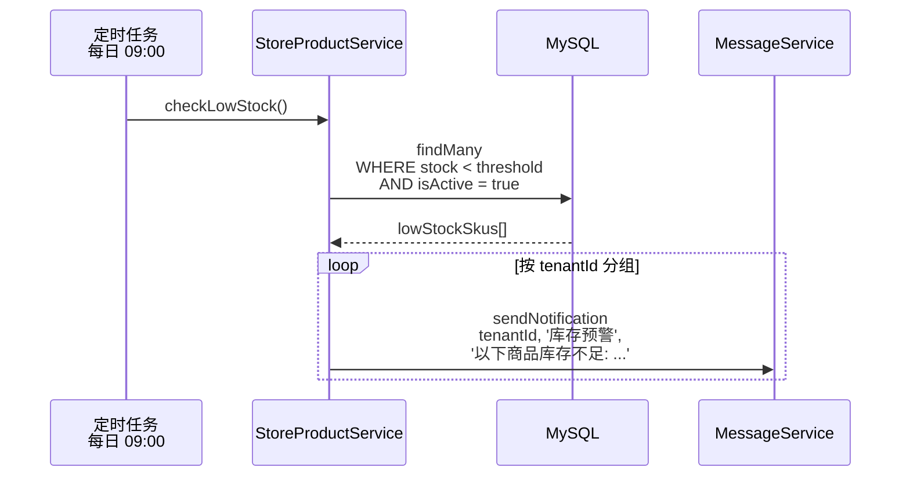

# 门店商品管理模块 — 设计文档

> 版本：1.0
> 日期：2026-02-22
> 模块路径：`src/module/store/product`
> 需求文档：[product-requirements.md](../../../requirements/store/product/product-requirements.md)
> 状态：现状架构分析 + 改进方案设计

---

## 1. 概述

### 1.1 设计目标

1. 完整描述门店商品模块的当前技术架构、数据流、跨模块协作
2. 针对需求文档中识别的 9 个代码缺陷（D-1 ~ D-9）和 6 个架构不足（A-1 ~ A-6），给出具体改进方案
3. 为中长期演进（批量导入、SKU 同步、库存预警、商品分析）提供技术设计

### 1.2 约束

| 约束     | 说明                                                                        |
| -------- | --------------------------------------------------------------------------- |
| 框架     | NestJS + Prisma ORM + MySQL                                                 |
| 多租户   | 门店管理员通过 `@CurrentTenant()` 获取租户 ID，HQ 可通过 `storeId` 跨店查询 |
| 事务     | 项目约定使用 `@Transactional()` 装饰器（基于 CLS 上下文）                   |
| 队列     | Bull + Redis，用于异步同步任务                                              |
| 并发控制 | 乐观锁（`version` 字段），冲突率预期 < 1%                                   |
| 利润风控 | `ProfitValidator` 强制校验 `售价 - 成本 - 佣金 ≥ 0`                         |

---

## 2. 架构与模块（组件图）

> 图 1：门店商品模块组件图



**组件说明**：

| 组件                           | 职责                                                  | 当前问题                                    |
| ------------------------------ | ----------------------------------------------------- | ------------------------------------------- |
| `StoreProductController`       | HTTP 接口层，参数校验                                 | 缺少 `@RequirePermission` 装饰器            |
| `StoreProductService`          | 核心业务：选品浏览、商品导入、价格更新、基础信息更新  | 直接使用 `PrismaService`，未通过 Repository |
| `ProfitValidator`              | 利润风控：参数校验 → 佣金计算 → 利润校验 → 利润率预警 | 正常工作                                    |
| `TenantProductRepository`      | 封装门店商品复杂查询（含关联）                        | 已注册但未被 Service 调用                   |
| `TenantSkuRepository`          | 封装门店 SKU 操作（含乐观锁、库存原子操作）           | 已注册但未被 Service 调用                   |
| `ProductSyncProducer/Consumer` | Bull 队列：全局商品下架 → 门店商品自动下架            | 未在 Module 中注册，功能不可用              |

**依赖方向**：`StoreProduct` → `PrismaService`（数据层）。当前模块无外部模块依赖，是相对独立的模块。

---

## 3. 领域/数据模型（类图）

> 图 2：门店商品模块数据模型类图



**模型说明**：

- `PmsProduct` ↔ `PmsTenantProduct`：一对多映像关系，通过 `productId` 关联。唯一约束 `UK(tenantId, productId)` 保证同一门店不会重复导入同一商品。
- `PmsSku` ↔ `PmsTenantSku`：一对多映像关系，通过 `globalSkuId` 关联。门店 SKU 存储自定义售价、库存和分销配置。
- `ProfitValidator`：无状态服务，接收售价、成本、费率、模式四个参数，返回利润校验结果。
- `version` 字段：`PmsTenantSku` 上的乐观锁版本号，每次更新 +1，并发冲突时拒绝更新。

---

## 4. 核心流程时序（时序图）

### 4.1 商品导入流程（含事务和利润校验）

> 图 3：商品导入时序图



### 4.2 价格更新流程（含乐观锁）

> 图 4：价格更新时序图



### 4.3 全局商品下架同步流程

> 图 5：全局商品下架同步时序图



---

## 5. 状态与流程

### 5.1 门店商品状态机

> 图 6：门店商品状态图



### 5.2 利润校验流程

> 图 7：ProfitValidator 校验活动图



---

## 6. 部署架构（部署图）

> 图 8：门店商品模块部署架构图



---

## 7. 缺陷改进方案

### 7.1 D-1：添加权限校验装饰器

**现状**：6 个 Controller 端点均无 `@RequirePermission` 装饰器。

**改进**：

```typescript
@Api({ summary: '选品中心列表', type: MarketProductVo, isPager: true })
@RequirePermission('store:product:market')
@Post('market/list')
getMarketList(@CurrentTenant() tenantId: string, @Body() query: ListMarketProductDto) {
  return this.productService.getMarketList(tenantId, query);
}

@Api({ summary: '选品中心-商品详情', type: MarketProductDetailVo })
@RequirePermission('store:product:market')
@Get('market/detail/:productId')
getMarketDetail(@CurrentTenant() tenantId: string, @Param('productId') productId: string) {
  return this.productService.getMarketDetail(tenantId, productId);
}

@Api({ summary: '导入商品' })
@RequirePermission('store:product:import')
@Operlog({ businessType: BusinessType.INSERT })
@Post('product/import')
importProduct(@Body() dto: ImportProductDto, @CurrentTenant() tenantId: string) {
  return this.productService.importProduct(tenantId, dto);
}

@Api({ summary: '店铺商品列表', type: StoreProductVo, isPager: true })
@RequirePermission('store:product:list')
@Post('product/list')
findAll(@CurrentTenant() tenantId: string, @Body() query: ListStoreProductDto) {
  return this.productService.findAll(tenantId, query);
}

@Api({ summary: '更新商品价格' })
@RequirePermission('store:product:update')
@Operlog({ businessType: BusinessType.UPDATE })
@Post('product/update-price')
updateProductPrice(@Body() dto: UpdateProductPriceDto, @CurrentTenant() tenantId: string) {
  return this.productService.updateProductPrice(tenantId, dto);
}

@Api({ summary: '更新商品基础信息' })
@RequirePermission('store:product:update')
@Operlog({ businessType: BusinessType.UPDATE })
@Post('product/update-base')
updateProductBase(@Body() dto: UpdateProductBaseDto, @CurrentTenant() tenantId: string) {
  return this.productService.updateProductBase(tenantId, dto);
}
```

**工时**：1h

### 7.2 D-2：改用 `@Transactional()` 装饰器

**现状**：`importProduct` 使用 `prisma.$transaction(async (tx) => { ... })`。

**改进**：

```typescript
@Transactional()
async importProduct(tenantId: string, dto: ImportProductDto) {
  const { productId, overrideRadius, skus } = dto;

  // 1. 检查全局商品
  const globalProduct = await this.prisma.pmsProduct.findUnique({
    where: { productId },
    include: { globalSkus: true },
  });
  BusinessException.throwIfNull(globalProduct, '商品不存在');

  // 2. 校验 SKU 有效性 + 利润校验（同现有逻辑）
  // ...

  // 3. upsert 创建/更新店铺商品
  const tenantProduct = await this.prisma.pmsTenantProduct.upsert({
    where: { tenantId_productId: { tenantId, productId } },
    create: { tenantId, productId, status: PublishStatus.OFF_SHELF, overrideRadius },
    update: { overrideRadius },
  });

  // 4. 批量创建 SKU
  if (skus?.length > 0) {
    await this.prisma.pmsTenantSku.createMany({
      data: skus.map((sku) => ({ /* ... */ })),
      skipDuplicates: true,
    });
  }

  return Result.ok(tenantProduct);
}
```

**说明**：`@Transactional()` 基于 CLS 上下文自动管理事务，`PrismaService` 在 CLS 中检测到事务上下文时自动使用事务客户端。无需手动传递 `tx` 参数。

**工时**：1h

### 7.3 D-3：HQ 跨店查询增加权限校验

**现状**：`findAll` 中 `tenantId: storeId || tenantId`，任何用户传入 `storeId` 即可跨店查询。

**改进**：

```typescript
async findAll(tenantId: string, query: ListStoreProductDto, userRoles?: string[]) {
  const { name, type, status, storeId } = query;

  // HQ 跨店查询需要超管角色
  if (storeId && storeId !== tenantId) {
    BusinessException.throwIf(
      !userRoles?.includes('superadmin'),
      '无权查看其他门店商品',
      ResponseCode.FORBIDDEN,
    );
  }

  const where: Prisma.PmsTenantProductWhereInput = {
    tenantId: storeId || tenantId,
  };
  // ...
}
```

Controller 层传入用户角色：

```typescript
@Post('product/list')
@RequirePermission('store:product:list')
findAll(
  @CurrentTenant() tenantId: string,
  @Body() query: ListStoreProductDto,
  @User('roles') roles: string[],
) {
  return this.productService.findAll(tenantId, query, roles);
}
```

**工时**：1h

### 7.4 D-6：注册 Bull 队列

**现状**：`product.module.ts` 未导入 `BullModule` 和注册 Producer/Consumer。

**改进**：

```typescript
import { Module } from '@nestjs/common';
import { BullModule } from '@nestjs/bull';
import { StoreProductController } from './product.controller';
import { StoreProductService } from './product.service';
import { ProfitValidator } from './profit-validator';
import { TenantProductRepository } from './tenant-product.repository';
import { TenantSkuRepository } from './tenant-sku.repository';
import { ProductSyncProducer, ProductSyncConsumer, PRODUCT_SYNC_QUEUE } from './product-sync.queue';

@Module({
  imports: [BullModule.registerQueue({ name: PRODUCT_SYNC_QUEUE })],
  controllers: [StoreProductController],
  providers: [
    StoreProductService,
    ProfitValidator,
    TenantProductRepository,
    TenantSkuRepository,
    ProductSyncProducer,
    ProductSyncConsumer,
  ],
  exports: [StoreProductService, TenantProductRepository, TenantSkuRepository, ProductSyncProducer],
})
export class StoreProductModule {}
```

**工时**：1h

### 7.5 D-7：乐观锁更新消除竞态窗口

**现状**：`updateMany`（乐观锁）成功后，通过单独的 `findUnique` 查询返回数据，两次操作之间存在竞态窗口。

**改进方案**：使用 `TenantSkuRepository.updatePriceWithVersion` 方法（已封装，使用 `update` 而非 `updateMany`，直接返回更新后的记录）。

```typescript
async updateProductPrice(tenantId: string, dto: UpdateProductPriceDto) {
  // ... 校验逻辑不变 ...

  // 使用 Repository 的乐观锁方法，一次操作完成更新+返回
  const updated = await this.tenantSkuRepo.updatePriceWithVersion(
    tenantSkuId,
    price,
    tenantSku.version,
  );

  if (!updated) {
    throw new BusinessException(ResponseCode.CONFLICT, '更新失败,数据已被修改,请重试');
  }

  return Result.ok(updated);
}
```

**工时**：1h

### 7.6 D-9：Service 改用 Repository 层

**现状**：`StoreProductService` 直接注入 `PrismaService` 操作数据库。

**改进**：注入 `TenantProductRepository` 和 `TenantSkuRepository`，通过 Repository 层访问数据。

```typescript
@Injectable()
export class StoreProductService {
  constructor(
    private readonly prisma: PrismaService, // 保留用于全局商品查询（非租户隔离表）
    private readonly tenantProductRepo: TenantProductRepository,
    private readonly tenantSkuRepo: TenantSkuRepository,
    private readonly profitValidator: ProfitValidator,
  ) {}

  async findAll(tenantId: string, query: ListStoreProductDto) {
    const where = {
      /* ... */
    };
    const [list, total] = await Promise.all([
      this.tenantProductRepo.findWithRelations(where, query.skip, query.take),
      this.tenantProductRepo.countWithConditions(where),
    ]);
    // ...
  }
}
```

**说明**：全局商品表（`pmsProduct`、`pmsSku`）不属于租户隔离表，可继续通过 `PrismaService` 直接查询。租户隔离表（`pmsTenantProduct`、`pmsTenantSku`）必须通过 Repository 层访问。

**工时**：2h

---

## 8. 架构改进方案

### 8.1 A-1：批量导入商品

**方案**：新增 `POST /store/product/import/batch` 接口，接收商品 ID 列表，循环调用现有 `importProduct` 逻辑。



**DTO**：

```typescript
export class BatchImportProductDto {
  @ApiProperty({ description: '商品列表', type: [ImportProductDto] })
  @IsArray()
  @ValidateNested({ each: true })
  @Type(() => ImportProductDto)
  @ArrayMaxSize(50) // 单次最多50个
  products: ImportProductDto[];
}
```

**限制**：单次最多 50 个商品，超过需分批提交。

### 8.2 D-5 + SKU 重新同步

**现状**：`createMany({ skipDuplicates: true })` 跳过已有 SKU，全局价格变更无法同步。

**改进**：将 `createMany` 改为逐个 `upsert`。

```typescript
// 替换 createMany + skipDuplicates
for (const sku of skus) {
  await this.tenantSkuRepo.upsert({
    where: {
      tenantProductId_globalSkuId: {
        tenantProductId: tenantProduct.id,
        globalSkuId: sku.globalSkuId,
      },
    },
    create: {
      tenantId,
      tenantProductId: tenantProduct.id,
      globalSkuId: sku.globalSkuId,
      price: new Decimal(sku.price),
      stock: sku.stock,
      distMode: sku.distMode || DistributionMode.RATIO,
      distRate: new Decimal(sku.distRate || 0),
      isActive: true,
    },
    update: {
      price: new Decimal(sku.price),
      stock: sku.stock,
      distMode: sku.distMode || undefined,
      distRate: sku.distRate !== undefined ? new Decimal(sku.distRate) : undefined,
    },
  });
}
```

**权衡**：逐个 `upsert` 性能低于 `createMany`，但 SKU 数量通常 < 20，影响可忽略。

### 8.3 D-8：从店铺移除商品

**方案**：新增 `POST /store/product/remove` 接口，软删除门店商品及关联 SKU。

```typescript
@Api({ summary: '移除店铺商品' })
@RequirePermission('store:product:remove')
@Operlog({ businessType: BusinessType.DELETE })
@Post('product/remove')
async removeProduct(@Body() dto: RemoveProductDto, @CurrentTenant() tenantId: string) {
  return this.productService.removeProduct(tenantId, dto.id);
}
```

Service 实现：

```typescript
@Transactional()
async removeProduct(tenantId: string, tenantProductId: string) {
  const product = await this.tenantProductRepo.findById(tenantProductId);
  BusinessException.throwIfNull(product, '商品不存在');
  BusinessException.throwIf(product.tenantId !== tenantId, '无权操作', ResponseCode.FORBIDDEN);
  BusinessException.throwIf(
    product.status === PublishStatus.ON_SHELF,
    '请先下架商品再移除',
  );

  // 软删除关联 SKU
  await this.tenantSkuRepo.updateMany(
    { tenantProductId },
    { isActive: false, deletedAt: new Date() },
  );

  // 软删除商品
  await this.tenantProductRepo.softDelete(tenantProductId);

  return Result.ok(null, '商品已移除');
}
```

### 8.4 A-4：库存预警

**方案**：定时任务扫描低库存 SKU，通过消息模块发送通知。



**配置**：库存阈值默认 10，可在租户配置中自定义。

---

## 9. 接口/数据约定

### 9.1 现有接口约定

| 接口         | 方法 | 路径                          | 租户类型     | QPS 档位 | 大表                              |
| ------------ | ---- | ----------------------------- | ------------ | -------- | --------------------------------- |
| 选品中心列表 | POST | `/store/market/list`          | TenantScoped | 中       | 否（pmsProduct 为配置表）         |
| 选品中心详情 | GET  | `/store/market/detail/:id`    | TenantScoped | 低       | 否                                |
| 导入商品     | POST | `/store/product/import`       | TenantScoped | 低       | 否                                |
| 店铺商品列表 | POST | `/store/product/list`         | TenantScoped | 中       | 否（pmsTenantProduct 按租户隔离） |
| 更新商品价格 | POST | `/store/product/update-price` | TenantScoped | 低       | 否                                |
| 更新基础信息 | POST | `/store/product/update-base`  | TenantScoped | 低       | 否                                |

### 9.2 提议新增接口

| 接口         | 方法 | 路径                                | 说明                       | 优先级 |
| ------------ | ---- | ----------------------------------- | -------------------------- | ------ |
| 批量导入     | POST | `/store/product/import/batch`       | 批量导入商品（最多 50 个） | P1     |
| 移除商品     | POST | `/store/product/remove`             | 软删除门店商品及关联 SKU   | P1     |
| 批量调价     | POST | `/store/product/update-price/batch` | 批量更新 SKU 价格          | P2     |
| 库存预警配置 | POST | `/store/product/stock-alert/config` | 设置低库存阈值             | P2     |

---

## 10. 改进优先级总览

| 优先级 | 编号 | 改进项                                  | 工时 | 对应缺陷/不足 |
| ------ | ---- | --------------------------------------- | ---- | ------------- |
| P0     | I-1  | 添加 `@RequirePermission` 权限校验      | 1h   | D-1           |
| P0     | I-2  | 注册 Bull 队列（Module 配置）           | 1h   | D-6           |
| P1     | I-3  | `importProduct` 改用 `@Transactional()` | 1h   | D-2           |
| P1     | I-4  | HQ 跨店查询增加角色校验                 | 1h   | D-3           |
| P1     | I-5  | Service 改用 Repository 层              | 2h   | D-9           |
| P1     | I-6  | 乐观锁更新消除竞态窗口                  | 1h   | D-7           |
| P1     | I-7  | SKU 导入改为 upsert（支持重新同步）     | 1h   | D-5           |
| P1     | I-8  | 批量导入商品                            | 2-3d | A-1           |
| P1     | I-9  | 从店铺移除商品                          | 1-2d | D-8           |
| P2     | I-10 | 批量调价                                | 2d   | —             |
| P2     | I-11 | 库存预警                                | 2-3d | A-4           |
| P3     | I-12 | 店铺级分类管理                          | 3-5d | A-3           |
| P3     | I-13 | 商品数据分析                            | 3-5d | A-6           |
| P3     | I-14 | 商品评价管理                            | 2-3d | A-5           |
