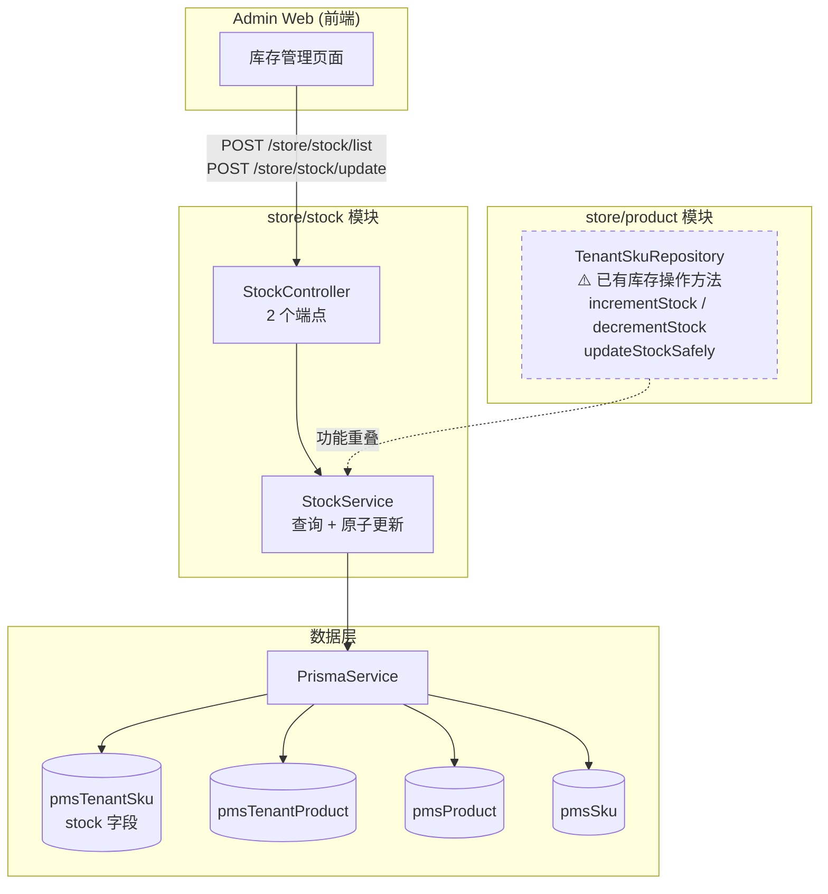
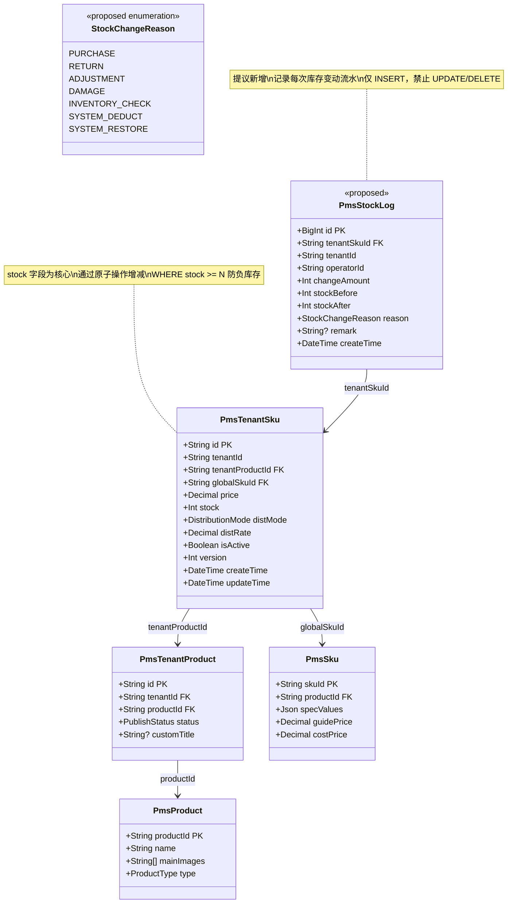
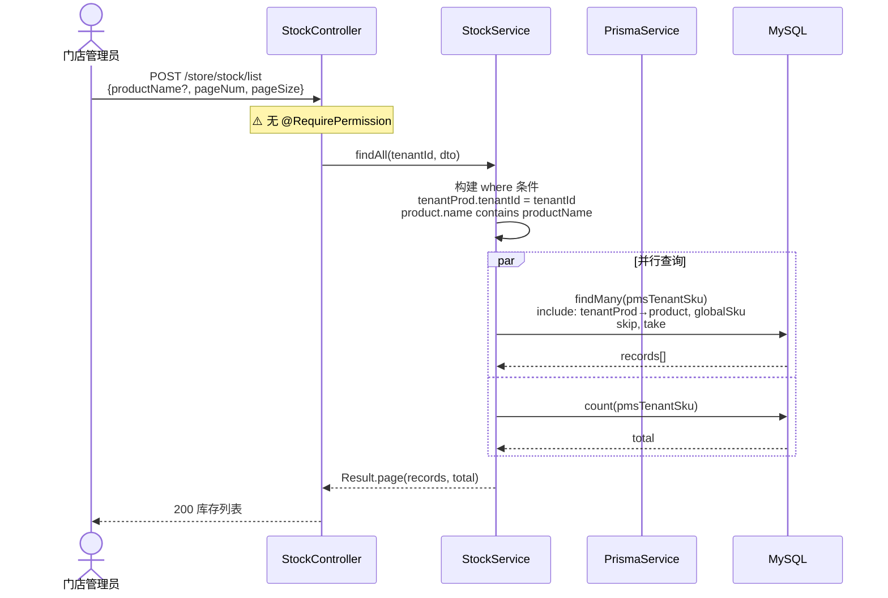
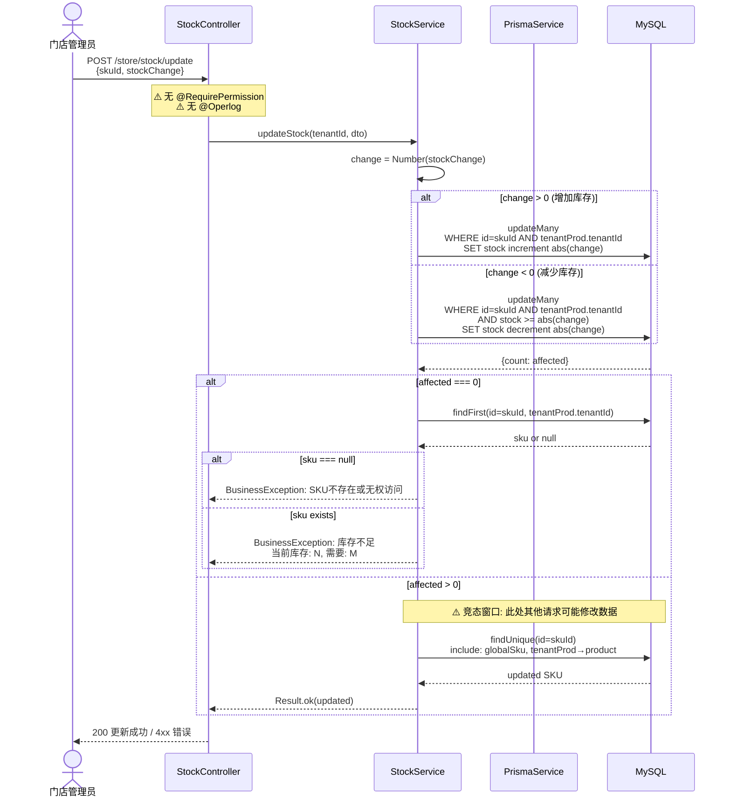
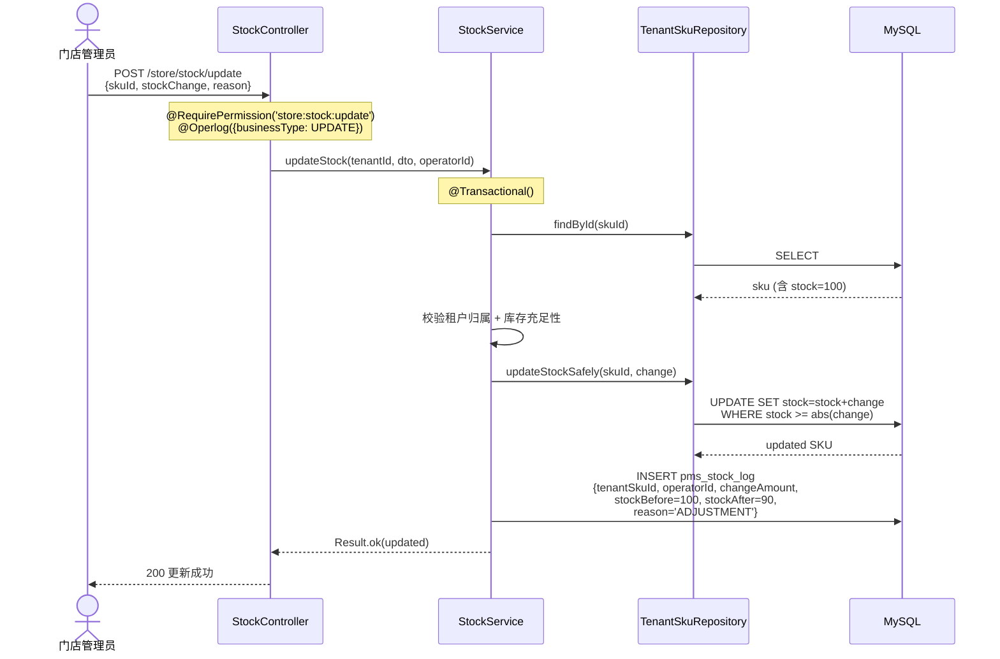
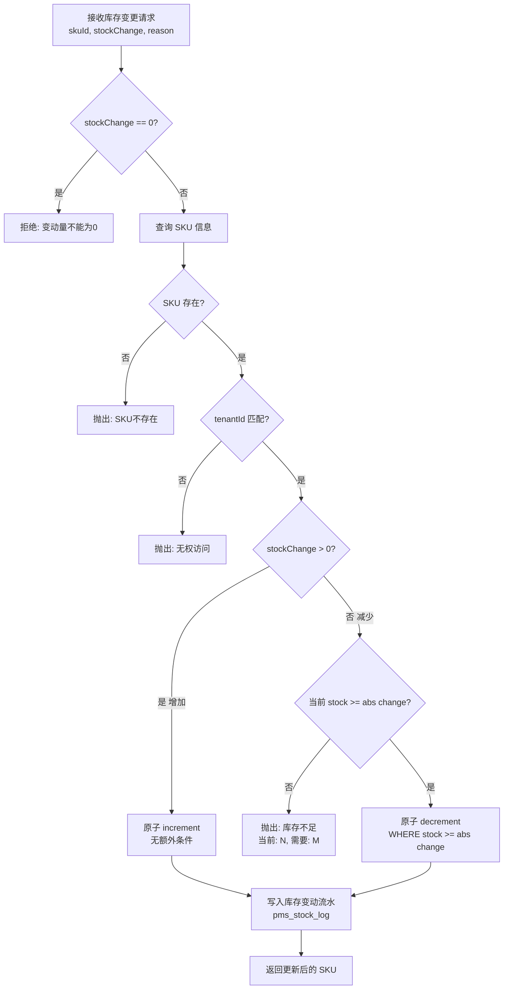
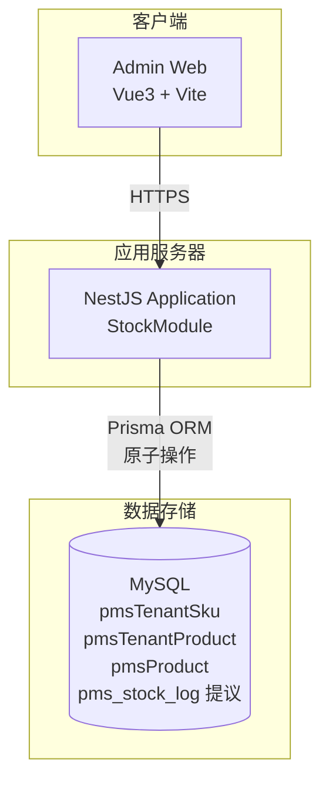
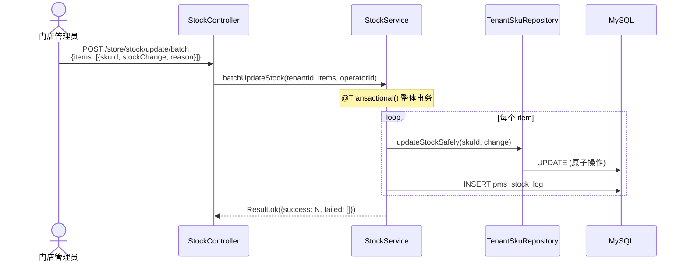
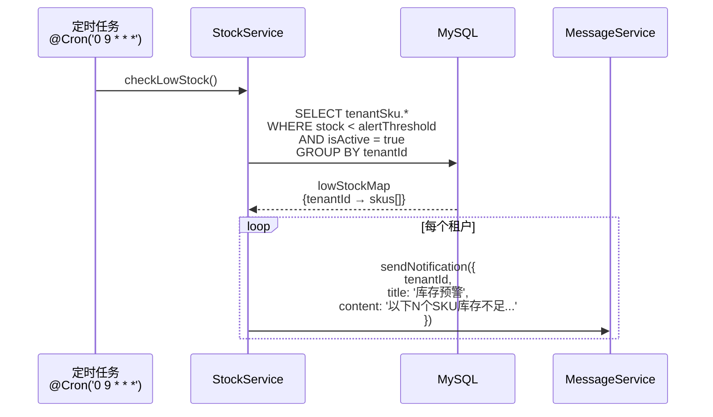
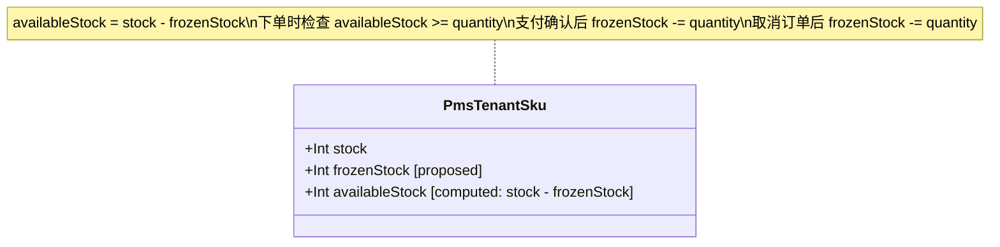

# 门店库存管理模块 — 设计文档

> 版本：1.0
> 日期：2026-02-22
> 模块路径：`src/module/store/stock`
> 需求文档：[stock-requirements.md](../../../requirements/store/stock/stock-requirements.md)
> 状态：现状架构分析 + 改进方案设计

---

## 1. 概述

### 1.1 设计目标

1. 完整描述门店库存模块的当前技术架构和数据流
2. 针对需求文档中识别的 9 个代码缺陷（D-1 ~ D-9）和 7 个架构不足（A-1 ~ A-7），给出具体改进方案
3. 为中长期演进（库存流水、批量调整、库存预警、盘点）提供技术设计

### 1.2 约束

| 约束       | 说明                                                                       |
| ---------- | -------------------------------------------------------------------------- |
| 框架       | NestJS + Prisma ORM + MySQL                                                |
| 多租户     | 通过 `@CurrentTenant()` 获取租户 ID，查询条件中 `tenantProd.tenantId` 隔离 |
| 并发控制   | 数据库原子操作（`increment`/`decrement`），无应用层锁                      |
| 数据完整性 | `WHERE stock >= N` 条件防止负库存                                          |
| 关联模块   | 依赖 `store/product` 的数据模型（`pmsTenantSku`、`pmsTenantProduct`）      |

---

## 2. 架构与模块（组件图）

> 图 1：门店库存模块组件图



**组件说明**：

| 组件                                   | 职责                                                           | 当前问题                                                    |
| -------------------------------------- | -------------------------------------------------------------- | ----------------------------------------------------------- |
| `StockController`                      | HTTP 接口层，参数校验                                          | 缺少 `@RequirePermission`、`@ApiBearerAuth`、`@Operlog`     |
| `StockService`                         | 库存查询（多表 Join）和原子更新（increment/decrement）         | 直接使用 `PrismaService`，与 `TenantSkuRepository` 功能重叠 |
| `TenantSkuRepository`（store/product） | 已封装 `incrementStock`、`decrementStock`、`updateStockSafely` | 未被 stock 模块使用，存在两套库存操作入口                   |

**依赖方向**：`StoreStock` → `PrismaService`（数据层）。当前模块未依赖 `store/product`，但操作同一张表 `pmsTenantSku`，存在职责重叠。

---

## 3. 领域/数据模型（类图）

> 图 2：门店库存模块数据模型类图



**模型说明**：

- `PmsTenantSku.stock`：核心字段，存储当前可用库存。通过数据库原子操作（`increment`/`decrement`）修改，无应用层锁。
- `PmsStockLog`（提议新增）：库存变动流水表，记录每次变动的操作人、变动量、变动前后值、原因。作为流水表，仅允许 INSERT，禁止 UPDATE/DELETE。
- 关联路径：`pmsTenantSku` → `pmsTenantProduct` → `pmsProduct`，用于列表查询时展示商品名称。

---

## 4. 核心流程时序（时序图）

### 4.1 库存列表查询

> 图 3：库存列表查询时序图



### 4.2 库存更新（原子操作）

> 图 4：库存更新时序图



### 4.3 提议：库存更新（含流水记录）

> 图 5：改进后的库存更新时序图



---

## 5. 状态与流程

本模块不涉及独立的状态机。库存为数值型字段，变更通过原子操作直接修改。

> 省略状态图原因：库存管理的核心操作是数值增减，不存在状态枚举或状态转换逻辑。

### 5.1 库存更新决策流程

> 图 6：库存更新决策活动图



---

## 6. 部署架构（部署图）

> 图 7：门店库存模块部署架构图



**说明**：库存模块架构简洁，无队列、无缓存、无外部服务依赖。所有并发安全由数据库原子操作保证。未来若引入库存预警，需增加 Redis（Bull 定时任务）和消息通知服务。

---

## 7. 缺陷改进方案

### 7.1 D-1 + D-2：添加权限和认证装饰器

**现状**：Controller 缺少 `@RequirePermission`、`@ApiBearerAuth`。

**改进**：

```typescript
@ApiTags('库存管理')
@ApiBearerAuth('Authorization')
@Controller('store/stock')
export class StockController {
  constructor(private readonly stockService: StockService) {}

  @Api({ summary: '获取库存列表', type: StockVo, isPager: true })
  @RequirePermission('store:stock:list')
  @Post('list')
  async getList(@CurrentTenant() tenantId: string, @Body() dto: ListStockDto) {
    return this.stockService.findAll(tenantId, dto);
  }

  @Api({ summary: '更新库存' })
  @RequirePermission('store:stock:update')
  @Operlog({ businessType: BusinessType.UPDATE })
  @Post('update')
  async update(@CurrentTenant() tenantId: string, @Body() dto: UpdateStockDto, @User('userId') userId: string) {
    return this.stockService.updateStock(tenantId, dto, userId);
  }
}
```

**工时**：0.5h

### 7.2 D-3 + D-4：操作日志和变动原因

**现状**：无 `@Operlog`，`UpdateStockDto` 无 `reason` 字段。

**改进 DTO**：

```typescript
export class UpdateStockDto {
  @ApiProperty({ description: 'SKU ID' })
  @IsString()
  @IsNotEmpty()
  skuId: string;

  @ApiProperty({ description: '库存变动值（正数增加，负数减少，不可为0）' })
  @IsNumber()
  @IsNotEmpty()
  stockChange: number;

  @ApiProperty({ description: '变动原因', enum: StockChangeReason })
  @IsEnum(StockChangeReason)
  reason: StockChangeReason;

  @ApiProperty({ description: '备注', required: false })
  @IsOptional()
  @IsString()
  remark?: string;
}

export enum StockChangeReason {
  PURCHASE = 'PURCHASE', // 采购入库
  RETURN = 'RETURN', // 退货入库
  ADJUSTMENT = 'ADJUSTMENT', // 盘点调整
  DAMAGE = 'DAMAGE', // 损耗报废
}
```

**工时**：0.5h + 0.5h

### 7.3 D-7 + A-7：统一使用 TenantSkuRepository

**现状**：`StockService` 直接使用 `PrismaService`，与 `store/product` 的 `TenantSkuRepository` 功能重叠。

**改进**：

```typescript
import { Module } from '@nestjs/common';
import { StockService } from './stock.service';
import { StockController } from './stock.controller';
import { StoreProductModule } from '../product/product.module';

@Module({
  imports: [StoreProductModule], // 导入 product 模块获取 TenantSkuRepository
  controllers: [StockController],
  providers: [StockService],
  exports: [StockService],
})
export class StockModule {}
```

Service 改用 Repository：

```typescript
@Injectable()
export class StockService {
  constructor(
    private readonly prisma: PrismaService,
    private readonly tenantSkuRepo: TenantSkuRepository,
  ) {}

  async updateStock(tenantId: string, dto: UpdateStockDto, operatorId: string) {
    const { skuId, stockChange, reason, remark } = dto;

    // 使用 Repository 的安全库存更新方法
    const updated = await this.tenantSkuRepo.updateStockSafely(skuId, stockChange);

    if (!updated) {
      const sku = await this.tenantSkuRepo.findById(skuId);
      if (!sku) {
        throw new BusinessException(ResponseCode.DATA_NOT_FOUND, 'SKU不存在或无权访问');
      }
      throw new BusinessException(
        ResponseCode.BUSINESS_ERROR,
        `库存不足,当前库存: ${sku.stock}, 需要: ${Math.abs(stockChange)}`,
      );
    }

    // TODO: 写入库存变动流水（T-7 实现后）
    // await this.stockLogService.create({ tenantSkuId: skuId, operatorId, ... });

    return Result.ok(updated);
  }
}
```

**工时**：2h

### 7.4 D-8：修复单元测试

**现状**：测试 mock 的方法（`findUnique` + `update`）与实际实现（`updateMany` + `findFirst` + `findUnique`）不一致。

**改进**：重写测试以匹配实际实现。

```typescript
describe('StockService - updateStock', () => {
  const mockPrismaService = {
    pmsTenantSku: {
      updateMany: jest.fn(),
      findFirst: jest.fn(),
      findUnique: jest.fn(),
    },
  };

  it('应该成功增加库存', async () => {
    mockPrismaService.pmsTenantSku.updateMany.mockResolvedValue({ count: 1 });
    mockPrismaService.pmsTenantSku.findUnique.mockResolvedValue({
      id: 'sku1',
      stock: 110,
      globalSku: {},
      tenantProd: { product: {} },
    });

    const result = await service.updateStock('t1', {
      skuId: 'sku1',
      stockChange: 10,
    });

    expect(result.data.stock).toBe(110);
    expect(mockPrismaService.pmsTenantSku.updateMany).toHaveBeenCalledWith({
      where: {
        id: 'sku1',
        tenantProd: { tenantId: 't1' },
        stock: undefined, // 增加时无库存检查
      },
      data: { stock: { increment: 10 } },
    });
  });

  it('应该在库存不足时抛出异常', async () => {
    mockPrismaService.pmsTenantSku.updateMany.mockResolvedValue({ count: 0 });
    mockPrismaService.pmsTenantSku.findFirst.mockResolvedValue({
      id: 'sku1',
      stock: 5,
    });

    await expect(service.updateStock('t1', { skuId: 'sku1', stockChange: -10 })).rejects.toThrow(
      '库存不足,当前库存: 5, 需要: 10',
    );
  });
});
```

**工时**：1h

### 7.5 D-9：stockChange 非零校验

**改进**：在 DTO 中添加自定义校验。

```typescript
import { IsNumber, IsNotEmpty, Validate } from 'class-validator';

export class UpdateStockDto {
  @ApiProperty({ description: '库存变动值（正数增加，负数减少，不可为0）' })
  @IsNumber()
  @IsNotEmpty()
  @Validate((value: number) => value !== 0, { message: '库存变动值不能为0' })
  stockChange: number;
}
```

或使用 `class-validator` 的 `@IsNotIn`：

```typescript
@IsNumber()
@IsNotIn([0], { message: '库存变动值不能为0' })
stockChange: number;
```

**工时**：0.1h

---

## 8. 架构改进方案

### 8.1 A-1：库存变动流水表

**方案**：新增 `pms_stock_log` 流水表，每次库存变更自动写入一条记录。

**数据模型**：

```sql
CREATE TABLE pms_stock_log (
  id            BIGINT AUTO_INCREMENT PRIMARY KEY,
  tenant_sku_id VARCHAR(36) NOT NULL,
  tenant_id     VARCHAR(36) NOT NULL,
  operator_id   VARCHAR(36) NOT NULL,
  change_amount INT NOT NULL,          -- 正数增加，负数减少
  stock_before  INT NOT NULL,          -- 变动前库存
  stock_after   INT NOT NULL,          -- 变动后库存
  reason        VARCHAR(32) NOT NULL,  -- PURCHASE/RETURN/ADJUSTMENT/DAMAGE/SYSTEM_DEDUCT/SYSTEM_RESTORE
  remark        VARCHAR(255),
  create_time   DATETIME NOT NULL DEFAULT CURRENT_TIMESTAMP,

  INDEX idx_tenant_sku (tenant_sku_id),
  INDEX idx_tenant_time (tenant_id, create_time)
) ENGINE=InnoDB;
```

**流水表规则**（遵循后端规范 §10.6）：

- 仅允许 INSERT，禁止 UPDATE/DELETE
- 查询必须带时间范围（`create_time` 索引）
- 预估数据量 D2 级别（10万~100万），按租户+时间索引即可

**Service 实现**：

```typescript
@Transactional()
async updateStock(tenantId: string, dto: UpdateStockDto, operatorId: string) {
  const sku = await this.tenantSkuRepo.findById(dto.skuId);
  BusinessException.throwIfNull(sku, 'SKU不存在');

  const stockBefore = sku.stock;
  const updated = await this.tenantSkuRepo.updateStockSafely(dto.skuId, dto.stockChange);
  BusinessException.throwIfNull(updated, `库存不足,当前: ${stockBefore}, 需要: ${Math.abs(dto.stockChange)}`);

  // 写入流水
  await this.prisma.pmsStockLog.create({
    data: {
      tenantSkuId: dto.skuId,
      tenantId,
      operatorId,
      changeAmount: dto.stockChange,
      stockBefore,
      stockAfter: stockBefore + dto.stockChange,
      reason: dto.reason,
      remark: dto.remark,
    },
  });

  return Result.ok(updated);
}
```

### 8.2 A-3：批量调整库存

**方案**：新增 `POST /store/stock/update/batch` 接口。



**DTO**：

```typescript
export class BatchUpdateStockDto {
  @ApiProperty({ description: '批量库存变更列表', type: [UpdateStockDto] })
  @IsArray()
  @ValidateNested({ each: true })
  @Type(() => UpdateStockDto)
  @ArrayMaxSize(100) // 单次最多100条
  items: UpdateStockDto[];
}
```

### 8.3 A-2：库存预警

**方案**：定时任务 + 消息通知。



**配置**：

- 默认阈值：10（可在租户配置中自定义）
- 扫描频率：每日 09:00
- 通知方式：系统消息（后续可扩展短信/微信）

### 8.4 A-6：库存冻结/解冻（长期）

**数据模型扩展**：



**流程**：

1. 下单时：`frozenStock += quantity`（锁定库存）
2. 支付成功：`stock -= quantity`，`frozenStock -= quantity`（扣减库存）
3. 取消/超时：`frozenStock -= quantity`（释放库存）
4. 可售库存 = `stock - frozenStock`

---

## 9. 接口/数据约定

### 9.1 现有接口约定

| 接口     | 方法 | 路径                  | 租户类型     | QPS 档位 | 大表                         |
| -------- | ---- | --------------------- | ------------ | -------- | ---------------------------- |
| 库存列表 | POST | `/store/stock/list`   | TenantScoped | 低       | 否（按租户隔离，数据量有限） |
| 更新库存 | POST | `/store/stock/update` | TenantScoped | 低       | 否                           |

### 9.2 提议新增接口

| 接口         | 方法 | 路径                        | 说明                               | 优先级 |
| ------------ | ---- | --------------------------- | ---------------------------------- | ------ |
| 批量更新库存 | POST | `/store/stock/update/batch` | 批量增减库存（最多 100 条）        | P1     |
| 库存变动流水 | POST | `/store/stock/log/list`     | 查询库存变动历史（必须带时间范围） | P1     |
| 库存导出     | POST | `/store/stock/export`       | Excel 导出当前库存                 | P2     |
| 库存预警配置 | POST | `/store/stock/alert/config` | 设置低库存阈值                     | P2     |

---

## 10. 改进优先级总览

| 优先级 | 编号 | 改进项                                         | 工时 | 对应缺陷/不足 |
| ------ | ---- | ---------------------------------------------- | ---- | ------------- |
| P0     | I-1  | 添加 `@RequirePermission` + `@ApiBearerAuth`   | 0.5h | D-1, D-2      |
| P0     | I-2  | 添加 `@Operlog` 操作日志                       | 0.5h | D-3           |
| P1     | I-3  | `UpdateStockDto` 增加 `reason` + `remark` 字段 | 0.5h | D-4           |
| P1     | I-4  | `stockChange` 增加非零校验                     | 0.1h | D-9           |
| P1     | I-5  | Service 改用 `TenantSkuRepository`，消除重复   | 2h   | D-7, A-7      |
| P1     | I-6  | 修复单元测试                                   | 1h   | D-8           |
| P1     | I-7  | 新增库存变动流水表 `pms_stock_log`             | 2-3d | A-1           |
| P1     | I-8  | 批量调整库存接口                               | 1-2d | A-3           |
| P2     | I-9  | 库存预警（定时扫描 + 通知）                    | 2-3d | A-2           |
| P2     | I-10 | 库存导出（Excel）                              | 1-2d | A-5           |
| P3     | I-11 | 库存盘点功能                                   | 3-5d | A-4           |
| P3     | I-12 | 库存冻结/解冻（可售/锁定分离）                 | 3-5d | A-6           |
