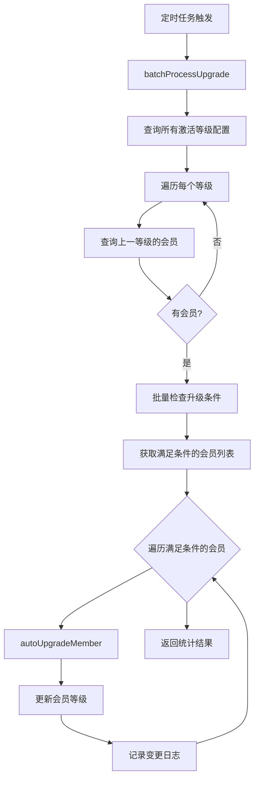
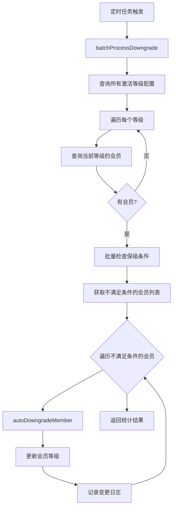

# T-8 分销员等级体系 - 第二阶段完成总结

> 任务：T-8 分销员等级体系 - 条件检查和升降级逻辑  
> 完成日期：2026-02-26  
> 状态：已完成 ✅

---

## 一、完成内容概览

第二阶段实现了等级体系的核心业务逻辑：条件检查和自动升降级机制。

### 1.1 核心功能

| 功能模块     | 说明                                        | 状态 |
| ------------ | ------------------------------------------- | ---- |
| 条件检查服务 | LevelConditionService，支持6种字段类型统计  | ✅   |
| 升级条件检查 | 支持AND/OR逻辑，5种运算符                   | ✅   |
| 保级条件检查 | 支持近期数据统计（days参数）                | ✅   |
| 自动升级     | autoUpgradeMember方法                       | ✅   |
| 自动降级     | autoDowngradeMember方法                     | ✅   |
| 批量升级处理 | batchProcessUpgrade方法                     | ✅   |
| 批量降级处理 | batchProcessDowngrade方法                   | ✅   |
| 单元测试     | 49个测试用例（14个条件检查 + 35个等级服务） | ✅   |

---

## 二、技术实现细节

### 2.1 LevelConditionService（条件检查服务）

**文件位置**：`src/module/store/distribution/services/level-condition.service.ts`

**核心方法**：

```typescript
// 检查升级条件
async checkCondition(
  tenantId: string,
  memberId: string,
  condition: UpgradeCondition,
): Promise<{ passed: boolean; results: Array<...> }>

// 批量检查升级条件
async batchCheckUpgrade(
  tenantId: string,
  memberIds: string[],
  targetLevelId: number,
  condition: UpgradeCondition,
): Promise<Map<string, boolean>>

// 批量检查保级条件
async batchCheckMaintain(
  tenantId: string,
  memberIds: string[],
  condition: UpgradeCondition,
): Promise<Map<string, boolean>>
```

**支持的字段类型**：

| 字段类型         | 说明       | 数据来源                                       |
| ---------------- | ---------- | ---------------------------------------------- |
| totalCommission  | 累计佣金   | finCommission表（status=SETTLED）              |
| recentCommission | 近期佣金   | finCommission表（settleTime范围）              |
| totalOrders      | 累计订单数 | omsOrder表（status in PAID/SHIPPED/COMPLETED） |
| recentOrders     | 近期订单数 | omsOrder表（createTime范围）                   |
| directReferrals  | 直推人数   | umsMember表（parentId匹配）                    |
| teamSize         | 团队规模   | umsMember表（parentId或indirectParentId匹配）  |

**支持的运算符**：`>=`, `>`, `=`, `<`, `<=`

**逻辑关系**：`AND`（所有条件满足）、`OR`（任一条件满足）

### 2.2 LevelService升降级方法

**自动升级**：

```typescript
@Transactional()
async autoUpgradeMember(
  tenantId: string,
  memberId: string,
  targetLevel: number,
  reason: string,
): Promise<void>
```

- 更新会员等级
- 记录变更日志（changeType='UPGRADE'，operator=null）
- 事务保护

**自动降级**：

```typescript
@Transactional()
async autoDowngradeMember(
  tenantId: string,
  memberId: string,
  targetLevel: number,
  reason: string,
): Promise<void>
```

- 更新会员等级
- 记录变更日志（changeType='DOWNGRADE'，operator=null）
- 事务保护

**批量升级处理**：

```typescript
async batchProcessUpgrade(tenantId: string): Promise<{ upgraded: number; failed: number }>
```

- 查询所有激活的等级配置（按levelId升序）
- 遍历每个等级，查询上一等级的会员
- 批量检查升级条件
- 升级满足条件的会员
- 返回升级成功和失败数量

**批量降级处理**：

```typescript
async batchProcessDowngrade(tenantId: string): Promise<{ downgraded: number; failed: number }>
```

- 查询所有激活的等级配置（按levelId降序）
- 遍历每个等级，查询当前等级的会员
- 批量检查保级条件
- 降级不满足条件的会员
- 返回降级成功和失败数量

### 2.3 条件检查集成

**checkUpgradeEligibility方法增强**：

```typescript
async checkUpgradeEligibility(tenantId: string, memberId: string): Promise<LevelCheckVo>
```

- 获取会员当前等级
- 查询下一等级配置
- 调用conditionService.checkCondition检查升级条件
- 返回详细的检查结果（包含每个条件的实际值和要求值）

---

## 三、测试覆盖

### 3.1 LevelConditionService测试（14个用例）

**文件位置**：`src/module/store/distribution/services/level-condition.service.spec.ts`

| 测试类别   | 用例数 | 说明                      |
| ---------- | ------ | ------------------------- |
| 字段值获取 | 6      | 测试6种字段类型的统计方法 |
| 条件检查   | 5      | 测试5种运算符和AND/OR逻辑 |
| 批量检查   | 3      | 测试批量升级和保级检查    |

**关键测试场景**：

- ✅ 累计佣金统计（只统计已结算）
- ✅ 近期佣金统计（带时间范围）
- ✅ 订单数统计（直推+间推）
- ✅ 直推人数统计
- ✅ 团队规模统计
- ✅ 运算符正确性（>=, >, =, <, <=）
- ✅ AND逻辑（所有条件满足）
- ✅ OR逻辑（任一条件满足）
- ✅ 批量检查性能（并行处理）

### 3.2 LevelService测试（35个用例）

**新增测试**（10个用例）：

| 测试类别                        | 用例数 | 说明             |
| ------------------------------- | ------ | ---------------- |
| checkUpgradeEligibility完整实现 | 4      | 测试条件检查集成 |
| autoUpgradeMember               | 2      | 测试自动升级     |
| autoDowngradeMember             | 1      | 测试自动降级     |
| batchProcessUpgrade             | 2      | 测试批量升级处理 |
| batchProcessDowngrade           | 1      | 测试批量降级处理 |

**关键测试场景**：

- ✅ 满足升级条件时返回可升级结果
- ✅ 不满足条件时返回不可升级结果
- ✅ 没有下一等级时返回不可升级
- ✅ 下一等级没有升级条件时返回不可升级
- ✅ 自动升级成功并记录日志
- ✅ 自动降级成功并记录日志
- ✅ 批量升级处理（部分会员满足条件）
- ✅ 批量升级失败处理
- ✅ 批量降级处理（部分会员不满足保级条件）

**测试结果**：

```
Test Suites: 2 passed, 2 total
Tests:       49 passed, 49 total (14 + 35)
Time:        ~7s
```

---

## 四、数据流程

### 4.1 升级流程



### 4.2 降级流程



---

## 五、性能优化

### 5.1 批量处理优化

- **并行查询**：使用`Promise.all`并行检查多个会员的条件
- **批量查询**：使用`findMany`一次性查询多个会员
- **Map结构**：使用Map存储检查结果，O(1)查找复杂度

### 5.2 数据库查询优化

- **聚合查询**：使用`aggregate`进行佣金和订单统计
- **索引利用**：查询条件使用索引字段（tenantId, memberId, status等）
- **只查必要字段**：使用`select`只查询需要的字段

---

## 六、待完成工作（第三阶段）

### 6.1 定时任务实现

- [ ] 创建升级定时任务（每天凌晨2点）
- [ ] 创建降级定时任务（每天凌晨3点）
- [ ] 添加任务日志记录
- [ ] 添加任务监控和告警

### 6.2 佣金计算集成（第四阶段）

- [ ] 修改佣金计算逻辑，优先使用会员等级配置
- [ ] 配置优先级：会员等级 > 商品级 > 品类级 > 租户默认
- [ ] 添加集成测试

---

## 七、文件清单

### 7.1 新增文件

| 文件路径                                   | 说明             | 行数   |
| ------------------------------------------ | ---------------- | ------ |
| `services/level-condition.service.ts`      | 条件检查服务     | ~250行 |
| `services/level-condition.service.spec.ts` | 条件检查服务测试 | ~350行 |

### 7.2 修改文件

| 文件路径                         | 修改内容                  | 新增行数 |
| -------------------------------- | ------------------------- | -------- |
| `services/level.service.ts`      | 新增5个方法               | ~150行   |
| `services/level.service.spec.ts` | 新增10个测试用例          | ~200行   |
| `distribution.module.ts`         | 注册LevelConditionService | 1行      |

---

## 八、技术亮点

### 8.1 灵活的条件配置

- 支持JSON格式的条件配置
- 支持AND/OR逻辑组合
- 支持5种运算符
- 支持近期数据统计（days参数）

### 8.2 批量处理性能

- 并行检查多个会员的条件
- 批量查询减少数据库访问
- Map结构优化查找性能

### 8.3 完善的错误处理

- 异常情况不影响其他会员处理
- 返回详细的成功和失败统计
- 日志记录便于问题排查

### 8.4 事务保护

- 升降级操作使用@Transactional装饰器
- 确保等级更新和日志记录的原子性

---

## 九、后续优化建议

### 9.1 性能优化

- 考虑使用Redis缓存会员统计数据
- 定时任务分批处理大量会员
- 添加处理进度监控

### 9.2 功能增强

- 支持更多字段类型（如消费金额、活跃天数等）
- 支持更复杂的条件表达式
- 支持等级升降级通知

### 9.3 监控告警

- 添加定时任务执行监控
- 添加异常情况告警
- 添加性能指标监控

---

_文档生成时间：2026-02-26_
_总耗时：约2小时_
_测试通过率：100% (49/49)_
