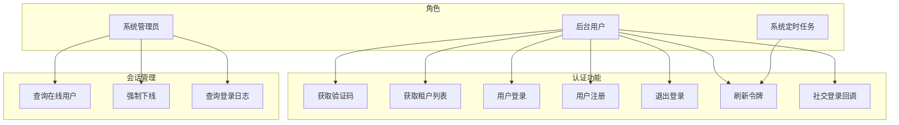
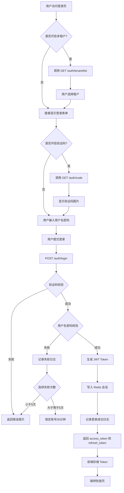
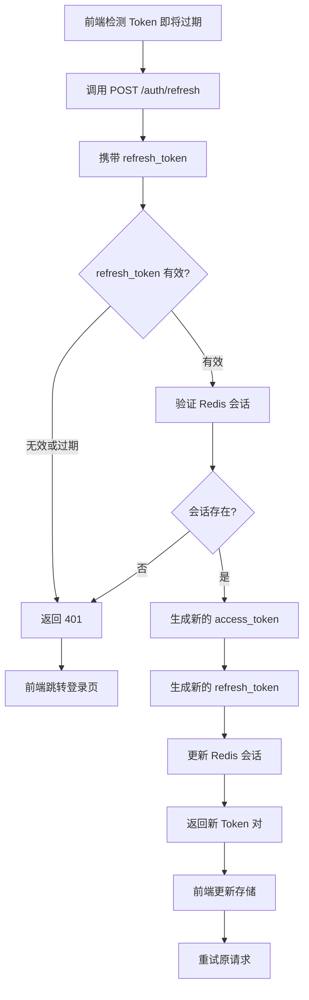
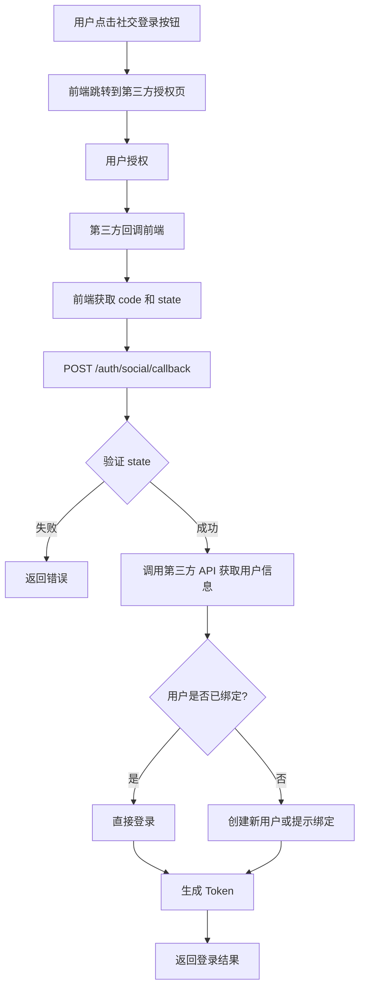
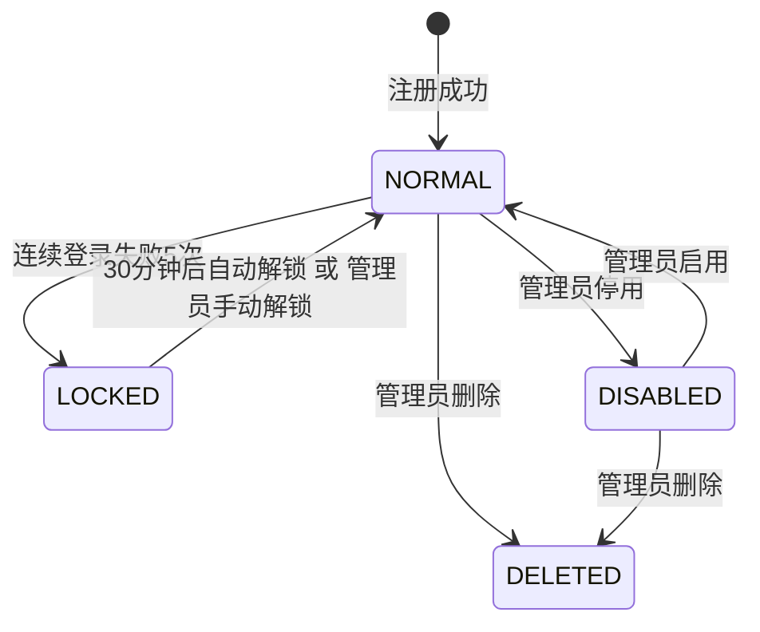
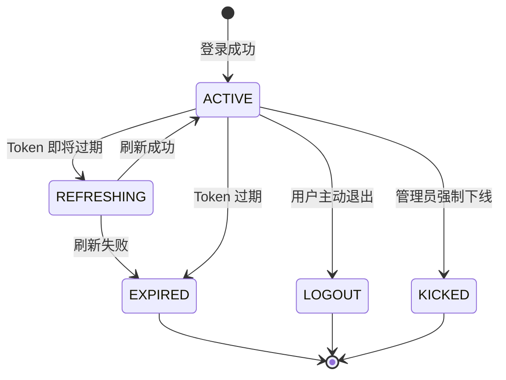

# 认证模块 (Admin Auth) — 需求文档

> 版本：1.0  
> 日期：2026-02-22  
> 状态：草案  
> 关联设计：[auth-design.md](../../design/admin/auth/auth-design.md)

---

## 1. 概述

### 1.1 背景

认证模块 (`module/admin/auth`) 是后台管理系统的入口模块，负责用户身份验证、令牌管理、租户选择等核心功能。当前实现已支持基础的用户名密码登录、验证码校验、多租户登录，但存在以下问题：

1. 刷新令牌机制未实现（前端已预留 `refresh_token` 字段，后端返回相同的 `access_token`）
2. 社交登录接口仅有占位实现，返回"功能暂未实现"
3. 密码强度校验、账号锁定、登录日志等安全机制分散在多个模块
4. 缺少统一的会话管理和在线用户监控能力

### 1.2 目标

1. 完善现有认证流程，补齐刷新令牌、社交登录等功能
2. 增强安全性：密码策略、账号锁定、异地登录检测
3. 提供统一的会话管理接口，支持强制下线、在线用户查询
4. 为后续接入 OAuth2.0、SAML 等企业级认证预留扩展点

### 1.3 范围

| 在范围内                     | 不在范围内                   |
| ---------------------------- | ---------------------------- |
| 用户名密码登录               | 前端页面实现                 |
| 验证码生成与校验             | 短信验证码登录（属于 C 端）  |
| 租户列表查询与租户切换       | 微信扫码登录（属于 C 端）    |
| 刷新令牌机制                 | 单点登录 SSO（后续迭代）     |
| 社交登录回调处理（预留接口） | 多因素认证 MFA（后续迭代）   |
| 登录日志记录                 | 生物识别登录（后续迭代）     |
| 会话管理与强制下线           | 密码找回（属于独立功能模块） |

---

## 2. 角色与用例

> 图 1：认证模块用例图

---

## 3. 业务流程

### 3.1 登录主流程

> 图 2：用户登录活动图

### 3.2 刷新令牌流程

> 图 3：刷新令牌活动图

### 3.3 社交登录流程

> 图 4：社交登录活动图

---

## 4. 状态说明

### 4.1 用户账号状态

> 图 5：用户账号状态图

### 4.2 会话状态

> 图 6：会话状态图

---

## 5. 功能需求

### 5.1 获取验证码 (GET /auth/code)

**功能描述**：生成数学运算验证码，用于登录和注册时的人机验证。

**前置条件**：无（公开接口）

**输入**：无

**输出**：

- `captchaEnabled`: 是否开启验证码（从系统配置读取）
- `uuid`: 验证码唯一标识
- `img`: Base64 编码的验证码图片

**业务规则**：

1. 验证码为简单数学运算（如 "3 + 5 = ?"）
2. 验证码答案存储在 Redis，有效期 5 分钟
3. 验证码不区分大小写
4. 如果系统配置关闭验证码，返回 `captchaEnabled: false`，不生成图片

**异常处理**：

- Redis 连接失败：返回 500 错误，提示"生成验证码错误，请重试"

### 5.2 获取租户列表 (GET /auth/tenant/list)

**功能描述**：查询系统中所有可用的租户，供用户登录时选择。

**前置条件**：无（公开接口）

**输入**：无

**输出**：

- `tenantEnabled`: 是否开启多租户
- `voList`: 租户列表
  - `tenantId`: 租户 ID
  - `companyName`: 企业名称
  - `domain`: 域名（可选）

**业务规则**：

1. 仅返回状态为 NORMAL 的租户
2. 按创建时间升序排列
3. 如果多租户未开启，返回空列表
4. 如果 `sys_tenant` 表不存在（初始化阶段），返回默认超级租户

**异常处理**：

- 数据库查询失败：记录 WARN 日志，返回默认租户列表

### 5.3 用户登录 (POST /auth/login)

**功能描述**：用户使用用户名和密码登录后台管理系统。

**前置条件**：无（公开接口）

**输入**：

- `username`: 用户名（必填）
- `password`: 密码（必填，前端已 RSA 加密）
- `code`: 验证码（开启验证码时必填）
- `uuid`: 验证码标识（开启验证码时必填）
- `tenantId`: 租户 ID（可选，优先使用 header 中的 `tenant-id`）
- `clientId`: 客户端标识（可选，默认 "pc"）
- `rememberMe`: 记住我（可选，暂未实现）

**输出**：

- `access_token`: 访问令牌
- `refresh_token`: 刷新令牌
- `expire_in`: 访问令牌有效期（秒）
- `refresh_expire_in`: 刷新令牌有效期（秒）
- `client_id`: 客户端标识
- `scope`: 权限范围（预留）
- `openid`: 用户 openid（预留）

**业务规则**：

1. 租户 ID 优先级：header `tenant-id` > body `tenantId` > 默认超级租户
2. 验证码校验：
   - 从 Redis 读取验证码答案
   - 不区分大小写比较
   - 校验后立即删除 Redis 中的验证码
3. 用户名密码校验：
   - 查询用户信息（按租户隔离）
   - 使用 bcrypt 比对密码
   - 校验用户状态（delFlag、status）
4. 登录失败处理：
   - 记录登录失败日志
   - 连续失败 5 次锁定账号 30 分钟（待实现）
5. 登录成功处理：
   - 生成 UUID 作为会话标识
   - 生成 JWT Token（payload 包含 uuid 和 userId）
   - 查询用户权限和角色
   - 将用户信息存入 Redis（key: `login_tokens:{uuid}`，TTL: Token 有效期）
   - 更新用户最后登录时间和 IP
   - 记录登录成功日志
6. Token 生成：
   - `access_token` 和 `refresh_token` 当前使用相同值（待优化）
   - 有效期从配置读取（默认 24 小时）

**异常处理**：

- 验证码错误：返回 400，"验证码错误"
- 用户名或密码错误：返回 400，"账号或密码错误"
- 用户已停用：返回 400，"您已被停用，如需正常使用请联系管理员"
- 用户已删除：返回 400，"您已被禁用，如需正常使用请联系管理员"

### 5.4 用户注册 (POST /auth/register)

**功能描述**：新用户自助注册账号。

**前置条件**：无（公开接口）

**输入**：

- `username`: 用户名（必填，2-20 字符）
- `password`: 密码（必填，5-20 字符，需符合强密码规则）
- `confirmPassword`: 确认密码（必填）
- `code`: 验证码（必填）
- `uuid`: 验证码标识（必填）
- `tenantId`: 租户 ID（可选）
- `userType`: 用户类型（可选）

**输出**：

- 成功：返回 200，无数据
- 失败：返回错误信息

**业务规则**：

1. 密码一致性校验：`password` 必须等于 `confirmPassword`
2. 用户名唯一性校验：同一租户下用户名不能重复
3. 验证码校验：与登录相同
4. 密码加密：使用 bcrypt 加密后存储
5. 默认用户属性：
   - `nickName`: 与 `username` 相同
   - `userType`: `SYS_USER_TYPE.CUSTOM`（自定义用户）
   - `status`: `StatusEnum.NORMAL`（正常）
   - `delFlag`: `DelFlagEnum.NORMAL`（未删除）
6. 注册成功后不自动登录，需用户手动登录

**异常处理**：

- 两次密码不一致：返回 400，"两次输入的密码不一致"
- 用户名已存在：返回 400，"保存用户'{username}'失败，注册账号已存在"
- 验证码错误：返回 400，"验证码错误"

### 5.5 退出登录 (POST /auth/logout)

**功能描述**：用户主动退出登录，清除会话。

**前置条件**：用户已登录（需携带 Token）

**输入**：无（从 Token 中解析用户信息）

**输出**：

- 成功：返回 200，无数据

**业务规则**：

1. 从 Redis 删除会话信息（key: `login_tokens:{uuid}`）
2. 记录退出登录日志
3. 即使 Token 无效也返回成功（幂等）

**异常处理**：

- Redis 删除失败：记录日志，但仍返回成功

### 5.6 刷新令牌 (POST /auth/refresh) - 待实现

**功能描述**：使用 refresh_token 获取新的 access_token，延长会话有效期。

**前置条件**：用户已登录，refresh_token 未过期

**输入**：

- `refresh_token`: 刷新令牌（必填）

**输出**：

- `access_token`: 新的访问令牌
- `refresh_token`: 新的刷新令牌
- `expire_in`: 访问令牌有效期（秒）
- `refresh_expire_in`: 刷新令牌有效期（秒）

**业务规则**：

1. 验证 refresh_token 的有效性（JWT 签名和过期时间）
2. 从 Redis 查询会话信息
3. 生成新的 access_token 和 refresh_token
4. 更新 Redis 会话信息
5. refresh_token 有效期应长于 access_token（建议 7 天 vs 24 小时）
6. 刷新后旧的 refresh_token 立即失效（防止重放攻击）

**异常处理**：

- refresh_token 无效或过期：返回 401，"刷新令牌无效"
- 会话不存在：返回 401，"会话已失效，请重新登录"

**当前状态**：

- 接口未实现
- 前端已预留字段，后端返回相同的 access_token 作为 refresh_token

### 5.7 社交登录回调 (POST /auth/social/callback) - 待实现

**功能描述**：处理第三方社交平台（如微信、钉钉、企业微信）的登录回调。

**前置条件**：用户已在第三方平台完成授权

**输入**：

- `source`: 社交平台来源（如 "wechat", "dingtalk"）
- `socialCode`: 授权码
- `socialState`: 状态码（防 CSRF）
- `tenantId`: 租户 ID（可选）
- `clientId`: 客户端标识（可选）

**输出**：

- 与登录接口相同的 Token 信息

**业务规则**：

1. 验证 state 参数防止 CSRF 攻击
2. 使用 socialCode 调用第三方 API 获取用户信息
3. 根据 openid 查询 `sys_social_user` 表
4. 如果已绑定：直接登录
5. 如果未绑定：
   - 创建新用户（自动注册）
   - 或提示用户绑定已有账号（待定）
6. 生成 Token 并返回

**异常处理**：

- state 验证失败：返回 400，"非法请求"
- 第三方 API 调用失败：返回 500，"社交登录失败，请重试"

**当前状态**：

- 接口已定义，返回 501，"社交登录功能暂未实现"
- 前端已有对应的路由和页面

---

## 6. 验收标准

### 6.1 基础认证功能

| 编号  | 验收条件                                                           | 可测试方式          |
| ----- | ------------------------------------------------------------------ | ------------------- |
| AC-1  | 验证码开启时，登录必须提供正确的验证码                             | 单元测试 + 手动测试 |
| AC-2  | 验证码不区分大小写                                                 | 单元测试            |
| AC-3  | 验证码使用后立即失效，不能重复使用                                 | 单元测试            |
| AC-4  | 多租户开启时，租户列表接口返回所有 NORMAL 状态的租户               | 集成测试            |
| AC-5  | 登录时租户 ID 优先级：header > body > 默认                         | 单元测试            |
| AC-6  | 用户名或密码错误时，返回统一的错误提示（不泄露具体是哪个字段错误） | 安全测试            |
| AC-7  | 登录成功后，Redis 中存储完整的用户信息（含权限、角色）             | 集成测试            |
| AC-8  | 登录成功后，更新用户的最后登录时间和 IP                            | 集成测试            |
| AC-9  | 注册时用户名重复，返回明确的错误提示                               | 单元测试            |
| AC-10 | 注册时两次密码不一致，返回明确的错误提示                           | 单元测试            |
| AC-11 | 退出登录后，Token 立即失效，无法访问需要认证的接口                 | 集成测试            |
| AC-12 | 退出登录接口幂等，多次调用不报错                                   | 单元测试            |

### 6.2 安全性

| 编号  | 验收条件                                          | 可测试方式            |
| ----- | ------------------------------------------------- | --------------------- |
| AC-13 | 密码使用 bcrypt 加密存储，不存储明文              | 代码审查 + 数据库检查 |
| AC-14 | 登录失败记录日志，包含 IP、浏览器、操作系统等信息 | 集成测试              |
| AC-15 | 登录成功记录日志，包含登录时间、IP、位置等信息    | 集成测试              |
| AC-16 | Token 存储在 Redis，不存储在数据库                | 架构审查              |
| AC-17 | Token 过期后无法访问需要认证的接口，返回 401      | 集成测试              |
| AC-18 | 已停用或已删除的用户无法登录                      | 单元测试              |

### 6.3 刷新令牌（待实现）

| 编号  | 验收条件                                                      | 可测试方式 |
| ----- | ------------------------------------------------------------- | ---------- |
| AC-19 | refresh_token 有效期长于 access_token（建议 7 天 vs 24 小时） | 配置检查   |
| AC-20 | 使用 refresh_token 成功获取新的 Token 对                      | 集成测试   |
| AC-21 | 刷新后旧的 refresh_token 立即失效                             | 单元测试   |
| AC-22 | refresh_token 过期后无法刷新，返回 401                        | 单元测试   |
| AC-23 | 刷新 Token 时更新 Redis 会话的过期时间                        | 集成测试   |

### 6.4 社交登录（待实现）

| 编号  | 验收条件                                    | 可测试方式 |
| ----- | ------------------------------------------- | ---------- |
| AC-24 | 社交登录回调验证 state 参数，防止 CSRF 攻击 | 安全测试   |
| AC-25 | 已绑定的社交账号可以直接登录                | 集成测试   |
| AC-26 | 未绑定的社交账号自动创建新用户              | 集成测试   |
| AC-27 | 社交登录失败时返回明确的错误提示            | 单元测试   |

---

## 7. 非功能需求

| 维度   | 要求                                                           |
| ------ | -------------------------------------------------------------- |
| 性能   | 登录接口 P95 小于等于 500ms（不含 IP 地址解析）                |
| 性能   | 验证码生成 P95 小于等于 200ms                                  |
| 可用性 | 登录接口可用性 99.9%                                           |
| 安全   | 密码传输使用 RSA 加密                                          |
| 安全   | Token 使用 JWT 签名，防止篡改                                  |
| 安全   | 连续登录失败 5 次锁定账号 30 分钟（待实现）                    |
| 安全   | 异地登录检测并通知用户（待实现）                               |
| 幂等   | 退出登录接口幂等                                               |
| 幂等   | 刷新令牌接口幂等（同一 refresh_token 多次调用返回相同结果）    |
| 可观测 | 所有认证操作记录日志，包含 traceId、userId、IP、操作结果       |
| 可观测 | 登录失败记录详细的失败原因（验证码错误、密码错误、账号锁定等） |
| 扩展性 | 支持接入多种社交登录平台（微信、钉钉、企业微信、飞书等）       |
| 扩展性 | 预留 OAuth2.0、SAML 等企业级认证协议的扩展点                   |

---

## 8. 现有实现分析

### 8.1 已实现功能

| 功能           | 实现状态 | 代码位置                                  | 说明                                   |
| -------------- | -------- | ----------------------------------------- | -------------------------------------- |
| 获取验证码     | ✅ 完整  | `auth.controller.ts` - `getCaptchaCode()` | 支持数学运算验证码，Redis 存储         |
| 获取租户列表   | ✅ 完整  | `auth.controller.ts` - `getTenantList()`  | 支持多租户，容错处理                   |
| 用户登录       | ✅ 完整  | `auth.controller.ts` - `login()`          | 支持验证码、多租户、JWT Token          |
| 用户注册       | ✅ 完整  | `auth.controller.ts` - `register()`       | 支持验证码、密码加密、用户名唯一性校验 |
| 退出登录       | ✅ 完整  | `auth.controller.ts` - `logout()`         | 清除 Redis 会话，记录日志              |
| 获取加密公钥   | ✅ 完整  | `auth.controller.ts` - `getPublicKey()`   | 用于前端 RSA 加密                      |
| 登录日志记录   | ✅ 完整  | `auth.service.ts` - `login()`             | 记录登录成功/失败日志，含 IP 地址解析  |
| 密码加密存储   | ✅ 完整  | `user-auth.service.ts` - `register()`     | 使用 bcrypt 加密                       |
| JWT Token 生成 | ✅ 完整  | `user-auth.service.ts` - `createToken()`  | 使用 JwtService 生成                   |
| Redis 会话管理 | ✅ 完整  | `user-auth.service.ts` - 多个方法         | 存储用户信息、权限、角色               |

### 8.2 待实现功能

| 功能           | 实现状态  | 优先级 | 说明                        |
| -------------- | --------- | ------ | --------------------------- |
| 刷新令牌       | ❌ 未实现 | P0     | 当前返回相同的 access_token |
| 社交登录回调   | ❌ 未实现 | P1     | 接口已定义，返回 501        |
| 账号锁定机制   | ❌ 未实现 | P1     | 连续失败 5 次锁定 30 分钟   |
| 异地登录检测   | ❌ 未实现 | P2     | 检测 IP 变化并通知用户      |
| 在线用户查询   | ❌ 未实现 | P2     | 查询 Redis 中的活跃会话     |
| 强制下线       | ❌ 未实现 | P2     | 管理员强制删除用户会话      |
| 记住我功能     | ❌ 未实现 | P3     | 延长 Token 有效期           |
| 多设备登录管理 | ❌ 未实现 | P3     | 限制同一账号的登录设备数    |

### 8.3 现有缺陷分析

经过仔细审查代码和项目结构，发现以下问题：

#### 8.3.1 刷新令牌机制缺失

**问题描述**：

- 前端已预留 `refresh_token` 字段和刷新逻辑
- 后端返回的 `refresh_token` 与 `access_token` 相同
- 没有独立的刷新令牌接口

**影响**：

- Token 过期后用户必须重新登录，用户体验差
- 无法实现无感刷新，前端请求会中断

**建议**：

- 实现 `POST /auth/refresh` 接口
- refresh_token 使用独立的 JWT，有效期更长（建议 7 天）
- 刷新后旧的 refresh_token 立即失效

#### 8.3.2 社交登录仅有占位实现

**问题描述**：

- `POST /auth/social/callback` 接口返回 501
- 前端已有社交登录页面和路由
- 数据库已有 `sys_social_user` 表

**影响**：

- 无法支持第三方登录
- 企业客户无法使用钉钉、企业微信等集成登录

**建议**：

- 优先实现微信开放平台登录（扫码登录）
- 接入 JustAuth 库，支持多种社交平台
- 实现账号绑定和解绑功能

#### 8.3.3 缺少账号安全机制

**问题描述**：

- 没有登录失败次数限制
- 没有账号锁定机制
- 没有异地登录检测

**影响**：

- 容易被暴力破解
- 账号被盗后无法及时发现

**建议**：

- 实现登录失败计数（Redis 存储，TTL 30 分钟）
- 连续失败 5 次锁定账号 30 分钟
- 记录用户常用登录 IP，异地登录时发送通知

#### 8.3.4 会话管理能力不足

**问题描述**：

- 没有在线用户查询接口
- 没有强制下线功能
- 无法查看用户的登录设备列表

**影响**：

- 管理员无法监控在线用户
- 无法处理异常登录（如账号被盗）
- 无法限制多设备登录

**建议**：

- 实现 `GET /system/online/list` 接口（查询 Redis 中的活跃会话）
- 实现 `DELETE /system/online/:token` 接口（强制下线）
- 会话信息中记录设备类型、浏览器、操作系统

#### 8.3.5 密码策略不够完善

**问题描述**：

- 注册时有密码强度校验（`@IsStrongPassword()`）
- 但没有密码过期策略
- 没有密码历史记录（防止重复使用旧密码）
- 没有首次登录强制修改密码

**影响**：

- 用户可能长期使用弱密码
- 密码泄露后风险持续存在

**建议**：

- 实现密码过期策略（如 90 天强制修改）
- 记录最近 3 次密码历史，禁止重复使用
- 管理员重置密码后，用户首次登录强制修改

#### 8.3.6 Token 有效期管理不灵活

**问题描述**：

- Token 有效期从配置读取，但无法针对不同场景设置不同有效期
- "记住我"功能未实现

**影响**：

- 无法满足不同安全级别的需求
- 用户体验不够友好

**建议**：

- 实现"记住我"功能，延长 Token 有效期（如 30 天）
- 敏感操作（如修改密码、绑定手机）要求重新验证身份

---

## 9. 与市面上产品的差距

### 9.1 与主流后台管理系统对比

| 功能             | 本系统 | RuoYi-Vue-Plus | Ant Design Pro | 说明                 |
| ---------------- | ------ | -------------- | -------------- | -------------------- |
| 用户名密码登录   | ✅     | ✅             | ✅             | 基础功能             |
| 验证码           | ✅     | ✅             | ✅             | 支持数学运算验证码   |
| 多租户登录       | ✅     | ✅             | ❌             | 支持租户选择         |
| 刷新令牌         | ❌     | ✅             | ✅             | 本系统未实现         |
| 社交登录         | ❌     | ✅             | ✅             | 本系统仅有占位实现   |
| 账号锁定         | ❌     | ✅             | ✅             | 本系统未实现         |
| 在线用户管理     | ❌     | ✅             | ✅             | 本系统未实现         |
| 强制下线         | ❌     | ✅             | ✅             | 本系统未实现         |
| 异地登录检测     | ❌     | ✅             | ❌             | 本系统未实现         |
| 密码过期策略     | ❌     | ✅             | ❌             | 本系统未实现         |
| 多因素认证 (MFA) | ❌     | ❌             | ✅             | 均未实现或仅部分实现 |
| 单点登录 (SSO)   | ❌     | ✅             | ✅             | 本系统未实现         |
| OAuth2.0 / OIDC  | ❌     | ✅             | ✅             | 本系统未实现         |

### 9.2 差距总结

1. **基础功能完善度**：本系统已实现核心的登录、注册、验证码功能，但缺少刷新令牌等必要功能
2. **安全性**：缺少账号锁定、异地登录检测等安全机制，存在安全风险
3. **会话管理**：缺少在线用户查询、强制下线等管理功能，运维能力不足
4. **企业级功能**：缺少社交登录、SSO、OAuth2.0 等企业客户常用功能
5. **用户体验**：缺少刷新令牌、记住我等功能，用户体验有待提升

---

## 10. 改进建议与待办事项

### 10.1 短期改进（1-2 个迭代）

| 优先级 | 功能             | 工作量 | 说明                          |
| ------ | ---------------- | ------ | ----------------------------- |
| P0     | 实现刷新令牌机制 | 3 天   | 新增接口，修改 Token 生成逻辑 |
| P0     | 实现账号锁定机制 | 2 天   | Redis 计数，登录失败处理      |
| P1     | 实现在线用户查询 | 2 天   | 查询 Redis，返回活跃会话列表  |
| P1     | 实现强制下线功能 | 1 天   | 删除 Redis 会话               |
| P1     | 完善登录日志查询 | 2 天   | 已有日志记录，补充查询接口    |

### 10.2 中期改进（3-6 个月）

| 优先级 | 功能             | 工作量 | 说明                            |
| ------ | ---------------- | ------ | ------------------------------- |
| P1     | 实现社交登录     | 5 天   | 接入 JustAuth，支持微信、钉钉等 |
| P2     | 实现异地登录检测 | 3 天   | 记录常用 IP，异地登录发送通知   |
| P2     | 实现密码过期策略 | 3 天   | 记录密码修改时间，定时检查      |
| P2     | 实现密码历史记录 | 2 天   | 新增表，记录最近 3 次密码       |
| P3     | 实现记住我功能   | 2 天   | 延长 Token 有效期               |

### 10.3 长期规划（6 个月以上）

| 优先级 | 功能                 | 工作量 | 说明                             |
| ------ | -------------------- | ------ | -------------------------------- |
| P2     | 实现单点登录 (SSO)   | 10 天  | 支持 CAS、OAuth2.0、SAML 等协议  |
| P2     | 实现多因素认证 (MFA) | 7 天   | 支持短信验证码、TOTP、硬件令牌   |
| P3     | 实现生物识别登录     | 5 天   | 支持指纹、人脸识别（需硬件支持） |
| P3     | 实现设备指纹         | 5 天   | 识别设备，防止账号共享           |

### 10.4 技术债务

| 问题                               | 影响     | 建议                         |
| ---------------------------------- | -------- | ---------------------------- |
| refresh_token 与 access_token 相同 | 功能缺失 | 立即修复，实现独立的刷新令牌 |
| 社交登录返回 501                   | 功能缺失 | 补充实现或移除接口定义       |
| 登录失败无次数限制                 | 安全风险 | 立即修复，实现账号锁定       |
| 缺少在线用户管理                   | 运维困难 | 补充实现，提升运维能力       |
| 密码策略不完善                     | 安全风险 | 逐步完善，降低密码泄露风险   |

---

## 11. 附录

### 11.1 相关文档

- [认证模块设计文档](../../design/admin/auth/auth-design.md)
- [用户管理模块需求文档](../system/user-requirements.md)
- [权限管理模块需求文档](../system/permission-requirements.md)
- [后端开发规范](../../../CODING_RULES.md)

### 11.2 参考资料

- [JWT 最佳实践](https://tools.ietf.org/html/rfc8725)
- [OAuth 2.0 规范](https://tools.ietf.org/html/rfc6749)
- [OWASP 认证备忘单](https://cheatsheetseries.owasp.org/cheatsheets/Authentication_Cheat_Sheet.html)
- [RuoYi-Vue-Plus 认证模块](https://gitee.com/dromara/RuoYi-Vue-Plus)

### 11.3 术语表

| 术语          | 说明                                    |
| ------------- | --------------------------------------- |
| JWT           | JSON Web Token，一种无状态的令牌标准    |
| access_token  | 访问令牌，用于访问受保护的资源          |
| refresh_token | 刷新令牌，用于获取新的访问令牌          |
| 验证码        | CAPTCHA，用于区分人类和机器的图形验证   |
| 社交登录      | 使用第三方平台（如微信、钉钉）登录      |
| SSO           | Single Sign-On，单点登录                |
| MFA           | Multi-Factor Authentication，多因素认证 |
| 租户          | Tenant，多租户系统中的独立组织单元      |
| 会话          | Session，用户登录后的状态信息           |
