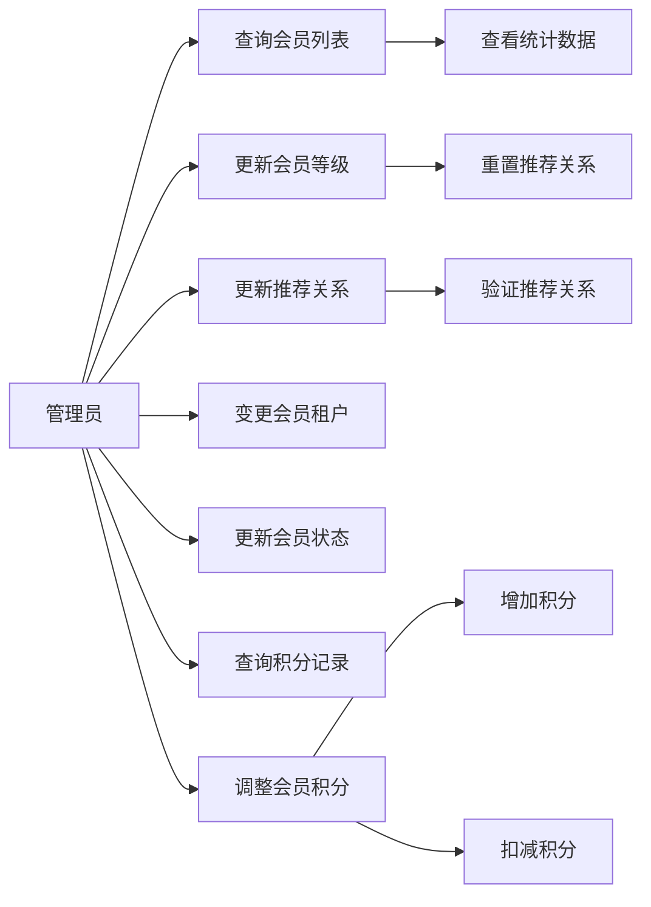
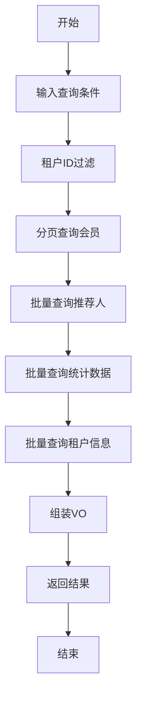
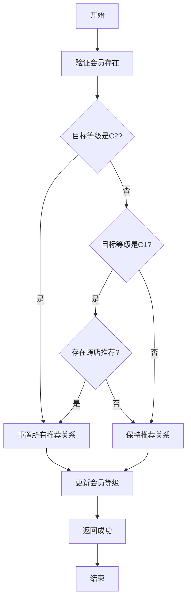
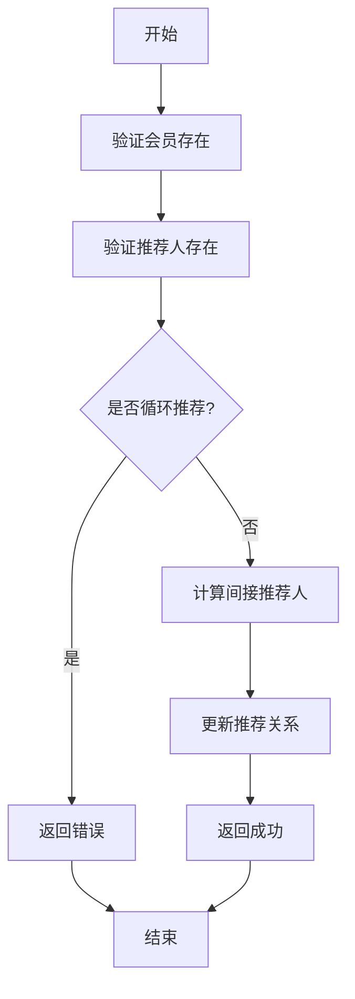
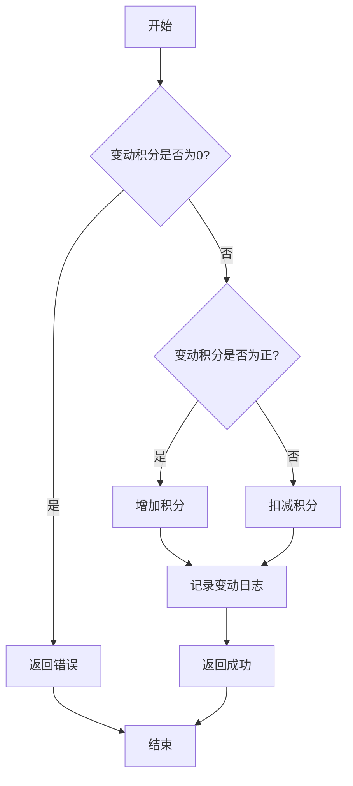
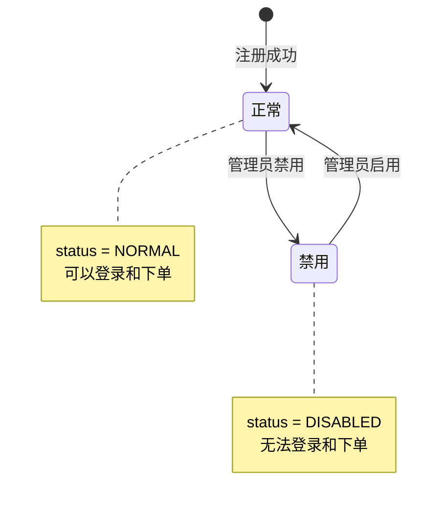
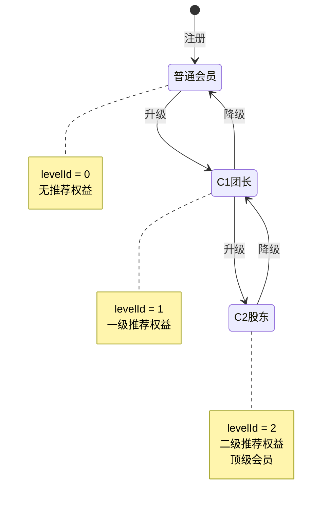
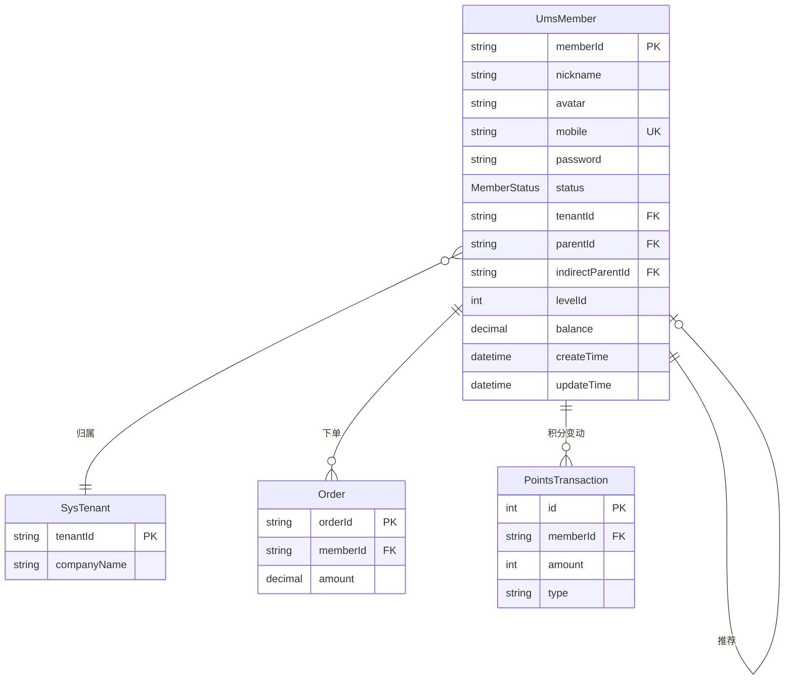

# 会员管理模块需求文档

## 1. 概述

### 1.1 模块简介

会员管理模块是C端用户管理的核心模块，负责会员的基础信息管理、等级管理、推荐关系管理、租户归属管理、积分管理以及统计分析。该模块支持多租户隔离，并提供完整的会员生命周期管理功能。

### 1.2 核心功能

- 会员列表查询（支持昵称、手机号筛选）
- 会员等级管理（普通会员、C1团长、C2股东）
- 会员推荐关系管理（C1/C2推荐链）
- 会员租户归属管理（门店归属）
- 会员状态管理（启用/禁用）
- 会员积分管理（查询记录、手动调整）
- 会员统计数据（消费金额、佣金、订单数）

### 1.3 业务价值

- 实现会员的统一管理和数据分析
- 支持多级推荐分销体系（C1/C2）
- 提供灵活的会员等级和权益管理
- 支持跨租户会员数据查询和管理
- 提供完整的会员积分管理能力
- 支持会员数据统计和分析

## 2. 用例分析

### 2.1 用例图

### 2.2 用例描述

#### UC-01: 查询会员列表

- 参与者: 管理员
- 前置条件: 用户已登录且具有 `admin:member:list` 权限
- 主流程:
  1. 管理员输入查询条件（昵称、手机号）
  2. 系统根据租户ID过滤数据（租户隔离）
  3. 系统分页查询会员基础信息
  4. 系统批量查询推荐人信息（直接推荐人、间接推荐人）
  5. 系统批量查询统计数据（消费金额、佣金）
  6. 系统批量查询租户信息
  7. 系统组装VO并返回
- 返回数据:
  - 会员基础信息（ID、昵称、头像、手机号、状态、创建时间）
  - 租户信息（租户ID、租户名称）
  - 推荐关系（推荐人ID、推荐人昵称、推荐人手机号）
  - 间接推荐关系（间接推荐人ID、间接推荐人昵称、间接推荐人手机号）
  - 统计数据（余额、佣金、消费总额、订单数）
  - 等级信息（等级ID、等级名称）
- 性能要求:
  - 使用批量查询避免N+1问题
  - 支持分页，默认每页10条

#### UC-02: 更新会员等级

- 参与者: 管理员
- 前置条件: 用户已登录且具有 `admin:member:level` 权限
- 主流程:
  1. 管理员选择会员并设置目标等级
  2. 系统验证会员是否存在
  3. 系统根据等级变更规则处理推荐关系
  4. 系统更新会员等级
  5. 返回更新成功
- 业务规则:
  - 升级到C2（股东）：重置所有推荐关系（股东为顶级）
  - 升级到C1（团长）：如果存在跨店推荐，则重置推荐关系
  - 降级：不自动处理推荐关系
- 异常流程:
  - 会员不存在：提示"会员不存在"

#### UC-03: 更新推荐关系

- 参与者: 管理员
- 前置条件: 用户已登录且具有 `admin:member:referrer` 权限
- 主流程:
  1. 管理员选择会员并设置新的推荐人
  2. 系统验证会员和推荐人是否存在
  3. 系统验证推荐关系是否合法（不能循环推荐）
  4. 系统计算间接推荐人（推荐人的推荐人）
  5. 系统更新推荐关系
  6. 返回更新成功
- 业务规则:
  - 不能将自己设置为推荐人
  - 不能形成循环推荐链
  - 间接推荐人自动计算（推荐人的推荐人）
- 异常流程:
  - 会员不存在：提示"会员不存在"
  - 推荐人不存在：提示"推荐人不存在"
  - 循环推荐：提示"不能形成循环推荐"

#### UC-04: 变更会员租户

- 参与者: 管理员
- 前置条件: 用户已登录且具有 `admin:member:tenant` 权限
- 主流程:
  1. 管理员选择会员并设置目标租户
  2. 系统验证目标租户是否存在
  3. 系统更新会员的租户ID
  4. 返回更新成功
- 业务规则:
  - 租户变更不影响推荐关系
  - 租户变更不影响会员等级
- 异常流程:
  - 目标租户不存在：提示"目标租户不存在"

#### UC-05: 更新会员状态

- 参与者: 管理员
- 前置条件: 用户已登录且具有 `admin:member:status` 权限
- 主流程:
  1. 管理员选择会员并设置状态（启用/禁用）
  2. 系统更新会员状态
  3. 返回更新成功
- 业务规则:
  - 禁用会员后，会员无法登录
  - 禁用会员后，会员无法下单
  - 禁用会员不影响已有订单

#### UC-06: 查询积分记录

- 参与者: 管理员
- 前置条件: 用户已登录且具有 `admin:member:list` 权限
- 主流程:
  1. 管理员选择会员查询积分记录
  2. 系统调用积分服务查询变动记录
  3. 系统分页返回积分变动记录
- 返回数据:
  - 记录ID
  - 会员ID
  - 变动积分
  - 变动后积分
  - 变动类型
  - 备注
  - 创建时间

#### UC-07: 调整会员积分

- 参与者: 管理员
- 前置条件: 用户已登录且具有 `admin:member:list` 权限
- 主流程:
  1. 管理员输入会员ID、变动积分、备注
  2. 系统验证变动积分不为0
  3. 如果变动积分为正数，系统增加积分
  4. 如果变动积分为负数，系统扣减积分
  5. 系统记录变动日志
  6. 返回调整成功
- 业务规则:
  - 变动积分不能为0
  - 扣减积分不能超过当前余额
  - 变动类型标记为"管理员调整"
- 异常流程:
  - 变动积分为0：提示"变动积分不能为0"
  - 余额不足：提示"积分余额不足"

## 3. 业务流程

### 3.1 查询会员列表流程

### 3.2 更新会员等级流程

### 3.3 更新推荐关系流程

### 3.4 调整会员积分流程

## 4. 状态管理

### 4.1 会员状态图

### 4.2 会员等级状态图

### 4.3 推荐关系状态说明

| 等级     | 推荐关系   | 说明                                 |
| -------- | ---------- | ------------------------------------ |
| 普通会员 | 可有推荐人 | 可以被推荐，不能推荐他人             |
| C1团长   | 可有推荐人 | 可以推荐他人，享受一级佣金           |
| C2股东   | 无推荐人   | 顶级会员，可以推荐他人，享受二级佣金 |

## 5. 数据模型

### 5.1 核心实体

#### 5.1.1 会员表（UmsMember）

| 字段             | 类型         | 必填 | 说明                      |
| ---------------- | ------------ | ---- | ------------------------- |
| memberId         | String       | 是   | 会员ID（主键）            |
| nickname         | String       | 是   | 昵称                      |
| avatar           | String       | 否   | 头像URL                   |
| mobile           | String       | 是   | 手机号（唯一）            |
| password         | String       | 否   | 密码（加密）              |
| status           | MemberStatus | 是   | 状态（NORMAL/DISABLED）   |
| tenantId         | String       | 是   | 所属租户ID                |
| parentId         | String       | 否   | 直接推荐人ID              |
| indirectParentId | String       | 否   | 间接推荐人ID              |
| levelId          | Int          | 是   | 会员等级（0普通 1C1 2C2） |
| balance          | Decimal      | 是   | 余额                      |
| createTime       | DateTime     | 是   | 创建时间                  |
| updateTime       | DateTime     | 是   | 更新时间                  |

### 5.2 实体关系图

## 6. 接口定义

### 6.1 接口列表

| 接口路径                    | 方法 | 权限                  | 说明         |
| --------------------------- | ---- | --------------------- | ------------ |
| /admin/member/list          | GET  | admin:member:list     | 查询会员列表 |
| /admin/member/level         | PUT  | admin:member:level    | 更新会员等级 |
| /admin/member/referrer      | PUT  | admin:member:referrer | 更新推荐关系 |
| /admin/member/tenant        | PUT  | admin:member:tenant   | 变更会员租户 |
| /admin/member/status        | PUT  | admin:member:status   | 更新会员状态 |
| /admin/member/point/history | GET  | admin:member:list     | 查询积分记录 |
| /admin/member/point/adjust  | POST | admin:member:list     | 调整会员积分 |

### 6.2 接口详细说明

#### 6.2.1 查询会员列表

- 请求方式: GET /admin/member/list
- 查询参数: ListMemberDto
- 响应: Result<{ rows: MemberVo[], total: number }>
- 业务规则:
  - 支持按昵称、手机号筛选
  - 租户隔离（非超管仅查询本租户数据）
  - 批量查询推荐人和统计数据
  - 分页查询，默认每页10条

#### 6.2.2 更新会员等级

- 请求方式: PUT /admin/member/level
- 请求体: UpdateMemberLevelDto
- 响应: Result<void>
- 业务规则:
  - 升级到C2重置推荐关系
  - 升级到C1且存在跨店推荐则重置
  - 使用事务确保数据一致性

#### 6.2.3 更新推荐关系

- 请求方式: PUT /admin/member/referrer
- 请求体: UpdateReferrerDto
- 响应: Result<void>
- 业务规则:
  - 验证推荐关系合法性
  - 自动计算间接推荐人
  - 使用事务确保数据一致性

#### 6.2.4 调整会员积分

- 请求方式: POST /admin/member/point/adjust
- 请求体: AdjustMemberPointsDto
- 响应: Result<void>
- 业务规则:
  - 变动积分不能为0
  - 正数增加，负数扣减
  - 记录变动类型为"管理员调整"

## 7. 非功能需求

### 7.1 性能要求

| 指标         | 要求          | 说明               |
| ------------ | ------------- | ------------------ |
| 接口响应时间 | P99 < 1000ms  | 列表查询级别       |
| 并发支持     | 支持100并发   | 会员管理为中频操作 |
| 批量查询优化 | 避免N+1问题   | 使用批量查询       |
| 分页深度     | offset ≤ 5000 | 超限抛错           |

### 7.2 安全要求

- 租户数据隔离（非超管仅查询本租户数据）
- 推荐关系验证（防止循环推荐）
- 积分调整权限控制
- 敏感信息脱敏（手机号部分隐藏）

### 7.3 数据一致性

- 更新操作使用@Transactional装饰器
- 推荐关系更新保证原子性
- 积分调整记录完整日志

### 7.4 可观测性

- 记录关键操作日志（等级变更、推荐关系变更、积分调整）
- 记录错误堆栈
- 统计会员数据变化趋势

### 7.5 扩展性

- 支持自定义会员等级
- 支持多级推荐体系扩展
- 支持会员标签和分组
- 支持会员行为分析

## 8. 业务规则

### 8.1 会员等级规则

| 等级     | levelId | 名称     | 推荐权益 | 推荐关系         |
| -------- | ------- | -------- | -------- | ---------------- |
| 普通会员 | 0       | 普通会员 | 无       | 可有推荐人       |
| C1团长   | 1       | C1团长   | 一级佣金 | 可有推荐人       |
| C2股东   | 2       | C2股东   | 二级佣金 | 无推荐人（顶级） |

### 8.2 推荐关系规则

- 直接推荐人（parentId）：推荐该会员的上级
- 间接推荐人（indirectParentId）：推荐人的推荐人
- C2股东无推荐人（顶级会员）
- 不能形成循环推荐链
- 跨店推荐：推荐人和被推荐人属于不同租户

### 8.3 等级变更规则

- 升级到C2：重置所有推荐关系（parentId和indirectParentId设为null）
- 升级到C1且存在跨店推荐：重置推荐关系
- 升级到C1且同店推荐：保持推荐关系
- 降级：不自动处理推荐关系

### 8.4 租户归属规则

- 会员创建时绑定租户
- 管理员可变更会员租户
- 租户变更不影响推荐关系
- 租户变更不影响会员等级

### 8.5 积分调整规则

- 变动积分不能为0
- 正数增加积分，负数扣减积分
- 扣减积分不能超过当前余额
- 变动类型标记为"EARN_ADMIN"或"DEDUCT_ADMIN"
- 记录调整原因

## 9. 异常处理

### 9.1 业务异常

| 异常场景       | 错误码         | 错误信息         |
| -------------- | -------------- | ---------------- |
| 会员不存在     | BUSINESS_ERROR | 会员不存在       |
| 推荐人不存在   | BUSINESS_ERROR | 推荐人不存在     |
| 循环推荐       | BUSINESS_ERROR | 不能形成循环推荐 |
| 目标租户不存在 | BUSINESS_ERROR | 目标租户不存在   |
| 变动积分为0    | PARAM_INVALID  | 变动积分不能为0  |
| 积分余额不足   | BUSINESS_ERROR | 积分余额不足     |

### 9.2 异常处理策略

- 使用BusinessException抛出业务异常
- 使用BusinessException.throwIfNull验证对象存在
- 使用BusinessException.throwIf验证条件
- 事务操作失败自动回滚
- 记录详细错误日志

## 10. 测试要点

### 10.1 单元测试

- 推荐关系验证逻辑
- 间接推荐人计算逻辑
- 等级变更规则
- 积分调整逻辑
- 批量查询优化

### 10.2 集成测试

- 查询会员列表完整流程
- 更新会员等级完整流程
- 更新推荐关系完整流程
- 调整会员积分完整流程

### 10.3 边界测试

- 会员不存在
- 推荐人不存在
- 循环推荐
- 变动积分为0
- 积分余额不足
- 跨店推荐

### 10.4 性能测试

- 批量查询会员性能
- 批量查询统计数据性能
- 分页查询大量会员性能

## 11. 缺陷与改进建议

### 11.1 已识别缺陷

| 优先级 | 缺陷描述             | 影响                 | 建议             |
| ------ | -------------------- | -------------------- | ---------------- |
| P2     | 缺少会员详情查询接口 | 无法查看单个会员详情 | 添加详情查询接口 |
| P2     | 缺少会员导出功能     | 无法导出会员数据     | 添加导出功能     |
| P2     | 缺少会员标签功能     | 无法对会员分类管理   | 添加标签功能     |
| P3     | 缺少会员行为分析     | 无法分析会员行为     | 添加行为分析功能 |
| P3     | 缺少会员等级自动升级 | 需手动调整等级       | 添加自动升级规则 |

### 11.2 改进建议

1. 会员详情增强
   - 添加会员详情查询接口
   - 显示会员完整信息
   - 显示推荐树结构
   - 显示消费和佣金明细

2. 会员导出
   - 支持按条件导出会员数据
   - 支持导出推荐关系
   - 支持导出统计数据

3. 会员标签
   - 支持自定义标签
   - 支持批量打标签
   - 支持按标签筛选

4. 会员分析
   - 会员增长趋势
   - 会员活跃度分析
   - 会员消费分析
   - 推荐效果分析

## 12. 依赖关系

### 12.1 上游依赖

- 认证模块：提供用户登录和权限验证
- 租户管理模块：提供租户信息
- 积分服务：提供积分管理功能

### 12.2 下游依赖

- 订单模块：使用会员信息
- 佣金模块：使用推荐关系
- 营销模块：使用会员等级

### 12.3 外部依赖

- Prisma ORM：数据库访问
- class-validator：DTO验证
- NestJS：框架支持

## 13. 版本历史

| 版本 | 日期       | 作者   | 变更说明                                                 |
| ---- | ---------- | ------ | -------------------------------------------------------- |
| 1.0  | 2026-02-22 | System | 初始版本，包含会员CRUD、等级管理、推荐关系管理、积分管理 |
