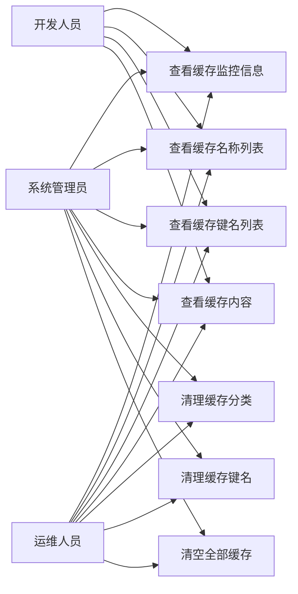
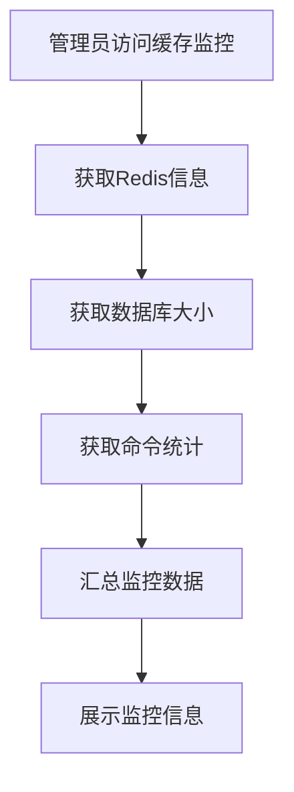
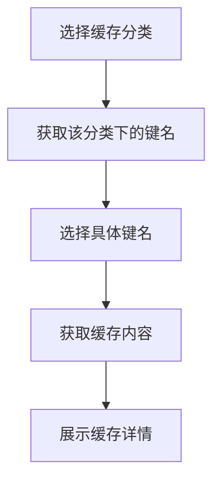
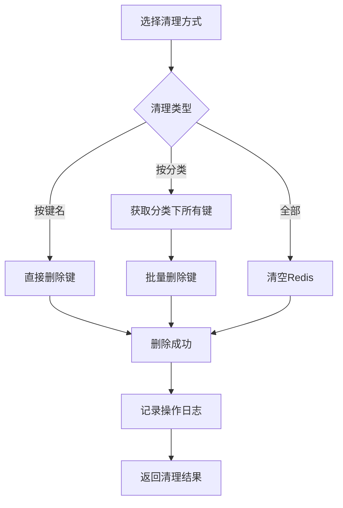
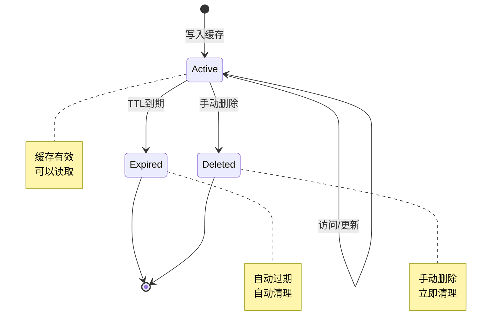

# 缓存管理模块需求文档

## 1. 概述

### 1.1 背景

缓存管理模块用于监控和管理Redis缓存，帮助管理员了解缓存使用情况、查看缓存内容、清理缓存数据。通过可视化的缓存管理，可以及时发现缓存问题、优化缓存策略、保障系统性能。

### 1.2 目标

- 实时监控Redis缓存状态和性能指标
- 查看缓存分类和键名列表
- 查看具体缓存内容
- 支持按分类或键名清理缓存
- 支持清空所有缓存
- 提供缓存命令统计分析

### 1.3 范围

本文档涵盖缓存监控信息查询、缓存名称列表、缓存键名列表、缓存内容查看、缓存清理等功能，不包括缓存配置、缓存策略等功能。

## 2. 角色与用例

### 2.1 角色定义

| 角色       | 说明                         |
| ---------- | ---------------------------- |
| 系统管理员 | 拥有缓存查看和清理的完整权限 |
| 运维人员   | 拥有缓存查看和清理的权限     |
| 开发人员   | 拥有缓存查看权限，用于调试   |

### 2.2 用例图



## 3. 业务流程

### 3.1 缓存监控流程



### 3.2 缓存查看流程



### 3.3 缓存清理流程



## 4. 状态说明

### 4.1 缓存状态

缓存数据在Redis中的状态：



## 5. 功能需求

### 5.1 缓存监控信息

#### 5.1.1 Redis信息

- 获取Redis服务器信息（INFO命令）
- 包含以下信息：
  - Server：服务器信息（版本、运行模式等）
  - Clients：客户端连接信息
  - Memory：内存使用情况
  - Persistence：持久化信息
  - Stats：统计信息
  - Replication：主从复制信息
  - CPU：CPU使用情况
  - Keyspace：键空间信息

#### 5.1.2 数据库大小

- 获取当前数据库的键数量（DBSIZE命令）
- 实时反映缓存数据量

#### 5.1.3 命令统计

- 获取Redis命令执行统计（INFO commandstats）
- 显示各命令的调用次数
- 用于分析缓存使用模式

### 5.2 缓存名称列表

#### 5.2.1 预定义分类

系统预定义以下缓存分类：

| 缓存名称     | 前缀           | 说明         |
| ------------ | -------------- | ------------ |
| 用户信息     | login_tokens:  | 登录Token    |
| 配置信息     | sys_config:    | 系统配置     |
| 数据字典     | sys_dict:      | 字典数据     |
| 验证码       | captcha_codes: | 图形验证码   |
| 防重提交     | repeat_submit: | 防重复提交   |
| 限流处理     | rate_limit:    | 接口限流     |
| 密码错误次数 | pwd_err_cnt:   | 登录失败计数 |

#### 5.2.2 分类信息

每个分类包含：

- cacheName：缓存名称前缀
- remark：分类说明

### 5.3 缓存键名列表

- 根据缓存名称前缀获取所有键名
- 使用KEYS命令匹配前缀
- 返回完整的键名列表

### 5.4 缓存内容查看

- 根据缓存名称和键名获取缓存内容
- 使用GET命令读取缓存值
- 将缓存值JSON序列化后展示
- 显示缓存分类、键名、内容、说明

### 5.5 缓存清理

#### 5.5.1 清理缓存分类

- 根据缓存名称前缀清理该分类下的所有缓存
- 先获取所有匹配的键名
- 批量删除所有键
- 记录操作日志

#### 5.5.2 清理缓存键名

- 根据完整键名删除单个缓存
- 使用DEL命令删除
- 记录操作日志

#### 5.5.3 清空全部缓存

- 清空Redis中的所有数据
- 使用FLUSHDB命令
- 高危操作，需二次确认
- 记录操作日志

## 6. 数据模型

### 6.1 缓存分类定义

```typescript
interface CacheCategory {
  cacheName: string; // 缓存名称前缀
  cacheKey: string; // 缓存键名（查询时填充）
  cacheValue: string; // 缓存内容（查询时填充）
  remark: string; // 分类说明
}
```

### 6.2 缓存监控信息

```typescript
interface CacheInfo {
  info: Record<string, string>; // Redis INFO信息
  dbSize: number; // 数据库大小
  commandStats: Array<{
    // 命令统计
    name: string; // 命令名称
    value: number; // 调用次数
  }>;
}
```

### 6.3 Redis存储结构

```
# 用户Token
Key: login_tokens:{token}
Value: JSON对象
TTL: 7天

# 系统配置
Key: sys_config:{configKey}
Value: 配置值
TTL: 永久

# 数据字典
Key: sys_dict:{dictType}
Value: JSON数组
TTL: 永久

# 验证码
Key: captcha_codes:{uuid}
Value: 验证码文本
TTL: 5分钟

# 防重提交
Key: repeat_submit:{userId}:{businessKey}
Value: 1
TTL: 5秒

# 限流
Key: rate_limit:{ip}:{api}
Value: 访问次数
TTL: 1分钟

# 密码错误次数
Key: pwd_err_cnt:{username}
Value: 错误次数
TTL: 10分钟
```

## 7. 非功能需求

### 7.1 性能要求

- 缓存监控信息查询响应时间 < 500ms
- 缓存键名列表查询响应时间 < 1s
- 缓存内容查看响应时间 < 100ms
- 缓存清理响应时间 < 2s

### 7.2 可用性要求

- 缓存管理服务可用性 >= 99.5%
- Redis故障时提供降级方案
- 清理操作失败不影响其他功能

### 7.3 安全要求

- 缓存查看需权限控制
- 缓存清理需权限控制
- 清空全部缓存需二次确认
- 所有清理操作需记录日志

### 7.4 可维护性要求

- 缓存分类可配置
- 支持添加新的缓存分类
- 提供缓存使用统计

## 8. 验收标准

### 8.1 功能验收

- [ ] 能正确显示Redis监控信息
- [ ] 能正确显示缓存分类列表
- [ ] 能正确显示缓存键名列表
- [ ] 能正确显示缓存内容
- [ ] 清理缓存分类功能正常
- [ ] 清理缓存键名功能正常
- [ ] 清空全部缓存功能正常

### 8.2 性能验收

- [ ] 监控信息查询响应时间 < 500ms
- [ ] 键名列表查询响应时间 < 1s
- [ ] 缓存内容查看响应时间 < 100ms

### 8.3 安全验收

- [ ] 权限控制生效
- [ ] 清理操作已记录日志
- [ ] 清空全部缓存需二次确认

## 9. 约束与限制

### 9.1 技术约束

- 基于NestJS框架
- 依赖Redis服务
- 使用RedisService封装Redis操作

### 9.2 业务约束

- 仅支持预定义的缓存分类
- 缓存内容以JSON格式展示
- 清空全部缓存影响所有功能

### 9.3 数据约束

- 使用KEYS命令可能影响Redis性能
- 大量键名查询可能超时
- 缓存内容大小受Redis限制

## 10. 依赖关系

### 10.1 上游依赖

- Redis服务：缓存数据存储
- RedisService：Redis操作封装

### 10.2 下游依赖

- 操作日志模块：记录清理操作

## 11. 风险与问题

### 11.1 性能风险

- **风险**：使用KEYS命令可能阻塞Redis
- **缓解措施**：
  - 限制键名数量
  - 考虑使用SCAN命令
  - 添加超时控制

### 11.2 安全风险

- **风险**：误操作清空全部缓存导致系统异常
- **缓解措施**：
  - 二次确认
  - 权限控制
  - 操作审计

### 11.3 可用性风险

- **风险**：Redis故障导致缓存管理不可用
- **缓解措施**：
  - Redis主从部署
  - 提供降级方案
  - 监控Redis可用性

## 12. 后续规划

### 12.1 短期规划

- 实现基本的缓存查看和清理功能
- 完善权限控制
- 优化查询性能

### 12.2 中期规划

- 支持自定义缓存分类
- 提供缓存使用统计
- 支持缓存内容编辑

### 12.3 长期规划

- 支持缓存可视化分析
- 提供缓存优化建议
- 支持缓存预热功能
