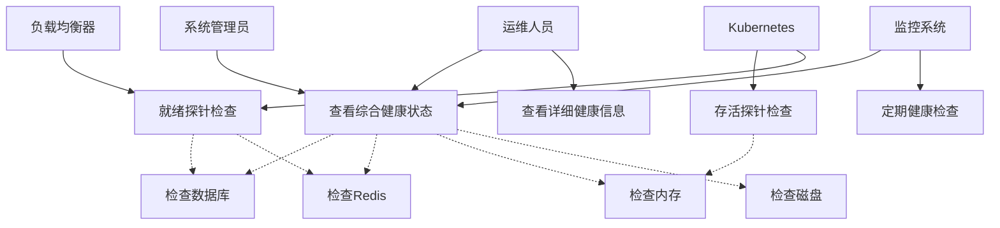
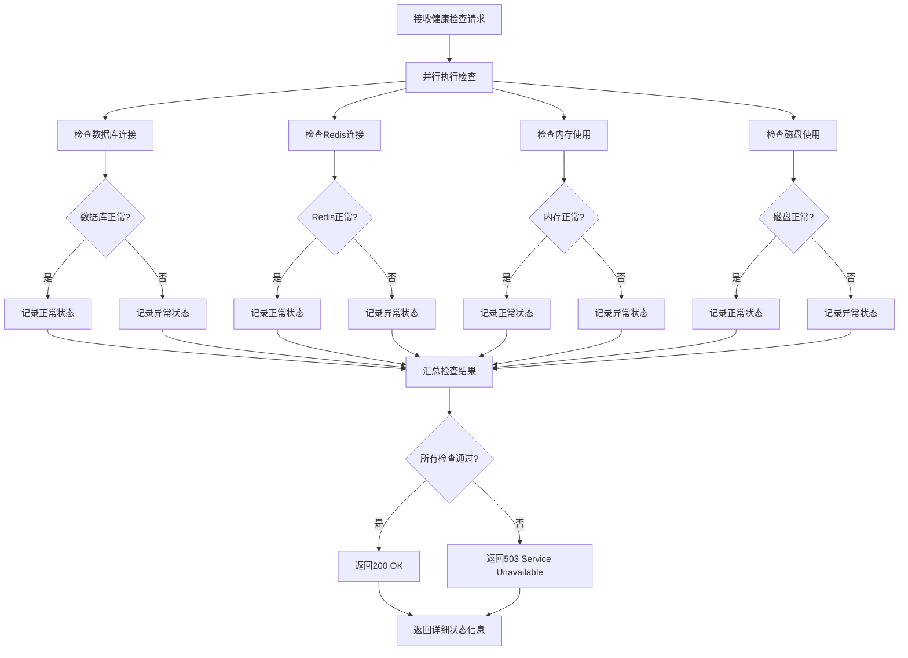
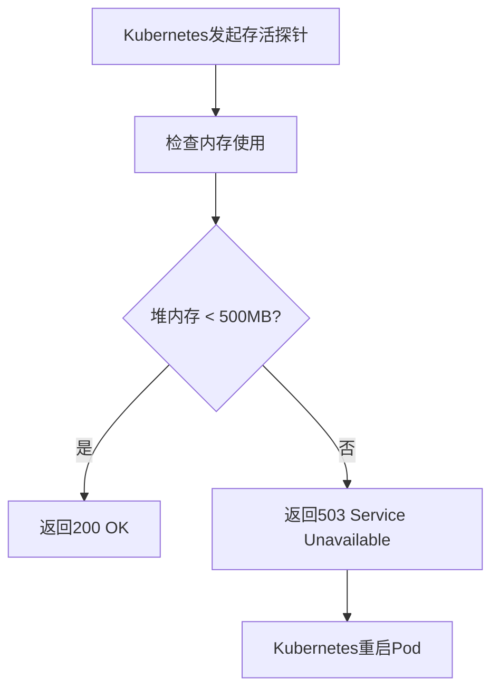
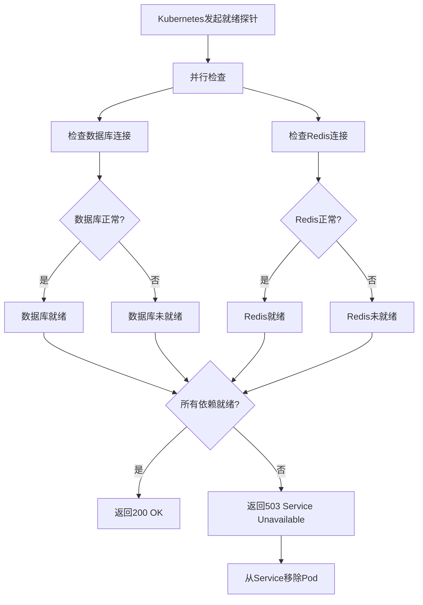

# 健康检查模块 - 需求文档

## 1. 概述

### 1.1 背景

健康检查模块是系统监控的核心组件，用于监控应用程序及其依赖服务的健康状态。通过标准化的健康检查接口，支持Kubernetes等容器编排平台的存活探针（Liveness Probe）和就绪探针（Readiness Probe），确保应用的高可用性和自动故障恢复。

### 1.2 目标

- 提供标准化的健康检查接口（符合Kubernetes规范）
- 实时监控数据库连接状态
- 实时监控Redis连接状态
- 监控内存使用情况（防止内存溢出）
- 监控磁盘使用情况（防止磁盘满）
- 支持Kubernetes存活探针（Liveness Probe）
- 支持Kubernetes就绪探针（Readiness Probe）
- 提供详细的健康状态信息

### 1.3 范围

**包含功能**：

- 综合健康检查（/health）
- 存活探针（/health/liveness）
- 就绪探针（/health/readiness）
- 数据库健康检查
- Redis健康检查
- 内存健康检查
- 磁盘健康检查

**不包含功能**：

- 业务指标监控（由metrics模块负责）
- 日志收集（由日志系统负责）
- 告警通知（由告警系统负责）
- 性能分析（由APM系统负责）

## 2. 角色与用例

### 2.1 角色定义

| 角色       | 说明                 | 权限范围             |
| ---------- | -------------------- | -------------------- |
| 系统管理员 | 查看应用健康状态     | 访问所有健康检查接口 |
| 运维人员   | 监控应用健康状态     | 访问所有健康检查接口 |
| Kubernetes | 通过探针检查应用状态 | 访问存活和就绪探针   |
| 监控系统   | 定期调用健康检查接口 | 访问综合健康检查接口 |
| 负载均衡器 | 判断实例是否可用     | 访问就绪探针         |

### 2.2 用例图



## 3. 业务流程

### 3.1 综合健康检查流程



### 3.2 存活探针检查流程



### 3.3 就绪探针检查流程



## 4. 状态说明

### 4.1 健康状态定义

| 状态   | HTTP状态码 | 说明             | 处理方式         |
| ------ | ---------- | ---------------- | ---------------- |
| 健康   | 200        | 所有检查项通过   | 正常服务         |
| 不健康 | 503        | 至少一项检查失败 | 告警、重启或移除 |

### 4.2 检查项状态

| 检查项 | 正常条件      | 异常条件       | 影响         |
| ------ | ------------- | -------------- | ------------ |
| 数据库 | 连接成功      | 连接失败或超时 | 应用不可用   |
| Redis  | 连接成功      | 连接失败或超时 | 缓存不可用   |
| 内存   | 堆内存 < 阈值 | 堆内存 >= 阈值 | 可能OOM      |
| 磁盘   | 使用率 < 90%  | 使用率 >= 90%  | 可能写入失败 |

## 5. 功能需求

### 5.1 综合健康检查

**接口**: GET /health

**功能描述**：
检查应用及其所有依赖服务的健康状态，返回详细的健康信息。

**检查项**：

1. 数据库连接检查
   - 执行简单查询（SELECT 1）
   - 超时时间：5秒
   - 失败判定：连接失败或查询超时

2. Redis连接检查
   - 执行PING命令
   - 超时时间：3秒
   - 失败判定：连接失败或PING超时

3. 内存使用检查
   - 检查堆内存使用量
   - 阈值：300MB
   - 失败判定：堆内存 >= 300MB

4. 磁盘使用检查
   - 检查磁盘使用率
   - 阈值：90%
   - 失败判定：使用率 >= 90%

**返回信息**：

```json
{
  "status": "ok" | "error",
  "info": {
    "database": {
      "status": "up" | "down"
    },
    "redis": {
      "status": "up" | "down"
    },
    "memory_heap": {
      "status": "up" | "down"
    },
    "disk": {
      "status": "up" | "down"
    }
  },
  "error": {
    // 失败的检查项详情
  },
  "details": {
    // 所有检查项详情
  }
}
```

### 5.2 存活探针

**接口**: GET /health/liveness

**功能描述**：
用于Kubernetes判断应用是否存活。如果检查失败，Kubernetes将重启Pod。

**检查项**：

1. 内存检查
   - 检查堆内存使用量
   - 阈值：500MB（比综合检查更宽松）
   - 失败判定：堆内存 >= 500MB

**设计考虑**：

- 阈值设置较高，避免频繁重启
- 仅检查内存，避免因依赖服务问题导致重启
- 响应时间要快（< 1秒）

**Kubernetes配置示例**：

```yaml
livenessProbe:
  httpGet:
    path: /health/liveness
    port: 3000
  initialDelaySeconds: 30
  periodSeconds: 10
  timeoutSeconds: 5
  failureThreshold: 3
```

### 5.3 就绪探针

**接口**: GET /health/readiness

**功能描述**：
用于Kubernetes判断应用是否就绪。如果检查失败，Kubernetes将从Service中移除Pod，不再转发流量。

**检查项**：

1. 数据库连接检查
   - 执行简单查询（SELECT 1）
   - 超时时间：5秒

2. Redis连接检查
   - 执行PING命令
   - 超时时间：3秒

**设计考虑**：

- 检查关键依赖服务
- 不检查内存和磁盘（避免因资源问题移除Pod）
- 响应时间要快（< 5秒）

**Kubernetes配置示例**：

```yaml
readinessProbe:
  httpGet:
    path: /health/readiness
    port: 3000
  initialDelaySeconds: 10
  periodSeconds: 5
  timeoutSeconds: 3
  failureThreshold: 2
```

### 5.4 数据库健康检查

**检查方法**：

```sql
SELECT 1
```

**超时时间**：5秒

**失败场景**：

- 数据库服务不可用
- 网络连接失败
- 查询超时
- 连接池耗尽

**恢复策略**：

- 自动重试（最多3次）
- 重试间隔：1秒
- 记录错误日志

### 5.5 Redis健康检查

**检查方法**：

```
PING
```

**超时时间**：3秒

**失败场景**：

- Redis服务不可用
- 网络连接失败
- PING超时
- 连接池耗尽

**恢复策略**：

- 自动重试（最多3次）
- 重试间隔：1秒
- 记录错误日志

### 5.6 内存健康检查

**检查指标**：

- 堆内存使用量（process.memoryUsage().heapUsed）
- 堆内存总量（process.memoryUsage().heapTotal）
- 使用率（heapUsed / heapTotal）

**阈值配置**：

- 综合检查：300MB
- 存活探针：500MB

**失败场景**：

- 内存泄漏
- 大量对象创建
- 缓存过大

**恢复策略**：

- 触发垃圾回收
- 清理缓存
- 重启应用（Kubernetes自动）

### 5.7 磁盘健康检查

**检查指标**：

- 磁盘使用量
- 磁盘总量
- 使用率

**阈值配置**：

- 使用率：90%

**失败场景**：

- 日志文件过大
- 临时文件未清理
- 数据文件增长

**恢复策略**：

- 清理日志文件
- 清理临时文件
- 告警通知运维

## 6. 非功能需求

### 6.1 性能要求

| 指标                 | 要求         | 说明                 |
| -------------------- | ------------ | -------------------- |
| 综合健康检查响应时间 | P99 < 1000ms | 包含所有检查项       |
| 存活探针响应时间     | P99 < 100ms  | 仅检查内存           |
| 就绪探针响应时间     | P99 < 500ms  | 检查数据库和Redis    |
| 并发请求             | 支持100+     | 多个监控系统同时调用 |

### 6.2 可用性要求

- 健康检查接口可用性：99.9%
- 健康检查失败不影响业务功能
- 支持服务重启后自动恢复
- 支持依赖服务故障时的降级

### 6.3 安全要求

- 健康检查接口不需要认证（内网访问）
- 建议通过网络策略限制访问来源
- 不暴露敏感信息（如数据库密码）
- 错误信息不包含堆栈跟踪

### 6.4 兼容性要求

- 兼容Kubernetes 1.16+
- 兼容Docker健康检查
- 兼容AWS ELB健康检查
- 兼容Nginx健康检查

### 6.5 可观测性要求

- 记录健康检查日志
- 记录检查失败原因
- 提供详细的错误信息
- 支持调试模式

## 7. 验收标准

### 7.1 功能验收

- [ ] 综合健康检查功能正常
- [ ] 存活探针功能正常
- [ ] 就绪探针功能正常
- [ ] 数据库检查准确
- [ ] Redis检查准确
- [ ] 内存检查准确
- [ ] 磁盘检查准确
- [ ] 所有检查项并行执行
- [ ] 返回详细的健康信息

### 7.2 性能验收

- [ ] 综合健康检查响应时间 < 1秒
- [ ] 存活探针响应时间 < 100ms
- [ ] 就绪探针响应时间 < 500ms
- [ ] 支持100个并发请求

### 7.3 Kubernetes集成验收

- [ ] 存活探针配置正确
- [ ] 就绪探针配置正确
- [ ] 探针失败时Pod行为正确
- [ ] 探针恢复时Pod行为正确

### 7.4 异常处理验收

- [ ] 数据库故障时返回不健康状态
- [ ] Redis故障时返回不健康状态
- [ ] 内存超限时返回不健康状态
- [ ] 磁盘满时返回不健康状态
- [ ] 依赖服务恢复后自动恢复健康状态

## 8. 接口清单

### 8.1 健康检查接口

| 接口路径          | 方法 | 说明         | 认证   |
| ----------------- | ---- | ------------ | ------ |
| /health           | GET  | 综合健康检查 | 不需要 |
| /health/liveness  | GET  | 存活探针     | 不需要 |
| /health/readiness | GET  | 就绪探针     | 不需要 |

## 9. 数据字典

### 9.1 健康状态

| 值    | 说明   |
| ----- | ------ |
| ok    | 健康   |
| error | 不健康 |

### 9.2 检查项状态

| 值   | 说明 |
| ---- | ---- |
| up   | 正常 |
| down | 异常 |

## 10. 约束与限制

### 10.1 业务约束

- 健康检查接口建议仅内网访问
- 检查超时时间不可过长（避免阻塞）
- 阈值配置需要根据实际情况调整
- 不建议在健康检查中执行复杂逻辑

### 10.2 技术约束

- 使用@nestjs/terminus库实现
- 检查项必须支持超时控制
- 检查项必须支持并行执行
- 错误信息不包含敏感数据

### 10.3 性能约束

- 综合健康检查响应时间 < 1秒
- 存活探针响应时间 < 100ms
- 就绪探针响应时间 < 500ms
- 内存检查开销 < 1MB

## 11. 依赖关系

### 11.1 外部依赖

- @nestjs/terminus：健康检查框架
- @nestjs/typeorm：数据库健康检查
- ioredis：Redis健康检查
- diskusage：磁盘使用检查

### 11.2 内部依赖

- PrismaService：数据库连接
- RedisService：Redis连接

## 12. 集成方案

### 12.1 Kubernetes集成

**Deployment配置示例**：

```yaml
apiVersion: apps/v1
kind: Deployment
metadata:
  name: nest-admin
spec:
  template:
    spec:
      containers:
        - name: app
          image: nest-admin:latest
          ports:
            - containerPort: 3000
          livenessProbe:
            httpGet:
              path: /health/liveness
              port: 3000
            initialDelaySeconds: 30
            periodSeconds: 10
            timeoutSeconds: 5
            failureThreshold: 3
          readinessProbe:
            httpGet:
              path: /health/readiness
              port: 3000
            initialDelaySeconds: 10
            periodSeconds: 5
            timeoutSeconds: 3
            failureThreshold: 2
```

### 12.2 Docker健康检查

**Dockerfile配置示例**：

```dockerfile
HEALTHCHECK --interval=30s --timeout=3s --start-period=40s --retries=3 \
  CMD curl -f http://localhost:3000/health || exit 1
```

### 12.3 监控系统集成

**Prometheus配置示例**：

```yaml
scrape_configs:
  - job_name: 'nest-admin-health'
    metrics_path: '/health'
    scrape_interval: 30s
    static_configs:
      - targets: ['localhost:3000']
```

## 13. 术语表

| 术语       | 说明                                         |
| ---------- | -------------------------------------------- |
| 健康检查   | Health Check，检查应用及其依赖服务的健康状态 |
| 存活探针   | Liveness Probe，判断应用是否存活             |
| 就绪探针   | Readiness Probe，判断应用是否就绪            |
| 堆内存     | Heap Memory，Node.js进程使用的堆内存         |
| 磁盘使用率 | Disk Usage，磁盘已使用空间占总空间的百分比   |

---

**文档版本**: 1.0  
**编写日期**: 2026-02-23  
**编写人**: AI Assistant
